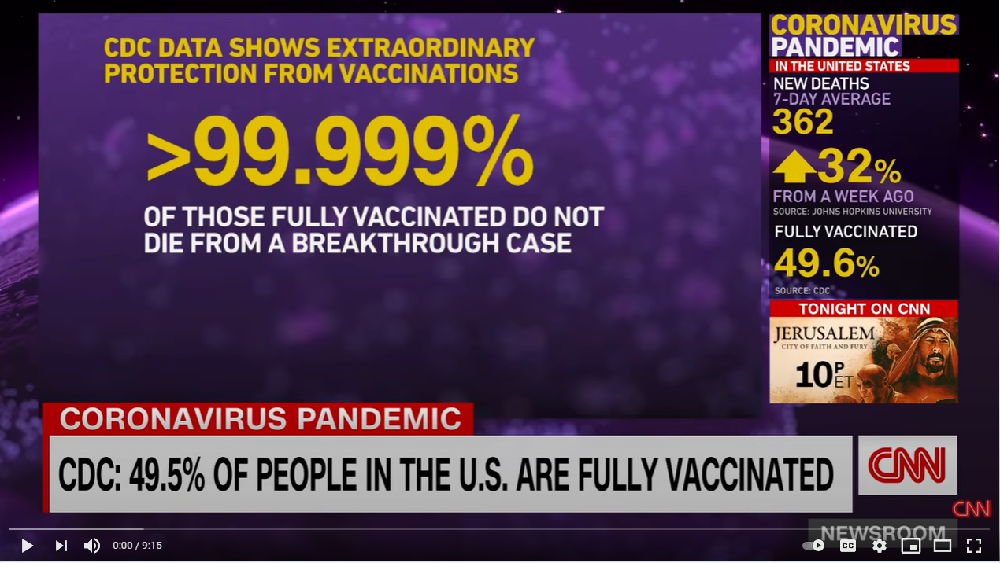
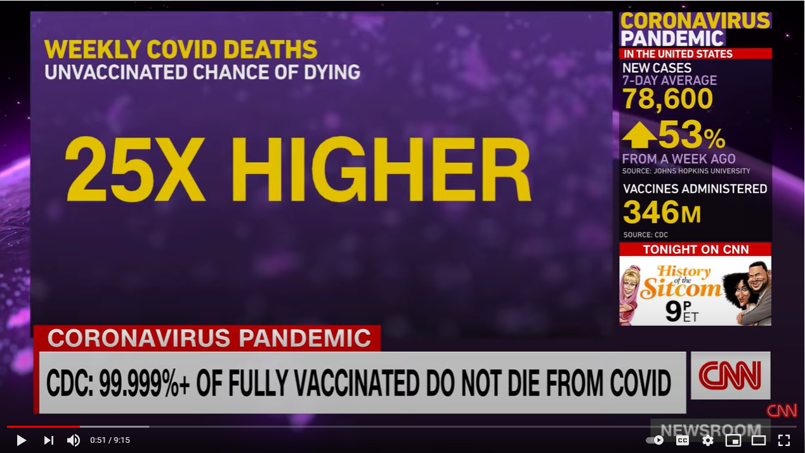

{width="8.26736111111111in"
height="5.365972222222222in"}{width="1.5748031496062993in"
height="1.5748031496062993in"}

### Logical Speaking Course Objectives

The goals of this course are for students to:

1.  Learn how to structure a logical argument. This includes:

    a.  Expressing a clear opinion.

    b.  Developing and expressing strongly connected reasons.

    c.  Presenting supporting evidence.

2.  Identify bias in a news report.

3.  Understand the difference between facts and fake news.

4.  Apply the concepts of logical reasoning in a meeting simulation.

## 

## An Introduction to Logical Speaking

Here are some key concepts we will refer to throughout this course. Read
and discuss them with your instructor so you can understand each of them
clearly.

A.  **Logical speaking** is the combination of two things: speaking
    clearly and reasoning logically.

B.  **Speaking clearly** refers to the organization of your speech so
    that your ideas are clearly connected and easily understood by your
    audience.

C.  **Reasoning logically** refers to the connection of your ideas and
    how you form your opinions. Reasoning is your thought process.

D.  An **opinion** is an idea which is the result of your thinking
    process based on the **evidence** you have access to.

E.  **Evidence** is the information you have which makes you believe
    something is true. There are many types of evidence. Some of them
    are more valuable than others.

F.  When you can speak logically, you can **persuade** your colleagues
    and your counterparts to accept your ideas. This process of
    persuading others is called **argument**. We use argument to show
    that something is true, or correct.

G.  Argument is not **debate**. Argument shows the depth of your
    understanding of a topic. The goal of argument is to persuade, not
    to win points by taking a strong position.

### The Parthenon: A Metaphor for Argument

{width="3.413969816272966in"
height="2.559055118110236in"}

Built in Greece between 447 and 438 BC, the Parthenon remains the most
important surviving building of classical Greece. Because of its ability
to endure for more than 2,500 years, the Parthenon is seen as an example
of strength, durability and robustness and is often used to explain the
concepts of argument. The idea of argument also came from classical
Greece. Aristotle (384--322BC), often called 'the father of logic',
described logical reasoning in his writings, and today we still refer to
many of his ideas.

### The ORE Framework

#### Activity 1

A.  The Parthenon has three main parts: the foundation, the columns, and
    the roof. Together, they form a commonly used model to represent
    argument. Which part of the Parthenon (the foundation, the columns
    or the roof) represents:

- Opinion?

- Reasons?

- Evidence?

B.  Using the Parthenon as a model, can you explain the process of
    logical argument? Think about the size and volume of the foundation
    and its purpose, the number of columns and how they support the
    roof. Also, think about the order in which the Parthenon was built.
    Is there a similarity between how the Parthenon was built, and how
    opinions, ideas and argument develop? Further, think about how
    important the connections are between the foundation and the
    columns, and the columns and the roof. What does that mean about
    argument?

#### Activity 2

A.  Read the example of an ORE argument below:

> As far as I'm concerned, the government should mandate COVID-19
> vaccinations. The reason for this is clear: The longer most of the
> population goes unvaccinated, the greater chance there is of dangerous
> variants developing which could get past the current vaccines, making
> the current vaccines effectively useless. Already the Delta variant
> has proven very difficult to manage. All over the world we are
> starting to see breakthrough infections (vaccinated people contracting
> the disease). The World Health Organisation already lists four
> variants of concern (alpha, beta, gamma and delta), and more are sure
> to come. It's essential that we increase the number of vaccinated
> people to reduce the opportunity for viral variants to develop, and
> the only way to do that is to make it a requirement for all citizens
> to get the vaccine.

B.  Can you identify:

- The opinion statement?

- The reason?

- The evidence?

C.  Is the argument logical? Explain.

#### Activity 3

Do you agree with the argument above? Why? Why not? Give your opinion
with a reason, and if possible, provide evidence to support it.

##  Expressing Your Opinion

**Opinion** is defined in the Oxford Learner's Dictionary as:

1.  Your feelings or thoughts about somebody/something, rather than a
    fact.

2.  The beliefs or views of a group of people.

3.  Advice from a professional person.

There are **three** important points we can learn from this:

1)  Opinion can be private or public -- you can have your own opinion,
    or you can share an opinion with others.

2)  Opinion is not fact.

3)  Opinion can be feelings, thoughts, beliefs, views or an expert's
    advice.

#### Activity

A.  What phrases do you commonly use to express your opinion in English?

B.  Read the following opinion phrases. Then, underline the part or
    parts of the sentences above which indicate the speaker is sharing
    an opinion. Give each phrase a rating from 1 to 5, where 1 is very
    weak and 5 is very strong.

+-------------------------------------------------------------+
| a)  In my opinion, managers should let staff make mistakes. |
|     This is how people learn.                               |
+=============================================================+
| b)  As far as I'm concerned, the best way to improve sales  |
|     is to increase advertising.                             |
+-------------------------------------------------------------+
| c)  From my point of view, we need to cut the number of     |
|     staff to reduce costs.                                  |
+-------------------------------------------------------------+
| d)  I believe the only option we have is to downsize if we  |
|     want to survive this crisis.                            |
+-------------------------------------------------------------+
| e)  It seems as though we didn't do enough to promote the   |
|     product effectively.                                    |
+-------------------------------------------------------------+
| f)  There is no doubt that we need to increase our product  |
|     range to attract more customers.                        |
+-------------------------------------------------------------+
| g)  I feel the best option is to do nothing. Everything is  |
|     going well so far.                                      |
+-------------------------------------------------------------+
| h)  I'm sure that we will be successful if we follow        |
|     through with my plan.                                   |
+-------------------------------------------------------------+

C.  Choose from the following broad topics and practice making opinion
    statements. Try to make statements of varied strength.

+-------------------------+-------------------------+
| Business Topics         | General Topics          |
+=========================+=========================+
| 1)  Business leaders    | a)  Space exploration   |
+-------------------------+-------------------------+
| 2)  Recruiting new      | b)  Pets                |
|     employees           |                         |
+-------------------------+-------------------------+
| 3)  Advertising         | c)  Sports              |
+-------------------------+-------------------------+
| 4)  Sales strategies    | d)  Entertainment       |
+-------------------------+-------------------------+
| 5)  Managing people     | e)  Famous people       |
+-------------------------+-------------------------+

#### Examples

1)  In my opinion, the managers (business leaders) need to communicate
    clearly with their staff. Otherwise, there can be misunderstandings.

2)  I was happy to see sports climbing included in the Tokyo 2020
    Olympics. In my opinion, it's one of the most challenging sports you
    can compete in.

## Reasoning 1

**Reasoning** is your thinking process. Logical reasoning makes clear
and strong connections between evidence and opinions. It is an essential
part of logical speaking.

### Linking Words 1: Conjunctions

Conjunctions are words which connect two ideas together. 'And', 'but'
and 'or' are common conjunctions. We commonly use conjunctions for
simple reasoning.

  -----------------------------------------------------------
     because         due to      as a result     that's why
  -------------- -------------- -------------- --------------
   consequently        so           since       **i**n order
                                                     to

  -----------------------------------------------------------

#### Activity

A.  Use the conjunctions above to complete the sentences below. There
    could be more than one correct answer.

<!-- -->

a)  We haven't finished the report,
    \_\_\_\_\_\_\_\_\_\_\_\_\_\_\_\_\_\_\_\_ we should cancel our
    meeting on Monday.

b)  \_\_\_\_\_\_\_\_\_\_\_\_\_\_\_\_\_\_\_\_ an accident on the highway,
    I missed the meeting.

c)  The project had some unexpected delays.
    \_\_\_\_\_\_\_\_\_\_\_\_\_\_\_\_\_\_\_\_ we went over budget.

d)  The plane was late arriving in Sydney.
    \_\_\_\_\_\_\_\_\_\_\_\_\_\_\_\_\_\_\_\_ I missed my connecting
    flight.

e)  I had problems with my computer all day
    \_\_\_\_\_\_\_\_\_\_\_\_\_\_\_\_\_\_\_\_ I had to stay late on
    Friday.

f)  I got into the office early this morning
    \_\_\_\_\_\_\_\_\_\_\_\_\_\_\_\_\_\_\_\_ finish my work on the sales
    report.

g)  I am late \_\_\_\_\_\_\_\_\_\_\_\_\_\_\_\_\_\_\_\_ my car broke
    down.

<!-- -->

B.  With a partner, talk about some recent decisions you have made at
    work. Give reasons explaining your decisions using some of the
    conjunctions for reasoning.

### Linking Words 2: Discourse Markers

Discourse markers are words or phrases like **anyway**, **right**,
**okay**, **as I say**, and **to begin with**. We use them to connect,
organise and manage what we say or write, or to express attitude.

+-----------------------------------+----------------+----------------+
| Communication Function            | Example 1      | Example 2      |
+===================================+:==============:+:==============:+
| 1)  Explaining by giving an       | for instance   |                |
|     example                       |                |                |
+-----------------------------------+----------------+----------------+
| 2)  Giving real, true or          | actually       |                |
|     surprising information        |                |                |
+-----------------------------------+----------------+----------------+
| 3)  Making a contrast             | on the other   |                |
|                                   | hand           |                |
+-----------------------------------+----------------+----------------+
| 4)  Adding another, different     | what's more    |                |
|     idea                          |                |                |
+-----------------------------------+----------------+----------------+
| 5)  Defining more exactly         | at least       |                |
+-----------------------------------+----------------+----------------+
| 6)  Giving a result or            | that's why     |                |
|     consequence                   |                |                |
+-----------------------------------+----------------+----------------+
| 7)  Talking generally             | usually        |                |
+-----------------------------------+----------------+----------------+
| 8)  Summarising                   | in short       |                |
+-----------------------------------+----------------+----------------+

#### Activity

A.  Write another discourse marker for each communication function in
    the table above.

B.  Practice making sentences with the discourse markers. Choose from
    the topics below:

+---------------------------+---------------------------+
| Business Topics           | General Topics            |
+===========================+===========================+
| 1)  Communication at work | a)  The environment       |
+---------------------------+---------------------------+
| 2)  Work-life balance     | b)  Video games           |
+---------------------------+---------------------------+
| 3)  Managing yourself     | c)  Eating out            |
+---------------------------+---------------------------+
| 4)  Decision making       | d)  Transportation        |
+---------------------------+---------------------------+
| 5)  International         | e)  Travel                |
|     business              |                           |
+---------------------------+---------------------------+

## Reasoning 2

### Order and Organisation

As we learned above, linking words can be used to order or sequence what
we say. This is very important in logical speaking because the
information you share in your argument must be presented in a logical
order.

Some of the common words and phrases which we use for this are:

  -----------------------------------------------------------
       and         in general       second       to sum up
  -------------- -------------- -------------- --------------
     and then      in the end     \*secondly    what's more

  first (of all)  last of all         so            well

    \*firstly         next          lastly        a ... b

   for a start   on top of that   third(ly)       finally
  -----------------------------------------------------------

\* 'firstly' and 'secondly' are more formal than 'first' and 'second'.

#### Activity 1

Use the vocabulary in the table above to add order and organisation in
the activities below.

A.  Look at your work schedule and explain what you did on a busy day
    last week.

B.  Explain a simple process in your office, for example, how to use the
    photocopier, or how to book a meeting room.

#### Activity 2

Answer the following questions and think of reasons to support your
answers. Share your answers and your reasons with a partner. Try to use
conjunctions and discourse markers, and order your sentences to make
clear and logical connections.

1)  Why did you join your organization?

2)  What do you like most about your job? Why?

3)  Who do you admire at work? Why?

4)  What do you want to achieve in the next three years? Why?

5)  

## Supporting Evidence 1

Evidence is the information which causes us to believe something is
true. The more evidence there is, the more likely it is to be true.
Evidence is the foundation of logical speaking. The type and amount of
evidence you use to support your opinions will determine how effective
you will be at persuading others.

+-----------+-------------+----------+-----------------------------------+
| Category  | Type        | Validity | Example                           |
+:=========:+:===========:+:========:+===================================+
| Facts     | Statistics  | Very     | 94% of all customer surveys       |
|           | and data    | strong   | collected in the last 12 months   |
|           |             |          | indicate customers are very       |
|           |             |          | satisfied with our service.       |
|           +-------------+----------+-----------------------------------+
|           | Historical  | Very     | On March 11, 2011, Japan          |
|           | events      | strong   | experienced a magnitude 9         |
|           |             |          | earthquake and a 39-meter         |
|           |             |          | tsunami.                          |
|           +-------------+----------+-----------------------------------+
|           | Objective   | Very     | The distance between Tokyo and    |
|           | information | strong   | Osaka is 498.9 km on the Tokaido  |
|           |             |          | Highway.                          |
|           +-------------+----------+-----------------------------------+
|           | Case        | Strong   | In 2016, the Avanti Staff         |
|           | studies and | to very  | staffing company participated in  |
|           | scientific  | strong   | a study to investigate the        |
|           | research    |          | current market situation and its  |
|           |             |          | growth factors. The study         |
|           |             |          | found...                          |
+-----------+-------------+----------+-----------------------------------+
| Judgment  | Analogy     | Weak to  | We are in the same situation as   |
|           |             | moderate | the Osaka branch, and they had    |
|           |             |          | great success.                    |
+-----------+-------------+----------+-----------------------------------+
| Testimony | Expert      | Moderate | According to our CEO, the best    |
|           | opinion     |          | way to grow the business is       |
|           |             |          | through an M&A strategy.          |
|           +-------------+----------+-----------------------------------+
|           | Personal    | Weak     | Last year, I went on a business   |
|           | experience  |          | trip to Brazil. I found           |
|           |             |          | Brazilians to be very friendly    |
|           |             |          | and open.                         |
|           +-------------+----------+-----------------------------------+
|           | Eyewitness  | Weak to  | I participated in a meeting last  |
|           | accounts    | moderate | week in which the Department      |
|           |             |          | Manager said we need to cut costs |
|           |             |          | greatly.                          |
+-----------+-------------+----------+-----------------------------------+

When evaluating evidence, consider the following:

1)  What is the purpose of the source of the evidence? Who is the
    audience?

2)  Is the information credible? Who is the author, and what are her
    qualifications? Is the publisher reputable and reliable?

3)  Is the information current and relevant?

4)  Is the information objective, or is it biased to support an agenda
    (political, religious, social or commercial)?

5)  Is the information accurate and reliable? It is well researched and
    referenced? What is the data collection methodology?

#### Activity 1

For each opinion statement below, create a reason and supporting
evidence.

  --------------------------------------------------------------------------
  **Opinion**    I believe employees in our company work too much overtime.
  -------------- -----------------------------------------------------------
  **Reason**     This is because our staff always seem tired and recently
                 many have called in sick.

  **Evidence**   The company's last quarterly report shows overtime costs
                 are at almost 47% and use of sick leave has increased 12%.
  --------------------------------------------------------------------------

  --------------------------------------------------------------------------
  **Opinion**    In my opinion, our products are too expensive for the
                 average customer.
  -------------- -----------------------------------------------------------
  **Reason**     

  **Evidence**   
  --------------------------------------------------------------------------

  --------------------------------------------------------------------------
  **Opinion**    I think staff in the office want to work remotely more
                 often.
  -------------- -----------------------------------------------------------
  **Reason**     

  **Evidence**   
  --------------------------------------------------------------------------

  --------------------------------------------------------------------------
  **Opinion**    From my point of view, customers want high quality
                 products.
  -------------- -----------------------------------------------------------
  **Reason**     

  **Evidence**   
  --------------------------------------------------------------------------

  --------------------------------------------------------------------------
  **Opinion**    In my opinion, celebrity endorsements are the best way to
                 sell a product.
  -------------- -----------------------------------------------------------
  **Reason**     

  **Evidence**   
  --------------------------------------------------------------------------

  --------------------------------------------------------------------------
  **Opinion**    As far as I'm concerned, (your choice.)
  -------------- -----------------------------------------------------------
  **Reason**     

  **Evidence**   
  --------------------------------------------------------------------------

### Identifying Bias

The US news organization, CNN, presented a news story at the beginning
of August 2021 regarding the COVID situation in America.

You can watch the video here:
<https://www.youtube.com/watch?v=b442uKKMnmE>.

Here are two screenshots from the video about the rates of surviving a
COVID infection. The first image shows the survival rate for fully
vaccinated individuals, and the second one shows the chance of dying for
unvaccinated people.

+---------------------------+----------------------------------------------------------+
| > **Data 1**              | {width="3.3464566929133857in" |
| >                         | height="1.8865069991251093in"}                           |
| > According to CNN, if    |                                                          |
| > you are fully           |                                                          |
| > vaccinated and living   |                                                          |
| > in the United States,   |                                                          |
| > you have a 99.999%      |                                                          |
| > chance of surviving a   |                                                          |
| > COVID infection.        |                                                          |
| >                         |                                                          |
| > Or, you can say you     |                                                          |
| > have a 0.001% chance of |                                                          |
| > dying.                  |                                                          |
+===========================+==========================================================+

+---------------------------+----------------------------------------------------------+
| > **Data 2**              | {width="3.3464566929133857in" |
| >                         | height="1.8853313648293963in"}                           |
| > If you are              |                                                          |
| > unvaccinated, according |                                                          |
| > to CNN, you have a 25X  |                                                          |
| > higher chance of dying  |                                                          |
| > (compared to the fully  |                                                          |
| > vaccinated).            |                                                          |
| >                         |                                                          |
| > This sounds quite bad   |                                                          |
| > and dangerous.          |                                                          |
+===========================+==========================================================+

Logically, the math then becomes 25 x 0.001%, so 0.025%. This then also
means the unvaccinated have a 99.975% chance of surviving a COVID
infection, based on this information at the time. However, CNN did not
present the information this way. First, they showed survival rates for
vaccinated people, and then they showed death rates for unvaccinated
people. These are different types of information.

#### Activity 2

1.  What is bias in the media?

2.  What is CNN's purpose in choosing to present the evidence the way
    they did? Do you think they have an agenda? If so, what could it be?

3.  Can we trust all data that is presented as evidence?

## Supporting Evidence 2

Is the logical reasoning in these statements strong or weak? Read,
discuss and decide with a partner.

### COVID19

1.  I'm not getting the vaccine because I don't trust it. It was
    developed too quickly for it to be safe.

2.  According to the Centers for Disease Control and Prevention in the
    United States, less than one percent of people who are fully
    vaccinated end up in hospital if they catch COVID. The vaccine is
    both safe and effective at preventing serious disease.

### Business Strategy

1.  We hired a market research company in 2018 to investigate customer's
    motivations for buying our products. The company contacted around
    10,000 customers to conduct the survey. 76% of respondents said they
    look first at price when making a purchase decision. Therefore, I
    think we need to think carefully about our pricing for next year's
    sales strategy.

2.  In my last company we were successful at increasing our sales by
    discounting our prices in a summer campaign. I think these
    short-term discounts can incentivize customers to commit to a
    purchase. We could have a lot of success if we do it here.

### Economics

1.  My boss used to go to school with the governor of the Bank of Japan.
    He thinks the economy will go back to normal by the middle of next
    year after COVID goes away.

2.  The Bank of Japan's Outlook for Economic Activity and Prices,
    released in June 2021, states that confidence in the markets will
    improve by the end of the year as long as the government can keep to
    its plan of having most people vaccinated by November.

### Lifestyle

1.  If I go to the same Pachinko place at the same time every day, I am
    sure to eventually win big and get my money back. I watched a
    YouTube video about how some university students won 3.5 million
    dollars on the lotto using math, so my system is guaranteed to
    succeed. With my system, I am sure to win.

2.  Most medical experts now agree that cardio exercise does little to
    help with weight loss. In fact, many scientific studies done over
    the last ten years show that weight training makes a greater
    contribution to weight loss than cardio activities. Therefore, if
    you want to lose weight at the gym, you should lift weights.

### Travel

1.  A comprehensive study conducted by Cornell University in the US
    between 2010 and 2016 shows that students who did a study abroad
    year while completing their university degrees tested higher on
    psychological tests for empathy, flexibility and interpersonal
    communication.

2.  Many people say travel broadens the mind, so I believe I will become
    a better person from traveling.

#### Activity 2

Think of a current issue and share your opinion. Support it with reasons
and evidence, and then ask your partner to evaluate the logic in your
argument.

### Facts vs. Fake News

Traditionally, facts have been considered one of the strongest types of
evidence and they are commonly researched and verified in order to
support an argument. The Oxford Dictionary explains a fact is 'a thing
that is known to be true, especially when it can be proved'. Recently,
in some parts of the world, factual evidence seems to be losing its
ability to persuade people. Fake news has become a significant problem
on social networking sites, and even some quasi-news organisations. Fake
news is information on websites and other media which looks like real
news, except it is not true, or it is partially true, but the
information is incomplete.

In many instances, fake news is purposely designed to confuse people and
lead to misunderstanding. In the 2016 US Presidential election, fake
news on Facebook and other social media sites was considered an
important factor in the election result. However, fake news is usually
easy to spot and counter.

First, develop a healthily skeptical attitude. If you are looking at a
website which has a history of distributing fake news, do not allow
yourself to automatically accept the information you find on the site.
Instead, try to confirm it in at least two or a few different and
reliable sources. And before you share the information, make sure you
have done your research to confirm it, otherwise you will be to blame
for spreading untruths.

#### Activity: Discuss

1)  Do you know any examples of fake news?

2)  How do you know the information is fake?

3)  How common is fake news in Japan? Do you think it will become a
    bigger issue in the future?

## Argument Model 1: PBSR

In business, we most commonly use logical speaking to support proposals
and to explain decision-making. It is a key part of problem solving and
business reporting. There are a few different ways of presenting
information to explain decisions, all of which involve logical
reasoning.

### Problem-Background-Solution-Result (PBSR)[^1]

PBSR is a simple model for reporting on problem solving. Here is an
example:

  ---------------------------------------------------------------------------
  **Problem**      The sales of our language training service have dropped
                   50% on average for each quarter since the COVID-19
                   pandemic and the first declaration of a state of emergency
                   in Tokyo in April 2020. This is a big problem for us
                   because we are not making any profit. Therefore the
                   company will have to decide whether to downsize in order
                   to cut costs.
  ---------------- ----------------------------------------------------------
  **Background**   Before the pandemic, we were doing well. We achieved our
                   sales targets, and our client feedback was very positive.
                   Our language training business grew 20% in 2019. The
                   market in general was growing at a rate of about 5% per
                   quarter.

  **Solution**     I believe that in order to quickly return to a profitable
                   business model, we have to take a two-pronged approach:
                   First, we need to increase sales. Second, we need to cut
                   costs. We need to develop a sales strategy that addresses
                   the concerns of our clients and offer them online training
                   at a reduced cost to encourage a speedy response.
                   Short-term sales campaigns at discounted prices have been
                   effective in the past at doing this. At the same time, we
                   need to do a thorough cost analysis of our expenditure and
                   cut costs by at least 30 percent. All options for cost
                   cutting must be considered. According to consulting agency
                   Deloitte Tohmatsu Consulting, most organisations in Japan
                   run with large overheads and can usually find ways to
                   quickly cut costs by 20%. We will need to do a bit more
                   than that.

  **Result**       The combination of reduced costs and increased sales
                   volume, even at a lower cost per unit, should see us
                   return to profitability within six months.
  ---------------------------------------------------------------------------

Notes:

1.  In this model, your opinion and its supporting evidence become part
    of the solution.

2.  If you are giving a report on past events, then the result should
    reflect the outcome of the action and the current situation.
    However, if you are making a suggestion to deal with a current
    problem (as in the example above), then the result should indicate
    your expected outcomes.

### PBSR: A Conversation

We can also use PBSR as a model for asking for and giving suggestions or
advice. Look at the following example of a junior staff member talking
with his more experienced senior colleague.

> **Shin**: I've got a problem at work and I'm not sure how to deal with
> it.
>
> **Andre**: What's the problem?
>
> **Shin**: Well, I made a mistake with a customer's invoice, and I sent
> the wrong amount. We overcharged him.
>
> **Andre**: What's the situation?
>
> **Shin**: This is a customer we have worked with for a long time, and
> I recently became responsible for their orders. Because they have been
> our customer for a long time, they get a special discount on their
> orders, but I didn't know that, so I charged them the full amount.
>
> **Andre**: I see. Have you contacted them? They have been with your
> company a long time, and your mistake is understandable. I'm sure that
> if you contact the customer, explain your mistake and apologise, and
> then issue a corrected invoice, they will be fine with it.
>
> **Shin**: Yes, you're probably right. I'll call them first thing
> tomorrow.

#### Activity

A.  In the conversation above, identify:

<!-- -->

1.  The problem.

2.  The background.

3.  The solution.

4.  The result.

<!-- -->

B.  Think of a problem you have had at work recently and ask your
    partner for advice. You need to explain the problem and the
    background. Your partner should suggest a solution and the expected
    result.

## Writing an Argument 1

Choose from one of the following topics and write an argument expressing
your opinion with reasons and evidence to support it. If you do not know
any evidence, make it up for this practice activity (but in real life,
always use real evidence!).

  -----------------------------------------------------------------------
  The best company in the The best way to attract Companies should allow
        world is...        great employees is...   four-day work weeks.
  ----------------------- ----------------------- -----------------------
      The best way to      Companies need to pay  The best managers lead
   motivate staff is to       more in taxes.            by example.
      pay them well.                              

  Nowadays, we should be  English training should Staff don't get enough
     able to wear more     be provided and paid      formal training.
  casual clothes at work.   for by the company.   

  SNS is a valid form of   Business meetings are        Your choice
  business communication.   usually a waste of    
                                   time.          
  -----------------------------------------------------------------------

  -----------------------------------------------------------------------

  -----------------------------------------------------------------------

## Argument Model 2: PCAF

### Point-Counterpoint-Against-For (PCAF)

The model introduced in this unit takes a balanced approach and looks at
both sides of the argument but makes a final suggestion in favour of a
preferred idea. This is useful when you know what both sides of the
argument are as you can explain why your idea is better than the
alternative.

In this model:

- **Point** is your idea, opinion or suggestion.

- **Counterpoint** is a common but different (and sometimes opposing)
  idea to yours.

- **Against** is your reasoning for rejecting the counterpoint.

- **For** is your reasoning for supporting your point.

Look at the following example.

  ------------------------------------------------------------------
  **Point**          To become more profitable, we should invest in
                     developing new products.
  ------------------ -----------------------------------------------
  **Counterpoint**   Some people think we should just cut costs.

  **Against**        It's true that cost-cutting is important, but
                     it is really a temporary solution if we want to
                     grow.

  **For**            However, investing in new products can lead to
                     market growth and new sales revenue as we
                     attract new customers. This will lead to
                     profit.
  ------------------------------------------------------------------

#### Activity

Choose from the following topics. Brainstorm PCAF points for each one
with a partner, and then present your ideas in teams.

1.  Is the death penalty effective?

2.  Is competition good for kids?

3.  Is buying a lottery ticket a good idea?

4.  Should companies be allowed to advertise to children?

5.  Should companies hire SNS influencers to promote their products?

6.  Are loyalty programs an effective marketing strategy?

7.  Are chatbots effective tools for customer service?

8.  Should companies allow employees to bring their pets to work?

9.  

## Writing an Argument 2

Choose from one of the following topics and write an argument expressing
your opinion with reasons and evidence to support it. If you do not know
any evidence, make it up for this practice activity (but in real life,
always use real evidence!).

  -----------------------------------------------------------------------
  The best company in the The best way to attract Companies should allow
        world is...        great employees is...   four-day work weeks.
  ----------------------- ----------------------- -----------------------
      The best way to      Companies need to pay  The best managers lead
   motivate staff is to       more in taxes.            by example.
      pay them well.                              

  Nowadays, we should be  English training should Staff don't get enough
     able to wear more     be provided and paid      formal training.
  casual clothes at work.   for by the company.   

  SNS is a valid form of   Business meetings are        Your choice
  business communication.   usually a waste of    
                                   time.          
  -----------------------------------------------------------------------

  -----------------------------------------------------------------------

  -----------------------------------------------------------------------

## A Business Meeting 1

#### Activity

A.  Read following situation.

> Your company sells frozen meals at convenience stores and supermarket
> chains across the country. Recently, you launched a new line of
> pre-packed frozen meals. Your company invested a lot of money on the
> promotion of the new line, including hiring a famous actor to endorse
> it. This new product line uses a new technology to flash freeze the
> product.
>
> A recent paper published in a scientific journal claims that eating
> the food produced by the new technology may result in a higher risk of
> heart attack. This was shown in one six-month study of 30 lab mice.
>
> A science news reporter has contacted you to talk about the research
> and how it impacts your new line. He wants to know what action you
> will take.

You will join an emergency meeting to discuss the issue. You need to
answer the following questions:

1.  Is the study credible, and how could it influence the regular
    consumer?

<!-- -->

4.  What is the real risk to the consumer?

5.  What could the impact be on the company? Consider different
    scenarios.

6.  How should the company respond?

<!-- -->

B.  Think about each of the questions above and form your own opinion.
    Be ready to share your opinion in the meeting and support it with
    reasons and evidence.

## A Business Meeting 2

Now, have the meeting and make arguments responding to each of the
questions. Make decisions about how to address the problem.

#### Debrief

Think about the meeting you just had, and answer the following
questions. For each question, give yourself a score from 1 to 5, where 1
is 'Not at all', and 5 is 'Definitely'.

1.  Were you able to clearly share your opinion?

2.  Did you provide reasons to support your opinions?

3.  Could you support your opinions with credible evidence that was
    logically connected to both your reasons and your opinions?

4.  Were you able to persuade others to accept your ideas?

Share your answers with your classmates, and your instructor. Explain
what you would do differently in your next meeting to improve the result
of the meeting.

[^1]: PBSR is an adaptation of global management consulting firm
    McKinsey's Situation-Complication-Resolution (SCR) framework.
