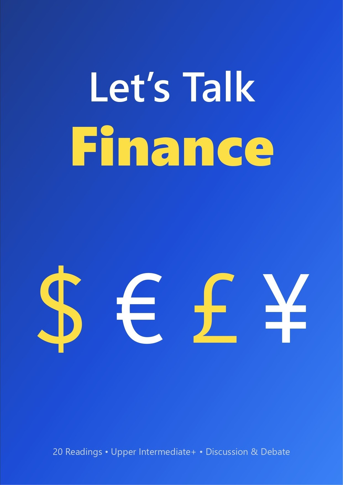

  
\[\[SHAPE:1\]\]

\[\[PAGEBREAK\]\]

\[\[SECTIONBREAK\]\]

Preface

Finance is more than numbers and balance sheets—it is the language of business, trade, and global cooperation. *Let’s Talk Finance* has been designed to help learners at the upper-intermediate level and above strengthen their English communication skills while engaging with authentic financial topics that shape our world today.

This textbook contains 20 reading articles covering diverse areas of finance, from cryptocurrency regulation and green finance to economic diplomacy and wealth inequality. Each article is paired with a set of discussion questions intended to spark critical thinking, debate, and personal reflection.
