> ®
> SUCCESSFUL KEYS TO THE TOEIC
> LISTENING AND READING TEST INTRO
> (2) nd Edition]

             教授用書

            Mark D. Stafford

               桐原書店

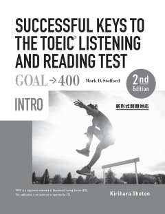**  **

[[PAGEBREAK]]

【ダウンロード可能な補助教材】

                             ®
SUCCESSFUL KEYS TO THE TOEIC LISTENING AND READING TEST Introでは，以下のサイトで補助教材をダウンロードしてご利用いただけます。授業の現場に合わせてご活用ください。

http://www.kirihara.co.jp/

1. 音声スクリプトの文字データ

   本冊子に掲載されているスクリプトの文字データを提供しています。音声内容の確認をさせる際などにご利用ください。

2. ワークシートおよび実践演習問題ワークシートでは，TOEIC® LISTENING AND READING TESTのPart 5またはPart 7の形式の問題を15ユニット分用意し

   ています。毎回の授業に加えての課題として利用できます。

   実践演習問題は，100題で構成されたTOEIC® LISTENING AND READING TEST形式のテストです。学習の伸びをはかるためにご利用ください。
   問題冊子はPDFファイルで，リスニングセクションの音声はmp3ファイルで提供しています。

3. Words Review音声ファイルテキストに掲載しているWords Reviewの問題をmp3の音声ファイルで提供しています。

                                     -2-

[[PAGEBREAK]]

Contents

                         Unit 1 Daily Life           4
                         Unit 2 Places               8
                         Unit 3 People               12
                         Unit 4 Travel               17
                         Unit 5 Business             21
                         Unit 6 Office               25
                         Unit 7 Technology           29
                         Unit 8 Personnel            33
                         Unit 9 Management           37
                         Unit 10 Purchasing          42
                         Unit 11 Finances            46
                         Unit 12 Media               52
                         Unit 13 Entertainment       56
                         Unit 14 Health              60
                         Unit 15 Restaurants         65

                         Words Review 解答             71

> リスニングセクションは以下の４カ国出身のネイティブスピーカーの音声で録音されており，それぞれの発言の冒頭に以
> 下のように示されています。
> 米 アメリカ 英 イギリス 加 カナダ 豪 オーストラリア
> A_02 はリスニングの音声ファイル名を示しています。

                                         -3-

[[PAGEBREAK]]

Unit 1 Daily Life

Unit

Unit 1 Daily Life
 Warm-up       (p. 7)

Check Your Vocabulary!

(1) resident 住人
(2) dishwasher 食器洗い機
(3) entrance 入り口
(4) neighbor 隣人
(5) maintenance 整備，保守管理
(6) store 店，商店
(7) notice 通知，掲示
(8) cupboard 食器棚
(9) rent 家賃
(10) apartment アパート，マンション

Word Association

(1) do the laundry 洗濯をする
(2) cook a meal 食事を作る
(3) wash the dishes 食器を洗う *do the dishes とも言う。
(4) apologize for ～を謝罪する
(5) clean the kitchen 台所を掃除する
(6) on sale 特売中で
(7) drive a car 車を運転する

(8) take the garbage out ゴミを出す

 Part 1 Photographs     (p. 8)

1. (B)
 A_02

(A) The people are in a ( store ). この人たちは店の中にいる。

(B) The car’s door is ( open ). 車のドアは開いている。
(C) The children are ( playing ). 子どもたちは遊んでいる。
(D) The man is ( driving ) a car. 男性は車を運転している。

2. (A)
 A_03

(A) They are doing the ( laundry ). 彼らは洗濯をしている。

(B) They are ( cooking ) a meal. 彼らは食事を作っている。
(C) They are washing their ( car ). 彼らは車を洗っている。
(D) They are washing the ( dishes ). 彼らは食器を洗っている。

3. (C)
 A_04

(A) The dishwasher is ( empty ). 食器洗い機の中には何もない。
(B) The door of the dishwasher is ( closed ). 食器洗い機の扉は閉まっている。
(C) The dishwasher is ( full ) of dishes. 食器洗い機の中は食器でいっぱいである。
(D) The dishes are now in the ( cupboard ). 食器は今，食器棚の中にある。

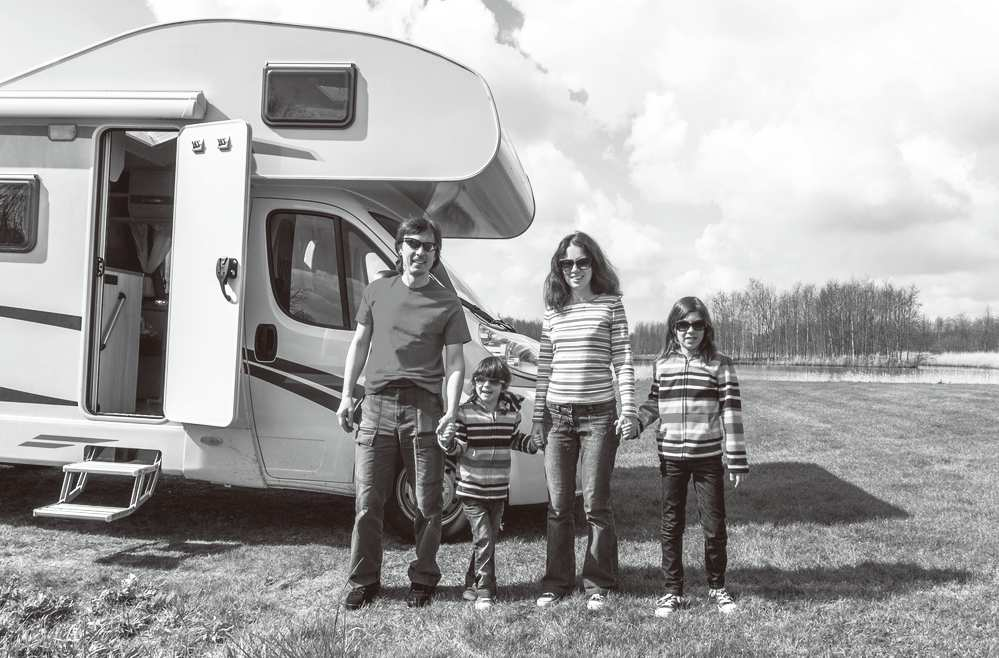**  **
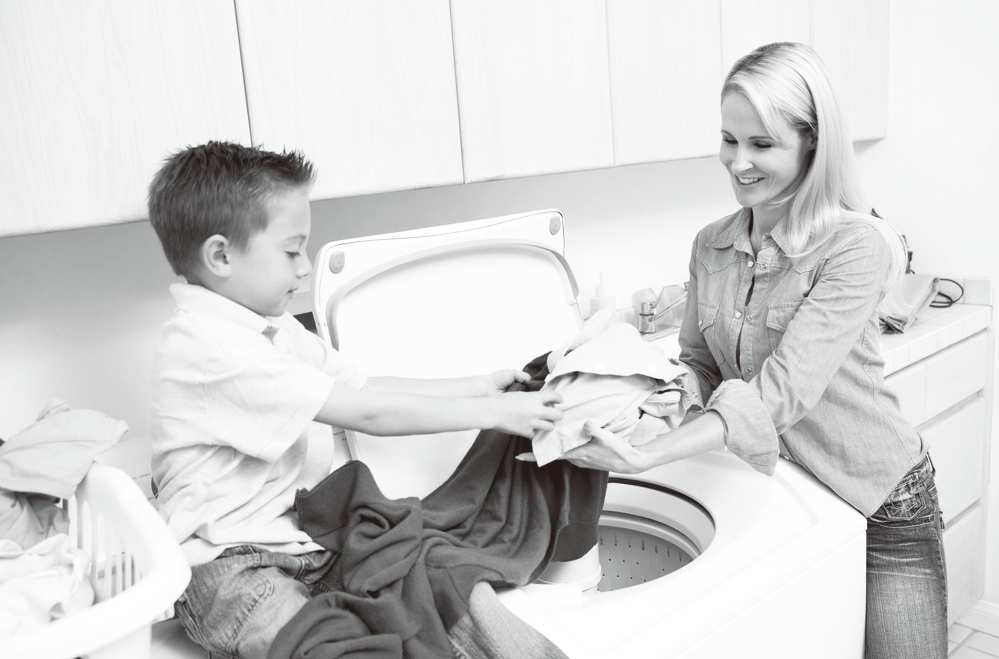**  **
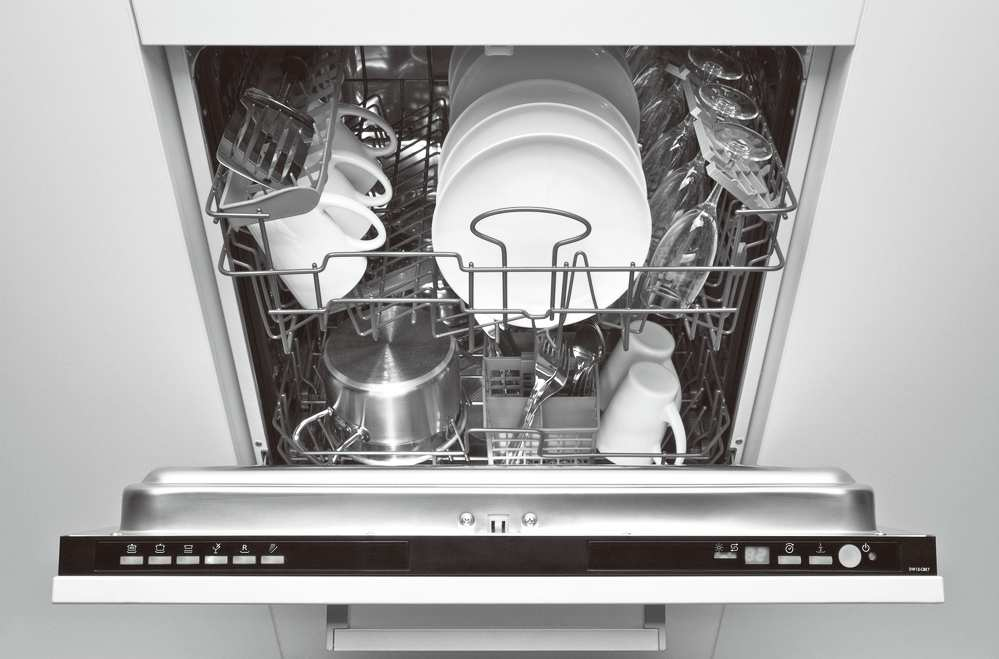**  **

                                             -4-

[[PAGEBREAK]]

Unit 1 Daily Life

 Part 2 Question-Response   (p. 9)

4. (B)
 A_05
 ( How ) are you today? 今日はご機嫌いかがですか。

 (A) I’m 17 (years) old. 私は 17 歳です。
 (B) ( Fine ), thanks. いいですよ，ありがとう。
 (C) ( It ) will be fine tomorrow. 明日は晴れるでしょう。

5. (A)
 A_06
 ( When ) did Mike go home? マイクはいつ家に帰ったのですか。

 (A) ( At ) about five p.m. 午後 5 時頃です。
 (B) Yes, he ( went ) home. はい，彼は家に帰りました。
 (C) To his ( apartment ). 彼のアパートにです。

6. (B)
 A_07
 ( What ) will you do tomorrow? あなたは明日，何をする予定ですか。

 (A) I ( went ) to the park. 私は公園へ行きました。
 (B) I’ll ( go ) to school. 私は学校に行く予定です。
 (C) I ( cooked ) a meal. 私は食事を作りました。

7. (C)
 A_08
 ( Who ) will come to your party on Friday night? 金曜日の夜，あなたのパーティーには誰が来るのでしょうか。

 (A) It ( starts ) at six o’clock. それは 6 時に始まります。
 (B) It should be a lot of ( fun ). それはきっととても楽しいでしょう。
 (C) Some ( friends ) from college. 大学の友人たちです。

8. (A)
 A_09
 ( Where ) is the vacuum cleaner? 掃除機はどこにありますか。

 (A) ( Under ) the stairs. 階段の下です。
 (B) It was on ( sale ) for $90. それは特売で 90 ドルでした。
 (C) That’s a good ( idea ). それはいい考えです。

9. (C)
 A_10
 ( Why ) did Sandy go home early? なぜサンディは早く家に帰ったのですか。

 (A) Because she went home ( early ). 彼女が早く帰ったからです。
 (B) No, she wasn’t ( late ). いいえ，彼女は遅刻しませんでした。
 (C) She wasn’t feeling ( well ). 彼女は気分がよくなかったのです。

                                            -5-

[[PAGEBREAK]]

Unit 1 Daily Life

 Part 3 Conversations    (p. 10)

10. (C) 男性の発言中の疑問詞 where と女性の返事の中の restaurant が解答のためのキーワード。

What are they talking about? 2 人は何について話をしていますか。

(A) How to cook Chinese food 中華料理の作り方
(B) A trip to China 中国への旅行
(C) A place to eat dinner 夕飯を食べる場所

【英文スクリプト】 A_11
 M: ( Where ) would you like to go for dinner tonight?
 W: I would like to go to the new Chinese ( restaurant ) around the corner.
【訳】
男：今晩，どこへ夕食を食べに行きたいですか。
女：近くにできた新しい中華料理店に行きたいです。
――――――――――――――――――――――――――――――――――――

11. (A) living room は家の中にあるので Working in the house を選ぶ。

What is the man doing right now? 男性は今，何をしていますか。

(A) Working in the house 家の中で働いている
(B) Helping the woman 女性を手伝っている
(C) Working in the garden 庭で仕事をしている

【英文スクリプト】 A_12
 W: Can you help me water the plants in the ( garden )?
 M: I’m busy cleaning the ( living ) room right now. But I can help you later.
【訳】
女：庭の植物に水をやるのを手伝ってくれない？
男：僕は今，リビングルームの掃除で忙しいんだ。でも，後でなら手伝えるよ。
――――――――――――――――――――――――――――――――――――

12. (A) 女性の希望はお金を節約できるいちばん安い部屋。それは 7 番街の 580 ドルの物件。

Look at the graphic. Where will the woman live? 図を見てください。女性はどこに住むことになるでしょうか。

| アパート | 家賃 |
| --- | --- |
| 1部屋 / 800平方フィート 7番街 | 580ドル |
| 1部屋 / 850平方フィート メインストリート | 600ドル |
| 2寝室 / 920平方フィート パークアベニュー | 800ドル |

(A) The apartment on 7th street 7 番街のアパート
(B) The apartment on Main Street メインストリートのアパート
(C) The apartment on Park Avenue パークアベニューのアパート

【英文スクリプト】 A_13
 M: Among these three apartments, (which ) one do you want to rent?
 W: Well, I will probably choose the ( cheapest ) one to save money.
【訳】
女：そうですね，お金を節約するために，たぶん一番安いのを選ぶわ。
                                                -6-

[[PAGEBREAK]]

Unit 1 Daily Life
Part 5 Incomplete Sentences    (p. 11)

13. (B) 主語となる名詞が必要。cook は名詞（コック）と動詞（料理する）の両方の意味がある。
14. (A) bill（請求金額）という名詞を修飾する形容詞を選ぶ。     「電気料金」と言う場合は，electric を使う。
15. (D) 副詞 enough（十分に）が後ろから修飾する形容詞を選ぶ。比較の文ではないので，(A)と(B)は誤り。
16. (C) be 動詞 is と形容詞 quiet の間なので，副詞を入れるのが適当。
17. (D) 数詞の three に続くのは複数形の名詞 days。
18. (C) 何かを丁寧に依頼するときは副詞 please をつけ加える。
19. (A)「慎重に」という意味の副詞 carefully を選ぶ。

Part 7 Reading Comprehension      (p. 12)

20. (C) 本文の第 1 文に closed for maintenance due to an electric problem（電気系統の問題による保守作業のため閉鎖される）とあるので repairs（修理）が妥当。
(A) Rent payment 家賃の支払い
(B) Parking 駐車
(C) Repairs 修理
(D) Apartment rentals アパートの賃貸
21. (C) 水曜日の朝から木曜日の夕方にかけてということなので，約 2 日間と判断できる。
(A) For nine hours 9 時間
(B) For twenty-four hours 24 時間
(C) For two days 2 日間
(D) For three days 3 日間
22. (B) 日付の数字を見れば，4 月 5 日から 6 日までとわかる。from A to B（A から B まで）は between A

    and B（A と B の間）とも表現できる。

    (A) Before Wednesday, April 5 4 月 5 日の水曜日より前
    (B) Between April 5 and April 6 4 月 5 日から 4 月 6 日までの間
    (C) After April 6 at 5:00 p.m. 4 月 6 日の午後 5 時よりあと
    (D) From now on 今から

【訳】

> 西側玄関は，電気系統の問題による保守作業のために 4 月 5 日水曜日の午前 8 時から 4 月 6
> 日木曜日の午後 5 時まで閉鎖される予定です。この期間は，北側玄関をご使用ください。ご
> 不便をおかけすることをお詫びいたします。
> ビル管理人 マイク・ロング
                                            -7-

[[PAGEBREAK]]

Unit 2 Places

 Warm-up       (p. 13)

Check Your Vocabulary!

(1) mall ショッピングセンター
(2) closet （作り付けの）たんす，収納庫
(3) terminal （交通機関の）発着場
(4) stop （バスの）停留所
(5) grocery 日用雑貨，食料品
(6) lobby ロビー，待合室
(7) lot 駐車場（=parking lot）
(8) site 現場，場所
(9) facility 施設
(10) subway 地下鉄

Word Association

(1) move in 引っ越してくる，入居する
(2) come through an entrance 入り口から入ってくる
(3) get in a car 車に乗り込む
(4) park a car 車を駐車する
(5) play a game ゲーム［試合］をする
(6) recommend a restaurant レストランをすすめる
(7) let someone know 人に知らせる
(8) enjoy living in～ ～で生活することを楽しむ

 Part 1 Photographs      (p. 14)

1. (B)
 A_14

(A) They are ( playing ) a game. 彼らはゲームをしている。

(B) They are ( walking ) in a park. 彼らは公園の中を歩いている。
(C) They are ( parking ) a car. 彼らは車を駐車している。
(D) They are ( cutting ) trees. 彼らは木を切っている。

2. (C)
 A_15

(A) The floor is being ( cleaned ). 床は掃除されているところだ。
(B) People are ( sitting ) on chairs. 人々が椅子に座っている。
(C) There are some ( chairs ) in the lobby. ロビーにいくつか椅子が置いてある。
(D) Trees are planted along the ( street ). 通り沿いに樹木が植えられてある。

3. (A)
 A_16

(A) She is coming through an ( entrance ). 彼女は入口から入ってくるところだ。
(B) She is sitting in a ( mall ). 彼女はショッピングセンターで腰を下ろしている。
(C) She is trying to ( open ) the door. 彼女はドアを開けようとしている。
(D) She is getting in a ( car ). 彼女は車に乗り込もうとしている。

**  **
**  **
**  **

                                            -8-

[[PAGEBREAK]]

Unit 2 Places
 Part 2 Question-Response   (p. 15)

4. (B)
 A_17
 ( Where ) do you want to go? どこに行きたいですか。

 (A) Sounds ( good ). それはいいですね。
 (B) To a ( restaurant ). レストランに。
 (C) I ( went ) to a grocery store. 私は食料品店へ行きました。

5. (C)
 A_18
 ( Who ) drove to the theater? 誰が劇場まで運転したのですか。

 (A) OK, I ( will ). わかりました，私がやりましょう。
 (B) The ( concert ) was great. そのコンサートはすばらしかったです。
 (C) Mike ( did ). マイクがしました。

6. (A)
 A_19
 What ( kind ) of restaurant do you recommend for the party? そのパーティーにはどのようなレストランがおすすめですか。

 (A) An Italian one would be ( good ). イタリアンレストランがよいでしょう。
 (B) I ( worked ) at a Chinese restaurant. 私は中華料理店で働きました。
 (C) Sorry, I ( forgot ) to tell you. すみません，あなたに言うのを忘れていました。

7. (C)
 A_20
 Where can I ( park ) my car? 私の車はどこに駐車できますか。

 (A) You can ( take ) the subway. 地下鉄で行くことができます。
 (B) Kids often ( play ) at the park. 子どもたちはよくその公園で遊びます。
 (C) In the ( lot ) across the street. 通りの向こう側にある駐車場です。

8. (A)
 A_21
 ( When ) should I meet you? いつあなたにお会いしたらいいのでしょうか。

 (A) At 3:00 on ( Thursday ). 木曜日の 3 時です。
 (B) At the ( station ). 駅でです。
 (C) I ( met ) her this morning. 私は彼女に今朝会いました。

9. (B)
 A_22
 What ( type ) of place are you living in? あなたは，どのようなところにお住まいですか。

 (A) I live ( with ) my younger brother. 弟と一緒に住んでいます。
 (B) I live in an apartment with four (bedrooms). 寝室が 4 つあるアパートに住んでいます。
 (C) I want to ( rent ) a large house. 大きい家を借りたいと思っています。

                                           -9-

[[PAGEBREAK]]

Unit 2 Places
 Part 4 Talks   (p. 16)

10. (B) miss は「    （チャンスなどを）逃す」という意味。否定の命令形で用いると「～を逃さないで」という勧誘の表現になる。

Why does the speaker say, “Don’t miss it”? 話し手は，なぜ“Don’t miss it”と言っているのですか。

(A) She will not be able to attend the event. 彼女はそのイベントに参加できないから。
(B) She wants people to attend the event. 彼女は人々にそのイベントに参加してほしいから。
(C) She has forgotten something. 彼女は，あることを忘れてしまったから。

【英文スクリプト】 A_23
Attention shoppers. Today, we have a special ( event ) with Professor Kimberly Jones, the author
of several best-selling mystery novels. She just published her newest novel ( last ) week. You can
get a copy here and have her ( sign ) it. The event starts in the ( lobby ) at 5:00 p.m. Don’t miss it!
【訳】
お買い物中のみなさまにお知らせいたします。本日，いくつかのベストセラーの推理小説の著者であるキンバリー・ジョーンズ教授をお迎えして特別なイベントを開催いたします。彼女はつい先週，最新作の小説を出版しました。当店でそれをお買い求めになれば，彼女にサインをしてもらうことができます。このイベントはロビーで午後 5 時に始まります。このチャンスをお見逃しなく！
――――――――――――――――――――――――――――――――――――

11. (C) ほとんどの文が命令文なので，何かの規則についての話だと推定できる。city pool（市営プール）は公共施設の 1 つ。

What is this message about? このメッセージは何についてのものですか。

(A) Rules at an elementary school 小学校での規則
(B) Rules for traffic safety 交通安全のための規則
(C) Rules at a public facility 公共施設での規則

【英文スクリプト】 A_24
Please follow some rules for safety when you use the city ( pool ). Avoid dangerous behavior that
might harm yourself or others. ( No ) diving is allowed. ( Never ) run around the pool. Don’t bring
glass or electric devices near the pool area. Children under 12 ( must ) be accompanied by an
adult.

【訳】
市営プールをご利用になる際は，いくつかの安全上の規則をお守りください。ご自身や他の方にケガをさせる可能性がある危険な行為はお控えください。飛び込みはできません。プールの周囲では走らないでください。ガラス製品や電気製品はプールエリアの近くに持ち込まないでください。12 歳未満の児童は，大人の付き添いが必要です。

                                                - 10 -

[[PAGEBREAK]]

Unit 2 Places
Part 5 Incomplete Sentences   (p. 17)

12. (D) lot には「土地の一区画」という一般的な意味と「駐車場」という意味がある。parking lot は駐車場のこと。
13. (C)「（作り付けの）たんす」を意味する closet「クロゼット」は日本語でもよく使われている。
14. (B) site には「場所，現場」という意味があり，construction site で「工事現場」

                                                       。

15. (C)「ロビー」も日本語になっている。
16. (C)「アパート」は日本式の表現で，英語では apartment となることに注意。
17. (D)「バス停」はバスが止まるところだから bus stop と覚えておくとよい。
18. (A) 「部屋」は room。〈want＋物・事＋過去分詞〉で， 「物・事を～（な状態）にしてほしい」という意味。

Part 6 Text Completion   (p. 18)

19. (A) would like ～ to do は「～（人）に…してほしい」という構文。to do は不定詞なので動詞は原形となる。
20. (D) rent（家賃，賃貸料）は，この手紙の受け取り人であるアダムズ氏（文中では you）が支払うべきものなので，your とするのが正しい。
21. (C) enjoy living in such a wonderful house という肯定的な表現が続くので，really（本当に，きっと）という副詞を選ぶ。
22. (B) Please let me know if ...「もし…でしたら，私までご連絡ください」は，ビジネスレターの最後の部分でよく使われる常用表現。

【訳】

> ALT 不動産管理
> ホワイトレーン 66 番地，23 号室
> カリフォルニア州シスコ 96584
> (11) 月 23 日
> マイケル・アダムズ
> ハーパー・ストリート 264 番地
> カリフォルニア州シスコ 96583
> アダムズ様
> パーカーアベニュー254 番地の家主様が，あなたの賃貸申込みを受理し，あなたにできるだけ早く
> 入居していただきたいと希望しておられることをお知らせいたします。あなたが当社のオフィスに
> お越しになり，賃貸契約に署名をし，あなたの最初の 1 カ月分の家賃 550 ドルと保証金 1,100 ド
> ルをお支払いただける日時をお知らせください。ガス，電気，水道については，ご自分でお手続
> きをお願いたします。あのようなすばらしい家で暮らすことをきっと楽しんでいただけること
> 思います。
> もし何かご質問がございましたら，私までご連絡ください。
> 敬具
> シンシア・ムーア
> 不動産担当シニアマネジャー

[[PAGEBREAK]]

Unit 3 People
 Warm-up       (p. 19)

Check Your Vocabulary!

(1) attendant 係員，案内係
(2) cashier レジ係
(3) clerk 店員，事務員
(4) customer 客，顧客
(5) employee 従業員
(6) mechanic 機械工，修理工
(7) receptionist 受付係
(8) secretary 秘書
(9) teller 銀行の窓口［出納］係
(10) agent 代理店（の従業員）

Word Association

(1) book a hotel ホテルを予約する
(2) clean up the mess 後片づけをする
(3) have experience -ing ～をした経験がある
(4) experience is preferred 経験があれば好ましい
(5) just a moment ちょっとお待ちください
(6) serve food to customers お客に料理を出す
(7) work well with people 協調性がある
(8) over the phone 電話で

 Part 1 Photographs      (p. 20)

1. (D)
 A_25

(A) They are ( serving ) a meal to customers. 彼らはお客に食事を出している。

(B) They are trying to ( open ) an account. 彼らは口座を開こうとしている。
(C) They are ( washing ) the dishes. 彼らは食器を洗っている。
(D) They are working in a ( kitchen ). 彼らは厨房で働いている。

2. (B)
 A_26

(A) The receptionist is ( standing ). 受付係は立っている。

(B) The receptionist is ( sitting ). 受付係は座っている。
(C) The businessman is ( walking ). ビジネスマンは歩いている。
(D) The businessman is ( sitting ). ビジネスマンは座っている。

3. (D)
 A_27

(A) She is ( teaching ) someone how to dive. 彼女は誰かにダイビングのやり方を教えている。
(B) She is looking into a ( window ). 彼女は窓の中をのぞき込んでいる。
(C) She is working in a construction ( site ). 彼女は工事現場で働いている。
(D) She is ( driving ) a truck. 彼女はトラックを運転している。

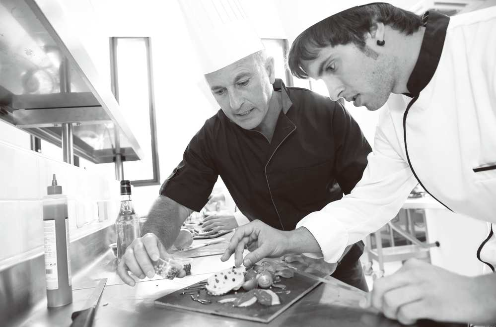**  **
**  **
**  **

                                            - 12 -

[[PAGEBREAK]]

Unit 3 People
 Part 2 Question-Response   (p. 21)

4. (C)
 A_28
 ( Who ) can help me open a bank account? 私が銀行口座を開くのを誰が手伝ってくれますか。

 (A) A ( cashier ) can. レジ係です。
 (B) A ( mechanic ) can. 機械工です。
 (C) A ( teller) can. 銀行の窓口係です。

5. (A)
 A_29
 (Where’s) the receptionist’s desk? 受付係のデスクはどこにありますか。

 (A) In the ( lobby ). ロビーにあります。
 (B) The ( woman ) over there. あちらの女性です。
 (C) She is not here ( today ). 彼女は今日，不在です。

6. (C)
 A_30
 Can I speak to a ( secretary )? 秘書の方と話すことができますか。

 (A) That’s too ( bad ). それはとても残念です。
 (B) ( At ) about three o’clock. 3 時頃に。
 (C) Sure, just a ( moment ). はい，ちょっとお待ちください。

7. (B)
 A_31
 ( When ) is Professor White’s final test? ホワイト教授の最後の試験はいつですか。

 (A) In his ( classroom ). 彼の教室でです。
 (B) On ( May ) 20th. 5 月 20 日です。
 (C) ( Because ) he wasn’t feeling well. 彼は気分が優れなかったのです。

8. (A)
 A_32
 ( Should ) I pay the parking attendant? 駐車場係に払えばいいのですか。

 (A) No, use the ( machine ). いいえ，機械を使ってください。
 (B) I ( didn’t ) attend yesterday’s class. 私は昨日の授業に出席しませんでした。
 (C) You can ( park ) over there. あなたは，向こうに駐車してもいいですよ。

9. (B)
 A_33
 ( What ) can the travel agent do for me? その旅行代理店の人は，私のために何をしてくれるのですか。

 (A) She can find you an ( apartment ). 彼女は，あなたにアパートを見つけてくれます。
 (B) She can book your ( hotel ). 彼女は，あなたのホテルを予約してくれます。
 (C) She can sell you a ( house ). 彼女は，あなたに家を売ってくれます。

                                          - 13 -

[[PAGEBREAK]]

Unit 3 People
 Part 3 Conversations     (p. 22)

10. (C) 2 番目の女性は荷物をシルビアの机の上に置いたと言っているので，シルビアはそこに荷物を取りに行くと思われる。

What will Sylvia probably do next? シルビアはおそらく次に何をしますか。

(A) She will send a package. 彼女は荷物を発送する。
(B) She will check her email. 彼女は自分の E メールをチェックする。
(C) She will go to her desk. 彼女は自分の机に行く。

【英文スクリプト】 A_34
W1: Hi, guys, did you see a ( package ) for me today? I need it immediately.
M: Yes, I think it’s at the receptionist’s ( desk ).
W2: No, it’s not there. I (put) it on your desk a few minutes ago, Sylvia.

【訳】
女 1：ねえあなたたち，今日，私宛ての小包を見た？ それがすぐに必要なのよ。
男： ああ，それは受付係の机の上にあると思うよ。
女 2：いいえ，そこにはないわ。ちょっと前に私があなたの机の上に置いておいたわ，シルビア。
――――――――――――――――――――――――――――――――――――

11. (A) レジ係がレシートをくれたかという質問に，女性は Yes と答えている。

What did the cashier give the woman? レジ係は女性に何を渡しましたか。

(A) A receipt レシート
(B) Her change 釣り銭
(C) A coupon 割引券

【英文スクリプト】 A_35
 M: Did the cashier give you a receipt for your purchase?
 W: ( Yes ), she did. But I didn’t get my ( change ).
【訳】
男：レジ係は，君が買ったもののレシートをくれたかい？
女：ええ，くれたわ。でも，お釣りはもらわなかったのよ。
――――――――――――――――――――――――――――――――――――

12. (B) account（口座）と teller（銀行の窓口係）が解答のためのキーワード。

Where are the people probably speaking? この人たちは，おそらくどこで話をしていますか。

(A) At a clothing shop 衣料品店
(B) At a bank 銀行
(C) At a city office 市役所

【英文スクリプト】 A_36
W: How can I open an ( account )?
M: Fill out this form and give it to the ( teller ).
【訳】
女：口座を開くにはどうすればいいですか。
男：この用紙に記入して，窓口係に渡してください。

                                                  - 14 -

[[PAGEBREAK]]

Unit 3 People
Part 5 Incomplete Sentences    (p. 23)

13. (C) 名詞 keys（カギ）について，「彼の」と言い表す場合は he の所有格 his を使う。
14. (B) 人称代名詞を目的語として使う場合は目的格を使う。この場合，          「私に」なので 1 人称の目的格 me

    を使う。

15. (D) Ms. Kim は女性なので，ここでは主語となれる代名詞 she を使う。
16. (B) The employees を示す代名詞で主語になっているので they を使う。
17. (C) 前置詞 of のあとに来る人称代名詞は目的格なので us が正解。
18. (A)「私たちの～」と言う場合の代名詞は所有格の Our を使う。
19. (D) the report に相当する代名詞が必要なので，it が正解。

Part 7 Reading Comprehension      (p. 24)

20. (C) 広告のタイトルにある Help は「仕事を手伝ってくれる人」のことなので，これが求人広告だとわかる。本文 1 行目の looking for the following people（次の人材を求めている）という表現もヒントになる。
(A) To announce the opening of a new restaurant 新しいレストランの開店を知らせること
(B) To tell people about special sales of French pastries フランスの焼き菓子の特売を人々に知らせること
(C) To find good people for restaurant jobs レストランの仕事に適した人材を見つけること
(D) To ask people to send their opinion by email 人々に E メールで意見を送るよう頼むこと

21. (D) Pastry Chef とは「パティシエ＝菓子職人」のこと。文中に「フランスの焼き菓子作りの経験が必要」とあるので，それが仕事であると考えられる。
(A) Collect money from people お金を人々から集める
(B) Serve food to customers お客に料理を出す
(C) Help the General Manager 総支配人の補佐をする
(D) Make French pastries フランスの焼き菓子を作る

22. (C) 選択肢(B)の train は「列車」のこと。本文中の train（訓練する）に近い意味を持つ単語は teach

    （教える）     。

    (A) They must have experience. 経験が必要である。
    (B) They need to come by train. 電車で来なければならない。
    (C) The restaurant will teach them. レストランが彼らに教える。
    (D) They must be accurate. 何事にも正確でなければならない。

23. (D) メールの件名（Subject:）の欄に Employment（雇用）とあり，メールの最後に how I can apply for

    that type of job（そのような種類の仕事に応募するには，どうすればよいのか）とあるので，仕事について問い合わせているとわかる。

    (A) To make a complaint 苦情を言うため
    (B) To place an order 注文をするため
    (C) To offer a service サービスを提供するため
    (D) To ask about work 仕事について尋ねるため

24. (B) E メールに I am very interested in restaurant management とあり，求人広告では restaurant

        management に関わる仕事として Assistant Manager（副支配人）が掲載されていることから，その仕事につきたいと思っていると考えられる。

        (A) Pastry Chef パティシエ
        (B) Assistant Manager 副支配人
        (C) Waiter ウエイター
        (D) Cashier レジ係

                                            - 15 -

[[PAGEBREAK]]

Unit 3 People

【訳】

> 従業員募集
> ダレンズ・レストラン・チェーンでは，次の人材を求めています：
> (1) . パティシエ。フランスの焼き菓子作りで少なくとも 3 年の経験があることが必要。
> (2) . 副支配人。レストラン経営の日常業務で総支配人を補佐。
> (3) . ウエイター。経験のあることが好ましいが，当方で研修を行う。
> (4) . レジ係。何事にも正確で，協調性がある人。
> 詳しくは，b-hayes@darrens.net でバーバラ・ヘイズまでご連絡ください。

> 宛先：バーバラ・ヘイズ <b-hayes@darrens.net>
> 送信者：ケン・タケダ
> 件名：求人
> ヘイズ様
> 私の名前はケン・タケダとい，この 10 年間いくつかのレストランで働いてきました。最初はウ
> エイターとして働き始めました。次に，レジ係として働きました。それから厨房で料理をするよう
> になりました。現在は，レストランの経営にとても関心があります。そのような種類の仕事に応募
> するにはどうすればよいのかお知らせください。
> 敬具
> ケン・タケダ

  敬具ケン・タケダ

                               - 16 -

[[PAGEBREAK]]

Unit 4 Travel
Warm-up      (p. 27)

Check Your Vocabulary!

(1) accommodation 宿泊（施設）
(2) flight 航空便
(3) run （交通機関が）運行する
(4) cabin （航空機の）客室，船室
(5) fare 運賃，料金
(6) round-trip 往復の
(7) passenger 乗客，旅客
(8) tourist 旅行者，旅行客
(9) transportation 輸送手段，輸送（機関）
(10) cancel 解約する，中止する

Word Association

(1) pack one’s bag 荷物をまとめる
(2) board a plane 飛行機に搭乗する
(3) The hotel is full. そのホテルは満室［予約でいっぱい］である。
(4) check in 搭乗［宿泊］手続きをする *〈check in＋もの〉で「～を預け入れる」という意味になる。
(5) get on a bus バスに乗る *バスや列車に乗る場合は get on，車などの場合は get in を使う。
(6) be popular with～ ～に人気がある
(7) arrive on time 時間通りに到着する

(8) book a flight 航空便を予約する *book は reserve と置き換えられる。

 Part 1 Photographs    (p. 28)

1. (A)
 A_37

(A) They are ( checking ) in. 彼らは搭乗手続きをしている。

(B) They are ( shopping ) for presents. 彼らはプレゼントの買い物をしている。
(C) They are ( packing ) their bags. 彼らは荷物をまとめている。
(D) They are on an ( airplane ). 彼らは飛行機の中にいる。

2. (D)
 A_38

(A) People are getting on a ( bus ). 人々はバスに乗り込んでいる。

(B) People are driving ( cars ). 人々は車を運転している。
(C) People are boarding a ( plane ). 人々は飛行機に乗り込んでいる。
(D) People are on a ( train ). 人々は列車に乗っている。

3. (C)
 A_39

(A) The man is in a ( taxi ). 男性はタクシーの中にいる。
(B) The man is ( driving ) a bus. 男性はバスを運転している。
(C) The man is waiting at a bus ( stop ). 男性はバス停で待っている。
(D) The bus has ( stopped ). バスは停車したところだ。

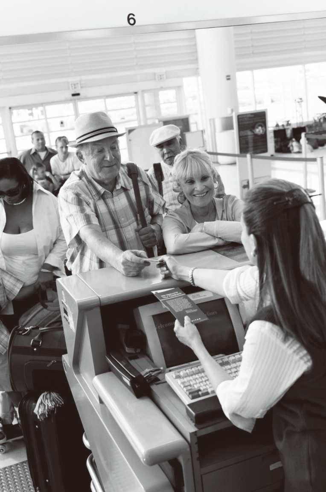**  **
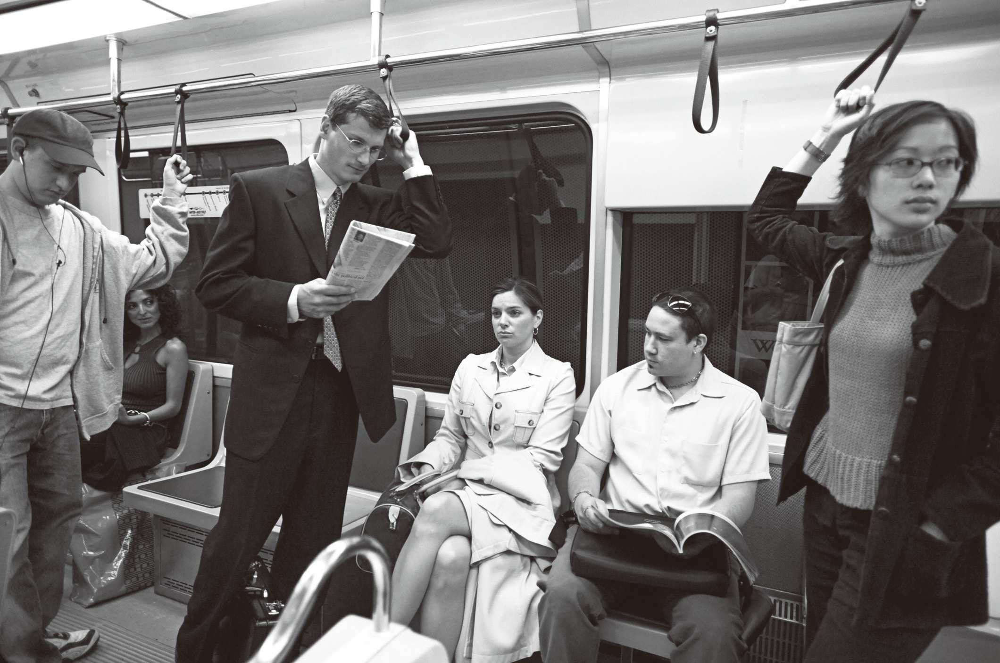**  **
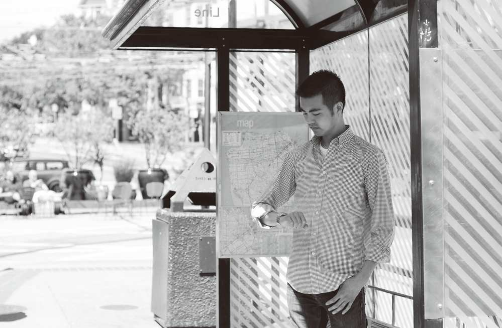**  **

                                           - 17 -

[[PAGEBREAK]]

Unit 4 Travel
 Part 2 Question-Response   (p. 29)

4. (C)
 A_40
 How many ( tickets ) would you like? チケットは何枚ご希望ですか。

 (A) I want to ( cancel ) them. それは解約したいと思います。
 (B) No, ( thank ) you. いいえ，結構です。
 (C) Three, ( please ). 3 枚お願いします。

5. (B)
 A_41
 ( Where ) will you stay? あなたはどこに滞在するのですか。

 (A) I’ll stay four ( days ). 私は 4 日間滞在します。
 (B) I’ll stay at the Metro ( Hotel ). 私はメトロホテルに泊まります。
 (C) I ( stayed ) at my friend’s house. 私は友人の家に泊まりました。

6. (C)
 A_42
 ( How ) will you go to Los Angeles? ロサンゼルスには，どのようにして行くのですか。

 (A) By three ( o’clock ). 3 時までにです。
 (B) It was very ( nice ). とてもよかったです。
 (C) By ( bus ). バスで行きます。

7. (A)
 A_43
 Sorry, but the hotel is ( full ) today. 申し訳ありませんが，今日，ホテルは満室です。

 (A) Oh, that’s too ( bad ). ああ，それは残念だ。
 (B) The rooms are ( taken ). 部屋はふさがっています。
 (C) I ( prefer ) a single room. 私はシングルルームがいいです。

8. (B)
 A_44
 How ( many ) bags will you check in? 荷物はいくつ預けますか。

 (A) Three ( people ). 3 人です。
 (B) Just ( one ). 1 つだけです。
 (C) I checked my ( flight ). 私は自分の航空便を確認しました。

9. (A)
 A_45
 Where ( did ) you go during summer vacation? 夏休みの間にどこへ行きましたか。

 (A) I ( went ) to Hawaii. 私はハワイに行きました。
 (B) ( I’ll ) go to Bali. 私はバリに行くつもりです。
 (C) I ( want ) to go to Chicago. 私はシカゴに行きたいです。

                                          - 18 -

[[PAGEBREAK]]

Unit 4 Travel
 Part 4 Talks   (p. 30)

10. (C) a very cheap fare for two passengers（2 名の格安料金）という表現から判断できる。

Look at the graphic. Which travel package is Amy Carlson speaking about? 図を見てください。エイミー・カールソンは，どの旅行商品について話していますか。

| 旅行商品 |  |
| --- | --- |
| 種類 | 航空料金 |
| 一般旅行客用 | 525ドル |
| ビジネス割引（1人の場合） | 426ドル |
| ビジネス割引（2人以上の場合，１人につき） | 394ドル |

(A) Regular Traveler 一般旅行客用
(B) Business Discount (single traveler) ビジネス割引（1 人の場合）
(C) Business Discount (2+ travelers, each) ビジネス割引（2 人以上の場合，1 人につき）

【英文スクリプト】 A_46
Hello, this is Amy Carlson at BIG Travel ( Agency ) and I’m calling about your business travel
reservations. I can ( book ) a flight with a very cheap fare for two passengers. You can access your
( air ) tickets on our website. Please feel free to contact me if you have any questions.
【訳】
こんにちは，BIG 旅行代理店のエイミー・カールソンですが，あなたの出張旅行の予約についてお電話を差し上げています。乗客 2 名様について格安の航空便を予約することができます。お客様の航空券は当社のウェブサイトで入手することができます。何かご質問がございましたら，お気軽にご連絡くださるようお願いいたします。
――――――――――――――――――――――――――――――――――――

11. (B) 2:30 のあとの p.m.（午後）が聞き取れれば判断できる。

When will the flight arrive? この航空便はいつ到着しますか。

(A) In the morning 午前中
(B) In the afternoon 午後
(C) At night 夜間

【英文スクリプト】 A_47
Hello. This is your ( captain ) speaking. Thank you very much for ( flying ) with Open Skies Airlines.
We should have a smooth flight to New Orleans and arrive just ( on ) time at 2:30 p.m. Please ask a
( cabin ) attendant if you need anything special. Enjoy your flight.
【訳】
こんにちは。機長よりお伝えいたします。オープンスカイズ航空にご搭乗いただき，誠にありがとうございます。ニューオーリンズには順調な飛行が予想され，定刻通りの午後 2 時 30 分に到着いたします。何かご用がありましたら客室乗務員にお申し付けください。それでは空の旅をお楽しみください。

                                                - 19 -

[[PAGEBREAK]]

Unit 4 Travel
Part 5 Incomplete Sentences   (p. 31)

12. (D)「…は自分（自身）で～する」という主語を強調する表現では，主語に対応した再帰代名詞を使う。
13. (A) 人称代名詞を目的語に使う場合は，その目的格を使う。
14. (D) 空所には，文の後半にある buses に対応する代名詞の所有格が入る。
15. (B) The tourists（旅行者たち）を再び主語として使う場合は，they を使う。
16. (A) 〈book＋人＋もの〉で「…（人）に～（もの）を予約する」という意味。「人」は目的語なので，代名詞の場合は目的格になる。
17. (D) The ferry（フェリー）は単数名詞なので，それを指し示して主語となる代名詞は it。
18. (B) Ms. Lee は女性なので，代名詞を使った場合の所有格は her。

Part 6 Text Completion   (p. 32)

19. (A) make one’s travel arrangements で「旅行の手配をする」という意味になる。
20. (D) 支払いなどの期限を表すには前置詞の by を使う。
21. (B) 日帰りの観光ツアーの話なので，そこでできることを述べている(B)が正解。
22. (C) 丁寧な依頼の表現は，〈Please＋動詞の原形〉という命令形を使う。

【訳】

> 宛先：エイミー・スミス
> 差出人：ダナ・ウィルソン
> 件名：お客様の旅行
> こんにちは，エイミー
> 私はあなたのバリ旅行の手配を済ませましたので，その詳細をお伝えいたします。
> ロサンゼルス国際空港とデンパサール国際空港との間の往復航空券，到着後の陸上の移動，そして
> カードで 8 月 27 日までにお支払いください。
> お客様のパッケージツアーには，ムンドゥック野生公園への日帰りツアーが含まれています。来園
> 者はそこで美しい滝を見物することができます。
> 何かご質問などがございましたら，私にご連絡ください。
> 敬具
> ダナ・ウィルソン
> KHS トラベル

                                        - 20 -

[[PAGEBREAK]]

Unit 5 Business
 Warm-up       (p. 33)

Check Your Vocabulary!

(1) advertise 広告を出す，宣伝する
(2) sales 売り上げ（高）      ，販売 *形容詞として使う場合は「販売の，営業の」などの意味。
(3) briefcase ブリーフケース，書類かばん
(4) contract 契約（書）
(5) contact 〜に連絡を取る
(6) order 注文（品），発注
(7) meeting 会議，打ち合わせ
(8) salesperson 販売員，店員，営業部員 *複数形は salespeople。
(9) line 品ぞろえ
(10) suitcase スーツケース

Word Association

(1) make a presentation プレゼンテーションを行う
(2) start one’s business 事業［会社］を始める
(3) sign the contract 契約書に署名する
(4) hold a sales meeting 営業会議を開く
(5) discuss how to lower prices 価格を下げる方法を話し合う
(6) raise the price 価格を上げる
(7) exceed the sales target 売上目標を超える
(8) set a new record 新記録を打ち立てる

 Part 1 Photographs      (p. 34)

1. (B)
 A_48

(A) The ( door ) is open. ドアは開いている。

(B) ( Papers ) are on the table. 書類がテーブルの上にある。
(C) A woman is ( standing ). 女性が立っている。
(D) They are preparing ( coffee ). 彼らはコーヒーを準備している。

2. (D)
 A_49

(A) An ( actor ) is on stage. 役者が舞台にいる。
(B) A woman is making a ( presentation ). 女性がプレゼンテーションをしている。
(C) A man is ( starting ) to drive. 男性が運転を始めようとしている。
(D) A man is ( pointing ) at a graph. 男性がグラフを指し示している。

3. (A)
 A_50

(A) He is ( holding ) a briefcase. 彼は書類かばんを手につかんでいる。
(B) He is ( closing ) his bag. 彼はかばんを閉じようとしている。
(C) He is ( buying ) a suitcase. 彼はスーツケースを買っている。
(D) He is ( putting ) ( on ) a suit. 彼はスーツを着ているところだ。

**  **
**  **
**  **

                                          - 21 -

[[PAGEBREAK]]

Unit 5 Business
 Part 2 Question-Response   (p. 35)

4. (B)
 A_51
 ( What ) was the meeting about? 会議の議題は何に関するものでしたか。

 (A) About ten ( minutes ). 10 分くらいです。
 (B) The new advertising ( plan ). 新しい広告計画です。
 (C) I ( met ) him a year ago. 彼には 1 年前に会いました。

5. (A)
 A_52
 ( How ) were last month’s sales? 先月の売り上げはどうでしたか。

 (A) Not so ( bad ). それほど悪くありません。
 (B) It ( sold ) already. それはもう売れました。
 (C) It’s a ( bargain ). それは特価品です。

6. (B)
 A_53
 How do you want to ( advertise ) the spring clothing line? 春用の衣料品はどう宣伝したいですか。

 (A) I don’t ( need ) any new clothes. 私は新しい服は何もいりません。
 (B) On the ( Internet ). インターネット上でです。
 (C) I want to go in the ( summer ). 私は夏に行きたいのです。

7. (A)
 A_54
 How ( often ) do you meet your regular customers? あなたは，常連客にどれくらいの頻度で会いますか。

 (A) About ( once ) a month. 1 カ月に 1 回くらいです。
 (B) Nice to ( meet ) you, too. こちらこそお会いできてうれしいです。
 (C) ( I’m ) not a regular customer. 私は常連客ではありません。

8. (C)
 A_55
 ( Where ) will you make your presentation? あなたは，どこでプレゼンテーションをするのですか。

 (A) Next Friday ( afternoon ). 来週の金曜日の午後です。
 (B) John Casey ( did ) it. それはジョン・ケーシーがやりました。
 (C) In the ( meeting ) room. 会議室でです。

9. (B)
 A_56
 When can we ( sign ) the new contract? 私たちは，いつ新しい契約書に署名できますか。

 (A) The sign ( says ), “Keep out.” その看板には「立入禁止」と書いてあります。
 (B) ( How ) about tomorrow morning? 明日の朝ではどうですか。
 (C) I ( contacted ) him yesterday. 私は彼に昨日連絡をしました。

                                          - 22 -

[[PAGEBREAK]]

Unit 5 Business
 Part 3 Conversations   (p. 36)

10. (A) presentation（プレゼンテーション）を行う場所は，常識的には会社の会議室などである。

Where are the people probably speaking? 2 人はどこで話をしていると思われますか。

(A) In a meeting room 会議室で
(B) In a hotel lobby ホテルのロビーで
(C) In a baseball stadium 野球場で

【英文スクリプト】 A_57
 M: I would like to start my ( presentation ). Can you please close the ( door )?
 W: Sure, I’ll do it right away.
【訳】
男：私のプレゼンテーションを始めたいと思います。ドアを閉めてもらえますか。
女：はい，すぐに閉めます。
――――――――――――――――――――――――――――――――――――

11. (B) 男性は女性に電話番号を教えると言っている。

How can the woman contact Mr. Brown? 女性はどうすればブラウン氏に連絡を取れますか。

(A) By email E メールで
(B) By telephone 電話で
(C) By going to his office 彼のオフィスを訪ねることで

【英文スクリプト】 A_58
 W: How can I ( contact ) Mr. Brown, the sales manager?
 M: I’ll give you his ( phone ) number right now.
【訳】
女：どうすれば営業部長のブラウン氏と連絡が取れますか。
男：すぐに彼の電話番号をお知らせいたします。
――――――――――――――――――――――――――――――――――――

12. (B) 今月の売れ行きは去年の 10 月よりもよいと言っている。

Look at the graphic. What are this month’s sales? 図を見てください。今月の売れ行きはどれくらいですか。

(A) Exactly 1,235 units ちょうど 1,235 個
(B) More than 1,235 units 1,235 個よりも多い
(C) Between 894 and 924 units 894 個と 924 個の間

【英文スクリプト】 A_59
 M: Our sales this month are great. They’re ( better ) than last October.
 W: That’s ( good ) news. Let’s keep up the good work.
【訳】

男：僕たちの今月の売れ行きはすばらしいよ。去年の 10 月を上回っているんだ。
女：それはいい知らせね。この調子で頑張りましょう。

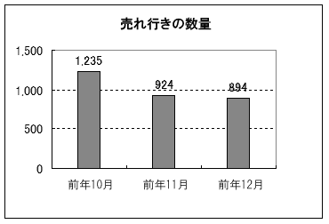**  **

                                           - 23 -

[[PAGEBREAK]]

Unit 5 Business
Part 5 Incomplete Sentences    (p. 37)

13. (D)「契約書に署名する」と言う場合の動詞は，sign を使う。
14. (C)「（人）に連絡する」と言う場合には contact を使う。communicate の場合は前置詞 with が必要。
15. (B) 会議やイベントを「開催する」と言う場合は，hold を使う。
16. (D)「～を準備する」と言う場合は prepare を使う。was ready はその人自身の準備ができているという意味。
17. (B) 「（人）と～について話し合う」と言う場合には discuss を使う。これは他動詞なので，直後に目的語が置かれることもヒントになる。
18. (C) go on～で「～に出かける」という意味になる。
19. (A)「（価格など）を引き上げる」と言う場合には raise を使う。

Part 7 Reading Comprehension      (p. 38)

(A) A company president 会社の社長
(B) A customer 顧客
(C) A salesperson 営業部員
(D) An advertiser 広告主

21. (A) exceed（超える）や set a new record（新記録を打ち立てる）などの語句から，目標は達成されたとわかる。
(A) It was reached. それは達成された。
(B) It was not passed. それは超えられなかった。
(C) It was changed. それは変更された。
(D) It was too high. それは高すぎた。

22. (C) I am very satisfied ... や I am happy ...とあることから，うれしく思っていることがわかる。
(A) Disappointed がっかりしている
(B) Frustrated いらいらしている
(C) Happy うれしく思っている
(D) Confused 混乱している

【訳】

> すべての営業部員へ
> 私は，皆さんが当社の販売目標の 2,500 個を上回ったことにお祝いを述べるためにこれを書いてい
> ます。当社は 3,274 個という新記録を打ち立てました。私は，皆さんのこの１年にわたる努力にと
> ても満足していますので，皆さんがそれぞれ今週末に 500 ドルのボーナスを受け取ることになると
> お知らせできて，うれしく思います。
> 敬具
> マイク・ハウエル
> 営業部長

                                            - 24 -

[[PAGEBREAK]]

Unit 6 Office
 Warm-up        (p. 39)

Check Your Vocabulary!

(1) break 休憩
(2) repair 修理（する）
(3) extension 内線
(4) hand ～を手渡す
(5) reach 連絡をつける
(6) project 企画，事業
(7) supply 備品，補給品 *通例は複数形の supplies が使われる。
(8) conference 会議
(9) superior 上司，上役
(10) document 書類，文書

Word

Word Association

(1) She is on the phone. 彼女は電話に出ている。
(2) run low 残り少なくなっている
(3) The elevator is out of service. エレベーターは使用中止である。
(4) We will remodel the reception room. 応接室を改築する予定です。
(5) You can reach me at extension 123. 内線 123 で私に連絡がつきます。
(6) Please contact the office manager. 業務マネジャーに連絡してください。
(7) in the corner of～ ～の隅に

(8) take a break 休憩する

 Part 1 Photographs       (p. 40)

1. (D)
 A_60

(A) She is drinking ( coffee ). 彼女はコーヒーを飲んでいる。

(B) She is on the ( phone ). 彼女は電話に出ている。
(C) She is talking to ( someone ). 彼女は誰かと話をしている。
(D) She is using a ( copy ) machine. 彼女はコピー機を使っている。

2. (A)
 A_61

(A) There is a ( plant ) on the table. テーブルの上には植物がある。
(B) The ( window ) is open. 窓は開いている。
(C) The ( people ) are sitting. その人たちは座っている。
(D) They are taking a ( break ). 彼らは休憩をとっている。

3. (D)
 A_62

(A) The man is ( holding ) a pen. 男性はペンを持っている。
(B) They are ( walking ) side by side. 彼らは並んで歩いている。
(C) The receptionist is ( sitting ). 受付係は座っている。
(D) The man is ( resting ) his arms on the counter. 男性は腕をカウンターに載せている。

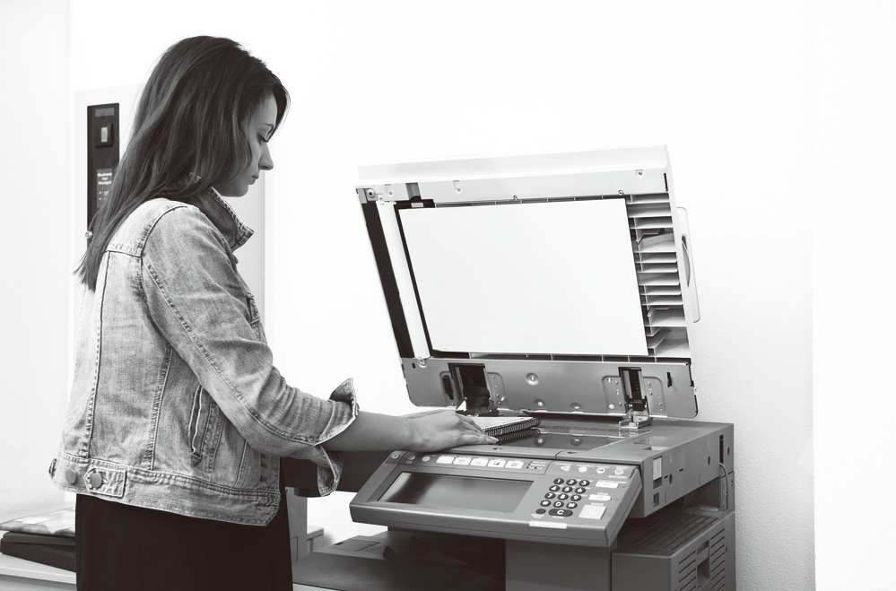**  **
**  **
**  **

                                              - 25 -

[[PAGEBREAK]]

Unit 6 Office
 Part 2 Question-Response   (p. 41)

4. (A)
 A_63
 Have you ( seen ) Amy? あなたはエイミーを見かけましたか。

 (A) She’s in the ( supply ) room. 彼女は備品室にいます。
 (B) Oh, now I ( see ). ああ，やっとわかりました。
 (C) I was ( glad ) to see you again. またあなたに会えてうれしかったです。

5. (A)
 A_64
 What’s ( wrong ) with the ( copy ) machine? コピー機がどうかしたのですか。

 (A) It’s ( broken ). 壊れているんです。
 (B) Yes, ( thank ) you. はい，ありがとうございます。
 (C) In about five ( hours ). およそ５時間後です。

6. (B)
 A_65
 Do we ( need ) more paper? もっと用紙が必要ですか。

 (A) No, I don’t ( know ) where it is. いいえ，それがどこにあるのか知りません。
 (B) Yes, we’re ( running ) low. はい，残り少なくなっています。
 (C) No, I’ll ( check ) it. いいえ，確認してみます。

7. (C)
 A_66
 ( Where ) can I find Mr. Carson? カーソン氏にはどこで会えますか。

 (A) I’ll ( leave ) soon. 私はすぐに出発します。
 (B) Please ( close ) the door. ドアを閉めてください。
 (C) ( Ask ) the receptionist. 受付係に聞いてください。

8. (A)
 A_67
 ( Why ) will the office be closed? なぜオフィスは閉まるのですか。

 (A) For ( repairs ). 補修（工事）のためです。
 (B) It ( opens ) Monday. 月曜日に開きます。
 (C) I ( bought ) some new clothes. 私はいくつか新しい衣服を買いました。

9. (B)
 A_68
 ( When ) will we ( get ) the new computers? 私たちはいつ新しいコンピューターを入手できるのですか。

 (A) They are ( nice ). それらはよいです。
 (B) Next ( month ). 来月です。
 (C) Two ( days ) ago. 2 日前です。

                                         - 26 -

[[PAGEBREAK]]

Unit 6 Office
 Part 4 Talks    (p. 42)

10. (A) 話者は複数の相手に語りかけており，社内の書類の取り扱い方を説明しているので，会社側から社員へのアナウンスだと考えられる。

Where would this announcement most likely be heard? このアナウンスは，どこで聞かれるでしょうか。

(A) At a company meeting 社内会議で
(B) At a business conference ビジネス会議で
(C) Over the telephone 電話で

【英文スクリプト】 A_69
Hello everybody. Today I asked you to come here to tell you about an important new office procedure
that will ( start ) immediately. I would like you to print out paper copies of all important ( documents ).
Then please put them in the new file ( cabinet ) in the corner of the main office.
【訳】
皆さん，こんにちは。今日皆さんにここにお集まりいただいたのは，すぐに始まる重要な新しい社内業務手順についてお伝えするためです。皆さんには，すべての重要書類のコピーをプリントアウトしていただきたいと思います。次に，それを本部の隅にある新しいファイルキャビネットに保管してください。
――――――――――――――――――――――――――――――――――――

11. (B) special event（特別の催し），party（パーティー）                    ，join（参加する）などの言葉から，出席を求めるアナウンスだと判断できる。

What does the man mean when he says, “I hope you can all join in”? 男性が“I hope you can all join in”
と言う際，どのようなことを意図していますか。

(A) He hopes people will join Bob Wilkins in the sales department. 彼は皆に営業部でボブ・ウィルキンスに加わってほしい。
(B) He wants people to come to Bob Wilkins’ party. 彼はみんなにボブ・ウィルキンスのパーティーに来てほしい。
(C) He wants people to help him cook lunch for Bob Wilkins. 彼はみんなにボブ・ウィルキンスのためのランチを準備する手伝いをしてほしい。

【英文スクリプト】 A_70
I would like to tell you about a special ( event ) we will have in the cafeteria on Friday at lunchtime.
Bob Wilkins from the sales department will ( move ) to our new branch office, so we would like to
( give ) him a small goodbye ( party ). I hope you can all join in.
【訳】
金曜日のお昼の時間にカフェテリアで開催する特別なイベントについてお知らせいたします。営業部のボブ・ウィルキンスは，当社の新しい支社に異動することになりましたので，彼のためにささやかな送別会を開きたいと思います。皆さんのご参加を期待しています。

                                                  - 27 -

[[PAGEBREAK]]

Unit 6 Office
Part 5 Incomplete Sentences    (p. 43)

12. (D) 届くものを主語にした能動態の文では，arrive at（～に届く）という表現を使う。
13. (D) 助動詞 will の後ろに続く動詞は原形となるので be を選ぶ。
14. (C)「（電話などで人に）連絡をつける」と言う場合には reach を使う。
15. (B) hand は動詞として使う場合には「手渡す」という意味になる。
16. (C) 既存のオフィス（the office）に対して行う作業としては remodel「改装する」が適当。
17. (A) 人と約束をして会う場合には，meet を使う。
18. (C) speak to ～で「（人）と話をする」という意味。

Part 7 Reading Comprehension      (p. 44)

19. (B) この回覧の宛先は，冒頭の To 以下にある all sales office employees である。これを言い換えたのが salespeople。
(A) Customers 顧客
(B) Salespeople 営業部員
(C) Clients 依頼人
(D) Construction workers 建設作業員

20. (A) 文中に seven days（7 日）とあるので，正解はこれを言い換えた One week（１週間）である。
(A) One week 1 週間
(B) Two weeks 2 週間
(C) Three weeks 3 週間
(D) One month 1 カ月

21. (D) 挿入する文中の extension とは「内線」のことなので，「質問があれば連絡を」という言葉のあとに続けるのが自然である。

“My extension is 65941.” 私の内線番号は 65941 です。

(A) [1]
(B) [2]
(C) [3]
(D) [4]

> 社内回覧
> すべての営業所員へ
> 会社は，これから 7 日間にわたり休憩室と備品室を改装することにしています。ほこりや騒音が出
> ることについては申し訳ありません。皆さんの業務は通常通りに行うようにしてください。何かご
> 質問があれば，お気軽に私までご連絡ください。私の内線番号は 65941 です。
> ボブ・マーティン
> 営業所長

                                            - 28 -

[[PAGEBREAK]]

Unit 7 Technology
 Warm-up       (p. 45)

Check Your Vocabulary!

(1) technician 技術者
(2) electric(al) 電気の
(3) plug 差し込む
(4) laboratory 実験室，研究所
(5) electronics 電子機器
(6) microscope 顕微鏡
(7) telescope 望遠鏡
(8) operate 操作する
(9) fix 修理する *同義語は repair。
(10) service （機械などを）整備する，整備

Word Association

(1) fix a computer コンピューターを修理する
(2) start the machine 機械を始動する
(3) it’s time to do もう～するべき時期だ
(4) set the oven to 180ºC オーブンを 180ºC に設定する
(5) keep ... away from～ …を～に近づけない
(6) be monitored by security cameras 防犯カメラで監視される
(7) save time -ing ～する時間を節約する
(8) turn on～ ～のスイッチを入れる

 Part 1 Photographs      (p. 46)

1. (B)
 A_71

(A) The woman is working ( alone ). 女性は 1 人で仕事をしている。

(B) The woman is ( working ) in a laboratory. 女性は研究所で働いている。
(C) The woman is ( looking ) ( at ) the man. 女性は男性を見ている。
(D) The woman is ( operating ) a robot. 女性はロボットを操作している。

2. (C)
 A_72

(A) He’s using a ( telescope ). 彼は望遠鏡を使っている。

(B) He’s talking on the ( phone ). 彼は電話で話をしている。
(C) He’s looking into a ( microscope ). 彼は顕微鏡をのぞき込んでいる。
(D) He’s watching ( TV ). 彼はテレビを見ている。

3. (B)
 A_73

(A) People are ( using ) computers. 人々はコンピューターを使っている。
(B) Computers are on the ( table ). テーブルの上にコンピューターがある。
(C) Computers are in ( boxes ). コンピューターが箱に入っている。
(D) A man is ( fixing ) a computer. 男性がコンピューターを修理している。

**  **
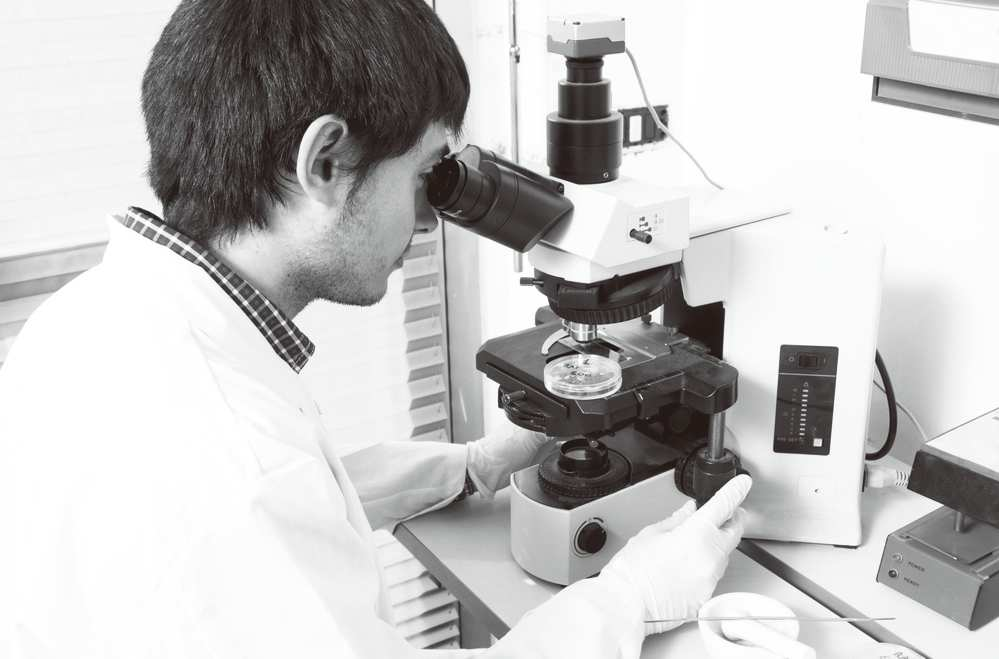**  **
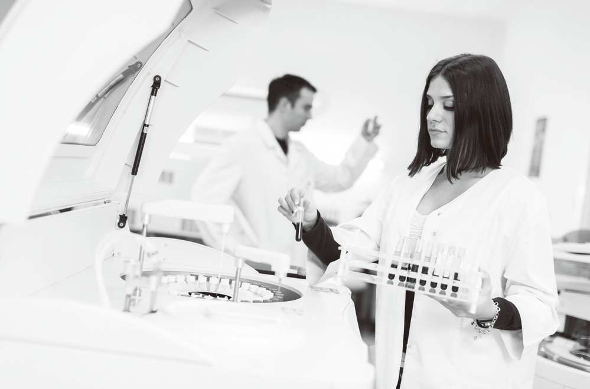**  **

                                           - 29 -

[[PAGEBREAK]]

Unit 7 Technology
 Part 2 Question-Response   (p. 47)

4. (A)
 A_74
 ( When ) will the new model be ready? いつ新しい機種の用意ができるのですか。

 (A) Next ( spring ). 来春です。
 (B) Yes, I ( think ) so. はい，私はそう思います。
 (C) No, it’s not ( ready ). いいえ，それは用意できていません。

5. (B)
 A_75
 ( Where ) is your computer? あなたのコンピューターはどこにありますか。

 (A) I bought it at a local electronics ( store ). 私はそれを地元の電器店で買いました。
 (B) It’s at a ( repair ) shop. それは修理工場にあります。
 (C) It’s a ( laptop ) computer. それはラップトップ型のコンピューターです。

6. (C)
 A_76
 ( What’s ) that machine? その機械は何ですか。

 (A) I’m a computer ( technician ). 私はコンピューターの技術者です。
 (B) It’s very ( useful ). それはとても役に立ちます。
 (C) It’s a ( scanner ). それはスキャナーです。

7. (B)
 A_77
 How do you ( start ) this machine? この機械はどうやって起動するのですか。

 (A) It should be ( OK ). それは問題ないはずです。
 (B) ( Push ) this button. このボタンを押してください。
 (C) I ( haven’t ) started yet. 私はまだ始めていません。

8. (A)
 A_78
 I ( bought ) a new smartphone. 私は新しいスマートフォンを買いました。

 (A) That’s ( great ). それはすばらしいわ。
 (B) When ( will ) you buy it? それをいつ買うのですか。
 (C) I ( brought ) it to him. 私はそれを彼のところに運びました。

9. (C)
 A_79
 My air conditioner is ( broken ). 私のエアコンは壊れています。

 (A) I’ll ( leave ) on Tuesday. 私は火曜日に出発します。
 (B) That’s good to ( hear ). それはよかったですね。
 (C) You should ( call ) a repair service. あなたは修理サービスに電話をするべきです。

                                           - 30 -

[[PAGEBREAK]]

Unit 7 Technology
 Part 3 Conversations   (p. 48)

10. (C) My microscope（私の顕微鏡）がある確率が高い場所は実験室や研究室など。

Where are the people most likely speaking? この人たちはどこで話をしていると思われますか。

(A) In an electronics store 電器店で
(B) At a flower shop 花屋で
(C) In a laboratory 実験室で

【英文スクリプト】 A_80
 W: My ( microscope ) isn’t working very well. Can you help me?
 M: Sure. Oh, I see. You need to ( turn ) on this switch.
【訳】
女：私の顕微鏡の調子がよくないんです。ちょっと見てくれる？
男：いいよ。ああ，わかった。このスイッチを入れる必要があるんだ。
――――――――――――――――――――――――――――――――――――

11. (A) 女性の最初の言葉が解答となる。two dollars（2 ドル）は some money（いくらかのお金）で置き換えられる。

What should the man do first? 男性は最初に何をすべきですか。

(A) Put in some money お金を入れる
(B) Pour in some soap 洗剤を注ぐ
(C) Push a button ボタンを押す

【英文スクリプト】 A_81
 M: I’ve never used this laundry ( machine ) before.
 W: Just put in two ( dollars ), pour in some soap, and then push this button.
【訳】
男：僕はこの洗濯機を一度も使ったことがないんだ。
女：ただ２ドルを入れ，洗剤を注いでからこのボタンを押すだけよ。
――――――――――――――――――――――――――――――――――――

12. (B) Mike が「彼（修理業者）は 1 時よりも遅れそうだ」と言っているのに対し，Jennifer は「時間通りに来る」と訂正している。

When will the repairman arrive? 修理業者は，いつやって来るのですか。

(A) Before 1:00 1 時より前に
(B) At 1:00 1 時に
(C) After 1:00 1 時よりあとに

【英文スクリプト】 A_82
W1: Mike, do you know when the ( copier ) repairman will come?
M: Well, he was supposed to come at one o’clock. But this morning he called to say he will be
   ( late ). Jennifer, you also contacted him, right?
W2: Oh, I just talked to him. He said he will be here ( on ) ( time ) after all.

【訳】
  ：マイク，コピー機の修理業者はいつ来てくれるのか知ってる？
女１：男： ええと，彼は１時に来ることになっていたんだ。でも，今朝，彼は遅れると電話をしてきたんだ。ジェニファー，君も彼に連絡をとったよね？
女２：ああ，私は彼と話をしたばかりよ。彼は結局，時間通りにここに来ると言っていたわ。

                                             - 31 -

[[PAGEBREAK]]

Unit 7 Technology
Part 5 Incomplete Sentences    (p. 49)

13. (D) 「紛失する」は lose で，その過去形は lost。       「見つける」の find とペアで覚えるとよい。
14. (B) cord（コード）は日本語にもなっているが，そのスペルを正しく覚えておきたい。
15. (B) 温度や時間，期日，位置などを「設定する」と言う場合には set という動詞がよく使われる。
16. (A) keep A (away) from B で「A を B から離しておく」という意味。
17. (D) 「運転する」は drive。ちなみに，warm up は人の場合は「準備運動をする」という意味になる。
18. (C) 「～する時間を節約する」は〈save time＋動名詞〉という形を使う。
19. (A) security cameras（防犯カメラ）は決まった表現なので，覚えておこう。

Part 7 Reading Comprehension      (p. 50)

20. (D) 本文の 1 文目に「車のエンジンオイルを交換してもらってほしい」とあるので，(D)の Servicing a

    car（車を整備すること）が正解。

    (A) Buying a new car 新しい車を買うこと
    (B) Changing cars 車を交換すること
    (C) A business trip 出張旅行
    (D) Servicing a car 車を整備すること

21. (B) 本文の 3 文目にある company credit card（会社のクレジットカード）と business credit card は同義。
(A) By cash 現金で
(B) With a business credit card 仕事用のクレジットカードで
(C) With a check 小切手で
(D) With his credit card 彼のクレジットカードで

22. (D) Ken Davis は依頼されたこと（車のエンジンオイルの交換）をすることになる。(D)の〈have＋もの＋過去分詞〉は「…を～してもらう」という表現。
(A) Send an email to Emi Ito エミ・イトウに E メールを送る
(B) Bring the car to Emi Ito’s office 車をエミ・イトウのオフィスに運んでくる
(C) Call Emi Ito エミ・イトウに電話をする
(D) Have the car’s engine oil changed 車のエンジンオイルを交換してもらう

【訳】

> 宛先：ケン・デイビス
> 差出人：エミ・イトウ
> 件名：社用車
> こんにちは，ケン
> 社用車のエンジンオイルを交換してもらっていただけますでしょうか。最後のオイル交換から１年
> たっているので，もうそうすべき時期ではないかと思います。その料金は，会社のクレジットカー
> ドで支払ってください。それが終わったら，費用について私に折り返し E メールを送ってくださ
> い。
> よろしくお願いします。
> エミ・イトウ

                                            - 32 -

[[PAGEBREAK]]

Unit 8 Personnel
 Warm-up       (p. 51)

Check Your Vocabulary!

(1) director 重役，取締役
(2) certificate 証明書，証書
(3) diploma 卒業証書 *graduation certificate という表現もある。
(4) hire 〜を雇う
(5) assistant 補助（の）    ，助手
(6) interview 面接（する） *「就職面接」と明確にしたい場合は job interview を使う。
(7) personnel 人事に関する，人材
(8) résumé 履歴書
(9) retire 退職する
(10) department 部署

Word Association

(1) reply to ～ ～に返事をする
(2) get a promotion 昇進する *get promoted とも表現できる。
(3) include a résumé with one’s application 応募書類に履歴書を同封する
(4) attach one’s photo to the application form 応募用紙に写真を添付する
(5) apply for the sales position 営業職に応募する
(6) at one’s convenience 都合のいい時に
(7) make an appointment 予約を取る
(8) say thank you to～ ～に感謝する

 Part 1 Photographs      (p. 52)

1. (D)
 A_83

(A) The woman is ( sitting ) ( down ). 女性は座っている。

(B) They are ( getting ) ( in ) a car. 彼らは車に乗り込むところだ。
(C) They are ( getting ) ( out ) of a car. 彼らは車から降りるところだ。
(D) The man is ( holding ) something. 男性は何かを手に持っている。

2. (B)
 A_84

(A) They are ( looking ) ( up ). 彼らは上を向いている。

(B) They are ( looking ) ( down ). 彼らは下を向いている。
(C) They are ( speaking ) on the phone. 彼らは電話で話をしている。
(D) They are ( using ) a copier. 彼らはコピー機を使っている。

3. (C)
 A_85

(A) They are ( folding ) their arms. 彼らは腕組みをしている。
(B) They are making a ( speech ). 彼らはスピーチをしている。
(C) They are ( shaking ) hands. 彼らは握手をしている。
(D) They are ( walking ) out. 彼らは歩いて外に出ようとしている。

**  **
**  **
**  **

                                            - 33 -

[[PAGEBREAK]]

Unit 8 Personnel
 Part 2 Question-Response   (p. 53)

4. (A)
 A_86
 ( Who ) is the new sales manager? 誰が新しい営業部長なのですか。

 (A) Karen White ( is ). カレン・ホワイトです。
 (B) Two ( days ) ago. 2 日前です。
 (C) I ( sold ) ten already. 私はすでに 10 個販売しました。

5. (B)
 A_87
 Can I please ( speak ) to the advertising director? 広告部長と話させてもらえますか。

 (A) She ( spoke ) at a meeting. 彼女は会議で発言しました。
 (B) ( Sure ), just a moment. もちろんです，ちょっとお待ちください。
 (C) He ( speaks ) very fast. 彼はとても早口です。

6. (C)
 A_88
 How ( many ) people will you hire? あなたは何人を雇うつもりですか。

 (A) The ( fire ) was terrible. その火事はひどいものでした。
 (B) At the end of next ( month ). 来月末です。
 (C) ( Five ) new employees. 新規採用者を 5 人です。

7. (A)
 A_89
 May I please have an application ( form )? 応募用紙をいただけますか。

 (A) ( Here ) you are. はい，どうぞ。
 (B) I don’t ( want ) anything. 私は何もいりません。
 (C) Yes, Mike ( applied ). はい，マイクが応募しました。

8. (A)
 A_90
 Did Ms. Ames get a ( promotion )? エームズさんは昇進したのですか。

 (A) Yes, she’s a ( manager ) now. はい，彼女は今，部長です。
 (B) Yes, she ( retired ) last year. はい，彼女は昨年，退職しました。
 (C) No, she hasn’t ( arrived ) yet. いいえ，彼女はまだ着いていません。

9. (C)
 A_91
 ( Should ) I give you my résumé? あなたに私の履歴書をお渡ししたらいいですか。

 (A) I ( gave ) it to him. 私はそれを彼に渡しました。
 (B) No, I don’t ( have ) one. いいえ，私は持っていません。
 (C) Yes, ( please ). はい，お願いします。

                                           - 34 -

[[PAGEBREAK]]

Unit 8 Personnel
 Part 4 Talks   (p. 54)

10. (C) 話し手は Pamela Brown と名乗っていて，会社に着いた人には自分に電話をするように言っているので，表の中から該当するものを選べばよい。

Look at the graphic. Which number should someone call when they come for an interview? 図を見てください。面接にやって来た人は，どの番号に電話をすべきですか。

(A) 5795
(B) 4692
(C) 3456

【英文スクリプト】 A_92
Hello. This is Pamela Brown from Conway Incorporated’s ( personnel ) department. I would like to
remind you to bring your high school graduation certificate and your ( résumé ) to the interview
next Tuesday. Please ( call ) me when you arrive at our office. Good luck!
【訳】

| 社 員 | 内線番号 |
| --- | --- |
| マイケル・ホン | 5795 |
| ローラ・ワトキンズ | 4692 |
| パメラ・ブラウン | 3456 |
| ジェリー・チャベス | 6946 |
こんにちは。こちらはコンウェイ社の人事部のパメラ・ブラウンです。来週火曜日の面接には高校の卒業証明書と履歴書をお忘れなくお持ちください。当社に到着されましたら，私までお電話ください。幸運をお祈りいたします！
――――――――――――――――――――――――――――――――――――

11. (B) fourteen days（14 日間）を言い換えたものが Two weeks（2 週間）    。up to ～で，

How many vacation days can people take each year? 毎年，何日の休暇を取ることができますか。

(A) One week 1 週間
(B) Two weeks 2 週間
(C) Three weeks 3 週間

【英文スクリプト】 A_93
I would like to tell you about our vacation policy. First of all, you can take up to ( fourteen ) days
each year. You can take a vacation at any time of the year, but you must tell your ( director ) about
your plans at least ( three ) weeks before your vacation starts.
【訳】
当社の休暇方針についてお知らせいたします。まず，あなたは毎年，14 日までの休暇を取ることができます。休暇は 1 年のどの時期でも取ることができますが，遅くとも休暇が始まる 3 週間前にあなたの予定について部長に伝えなければなりません。

                                                - 35 -

[[PAGEBREAK]]

Unit 8 Personnel
Part 5 Incomplete Sentences    (p. 55)

12. (D) get a promotion で「昇進する」という意味になる。
13. (B)「人事部」は personnel department と覚えておくこと。personal（個人の）と紛らわしいので注意。
14. (B) résumé（履歴書）は頻出単語。
15. (C) 役職名の前に assistant という形容詞をつけると「副～」     「助～」   「～補」「次席～」という役職名になる。
16. (B) interview には，報道などでの「インタビュー」のほかに「（就職）面接」という意味もある。
17. (D)「～を添付する」と言う場合には attach を使う。
18. (C)「（会社などから）退職する，        （現役を）引退する」という意味で使えるのは retire だけ。

Part 7 Reading Comprehension      (p. 56)

19. (B) 本文の 2 文目に「自分の履歴書を送る前にいくつか質問がある」と書いてある。
(A) To advertise her goods 彼女の商品を宣伝するため
(B) To ask about a job application 就職の申込みについて尋ねるため
(C) To ask for his résumé 彼の履歴書を要求するため
(D) To sell him something 彼に何かを売るため
20. (D) 彼女は 2 番目の質問で diploma（卒業証書）のコピーを同封するべきかどうか尋ねているので，それを言い換えた(D) Including graduation certificates（学校の卒業証書を同封すること）が正解。
(A) Sending family pictures 家族の写真を送ること
(B) When she will get paid いつ支払ってもらえるのか
(C) Making an appointment （人と会う）約束をすること
(D) Including graduation certificates 学校の卒業証書を同封すること
21. (A) 本文の最後に Please reply to me at this address（このアドレスで私にご返事ください）と書いてある。
(A) Write an email to her 彼女に E メールを書く
(B) Call her at home 彼女の自宅に電話をする
(C) Send a résumé to her 履歴書を彼女に送る
(D) Meet her at a convenience store コンビニで彼女に会う

【訳】

> 宛先：ビンセント・セイルス〈vincent@sktt.com〉
> 差出人：リンダ・リー〈lindalee@xyz.com〉
> こんにちは，セイルス様
> 私は，御社が求人広告に出している営業職に応募することにとても興味を持っています。ただし，
> あなたに私の履歴書をお送りする前に，いくつか質問があるのです。まず，応募用紙に私の写真
> を添付すべきでしょうか。また，私の高校と大学の卒業証書の写しを同封すべきでしょうか。
> ご都合のよい時に，このアドレスで私にご返事ください。
> 敬具
> リンダ・リー

                                            - 36 -

[[PAGEBREAK]]

Unit 9 Management
 Warm-up       (p. 57)

Check Your Vocabulary!

(1) proposal 提案，企画案
(2) problem 問題
(3) fee 料金，費用
(4) accept 承認する，応じる
(5) complaint 苦情，不満
(6) needs 必要（なもの）
(7) production 生産
(8) reschedule 予定を変更する
(9) explain 説明する
(10) schedule 予定（に入れる），スケジュール（に組む）

Word Association

(1) make a report about～ ～について報告する
(2) have a great time 楽しい時間を過ごす
(3) draw a chart 図表を描く
(4) deal with a problem 問題に対処する
(5) get along with〜 〜とうまくやっていく（仲良くする）
(6) Don’t hesitate to contact me. 遠慮せずに私に連絡してください。
(7) do it right now 今すぐそれをする
(8) Be sure to do. 必ず～しなさい。

 Part 1 Photographs      (p. 58)

1. (A)

 B_01

(A) They are holding a meeting. 彼らは会議を開いている。
(B) They are walking around the table. 彼らはテーブルの回りを歩いている。
(C) They are using a copier. 彼らはコピー機を使っている。
(D) They are looking out of the windows. 彼らは窓の外を見ている。

2. (D)

 B_02

(A) The man is moving the desk. 男性は机を移動させている。

(B) The woman is in front of the man. 女性は男性の正面にいる。
(C) They are facing each other. 彼らは向き合っている。
(D) The woman is next to the man. 女性は男性の横にいる。

3. (A)

 B_03

(A) A man is giving a presentation. 男性がプレゼンテーションをしている。
(B) A woman is drawing a chart. 女性が図表を描いている。
(C) They are cleaning the room. 彼らは部屋を掃除している。
(D) They are watching the computer screen. 彼らはコンピューターの画面を見ている。

**  **
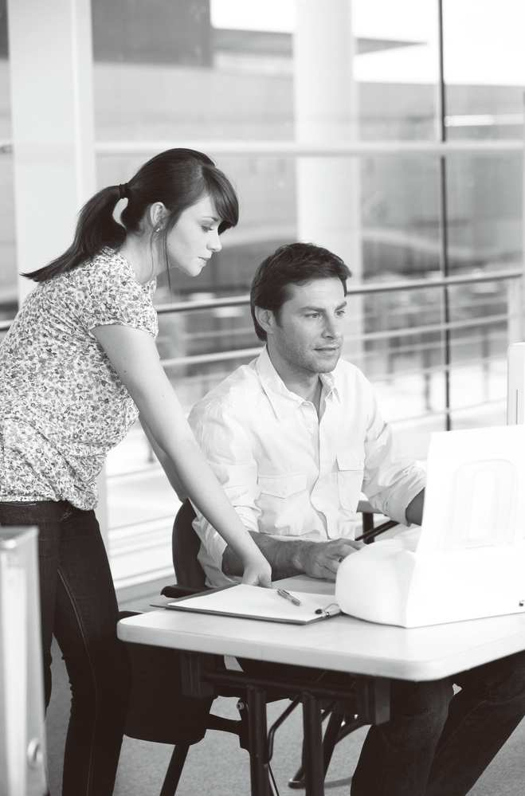**  **
**  **

                                          - 37 -

[[PAGEBREAK]]

Unit 9 Management
 Part 2 Question-Response   (p. 59)

4. (B)

 B_04
 Can you please ask Mike Green to call me? マイク・グリーンに私に電話をくれるよう頼んでもらえますか。

(A) We talked a long time. 私たちは長時間，話をしました。
(B) Sure, I’ll do it right now. はい，今すぐそうします。
(C) Yes, I was happy about it. はい，私はそのことでうれしくなりました。

5. (A)

 B_05
 When can we talk about your proposal? あなたの提案について，いつ話ができますか。

(A) Right now is good for me. 今すぐだと私の都合がいいです。
(B) My proposal was accepted. 私の提案は承認されました。
(C) Yes, I can explain. はい，私は説明できます。

6. (B)

 B_06
 What time do you want to close the shop on Saturdays? 土曜日は何時に店を閉めたいですか。

(A) It’s closed Sundays. 日曜日は閉まっています。
(B) How about at seven o’clock? 7 時ではどうですか。
(C) I want to go shopping on Saturday. 私は土曜日には買い物に行きたいです。

7. (B)

 B_07
 I would like to make a report about the problem tomorrow. 私はその問題についての報告を明日行いたいと思います。

(A) I’ll meet him tomorrow. 私は明日，彼に会うつもりです。
(B) OK, what time? いいですよ，何時ですか。
(C) No, I didn’t like it. いいえ，私はそれが好きではなかったです。

8. (A)

 B_08
 Where can I find the manager’s office? 部長のオフィスはどこにありますか。

(A) Down the hall on the left. 廊下の先の左側です。
(B) The manager is Mike White. 部長はマイク・ホワイトです。
(C) I couldn’t find any. 私はひとつも見つけられませんでした。

9. (C)

 B_09
 What should I do at the meeting? その会議で私は何をしたらいいですか。

(A) She said it was great. 彼女は，それはすばらしいと言いました。
(B) Nice to meet you, too. こちらこそ，よろしくお願いします。
(C) Please talk about sales. 売り上げについて話してください。

                                          - 38 -

[[PAGEBREAK]]

Unit 9 Management
 Part 3 Conversations    (p. 60)

               予定表：9 月会議予定表：9
             会議予定表：月曜        火曜      水曜         木曜    金曜
                                      1
  4         5        6          7     8

| 会議予定表：9月 |  |  |  |  |
| --- | --- | --- | --- | --- |
| 月曜 | 火曜 | 水曜 | 木曜 | 金曜 |
|  |  |  |  | 1 |
| 4 | 5 | 6 | 7 | 8 |
| 11 | 12 | 13 | 14 | 15 販売部 |
| 18 人事部 | 19 部長 | 20 | 21 広告部 | 22 |
| 25 | 26 | 27 | 28 | 29 |
 18        19       20        21     22
人事部        部長                広告部

10. (B) 男性の最初の発言の第 2 文に sales meeting とある。

Which type of meeting needs to be rescheduled? どのような種類の会議が予定を変更される必要がありますか。

(A) Advertising 広告
(B) Sales 営業
(C) Managers’ 部長
(D) Department 部署
11. (C) 男性の 2 回目の発言で「部長会議が同じ日に予定されていた」とある。

Why does the meeting have to be rescheduled? 会議はなぜ予定を変更されなければならないのですか。

(A) A department manager is on vacation. 部長が休暇中である。
(B) There will be a national holiday. 祝日がある。
(C) Two meetings were scheduled for the same day. ２つの会議が同じ日に予定されていた。
(D) The man and the woman will go on a business trip. 男性と女性が出張することになっている。
12. (D) 予定されていた日が department managers’ meeting（部長会議）と重なったため，女性がその翌日にすることを提案している。

Look at the graphic. Which date does the woman suggest for rescheduling the meeting? 図を見てください。女性は会議の予定日を変更するのに，どの日を提案していますか。

(A) September 15th 9 月 15 日
(B) September 18th 9 月 18 日
(C) September 19th 9 月 19 日
(D) September 20th 9 月 20 日

【英文スクリプト】 B_10
M: I just found a problem with the timetable. We have to reschedule our ( sales ) meeting this
    month.
W: Oh, really? I thought everything was OK. What’s the problem?
M: Somebody scheduled a department managers’ meeting for the ( same ) day. It seems they
    ( picked ) that day before we did.
W: I see. That’s too bad. So, ( how ) about holding our meeting on the ( next ) day instead?
【訳】
男：今，予定表に 1 つ問題が見つかったところです。私たちは，今月の営業会議の日程を変更しなければなりません。
女：まあ，本当ですか。すべて順調だと思っていましたけど。何が問題なのですか。
男：誰かが部長会議を同じ日に予定していたんです。私たちよりも先に，その日を選んでいたようなんです。
女：なるほど。それはまずいですね。では，代わりに私たちの会議はその次の日に開いてはどうですか。

                                             - 39 -

[[PAGEBREAK]]

Unit 9 Management
Part 5 Incomplete Sentences   (p. 61)

13. (A) both を使い 2 つのものを並べて，

【訳】私は，営業部長とマーケティング部長の両者と会談したいと思っている。

14. (D) 前の文につなげて，「だが」と文をつなげる場合は接続詞 but を使う。

【訳】スーザンは顧客と連絡をとろうとしたが，そのうちの何人かは返答しなかった。

15. (C)「A か B」と選択を示す場合は，接続詞 or を使う。

【訳】私たちは，ここか，あるいは会議場で会合を開くことができる。

16. (D) 前の文の結果を受けて，    「だから」とその理由を示す文をつなげる場合は接続詞 so を使う。

【訳】時間が遅くなっていたので，私たちは会合を中止した。

17. (B) あることの原因を「～なので」と述べる場合は接続詞 because を使う。

【訳】トニーは，生産ラインの問題に対応しなければならなかったので，今日は忙しかった。

18. (D)「もし～ならば」という仮定を表すには接続詞 if を使う。

【訳】明日もしあなたが出勤できなければ，必ず私に電話してください。

19. (B)「…が～するまで」と動作や状態の継続を表す場合は接続詞 until を使う。

【訳】部長たちは，仕事を終えるまでとどまった。

                                        - 40 -

[[PAGEBREAK]]

Unit 9 Management
Part 7 Reading Comprehension   (p. 62)

20. (B) これは Summer Camp（サマーキャンプ）からの手紙で，Dear parents（保護者の皆様へ）と書き出していることから，手紙の送り主はこのサマーキャンプの管理者だと思われる。

    Who most likely is Nick Hammond? ニック・ハモンドは，おそらくどのような人物ですか。

    (A) A policeman 警察官
    (B) A manager 管理者
    (C) A parent 親
    (D) A cook コック

21. (C) 本文の第 2 文に how to get along with others（他人とのつき合い方）とある。
    (A) Mathematics 数学
    (B) Reading 読書
    (C) Cooperation 協調性
    (D) Sports スポーツ

22. (D) 本文の最後に if your child has any special needs（あなたのお子さまに何か特別な配慮が必要であれば）とある。

    What can parents contact Nick Hammond about? 保護者は，ニック・ハモンドにどのようなことについて連絡をとることができるでしょうか。

    (A) The camp fee キャンプの料金
    (B) The camp’s schedule キャンプのスケジュール
    (C) Complaints 苦情
    (D) Children’s needs 子どもが必要とすること

【訳】

> サニービュー・サマーキャンプ
> 保護者の皆様へ
> サニービュー・サマーキャンプにあなたのお子さまを送ることにしていただき，誠にありがとう
> ございます。きっと，あなたのお子さまは，すばらしい時を過ごすのはもちろんのこと，自然に
> ついて，そして他人とのつき合い方について多くのことを学ぶことになるでしょう。もし，あな
> たのお子さまに何か特別な配慮が必要であれば，ご遠慮なく私までご連絡ください。
> 敬具
> ニック・ハモンド

                                         - 41 -

[[PAGEBREAK]]

Unit 10 Purchasing
 Warm-up       (p. 63)

Check Your Vocabulary!

(1) bill 請求書，紙幣
(2) cash 現金
(3) check 小切手
(4) shopper 買い物客
(5) shelf （陳列）棚 *複数形は shelves。
(6) receipt レシート，領収書，受け取り
(7) ship 発送する
(8) courier 宅配便業者
(9) delivery 配達（物）
(10) tax 税金

Word Association

(1) try on clothes 服を試着する
(2) be on display 陳列されている
(3) be in business 営業している
(4) fill out a check 小切手に記入する
(5) show one’s ID 身分証明書を提示する
(6) feel like -ing ～をしたい気分である
(7) buy something expensive 高額なものを買う
(8) write a check 小切手を切る

 Part 1 Photographs      (p. 64)

1. (D)

 B_11

(A) She is closing a window. 彼女は窓を閉めている。

(B) She is holding a bag. 彼女はバッグを持っている。
(C) She is paying for clothes. 彼女は服の代金を払っている。
(D) She is trying on clothes. 彼女は服を試着している。

2. (A)

 B_12

(A) Someone is writing a check. 誰かが小切手を書いている。
(B) Someone has filled out a check. 誰かが小切手に記入し終えた。
(C) Someone is checking a map. 誰かが地図を確認している。
(D) Someone is writing a letter. 誰かが手紙を書いている。

3. (C)

 B_13

(A) Books are on shelves. 本が棚に置かれている。
(B) The register is broken. レジは壊れている。
(C) Fruits are in boxes. 果物が箱の中に入れられている。
(D) Shoppers are buying some vegetables. 買い物客が野菜を買っている。

**  **
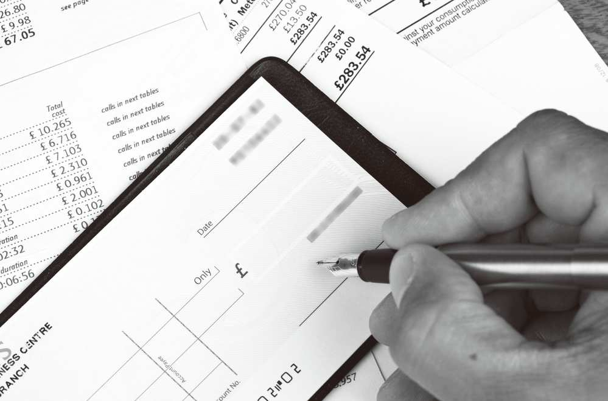**  **
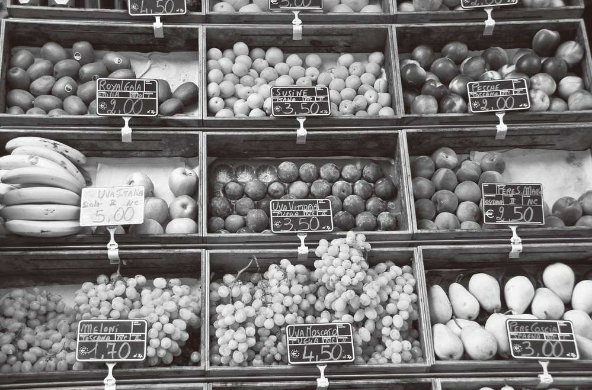**  **

                                         - 42 -

[[PAGEBREAK]]

Unit 10 Purchasing
 Part 2 Question-Response   (p. 65)

4. (C)

 B_14
 Do you want to go shopping today? あなたは今日，買い物に出かけたい？

(A) I don’t feel like bowling. 僕はボウリングがしたい気分じゃないよ。
(B) I didn’t buy anything. 僕は何も買わなかった。
(C) That’s a good idea. それはいい考えだ。

5. (A)

 B_15
 How did you pay for your jacket? ジャケットの代金はどうやって払ったのですか。

(A) By credit card. クレジットカードで。
(B) About fifty dollars. およそ 50 ドルです。
(C) Please send me the bill. 請求書を私に送ってください。

6. (B)

 B_16
 Where can I pay for this? この支払いはどこでできますか。

(A) By cash only. 現金だけです。
(B) At that cashier. あそこのレジです。
(C) I took it home. 私はそれを家に持って帰りました。

7. (B)

 B_17
 How much is the tax on these shoes? この靴にかかる税金はいくらですか。

(A) I’ll take a taxi. 私はタクシーに乗るつもりです。
(B) It’s eight percent. 8 パーセントです。
(C) Be sure they fit. サイズが合うことを確かめてください。

8. (A)

 B_18
 Can I get a shopping cart for you? ショッピングカートをお持ちしましょうか。

(A) Yes, thank you. はい，ありがとうございます。
(B) My car is over there. 私の車は向こうにあります。
(C) I’ll pay with a check. 私は小切手で支払います。

9. (C)

 B_19
 There’s a new clothing store in the mall. ショッピングセンターには，新しい衣料品店があります。

(A) They are walking down the hall. 彼らは廊下を歩いています。
(B) I already closed the door. もうドアは閉めました。
(C) Oh, let’s go together. あら，一緒に行きましょう。

                                       - 43 -

[[PAGEBREAK]]

Unit 10 Purchasing
 Part 4 Talks   (p. 66)

10. (B) 宣伝のアナウンスでは，最初にその目的が述べられることが多い。ここでは第 1 文の the biggest

    bargain of the year がそれに当たる。
What is the purpose of the advertisement? この宣伝の目的は何ですか。

(A) To tell about a new store 新規開店について伝えること
(B) To advertise a sale 特売を宣伝すること
(C) To advertise food items 食料品を宣伝すること
(D) To announce business hours 営業時間を告知すること

11. (D) 第 2 文の fashions for young people という語句から，       若者向けの商品を主に扱っているとわかる。

What kind of customers does Smart Mart usually sell to? スマートマートは，通常どのような顧客に商品を販売していますか。

(A) Older people 高齢者
(B) Babies 乳児
(C) Working people 勤労者
(D) Young people 若者

12. (C) 特売は今週末に行われるが，週末の営業時間は午後 9 時までなので(C)が正解。

Look at the graphic. When could someone take advantage of the sale? 図を見てください。今回の特売を利用できるのはいつですか。

(A) A national holiday at 1:00 p.m. 祝日の午後 1 時
(B) Tuesday at 3:00 p.m. 火曜日の午後 3 時
(C) Saturday at 11:00 a.m. 土曜日の午前 11 時
(D) Sunday at 10:00 p.m. 日曜日の午後 10 時

【英文スクリプト】 B_20
Come to the Smart Mart clothing store this weekend and enjoy the biggest ( bargain ) of the year.
Our shelves are full of the trendiest fashions for ( young ) people today. You can get 40% ( off )
everything on display in the whole store. This includes men’s and women’s shirts, pants, and, of
course, shoes. You can find Smart Mart ( at ) the south end of the Auburn Mall next to the Marquis
Theater complex.
【訳】

| スマートマートの営業時間 |  |
| --- | --- |
| 平日（金曜日を除く） | 午前10:00 – 午後6:00 |
| 金曜日 | 午前10:00 – 午後10:00 |
| 週末 | 午前10:00 – 午後9:00 |
| 祝日 | 午前10:00 – 午後2:00 |
今週末はスマートマート衣料品店にお越しいただき，今年最大のバーゲンをお楽しみください。当店の棚は，今の若者に最も流行しているファッションであふれています。お客様は，店内に陳列してあるすべての商品について 40 パーセントの割引が受けられます。これには男性用および女性用のシャツ，パンツ，そしてもちろん靴も含まれます。スマートマートは，マーキス・シアター・コンプレックスに隣接するオーバーン・モールの南の端にあります。

 Part 5 Incomplete Sentences   (p. 67)

13. (B) 二者択一で「A か B」と言う場合，either A or B を使う。

【訳】私は茶色か黒の靴が欲しい。

14. (D)「～でなければ」という仮定の文なので，接続詞 unless を使う。

【訳】もし雨が降らなければ，今週末に屋外マーケットへ行きましょう。

15. (B) ２つの文を as soon as でつなげると，

【訳】サムは，最後のお客が出て行くとすぐに店を閉めた。

                                              - 44 -

[[PAGEBREAK]]

Unit 10 Purchasing

16. (C) 過去のある時点からの継続を表せる接続詞は since。

【訳】その店は私が生まれて以来ずっと営業している。

17. (A) 接続詞 If を使って，「～ならば，～の場合は」などと条件を表すことができる。

【訳】小切手で支払いたい場合は，身分証明書を提示しなければなりません。

18. (D)「A と B の両方」と言う場合は，both A and B を使う。

【訳】スーザンは赤いコートと黒い靴の両方を買った。

19. (D)「～のときは」という表現には，接続詞 when を使う。

【訳】何か高額のものを買ったときは，必ず領収書を保管しておきなさい。

Part 6 Text Completion   (p. 68)

20. (A) E メールの冒頭には，その目的が述べられていることが多い。「件名」を意味する Re:の欄にある

    Your order がヒント。

21. (C) 注文した品物の発送についての話に続くのは，その確認方法の説明が適切。
22. (B) 空所の直前の should は「～のはず」という意味の助動詞で，その直後には動詞の原形が置かれる。
23. (C) 空所の後に questions と名詞の複数形があるので，a と one は不適当。そして questions は具体的に特定されていないので the（その）ではなく any（何か）を選ぶ。

【訳】

> 宛先：サンドラ・ジョーンズ
> 差出人：テルマ・レイエス
> 日付：1 月 14 日
> 件名：お客様のご注文
> ジョーンズ様，
> お客様のご注文は処理されて，1 月 15 日にフェリックス宅配便にて発送される予定です。出荷
> 状況については，当社のウェブサイトでご確認いただけます。
> お客様は 2 日かる無料の陸上便を選ばれましたので，小包はご自宅に 1 月 17 日の夕方に届く
> が必要な場合は，その宅配便業者にご依頼ください。
> 今回の出荷について何かご質問がございましたら，ご連絡をくださるようお願いたします。当
> 社へご注文いただき，誠にありがとうございました。
> 敬具
> テルマ・レイエス
> 出荷担当マネジャー
    敬具

                                   - 45 -

[[PAGEBREAK]]

Unit 11 Finances
 Warm-up       (p. 69)
Check Your Vocabulary!

(1) account 口座
(2) insurance 保険
(3) deposit 預金（する）     ，手付金
(4) pension 年金
(5) fund 資金（を出す）
(6) interest 利子
(7) count 数える
(8) loan ローン，貸し付け（る）
(9) ATM 現金自動預け払い機 *Automatic Teller Machine の略
(10) withdraw （預金を）引き出す

Word Association

(1) make a deposit 預金する
(2) take out money お金を引き出す
(3) open an account 口座を開く
(4) solve a problem 問題を解決する
(5) save money for retirement 退職後のために貯金する
(6) receive a deposit 入金がある
(7) pay a bill 料金を支払う
(8) wait in line 列を作って待つ

 Part 1 Photographs      (p. 70)

1. (C)

 B_21

(A) She is reading a newspaper. 彼女は新聞を読んでいる。

(B) She is viewing a magazine. 彼女は雑誌を見ている。
(C) She is looking at some papers. 彼女は書類を見ている。
(D) She is writing something. 彼女は何かを書いている。

2. (D)

 B_22

(A) Customers are waiting in line. お客が列を作って待っている。

(B) The bank is busy. 銀行は混雑している。
(C) A woman is counting money. 1 人の女性がお金を数えている。
(D) A woman is behind a desk. 1 人の女性は机の後ろにいる。

3. (B)

 B_23

(A) A woman is speaking to a teller. 女性は窓口係と話をしている。
(B) A woman is standing at an ATM. 女性は ATM（現金自動預け払い機）のところに立っている。
(C) A woman is borrowing a book. 女性は本を借りている。
(D) A woman is paying for her lunch. 女性はランチの代金を支払っている。

**  **
**  **
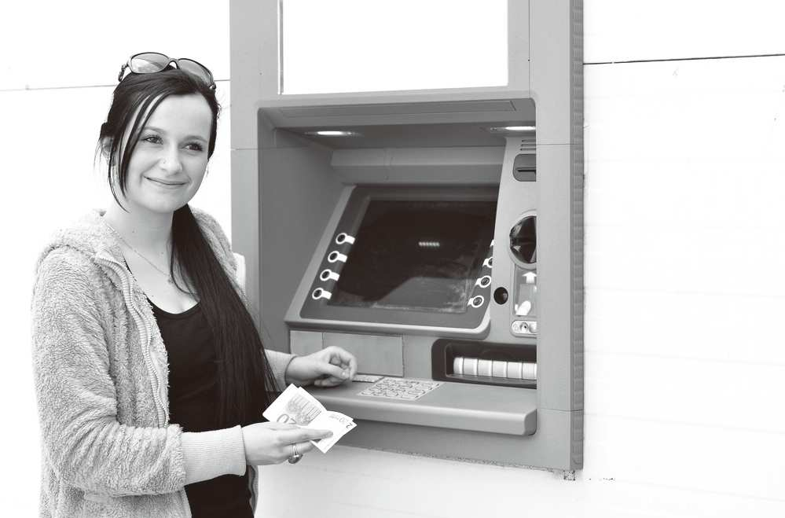**  **

                                          - 46 -

[[PAGEBREAK]]

Unit 11 Finances
 Part 2 Question-Response   (p. 71)

4. (A)

 B_24
 Did you pay your water bill? あなたは水道料金を支払いましたか。

(A) I did it yesterday. 私は昨日，そうしました。
(B) I’m drinking some now. 私は今，飲んでいます。
(C) I don’t like swimming. 私は水泳が好きではありません。

5. (A)

 B_25
 Can I withdraw some money? 私はお金をいくらか引き出すことはできますか。

(A) Yes, up to five hundred dollars. はい，500 ドルまでなら。
(B) No, you can’t deposit money here. いいえ，ここではお金を預けられません。
(C) Yes, I can lend you some money. はい，いくらかあなたにお金を貸すことができます。

6. (B)

 B_26
 How can I pay for the delivery? その配達料はどう支払えばいいですか。

(A) Check the delivery. 配達物を確認してください。
(B) Please send a check. 小切手をお送りください。
(C) It will cost fifty-five dollars. それは 55 ドルかかるでしょう。

7. (C)

 B_27
 Can you loan me some money? 私にいくらかお金を貸してもらえますか。

(A) The car was expensive. その車は高価でした。
(B) Yes, I need it. はい，私にはそれが必要です。
(C) Sure, how much? いいですよ，いくらですか。

8. (A)

 B_28
 Do you save money for retirement? あなたは退職後に備えて貯金をしていますか。

(A) Yes, every month. はい，毎月。
(B) I’ll retire in five years. 私は 5 年後に退職します。
(C) Yes, I’ve been tired recently. はい，私は最近，疲れています。

9. (C)

 B_29
 Is it important to have health insurance? 健康保険に入るのは大事ですか。

(A) Car insurance is pretty cheap. 自動車保険はとても安いです。
(B) I’m usually very healthy. 私は普段はとても健康です。
(C) Yes, it’s necessary. はい，それは必要です。

                                         - 47 -

[[PAGEBREAK]]

Unit 11 Finances
 Part 3 Conversations   (p. 72)

10. (B) 女性の最初の発言に「預金をしたが金額が間違っている」とある。

Why is the woman at the bank? 女性はなぜ銀行にいるのですか。

(A) She wants to deposit money. 彼女は預金をしたい。
(B) She wants to solve a problem. 彼女は，ある問題を解決したい。
(C) She wants to take out money. 彼女はお金を引き出したい。
(D) She wants to open an account. 彼女は口座を開きたい。

11. (C) 女性の 2 回目の発言の中に，           「通帳の金額が 400 ドルのはずなのに 40 ドルになっている」とある。

    bankbook と account book はどちらも「通帳」という意味。
What is the matter? 何が問題ですか。

(A) The manager is not available. マネジャーが不在である。
(B) The woman forgot her ID. 女性が自分の身分証を忘れた。
(C) There is a mistake in the woman’s bankbook. 女性の通帳に間違いがある。
(D) The bank will close soon. 銀行が間もなく閉まる。

12. (B) 金額が間違っていると女性は言っているので，銀行側は記録を詳しく調べることになる。

What will the man probably do next? 男性は，次に何をすると思われますか。

(A) Take money from the woman 女性からお金を受け取る
(B) Check the bank’s records 銀行の記録を調べる
(C) Cancel the woman’s account 女性の口座を解約する
(D) Close his window 窓口を閉める

【英文スクリプト】 B_30
M: Hello. How can I help you today?
W: Well, I (made) a deposit earlier today but the amount is (wrong).
M: OK. Let’s see what we can do about it. Can you show me your account (book),
      please?
W: Sure. It (says) I deposited forty dollars but it (should) be four hundred.

【訳】
男：こんにちは。今日はどのようなご用件でしょうか。
女：ええと，今日早いうちに，私は預金をしたのですけど，金額が間違っているんです。
男：わかりました。何をすべきか考えさせてください。お客様の預金通帳をお見せいただけますか。
女：もちろんよ。そこには私が 40 ドル預金したとされていますが，それは 400 ドルのはずなんです。

                                          - 48 -

[[PAGEBREAK]]

Unit 11 Finances
Part 5 Incomplete Sentences   (p. 73)

13. (D) 助動詞の can が使われている疑問文なので，それに続く動詞は原形となる。

【訳】金曜日までに電気料金を払ってもらえますか。

14. (A) 文末に yesterday があり，動詞 leave の過去形を使う必要があるので left が正解。

【訳】あなたは昨日，保険証をテーブルの上に置き忘れていきました。

15. (C) これは過去のことを尋ねる疑問文。すでに did という助動詞の過去形が使われているので，それに続く動詞は原形となる。

【訳】あなたは，ATM（現金自動預け払い機）からいくら引き出したのですか。

16. (A) 助動詞 will を使った未来のことについての質問文。will に続く動詞は原形となる。

【訳】あなたの自動車ローンでは，利子がどれくらいになりますか。

17. (B) 〈be sure to＋動詞の原形〉で「必ず～するようにする」という意味になる。

【訳】いつも家賃は期限通りに必ず払うようにしなさい。

18. (D) 「いつも～する」のように現在の習慣を表す場合は，動詞の現在形を使う。そして，主語の Carl

    は 3 人称単数なので goes となる。
【訳】カールは，請求書の支払いをするのに，いつも銀行へ行く。

19. (D) start を使って「～し始める」と表現する場合は，後ろに動名詞（-ing）もしくは to 不定詞を使う。

    ここでは選択肢の中にある動名詞 getting を選ぶ。
【訳】あなたは 65 歳で年金を受け取れるようになります。

                                        - 49 -

[[PAGEBREAK]]

Unit 11 Finances
Part 7 Reading Comprehension   (p. 74)

20. (B) 最初の E メールの冒頭で「カウンティ・バンクのヘレン・ミラーと申します」と名乗っているので銀行関係者だとわかる。

     Who most likely is Helen Miller? ヘレン・ミラーは，どのような人物だと考えられますか。

    (A) A bank customer 銀行の顧客
    (B) A bank employee 銀行員
    (C) A real estate agent 不動産業者
    (D) A tax officer 税務署員

21. (B) 最初の E メールの I’m writing to（私は～するために書いています）以下に，その用件が書いてある。

    Why did Helen Miller write to Jeffery Krantz? ヘレン・ミラーは，なぜジェフリー・クランツに文書を書いたのですか。

    (A) To ask him to pay her 彼に彼女への支払いを求めるため
    (B) To inform him of money in his account 彼の口座にあるお金について知らせるため
    (C) To tell him about his taxes 彼に税金について伝えるため
    (D) To suggest opening an account 口座を開設するよう提案するため

22. (D) 最初の E メールの日付が May 26（5 月 26 日）で，お金は tomorrow morning（明日の朝）に引き出せるとあるので，May 27 が正解。

    When will Jeffery Krantz be able to take money out of his account? ジェフリー・クランツは，自分の口座からいつお金を引き出せるのでしょうか。

    (A) May 24 5 月 24 日
    (B) May 25 5 月 25 日
    (C) May 26 5 月 26 日
    (D) May 27 5 月 27 日

23. (A) 返信の E メールに「deposit fee（入金手数料）が不明なので，教えてほしい」とある。

    What is the purpose of Jeffery Kranz’s email? ジェフリー・クランツの E メールの目的は何ですか。

    (A) To ask about a fee 手数料について問い合わせること
    (B) To request a deposit 入金を求めること
    (C) To cancel a deposit 入金をキャンセルすること
    (D) To open a new account 新しい口座を開くこと

24. (C) 最初の E メールでは「4,000 ドルを入金した」とあり，返信の E メールでは「入金の手数料が入金額から差し引かれるのを理解している」とあるので，4,000 ドルよりも少なくなると考えられる。

    What will be the amount of money Jeffery Kranz can get tomorrow morning?
    明日の朝に，ジェフリー・クランツが手に入れる金額はいくらでしょうか。

    (A) Exactly $4,000 ちょうど 4,000 ドル
    (B) More than $4,000 4,000 ドルより多い
    (C) Less than $4,000 4,000 ドルに満たない
    (D) Nothing 何もない

                                         - 50 -

[[PAGEBREAK]]

Unit 11 Finances

【訳】

> 宛先：ヘレン・ミラー
> 差出人：ジェフリー・クランツ
> 件名：Re：入金
> ミラー様
> 入金についてのお知らせ，誠にありがとうございます。そちらの銀行は入金手数料がかると理
> 解しております。また，その手数料は入金額から差し引かれるものと理解しております。ただし，
> その料金がどれくらいになるのか，私にはわかりません。その金額を折り返し E メールで知らせ
> ていただけますか。
> よろしくお願いたします。
> ジェフリー・クランツ

  よろしくお願いいたします。

                       - 51 -

[[PAGEBREAK]]

Unit 12 Media

 Warm-up       (p. 77)

Check Your Vocabulary!

(1) cellphone 携帯電話
(2) program 番組
(3) ad 広告，宣伝 *advertisement の省略形。
(4) journalist ジャーナリスト
(5) magazine 雑誌
(6) publish 出版する，発行する
(7) accident 事故
(8) neutral 中立的な，偏らない
(9) terrible ひどく嫌な，ひどく悪い
(10) forecast （天気）予報 *weather forecast あるいは weather report とも言う。

Word Association

(1) take a picture 写真を撮る
(2) point a camera at～ ～にカメラを向ける
(3) watch the news on TV テレビでニュースを見る
(4) learn more about～ ～の詳細を知る
(5) be expected to do ～すると予想される
(6) be finished with～ ～を終える，済ませる
(7) see a movie （劇場で）映画を見る *テレビで見るときは watch a movie。
(8) be broadcast live 生中継される *live は[láiv]と発音する。

 Part 1 Photographs      (p. 78)

1. (B)

 B_31

(A) A woman is interviewing a man. 女性が男性にインタビューをしている。

(B) A man is interviewing a woman. 男性が女性にインタビューをしている。
(C) A man is filming a woman. 男性が女性を撮影している。
(D) A woman is filming a man. 女性が男性を撮影している。

2. (D)

 B_32

(A) A man is watching a video. 男性がビデオを見ている。

(B) A woman is taking a picture. 女性が写真を撮っている。
(C) People are at a news studio. 人々はニュース番組のスタジオにいる。
(D) A camera is pointed at a man. カメラが男性に向けられている。

3. (A)

 B_33

(A) Magazines are on display. 雑誌が陳列されている。
(B) People are buying some magazines. 人々が雑誌を買っている。
(C) This magazine stand is very crowded. この雑誌の売店はとても込み合っている。
(D) They are publishing some magazines. 彼らは雑誌を発行している。

**  **
**  **
**  **

                                         - 52 -

[[PAGEBREAK]]

Unit 12 Media
 Part 2 Question-Response   (p. 79)

4. (B)

 B_34
 Do you watch the news on TV every day? あなたは毎日，テレビでニュースを見ますか。

(A) Yes, please. はい，お願いします。
(B) No, not really. いいえ，あまり見ません。
(C) No, thank you. いいえ，結構です。

5. (A)

 B_35
 英 The forecast said it’s going to rain later today. 天気予報は，今日これからの時間に雨が降ると言っていました。

 加 (A) Then I should bring an umbrella. では，私は傘を持って行かなくては。
(B) Good, I was looking forward to nice weather. よかった，私はよい天気を待ち望んでいました。
(C) No, I usually don’t care about the weather. いいえ，私は普段，天気を気にしません。

6. (B)

 B_36
 I’ve been reading a really good book. 私は，とてもおもしろい本を読んでいます。

(A) I really want to book a nice hotel. 私は，よいホテルをぜひ予約したいです。
(B) Can I borrow it when you’re finished with it? あなたが終わったら，それをお借りできますか。
(C) But aren’t tickets expensive now? でも，今，チケットは高いのではないですか。

7. (C)

 B_37
 Did you hear about the big traffic accident yesterday? 昨日の大きな交通事故のことを聞きましたか。

(A) Yes, it was great. はい，それはすばらしかったです。
(B) Yes, I’m glad. はい，よかったです。
(C) Yes, it was terrible. はい，ひどかったです。

8. (C)

 B_38
 How do you usually contact your friends? あなたは普段，友達にどうやって連絡をしますか。

(A) About once a week. だいたい週に１回です。
(B) I have lots of friends. 私にはたくさんの友達がいます。
(C) I use my cellphone. 私は携帯電話を使います。

9. (B)

 B_39
 The photographer takes really nice pictures of animals. その写真家は，動物のとてもよい写真を撮ります。

(A) Can you take my picture? 私の写真を撮ってもらえますか。
(B) Can I see some of them? そのいくつかを見ることができますか。
(C) Your camera is very nice. あなたのカメラはとてもいいですね。

                                         - 53 -

[[PAGEBREAK]]

Unit 12 Media
 Part 4 Talks   (p. 80)

10. (B) これは天気予報の番組であることはすぐにわかる。さらに as you can see from this satellite

    photo という言葉から，衛星写真の画像が表示されるメディア，すなわちテレビでの天気予報だとわかる。
Where can this weather report most likely be heard? この天気予報は，どこで最も聞かれそうですか。

(A) On the radio ラジオで
(B) On television テレビで
(C) In an airport 空港で
(D) At an outdoor concert 野外コンサートで

11. (C) 天気予報で言われている stay(ing) indoors（屋内にとどまる）を言い換えると Stay inside

    buildings となる。
What do police suggest people do? 警察は何をすることを勧告していますか。

(A) Escape from the area 今いる場所から避難する
(B) Go outdoors to check the weather 屋外に出て天気をチェックする
(C) Stay inside buildings 建物の中にとどまる
(D) Call them for more information 警察に電話してより多くの情報を求める

12. (B) これは近づいてくる嵐に警戒することを呼びかけている放送である。

Why does the speaker say, “Be careful and be safe”?
話し手は，なぜ“Be careful and be safe”と言っているのですか。

(A) Police are searching for criminals. 警察が犯罪者を捜しているから。
(B) A storm is coming to the area. 嵐がその地域にやって来るから。
(C) Many people will do outdoor sports this weekend. 今週末に多くの人たちが野外スポーツをすることになっているから。
(D) There have been many car accidents lately. 最近，自動車事故が多くなっているから。

【英文スクリプト】 B_40
Good evening. I’m Carey Simmons and this is your weather ( report ) for this weekend. You might
have to ( change ) your outdoor plans for Saturday and Sunday. As you can ( see ) from this
satellite photo, a big storm is coming our way late Friday night. We can expect very strong winds
and heavy rain ( until ) late Sunday night. Police recommend ( staying ) indoors and traveling by
car only if necessary. Be careful and be safe!

【訳】
こんばんは。キャリー・シモンズが今週末の天気予報をお伝えいたします。皆さんは，土曜日と日曜日のお出かけの予定を変更する必要があるかもしれません。この衛星写真からもわかるように，大きな嵐が金曜日の深夜にこちらにやって来ます。日曜日の深夜まで，暴風と大雨が予想されます。警察は，屋内にとどまり，どうしても必要な場合のみ車で移動するよう勧告しています。用心して無事にお過ごしください！

                                              - 54 -

[[PAGEBREAK]]

Unit 12 Media
Part 5 Incomplete Sentences   (p. 81)

13. (D) seen という動詞の過去分詞の形から，相手に経験を尋ねる疑問文とわかるので助動詞の Have を文頭に置く。

【訳】あなたは最近，何かいい映画を見ましたか。

14. (A) next（次の）と this evening（今日の夕方）から，未来のことを話していると考えられるので，助動詞 will を使っている(A)を選ぶ。

【訳】次の天気予報は，今日の夕方の５時半にあるだろう。

15. (C) last night（昨夜）と過去のことを話しているので，過去形の動詞 saw（見た）を選ぶ。

【訳】私は昨夜，あなたがすすめてくれたテレビ番組を見ました。

16. (D) 主語は sales（売り上げ）という複数名詞であることと，接続詞 as 以下で使われている動詞が現在形なので，対応する be 動詞には are を選ぶ。

【訳】より多くの人がインターネットを使ってオンラインニュースを読むので，新聞の売り上げは減ることが予想される。

17. (B) when 以下を見ると，過去についての文だとわかる。過去のある時点で進行中の動作（～していた）には，過去進行形が使われる。

【訳】そのテレビ局は，そのイベントが生中継されたときに新型カメラを使っていた。

18. (D) 助動詞 should とともに使われる動詞は原形になる。この文では be と give がそれにあたる。

【訳】よいジャーナリストは中立で，人々にできるだけ多くの情報を提供すべきだ。

19. (D) この文の主語は The ad（広告）だが，それに対応する述語動詞が見当たらないので，それに該当する形を選ぶ。says to～（～するようにと書いてある）となるよう says を選ぶ。

【訳】その広告には，その製品についてさらによく知るには彼らのウェブサイトを訪問するようにと書いてある。

Part 6 Text Completion   (p. 82)

20. (B) different（異なる）という形容詞に修飾される名詞が必要。feature は可算名詞なので，冠詞の a

    がついた単数形か複数形のどちらかとなる。選択肢にあるのは複数形。

21. (B) 「写真をたくさん撮る」→「保存容量の大きいものを選ぶべきだ」と考えるのが自然。
22. (C) 〈so ... that～〉という構文で「あまりにも…なので～だ」という意味になる。大きすぎると不便になるのは持ち運ぶ（carry）場合。carry～around は「～をあちこちに持ち運ぶ」というイディオム。
23. (D) 形容詞の最上級（この場合は best）の前には定冠詞の the が必要。

【訳】

> 宛先：サンディ・ビーチ
> 差出人：マイク・ジョンソン
> 件名：スマートフォン
> やあ，サンディ，
> 僕もそう思うよ。最近ではスマートフォンを選ぶのは本当に難しいね！ どれもみなおもしろい
> けれど，それぞれ違った特徴があるからね。
> 君はいつも写真をたくさん撮るよね？ それだったら，保存容量が大きいものがおすめだよ。
> それから大きな画面がついているものもおすめだけど，大きすぎて楽に持ち運べないスマート
> フォンは買ってはだめだ。
> 業者の店に行く前にインターネットの広告を見て，新製品の一番安い価格を見つけておくとい
> と思うよ。
> うまくいくといね！
> マイク

    うまくいくといいね！

                                        - 55 -

[[PAGEBREAK]]

Unit 13 Entertainment
 Warm-up       (p. 83)

Check Your Vocabulary!

(1) audience 観客，聴衆
(2) comedy コメディー，喜劇
(3) competition 競争，コンテスト
(4) location 場所
(5) empty 人がいない，中身のない
(6) welcome 歓迎する，喜んで受け入れる
(7) fair 縁日，展示会，見本市
(8) prefer to do ～するほうを好む
(9) theater 劇場，映画館
(10) stadium 競技場

Word Association

(1) pick up someone 人を車で迎えに行く *人が代名詞の場合は〈pick＋代名詞＋up〉の語順。
(2) see a play 劇を見る
(3) sound good よさそうに聞こえる
(4) finish by～ ～までに終わる
(5) be prepared to do ～する準備［覚悟］ができている *be ready to do も同じ意味。
(6) last until～ ～まで続く
(7) Why don’t I～? 私が～しましょうか。
(8) perform on stage 舞台で演じる

 Part 1 Photographs      (p. 84)

1. (C)

 B_41

(A) The woman is playing the piano. 女性はピアノを弾いている。

(B) The woman is playing with a band. 女性はバンドと一緒に演奏している。
(C) The woman is sitting at a piano. 女性はピアノのところに座っている。
(D) The woman is in front of an audience. 女性は聴衆の前にいる。

2. (C)

 B_42

(A) Fans are buying tickets. ファンの人たちがチケットを買っている。

(B) The stadium is empty. 競技場には人がいない。
(C) People are in a stadium. 人々は競技場にいる。
(D) People are watching a movie. 人々は映画を見ている。

3. (D)

 B_43

(A) They are watching a match. 彼らは試合を見ている。
(B) They are standing on the table. 彼らはテーブルの上に立っている。
(C) They are preparing to eat. 彼らは食事をする準備をしている。
(D) They are ready for a game. 彼らはゲームを始める準備ができている。

**  **
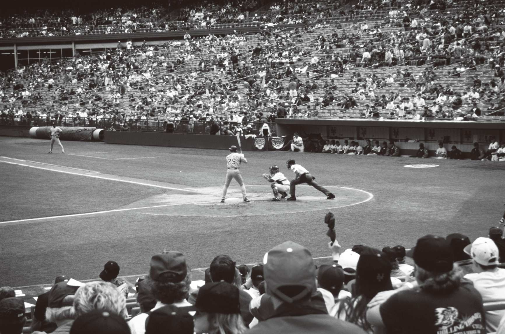**  **
**  **

                                          - 56 -

[[PAGEBREAK]]

Unit 13 Entertainment
 Part 2 Question-Response   (p. 85)

4. (B)

 B_44
 Do you want to see a movie this weekend? あなたは，今週末に映画を見たいですか。

(A) I saw one. 私は映画を見ました。
(B) Good idea. いいですね。
(C) I haven’t seen it. 私はそれをまだ見ていません。

5. (A)

 B_45
 How was the soccer game yesterday? 昨日のサッカーの試合はどうでしたか。

(A) Really exciting. 本当に興奮しました。
(B) No, I don’t play games. いいえ，私はゲームをしません。
(C) I’ll go soon. 私はすぐに行きます。

6. (A)

 B_46
 Let’s go see a play this weekend. 今週末は演劇を見に行きましょう。

(A) Sorry, I’ll be busy. ごめんなさい，私は忙しくなるんです。
(B) I played tennis. 私はテニスをしました。
(C) The playground is near. 遊び場は近くにあります。

7. (B)

 B_47
 How much were the tickets to the concert? そのコンサートのチケットはいくらでしたか。

(A) I bought five. 私は 5 枚買いました。
(B) About fifteen dollars each. 1 枚およそ 15 ドルでした。
(C) It took an hour. 1 時間かかりました。

8. (C)

 B_48
 What kind of movie do you want to see, a comedy or a drama? どのような映画を見たいですか，コメディー，それともドラマ？

(A) Yes, that’s a good idea. ええ，それはいい考えです。
(B) I want to see a movie. 私は映画が見たいです。
(C) I prefer comedies. 私はコメディーのほうが好きです。

9. (C)

 B_49
 There’s a really good program on TV tonight. 今夜，テレビで本当におもしろい番組があります。

(A) I’ll show you tomorrow. 私は明日，あなたにお見せしましょう。
(B) But the theater is too far. でも，その劇場は遠すぎます。
(C) Oh, let’s see it together. まあ，一緒にそれを見ましょう。

                                          - 57 -

[[PAGEBREAK]]

Unit 13 Entertainment
 Part 3 Conversations     (p. 86)

10. (B) 男性の最初の発言にある「一緒にショッピングセンターで過ごすのはどう？」という提案をめぐって会話が進み，最後に女性が「靴を見るのにつき合って」と言っている。

What are the man and the woman mainly talking about? 男性と女性は，主に何について話していますか。

(A) Opening a new store 新しい店を開くこと
(B) Going shopping together 一緒に買い物に行くこと
(C) Having lunch at a shopping center ショッピングセンターで昼食を食べること
(D) Buying a present for a friend 友達のためにプレゼントを買うこと

11. (D) That’s not a bad idea.は相手の提案への同意を表すときによく使われる表現。

Why does the woman say, “That’s not a bad idea”? 女性はなぜ“That’s not a bad idea”と言っているのですか。

(A) She doesn’t like the man’s suggestion. 彼女には男性の提案が気に入らない。
(B) She feels disappointed. 彼女はがっかりした。
(C) She wants more information. 彼女はもっと情報がほしい。
(D) She agrees with the man’s suggestion. 彼女は男性の提案に賛成している。

12. (A) 男性が最初に「土曜日の午後」と言っているが，女性は午後に仕事があるため，結局 10 時に会うことになっている。

When will the man and the woman meet? 男性と女性はいつ会うのでしょうか。

(A) Saturday morning 土曜日の午前中
(B) Saturday afternoon 土曜日の午後
(C) Sunday morning 日曜日の午前中
(D) Sunday afternoon 日曜日の午後

【英文スクリプト】 B_50
M: What do you think about ( spending ) Saturday afternoon at the shopping center with me?
W: That’s not a bad idea. But I have to do some work in the ( afternoon ). How about going a bit
    earlier, say at nine o’clock?
M: Oh, I don’t think the mall is open that ( early ). Why don’t I ( pick ) you up at your house at ten?
W: OK. ( Sounds ) good to me. But be prepared to look at shoes with me!

【訳】
男：土曜日の午後，僕とショッピングセンターで一緒に過ごすのはどうかな？
女：悪くないわね。でも，午後は仕事をしなければならないの。少し早め，例えば 9 時頃に出かけるのはどう？
男：ああ，ショッピングセンターはそんなに早くは開いていないと思うよ。10 時に君の家に車で迎えに行こうか？
女：ええ。いいわね。でも，私が靴を見るのにつき合うつもりでいてね！

                                                 - 58 -

[[PAGEBREAK]]

Unit 13 Entertainment
 Part 5 Incomplete Sentences    (p. 87)

13. (D)「インターネットで」と言う場合に使われる前置詞は on。

【訳】私は，インターネットでおかしなビデオを見るのがとても好きだ。

14. (D)「～の代金」と言う場合には，その品物やサービスの前に前置詞 for をつける。

【訳】チケットの代金はどのように支払いたいですか。

15. (A)「～までに」という期限を表す場合には，前置詞 by を使う。

【訳】そのコンサートは午後 8 時までには終わるはずだ。

16. (B) be full of～（～でいっぱいになっている）をフレーズとして覚えておくとよい。

【訳】競技場は，興奮したファンたちですっかりいっぱいになっていた。

17. (B) 「舞台で」は on stage というフレーズを使う。

【訳】そのコメディアンは，テレビよりも舞台で演じるほうを好んでいる。

18. (A) 一定の期間を表す場合は，前置詞 for を使う。

【訳】エイミー・ホワイトは，過去 3 年間，ライブコンサートを開いていない。

19. (D)「～にある～，～に属する～」と言う場合は，前置詞 of を使う。

【訳】劇場の 2 階で食べ物や飲み物を買うことができます。

 Part 7 Reading Comprehension      (p. 88)

20. (B) County Fair とはアメリカの county（郡）で開催されるお祭りのことで，この広告はその案内。

     What is this advertisement for? この広告は何のためのものですか。

    (A) A new product 新製品
    (B) A special event 特別なイベント
    (C) A school fair 学園祭
    (D) A new event site 新しいイベント会場

21. (C) 文中の Ride（乗り物）は Roller coasters（ジェットコースター）                 ，concert（コンサート）は Country

    music（カントリーミュージック）              ，food competitions（食品の競技会）は A cooking contest（料理コンテスト）にそれぞれ対応すると考えられるが，Horse racing に当てはまるものは文中にない。
    According to the advertisement, which might NOT be available at the fair? この広告によると，このお祭りになさそうなものはどれですか。

    (A) Roller coasters ジェットコースター
    (B) Country music カントリーミュージック
    (C) Horse racing 競馬
    (D) A cooking contest 料理コンテスト

22. (A) イベントについて，日付と期間，場所，内容，チケット情報の順に説明されていると考えられる。

    [1]，[2]，[3]，[4]と記載された箇所のうち，次の文が入るのに最もふさわしいところはどこですか。
    “A full two weeks of fun!”（楽しさが続く 2 週間！）

    (A) [1]
    (B) [2]
    (C) [3]
    (D) [4]

【訳】

> ミッドランド・カウンティフェアにお越しください
> (7) 月 1 日から 7 月 14 日まで開催。楽しさが続く 2 週間！
> ミッドランド・カウンティ博覧会場にて。郡内でも最高のロケーション。
> 子どもから大人にまで，たくさんの食べ物とお楽しみを用意しています。
> 乗り物，コンサート，料理コンテストもあります。ご家族連れでお越しください！
> チケットは，コンビニもしくはウェブサイトでご購入ください。
> w.midlandcountyfair.com

                                             - 59 -

[[PAGEBREAK]]

Unit 14 Health
 Warm-up       (p. 89)

Check Your Vocabulary!

(1) examine 診察する，検査する
(2) dentist 歯科医
(3) physician 内科医
(4) X-ray レントゲン（写真）
(5) exercise 運動（する）
(6) healthcare 医療，健康管理
(7) checkup 健康診断
(8) medicine 薬
                                         「吐き気」と言う場合は sickness を使う。
(9) sickness 病気 *同じ意味の illness はやや形式ばった表現。
(10) patient 患者

Word Association

(1) catch a cold 風邪を引く
(2) have a high fever 高熱がある
(3) see a doctor 医者に診てもらう
(4) lose weight 体重を減らす
(5) work for ～ ～に効く，効果がある
(6) feel sick 気持ちが悪い
(7) have a checkup 健康診断を受ける

(8) take a pill 錠剤を飲む

 Part 1 Photographs      (p. 90)

1. (D)

 B_51

(A) The doctor is standing up. 医師は立っている。
(B) The patient is lying down. 患者は横になっている。
(C) The patient is walking into the room. 患者が部屋の中に入っていくところである。
(D) The doctor is smiling at a patient. 医師は患者にほほ笑んでいる。

2. (A)

 B_52

(A) They are using machines at a gym. 彼らはスポーツジムで器具を使っている。

(B) They are exercising outdoors. 彼らは屋外で運動をしている。
(C) They are running on machines. 彼らは機械の上で走っている。
(D) They are lifting some boxes. 彼らはいくつかの箱を持ち上げている。

3. (B)

 B_53

(A) A doctor is writing on a chart. 医師が図表に書き込んでいる。
(B) A doctor is on the phone. 1 人の医師は電話中である。
(C) The patients are seeing a doctor. 患者たちは医者の診察を受けている。
(D) A doctor is looking at an X-ray. 1 人の医師はレントゲン写真を見ている。

**  **
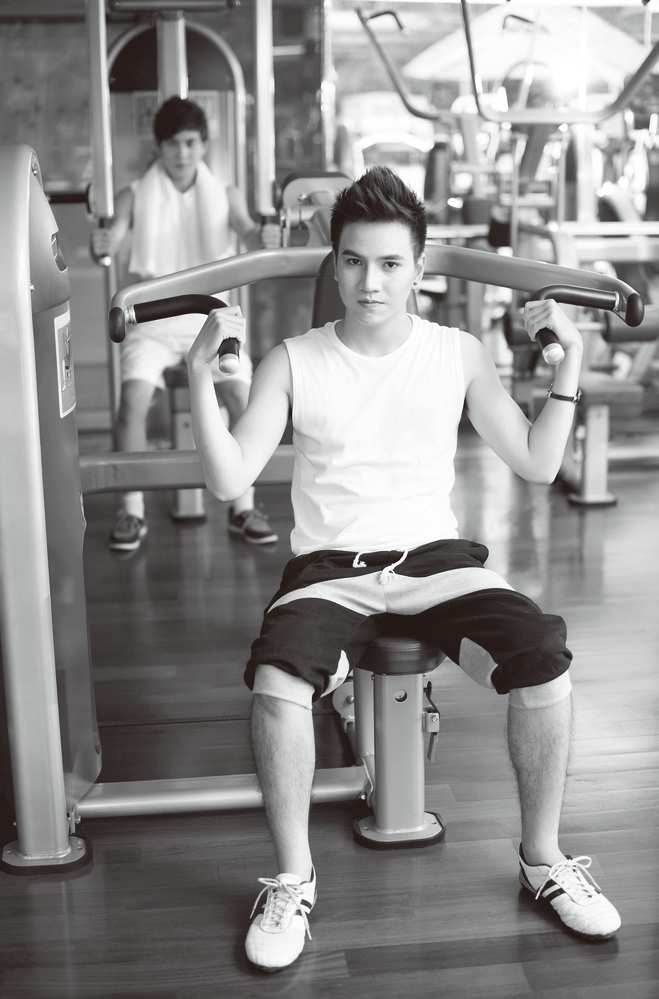**  **
**  **

                                          - 60 -

[[PAGEBREAK]]

Unit 14 Health
 Part 2 Question-Response   (p. 91)

4. (C)

 B_54
 Do you have a health insurance card? あなたは健康保険証を持っていますか。

(A) Yes, I’m usually healthy. はい，私はいつもは健康です。
(B) No, I don’t have a license. いいえ，私は免許証を持っていません。
(C) Yes, here it is. はい，これです。

5. (B)

 B_55
 How often do you exercise? あなたは，どれくらいの頻度で運動をしますか。

(A) I usually run in the park. 私は，たいてい公園で走ります。
(B) About three times a week. 週に 3 回くらいです。
(C) Yes, I’m very excited. はい，私はとてもわくわくしています。

6. (C)

 B_56
 I’ve had a high fever for three days. 私はこの 3 日間，高い熱が出ています。

(A) Yes, it’s been hot recently. はい，最近は暑かったです。
(B) Healthcare costs are high. 医療費は高額です。
(C) You should see a doctor. あなたは医者に診てもらうべきです。

7. (B)

 B_57
 What’s the best way to lose weight? 体重を減らす一番よい方法は何ですか。

(A) I lost about three pounds last year. 私は去年，およそ３ポンド減らしました。
(B) Exercise and eat healthy food. 運動をして，健康によい食品を食べなさい。
(C) It’s best to wait here. ここで待つのが一番です。

8. (A)

 B_58
 Can you recommend a good dentist? よい歯科医をすすめてもらえますか。

(A) Dr. North is very good. ノース先生がとてもいいです。
(B) I think that dentist is bad. その歯科医はひどいと思います。
(C) I see him about twice a year. 私は彼とは年に２回ほど会います。

9. (C)

 B_59
 Do you need more medicine? あなたはもっと薬が必要ですか。

(A) Yes, the medicine will work for you. はい，その薬はあなたに効くでしょう。
(B) Sure, I’ll give you some. わかりました，あなたにいくつかお渡しします。
(C) Yes, I still feel sick. はい，まだ気分が悪いです。

                                         - 61 -

[[PAGEBREAK]]

Unit 14 Health
 Part 4 Talks    (p. 92)

10. (A) 話し手は自分のことを physician（内科医）と言っているので医者である。

Who most likely is the speaker? 話し手はおそらくどのような人物ですか。

(A) A doctor 医者
(B) A patient 患者
(C) A dentist 歯科医
(D) A receptionist 受付係

11. (A) medicine [drug]（薬）の話はまったく出てこない。

What does the speaker NOT mention in the announcement? 話し手がこのお知らせの中で触れていないことは何ですか。

(A) Taking medicine 薬を飲むこと
(B) Eating less fat and sugars 脂肪分と糖分の摂取を減らすこと
(C) Having a medical examination 健康診断を受けること
(D) Getting regular exercise 定期的に運動をすること

12. (D) website（ウェブサイト）にある article（記事）は，Access the Internet（インターネットにアクセスする）と読むことができる。

What does the speaker say you can do to get more information? 話し手は，もっと情報を手に入れるには何をすればよいと言っていますか。

(A) Write an email Ｅメールを書く
(B) Visit a public health office 公衆衛生局を訪問する
(C) Make a phone call 電話をかける
(D) Access the Internet インターネットにアクセスする

【英文スクリプト】 B_60
Some of you may be ( worried ) about being overweight. Here is my advice as a ( physician ). First of all,
you should reduce the amount of fat and sugars you ( eat ). You should also get some ( exercise )
regularly. Even walking four times a week will help. I also recommend that you get a health ( checkup )
at least once a year. For more information about how to lose weight, please visit our website and read
my article there.
【訳】
皆さんの中には太りすぎでお悩みの方もいるかもしれません。内科医としての私のアドバイスはこちらです。何よりもまず，あなたが食べる脂肪分と糖分の量をすべきです。あなたはまた，定期的に運動をすべきです。週に 4 回ほど散歩するだけでも有効です。年に最低 1 回は健康診断を受けることもおすすめします。減量についてのより詳しい情報は，当協会のウェブサイトを訪れ，そちらで私の書いた記事をお読みください。

                                                  - 62 -

[[PAGEBREAK]]

Unit 14 Health
Part 5 Incomplete Sentences   (p. 93)

13. (B)「～の一番下に」という意味で bottom を使う場合は at the bottom of～という表現を使う。

【訳】その用紙の一番下に，ご署名ください。

14. (D) his sickness（彼の病気）は名詞句なので，その前には文をつなげる接続詞ではなく２語からなる前置詞句 because of ～（～のために）を使う。

【訳】マイクは病気のために１週間，出勤しなかった。

15. (C)「～までに」という期限を表す前置詞は by。

【訳】あなたは今年の末までに健康診断を受けるべきです。

16. (D)「A と B の間に」という表現は，between A and B を使う。

【訳】その歯科医院は銀行とレストランの間にある。

17. (A) 2 語からなる前置詞句 According to ～は「～によると」という意味。

【訳】その指示書によると，あなたは 1 日 3 回，2 錠を服用すべきです。

18. (D) at least（少なくとも）はよく使われるフレーズ。at best（せいぜい）とともに覚えておこう。

【訳】あなたは毎晩，少なくとも 7 時間の睡眠をとるべきです。

19. (C)「～だけれども」という譲歩を表す接続詞 Although を選ぶ。

【訳】彼女は風邪を引いていたけれども，買い物に出かけた。

                                        - 63 -

[[PAGEBREAK]]

Unit 14 Health
Part 7 Reading Comprehension   (p. 94)

20. (B) 差出人の From:に Dr.（医師）とあり，文書の内容からも，これが医師から患者に宛てたものだとわかる。本文中の最後の文にある make an appointment（面談の約束をする）が主な用件。

     What is this message mainly about? このメッセージは主に何についてのものですか。

    (A) A new type of vitamin 新しい種類のビタミン
    (B) Arranging a date and time 日時を決めること
    (C) Setting up a new medical office 新しい医務室を作ること
    (D) Hiring a new secretary 新しい秘書を雇うこと

21. (A) 血液検査の結果，           「薬を変えたい」ということは，前の薬が合っていないと考えられる。

    What can be said about George Hill’s present medicine? ジョージ・ヒルの現在の薬についてどのようなことが言えますか。

    (A) It isn’t right for him. それは彼に合っていない。
    (B) It is too expensive. それは価格が高すぎる。
    (C) It isn’t available. それは手に入らない。
    (D) It is good for him. それは彼に効いている。

22. (A) 本文中の最後の文に Please phone my secretary（私の秘書に電話をしてください）とある。

    What should George Hill do next? ジョージ・ヒルは，次に何をするべきでしょうか。

    (A) Call Dr. White’s office ホワイト医師のオフィスに電話する
    (B) Get some new medicine 新しい薬を手に入れる
    (C) Go to Dr. White’s office ホワイト医師のオフィスに行く
    (D) Send an email to Dr. White ホワイト医師にＥメールを送る

【訳】

> 宛先：ジョージ・ヒル
> 差出人：スーザン・ホワイト医師
> ヒル様
> 私は，あなたの血液検査の結果を受け取り，あなたの薬を変更したいと思っています。ただし，
> そうする前に，いくつかほかのことも調べたいので，私の診療所までまたお越しいただきたく思
> います。予約を取るために，私の秘書に電話をしてください。
> よろしくお願いたします。
> スーザン・ホワイト医師

    よろしくお願いいたします。

                                         - 64 -

[[PAGEBREAK]]

Unit 15 Restaurants
 Warm-up       (p. 95)

Check Your Vocabulary!

(1) waiter ウエイター，接客係
(2) dine 食事する
(3) complain 苦情を言う
(4) buffet ビュッフェ，バイキング，立食（の食事）
(5) meal 食事，食べ物
(6) discount 割引（する）
(7) reservation 予約
(8) formal フォーマルな，正式な
(9) special おすすめ料理，特別料理
(10) dessert デザート

Word Association

(1) eat out 外食する
(2) be satisfied with ～ ～に満足している
(3) prepare a meal 食事の用意をする
(4) get 10% off ～ ～について 10 パーセントの割引を受ける
(5) be disappointed with ～ ～にがっかりしている
(6) be full of people 満員である
(7) go well with ～ ～とよく合う
(8) It’s common to do ～するのが一般的である

 Part 1 Photographs      (p. 96)

1. (B)

 B_61

(A) The restaurant is full of people. レストランは満員だ。

(B) Glasses are set on the tables. グラスがテーブルの上に置かれている。
(C) A waiter is serving customers. ウエイターがお客に給仕している。
(D) A chef is cooking in the kitchen. シェフが厨房で調理している。

2. (C)

 B_62

(A) They are dining indoors. 彼らは屋内で食事している。

(B) Two women are serving a man. 2 人の女性が男性に給仕している。
(C) A man is serving two women. 男性が 2 人の女性に給仕している。
(D) The women are paying their bill. 女性たちは勘定を支払っている。

3. (D)

 B_63

(A) Customers are waiting in line. お客たちが列を作って待っている。
(B) The restaurant is closed. レストランは閉まっている。
(C) Waiters are serving drinks. ウエイターたちが飲み物を給仕している。
(D) Chefs are preparing meals. シェフたちが食事を用意している。

**  **
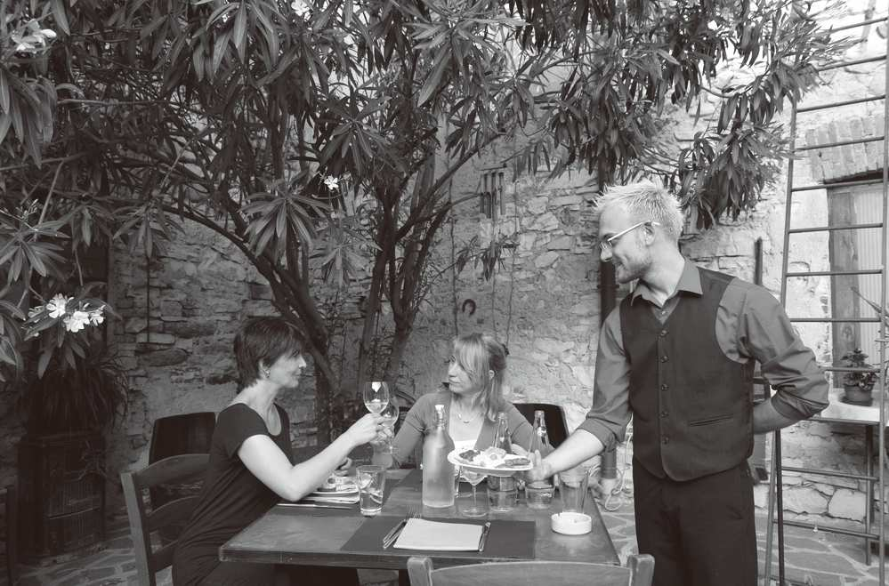**  **
**  **

                                        - 65 -

[[PAGEBREAK]]

Unit 15 Restaurants
 Part 2 Question-Response   (p. 97)

4. (A)

 B_64
 Are you going to cook dinner tonight? 今夜は，あなたが夕飯を作るのですか。

(A) No, let’s eat out. いいえ，外食しましょう。
(B) Sure, the food was great. もちろんです，食事はすばらしかったです。
(C) Yes, I made reservations. はい，私が予約しました。

5. (C)

 B_65
 I’m disappointed with the service. 私はサービスにがっかりしています。

(A) Yes, it was great. はい，それはすばらしかったです。
(B) No, it wasn’t so good. いいえ，それはあまりよくありませんでした。
(C) Yes, we should complain. そうですね，私たちは苦情を言うべきです。

6. (B)

 B_66
 Would you like a salad with your steak? ステーキと一緒にサラダはいかがですか。

(A) I don’t like soup. 私はスープが好きではありません。
(B) That would be nice. それはいいですね。
(C) I won’t have dessert. 私はデザートを食べません。

7. (A)

 B_67
 What do you want to eat for lunch? ランチには何を食べたいですか。

(A) How about Chinese? 中華料理はどうですか。
(B) Let’s eat at about noon. 正午頃に食べましょう。
(C) I’ll call the restaurant. 私がレストランに電話しましょう。

8. (C)

 B_68
 Excuse me, where’s the cashier? すみません，レジ係はどこですか。

(A) Cash and credit cards are both OK. 現金かクレジットカードのどちらも大丈夫です。
(B) Your waiter is coming soon. 担当のウエイターが間もなく参ります。
(C) Next to the entrance. 入り口の横です。

9. (B)

 B_69
 Do you want me to make reservations? 私が予約しましょうか。

(A) Everybody can come. 誰でも来ることができます。
(B) No, I’ll do it. いいえ，私がやります。
(C) Yes, I reserved a car. はい，私は車を予約しました。

                                        - 66 -

[[PAGEBREAK]]

Unit 15 Restaurants
 Part 3 Conversations    (p. 98)

10. (D) この会話では，レストランでのサービスが主なトピックとなっている。

What are the women complaining about? 女性たちは何について苦情を伝えていますか。

(A) The price of a meal 食事の値段
(B) The chef’s special dish シェフの特別料理
(C) Advertising for a restaurant レストランの宣伝
(D) Service at a restaurant レストランのサービス

11. (B) 2 人目の女性 Cathy の発言に our food was cold とある。

What can be said about the women’s food? 女性たちの食事について，どのようなことが言えますか。

(A) It was too salty. 塩辛すぎた。
(B) It was cold. 冷たかった。
(C) It was too spicy. 辛すぎた。
(D) It was tasteless. まずかった。

12. (A) free meal の free は「無料の」という意味になる。

What does the man offer the women? 男性は女性たちに何を提供しますか。

(A) A free meal 無料の食事
(B) Another special dish 別の特別料理
(C) A 50% discount 50 パーセントの割引
(D) Free drinks for a year 1 年間の無料ドリンク

【英文スクリプト】 B_70
W1: I would like to make a complaint about our ( dinner ) tonight. The ( service ) was terrible.
M: I’m sorry to hear that. Could you tell me about the problem?
W1: Yes. The ( waiter ) took a ( long ) time to serve our meals. Right, Cathy?
W2: Yes. And our food was cold when he brought it to us.
M: Oh, I’m very sorry. I’ll give you a coupon for a ( free ) meal the next time you visit us.
W2: That sounds fine. Do you agree, Amy?
W1: Sure. And please tell the waiter to be more careful next time.

【訳】
女１：今夜のディナーについて苦情を言いたいと思います。サービスはひどいものでした。
男： それは申し訳ありません。その問題について私に教えていただけますか。
女１：ええ。ウエイターが私たちの食事を運んでくるまで長い時間がかかったんです。そうだったわよね，キャシー？
女２：ええ。それに，彼が運んできたときには，私たちの食事は冷えていたんです。
男： ああ，本当に申し訳ありません。お客様には次回にご来店の際にお使いになれる無料食事券を差し上げます。
女２：それはいいわね。そうよね，エイミー？
女１：もちろん。それから，ウエイターに次からはもっと注意するように言っておいてくださいね。

 Part 5 Incomplete Sentences       (p. 99)

13. (D)「予約をする」は make a reservation と表現する。

【訳】私は，そのレストランに電話をして予約をした。

14. (A)「すぐに」の慣用表現は in just a minute。

【訳】お客様の担当のウエイターがすぐに参ります。

15. (D) special は「おすすめ料理」という意味の名詞。

【訳】今日のおすすめ料理をいただきたいと思います。

16. (A) go well with～は，食べ物などが「～によく合う」という意味のイディオム。

【訳】この赤ワインは，ステーキによく合います。

17. (B)「勘定を支払う」は pay one’s bill。

【訳】お勘定は入口の近くのレジで支払えます。

                                                - 67 -

[[PAGEBREAK]]

Unit 15 Restaurants

18. (C)「チップ」は日本語にもなっている。

【訳】サービスがよければ，担当のウエイターに（勘定の）15 パーセントのチップを渡すのが普通だ。

19. (D)「～に満足する」は〈be 動詞＋satisfied with＋もの・こと〉という表現を使う。

【訳】ロキシーズ・レストランでは，お客様がいつもお食事にご満足いただけることを願っております。

                         - 68 -

[[PAGEBREAK]]

Unit 15 Restaurants
Part 7 Reading Comprehension   (p. 100)

20. (B) 広告を見ると，食事代については割引率が述べられているだけで，高いのか安いのかはわからない。

    Which is NOT mentioned about Granny’s Homestyle Restaurant in the advertisement? 広告の中でグラニーズ・ホームスタイル・レストランについて述べられていないものはどれですか。

    (A) Some dishes いくつかの料理
    (B) Low prices 低価格
    (C) The restaurant’s mood レストランの雰囲気
    (D) A special deal 特別サービス（割引）

21. (D) 広告の冒頭にある Homestyle（家庭風の）と homey atmosphere（家庭的な雰囲気）         ，Come with the

    kids（お子さま連れでご来店ください）という言葉から，家族向きのレストランだと判断できる。
    What type of restaurant most likely is Granny’s? グラニーズは，どのような種類のレストランですか。

    (A) A formal restaurant フォーマルなレストラン
    (B) A fast-food restaurant ファストフードのレストラン
    (C) A buffet-style restaurant バイキング形式のレストラン
    (D) A family-style restaurant 家族向きのレストラン

22. (A) E メールの内容から，レストランのサービスと料理に不満があることがわかる。

    Why did Mr. Seeger write to the manager of Granny’s? シーガー氏は，なぜグラニーズの支配人にメールを書いたのですか。

    (A) He had a bad experience at dinner. 食事で不愉快な経験をしたから。
    (B) His food was expensive. 食事代が高額だったから。
    (C) He wants to work at Granny’s. グラニーズで働きたいと思っているから。
    (D) He saw an advertisement. 広告を見たから。

23. (C) E メール中の We usually like your restaurant and go there often.という文から判断できる。

    What can be said about Mr. Seeger? シーガー氏について，どのようなことが言えますか。

    (A) He has never been to Granny’s. グラニーズに行ったことがない。
    (B) He does not have any children. 子どもはいない。
    (C) He goes to Granny’s often. グラニーズによく行く。
    (D) He lives near Granny’s. グラニーズの近くに住んでいる。

24. (D) E メールの宛先は Manager（支配人）となっているだけだが，クーポンを見るとスミス氏がその支配人だとわかる。

    Who received the email? E メールを受け取ったのは誰ですか。

    (A) Mr. Seeger シーガー氏
    (B) The waiter ウエイター
    (C) Mr. Seeger’s child シーガー氏の子ども
    (D) Mr. Smith スミス氏

【訳】

> グラニーズ・ホームスタイル・レストランへお越しください
> 田舎風フライドチキン，ビーフシチュー，豚肉のバーベキューなど，皆さまがいつの時代でもお気に
> 入りの料理をお楽しみください。
> お子さま連れでご来店いただき，くつろいだ家庭的な雰囲気をお楽しみください。
> この広告をお持ちいただくと，すべてのお食事代から 10 パーセント値引きいたします。

                                          - 69 -

[[PAGEBREAK]]

Unit 15 Restaurants

> 宛先：グラニーズの支配人 <GrannysManager@Grannys.com>
> 差出人：コーリ・シーガー<SeegerCory@dalmation.com>
> 日付：5 月 1 日
> 件名：貴店のサービス
> グラニーズの支配人様
> 私はコーリ・シーガーという者で，4 月 28 日にグラニーズ・レストランに行きました。しかし，
> サービスはとてもひどいものでした。ウエイターはのんびりしていて，彼が運んできた食事は冷
> めていました。さらに彼は，私の子どもに飲み物をこぼしてしまいました。私たちはいつも，あ
> なたのレストランを気に入っており，よく行っています。しかし，前回の利用についてはとても
> がっかりしました。何か対応をお願いできますか。
> よろしく
> コーリ・シーガー

> グラニーズ・ホームスタイル・レストラン無料食事券
> シーガー様
> 支配人ウォルター・スミスより
> このクーポンをグラニーズ・ホームスタイル・レストランにお持ちいただけると，4 名様に無料
> の食事をご提供いたします。
> ただし，飲み物代は含まれておりません。
> 有効期限：5 月 1 日から 5 月 31 日まで

                            - 70 -

[[PAGEBREAK]]

Words Review
Words Review 解答   (pp. 109～123)

Unit 1                   Unit 6                  Unit 11

1. do                    1. on                   1. make
2. meals                 2. running              2. take
3. wash                  3. service              3. open
4. apologize             4. remodel [renovate]   4. solve
5. cleaned               5. reach                5. retirement
6. on                    6. contact              6. received
7. drive                 7. corner               7. pay
8. take                  8. break                8. line

Unit 2                   Unit 7                  Unit 12

1. move                  1. fix                  1. take
2. through               2. start                2. pointed
3. get                   3. hire                 3. watched
4. park                  4. set                  4. learn
5. playing               5. Keep                 5. expected
6. recommend             6. monitored            6. finished
7. let                   7. save                 7. see
8. living                8. turned               8. live

Unit 3                   Unit 8                  Unit 13

1. book                  1. replied              1. pick
2. clean [tidy]          2. promotion            2. play
3. experience            3. include [enclose]    3. sounds
4. preferred             4. attach               4. by
5. Just                  5. apply                5. prepared
6. serves                6. convenience          6. last
7. well                  7. appointment          7. Why
8. over [on]             8. thank                8. stage

Unit 4                   Unit 9                  Unit 14

1. packing               1. make                 1. catch
2. board                 2. great                2. fever
3. full                  3. draw                 3. see
4. check                 4. deal                 4. weight
5. get                   5. along                5. work
6. popular               6. hesitate             6. feel
7. on                    7. right                7. checkup
8. flight                8. sure                 8. take

Unit 5                   Unit 10                 Unit 15

1. make                  1. try                  1. out
2. start                 2. display              2. satisfied
3. contract              3. business             3. preparing
4. hold                  4. fill                 4. off
5. lower                 5. show                 5. disappointed
6. raise                 6. feel                 6. full
7. target                7. expensive            7. go
8. set                   8. wrote                8. common

                                                                        2017.2.28

                                        - 71 -
