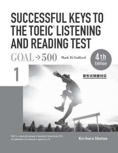
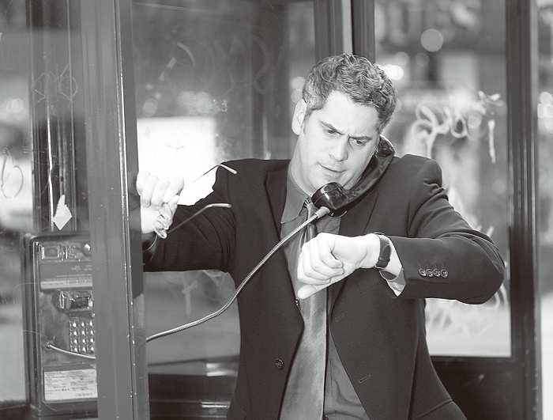
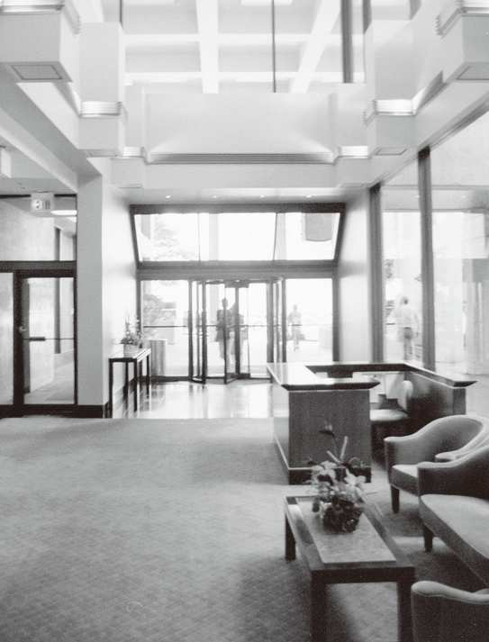
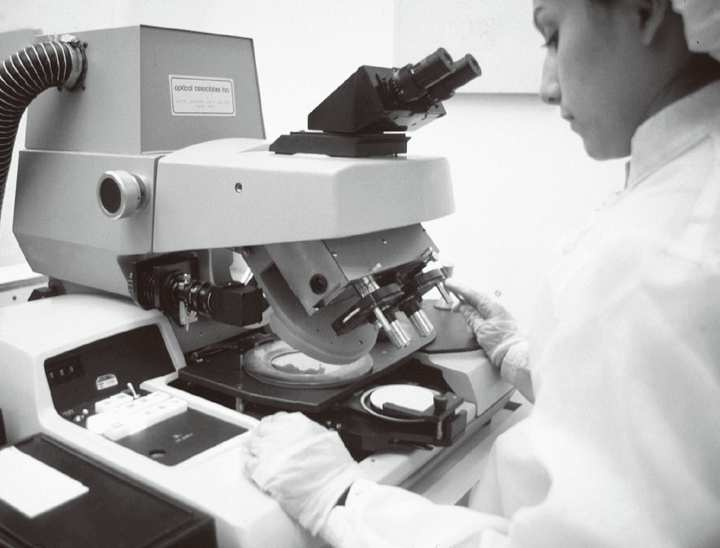
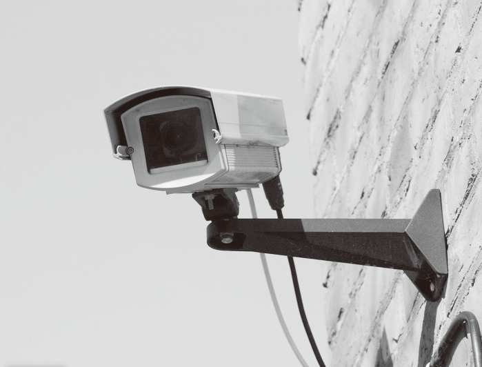
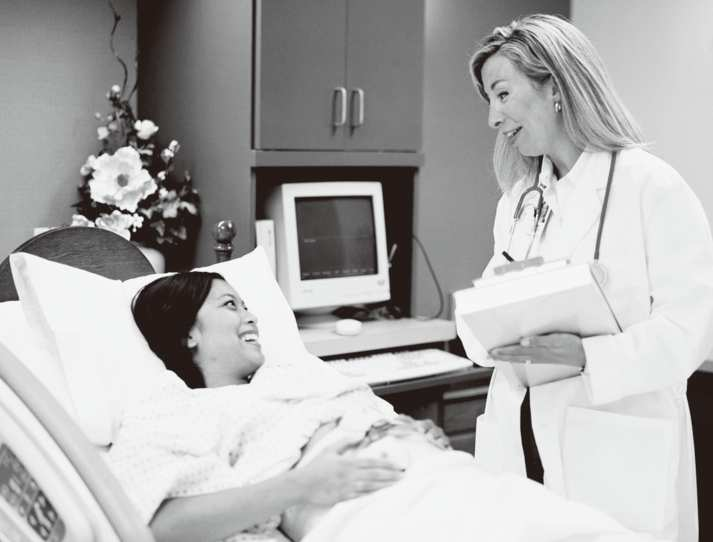
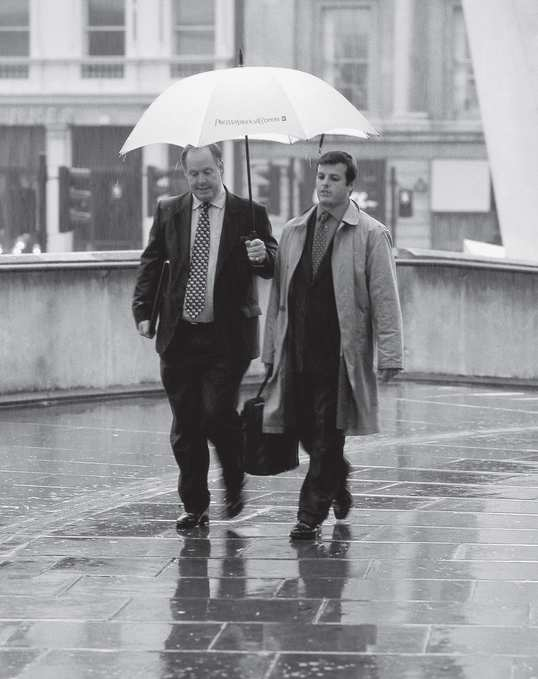
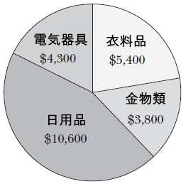
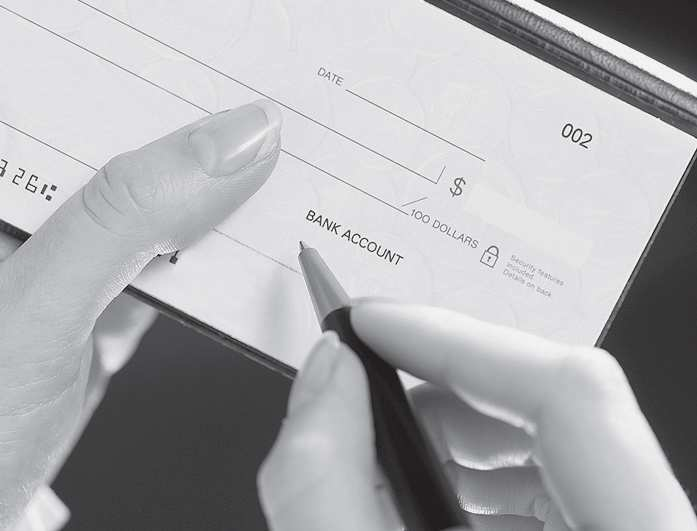
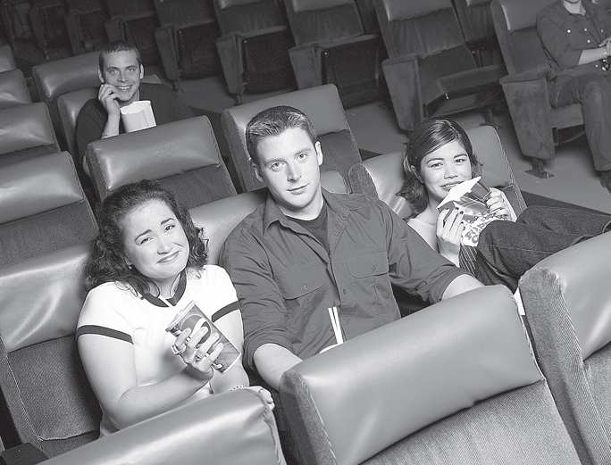

> ®
> SUCCESSFUL KEYS TO THE TOEIC
> LISTENING AND READING TEST 1
> (4) th Edition]

           教授用書

          Mark D. Stafford

             桐原書店

**  **

[[PAGEBREAK]]

【ダウンロード可能な補助教材】

SUCCESSFUL KEYS TO THE TOEIC® LISTENING AND READING TEST 1では，以下のサイトで補助教材をダウンロードして

ご利用いただけます。授業の現場に合わせてご活用ください。

http://www.kirihara.co.jp/

1. 音声スクリプトの文字データ

    本冊子に掲載されているスクリプトの文字データを提供しています。音声内容の確認をさせる際などにご利用ください。

2. 実践演習問題

    100題で構成されたTOEIC® LISTENING AND READING TEST形式のテストです。学習の伸び率をはかるためにご利用ください。

    テスト用冊子はPDFファイルで，リスニングセクションの音声はmp3ファイルで提供しています。

3. Worksheet Unit 1-15

    Unit 1～Unit 15のワークシートをPDFファイルで提供しています。

                                       -2-

[[PAGEBREAK]]

Contents

                         Unit 1 Daily Life                4
                         Unit 2 Places                    8
                         Unit 3 People                   12
                         Unit 4 Travel                   16
                         Unit 5 Business                 20
                         Unit 6 Office                   24
                         Unit 7 Technology               28
                         Unit 8 Personnel                32
                         Unit 9 Management               36
                         Unit 10 Purchasing              40
                         Unit 11 Finances                44
                         Unit 12 Media                   48
                         Unit 13 Entertainment           52
                         Unit 14 Health                  56
                         Unit 15 Restaurants             60

                         Self-study Quizzes Unit 1-15    64

> リスニングセクションは以下の４カ国出身のネイティブスピーカーの音声で録音されており，それぞれの発言の冒頭に以
> 下のように示されています。
> 米 アメリカ 英 イギリス 加 カナダ 豪 オーストラリア
> A_02 はリスニングの音声ファイル名を示しています。

                                              -3-

[[PAGEBREAK]]

Unit 1 Daily Life

Unit

Unit 1 Daily Life
 Warm-up      (p. 2)

Check Your Vocabulary!

(1) conversation 会話／対談
(2) vehicle 乗物／車両
(3) meal 食事
(4) furniture 家具
(5) temperature 温度／気温／体温
(6) envelope 封筒
(7) shelf 棚
(8) cloth 布／布地
(9) stamp 切手
(10) groceries 日用食料品

       Association

Word Association

(1) make room for him
(2) traffic is heavy
(3) weather forecast
(4) in season *cf. off season（オフシーズン）
(5) do the dishes
(6) call in sick
(7) take a different route
(8) be dressed in a suit

 Part 1 Photographs    A_02    (p. 3)

1.                        2.
1. (C)
(A) They’re eating some dinner. 彼らは何か夕食を食べているところだ。
(B) They’re selling newspapers. 彼らは新聞を売っているところだ。
(C) They’re reading a paper. 彼らは書類を読んでいるところだ。
(D) They’re shopping for dishes. 彼らは皿を買いに来ているところだ。

2. (B)
(A) The knife is being washed. そのナイフは洗われているところだ。
(B) Vegetables are being cut. 野菜は切られているところだ。
(C) The meat is frozen. その肉は凍っている。
(D) Fruit is on the floor. 果物は床の上にある。

**  **
**  **

                                        -4-

[[PAGEBREAK]]

Unit 1 Daily Life
 Part 2 Question-Response        A_03   (p. 3)

3. (C)

 What will you do today? 今日何をするつもりですか。

(A) I went bowling yesterday. 昨日はボーリングに行きました。
(B) No, I won’t go. いいえ，行くつもりはありません。
(C) I will go to the movies. 映画を見に行くつもりです。

4. (A)

 Don’t you have to go to school now? もう学校に行かなくてもいいの？

(A) Oh, yes. I forgot. ああ，そうだ。忘れていました。
(B) Yes, I don’t. ええ，行かなくてもいいんです。
(C) No thanks. いいえ，結構です。

5. (A)

 Has she eaten her lunch yet? 彼女はもう昼食を食べたのだろうか。

(A) Yes, she finished it at noon. はい，彼女は正午に食べ終えました。
(B) No, she’s going tomorrow. いいえ，彼女は明日行くのです。
(C) No, she didn’t drink anything. いいえ，彼女は何も飲みませんでした。

6. (C)

 Look, I bought a new watch. ほら，新しい腕時計を買ったんだよ。

(A) I don’t want to watch TV today. 今日は，テレビを見たくないわ。
(B) I’m sorry to hear that. そう聞いて残念です。
(C) Oh, it’s really nice. まあ，それ，本当にすてきね。

 Part 3 Conversations     A_04     (p. 4)

7. (A) 女性の最初の発言から，週末の計画を立てようとしているのがわかる。
8. (B) 女性の最初の発言と男性の最後の発言に注意する。
9. (C) 男性の提案に女性は同意している。

 W: What do you want to do this Saturday? It’s my day off.
 M: Oh, that’s great! Me, too. How about seeing a movie? I hear there’s a good action film playing.
 W: Sounds good to me. I’ll check the listings.
 M: Let’s try to go to a late one so we can have a leisurely dinner first.

> 女性：今度の土曜は何をしたい？ 私，休みなのよ。
> 男性：それはいや！ 僕もだよ。映画を見るのはどうだろう。いアクション映画が上映中だって聞
> いたよ。
> 女性：それはよさそうね。上映スケジュールを調べてみるわ。
> 男性：遅い回に行くようにしよう。そうすれば先にゆっくり夕食をとることができる。

 男性：それはいいや！ 僕もだよ。映画を見るのはどうだろう。いいアクション映画が上映中だって聞いたよ。

                                                 -5-

[[PAGEBREAK]]

Unit 1 Daily Life
Part 4 Talks     A_05   (p. 4)

10. (D) はじめに weather for tomorrow will be ... sunny と述べられていることから判断できる。
11. (A) 第 4 文で降水確率 80％と言っている。
12. (C) changeable weather と述べられているように，天気が不安定であることから。

Your weather for tomorrow will be mostly sunny in the morning. It will be a great time to work outside
or enjoy outdoor sports. Enjoy it while it lasts, however, because it will become partly cloudy around
noon. There is an 80% chance of rain in the afternoon and evening. Because of the prolonged warm and
cold fronts, prepare yourself for changeable weather.

> 明日の天気は，午前中はだいたい晴れるでしょう。戸外での活動やアウトドアスポーツにはぴったりで
> しょう。しかし，晴れている間に楽しんでください。というのは，正午あたりには，時々曇が出てくる
> からです。午後から夕方にかけての降水確率は 80％です。停滞中の温暖前線と寒冷前線のため，変わり
> やすい天気に備えてください。

Part 5 Incomplete Sentences      (p. 5)

13. (D) our（私たちの）の後には名詞がくる。

  【訳】私たちのオフィスには新しい机を置く余裕はありません。

14. (C) Please の後ろには動詞の原形がくる。

  【訳】会社が請求書を郵送してから 30 日以内にお支払いください。

15. (B) 4 つとも名詞が並んでいるが，意味から考えると(B)が正解だとわかる。

  【訳】ホリデー・シーズンのため道路がとても混雑している。

16. (A) will の後ろなので動詞の原形がくる。

  【訳】今年の夏はいつになく涼しいので，エアコンの売り上げが影響を受けるだろう。

17. (B) 現在完了形の have started の 2 語の間に入るのは副詞のみである。

  【訳】スーパーマーケットは最近，           （鉢植えの）植物や園芸用品を売り始めた。

18. (D) 前に partly という副詞があることから，形容詞が必要であるとわかる。

  【訳】金曜日の天気予報は，一時曇りです。

19. (A) wallet を説明する形容詞が必要である。

  【訳】私は名刺を特別な札入れに入れている。

                                                 -6-

[[PAGEBREAK]]

Unit 1 Daily Life
Part 7 Single/Multiple Passages   (pp. 6-7)

20. (A) 宣伝されているものが食料品なので，grocery store が正解となる。
21. (B) All prices are good from 9:00 a.m. to 4:00 p.m.に当てはまらないものが正解である。

> ファームボーイ・マーケット，今週の特別セール！
> 牛肉 100％のホットドッグ - 3 ドル 95 セント
> とれたて新鮮とうもろこし - 2 本で 2 ドル 45 セント
> 牛乳・チーズ製品 - 10％割引
> パン・ケーキ類 - クーポン券で 20％割引
> これらすべての価格は月曜日から木曜日までの間，
> 午前 9 時から午後 4 時まで有効

22. (A) school という語があることから推測できる。go back to school は「

                                                   （新学期が始まって）学校へ戻ること。

23. (B) jeans は pants の一種だから，その割引率は 30％である。

> 大売出し！大売出し！大売出し！
> さあ，新学期のはじまる時期になりました
> 新学期のための服を買うなら今です！
> 今から今週末まで
> 若者向けの靴はすべて 50％割引
> シャツとジャケット 25％割引
> ズボン類 30％割引
> この大きなチャンスを逃さないでください！

                                              -7-

[[PAGEBREAK]]

Unit 2 Places

 Warm-up      (p. 8)

Check Your Vocabulary!

(1) area 地域／区域
(2) location 位置／場所
(3) address 住所／話しかける
(4) outside 外側の／外部の
(5) stadium 競技場／スタジアム
(6) move 引っ越す
(7) bakery パン屋
(8) agency 代理店／機関
(9) theater 劇場
(10) closet 押入れ／戸棚

Word Association

(1) c. take place
(2) b. leave
(3) e. parking lot
(4) g. take the stairs
(5) h. on the wall
(6) d. downtown
(7) f. post office
(8) a. park

 Part 1 Photographs      A_06   (p. 9)

1.                                       2.
1. (D)
(A) The light is off. 照明は消えている。
(B) His briefcase is closed. 彼の書類かばんは閉じてある。
(C) The shelf doors are open. 棚の扉は開いている。
(D) There is a picture on the wall. 壁に１枚の絵が掛かっている。

2. (D)
(A) There are curtains over the window. 窓にはカーテンが掛かっている。
(B) One of the women is looking out of the window. 女性の１人は窓の外を見ている。
(C) The women are sitting across a desk. 女性たちは机をはさんで座っている。
(D) The women are looking at something on the desk. 女性たちは机の上にある何かを見ている。

**  **
**  **

                                              -8-

[[PAGEBREAK]]

Unit 2 Places
 Part 2 Question-Response       A_07   (p. 9)

3. (B)

 What will you do on Saturday? 土曜日は，あなたは何をするつもりですか。

(A) She will go downtown. 彼女は繁華街に行くでしょう。
(B) I will go to the park. 僕は公園に行くつもりです。
(C) I will work on Sunday. 日曜日は，僕は仕事をするつもりです。

4. (C)

 What is your address? ご住所はどちらですか。

(A) Sounds good to me. それはいいと思いますよ。
(B) It is 847-8275. 847-8275 です。
(C) It is 240 Park Avenue. パーク・アベニュー240 番地です。

5. (B)

 Why will you move to Boston? どうしてあなたはボストンに引っ越すのですか。

(A) He will move to New York instead. そうではなくて，彼はニューヨークに引っ越すんですよ。
(B) Because of my job. 仕事の都合なんです。
(C) I wanted to eat French food. 私はフランス料理が食べたかったのです。

6. (A)

 I’m going on a trip to Bangkok. 僕はバンコクに旅行に行くつもりです。

(A) Great. I wish I could go, too. いいわね。私も行けたらいいのに。
(B) It takes about five hours. だいたい 5 時間かかります。
(C) You can hurt yourself when you trip. つまずくと，けがをしかねないわ。

 Part 3 Conversations    A_08     (p. 10)

7. (D) 女性が旅行に行くつもりだと話している。
8. (A) 女性の最初の発言を注意して聞く。
9. (A) 女性は１人で行く（go alone）と言っている。

 W: I will go on a trip to India this January.
 M: Sounds nice. I have to work all winter. Will anyone go with you?
 W: No, I’ll go alone. I wish you could go, too.
 M: I wish I could, too. I hear it’s just great in the winter.

> 女性：この 1 月にインドに旅行に行く予定なの。
> 男性：それはいね。僕は冬の間中，仕事なんだ。誰か一緒に行くのかい？
> 女性：いえ，１人で行くのよ。あなたも行けるといのに。
> 男性：僕がそうできたらいんだが。(インドは)冬がとてもいと聞いているよ。

 男性：それはいいね。僕は冬の間中，仕事なんだ。誰か一緒に行くのかい？
 女性：いいえ，１人で行くのよ。あなたも行けるといいのに。
 男性：僕がそうできたらいいんだが。（インドは）冬がとてもいいと聞いているよ。

                                                 -9-

[[PAGEBREAK]]

Unit 2 Places
Part 4 Talks     A_09     (p. 10)

10. (C) 第１文で述べられている内容を注意して聞く。
11. (C) 第 3 文の the ceremony starting at 9:00 から(C)とわかる。
12. (B) 第 3 文から，すべての市民が招待されているとわかる。

The City Office has announced that the mayor will open the newly completed Central Park on Sunday
at 9:00 a.m. The park has a playground for children and a flower garden for adults to enjoy. Citizens
are invited to come to the ceremony starting at 9:00. People with special needs may come early and sit
in a reserved section for the opening ceremony.

> 市役所が発表したところによると，市長は新たに完成したセントラル・パークを日曜日の午前 9 時に開
> 園する予定です。園内には子ども用の遊び場と，大人が楽しめるフラワーガーデンがあります。市民の
> 皆様は，9 時に始まる式典に招待されています。特別な援助が必要な(障害がおありの)方は早めにい
> らして開会式のための予約席にお座りいただけます。

 Part 6 Text Completion      (p. 11)

13. (B) be sorry は「申し訳なく思う」という意味。過去の話でも未来の話でもないので(A)と(C)は当てはまらない。
14. (A) 「遅れる」という意味以外は文意が通らない。
15. (C) 「注文が多い」→「配達が遅れている」という流れから，(A)と(D)は除外できる。(B)の天気による影響は文脈にそぐわない。
16. (D) 「ご不便をおかけして申し訳ございません」という意味のフレーズになる。

> ファニチャー・キング
> メールオーダー・カタログ
> お客さまへ
> ご注文，ありがとうございます。申し訳ありませんが，裏面に記載の商品につきましては(配達の)遅
> れが生じることをお知らせいたします。
> いくつかの商品には予想を上回るご注文をいただいております。お客さまのご注文の商品も同様のケー
> スにあたり，配送が遅れております。私どもといたしましても，できるだけ早くお手元に届くよう全力
> を尽くしております。
> ご不便をおかけしておりますが，なにとぞご容赦くださいますようお願いたします。
> 敬具
> ファニチャー・キング

                                                - 10 -

[[PAGEBREAK]]

Unit 2 Places
Part 7 Single/Multiple Passages   (pp. 12-13)

17. (A) 文面と宛名部分などからポストカードであるとわかる。
18. (D) The weather has been just perfect の部分を言い換えたものが正解。
19. (C) 3 日後に Ankara に行って，その 2 日後に帰ると書いてあるので，5 日後とわかる。

> キャシーへ
> 僕は今，イスタンブールで素晴らしい時間を過ごしているよ。気候は申し分ないし，人々は本当に親切なんだ。
> この町がヨーロッパとアジアの両方にまたがっているなんて信じられないよ！
> (3) 日後にアンカラに行って，その 2 日後には帰るつもりだ。君が今こにいてくればなあ！
> 君の友達 マイケル
> (宛名部分)
> キャシー・トーマス様
> (8969) リバーウォーク・ドライブ
> ガーデンシティ
> マサチューセッツ州 46587 アメリカ合衆国

20. (B) Season’s Greetings の部分からグリーティングカードであるとわかる。
21. (D) From our family to yours の部分からわかる。
22. (D) yours にあたる家族が住んでいる場所なので，「家」が正解。

> 時候のごあいさつを申し上げます！
> 我が家一同よりあなた様のご一家へ
> この休暇期間中の皆様のご無事とお幸せをお祈り申し上げます。
> 敬具
> アーチボルド家

                                                - 11 -

[[PAGEBREAK]]

Unit 3 People
 Warm-up      (p. 14)

Check Your Vocabulary!

(1) staff 職員／部員
(2) president 社長／代表取締役／会長／大統領
(3) client 依頼人／顧客
(4) engineer エンジニア／技師／技術者
(5) secretary 秘書／書記／長官
(6) accountant 会計士［係］
(7) lawyer 弁護士
(8) mayor 市長
(9) technician 専門家／技術者
(10) receptionist 受付係

Word Association

(1) store clerk（店員）――― customer（買い物客）
(2) flight attendant（客室乗務員）――― passenger（乗客）
(3) doctor（医者）――― patient（患者）
(4) parent（親）――― child（子ども）
(5) receptionist（受付係）――― guest（訪問客）
(6) player（演奏者）――― audience（聴衆）
(7) criminal（犯人）――― officer（警察官）
(8) manager（経営者）――― staff（職員）

 Part 1 Photographs     A_10   (p. 15)

1.                                       2.
1. (B)
(A) They are sleeping very well. 彼らはとてもよく眠っている。
(B) They are lying down. 彼らは寝ころんでいる。
(C) They are standing up straight. 彼らは真っすぐに立っている。
(D) They are preparing to jump. 彼らは跳躍の準備をしているところだ。

2. (D)
(A) He is looking at a schedule. 彼はスケジュール表を見ている。
(B) He is waiting for a train. 彼は電車を待っている。
(C) He is watching a film. 彼は映画を見ている。
(D) He is checking his watch. 彼は時計をチェックしている。

**  **
**  **

                                              - 12 -

[[PAGEBREAK]]

Unit 3 People
 Part 2 Question-Response       A_11   (p. 15)

3. (A)

 Who is the shop’s manager? 誰がその店の経営者なのですか。

(A) Ms. Kim is. キムさんです。
(B) I can’t manage to find him. 私はどうしても彼を見つけることができません。
(C) I will chop the salad. 私がサラダの野菜を刻みます。

4. (A)

 Aren’t you going to the concert with Bob? 君はボブと一緒にコンサートに行くんじゃないのかい？

(A) Yes, he’ll pick me up at 6:00 o’clock. ええ，6 時に彼が迎えに来てくれるんです。
(B) Yes, we’re both students. ええ，私たちは 2 人とも学生です。
(C) No, I’m going with him. いいえ，私は彼と行くんです。

5. (A)

 I heard Susan is a baker. スーザンはケーキ職人だそうですけど。

(A) Yes, she makes tasty cakes. はい，彼女はおいしいケーキを作りますよ。
(B) No, she didn’t do anything. いいえ，彼女は何もしませんでした。
(C) Yes, she works at a bank. はい，彼女は銀行で働いています。

6. (C)

 When are you going to call Kenny? あなたはいつケニーに電話をするつもりですか。

(A) I am going to become a secretary. 私は秘書になるつもりです。
(B) I call him Ken. 私は彼をケンと呼びます。
(C) I will call him after work. 仕事が終わったら，私は彼に電話をするつもりです。

 Part 3 Conversations    A_12     (p. 16)

| 社内部屋番号 |  |
| --- | --- |
| 246号室 | 営業副部長室 |
| 247号室 | 営業部長室 |
| 248号室 | 大会議室 |
| 249号室 | 顧客応接室 |

7. (D) 男性の最初の発言で述べられている。
8. (C) 女性は，営業副部長は大会議室（248 号室）にいると言っている。
9. (D) go there を言い換えたものが正解。

 M: Hello. May I speak to the assistant sales manager?
 W: Uh…well…. She’s not here now. She said she will be in the main meeting room until 3:00.
 M: OK. I’ll go there to see her right now.

> 男性：こんにちは。営業副部長と話がしたいのですが。
> 女性：え…ですが…彼女は今こにいないのです。3 時まで大会議室にいると言っていました。
> 男性：わかりました。今すぐそこに行って彼女に会うことにします。
 女性：ええ…ですが…彼女は今ここにいないのです。3 時まで大会議室にいると言っていました。

                                                 - 13 -

[[PAGEBREAK]]

Unit 3 People

10. (C) 全体から，アキコがマイクに残した留守番電話のメッセージだとわかる。
11. (B) It’s too bad.は「それは残念です」という意味の表現。直後の発言から，金曜日は車を借りられないことを指しているとわかる。
12. (D) “He said Saturday is fine, though.”の部分から判断できる。

Hi, Mike, this is Akiko. I asked Scott if you could borrow his car to move on Friday. It’s too bad, but he
needs it to go to work. He said Saturday is fine, though. Let me know what you decide to do. I’m sure
that you can borrow it then. Talk to you later.

> こんにちは，マイク，アキコです。あなたが金曜日の引っ越しのために彼の車を借りられるかどうか，
> スコットに尋ねました。残念ながら，彼は仕事に行くのに車が必要だそうです。でも土曜日なら大丈夫
> だと言っていました。どうするか決めたら教えてください。その日なら車を借りられるはずよ。あとで
> 話しましょう。

Part 5 Incomplete Sentences      (p. 17)

13. (C)「彼女の」という所有を表す代名詞が必要。

  【訳】秘書はただいま席を離れております。

14. (D) store clerks を指す代名詞で主語になれるのは they。

  【訳】店員は，就業中は ID バッジを着用することが求められています。

15. (C) departure time の前には「彼らの」という意味の代名詞が必要。

  【訳】すべての乗客は，出発時刻よりも最低 2 時間前に搭乗手続きをしなくてはなりません。

16. (A) the project team を指す代名詞 it の所有格 its が正解。

  【訳】会計年度の終わりまでに，そのプロジェクトチームは予算のほとんどを使った。

17. (C) let ～ know（～に知らせる）の～に入る代名詞は目的格の us。

  【訳】この製品に関してさらにご質問がございましたら，私どもにお知らせください。

18. (A) Ms. Carson の代名詞である she が正解。

  【訳】カーソンさんは昨年引退するまで，この組織で働いてきた。

19. (D)「会社の従業員」という意味にするには，company を指す代名詞 it の所有格 its が必要。

  【訳】会社は従業員に有給休暇を提供している。

                                                  - 14 -

[[PAGEBREAK]]

Unit 3 People
Part 7 Single/Multiple Passages   (pp. 18-19)

20. (A) 最初の E メールの最後にある College President という肩書きを言い換えたものが正解。
21. (D) 最初の E メールの第 1 文と第 3 文からミーティングの要請をしているとわかる。
22. (D) 返信の E メールで「入学者数が減少している問題」と具体的に述べられている。
23. (C) 返信の E メールに「私と他の州立大学委員会のメンバー」とあることから，ウィルキンズ氏も州立大学委員会のメンバーの１人だと判断できる。
24. (C) 最初の E メールから，今週ボイド氏が時間をとれるのは火曜日と水曜日のみだとわかる。また，返信の E メールでウィルキンズ氏は明日（火曜日）以外なら会えると言っている。したがって，両者が会えるのは水曜日だけとなる。

> 差出人： スーザン・ウィルキンズ<swilkins@thatmail.com>
> 宛先： フランク・ボイド<franklyfrank@piedmail.com>
> 件名： Re:入学者の推移
> 日付： 月曜日，11 月 3 日
> ボイド様
> ご連絡ありがとうございます。たった今，読ませていただきました。学生の入学者数が減少している問
> 題について話し合うために，私たちが会わなければならないということに賛成です。実は，私と他の州
> 立大学委員会のメンバーは，州立大学の学長全員とできるだけ早期に検討部会を設置することを計画し
> ています。今週は，明日以外ならばいつでもあなたにお会いすることができます。話し合いのためのデ
> ータを準備する時間が必要ですので。
> 敬具
> スーザン・ウィルキンズ

                                                - 15 -

[[PAGEBREAK]]

Unit 4 Travel
 Warm-up      (p. 20)

Check Your Vocabulary!

(1) journey 旅行
(2) depart 出発する
(3) ticket 切符／乗車券
(4) vacation 休暇
(5) agency 代理店／代理業者
(6) announce 発表する／公表する
(7) book 予約する
(8) transportation 輸送（機関）／交通（機関）
(9) baggage 手荷物
(10) fare 運賃／（乗物の）料金

Word Association

(1) h. train fare
(2) d. cancel a reservation
(3) b. on vacation
(4) e. go abroad
(5) a. travel agency
(6) g. public transportation
(7) c. announced
(8) f. baggage

 Part 1 Photographs      A_14   (p. 20)

1.                                        2.
1. (C)
(A) The woman is pointing at the map. 女性は地図を指さしている。
(B) The man is carrying a camera in his hand. 男性は手にカメラを持っている。
(C) The man is holding a map with both hands. 男性は両手で地図を持っている。
(D) They are walking along a busy street. 彼らは交通量の多い通りを歩いている。

2. (B)
(A) She left her books at home. 彼女は本を家に置き忘れてきた。
(B) She is pulling her suitcase. 彼女はスーツケースを引いている。
(C) The suitcase is on a plane. そのスーツケースは飛行機に載せられている。
(D) The suitcase is in the store. そのスーツケースは店にある。

**  **
**  **

                                               - 16 -

[[PAGEBREAK]]

Unit 4 Travel
 Part 2 Question-Response        A_15   (p. 21)

3. (A)

 Where will you go during the summer? 夏の間，あなたはどこに行くつもりですか。

(A) I want to see my friend in London. ロンドンにいる友達に会いたいと思います。
(B) I would really like some more. 本当にもう少しほしいのです。
(C) I hope it will be sunny. 晴れてほしいと思います。

4. (B)

 When will I get my tickets? チケットはいつ手に入るのでしょうか。

(A) Yes, you will get them by mail. はい，あなたは郵便でお受け取りになるでしょう。
(B) One week before your trip. ご旅行の１週間前です。
(C) You can pick them up at our office. 私どもの営業所でお受け取りになれます。

5. (A)

 Did Norm catch his flight? ノームは飛行機に間に合ったのですか。

(A) No, he was too late. いいえ，彼は遅れすぎたのです。
(B) Yes, he took a train. はい，彼は電車に乗りました。
(C) Yes, he went by bus. はい，彼はバスで行きました。

6. (B)

 I booked my trip at Speedy Travel. 私はスピーディ・トラベル社で旅行の予約をしました。

(A) I read a good book, too. 私もよい本を読みました。
(B) I heard they are a good company. あそこはよい会社だと聞きましたよ。
(C) Don’t drive too fast. あまりスピードを出して運転してはだめです。

 Part 3 Conversations     A_16     (p. 22)

7. (A) no, I haven’t.の後には，stayed with you（= stayed at this hotel）が省略されている。
8. (D) 男性はホテルにチェックインしようとしている宿泊客である。
9. (B) fill out this form を言い換えているものが正解。

 W: Welcome to The New Tanaka. Have you stayed with us before?
 M: Oh, no, I haven’t. May I check in here?
 W: Well, you sure may. Please fill out this form. You can use the pen here on the counter.

> 女性： ザ・ニュー・タナカへようこそ。お客さまは以前に当ホテルにお泊まりになったことがございま
> すか。
> 男性： あ，いえ，ありません。こで宿泊手続きができますか。
> 女性： え，もちろんです。こちらの用紙に(必要事項を)ご記入ください。カウンターにあるペンを
> お使いただけます。

 男性： ああ，いいえ，ありません。ここで宿泊手続きができますか。
 女性： ええ，もちろんです。こちらの用紙に（必要事項を）ご記入ください。カウンターにあるペンをお使いいただけます。

                                                  - 17 -

[[PAGEBREAK]]

Unit 4 Travel
      Part 4 Talks    A_17   (p. 22)

| アメリカのホリデー (今年度) |  |  |
| --- | --- | --- |
| 日付 | 曜日 | 名称 |
| 8月21日 | 日曜 | 敬老の日 |
| 8月26日 | 金曜 | 女性平等の日 |
| 9月5日 | 月曜 | 労働の日 |
| 9月11日 | 日曜 | 祖父母の日 |

10. (C) Labor Day（労働の日）が聞き取れるかがポイント。
11. (C) while the north will be partly cloudy の部分を注意して聞く。
12. (A) 最後の１文で warm という語が繰り返されている。

Thank you for tuning in to Channel Five, the most popular station in Maple County. There should be
mostly sunny skies for the coming Labor Day vacation, so you will be able to enjoy many types of
activities. For those traveling in the state, the south should be very warm and sunny while the north
will be partly cloudy, but also warm.
     日付         曜日             名称

> メープル郡で最も人気のある放送局，チャンネル 5 をお聴きいただきありがとうございます。今度の労
> 働の日の祝日はおむね晴れのよい天気のはずですので，さまざまな活動を楽しめるでしょう。州内を
> 旅行される方にとって，南部はとても暖かく晴天となる一方，北部ではところにより曇り空となるでし
> ょうが，同様に暖かいでしょう。

                                               - 18 -

[[PAGEBREAK]]

Unit 4 Travel
Part 6 Text Completion   (p. 23)

13. (C) 受身の現在完了形なので has been moved up となる。
14. (D) meet a deadline は「締め切りに間に合わせる」という意味のフレーズ。
15. (C) このメモの目的は社員に残業を要請することで，次の文に「この限度」とあることから，何らかの数値が述べられていると考えられる。
16. (A) 名詞 overtime を修飾しているので，形容詞の additional が入る。

> 宛先：財務部の全職員<financestaff@appropo.com>
> 差出人：メアリー・ウィリアムズ<marywilliams@appropo.com>
> 来年度予算の提出の締め切りが，3 月 15 日から 3 月 1 日に繰り上がりました。
> この新しい締め切りに間に合わせるため，どの職員も来週は，1 日に 1 時間ずつの残業をして予算作成
> に協力していただくことになるでしょう。
> 経営側は，85 時間までの残業を認めています。この限度を超えないようくれぐれも気をつけていただき
> たいと思います。それ以上の残業はすべて予算担当主任の承認を受ける必要があります。

Part 7 Single/Multiple Passages    (pp. 24-25)

17. (D) These prices are for one-way, economy class only.の部分から正解を導くことができる。
18. (A) 価格が最も安いアムステルダムが正解。

> 春の特別セール
> スカイウェイ航空
> 運賃最安値でご提供！
> 現行の運賃：サンフランシスコ発
> 上記の価格は片道料金，エコノミークラスに限ります。
> ビジネスクラス，ファーストクラスのチケットは通常価格での販売です。

19. (A) Travel Reading とあるので，
20. (C) 2009 年に発行されたものが，このリストではいちばん古い。
21. (B) このような本のリストが置いてある場所は，選択肢の中では図書館であると推測できる。
22. (B) このリストのタイトルや書名から，旅行に関心のある人向けだとわかる。

 おすすめの旅行関連書：
 ― スパック・ララス『自由に動き回る』2012
   スパック・ララス               年
 ― ネイト・ライアン『幸福の道』2012

> おすめの旅行関連書：
> ― スパック・ラス『自由に動き回る』2012 年
> ― ネイト・ライアン『幸福の道』2012 年
> ― サム・B・ヘインズ『すぐに出発』近日刊
> ― サイモン・ギンズバーグ『一度に一歩』2009 年
> ― ジェシカ・ブラック『人のあまり通らない道』2011 年
> ― オノ・メグミ『飛行機にのって』2010 年
> ― アラン・ラング『グレート・ジャーニー』2014 年

   ネイト・ライアン           年サム・B・ヘインズ『すぐに出発』近日刊
 ― サム・B・ヘインズサイモン・ギンズバーグ『一度に一歩』2009
 ― サイモン・ギンズバーグンズバーグ              年
 ― ジェシカ・ブラック『人のあまり通らない道』2011
   ジェシカ・ブラック                   年オオノ・メグミ
 ― オオノ・メグミ『飛行機にのって』2010 年
 ― アラン・ラング『グレート・ジャーニー』2014
   アラン・ラング                   年

                                                 - 19 -

[[PAGEBREAK]]

Unit 5 Business
 Warm-up      (p. 26)

Check Your Vocabulary!

(1) business 商売／仕事／会社
(2) order 注文（する）／命令／順番
(3) product 製品
(4) department （会社などの）部門／部署
(5) store 店／蓄える
(6) market 市場（で販売する）
(7) board 重役（会）／委員（会）／板
(8) firm 会社／企業
(9) conference 会議／会談
(10) form 書式／申込用紙／形

Word Association

(1) place an order
(2) personnel department
(3) conference room
(4) board of directors
(5) fill out a form
(6) name a new product
(7) work in the fashion industry
(8) ship an order

 Part 1 Photographs     A_18       (p. 27)

1.                                           2.
1. (B)
(A) Their meeting is postponed. 彼らの会議は延期されている。
(B) They are meeting outside. 彼らは外で会っている。
(C) Their flight is delayed. 彼らの乗る飛行機は遅れている。
(D) They meet every day. 彼らは毎日会っている。

2. (D)
(A) She is entering the room. 彼女はその部屋に入っていくところだ。
(B) Her phone is not being used. 彼女の電話は使われていない。
(C) Her computer is broken. 彼女のコンピューターは壊れている。
(D) She is looking at the laptop. 彼女はラップトップコンピューター（ノートパソコン）を見ている。

**  **
**  **

                                                  - 20 -

[[PAGEBREAK]]

Unit 5 Business
 Part 2 Question-Response            A_19   (p. 27)

3. (C)

 Why are the reports late? どうしてその報告書は遅れているのですか。

(A) The reporter came at eight. そのレポーターは 8 時に来ました。
(B) I reported to Mr. Wilson. 私はウィルソン氏に報告しました。
(C) The copy machine was broken. コピー機が壊れていたのです。

4. (A)

 Aren’t you a part-time worker? あなたはアルバイト職員ではないのですか。

(A) Yes, but I want to be full-time. はいアルバイトです，でも正社員になりたいのです。
(B) No, I don’t need a vacation. いいえ，私には休暇は必要ありません。
(C) I will finish my résumé tomorrow. 私は明日履歴書を完成させるつもりです。

5. (B)

 I have an appointment with Mr. Brown. ブラウン氏と会う約束をしています。

(A) Mr. White can see you now. ホワイト氏は今すぐあなたに会えますよ。
(B) OK. He will be with you in a moment. わかりました。彼はすぐにまいります。
(C) Sorry, she is busy right now. 申し訳ありません。彼女はただ今，手が離せません。

6. (C)

 You can open the office tomorrow, can’t you? 明日，オフィスを開けてくれますよね。

(A) The office is closed. オフィスは閉じています。
(B) It isn’t official yet. それはまだ公になっていません。
(C) Sure, no problem. もちろん，大丈夫ですよ。

 Part 3 Conversations         A_20     (p. 28)

7. (C) 男性の最初の発言から，支払いがまだされていないことが問題になっているとわかる。
8. (D) business を可算名詞として使うと「会社，企業」の意味になる。
9. (D) 女性の最初の発言に「すぐに連絡を取らなければならない」とある。

 M: New Age Systems hasn’t paid us yet.
 W: Really? We should contact them right away.
 M: Yes. We need the money by tomorrow.
 W: The boss will be very angry if this doesn’t go well.

> 男性：ニュー・エイジ・システムズは，まだ支払ってくれていない。
> 女性：本当に？ すぐに連絡を取らなくちゃ。
> 男性：そうだね。明日までにそのお金が必要なんだ。
> 女性：これがうまくいかなかったら，社長はとても怒るでしょうね。

                                                      - 21 -

[[PAGEBREAK]]

Unit 5 Business
Part 4 Talks     A_21   (p. 28)

10. (A) annual report，business plans などから，企業の活動報告であると判断できる。
11. (A) first present last year’s annual report の部分を注意して聞く。
12. (B) because of weak sales を言い換えたものが正解。

Thank you very much for joining us today. I hope you are all fine and haven’t been working too hard on
your various projects. I would like to first present last year’s annual report, then discuss business
plans for the coming year. Unfortunately, I must report that we suffered a 5% profit loss last year
because of weak sales.

> 本日はご参加いただきましてありがとうございます。皆さま全員がお元気で，さまざまなプロジェクト
> に忙殺されていらっしゃらないことを願っております。まず初めに昨年度の年次報告を行いまして，次
> に来年度の事業計画について議論したいと思います。残念ながら，販売不振のために昨年度は 5％の減
> 益になったことをご報告しなければなりません。

Part 5 Incomplete Sentences       (p. 29)

13. (B) 主語の Our company と期間を表す for over 80 years から，現在完了の単数形が必要だとわかる。

  【訳】私どもの会社は営業を始めて 80 年以上になります。

14. (D) last weekend が過去を表している。

  【訳】私は先週末，研修会に参加した。

15. (D) one of ～は 3 人称単数の主語であることに注意。

  【訳】オフィスのコンピューターのうち 1 台が故障している。

16. (C)「貸し出される」という受身の形が正解。

  【訳】会議室はしばしば，会合やプレゼンテーションや授業のために有料で貸し出されている。

17. (B)「～するために」という意味の不定詞にする。

  【訳】この会社で働くには大学の学位が必要です。

18. (B) last spring は過去を表すので，動詞の過去形が必要になる。

  【訳】昨年の春，カラカスの敷地で建設が始まった。

19. (D) please のついた命令文なので，動詞の原形を用いる。

  【訳】追加情報が必要でしたら，遠慮なくご連絡ください。

                                                - 22 -

[[PAGEBREAK]]

Unit 5 Business
Part 7 Single/Multiple Passages   (pp. 30-31)

20. (B) 社内連絡メモにある日程と時間から判断できる。
21. (C) 社内連絡メモの日程から判断できる。
22. (A) 社内連絡メモの内容は marketing staff に会議への出席を奨励するもので，それについて Pamela

        Hong と Grace Uchida が意見を交わしていることから判断できる。

23. (D) confirm は「確認する，承認する」という意味なので，その同意語を選ぶ。
24. (B) 両方の E メールを重ね合わせると，両者が自由に使える日は 14 日だけである。

> 社内連絡メモ
> 事案：マーケティング会議
> 日程：12 月 13 日～15 日
> 時間：午前 9 時～午後 5 時
> 場所：ラスベガス・コンベンションセンター(ネバダ通り 3454)
> 連絡事項：社長は，わが社のマーケティング部員は，この会議に出席して新鮮なアイデアを会社に持ち
> 帰るようにと強く奨励しています。

差出人：パメラ・ホン<P_Hong@yyymail.com>

よろしく。

> 宛先：パメラ・ホン<P_Hong@ymail.com>
> 差出人：グレース・ウチダ <gracie30798kh@ymail.com>
> 件名：Re：12 月の会議
> 日付：11 月 27 日
> こんにちはパメラ
> え，私もそれを１時間前に読みました。これが最新動向に遅れないためのよい機会であることに私も
> 同感です。できれば，一緒に行きましょう。私も何人かの顧客と会わなければならないけれど，私のミ
> ーティングは 15 日だから，私たちは１日だけ出席できそうね。私たちの旅行について確認するために，
> できるだけ早く返事をください。あなたが構わなければ，私が 2 人分の旅行の予約をするわ。
> 楽しみにしているわ。
> よろしく。
> グレース・ウチダ

宛先：パメラ・ホン<P_Hong@yyymail.com>
差出人：グレース・ウチダ <gracie30798kh@yyymail.com>

こんにちはパメラ

ええ，私もそれを１時間前に読みました。これが最新動向に遅れないためのよい機会であることに私も同感です。できれば，一緒に行きましょう。私も何人かの顧客と会わなければならないけれど，私のミーティングは 15 日だから，私たちは１日だけ出席できそうね。私たちの旅行について確認するために，できるだけ早く返事をください。あなたが構わなければ，私が 2 人分の旅行の予約をするわ。

楽しみにしているわ。

よろしく。

> 宛先：グレース・ウチダ <gracie30798kh@ymail.com>
> 差出人：パメラ・ホン<P_Hong@ymail.com>
> 件名：12 月の会議
> 日付：11 月 27 日
> こんにちはグレース
> あの会議についての社内連絡メモを見ましたか。できれば，あなたと一緒に参加できればいのですが。
> これは最新のビジネス動向について学べるよい機会となるはずです。ただし，１つだけ問題があるので
> す。13 日の夕方には顧客と会わなければならないので，その日に私は行けません。でも，それ以外の 2
> 日間は時間がとれます。
> あなたの考えを聞かせてください。
> よろしく。
> パメラ・ホン

                                                - 23 -

[[PAGEBREAK]]

Unit 6 Office
 Warm-up       (p. 32)

Check Your Vocabulary!

(1) copy 写し／コピー（する）
(2) equipment 備品／設備／装置
(3) floor 階／床
(4) document 文書／書類
(5) rule 規則／支配する
(6) maintain 持続する／維持する／主張する
(7) uniform 制服／ユニフォーム
(8) co-worker 同僚／協力者
(9) invoice 送り状／請求明細書
(10) department 部門／課

Word Association

(1) f. call
(2) e. equipment
(3) b. the first floor
(4) d. document
(5) a. company rule
(6) g. take a break
(7) c. lock the door
(8) h. department

 Part 1 Photographs      A_22   (p. 33)

1.                                        2.
1. (A)
(A) He is working alone. 彼は一人で働いている。
(B) His co-workers are there. 彼の同僚たちがそこにいる。
(C) He has many colleagues. 彼には同僚がたくさんいる。
(D) His desk is empty. 彼の机の上には何もない。

2. (C)
(A) The room is full. その部屋は満員です。
(B) People are waiting. 人々は待っている。
(C) The lobby is empty. そのロビーには誰もいない。
(D) The office is crowded. その事務所は混んでいる。

**  **
**  **

                                               - 24 -

[[PAGEBREAK]]

Unit 6 Office
 Part 2 Question-Response       A_23   (p. 33)

3. (A)

 When will the new equipment come? 新しい備品はいつ届くのですか。

(A) Tomorrow at three. 明日の 3 時です。
(B) It will be a good experience. それはいい経験になるでしょう。
(C) I will come at about four. 私は 4 時ごろに来るつもりです。

4. (A)

 This desk is really messy. この机は本当に散らかっているね。

(A) OK. I will clean it. いいわ。私がきれいにしましょう。
(B) Sure. Sounds good to me. もちろんです。私はいいと思います。
(C) I’m not sure who will. 誰がするのか，私にはわかりません。

5. (B)

 Ms. Smith missed the meeting. スミスさんは会議に来ませんでした。

(A) They couldn’t get a train. 彼らは電車に乗れなかったんです。
(B) She was sick with a cold. 彼女は風邪をひいて具合が悪かったのです。
(C) He didn’t come to work. 彼は仕事に来ませんでした。

6. (C)

 Who took the fax from my desk? 私の机からファクスを持っていったのは誰ですか。

(A) I can work very fast. 私は仕事をとても速くこなせます。
(B) I don’t know the facts. 私はその事実を知りません。
(C) Sorry, I did. ごめんなさい，私です。

 Part 3 Conversations    A_24     (p. 34)

| 連絡手段 | 国内 | 国外 |
| --- | --- | --- |
| 通話 | 1ドル42セント | 2ドル84セント |
| ファクス | 98セント | 1ドル76セント |

7. (D) 男性ができるだけ早くファクスを送りたいと言っている。
8. (C) 女性は，まず「1」をダイヤルするようにと言っている。
9. (C) 女性の最後の発言で「海外に送るのですから…」と言っていることから，国外にファクスを送る場合の料金を見ればよい。

 M: Um… I would like to send a fax to London as soon as possible.
 W: OK. Just dial “one” first, then send it as usual.
 M: Thanks. This fax is really important for tomorrow’s meeting.
 W: Since it’s going overseas, it will cost a little extra.

> 男性：あのう…できるだけ早くロンドンにファクスを送りたいのですが。
> 女性：わかりました。まず１をダイヤルして，それからいつも通りに送ってください。
> 男性：ありがとう。このファクスは明日の会議のために本当に大事なんです。
> 女性：海外に送るのですから，費用は少し余分にかるでしょう。

                                                 - 25 -

[[PAGEBREAK]]

Unit 6 Office
Part 4 Talks     A_25     (p. 34)

10. (A)「電話に出られない」と言っていることから，留守番電話のメッセージであるとわかる。
11. (D) Please leave a message という部分から判断できる。
12. (B) Monday, February 8th をしっかりと聞き取る。

I’m sorry, I can’t come to the phone right now. I am on a business trip in the Middle East at the moment.
I will return to the office on Monday, February 8th. Please leave a message and I will get back to you
when I return. Don’t forget to leave your name and contact number so I can get in touch with you when
I come back.

 Part 6 Text Completion      (p. 35)

13. (C)「2 カ月で」という意味にするには前置詞 in が必要。
14. (A)「～なので」という意味の接続詞が必要。
15. (C) for the price of～で「～の値段で」という意味。
16. (D) 予約講読期間の更新に伴う特典を説明したあとには，すぐに更新するよう促す言葉が続くと考えられる。

> ザ・ビジネス・タイムズ
> 私書箱 169，オーピントン
> (2) 月 8 日
> お客さまの『ビジネス・タイムズ』の予約講読期間はあと 2 カ月で終了します。
> 前もって予約講読の更新をしていただけると大変ありがたいので，特典として購読料を 2 カ月無料とさ
> せていただきます。
> (4) 月 8 日までに 12 カ月の更新のご注文をいただければ，お客さまの講読期間を満了日より 14 カ月間に
> 延長させていただきます。12 カ月の購読料で 14 冊の講読ができるのです。この機会を逃さず，素晴ら
> しい特典をご利用ください。
> お客さまの便宜のため，返信用封筒を同封させていただきます。

                                                 - 26 -

[[PAGEBREAK]]

Unit 6 Office
Part 7 Single/Multiple Passages   (pp. 36-37)

17. (C) Burris さんの 2 時 38 分のメッセージによると，新しい機器の注文が会議の議題になりそうである。
18. (B) Burris さんの最初のメッセージによると，このチャットをしているのは 5 月 31 日で，彼女はその翌日にみんなに集まってもらいたいと言っている。
19. (C) Sure thing.は相手の依頼に「もちろん（いいです）   」と答えるときによく使われる。

Sue Burris ［午後 2 時 34 分］こんにちはキャシー。もう 5 月 31 日だから，明日の朝，会議のために社員に集まてもらいたいのです。あなたにお願いできる？
Kathy McAllen ［午後 2 時 35 分］もちろんです。何時を考えているんですか。
Sue Burris ［午後 2 時 38 分］私のオフィスで 9 時ごろではどうかしら。みんなが注文したい新しい機器について，本当に話し合う必要があるのよ。
Kathy McAllen ［午後 2 時 43 分］わかりました。全員が必ず出席するようにいたします。
    Burris ［午後 2 時 59 分］
Sue Burris
どうもありがとう。
Kathy McAllen ［午後 3 時 07 分］どういたしまして。

20. (B) 冒頭部分に thank you とあり，その後 invoice という語もあるので納品はすでに済んでいることがわかる。したがって，これは感謝を表す手紙であると推測できる。
21. (D) 最後の文から推測することができる。
22. (A) 本文では冒頭に感謝の言葉があり，その次の文は料金の話に変わっている。この設問の文は相手への感謝の理由が述べられているので，冒頭の文に続けるのがよい。

> (6) 月 15 日
> ジョンソン様
> このたびは期日通りに TKS 社へ請求書をお送りいただき，誠にありがとうございます。私どもが納期以
> 前に印刷物を手に入れられて，大変ほっとしております。あなたの印刷会社はとても適正な料金を設定
> されているので，大変ありがたいです。御社への支払いはどのように送金すればよいか，お知らせくだ
> さい。今後とも，御社とさらに多くのお仕事ができることを期待しております。
> 敬具
> ステイシー・リム

                                                - 27 -

[[PAGEBREAK]]

Unit 7 Technology
 Warm-up      (p. 38)

Check Your Vocabulary!

(1) instruction （複数形で）使用説明書／指示／指令
(2) machinery 機械（類）
(3) experiment 実験／試み
(4) electricity 電気
(5) laboratory 研究所／試験所／実験室
(6) progress 進展／進歩（する）
(7) automobile 自動車
(8) label 札／ラベル／商標
(9) research 研究／調査
(10) convenience 便利さ／都合のよさ

Word Association

(1) result
(2) repair
(3) modern
(4) instruction
(5) technical
(6) progress
(7) maintenance
(8) electricity

 Part 1 Photographs     A_26   (p. 39)

1.                                       2.
1. (C)
(A) She is wearing a mask. 彼女はマスクをつけている。
(B) She is cleaning the room. 彼女は部屋を清掃中だ。
(C) She is working in a laboratory. 彼女は研究［実験］室で作業している。
(D) She is leaning against the wall. 彼女は壁に寄りかかっている。

2. (C)
(A) They are smoking. 彼らはタバコを吸っている。
(B) It seems to be clearing. 晴れてきたようだ。
(C) The factory is producing smoke. 工場は煙を出している。
(D) The lake is frozen. 湖は凍っている。

**  **
**  **

                                              - 28 -

[[PAGEBREAK]]

Unit 7 Technology
 Part 2 Question-Response       A_27   (p. 39)

3. (A)

 The data was lost, wasn’t it? そのデータはなくなってしまったんだよね。

(A) Yes, I’m sorry to say. ええ，残念ながら。
(B) The date hasn’t been set yet. その日付はまだ設定されていません。
(C) Yes, it was successful. はい，それはうまくいきました。

4. (B)

 Mr. Higgins will operate the machinery. ヒギンズ氏がその機械を操作することになっています。

(A) Good. The books are new. いいね。どの本も新しい。
(B) He’s a good choice. 彼なら適任だ。
(C) But he doesn’t need an operation. でも，彼には手術は必要ありません。

5. (B)

 Why does the machine need maintenance? なぜその機械は整備が必要なのですか。

(A) It has to have a new contract. それには，新しい契約をしなければなりません。
(B) It is getting really old. それは本当に古くなっているのです。
(C) Because it is new. それは新しいからです。

6. (C)

 Where will we put the new copier? 新しいコピー機はどこに置きましょうか。

(A) It will come on Tuesday. それは火曜日に届くでしょう。
(B) He is too lazy to work. 彼はあまりに怠け者なので働こうとしません。
(C) Over there in the corner. あちらの隅にお願いします。

 Part 3 Conversations    A_28     (p. 40)

7. (A) 男性の最初の発言に technicians という語が含まれている。
8. (B) 女性の発言に They’ll finish by tomorrow evening.とある。
9. (D) 男性の最後の発言から判断できる。

 M: It is impossible to get anything done. When will the technicians come?
 W: In the afternoon. They’ll finish by tomorrow evening.
 M: Oh, OK. I thought they might be done today.

> 男性：仕事がまったく片づかないよ。技術者たちはいつ来るのだろう。
> 女性：午後です。明日の夕方までには終わるでしょう。
> 男性：あ，そうですか。今日中に終わるのかと思っていました。

 男性：ああ，そうですか。今日中に終わるのかと思っていました。

                                                 - 29 -

[[PAGEBREAK]]

Unit 7 Technology
Part 4 Talks     A_29    (p. 40)

10. (A) 冒頭の city council は行政組織の１つなので，(A)と判断できる。
11. (D) never use の部分を注意して聞くとわかる。
12. (C) think before～「～する前に（よく）考える」は，be cautious「注意深い」と言い換えられる。

This is a public service bulletin from your city council. Be careful during a storm. Electricity can travel
through the ground, into your house, and through a telephone. Because you may be badly shocked,
never use your house phone when there is lightning in the area. Portable phones, however, are
perfectly safe and can be used at any time. Think before you dial, because the life you save may be your
own.

> これは，市議会からの公共サービスの速報です。嵐の間はご用心ください。電気は地中を伝わって家屋
> の中に入り，電話機にまで伝わることがあります。強い電気ショックを受ける可能性がありますので，
> 近くで稲光が発生しているときは，固定電話は絶対に使わないでください。しかし，携帯電話はいつで
> もまったく安全に使えます。ダイアルする前によく考えてください。あなたが救うのは，ご自分の命か
> もしれないのです。

Part 5 Incomplete Sentences        (p. 41)

13. (D) pre-が「前」を表す接頭辞であることから推測できる。

  【訳】最新のデザインは，前回のものよりも軽く小型になっています。

14. (B) 定冠詞 the の後には名詞が必要なので，ここでは名詞を作る接尾辞-tion で終わる語を選ぶ。

  【訳】その会社は，業界のリーディングカンパニーになるつもりだ。

15. (C) en-は「～にする」という動詞を作る接頭辞。

  【訳】従業員は技能を伸ばすために，そのワークショップに参加するよう奨励されている。

16. (A) 下線部には research と並列するための名詞が必要。-ment は名詞を作る接尾辞である。

  【訳】デュボワさんは研究開発部の部長です。

17. (D) 4 つとも-able という接尾辞がついているが，意味を考えると「利用可能である」が正解。

  【訳】一品につき追加で 6 ドルお支払いいただくと，ギフトラッピングをご利用いただけます。

18. (A) over-という接頭辞と文の意味から解答を導き出すことができる。

  【訳】従業員は残業をすると，割増賃金が支払われることになっています。

19. (D) ここでの access は「アクセス権」という意味。personnel director（人事部長）は evaluation files

  （業務評価ファイル）に対して無制限の（unlimited）アクセス権を持つのが普通。
  【訳】人事部長は，業務評価ファイルに無制限にアクセスできます。

                                                  - 30 -

[[PAGEBREAK]]

Unit 7 Technology
 Part 7 Single/Multiple Passages   (pp. 42-43)

| 車種 | ハイブリッド | ABS | 価格 |
| --- | --- | --- | --- |
| ダイヤモンド | ✓ | ✓ | 24,235ドル |
| ルビー | ✓ | ✓ | 21,648ドル |
| サファイヤ* | ✓ |  | 20,464ドル |
| エメラルド |  | ✓ | 22,124ドル |
| トパーズ | ✓ | ✓ | 23,245ドル |

20. (C) 会社が所有する車が古くなったので新しい車に買い替えたい，というのがこの E メールの趣旨である。
21. (D) E メールの最後にある Company Director という肩書きを言い換えたものを選ぶ。
22. (A) online information より，Sapphire はハイブリッドカーだが，電気自動車モデルもあるという注意書きがオンライン情報の表の下にある。
23. (B) 希望価格内にあるのは Ruby と Sapphire だが，そのうち ABS が付いているのは前者だけである。
24. (A) Topaz はハイブリッド車であり ABS も着いているが，価格が希望額を超えている。

 https://www.autofinder.newcarcomparison.info
  *電気自動車モデルもあり
**  **

                                                 - 31 -

[[PAGEBREAK]]

Unit 8 Personnel
 Warm-up      (p. 44)
Check Your Vocabulary!

(1) condition 条件／状態
(2) interview 面接／インタビュー
(3) résumé 履歴書／概要
(4) skill 技能／技術
(5) career 職業／経歴
(6) retire 退職する／引退する
(7) contract 契約（書）
(8) personnel 人事課［部］／人員
(9) hire 雇う
(10) replace ～に取って代わる／取り替える

Word Association

(1) a. job interview
(2) d. responsible for
(3) e. employees
(4) g. got a promotion
(5) f. retire
(6) c. applied for
(7) h. résumé
(8) b. experience in sales

 Part 1 Photographs      A_30   (p. 45)

1.                                        2.
1. (D)
(A) He is waiting in a clinic. 彼は診療所で待っている。
(B) He is standing near a phone. 彼は電話の近くに立っている。
(C) He is in the cafeteria. 彼はカフェテリアにいる。
(D) He is sitting at his desk. 彼は自分の机のところに座っている。
2. (A)
(A) They are standing outdoors. 彼女らは屋外で立っている。
(B) Their meeting was cancelled. 彼女らの会議は中止された。
(C) They are in the boardroom. 彼女らは重役会議室にいる。
(D) They are at a conference. 彼女らは会議に出席している。

**  **
**  **

                                               - 32 -

[[PAGEBREAK]]

Unit 8 Personnel
 Part 2 Question-Response        A_31   (p. 45)

3. (C)

 Who will make the next schedule? 次のスケジュールは誰が組むのですか。

(A) The sketch will be done today. そのスケッチは今日仕上がるでしょう。
(B) Steve will finish the contract. スティーブがその契約を済ませるでしょう。
(C) The office manager already did. もう課長がやりました。

4. (B)

 You’re the new employee, aren’t you? あなたは新入社員ですね。

(A) No, I’m the new one. いいえ，私が新入社員です。
(B) Yes, I started last week. はい，先週から働き始めました。
(C) Yes, I’ve been here for a years. はい，私はここに 1 年います。

5. (C)

 Won’t your secretary join us? あなたの秘書は参加しないのですか。

(A) No, she will join us. いいえ，参加しますよ。
(B) No, the client is not available. いいえ，その顧客は都合がつきません。
(C) No, he’s busy this afternoon. はい，彼は今日の午後は忙しいのです。

6. (A)

 Who will take care of the customers? そのお客たちの対応は誰がするのですか。

(A) The sales people will. 営業部員たちです。
(B) The customer will. そのお客さまです。
(C) The customs officer will. その税関職員です。

 Part 3 Conversations     A_32     (p. 46)

7. (B) 男性の最初の発言に答えが述べられている。
8. (C) 女性の最後の発言から広告を出すと判断できる。
9. (C) 会話の内容から，オフィス内と考えるのが妥当である。

 W: We should hire more part-time workers.
 M: I agree. The busy season is coming soon.
 W: OK. I’ll put an ad in the paper this afternoon.
 M: I don’t want to have any big problems like last year.

> 女性：もっとアルバイトを雇うべきだわ。
> 男性：そうだね。もうすぐ忙しい時期がやってくるからね。
> 女性：わかったわ。今日の午後，私が新聞に広告を出すわ。
> 男性：去年みたいに，何か大問題が起こってほしくないからね。

                                                  - 33 -

[[PAGEBREAK]]

Unit 8 Personnel
Part 4 Talks     A_33     (p. 46)

10. (B) 第 3 文に，新しい人事発表のためにこの会議を開いたという説明がある。
11. (C) Mr. Simmons will become the staff director とある。
12. (C) 人事の変更を発表するのは personnel director（人事部長）であると判断できる。

First, I would like to congratulate you on the work you’ve done so far. When we all work together there
is nothing we can’t do. Anyway, I called this meeting to announce the new personnel for this year. Ms.
Jenkins will join us as office manager. Mr. Simmons will become the staff director, and Ms. Lee will
become the sales director. Please welcome them to our company and cooperate with them now and in
the future.

> まず，皆さんがこれまでに成し遂げてきた仕事について，皆さんをたえたいと思います。われわれが
> 一致協力すれば，実現できないことは何もありません。ともあれ，私がこの会議を招集したのは，本年
> 度の新たな人事を発表するためです。ジェンキンズ氏が事務長としてわが社に加わります。シモンズ氏
> が社員担当部長に，そしてリー氏が営業担当部長となります。どうかこの方々を温かくお迎えし，今後
> は協力していただくようお願いたします。

 Part 6 Text Completion      (p. 47)

13. (C)「受け取った（ばかり）      」ということを表す現在完了形を選ぶ。
14. (B) 次の文に「残念ながら……」とあり，その後によいニュースが続くとは思われないので(A)と(C)は不可。(D)はまったく文脈に合わない。単に応募への感謝を述べている(B)を選ぶ。
15. (A)「今回は」という意味で，at this time となる。
16. (A) interest in～は「～への関心，興味」という意味。

> マクドノー・インターナショナル
> (3) 月 8 日
> キャロル・タイラー様
> メープルドライブ 26 番地
> バークシャー州レディング RS1
> タイラー様
> (3) 月 1 日付けの履歴書と同封の手紙を受け取りました。この業務へのご応募，誠にありがとうございま
> した。
> 残念ながら，今回はあなたを面接にお招きすることはできません。しかし，覚えておいていただきたい
> のですが，私どもがあなたの履歴書を受け取った日から 6 カ月間，それをファイルに保管いたします。
> この期間中にあなたのような能力を備えた方が必要となることがありましたら，ご連絡させていただき
> ます。
> マクドノー・インターナショナルに関心をお持ちいただき，ありあとうございました。
> 敬具
> ジャック・ランス
> 人事部長

                                                - 34 -

[[PAGEBREAK]]

Unit 8 Personnel
   Part 7 Single/Multiple Passages   (pp. 48-49)

17. (C)「社長が交代する」という記事が載っているのはビジネス関係の新聞と推測できる。
18. (D) service には「奉仕」という意味もあるが，ここでは「勤務，仕事」という意味。
19. (A) 最後の文に，彼には永年の経験があるという記述がある。

> ノーマン・インダストリーズ社が木曜日に発表したところによると，7 月 24 日付けで，カズオ・イマム
> ラ氏がスコット・バナー氏に代わって社長に就任するという。バナー氏は勤続 25 年で，会社を退職する
> ことになる。イマムラ氏はアジアにおける同種の企業経営に長年の経験がある。

20. (D) the slow economy の言い換えが正解。
21. (C) 最後の文の the first of April が April 1st と言い換えられている。
22. (B) 1,000 人の従業員から 200 人が削減されると，残りは 800 人となる。

> キャップ・コンピュータ・システムズ社は月曜日の会議において，1,0 人の従業員の 20％を削減する
> と発表した。同社によれば，経済不況が原因とのこと。これが 4 月 1 日に実施された後には，200 人の
> 人たちが職探しをすることになるだろう。

                                              - 35 -

[[PAGEBREAK]]

Unit 9 Management
 Warm-up      (p. 50)

Check Your Vocabulary!

(1) decide 決定する／決心する
(2) salary 給与
(3) matter 問題／事／物質
(4) direct 注意を向ける／指揮する／監督する
(5) labor 労働／労働者
(6) manage 経営する／管理する
(7) branch 支社／支店／部門
(8) profit 利益／収益／利益を得る
(9) policy 政策／方針／保険契約
(10) permit 許す／許可する

Word Association

(1) deal with the problem
(2) go on strike
(3) branch office manager
(4) explain the contract
(5) make a profit
(6) company policy
(7) labor and management
(8) discuss personnel issues

 Part 1 Photographs     B_01   (p. 51)

1.                                       2.
1. (C)
(A) Her hair is very long. 彼女の髪はとても長い。
(B) Her clothes are casual. 彼女の服はカジュアルだ。
(C) She is looking at the man. 彼女は男性を見ている。
(D) She has a big smile. 彼女はにっこりほほえんでいる。

2. (B)
(A) He is going to go into the room. 彼はその部屋の中に入ろうとしている。
(B) He is holding a briefcase. 彼はブリーフケースを抱えている。
(C) His suit is light. 彼のスーツは淡い色だ。
(D) He is in a good mood. 彼は機嫌がよい。

**  **
**  **

                                              - 36 -

[[PAGEBREAK]]

Unit 9 Management
 Part 2 Question-Response          B_02   (p. 51)

3. (B)

 Who wrote this contract? 誰がこの契約書を書いたのですか。

(A) I’ll contact her. 私が彼女に連絡します。
(B) Mr. Smith in sales did. 販売部のスミス氏です。
(C) Yes, sales might contract. はい，売り上げは減少するかもしれません。

4. (A)

 Where are the papers for the new accounts? 新たな顧客の書類はどこにありますか。

(A) They are in the main office. それは本社にあります。
(B) No, they are the old accounts. いいえ，彼らは昔の顧客です。
(C) We will broadcast them tomorrow. 私たちは明日それらを放送する予定です。

5. (C)

 I will discuss this matter with a lawyer. この件については弁護士と話し合うつもりです。

(A) The engineer will be out tomorrow. その技師は，明日は不在です。
(B) The agency is open today. その代理店は，今日は営業しています。
(C) That’s a good idea. それはよい考えですね。

6. (B)

 Why did the boss get so angry? どうして上司はそんなに怒ったのですか。

(A) He got paid last month. 彼は先月支払いを受けたのです。
(B) We forgot to send out the invoices. 私たちが請求書を送り忘れたのです。
(C) It is a good day for her. 彼女にとって都合がよい日です。

 Part 3 Conversations       B_03     (p. 52)

7. (B) 会議の場所を決めているので，Planning an event がふさわしい。
8. (A) 2 人目の男性の発言の not big enough を言い換えると too small となる。
9. (A) 女性の発言にある How about～?は何かを提案（suggest）する場合の表現。

 M1:     Hey, should we change the place for Friday’s meeting?
 M2:     Hum ... I think so. The boardroom isn’t big enough for thirty people.
 W:      That’s true. How about using our largest meeting hall instead?
 M2:     That’s a much better idea. I think we can all fit into that room.

> 男性 1：ねえ，金曜日の会議の場所を変更すべきだろうか。
> 男性 2：うーん…そうだね。重役会議室は 30 人だと広さが十分とは言えないね。
> 女性： その通りだわ。代わりに一番広い会議室を使ったらどう？
> 男性 2：その方がずっとい考えだね。あの部屋なら僕たち全員が入れると思うよ。

 男性 2：その方がずっといい考えだね。あの部屋なら僕たち全員が入れると思うよ。

                                                    - 37 -

[[PAGEBREAK]]

Unit 9 Management
Part 4 Talks     B_04    (p. 52)

10. (B) 休暇の方針について話をしているので，会社の中（in the office）だと推測できる。
11. (A) up to five days は「最大 5 日まで」という意味なので，limit はそれより多くも少なくもない。
12. (D) If you need more 以下の文に注意する。

> 本日は参加することにしていただき，私はとてもうれしく思います。皆さんがおそろいのようなので，
> 会議は滞りなく進行し，早めに終えることもできるでしょう。最初に，個人休暇に関する新たな方針に
> ついてお知らせしたいと思います。個人的な理由の場合，最大 5 日間の休暇が取得できます。それ以上
> 必要な場合は，上司に追加の休暇をとらせてもらうよう申請してください。もし誰かがあなたの仕事を
> 代わりに引き受けてくれば，そうできるはずです。

I’m very happy that you have decided to join us today. It looks like everybody is here, so the meeting
should go well and even finish early. First of all, I would like to tell you all about the new personal
vacation policy. You may have up to five days off for personal reasons. If you need more, please ask your
supervisor to let you take extra holidays. You should be able to do this if someone can cover for you.

Part 5 Incomplete Sentences        (p. 53)

13. (B)「技術的な問題があるため」という意味にするには because が必要。

  【訳】技術的な問題があるため，私たちの便は遅れている。

14. (B) both A and B の形を作る。

  【訳】その会社は，国内・国外ともに成功をおさめている。

15. (A)「～しない限りは」という意味の接続詞 unless が正解。

  【訳】その建設は，事故が起こらなければ，予定期間内に終わるだろう。

16. (C) 文の意味から「もし」を表す接続詞 if が適切と判断する。

  【訳】当職に応募をご希望でしたら，当社まで履歴書をお送りください。

17. (D) either A or B の形を作る。

  【訳】来客はフロントデスク，もしくはメインオフィスで訪問の署名をしなければならない。

18. (C) 文頭に Neither があるので，自動的に下線部には nor が入る。

  【訳】シュミットさんも彼のアシスタントも，来週金曜の会議には出席することができません。

19. (A) not only A but also B で「A だけではなく B も」という意味。

  【訳】キムラさんはよい経営者であるだけでなく，才能のあるアーティストでもあります。

                                                 - 38 -

[[PAGEBREAK]]

Unit 9 Management
Part 7 Single/Multiple Passages   (pp. 54-55)

20. (A) To all employees の言い換えが正解になる。
21. (C) 白いペンキでマークされた場所も青いペンキでマークされた場所も使用可能である。
22. (B) Please do not～（～しないでください）と禁止事項を述べたあとには，その理由を示すのが自然である。

> 従業員各位：
> これは，当社の駐車場に関する重要なお知らせです。黄色のペンキでマークされた場所に駐車しないで
> ください。この場所はお客さま専用です。白いペンキの場所なら，どこにでも駐車できます。障害者用
> の許可証がある方は，青いペンキでマークされた場所にも駐車できます。今後は，注意してこの規則に
> 従ってください。
> よろしくお願いたします。
> 経営管理者

よろしくお願いいたします。
経営管理者

> Calvin Henry [午前 1 時 21 分]
> こんにちはマーリーン。たった今，前四半期の販売レポートを見たんだが，本当に驚いたよ！
> Marlene Gros [午前 1 時 34 分]
> 私は今，見ているところよ。え，私も感心したわ。会社の総売り上げが，去年の同じ四半期を 15 パー
> セントも上回ったのよ。営業部員は一生懸命働いたわ。
> Calvin Henry [午前 1 時 45 分]
> 彼らの今年の冬のボーナスを増やしたらどうだろう。
> Marlene Gros [午前 1 時 47 分]
> 賛成だわ。
> Calvin Henry [午前 1 時 52 分]
> よかった。最初は 5 パーセントを考えていたが，10 パーセントにした方がよさそうだ。
> Marlene Gros [午前 1 時 58 分]
> え。次の会議の時に発表しましょう。
> Calvin Henry [午後 12 時 02 分]
> それはいね。ありがとう。

23. (D) Gross さんの 11 時 34 分のメッセージに 15 パーセント増加したとある。
24. (A) 11 時 34 分のメッセージに，総売上が 15 パーセント増加し，営業部員が一生懸命働いたとある。
25. (C) I’m with you.は相手に賛成することを示す慣用表現。

Calvin Henry ［午前 11 時 21 分］こんにちはマーリーン。たった今，前四半期の販売レポートを見たんだが，本当に驚いたよ！
Marlene Gross ［午前 11 時 34 分］私は今，見ているところよ。ええ，私も感心したわ。会社の総売り上げが，去年の同じ四半期を 15 パーセントも上回ったのよ。営業部員は一生懸命働いたわ。
Calvin Henry ［午前 11 時 45 分］彼らの今年の冬のボーナスを増やしたらどうだろう。
Marlene Gross ［午前 11 時 47 分］賛成だわ。
Calvin Henry ［午前 11 時 52 分］よかった。最初は 5 パーセントを考えていたが，10 パーセントにした方がよさそうだ。
Marlene Gross ［午前 11 時 58 分］ええ。次の会議の時に発表しましょう。
             ［午後 12 時 02 分］
Calvin Henry ［午後それはいいね。ありがとう。

                                                - 39 -

[[PAGEBREAK]]

Unit 10 Purchasing
 Warm-up      (p. 56)

Check Your Vocabulary!

(1) sale 販売／（複数形で）売上高／特売
(2) charge 請求する／付けにする／告発する
(3) rate 割合／料金／金利
(4) item 項目／品目
(5) bill 請求書／勘定／法案／紙幣
(6) receipt 領収書／受領（書）／レシート
(7) discount 割引（額）／割り引く
(8) credit クレジット／信用
(9) purchase 買う／購入する
(10) cash 現金（化する）

Word Association

(1) b. increase in sales
(2) a. charge
(3) e. interest rate
(4) d. bill
(5) c. discount
(6) g. cash
(7) f. purchase
(8) h. date

 Part 1 Photographs        B_05   (p. 57)

1.                                          2.
1. (D)
(A) They are shopping for food. 彼らは食品の買い物をしている。
(B) The shoes are too big. 靴は大きすぎる。
(C) He likes the black suit. 彼は黒いスーツが好きだ。
(D) She is holding a dress. 彼女はドレスを手に持っている。

2. (B)
(A) A customer is making a payment at a store. 客が店で支払いをしている。
(B) A man is checking some fruit. 男性が果物の品定めをしている。
(C) A lot of fruits are grown here. ここでは何種類もの果物が栽培されている。
(D) Fruit is placed on only one shelf. 果物は１つの棚にだけ置かれている。

**  **
**  **

                                                 - 40 -

[[PAGEBREAK]]

Unit 10 Purchasing
 Part 2 Question-Response       B_06   (p. 57)

3. (C)

 Buying a new automobile is expensive, isn’t it? 新しい車を買うのはお金がかかるのよね。

(A) It is a cheap thing to eat. それは安い食べ物だよ。
(B) An automatic is best. オートマチックがいちばんいい。
(C) Yes, but I got a good loan. ああ，でもいいローンを組めました。

4. (B)

 I applied for a credit card today. 今日クレジットカードの申請をしたんだ。

(A) Really? I thought ATM cards were free. 本当に？ ATM カードは無料だと思っていたわ。
(B) Good. Now you can buy more things. よかったわね。これでもっと買い物ができるわね。
(C) Too bad. You will have to look more. お気の毒さま。もっとよく見ないといけないわね。

5. (A)

 When should I pay my bills? いつ請求書の支払いをすればいいでしょうか。

(A) On the first Monday of every month. 毎月の第一月曜日です。
(B) You can buy one at the supermarket. スーパーマーケットで買うことができます。
(C) He can do it at the bank. 彼は銀行でそうすることができます。

6. (B)

 I want to work so I can buy a new car. 新しい車を買えるように私は働きたいのです。

(A) My bicycle doesn’t work either. 私の自転車も調子が悪いのです。
(B) The shopping center is hiring part-timers now. 今，ショッピングセンターがパートを募集中していますよ。
(C) You should go there by car. そこには車で行くべきです。

 Part 3 Conversations    B_07     (p. 58)

7. (C) 2 人はお金を借りることについて話をしている。loan は名詞の場合は「借金，ローン」だが動詞の場合は「貸し付ける」という意味。
8. (D) 男性は自分のローンの金利は 7％だったと述べている。
9. (B) 女性の発言から，6 カ月後には金利が下がったと判断できる。

 W: I got a five-percent interest rate on my car loan.
 M: Really? Mine was seven percent.
 W: You should have waited six months.
 M: Yes, but you never know what will happen in the future.

> 女性：私の車のローンの利息は 5％だったわ。
> 男性：本当かい？ 僕のは 7％だったよ。
> 女性：6 カ月待つべきだったわね。
> 男性：あ，だけど将来何が起こるかなんてわからないからね。

 男性：ああ，だけど将来何が起こるかなんてわからないからね。

                                                 - 41 -

[[PAGEBREAK]]

Unit 10 Purchasing
Part 4 Talks     B_08     (p. 58)

10. (C) コンピューターやプリンターを売っている店なので，Electronics が正解。
11. (A) 土・日曜日の午前 8 時から午後 6 時までの間となる日時が正解。
12. (B) プリンターを購入すれば景品がもらえると言っているので，その景品はデジタル時計である。

Thinking about buying a new computer? Now is the right time! Don’t wait for a better bargain, because
we have the best prices in town. Come to Kim’s Warehouse and receive a 20% discount on everything in
the store. The doors will open at 8:00 a.m. and close at 6:00 p.m. this weekend only. Buy a printer and
receive a free gift. We will provide safe entertainment for your children while you shop.

> 新しいコンピューターのご購入をお考えですか。今が買い時です! もっと安いバーゲン品を待たない
> でください。当店は，この町で最安値をご提供しています。キムズ・ウェアハウスへご来店いただけれ
> ば，すべての商品が 20％割引です。今週末に限り，午前 8 時開店，午後 6 時閉店です。プリンターを買
> って景品をお受け取りください。お買い物中は，お子さんのために安全な遊び道具もご用意しています。

> キムズ・ウェアハウスの特売
> ・200 ドルを超えるお買い物で 15 ドル相当のクーポン券を贈呈
> ・景品はデジタルウォッチです
> ・お菓子やお飲み物を用意してあります
> ・お子様には，もれなく風船をプレゼントします

 Part 6 Text Completion      (p. 59)

13. (A) be committed to -ing で「～することに専念している」という意味になる。
14. (D) 「保証されている」という意味にするには受身にする。主語が単数なので is を選ぶ。
15. (C) 直前に不定冠詞 a があることから，下線部には名詞がくると判断できる。
16. (A) 直前で，製品に不満があった場合のことが述べられているので，その後には返品方法が続くものと考えられる。

> ご満足を保証いたします
> わが社は，お客さまの期待を常に上回る質の高い商品を生み出すことに専念しております。
> 購入された商品につきましては，製造上のいかなる欠陥に対しても保証いたします。もし十分にご満足
> いただけなかった場合は，お買い上げの日付入りの領収書を添えて返品していただければ，代わりの商
> 品を受け取りいただけます。それらを当社のいずれかの店舗にお持ちいただくか，当社に小包郵便でお
> 送りください。

                                                - 42 -

[[PAGEBREAK]]

Unit 10 Purchasing
Part 7 Single/Multiple Passages                 (pp. 60-61)

17. (B) 手紙の宛名がスーパーマーケットの店長で，その店での買い物のことが述べられていることから判断できる。
18. (C) 手紙では，買い物をして過剰請求をされたと訴えているので，苦情だとわかる。
19. (C) 手紙の a record of the transaction を言い換えたものを選ぶ。
20. (B) E メールでは，実際には買っていないトマト 6 個分の代金に税金を加えた額を過剰請求してしまったと書かれている。レシートを見るとトマトの代金は 2 ドル 99 セントなので，それに税金を加えたものが実際の金額となる。
21. (A) E メールから，タナカさんには coupon（クーポン）が refund（返金）とともに渡されるとわかる。

> フラニーズ・スーパーマーケット店長殿
> 私がこの手紙を書いているのは，購入していない 6 個のトマトの代金を請求されたからです。先週の火
> 曜日にそちらの店で買い物をしたとき，レジの店員が間違えたのです。私にとっては非常に面倒なので
> すが，代金を返してもらうために来週の金曜日にそちらの店に伺いたいと思います。この手紙に購入の
> 記録を同封しておきます。T-Tanaka.1235@T-mail.txs までご連絡ください。
> 以上，よろしくお願いたします。
> トニー・タナカ

以上，よろしくお願いいたします。

> フラニーズでお買い物をしていただき
> ありがとうございました
> 卵 12 個 3 ドル 12 セント
> ベーコン 3 ドル 49 セント
> ペーパータオル 4 ドル 58 セント
> トマト 6 個 2 ドル 99 セント
> 鮮魚 6 ドル 74 セント
> 洗濯用石鹸 7 ドル 19 セント
> -
> 小計 28 ドル 11 セント
> 税金 6.75％ 1 ドル 89 セント
> -
> 合計 30 ドル 00 セント

> 宛先：トニー・タナカ< T-Tanaka.1235@T-mail.txs>
> 差出人：サミュエル・グプタ<SamuelGupta97356@franniesmarket.ingo>
> 日付：5 月 4 日
> 件名：過剰請求
> タナカ様
> お手紙と領収書のコピー，ありがとうございました。当店の従業員の 1 人がお客さまのお買い物の際に
> 間違いを犯したと伺い，大変申し訳なく思っております。そのためにおかけしたご迷惑をおわびいたし
> ます。お客さまには 6 個のトマトとその税金の分が誤って請求されていましたので，お返しする合計金
> 額は 3 ドル 19 セントになります。この E メールのコピーともに領収書の原本をお持ちいただければ，
> 返金ともにフラニーズ・スーパーマーケットでの次回のお買い物でお使いただける 10 ドルのクーポ
> ン券をお渡しいたします。では，金曜日にお越しいただくのをお待ちしております。
> 敬具
> サミュエル・グプタ

                                                              - 43 -

[[PAGEBREAK]]

Unit 11 Finances
 Warm-up      (p. 62)

Check Your Vocabulary!

(1) quarter 四半期／4 分の 1／25 セント硬貨
(2) figure 数値／数字／金額／体形
(3) value 価値／価格／評価する
(4) fund 資金／基金／財源
(5) loss 損失（高）／損害
(6) gain 得る／増加／利益
(7) worth ～する価値がある
(8) debt 借金／負債
(9) deposit （金を）預ける／預金／保証金
(10) budget 予算／経費

Word Association

(1) bank account（銀行口座）――― deposit（銀行口座にお金を預ける）
(2) three-month period（3 カ月間）――― quarter（四半期）
(3) money（金）――― cash（現金）
(4) loss（損失）――― gain（「利益」＝反意語）
(5) owe（借りる）――― debt（お金を借りる→借金）
(6) give money（お金を与える）――― donate（寄付する）
(7) expected amount of money（予定金額）――― budget（予算）
(8) income（収入）――― salary（給料）

 Part 1 Photographs     B_09   (p. 63)

1.                                       2.
1. (C)
(A) The bakery is open. パン屋は開店している。
(B) The tank looks empty. タンクは空のようだ。
(C) The building has windows. ビルには窓がある。
(D) The bank is closed today. 銀行は，今日は閉じている。

2. (B)
(A) The man is very bold. 男性はとても大胆だ。
(B) The weight is shown. 重量が表示されている。
(C) It is very old. それはとても古い。
(D) It is going to be cold. 寒くなるだろう。

**  **
**  **

                                              - 44 -

[[PAGEBREAK]]

Unit 11 Finances
 Part 2 Question-Response       B_10   (p. 63)

3. (A)

 Why isn’t my check in the envelope? なぜ私の小切手はその封筒に入っていないのですか。

(A) It was deposited into your bank account. それはあなたの銀行口座に入金してありますよ。
(B) I already checked it. 私はもうそれを確かめました。
(C) I didn’t get any letters. 私は何の手紙も受け取っていません。

4. (B)

 There’s no money in my bank account. 僕の銀行口座にはまったく残高がないんです。

(A) Could you loan me a few dollars? 何ドルか貸してくれませんか。
(B) Can I loan you some cash? いくらか現金を貸してあげましょうか。
(C) The banks always close at 3:00. 銀行はいつも 3 時に閉まります。

5. (C)

 What is the charge for late payments? 支払いが遅れた場合の延滞金はおいくらですか。

(A) It will cost extra. 割増料金がかかるでしょう。
(B) Two or three times a month. 月に 2，3 回です。
(C) One dollar per day. 1 日につき 1 ドルです。

6. (B)

 Who should I speak to about the mistake on my receipt? 領収書にある間違いは，どなたに言えばよいのですか。

(A) We didn’t receive any yet. 私たちはまだ何も受け取っていません。
(B) The customer service department. 顧客サービス係です。
(C) 658-1348. 658-1348 です。

 Part 3 Conversations    B_11     (p. 64)

7. (D) 女性の質問と男性の返答から判断することができる。
8. (D) 男性の最初の発言で，金額の部分を注意して聞く。
9. (A) 会話の前半で，資金が集まった話をしていることから判断できる。

 W: Did you get any donations from the business leaders?
 M: Yes. We got $56,000.
 W: Great. Now we can start building the library.
 M: Yes, I will contact the construction company tomorrow.

> 女性：実業界のリーダーたちから寄付は得られたの？
> 男性：あ。5 万 6 千ドル集めたよ。
> 女性：すごいわ。じゃあ，図書館の建設が始められるわ。
> 男性：あ，明日，建設会社に連絡するよ。

 男性：ああ。5 万 6 千ドル集めたよ。
 男性：ああ，明日，建設会社に連絡するよ。

                                                 - 45 -

[[PAGEBREAK]]

Unit 11 Finances
Part 4 Talks      B_12   (p. 64)

10. (C) 経費削減について説明する人は financial director（経理部長）であると考えられる。
11. (B) 新店舗開店のためと言っているので，   「事業の拡大」と考えるのが妥当である。
12. (B) 第 3 文目で 10％とはっきり述べられている。

Because we are opening a new store, we will have to cut our costs for the upcoming year. This will not
be an easy thing to do, but it is necessary. I suggest that 10% be cut from the advertising budget to help
pay for the opening costs of the new store. This shouldn’t affect our profits because of our famous name.
If necessary, we can advertise more after it is open. I honestly believe this is the best thing to do right
now.

> 新店舗開業のため，わが社は来年度の経費を削減しなければなりません。これは簡単なことではないで
> しょうが，必要なことです。私からの提案は，広告予算を 10％削って，新店舗開業のための費用の足し
> にするというものです。わが社の知名度からして，このことが利益に影響を与えることはないでしょう。
> 必要なら，開店した後で追加の広告を打つことができます。私は，これが今できる最善のことだと心か
> ら信じています。

Part 5 Incomplete Sentences        (p. 65)

13. (A) 主語が複数で，構文的に受身の文と考えられるので，複数形の主語に対応する be 動詞を選ぶ。

  【訳】注文した品は来週，届く予定です。

14. (D) yesterday という過去を表す語があるので動詞の過去形が必要。

  【訳】その取締役はその報告書について，昨日電話をかけてきた。

15. (B) 1985 年は過去のことなので，受身の過去形にするために was が必要。

  【訳】その会社は 1985 年に設立された。

16. (A) for「～の間」という期間を表す語があるので継続を表す現在完了形の受身にする。

  【訳】その製品は 15 年間生産されてきており，今もよく売れ続けている。

17. (C) 複数形の主語と空欄の後の動詞の形から are を使った受動態にする。

  【訳】給料は毎月，従業員の銀行口座に振り込まれる。

18. (B) because の前に decided という過去形があるので，過去形の動詞を入れれば意味が通る。

  【訳】パークさんはもっと稼ぎたいと思い，仕事を変える決心をした。

19. (D) by the time she retires「彼女が退職するまでには」は未来のことを表し，for 23 years と期間を表す表現があるので，継続を表す未来完了が正しい。

  【訳】退職する頃には，チーフマネージャーは 23 年間その会社に勤めたことになる。

                                                  - 46 -

[[PAGEBREAK]]

Unit 11 Finances
Part 7 Single/Multiple Passages   (pp. 66-67)

20. (C) Everything looks great「すべてうまくいっているようです」と書いている。～look great は，

                                                                   「～はとてもよさそうだ」という肯定的な感想を述べる表現。

21. (B) 最後の文でグリーンさんがスミスさんに，2 人が会って話をするのに都合のよい時を尋ねているので，スミスさんが連絡をしてくるものと思われる。2 人が会うのはその後である。

> 宛先： マーク・スミス
> 差出人： キャスリーン・グリーン
> 日付：4 月 16 日
> 件名：四半期報告書
> こんにちは，マーク
> 今年度の第 3 四半期の会計報告書を作成し終えたことをお知らせいたします。何もかもうまくいっているよう
> ですよ。数字が示すところでは，(予算を)計上していたほど支出は多くなかったので，第 4 四半期のために
> 余分なお金が残っています。詳しい話を一緒にする時間がいつあるかお知らせください。
> よろしくお願いします。
> キャスリーン

22. (A) 預入金の総額および全体としての資産が増えたという報告から判断できる。
23. (C) the fund reached a new quarterly record「基金は四半期での新記録に達した」とあるので，これまでで最高だったとわかる。
24. (D) 「2.3%の損失」が出たとある。

> ヘリテッジ退職基金・四半期運用実績の概要
> ・当基金への預入金の総額は，四半期としてはこれまで最高の 24 万 6,256 ドルに達した。本基金の運営者
> らは，新しいマーケティング(市場開発)手法のおかげでこの記録が達成できたと考えている。
> ・当基金が所有する短期債券においては 2.3%の損失があった。
> ・当基金が所有する株式の評価額においては 5.6% の増加があった。
> ・全体として，当基金は本四半期末には，(前期より)76 万 4,345 ドルの資産の増加があった。

                                                - 47 -

[[PAGEBREAK]]

Unit 12 Media

 Warm-up      (p. 68)

Check Your Vocabulary!

(1) article （新聞／雑誌の）記事／品物
(2) publish 出版する／発表する
(3) broadcast 放送（番組）／放送する
(4) program プログラム／予定／番組
(5) subscribe 定期購読する
(6) website ウェブサイト
(7) latest 最新の
(8) portable 携帯できる／ポータブルの
(9) media マスメディア／マスコミ
(10) source 源泉／原因／情報源

Word Association

(1) e. by e-mail
(2) g. source of information
(3) a. article
(4) f. mobile phone
(5) d. subscribing to
(6) h. published
(7) c. broadcast live
(8) b. fact

 Part 1 Photographs      B_13   (p. 69)

1.                                        2.
1. (B)
(A) The juice is on the chair. ジュースはイスの上にある。
(B) The paper is under the bread. 新聞はパンの下にある。
(C) The woman is next to the window. 女性は窓のすぐ近くにいる。
(D) The bread is under the paper. パンは新聞の下にある。

2. (A)
(A) The camera is attached to the building. カメラは，ビルに取り付けられている。
(B) The garden is around the building. 庭はビルの周囲にある。
(C) The brick has come off the building. レンガが建物から外れてしまった。
(D) The entrance is far from the building. 入場口は建物から遠く離れている。

**  **
**  **

                                               - 48 -

[[PAGEBREAK]]

Unit 12 Media
 Part 2 Question-Response        B_14   (p. 69)

3. (C)

 Where can I buy a newspaper? 新聞はどこで買えるでしょうか。

(A) Magazines are usually in aisle three. 雑誌はたいてい 3 番通路にあります。
(B) I already said bye to her. 私はもう彼女にはお別れを言いました。
(C) You can get one on the corner. その角のところで買えますよ。

4. (B)

 When will the news start? ニュースはいつ始まりますか。

(A) January is a new start to the year. 1 月はその年の新たな始まりです。
(B) At six in the evening. 夕方 6 時です。
(C) We got off to a bad start. 私たちは出だしが悪かったのです。

5. (C)

 Isn’t that a new program? それは新しい番組じゃないのかい？

(A) Yes, it started ten years ago. ええ，10 年前に始まりました。
(B) No, it is a new one. いいえ，新しい番組です。
(C) Yes, it looks interesting. ええ，おもしろそうよ。

6. (A)

 Who wants to use the Internet? 誰がインターネットを使いたがっているのですか。

(A) Steve would like to. スティーブがそうしたいそうです。
(B) David just entered the room. デービッドはたった今，その部屋に入りました。
(C) Elsa is an international student. エルザは留学生です。

 Part 3 Conversations     B_15     (p. 70)

7. (C) 男性の最初の発言からドキュメンタリーであるとわかる。
8. (D) interesting を言い換えているものが正解。
9. (B) 男性の the 19th century という言葉から判断できる。

 M: Did you see the history documentary on TV last night?
 W: Yes. I came home early from work just for that. It was really interesting.
 M: I thought so, too. I learned a lot about the 19th century.

| KJHFテレビ番組表 |  |
| --- | --- |
| 時間 | 番組 |
| 7:00 | 夜のニュース |
| 7:30 | 19世紀の芸術家たち |
| 8:00 |  |
| 8:30 | 家庭の知恵：リフォーム |
| 9:00 |  |
| 9:30 | 土曜ナイトムービー：『放浪者』 |
  7:30
  8:00
  8:30
  9:00

> 男性：昨晩テレビで歴史ドキュメンタリーを見たかい？
> 女性：え。それだけのために仕事を早く切り上げて家に帰ったのよ。本当におもしろかったわ。
> 男性：僕もそう思ったよ。19 世紀のことをたくさん知ったよ。
 女性：ええ。それだけのために仕事を早く切り上げて家に帰ったのよ。本当におもしろかったわ。

                                                  - 49 -

[[PAGEBREAK]]

Unit 12 Media
Part 4 Talks     B_16     (p. 70)

10. (C) news service，broadcasts などの語句からニュース放送についてであるとわかる。
11. (D) 第 4 文目にヒンディ語とウルドゥ語は来年から，と述べられているので(D)が正解。
12. (A) ニュース報道を行う会社なので(A)が正解。

There was an interesting announcement in the world of business today. The NCS Group announced
today that they will begin their international news service on April 1st of this year. The broadcasts will
be in the four different languages: English, Japanese, Chinese, and Thai. The group hopes to add Hindi
and Urdu in the following year. However, it will depend on survey results that will be announced in
January. NCS stated that the move reflects the growing diversity of the nation’s population.

> 今日，ビジネスの世界で興味深い発表がありました。NCS グループが本日，今年 4 月 1 日より国際ニュ
> ースサービスを始めると発表したのです。放送は，英語，日本語，中国語，タイ語の 4 か国語で行われ
> る予定です。NCS グループは，来年にはヒンディ語とウルドゥ語も加えたいとしています。しかし，そ
> れは 1 月に公表される調査結果次第でしょう。NCS グループは，今回の動きは，この国の人口がますま
> す多様化していることを反映していると述べています。

 Part 6 Text Completion      (p. 71)

13. (D) この日の午後にすでに電話で話した内容についてのことなので，過去形がふさわしい。
14. (B) この行の最後にある are がこの文の動詞。listed は「記載された」という意味で，その前にある名詞（the fee）を修飾する過去分詞。
15. (D) 「～以来」という意味を表す since が正解。
16. (B) 住所を変更したことが相手のデータに反映されていないことを指摘した後なので，(B)のようにその問題の解決を依頼するものと考えられる。

> 差出人：ビル・ラザフォード
> 宛先：アルバータ州エドモントン，車両登録局 サンジェイ・ヴァルマ
> 送信日時：7 月 11 日(月)午後 6 時 13 分
> 件名：告示 9532954 について
> 本日の午後，電話で申し上げたように，私は今年の 1 月からブリティッシュ・コロンビアの住民です。
> 当該の期間中はアルバータの住民ではなかったのですから，通知書に記載されていたようなアルバータ
> 州での自動車登録手数料は適用されません。
> 車両は今年の 1 月からブリティッシュ・コロンビア州で登録されています。したがって，私の住所をそ
> ちらのコンピューターシステムで変更してください。
> この件につき，ご配慮のほどよろしくお願いたします。
> ビル・ラザフォード

                                                  - 50 -

[[PAGEBREAK]]

Unit 12 Media
    Part 7 Single/Multiple Passages   (pp. 72-73)

17. (B) a film festival promoting world peace と The New International Films for Peace Festival から正解が導き出せる。
18. (A) 「来年秋頃」とある。
19. (B) world peace を促進する映画とは思われないものを選ぶ。

> カナダ，オタワ市。カナダ政府は世界平和を推進する映画祭を後援すると決定した。「新
> 国際平和映画祭」は，来年から秋頃にバンクーバーで開催される予定である。

20. (D) 衛星ラジオの放送という業務から，メディア関連の会社であると判断できる。
21. (B) sign up～で「～に申し込む」という意味。それに最も近いのは register for～（～に申し込む）。
22. (A) 下から 2 行目の the service とは，satellite radio broadcasts のこと。

> ニューヨーク州，ニューヨーク市。ゼスティー・コーポレーションは，今週末から衛星ラジオ放送を開
> 始すると発表した。同社はまた，月間約 15 ドルの受信契約を結んだ人は 1,0 人を超えた，と語った。

                                               - 51 -

[[PAGEBREAK]]

Unit 13 Entertainment
 Warm-up      (p. 74)

Check Your Vocabulary!

(1) museum 博物館／美術館
(2) view 見る／景色
(3) various さまざまな
(4) ceremony 式典／儀式
(5) pleasure 楽しみ／うれしいこと
(6) entertain ～を楽しませる／もてなす
(7) theater 劇場
(8) play 芝居／演劇／演じる／演奏する
(9) final 決勝戦／最終の
(10) instead （その）代わりに

Word Association

(1) enjoy talking to people
(2) advance to the finals
(3) perform music
(4) go and see a play
(5) attend a ceremony
(6) entertain guests
(7) art museum
(8) classical music

 Part 1 Photographs      B_17   (p. 75)

1.                                        2.
1. (D)
(A) They are laughing very hard. 彼らは大笑いしている。
(B) They are all playing the piano 彼らはみなピアノを弾いている。
(C) They are practicing sports. 彼らはスポーツの練習をしている。
(D) They are all members of a group. 彼らはみな 1 つのグループのメンバーである。

2. (D)
(A) He is preparing to sit. 彼は座る準備をしている。
(B) His uniform is dark. 彼のユニフォームは暗い色だ。
(C) He is not wearing shoes. 彼は靴を履いていない。
(D) He is ready to hit a ball. 彼はボールを打つ準備ができている。

**  **
**  **

                                               - 52 -

[[PAGEBREAK]]

Unit 13 Entertainment
 Part 2 Question-Response       B_18   (p. 75)

3. (C)

 Why did they change the date of the outdoor concert?
         どうして彼らは野外コンサートの日取りを変更したのですか。

(A) I can change the tickets. 私は切符を交換することができます。
(B) I don’t have a date yet. 私にはまだデートの相手がいません。
(C) Because of the bad weather. 天気が悪かったからです。

4. (B)

 The movie will start at 7:15. その映画は 7 時 15 分に始まります。

(A) I’m sorry I was late for that show. その上映（時間）に遅れてしまってすみません。
(B) OK. Let’s have dinner before it begins. わかった。それが始まる前に夕食を食べよう。
(C) That sounds pretty expensive to me. 私には，それがとても高価に思われます。

5. (A)

 You like to watch soccer games, don’t you? あなたはサッカーの試合を見るのが好きよね。

(A) Sure. Want to go to one? もちろん。見に行きたい？
(B) My new watch doesn’t work well. 私の新しい時計は調子が悪いんです。
(C) Don’t you like baseball? あなたは野球が好きじゃないんですか。

6. (B)

 Who will you take to the movie? 映画には誰を連れて行くんだい？

(A) I’ll take my black jacket. 黒いジャケットを持っていくわ。
(B) My friend Aki, of course. 友人のアキよ，もちろん。
(C) It will take about an hour. だいたい 1 時間かかるでしょうね。

 Part 3 Conversations    B_19     (p. 76)

7. (C) 男性の最初の発言に注意する。
8. (D) 女性が最初の発言で art museum と言っている。
9. (A) 女性が「あなたは日曜日に働いていた」と言っている。

 W: When did you go to the art museum?
 M: Last Saturday afternoon.
 W: Oh, that’s right. You worked on Sunday.
 M: That’s right. Hey, let’s do something next weekend.

> 女性：いつ美術館に行ったの？
> 男性：先週の土曜の午後だよ。
> 女性：あ，そうだったわね。日曜日はあなたは仕事だったものね。
> 男性：その通り。ねえ，次の週末に何かしようよ。

 女性：ああ，そうだったわね。日曜日はあなたは仕事だったものね。

                                                 - 53 -

[[PAGEBREAK]]

Unit 13 Entertainment
Part 4 Talks     B_20    (p. 76)

10. (D) 冒頭で classic music と言っている。
11. (B) 質問文の中にある will not は「～するつもりはない」という強い意志を表す。miss は「（チャンスなどを）逃す」という意味。
12. (C) チケットの販売開始は 11 月 9 日とある。

Classical music is coming to town! On Tuesday, January 7th the Vienna Philharmonic Orchestra will
perform at the Lobero Theater. This is the first event to be held in the newly renovated building, and
the first time a major group has come to town in the past ten years. You will not want to miss it. Tickets
will go on sale Wednesday, November 9th. They will be available at the usual ticket outlets. You may
buy tickets at the door, but the performance is expected to be sold out.

> クラシック音楽が町にやってきます！ 1 月 7 日火曜日に，ウィーン・フィルハーモニー管弦楽団がロ
> ベロ劇場で演奏を行います。これは新装なったこの建物で初めて行われるイベントであり，一流の楽団
> がこの町にやってくるのは 10 年ぶりのことです。このチャンスをあなたは逃したくはないでしょう。チ
> ケットは 11 月 9 日水曜日に発売開始の予定です。通常のチケット販売店でお求めいただけます。当日，
> 劇場での購入も可能かもしれませんが，この演奏会は売り切れが予想されます。

Part 5 Incomplete Sentences        (p. 77)

13. (D) 曜日の前に使われる前置詞は on。

  【訳】次の会議は月曜日に開催される予定です。

14. (D)「～までに」は by～で表す。

  【訳】今週末までに報告書を提出してください。

15. (D) 状態や動作が継続していることを表す場合は，by ではなく until（～まで）を用いる。

  【訳】重役会議は 5 時半まで続いた。

16. (D)「～に到着する」は get to～。

  【訳】コーエン氏は顧客のオフィスへの行き方を知っている。

17. (D) the cost of～で「～の費用」

                          。
  【訳】その会社は，新しく雇った従業員の引っ越し費用を負担してくれるだろう。

18. (A) ニュースが紙面などに載っている場合は前置詞 in を使う。

  【訳】その合併は今日の新聞で報じられた。

19. (A)「～の間」を表す前置詞は during である。

  【訳】彼女は休暇中に，その町の美術館をすべて訪れた。

                                                  - 54 -

[[PAGEBREAK]]

Unit 13 Entertainment
Part 7 Single/Multiple Passages   (pp. 78-79)

20. (D) これは，レース見物に誘うためのメールである。
21. (A) I can pick you up at your house の your house は Sam の家のこと。
22. (B) 2 人で一緒にバイクレースの観戦に行くつもりであることから，どちらも今週末に仕事はないと推測できる。

> 件名： レース
> 差出人：manny@skdpsd.net
> 宛先： samiam@pakdf.org
> こんにちは，サム，
> 今週末，ベイカーズフィールドで行われるバイクレースに行こうよ。絶対おもしろいはずだよ。TT バイ
> クが州の決勝戦で走るんだって。土曜の 5 時ごろに君の家に迎えに行けるよ。レースの前に何か食べ物
> を買っていけばい。
> じゃあ，そのときに。
> マニー

23. (B) Sent: の部分をチェックする。
24. (C) 第 2 文の Are we still going～という記述に注目する。
25. (B) 第 2 段落で，アクション映画はどうかとすすめている。

> 差出人： リンダ＜Lindamememe@yourmail.com＞
> 宛先： テリー・M＜mailterry@yourmail.com＞
> 日付： 8 月 15 日
> 件名： 映画
> こんにちは，テリー，
> どうしてる？ まだ土曜日の夜に映画を見に行くことになっているのかしら？
> ラブストーリーはあまり見たくないの，だからその代わりに，アクション映画はどう？
> 『ハード・ジャッジメント』がすごくおもしろいって聞いたわ。
> どう思うか教えて。
> リンダ

                                                - 55 -

[[PAGEBREAK]]

Unit 14 Health
 Warm-up       (p. 80)

Check Your Vocabulary!

(1) exercise 運動／練習
(2) physical 身体の／肉体の
(3) essential 必須の／本質の
(4) medicine 薬／医学
(5) condition （体の）調子
(6) notice 通知／予告／注意
(7) dentist 歯科医
(8) outbreak 発生
(9) emergency 緊急時／急患
(10) feature 特徴／特色

Word Association

(1) h. take a walk
(2) c. exercise
(3) f. healthy diet
(4) e. lack
(5) a. essential
(6) g. take medicine
(7) d. recovering
(8) b. make an appointment

 Part 1 Photographs      B_21   (p. 86)

1.                                        2.
1. (C)
(A) One of the women is looking at some papers. 女性の１人は書類を見ている。
(B) One of the women is sleeping in a bed. 女性の１人はベッドで眠っている。
(C) The women are looking at each other. 女性たちはお互いの顔を見ている。
(D) The women are standing by a bed. 女性たちはベッドのわきに立っている。

2. (B)
(A) Some bottles have been opened. 何本かの瓶は開けられている。
(B) Bottles are organized on shelves. 瓶は棚にきちんと整理されている。
(C) Some shelves are empty. いくつかの棚は空である。
(D) Medicine has been spilled from bottles. 薬が瓶からこぼれている。

**  **
**  **

                                               - 56 -

[[PAGEBREAK]]

Unit 14 Health
 Part 2 Question-Response       B_22   (p. 86)

3. (A)

 You should be able to walk in a week. あなたは 1 週間で歩けるようになるはずです。

(A) Good. I have to go back to work. よかった。仕事に戻らなければならないのです。
(B) Why will it get worse? どうしてそれがもっと悪くなるのでしょうか。
(C) I don’t plan on running. 私は走るつもりはありません。

4. (B)

 Where is the nearest hospital? 最寄りの病院はどこにありますか。

(A) It is open until 6:00 p.m. on weekdays. 平日は午後 6 時まで開いています。
(B) On Central Avenue near the bank. セントラル・アベニューの銀行の近くにあります。
(C) Yes, it is a very big one. はい，それはとても大きいところです。

5. (B)

 I think my condition is getting worse. 私，自分の体調がますます悪くなっていると思うのです。

(A) He should recover very soon. 彼はとても早く回復するはずです。
(B) You should see a doctor. 君は医者に診てもらうべきだよ。
(C) She should get better in a week. 彼女は 1 週間でよくなるはずです。

6. (C)

 When did you notice the spot? その吹き出物に気づいたのはいつですか。

(A) I noticed him yesterday. 昨日彼に挨拶しました。
(B) I spotted it at home. 自宅でそれを見つけました。
(C) About two or three days ago. 2，3 日ほど前です。

 Part 3 Conversations    B_23     (p. 82)

7. (C) 男性が最初の発言で述べている。
8. (B) The label says... で「ラベルに～と書いてある」という意味。
9. (A) 男性の 2 回目の発言に「1 度で大丈夫」とある。

 M: I bought some new vitamins for my health.
 W: Really? Do you have to take them twice a day?
 M: No. The label says once is fine.
 W: Let me know if they work. I might try some, too.

> 男性：健康のために新しいビタミン剤をいくつか買ったんだ。
> 女性：そうなの？ 1 日 2 度とらなければならないの？
> 男性：いや。1 度でいとラベルに書いてあるよ。
> 女性：効いたら教えてね。私も試してみるかも。

 男性：いや。1 度でいいとラベルに書いてあるよ。

                                                 - 57 -

[[PAGEBREAK]]

Unit 14 Health
Part 4 Talks     B_24     (p. 82)

10. (D) public service（公共サービス）関係のアナウンスを行うのは市役所だと考えられる。
11. (A) ... is recommending the following の後に言われていないものを選ぶ。
12. (D) 第 3 文目に「早急に医者に診てもらうように」とある。

This is a public service announcement. Due to the recent outbreak of influenza in the state, the local
government is recommending the following: cover your mouth when you cough; wash your hands often;
and get a flu shot. If you have a fever, see a doctor immediately. Avoid contact with other people as
much as possible. Drink plenty of liquids and get plenty of rest. Please inform the local authorities of
any large numbers of flu cases in your neighborhood.

> 公共サービスからのお知らせです。先ごろ州内でインフルエンザが発生しため，当市では以下のこと
> を奨励しています。咳が出る場合には口を覆ってください。頻繁に手を洗ってください。そして予防接
> 種を受けてください。熱があるときは，すぐに医者に診てもらいましょう。できるだけほかの人との接
> 触を避けてください。水分を多くとり，十分な休養を取ってください。近所で多くのインフルエンザ患
> 者が発生した場合は，市当局にお知らせください。

 Part 6 Text Completion      (p. 83)

13. (A)「～するための」という意味の不定詞の to が，この文の補語となっている。
14. (C) 直前の文で費用の総額が述べられているので，それに説明を加えている(C)が適切。(B)の「航空料金は含まれていない」は，述べられている事実に反する。
15. (D)「～した時点で」という意味にするには，現在完了形を選ぶ。The package が主語なので受身にする。once 以降は時を表す副詞節（節内では未来のことも現在時制で表す）。
16. (B) 航空券などを送るのは「支払い」を確認してからと考えるのが妥当。

> 日付：9 月 21 日
> 宛先：アキ・キムラ
> 差出人：グローバル・ウェイズ，アレックス・ワン
> これは，11 月 30 日から 12 月 5 日までのペナン・エスケイプ・パッケージツアーに参加されるお客さま
> の予約を確認するためのものです。ツアー料金は，おひとり様 225,0 円です。この料金には，すべて
> の地方税とサービス料が含まれています。この料金は予告なく変更されることがありますが，実際にパ
> ッケージツアーを購入された時点で確定します。当社がお支払いを受け取りましたら，航空券と地上パ
> ッケージツアーの引換券を発送いたします。
> すばらしい旅になることをお祈りいたします。グローバル・ウェイズでご予約いただき，ありがとうご
> ざいました。

                                                 - 58 -

[[PAGEBREAK]]

Unit 14 Health
Part 7 Single/Multiple Passages   (pp. 84-85)

17. (C) FROM の欄にある Department of Health は「保健局」という公的機関。Ms. Smith はその職員だと考えられる。

> ファクス
> 送信先：トロント公立学校事務局 (205)485-2258
> 発信元：カナダ，トロント市保健局 (205)485-4673
> 日付：1 月 8 日
> ページ数：1
> 用件： トロント市保健局・局長が 3 月中に各公立学校を訪問し，新しい救急医療システムにつ
> いて学内看護師に説明することになりました。面会の予約を取るため，こちらから各校
> にご連絡いたします。
> よろしくお願いたします。
> エミ・M.・スミス

       よろしくお願いいたします。
       エミ・M.・スミス

19. (B) To の部分に Dr.（ドクター）とあるので医者宛てであるとわかる。
20. (B) Section の部分をチェックする。
21. (D) 最後に「こちらまで取りにいらしてください」とある。

> 《 ファクス表紙 》
> ヒルトップ緊急医療センター
> (1454) サンアンセルモ，カリフォルニア州 96587
> 電話：(806)254-5
> ファクス：(806)254-5757
> 送信先：ジョナサン・ボウルズ医師
> 部局：小児科
> ファクス番号：(806)254-7
> ページ数(表紙含む)：1
> コメント：サリー・フェルドマンさんのレントゲン結果が用意できました。
> どうぞこちらまで取りにいらしてください。

                                                - 59 -

[[PAGEBREAK]]

Unit 15 Restaurants
 Warm-up      (p. 86)

Check Your Vocabulary!

(1) reservation 予約
(2) dish 皿／食器／料理
(3) serve 給仕する
(4) extra 余分の／別料金の
(5) tip チップ／助言
(6) buffet ビュッフェ／立食
(7) survey 調査（する）
(8) atmosphere 雰囲気／大気
(9) questionnaire アンケート／質問事項
(10) occasion 時／記念すべき日／好機

Word Association

(1) waiter（ウエーター）――― serve（給仕する）
(2) open（開店している）――― closed（反対の意味「閉店している」）
(3) hungry（空腹な）――― full（満腹の）
(4) survey（調査）――― questionnaire（調査するためのアンケート）
(5) menu（メニュー）――― choice（メニューから「選ぶこと」）
(6) free（無料の）――― cost（費用）
(7) casual（カジュアルな）――― formal（正式な＝反意語）
(8) chance（機会）――― occasion（機会，場合＝同義語）

 Part 1 Photographs     B_25   (p. 87)

1.                                       2.
1. (D)
(A) He is sitting behind her. 彼は彼女の後ろに座っている。
(B) They are talking to the waiter. 彼らはウエーターに話しかけている。
(C) They are eating on a bench. 彼らはベンチで食事をしている。
(D) She is sitting next to the man. 彼女は男性の隣に座っている。

2. (B)
(A) People are waiting for a table. 人々はテーブルが空くのを待っている。
(B) The table is near the window. そのテーブルは窓の近くにある。
(C) The table is outside the window. そのテーブルは窓の外にある。
(D) The window is open. その窓は開いている。

**  **
**  **

                                              - 60 -

[[PAGEBREAK]]

Unit 15 Restaurants
 Part 2 Question-Response       B_26   (p. 87)

3. (B)

 Where can I eat a good pizza? おいしいピザはどこで食べられますか。

(A) Norm’s always serves good steaks. ノームの店では，いつもおいしいステーキを出してくれます。
(B) At Pino’s on Maple Street. メープル通りのピノの店で（食べられます）。
(C) Let’s go on Friday. 金曜日に行きましょう。

4. (B)

 When will the new restaurant open? その新しいレストランはいつ開店するのでしょうか。

(A) Yes, it should be open now. ええ，今は開いているはずです。
(B) I think sometime next week. 来週のいつかだと思います。
(C) It is open from 11:00 a.m. to 11:00 p.m. そこは午前 11 時から午後 11 時まで開いています。

5. (A)

 The service is really slow today. 今日は料理が出てくるのが本当に遅いわね。

(A) Yes, I’m really getting hungry. そう，僕は本当におなかがすいてきたよ。
(B) Yes. A lot of people are driving. はい。たくさんの人たちが運転しています。
(C) I think they serve lunch and dinner. そこでは昼食と夕食を出していると思うよ。

6. (A)

 Can’t I have soup and a salad? スープとサラダを両方いただけないのかしら。

(A) Yes, but the soup will cost extra. できますが，でもスープは追加料金になります。
(B) How do you like it cooked? 調理の仕方はどういたしますか。
(C) Yes, dinner comes with bread. はい，ディナーにはパンがついてきます。

 Part 3 Conversations    B_27     (p. 88)

7. (C) guest，take，dinner，restaurant などのキーワードを押さえる。
8. (A) 最初の男性の「Chen さんはイタリアンレストランがあまり気に入らなかった」という発言に対し，

       2 番目の男性は Yes. He told me that, too.と同意している。

9. (D) 女性の最後の発言の book a table は「席を予約する」という意味になる。それを言い換えたものが正解。

 M1 : Hey, where should we take Mr. Chen to dinner when he visits us on Saturday?
 W : Hmm... We took him to an Italian restaurant last time he was here.
 M2 : That’s true. But I don’t think he liked it so much.
 M1 : Yes. He told me that, too. He said he prefers Asian food.
 M2 : That sounds good. Then, let’s go to the Thai restaurant downtown.
 W : Alright. He might be tired after his flight, so let’s book a table for 6:00.

> 男性 1 ：ねえ，土曜日にチェンさんが訪ねてきたら，夕飯にどこにお連れしようか。
> 女性 ：うーん…前回いらしたときは，イタリアンレストランにお連れしたわね。
> 男性 2 ：そうだったね。でも，彼はあそこがあまり気に入らなかったと思うよ。
> 男性 1 ：そう。彼は僕にもそう言っていた。彼はアジア料理の方が好みだと言っていたよ。
> 男性 2 ：それはい。だったら，中心街のタイレストランに行こう。
> 女性 ：わかったわ。彼は飛行機の旅の後で疲れているかもしれないから，6 時に予約しましょう。

 男性 2 ：それはいい。だったら，中心街のタイレストランに行こう。

                                                 - 61 -

[[PAGEBREAK]]

Unit 15 Restaurants
Part 4 Talks     B_28    (p. 88)

10. (A) 第 2 文に the whole family を連れてくるように，とある。
11. (C) 第 3 文に 6～11 歳の食事代は$5.90 とあるので，       12 歳以上は大人料金の 12 ドル 50 セントとなる。
12. (B) 第 2 文の Sunday breakfast buffet から判断できる。

Hi this is Sam from Sam’s Country Restaurant. Bring the whole family to our all-you-can-eat Sunday
breakfast buffet. Adults can dine for the low price of $12.50 each and kids between six and eleven can
eat for only $5.90 each. Children under six can eat for free if they are accompanied by an adult. We are
located on Pinewood Street, just half a mile from Route 44 in Clarksville. Don’t be shy. Come on in and
say hi to old Sam.

> こんにちは。サムズ・カントリー・レストランのサムです。ご家族全員を当店の食べ放題の日曜の朝食
> にお連れください。大人は，おひとり 12 ドル 50 セントの低価格で，6 歳から 11 歳までのお子様は，お
> ひとりたった 5 ドル 90 セントでお食事ができます。6 歳未満のお子様は，大人の方とご一緒なら無料で
> お食事ができます。当店は，クラークスヴィルの国道 44 号線からわずか半マイル，パインウッド通りに
> あります。どうぞお気軽にお越しいただき，サムおやじに声をかけてください。

Part 5 Incomplete Sentences        (p. 89)

13. (C) by the end of～で「～の終わりまでに」の意味。

  【訳】今日中に，私の机の上にレポートを置いておくように。

14. (B) in addition to～で「～に加えて」の意味。

  【訳】応募用紙に加え，履歴書を同封してください。

15. (D) be likely to do で「～しそうである」という意味。

  【訳】第 2 四半期の売り上げは増えそうにない。

16. (A) be in charge of～で「～の担当である」の意味。

  【訳】あのウエーターが，お客さまのテーブルの担当です。

17. (C) be responsible for～で「～の責任がある」の意味。

  【訳】新しく任命されたマネージャーが，その支店の責任者になります。

18. (B) participate in～で「～に参加する」の意味。

  【訳】従業員たちは週末のセミナーに参加するだろう。

19. (A) instead of～で「～の代わりに」の意味。

  【訳】火曜日ではなく，水曜日なら会議を開けるだろう。

                                                 - 62 -

[[PAGEBREAK]]

Unit 15 Restaurants
Part 7 Single/Multiple Passages   (pp. 90-91)

20. (A) カードに必要事項を書き込み，ウエーターに手渡すことになっている。
21. (A) カードはこのレストランで食事をした人に渡されることがわかるので，Hernandez さんはすでに一度は行ったことがある。
22. (B) arrange には「とり決める」という意味があるので，decide が正解。
23. (C) 当選を知らせるメールが送られたのが 12 月 9 日で，食事の感想を書いたのが 12 月 26 日なので，その間ということになる。
24. (D) Hernandez さんのコメントに，経営者に会ったことが書いてある。E メールの本文１文目より，その経営者とは Yoon さんのこと。

> ピエールズ・フレンチビストロのグルメディナーに
> (2) 名様をご招待！
> 当レストランでお食事をしていただき，誠にありがとうございます。
> このカードに必要事項を記入し，ウエーターにお渡しいただければ，5 品コースのグルメディナーがあなたに
> 当たるかもしれません。
> お名前：ナンシー・ヘルナンデス
> ご住所： 34364 アップルレーン，クレアモント，カリフォルニア州
> お電話番号：349-4343
> E メール：nancyhernandez@clearmail.apu
> 抽選で 12 月 8 日火曜日に幸運な当選者を選びます。

> 宛先：ナンシー・ヘルナンデス< nancyhernandez@clearmail.apu>
> 差出人：ハロルド・ユン<harold-yoon-manager_pierres@pierres.com>
> 日付：12 月 9 日
> 件名：あなたが当選者です！
> ヘルナンデス様
> 私はハロルド・ユンと申しまして，ピエールズ・フレンチビストロの経営者です。あなたが無料グルメディナ
> ーの幸運な当選者になりましたことを伝えさせていただきます。300 人を超える人たちにこの懸賞に応募いた
> だきましたが，あなたのカードが昨夜の抽選で選ばれました。無料ディナーの日時を決めさせていただくため
> に，私までご連絡いただきますようお願いたします。
> 敬具
> ハロルド・ユン

https://www.pierresfrenchbistro.com/contest_comments

> https://w.pierresfrenchbistro.com/contest_comments
> ピエールズ・フレンチビストロ
> コメント：
> 私の名前はナンシー・ヘルナンデスで，ピエールズ・フレンチビストロでの 2 人分の無料のグルメデ
> ィナーの幸運な当選者です。レストランでの私の素晴らしい経験について，皆さんにお伝えしたいと
> 思います。第一に，経営者の方がとても感じがよくて礼儀正しかったです。この方には，大変な気配
> りをしていただきました。また，ウエーターもとても親切で，気持ちよく給仕をしてくれました。し
> かし，何よりも，食事がこの上なく素晴らしかったです。たとえ次回の懸賞に当たらなくても，ぜっ
> たいにピエールズ・フレンチビストロにまた出かけるつもりです。
> 氏名：ナンシー・ヘルナンデス 本日の日付：12 月 26 日

                  ピエールズ・フレンチビストロコメント：私の名前はナンシー・ヘルナンデスで，ピエールズ・フレンチビストロでの 2 人分の無料のグルメディナーの幸運な当選者です。レストランでの私の素晴らしい経験について，皆さんにお伝えしたいと思います。第一に，経営者の方がとても感じがよくて礼儀正しかったです。この方には，大変な気配りをしていただきました。また，ウエーターもとても親切で，気持ちよく給仕をしてくれました。しかし，何よりも，食事がこの上なく素晴らしかったです。たとえ次回の懸賞に当たらなくても，ぜったいにピエールズ・フレンチビストロにまた出かけるつもりです。

氏名：ナンシー・ヘルナンデス氏名                                    本日の日付：12
                                      本日の日付    月 26 日

                                                - 63 -

[[PAGEBREAK]]

Self-study Quizzes
       Self-study Quizzes

Unit 1 Self-

 Dictation     C_01

I do almost the same thing every morning. First, I get up and leave my 1) room. Next, I go to the kitchen
and make my morning 2) meal, which is usually a 3) dish of eggs and bacon. I also 4) heat up some milk
to drink. After that, I take a shower and brush my teeth, then I check the 5) weather and 6) dress myself.
If the 7) temperature is low, I put on a jacket. Last, I go to the 8) entrance and say goodbye to my family
and start my busy day.

> 毎朝，私はほとんど同じことをします。まず，起きて自分の部屋を出ます。次に，台所へ行って朝食を
> 作りますが，それはたいていベーコンエッグです。さらにミルクも温めて飲みます。その後で，シャワ
> ーを浴びて歯を磨き，それから天気を確かめて服を着ます。気温が低ければ，ジャケットを一枚羽織り
> ます。最後に，玄関へ行って家族にお別れして，忙しい一日の始まりというわけです。

 Part 1 Photograph      C_02

9. (B)
(A) They are training. 彼らはトレーニング中だ。
(B) It is raining. 雨が降っている。
(C) The weather is nice. 天気はよい。
(D) The train will come. その電車は来る。

 Part 3 Conversation      C_03

10. (D) all this traffic や too many vehicles から交通が渋滞しているとわかる。
11. (C) 男性が土曜と言っているので，weekend という言い換えが正解。
12. (A) 女性の提案に男性が賛成しているから，山道を通ると考えられる。

 W: I can’t believe all this traffic.
 M: Yes, there are always too many vehicles on Saturday.
 W: The mountain route should be faster today.
 M: That’s a great idea. Let’s take it.

> 女性：こんなに渋滞しているなんて，信じられないわ。
> 男性：あ，土曜はいつも車が多すぎるんだ。
> 女性：今日は山道の方がきっと速いわね。
> 男性：それはい考えだ。そっちを通ろう。

 男性：ああ，土曜はいつも車が多すぎるんだ。
 男性：それはいい考えだ。そっちを通ろう。

**  **

                                                  - 64 -

[[PAGEBREAK]]

Self-study Quizzes
       Self-study Quizzes

Unit 2 Self-

 Dictation     C_04

There are many nice 1) locations to visit in Los Angeles. If you like nature, there are very nice 2) beaches
and 3) mountains not so far away. If you are interested in movies, you can go to the many 4) theaters and
movie-star 5) homes in the city. There are even sports 6) stadiums and 7) amusement parks. After all,
there is a 8) place for everybody in the “City of Angels.”

> ロサンゼルスには訪れるべきすばらしい場所がたくさんあります。自然が好きであれば，それほど遠く
> ないところに，とてもいビーチや山があります。映画に興味があるならば，市内にあるたくさんの劇
> 場や映画スターの邸宅に行くことができます。スポーツスタジアムや遊園地だってあります。なんとい
> っても，「天使たちの町」には，あらゆる人のための場所があるのです。

 Part 2 Question-Response       C_05

9. (C)

 Where are you going this weekend? 今週末は，あなたはどこに行くの？

(A) At about 7:00 in the evening. 夕方 7 時ごろに。
(B) I went to see a movie. 映画を見に行きました。
(C) I’ll visit my grandmother. 祖母を訪ねるつもりです。

 Part 4 Talk     C_06

10. (B) 第 1 文で outdoor と述べられている。
11. (B) 述べられていないものを消去法で選ぶ。
12. (D) not expensive と最後にあり，それを言い換えているものが正解になる。

There will be an outdoor concert in Central Park on the Fourth of July. Many bands will play American
folk music and there will be dancing and lots to eat. The music will be followed by a fireworks show.
The food is not expensive and the entertainment is free.

> (7) 月 4 日にセントラル・パークで野外コンサートが行われます。たくさんの楽団がアメリカのフォーク
> ミュージックを演奏し，踊りやたくさんの食べ物もあります。音楽の後には，花火大会が行われます。
> 食べ物の値段は高くありませんし，催し物は無料です。

                                                   - 65 -

[[PAGEBREAK]]

Self-study Quizzes
       Self-study Quizzes

Unit 3 Self-

 Dictation     C_07

There are many difficult 1) career choices for young people to make. If you are interested in medicine,
you may want to be a medical 2) technician, a doctor, or a 3) nurse. If business is your thing, you may
want to become an 4) accountant, or perhaps a 5) receptionist. If you like machines, you may become a 6)
driver or a 7) mechanic. You can even become a travel 8) agent if you like traveling.

> 若者には，決めるのが難しいさまざまな職業の選択肢がある。医学に興味があれば，医療技術者や医師，
> あるいは看護師になりたいかもしれない。自分がビジネスに向いていると思うなら，会計士やもしかす
> ると受付係になりたいと思うかもしれない。機械が好きなら，運転士や機械工になってもよいだろう。
> 旅行が好きなら，旅行業者にだってなれるのだ。

 Part 1 Photograph      C_08

9. (C)
(A) The speaker is small. そのスピーカーは小さい。
(B) He is a baker. 彼はパン職人だ。
(C) He is a speaker. 彼は講演者である。
(D) The people are sitting. その人々は座っている。

 Part 3 Conversation     C_09

10. (C) 社員（employee）の１人である社長秘書を探して（locate）いるのだから，(C)が正解。
11. (C) 女性は 548 号室と会議室の間にある部屋にいると言っているので，   図を見れば 550 号室だとわかる。
12. (D) 女性の最後の発言から推測できる。

 M: Excuse me. Can you tell me where to find the president’s secretary?
 W: Sure. She’s in the room between 548 and the Meeting Room.
 M: OK. But what’s her room number?
 W: I’ll show you. It’s right here on the map.

| 548 | 550 | 会議室 |
| --- | --- | --- |
| 549 | 551 |  |
 女性：今お見せします。ここにある図のちょうどここです。
**  **

                                                 - 66 -

[[PAGEBREAK]]

Self-study Quizzes

Unit 4 Self-      Quizzes

 Dictation     C_10
We hope you enjoy your first trip 1) abroad. Try not to bring too much 2) luggage on the trip. Also, be
sure to bring your 3) passport, tickets, and travel 4) itinerary. After you 5) board the plane, try to get
some rest so you will not be sleepy when you 6) arrive. When you arrive at your 7) destination, look for
your guide at the 8) terminal exit.

> あなたの初めての海外旅行が楽しいものになりますように。旅行には，あまり多く手荷物を持っていか
> ないようにしてください。また，パスポート，航空券，旅行日程表を忘れずにお持ちください。飛行機
> に搭乗した後は，到着した時に眠くないよう，少し休むようにしてください。目的地に到着しましたら，
> ターミナルビルの出口におりますガイドをお探しください。

 Part 2 Question-Response       C_11

9. (C)

 When is a good time to go to Toronto? トロントに行くのにいい時期はいつでしょうか。

(A) Yes, we had a great time. はい，私たちはとても楽しみました。
(B) It costs about $275. だいたい 275 ドルかかります。
(C) Summer is best. 夏がいちばんいいです。

 Part 4 Talk     C_12

10. (D) 第 1 文で警察が交通警報を出したとされている。
11. (C) 前夜の吹雪の影響で道路が滑りやすくなっている。
12. (D) Watch yourself は「慎重に行動するように」という命令文。behind the wheel（文字通りの意味は

The police have given a travel warning because of the big snow storm last night. Roads will be very
slippery from snow and ice. Watch yourself behind the wheel. Updates will be given every thirty
minutes during the day.

> 昨夜の猛烈な吹雪のため，警察は交通に関する警報を出しています。道路は雪と氷で非常に滑りやすく
> なるでしょう。運転する際は十分に気をつけてください。日中は 30 分おきに最新情報をお伝えします。

                                                   - 67 -

[[PAGEBREAK]]

Self-study Quizzes

Unit 5 Self-

 Dictation     C_13
Please prepare for the upcoming sales 1) conference in Las Vegas. If your 2) department will be 3)
marketing anything special, please fill out the necessary 4) forms. Please 5) order any supplies you will
need by January 17th. You may 6) store the supplies in the 7) boardroom until the conference. Thank
you for promoting our 8) products.

> ラスベガスでの今度の営業会議の準備をしてください。あなたの部署が特に何か宣伝するものがあれば，
> 必要書類に記入してください。必要な備品が何かあれば，1 月 17 日までに注文してください。それらの
> 品は会議当日まで会議室に保管しておくことができます。わが社の製品の販売促進を感謝いたします。

 Part 1 Photograph      C_14

9. (C)
(A) He is eating something. 彼は何か食べているところだ。
(B) He is filling out a form. 彼は書類に書き込んでいるところだ。
(C) He is showing a graph. 彼はグラフを見せているところだ。
(D) He is going to the bank. 彼は銀行に行くところだ。

 Part 3 Conversation     C_15

10. (A) 男性の最初の応答に答えがある。
11. (C) Got it は「了解」「わかった」という意味の口語表現。
12. (B) check over there（向こうを見てみる）の over there は Mr. Wilkins の机があるところ。

 W: Where did you put the files?
 M: I left them on Mr. Wilkins’ desk.
 W: OK. I’ll check over there.
 M: It’s the one next to the copy machine.
 W: Got it! Thanks.

> 女性：あのファイルをどこに置いたの？
> 男性：ウィルキンズさんの机の上に置きました。
> 女性：そう，そこを見てみることにします。
> 男性：コピー機の横の机ですよ。
> 女性：わかったわ。ありがとう。

**  **

                                                  - 68 -

[[PAGEBREAK]]

Self-study Quizzes
       Self-study Quizzes

Unit 6 Self-

 Dictation     C_16

A business 1) office has many important parts. When you enter, you usually see the front 2) desk where
you can meet a 3) receptionist. In other 4) sections of the office, you may find the office 5) staff who do
many kinds of work. There is also lots of office 6) equipment like telephones, 7) fax machines, computers,
and 8) copiers.

> オフィスにはいろいろな重要な部署がある。中に入ると，たいてい受付が見え，そこで受付係に会うこ
> とができる。事務所のその他の部署では，さまざまな種類の仕事をする社員が目に入るかもしれない。
> また，電話機やファクス，コンピューターやコピー機などの事務機器もたくさんある。

 Part 2 Question-Response       C_17

9. (B)

 Excuse me, how can I get to the sales department?
         すみません，営業部にはどうやって行けばよいのでしょうか。

(A) They haven’t arrived yet. 彼らはまだ到着していませんよ。
(B) Go down the hall and turn left. 廊下を進んで，左に曲がってください。
(C) Sure. That should be no problem. もちろん。何の問題もないはずです。

 Part 4 Talk    C_18

| 緊急連絡先 |  |
| --- | --- |
| キャシー・ヘインズ | 348-2264 |
| スキップ・ウィルソン | 649-1164 |
| マーサ・リー | 349-4134 |
| フランク・アダムズ | 297-4937 |

10. (C)「トラベルエージェンシー」というキーワードから，民間企業であると判断できる。
11. (B) ホリデー・シーズン（だいたいクリスマス～元日の期間）のためと最初に述べられている。
12. (D) 電話番号 297-4937 に対応する名前をリストの中から選ぶ。

Sky West Travel Agency’s offices will be closed occasionally for the holiday season. If you have
important business to discuss, please dial 297-4937. For matters that can wait, please call after the
break.

> スカイウェスト・トラベルエージェンシーの営業所はホリデー・シーズンの間，時々休みになることに
> なるでしょう。重要なご用件でお話しのある場合は，297-4937 までお電話ください。お急ぎでない用件
> の場合は，休み明けにお電話ください。

                                                  - 69 -

[[PAGEBREAK]]

Self-study Quizzes

Unit 7 Self-study Quizzes

 Dictation      C_19
1) Laboratories are usually full of equipment and 2) technicians. Depending on what kind of 3)
experiments are done, there may be 4) computers, heaters, refrigerators, 5) timers, and even 6) lasers.
However, this 7) gear is no good without the people who use it. Technicians and their 8) assistants are
the brains of a laboratory.

> 実験室はたいてい機器や検査技師であふれている。行われている実験の種類に応じて，コンピューター
> や，加熱器，冷却装置，タイマー，さらにはレーザー機器まであるだろう。しかし，こうした器具類は，
> それを使う人がいなければ意味がない。検査技師とその助手が実験室の頭脳なのである。

 Part 1 Photograph       C_20

9. (D)
(A) He is checking out a book. 彼は本を借りているところだ。
(B) He is walking in a library. 彼は図書館の中を歩いている。
(C) He is giving a presentation. 彼はプレゼンテーションをしている。
(D) He is working in a laboratory. 彼は実験室で働いているところだ。

 Part 3 Conversation       C_21

10. (C) pictures を言い換えた photographs が正解。
11. (C) Angela はスキャナーのことをコピー機と比較して much better と表現している。
12. (A)「コピー機はいい働きをしてくれない」と言っているので，スキャナーを使うと判断できる。

 W1:     Hey, Rodney. I want to copy some pictures. How good is the scanner?
 M:      Oh, hi Pam. It’s very good. It can even scan color. Can’t it, Angela?
 W2:     It sure can! It’s much better than the photocopier.
 W1:     That’s good to hear. The copier doesn’t do a good job at all.

> 女性１ ：ねえロドニー，写真を何枚かコピーしたいの。そのスキャナーはどのくらい性能がいの？
> 男性 ：あ，やあパム。とてもいよ。カラーのスキャンもできるんだ。そうだよね，アンジェラ。
> 女性２ ：もちろんできるわ。コピー機よりもずっと優れているわ。
> 女性１ ：それを聞いて安心したわ。コピー機はぜんぜんい働きをしてくれないから。
 男性 ：ああ，やあパム。とてもいいよ。カラーのスキャンもできるんだ。そうだよね，アンジェラ。
**  **

                                                  - 70 -

[[PAGEBREAK]]

Self-study Quizzes

Unit 8 Self-

 Dictation     C_22

The staff 1) manager at my company is responsible for 2) hiring new workers. She usually looks at many
3) résumés, speaks with her4) boss, and then invites some people to come in for an 5) interview. She then

decides who will join the 6) company. If necessary, she must also decide who must be 7) fired when the
staff must be reduced or when 8) employees are not working well.

> 私の会社のスタッフ・マネジャーは，新入社員を雇用する責任者です。彼女はいつもたくさんの履歴書
> に目を通し，上司と相談してから何人かを面接に呼び出します。そして彼女は誰が入社するかを決める
> のです。また，従業員を削減しなければならなかったり，従業員の働きがよくなかったりするときには，
> 必要とあれば誰を解雇するか決めることもしなければなりません。

 Part 2 Question-Response      C_23

9. (A)

 Who is the manager? 誰が部長ですか。

(A) Mr. Sanchez is. サンチェス氏です。
(B) Yes, she is. はい，彼女です。
(C) No, I’m not. いいえ，私ではありません。

 Part 4 Talk    C_24

10. (C) 第 1 文に「新しいビルに移る」とある。
11. (B) 同じく第 1 文に 11 月 22 日と 23 日に引っ越すとある。
12. (B) 「できれば自宅で仕事をするように」という指示がある。

We will be moving our main office to the new building on November 22nd and 23rd. Both places will be
closed for moving. Please work at home during that time if you can. You will be paid for any work done
during this period.

> (11) 月 22 日と 23 日に，我が社の本社が新しいビルに移転します。引っ越しのため，どちらのビルも立ち
> 入りができません。その間，できれば自宅で仕事をしてください。その期間に行った仕事については支
> 払いが行われます。

                                                 - 71 -

[[PAGEBREAK]]

Self-study Quizzes
       Self-study Quizzes

Unit 9 Self-

 Dictation     C_25

The 1) directors would like to call a 2) meeting to discuss all of our 3) accounts. We have to 4) increase the
company’s 5) profits in some way, so we would like our 6) clients to sign new 7) contracts that will help
the company grow faster. Please come to the 8) boardroom at 9:00 on Tuesday morning.

> わが社のすべての顧客について話し合うため，取締役は会議を召集したいと思います。私たちは何らか
> の方法で，会社の利益を増やさねばなりません。そこで，顧客に対して，わが社のより速い成長を促す
> であろう新たな契約を結んでいただきたいと思っております。火曜日の午前 9 時に重役会議室にお集ま
> りください。

 Part 1 Photograph       C_26

9. (A)
(A) They are wearing suits. 彼らはスーツを着ている。
(B) They are working indoors. 彼らは屋内で働いている。
(C) They are looking in the same direction. 彼らは同じ方向を向いている。
(D) They are wearing hats. 彼らは帽子をかぶっている。

 Part 3 Conversation      C_27

10. (A) 男性が最初に，入手先を述べている。
11. (C) 1 万ドル以上の売上があった部署について話し合うと言っているので，Household goods「日用品」

        が正解。

12. (B) ２人とも経営会議に参加するので，manager などの管理職だと思われる。

 M: Susan, I got the quarterly report from the sales office.
 W: Yes, Mike, I got it too. One department had over $10,000 in
      sales.
 M: I know. Let’s discuss that during our management meeting.
 W: I was already planning to do that!

> 男性： スーザン，営業部から四半期レポートを受け取ったよ。
> 女性： え，マイク，私も受け取ったわ。1 万ドル以上の売上があった
> 部署もあったわ。
> 男性： そうなんだよ。そのことを経営会議で話し合おう。
> 女性： 私も，そのつもりでいたわ。

 女性： ええ，マイク，私も受け取ったわ。1 万ドル以上の売上があった部署もあったわ。

**  **
**  **

                                                    - 72 -

[[PAGEBREAK]]

Self-study Quizzes
        Self-study Quizzes

Unit 10 Self-

 Dictation     C_28

When I go shopping, I usually 1) purchase things in 2) cash. If I don’t have enough, I can go to the bank
and 3) withdraw some more. If I buy an expensive 4) item, I always write a 5) check because I don’t want
to carry around a lot of 6) bills and coins. Sometimes, when I don’t have enough money in my bank 7)
account, I pay with a 8) credit card.

> 買い物に行くとき，私はたいてい現金で買います。所持金が足りなければ，銀行へ行ってもう少し引き
> 出せばいのです。高価な品物を買う場合には，必ず小切手を切ります。紙幣や硬貨をたくさん持ち歩
> きたくないからです。時たま，銀行口座に十分な残高がないときは，クレジットカードで支払います。

 Part 2 Question-Response      C_29

9. (B)

 Can I pay by credit card? クレジットカードで支払えますか。

(A) No, you can only pay by credit card. いいえ，クレジットカードでの支払いしかできません。
(B) Sure, we take any major card. もちろんです。大手のカードならどれでも受け付けます。
(C) Yes, cash is fine. はい，現金でよろしいです。

 Part 4 Talk    C_30

10. (C) 述べられているものを消去していくと，shopping bag が残る。
11. (C) 20％off（２割引）と述べられている。
12. (D)「今週末」とあるので土曜日と日曜日である。

We have all kinds of bags for sale. School bags, hand bags, and backpacks are 20% off this weekend.
This back-to-school bargain sale happens only once a year, so don’t miss it. Come to Bags Galore and
save!

> 当店では，あらゆる種類のバッグを取りそろえております。通学用バッグや，ハンドバッグ，バックパ
> ックは，今週末は２割引です。この新学期バーゲンセールは，年に一度しかありません。このチャンス
> をお見逃しなく。バッグズ・ガローアにいらしてお金を節約してください！

                                                 - 73 -

[[PAGEBREAK]]

Self-study Quizzes
        Self-study Quizzes

Unit 11 Self-

 Dictation     C_31

It is difficult for students to 1) budget their money. Because I am not a 2) rich student, I have to work at
a 3) part-time job. I have to pay 4) rent for the apartment which I live in. I also have to eat, so I 5) spend
some money on food. Also, I must 6) pay my water, electricity and gas 7) bills. Although my 8) finances
are limited, I do have some money to spend on weekends.

> 学生にとって，自分のお金の使い道を考えるのは難しいです。私は裕福な学生ではないので，アルバイ
> トをして働かなければなりません。住んでいるアパートの家賃を払わなければなりません。また，食事
> もしなければならないので，食費にいくらか使います。それから，水道，電気，ガス料金も払わないと
> いけません。使えるお金は限られていますが，週末に使うお金はいくらか確保しています。

 Part 1 Photograph       C_32

9. (C)
(A) She is signing a book. 彼女は本にサインをしている。
(B) She is checking a card. 彼女はカードを確認している。
(C) She is writing a check. 彼女は小切手を書いている。
(D) She is paying in cash. 彼女は現金で支払いをしている。

 Part 3 Conversation      C_33

10. (D) raise を言い換えた Higher pay が正解。
11. (A) 男性は That’s great.と言っている。
12. (B) 男性の最後の発言にある would は仮定法を表す。if I got a raise が省略されている。do the same

        は直前に女性が言った put it in the bank を受けている。

 W: I will get a raise soon.
 M: Really? That’s great. What will you do with the extra money?
 W: I think I’ll put it in the bank.
 M: I would do the same thing.

> 女性：私，まもなく昇給するのよ。
> 男性：本当かい？ それはよかったね。その増えたお金で何をするつもりだい？
> 女性：それは銀行に預けようと思うの。
> 男性：僕でもそうするだろうね。

**  **

                                                    - 74 -

[[PAGEBREAK]]

Self-study Quizzes
        Self-study Quizzes

Unit 12 Self-

 Dictation     C_34

I usually try to keep up with current 1) events. These days, I can get my news from many 2) sources. I
read a 3) newspaper every morning and watch the evening news 4) broadcast. During the day, I
sometimes listen to news on the 5) radio or I check a 6) variety of news 7) websites on the Internet. After
all, it is easy to keep 8) informed.

> 私は，最近何が起きているのかを常に把握しているように心がけています。近ごろは，多くの情報源か
> らニュースを手に入れることができます。毎朝，新聞を読み，夕方のニュース番組を見ます。日中は，
> ラジオでニュースを聞いたり，インターネットでさまざまなニュースサイトをチェックしたりします。
> つまり，常に情報を仕入れることは簡単なのです。

 Part 2 Question-Response       C_35

9. (A)

 Have you ever tried social media site?
         今までにソーシャルメディアのサイトを試したことがありますか。

(A) No, I’m too busy for that. いいえ，忙しすぎて，そんな暇はありません。
(B) No, it’s not the best product. いいえ，それは一番よい製品ではありません。
(C) Yes, it’s a great way to shop. ええ，それは素晴らしい買い物の仕方です。

 Part 4 Talk    C_36

10. (A)「配信チャンネルを増やすこと」を言い換えたものが正解。
11. (B) from the spring の部分を注意して聞く。
12. (D) 自社のサービスに切り替えることを勧めているので，暗にそれが最も優れたサービスであるとほのめかしていることになる。

CMS Cable Television has just announced that they will add 25 channels to their service starting from
the spring. The new service is in addition to the regular service we provide and will not cost anything
extra. Think about switching to CMS.

> CMS ケーブルテレビは，春から自社の配信チャンネルを 25 チャンネル増やすとたった今，発表しまし
> た。この新しいサービスは，弊社が現在提供中の通常のサービスに追加するものであり，追加料金はま
> ったく発生いたしません。CMS に切り替えることをご検討ください。

                                                  - 75 -

[[PAGEBREAK]]

Self-study Quizzes
        Self-study Quizzes

Unit 13 Self-

 Dictation     C_37

My friends and I do a lot together on the 1) weekends. We often see a 2) film at a movie 3) theater. We
also enjoy sports, so we sometimes go to see a game at the local 4) stadium. 5) Occasionally, we go to see
6) performances like plays or concerts. Sometimes there are special 7) events in our town. Last summer

we saw a 8) parade.

> 私は友人たちと週末にはいろいろなことを一緒にします。私たちはよく映画館で映画を見ます。私たち
> はスポーツも好きなので，地元のスタジアムに試合を見に行くこともあります。たまには演劇やコンサ
> ートなどの公演を見に行くこともあります。時には，私たちの町で特別なイベントが開催されることが
> あります。昨年の夏はパレードを見物しました。

 Part 1 Photograph      C_38

9. (A)
(A) They are watching a film. 彼らは映画を見ているところだ。
(B) They are entering the theater. 彼らは劇場に入っていくところだ。
(C) They are filming a movie. 彼らは映画を撮影している。
(D) They are moving their furniture. 彼らは家具を動かしている。

 Part 3 Conversation     C_39

10. (A) 男性の最初の発言から，番組を録画するのを頼まれていたことがわかる。
11. (D) 女性は forgot（忘れていた）と言っている。didn’t remember ということ。
12. (A) 男性は最後に OK（まあいいさ）と言っている。

 M: Did you record the show for me? I’ve really been looking forward to it.
 W: Oh, sorry. I forgot.
 M: That’s OK. I can watch it next week.

> 男性：あの番組を録画してくれたかい？ とても楽しみにしていたんだけど。
> 女性：あら，ごめんなさい。忘れていたわ。
> 男性：まあいさ。来週見られるから。

 男性：まあいいさ。来週見られるから。

**  **

                                                  - 76 -

[[PAGEBREAK]]

Self-study Quizzes
        Self-study Quizzes

Unit 14 Self-

 Dictation     C40

1) Health is a very important 2) feature of our lives. If we are not healthy, we can’t live life to the 3)

fullest. It is 4) necessary to go to a 5) clinic to get a 6) checkup and make sure our bodies are in good 7)
condition. It is also important to see a dentist about our 8) dental health once or twice a year.

> 健康は，私たちが生きていく上で極めて重要な要素である。健康でなければ，人生を十分に生きること
> はできない。健康診断を受けに診療所に行き，体が良好な状態にあることを確認する必要がある。また，
> 年に 1 度か 2 度，歯の健康状態を見てもらうために歯医者に診察に行くことも大事である。

 Part 2 Question-Response        C_41

9. (B)

 Do you have an appointment? 予約はしてありますか。

(A) No thanks, I don’t need one. いいえ，結構です，必要ありません。
(B) Yes, for 2:00. はい，2 時に。
(C) No, I’m not a doctor. いいえ，私は医師ではありません。

 Part 4 Talk     C_42

10. (D) come early を arrive early と言い換えている(D)が正解。
11. (B) 健康診断を受けるので，このクリニックの２階に行けばよい。
12. (C) 文面から，待っている他の患者が優先されると考えられる。

This is Sunrise Medical Clinic calling Ms. Brown. Please be sure to come early for your health checkup
on Tuesday of next week. It usually takes two hours. If you come late, it may take up to four hours
since there are many other patients also scheduled for that day.

> こちらはサンライズ・メディカル・クリニックです。ブラウン様にお電話をおかけしております。来週
> 火曜日の健康診断には必ず早めにお越しください。通常は健康診断には 2 時間かります。お越しにな
> るのが遅れますと，その日に予約している患者さんがたくさんいらっしゃいますので，長ければ 4 時間
> ほどかるかもしれません。

> サンライズ・メディカル・クリニック フロアガイド
> - - - - - - - - - - - - - - - - - - - - - - - - - - - - - - - - - - - - - - - - -
> (1) 階： 緊急外来
> (2) 階： 健康診断
> (3) 階： アレルギー科
> (4) 階： 産婦人科

                                                     - 77 -

[[PAGEBREAK]]

Self-study Quizzes
        Self-study Quizzes

Unit 15 Self-

 Dictation     C_43

Santa Barbara has a wide 1) range of restaurants to choose from. If you are in a 2) hurry and don’t have
much time to eat, there are many 3) fast-food places on almost every 4) block. There is also a variety of 5)
casual restaurants that 6) serve food from many different countries. Of course, there are also 7) formal
restaurants for special 8) occasions.

> サンタ・バーバラでは，いろいろなレストランから好きなものを選ぶことができます。急いでいて，食
> 事をする時間があまりないのであれば，ほとんどの街区にファストフードレストランが何軒もあります。
> また，さまざまな国々の料理を出すカジュアルなレストランもいろいろとあります。もちろん，特別な
> 日のためにはフォーマルなレストランもあります。

 Part 1 Photograph      C_44

9. (D)
(A) They are going into a restaurant. 彼らはレストランに入っていくところだ。
(B) They are meeting inside. 彼らは屋内で話している。
(C) They are eating steak. 彼らはステーキを食べている。
(D) They are having a drink. 彼らは飲み物を飲んでいる。

 Part 3 Conversation      C_45

10. (B) 女性が最初の発言で，料理をしたくないと言っている。
11. (C) Sounds great は「とてもよさそうに思える」という意味。
12. (D) Bob の発言の stay here の here は「家」のこと。

 W: I don’t feel like cooking at home tonight, Frank.
 M1: OK. Let’s go out to eat. I feel like pasta. How about you, Linda?
 W: Sounds great to me. And you, Bob?
 M2: I’m not so hungry, so you can go without me. I’ll stay here.

> 女性： 今夜は家で料理をしたくない気分だわ，フランク。
> 男性： わかった。外に食べに行こう。パスタが食べたいな。君はどうだい，リンダ。
> 女性： とてもいわね。ボブ，あなたは？
> 男性： 僕はそんなにおなかがすいていないから，2 人だけで行っていよ。僕はこ
> にいるから。

 女性： とてもいいわね。ボブ，あなたは？
                                                                                                 2017.2.28

**  **

                                                   - 78 -
