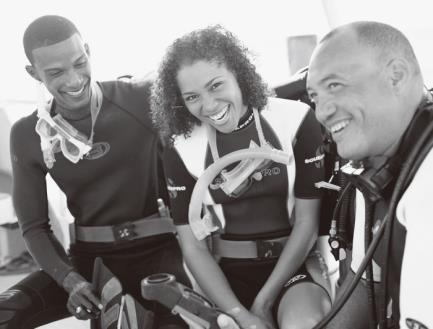
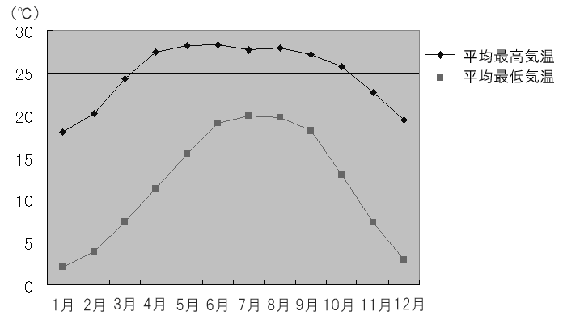
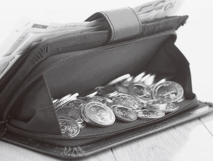
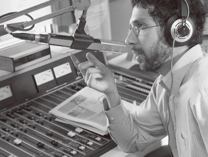
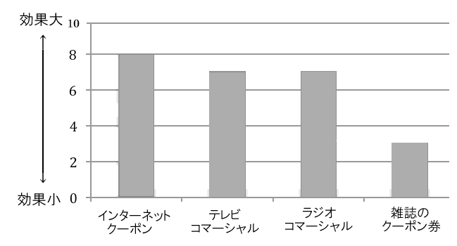
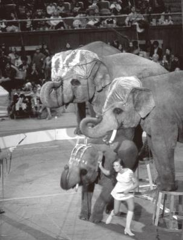
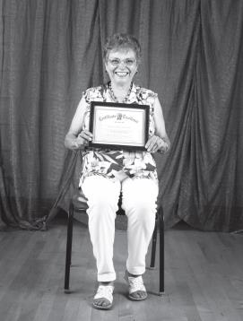
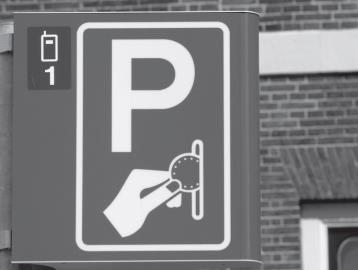

> SUCCESSFUL KEYS TO THE TOEIC®
> LISTENING AND READING TEST 2
> (4) th Edition]

           教授用書

          Mark D. Stafford

             桐原書店

**  **

[[PAGEBREAK]]

【ダウンロード可能な補助教材】

SUCCESSFUL KEYS TO THE TOEIC® LISTENING AND READING TEST 2では，以下のサイトで補助教材をダウンロードして

ご利用いただけます。授業の現場に合わせてご活用ください。

http://www.kirihara.co.jp/

1. 音声スクリプトの文字データ

    本冊子に掲載されているスクリプトの文字データを提供しています。音声内容の確認をさせる際などにご利用ください。

2. 実践演習問題

    100題で構成されたTOEIC® LISTENING AND READING TEST形式のテストです。学習の伸び率をはかるためにご利用ください。

    テスト用冊子はPDFファイルで，リスニングセクションの音声はmp3ファイルで提供しています。

3. Worksheet Unit 1-15

    Unit 1～Unit 15のワークシートをPDFファイルで提供しています。

                                       -2-

[[PAGEBREAK]]

Contents

                         Unit 1 Daily Life               4
                         Unit 2 Places                   8
                         Unit 3 People                   12
                         Unit 4 Travel                   16
                         Unit 5 Business                 21
                         Unit 6 Office                   25
                         Unit 7 Technology               29
                         Unit 8 Personnel                33
                         Unit 9 Management               37
                         Unit 10 Purchasing              41
                         Unit 11 Finances                45
                         Unit 12 Media                   49
                         Unit 13 Entertainment           53
                         Unit 14 Health                  57
                         Unit 15 Restaurants             61

                         Self-study Quizzes Unit 1-15    66

> リスニングセクションは以下の４カ国出身のネイティブスピーカーの音声で録音されており，それぞれの発言の冒頭に以
> 下のように示されています。
> 米 アメリカ 英 イギリス 加 カナダ 豪 オーストラリア
> A_02 はリスニングの音声ファイル名を示しています。

                                              -3-

[[PAGEBREAK]]

Unit 1 Daily Life
 Warm-up      (p. 2)

Check Your Vocabulary!

(1) routine 決まってすること／日課
(2) community 地域社会／共同体
(3) fill 満たす／いっぱいにする
(4) electricity 電気
(5) rent 家賃／賃借［賃貸］する／賃貸される
(6) household 世帯（の）／家庭（の）
(7) trash ごみ／がらくた
(8) empty からの／中身のない／からにする
(9) laundry 洗濯物／洗濯
(10) weather 天気／天候

Words in Context
(1) community          h. 地域
(2) Avenue             i. 通り
(3) household          e. 家庭の
(4) rent               f. 家賃
(5) electricity        j. 電気
(6) garbage            b. ごみ
(7) emptying           a. ～をからにする
(8) trash can          c. ごみ箱
(9) laundry            g. 洗濯
(10) stress            d. ストレス

 Part 1 Photographs     A_02   (p. 3)

1.                                2.
1. (D)
(A) They’re looking at each other. 彼らはお互いを見ている。
(B) The man is writing on some paper. 男性は紙に何かを書いている。
(C) The woman is looking out the window. 女性は窓の外を見ている。
(D) There are some glasses on the table. テーブルの上にはいくつかのコップがある。

2. (C)
(A) He’s washing a pillow. 彼は枕を洗っている。
(B) He’s looking for something. 彼は何かを探している。
(C) He’s using a vacuum cleaner. 彼は掃除機を使っている。
(D) He’s lying on the sofa. 彼はソファーの上で横になっている。

**  **
**  **

                                        -4-

[[PAGEBREAK]]

Unit 1 Daily Life
 Part 2 Question-Response       A_03   (p. 3)

3. (C)

 What do you feel like doing this weekend? 今週末，何をしたいと思いますか。
 (A)I went to see a movie. 私は映画を見に行きました。

(B) Yes, I don’t feel good this weekend. ええ，今週末は具合が悪いです。
(C) I haven’t thought about it yet. そのことは，まだ考えていません。

4. (A)

 You ate all of the bread, didn’t you? あなたはパンを全部食べてしまったのね。

(A) Yes, I’m really sorry about that. はい，本当にすみません。
(B) No, I think Ken drank it all. いいえ，ケンが全部飲んだのだと思います。
(C) Yes, I bought enough for dinner tonight. ええ，今夜の夕食には十分なだけ買いました。

5. (B)

 Where should I fill the car up with gas? 車のガソリンはどこで入れればよいですか。

(A) Sometime next week. 来週のいつか。
(B) At the station on the corner. 角のガソリンスタンドで。
(C) Gas prices are not so high. ガソリン代はそんなに高くないです。

6. (A)

 Don’t you have to go to school today? 今日は学校に行かなくていいの？

(A) No, it’s a special holiday today. うん，今日は特別な休日なんだ。
(B) No, I didn’t have to go yesterday. うん，昨日は行かなくてよかったんだ。
(C) No, they didn’t have any at the store. うん，店には 1 つもなかったよ。

 Part 3 Conversations    A_04     (p. 4)

7. (A) 男性の回答で今日は遅くまで仕事をしなければならない，とある。
8. (A) 金曜日にフランス料理をはいかが，と男性は言っている。
9. (D) 女性の最後の発言で「行ける」と言っている。

 W: I hope you will join us for dinner. We’re going to make Italian food.
 M: Thanks for inviting me, but I have to work late today. Why don’t you come to my house for
    French food on Friday?
 W: That sounds good. I don’t have anything to do, so I can go.
 M: If you don’t mind, could you bring a dessert and something to drink?

> 女性:夕食を私たちと一緒にいかがですか。イタリア料理を作ることになっています。
> 男性:ご招待ありがとうございます，でも今日は遅くまで仕事しなければなりません。私の家で金曜日に
> フランス料理というのはいかがですか。
> 女性:いですね。特に予定もないので，うかがえます。
> 男性:もしよろしければ，デザートと何か飲み物をお持ちくださいませんか。

 女性:いいですね。特に予定もないので，うかがえます。

                                                -5-

[[PAGEBREAK]]

Unit 1 Daily Life
 Part 4 Talks    A_05    (p. 4)

10. (B) 第 1 文を注意して聞く。
11. (A) Tuesday という語のあとを注意して聞くとわかる。金曜まで cool weather が続く。
12. (B) the weekend という語句が出てくる文（The cool で始まる一文）を注意して聞き，内容を選択肢と照らし合わせる。

This is Joan Stickler with the morning weather to tell you that it will be mostly sunny and cool today
and Monday. Try to enjoy the early spring weather by taking a walk after work. The nice weather
should continue until the end of Monday, then there is a chance of cold rain on Tuesday. The cool
weather should last until Friday and it will become sunny and warm for the weekend. In other words,
be prepared for rather changeable weather throughout the week.

> ジョアン・スティックラーが朝の天気予報をお伝えします。本日と月曜日はほぼ晴れて涼しいでしょう。
> 仕事後の散歩で春先の陽気を楽しんでください。晴天は月曜日いっぱいまで続きますが，火曜日には冷
> たい雨が降る見込みです。肌寒い陽気が金曜日まで続き，週末には晴れて暖かくなるでしょう。したが
> って，週を通じていくぶん変わりやすい天気にお備えください。

 Part 5 Incomplete Sentences      (p. 5)

 Part 5 Incomplete Sentences

13. (C)「位置している」という意味になるよう過去分詞が必要になる。

  【訳】私たちの事務所はグリーン通りと 6 番街の角にある。

14. (A) 名詞 projects の前には形容詞が必要。

  【訳】わが社は地元のプロジェクトに貢献することで地域社会を支援している。

15. (C) peak season で「ピーク時」という意味になる。

  【訳】ピーク時ではなかったので，飛行機には空席があった。

16. (A) upon (on) request で，「依頼により」という意味になる。

  【訳】ドライクリーニングと洗濯サービスは，ホテル宿泊客の依頼によりご利用いただけます。

17. (A) try to do の形で動詞の原形が必要。

  【訳】私たちは事務所からのごみ排出量を削減するよう，常に努力すべきだ。

18. (B) have to の次には動詞の原形が必要になる。

  【訳】企業は家賃が高すぎれば，家賃の安いところに場所を移さねばならないだろう。

19. (D) rely on のフレーズの間に，動詞 rely を説明する副詞が入る。

  【訳】会社員のコンピューター依存度は高いので，彼らはコンピューターなしではやっていけない。

                                                 -6-

[[PAGEBREAK]]

Unit 1 Daily Life
Part 7 Single/Multiple Passages   (pp. 6-7)

20. (B) opening や store などの単語から新店舗の開店（セール）の宣伝であると予測できる。
21. (A) Doors open ...の記述部分を確かめる。
22. (A) 3 行目に fifth store という記述があるため，以前には 4 店舗であったとわかる。

> グランド・オープン！
> スティーブのコンピュータ・スーパーストアにて
> 北カリフォルニアで 5 店目の店舗の開店祝いにお越しくださいませ。
> (6) 月 8 日土曜日午前 9 時開店。
> 特売は日曜日午後 7 時まで開催。
> 当店舗の品物はすべて 20%引きです。
> お料理，音楽，ライブショーをお楽しみください！

23. (C) リストには食品名が挙げられているため，食品雑貨店であるとわかる。
24. (D) 1 行目に WEEKDAY とあるので，週末（土曜日か日曜日）が正解。

> ジョーの食品雑貨店で，以下の平日特売品をお求めください
> 産地直送トマト 12 個 2 ドル 76 セント
> ハネデューメロン 1 個 3 ドル 59 セント
> 菜園栽培のキャベツ 1 個 1 ドル 80 セント
> いなかトウモロコシ 6 本 4 ドル 82 セント
> サーロインステーキ 1 パック 8 ドル 73 セント
> フライ用鶏肉 1 本 5 ドル 28 セント
> 紙製品どれでも 15%引き
> 特選家庭用品 10%引き
> 時間：午前 7 時から午後 9 時まで

[[PAGEBREAK]]

Unit 2 Places

 Warm-up       (p. 8)

Check Your Vocabulary!

(1) site 敷地／場所／現場／（ウェブ）サイト
(2) fountain 噴水／泉／湧き水／起源／冷水器
(3) urban 都市［都会］の／都市に住む
(4) metropolitan 大都市の／首都圏の
(5) intersection 交差／横断／交差点
(6) auditorium 講堂／大講義室／公会堂／聴衆席
(7) region 地域／地方／分野
(8) suburb 近郊／郊外
(9) outdoors 戸外で［へ］／戸外／野外
(10) property 財産／資産／所有地／特性

Words in Context
(1) office               b. オフィス
(2) site                 f. 場所
(3) intersection         c. 交差点
(4) metropolitan         h. 大都市の
(5) auditorium           d. 講堂
(6) fountain             g. 噴水
(7) property             k. 所有地
(8) urban                j. 都会の
(9) suburbs              e. 郊外
(10) region              i. 地域
(11) outdoors            l. 野外
(12) rural               a. いなかの

 Part 1 Photographs     A_06   (p. 9)

1.                                2.
1. (D)
(A) The station is large. 駅は大きい。
(B) This is an airport. これは空港である。
(C) The stadium is full. スタジアムは満員だ。
(D) The ship is at the dock. 船が埠頭にある。

2. (B)
(A) The train is far away. 電車は遠くにある。
(B) The mountain has snow. 山には雪がある。
(C) They are driving the cars. 彼らは車を運転している。
(D) The station is indoors. 駅は屋内にある。

**  **
**  **

                                           -8-

[[PAGEBREAK]]

Unit 2 Places
 Part 2 Question-Response         A_07   (p. 9)

3. (C)

 加 What are you going to do at the shopping center? ショッピングセンターで何をするつもりですか。

 英 (A) Friday in the afternoon. 金曜日の午後です。
(B) I’m not sure when it will close. いつ閉まるかわかりません。
(C) I want to buy some clothes. 服を買いたいのです。

4. (A)

 What is your favorite place? あなたの好きな場所は？

(A) I really love the mountains. 私は山がとても好きです。
(B) There aren’t any more spaces. もうスペースがありません。
(C) I think they are all finished. それらは全部終わったと思います。

5. (A)

 Why are you going to Chicago? なぜシカゴに行くのですか。

(A) I want to see the museums. 博物館を見たいのです。
(B) Oh, I’m not going to Atlanta. ああ，アトランタには行きませんよ。
(C) I wanted to see my uncle. おじに会いたかったのです。

6. (B)

 I just love Central Park. 私はセントラル・パークが大好きです。

(A) Park wherever you can. どこでも駐車できるところに停めなさい。
(B) Yes, it’s great, isn’t it? ええ，そこはすばらしいですよね。
(C) Not really. そうでもありません。

 Part 3 Conversations      A_08     (p. 10)

7. (D) 女性は最初の発言でスーパーマーケットに行ったと言っている。
8. (A) 女性は銀行に行くと言っている。
9. (C) 女性の最後の発言を注意して聞く。

 W: I already went to the supermarket earlier this morning.
 M: Good. Where do you have to go next?
 W: I’ll go to the bank to make a deposit before it closes at 3:00.
 M: Oh, can you pick up some deposit slips for me?

> 女性：私はもう今朝早くにスーパーマーケットに行ったわ。
> 男性：よし。次に行かなくてはならないところはどこだい？
> 女性：銀行が 3 時に閉まる前に預金(入金)しに行くわ。
> 男性：それなら，少し預金伝票をもらってきてくれないかい？

                                                   -9-

[[PAGEBREAK]]

Unit 2 Places
 Part 4 Talks    A_09     (p. 10)

10. (D) trade agreement で「貿易協定」という意味になる。
11. (D) 述べられていない国名を消去法で考える。
12. (C) 農作物は 50%の関税がカットされると言っている。

In financial news from Southeast Asia, the governments of Cambodia, Thailand, and Vietnam
announced a trade agreement. It is the first of its kind and is expected to bring about a new era of
international trade. The agreement states that taxes will be cut 50% on the importation of farm
products and 25% on most other goods. The agreement will be signed in a formal ceremony on
December first and take effect on January first and will be a permanent part of the import and export
dealings between the three nations.

> 東南アジアからの金融ニュースでは，カンボジア，タイ，ベトナムの各国政府が通商協定を発表した。
> 通商協定が結ばれるのは初めてのことで，国際貿易に新時代をもたらすものと期待されている。協定は，
> 農産物輸入税を 50％削減し，その他ほぼ全品目の輸入税を 25％削減するとしている。この協定は正式な
> 調印式で 12 月 1 日に署名，1 月 1 日に発効され，三国間の輸出入取引に永続的に適用される。

 Part 6 Text Completion     (p. 11)

13. (B) from A to B で「A から B へ」という意味になる。
14. (A) 前の文で please do not～（～しないでください）という否定の命令文があることから，そうすることの悪影響に言及している(A)が正解。
15. (D)「同じ」という意味の言葉が入ると文脈から考えられる。
16. (C) be unable to do というフレーズが必要だが，未来の話なので(C)が正解。

> 宛先：従業員
> 差出人：ウメダ ヒロシ
> 件名：事務所の引越し
> (1) つの事務所から他の事務所へ引越しする際に，机の引き出しあるいはファイルキャビネットをそのま
> ま持ち出し，引越し先の事務所にある空の引き出しと入れ替えるのはやめてください。そうすると，大
> きな問題が起こるでしょう。
> 同じデザインの家具であっても，異なった家具の引き出しが合わないことがあります。
> このため，入れ替えた引き出しに鍵がからず，あなたの所持品を保管することができなくなります。
> ご協力ありがとうございます。

                                               - 10 -

[[PAGEBREAK]]

Unit 2 Places
Part 7 Single/Multiple Passages   (pp. 12-13)

17. (A) 内容全体から，旅先からのポストカードであると推測できる。
18. (C) 第 2 文の最後に記述がある。
19. (B) 本文最後に classes（授業）とあり，see you（会いましょう）と続いているため，2 人とも学生であると判断できる。

> こんにちは，トーマス！
> 元気？ 私はチャーリーと一緒にヨーロッパを回ってとても楽しんでいるわ。ほとんどは電車に乗って行
> ったのだけど，たまには出会った人の車に乗せてもらったこともありました。
> 私たちはドイツのハイデルベルクとケルンに行って，それからオーストリアのザルツブルクへ行きまし
> た。今はウィーンにいます。すごくきれいな町だし，現地の人たちは親切です。
> 次はイタリアのサルディニアへ向かって，それから一週間したらパリから飛行機で帰りたいと思います。
> 授業は来週からよね，じゃあ，またね！
> マーサ
> (宛名部分)
> トーマス・ドミンゲス様
> (416) ウェストウォーカーロード
> ビクトリア
> アラバマ州 54687 アメリカ合衆国

20. (A) 第 1 文から検診のお知らせだとわかる。
21. (C) 第 2 文に preferably twice a year とあることから，1 年に 2 回が好ましいとわかる。
22. (A) 第 2 段落で please call ... と電話での予約を勧めている。

> 健康診断の時期です！
> 歯の健康は，あなたの健康と幸せに大切なものです。キム医師の提唱によれば，人はだれでも，少な
> くとも 1 年に 1 度，できれば 1 年に 2 度は，健康診断を受けた方がよいということです。
> 最後のご来院から半年がたちましたので，診察の予約をお取りになりますよう，968-7854 へお電
> 話ください。
> 敬具
> キム医師ならびにキム歯科医院職員一同

                                                - 11 -

[[PAGEBREAK]]

Unit 3 People
Unit 3       People
 Warm-up      (p. 14)

Check Your Vocabulary!

(1) relative 親族／身内
(2) contractor 請負人／請負業者／契約者
(3) mechanic 機械工／修理工
(4) representative 代表者／代理人／外交員／販売員
(5) pharmacist 薬剤師／薬屋
(6) teller （銀行の）窓口係
(7) politician 政治家
(8) plumber 配管工／水道屋
(9) physician 内科医／医師
(10) agent 代理人

Words in Context
(1) classmates          a. クラスメート
(2) mechanic            d. 修理工
(3) contractor          f. 請負業者
(4) technicians         b. 技術者
(5) pharmacists         h. 薬剤師
(6) physicians          g. 内科医
(7) politician          e. 政治家
(8) council member      c. 議会議員

 Part 1 Photographs     A_10   (p. 15)

1.                                2.
1. (A)
(A) She is relaxing on a sofa. 彼女はソファーでくつろいでいる。
(B) She is showing her excitement. 彼女は興奮を（顔に）表している。
(C) She is busy at work. 彼女は仕事で忙しい。
(D) She is holding a drink. 彼女は飲み物を持っている。

2. (A)
(A) They look very pleased. 彼らはとても喜んでいるように見える。
(B) They are bored of the sport. 彼らはスポーツに退屈している。
(C) They are going skiing. 彼らはスキーに行くところだ。
(D) They are tired of their jobs. 彼らは仕事に飽きている。

**  **
**  **

                                         - 12 -

[[PAGEBREAK]]

Unit 3 People
 Part 2 Question-Response         A_11   (p. 15)

3. (A)

 Who are you going to take to the party? パーティーには誰を連れて行くつもりですか。

(A) My friend Aki, of course. もちろん，友達のアキです。
(B) Yes, I’m going to go alone. ええ，1 人で行くつもりです。
(C) My professor was late. 教授は遅れて来ました。

4. (B)

 Isn’t your aunt a dentist? あなたのおばさんは歯医者じゃなかったの？

(A) No, she’s a dentist. いいえ，彼女は歯医者です。
(B) Yes, she has her own clinic. ええ，自分のクリニックを持っていますよ。
(C) Yes, she owns a bakery. ええ，彼女はパン屋を持っていますよ。

5. (C)

 I’m studying to become a technician. 技術者になるために勉強しているんです。

(A) That depends. それは時と場合によります。
(B) No, not really. いいえ，そうでもありません。
(C) Great! Good luck. すばらしい！ 幸運を祈ります。

6. (A)

 When will the attendant arrive? 案内係はいつ到着しますか。

(A) At about five. 5 時ごろです。
(B) He is still alive. 彼はまだ生きています。
(C) Attendance was good. サービスはよかったです。

 Part 3 Conversations      A_12     (p. 16)

7. (C) 電話が故障しているため，修理工を呼ぶと考えられる。
8. (B) 電話の修理をしてくれる Phone service の番号を選ぶ。
9. (D) 男性が自分たちは顧客と話をしなければならないと言っているので，オフィスであると考えられる。

 M: The phones are out throughout this building. Can you call the phone company?
 W: Oh, wow! Sure, I’ll use my smartphone. They can probably fix it quickly if it’s just our lines.
 M: Thanks. We really need to talk to our customers.
 W: I agree. A lot of deadlines are coming up soon.

> 男性：このビル中で電話が故障しています。電話会社に電話してくれますか。
> 女性：あら，まあ。え，私のスマートフォンを使いましょう。私たちの電話回線だけなら，たぶんす
> ぐに修理できるでしょう。
> 男性：ありがとう。僕たちは本当に顧客と話をする必要があるんです。
> 女性：そうですね。期限がせまっているものがたくさんありますものね。

| 業者 | 連絡先 |
| --- | --- |
| 電気器具店 | 654-6465 |
| 電話サービス | 646-6421 |
| 会計士 | 657-5462 |
| 自動車修理工 | 646-3484 |

                                                   - 13 -

[[PAGEBREAK]]

Unit 3 People
 Part 4 Talks     A_13    (p. 16)

10. (D) voice mail と言っているので，「録音された」留守番電話のメッセージであるとわかる。
11. (C) 第 2 文で Senior Sales Representative であると言っている。
12. (D) この場合の business は「商取引」という意味で，話者はそれが大事だと言っている。

Thank you for calling. This is the voice mail for Martha Voight, Senior Sales Representative for The
Gas Company. I’m away from my desk at the moment and currently unable to answer the phone. Your
call is extremely important to me, so please leave a message and I’ll get back to you as soon as possible.
If you wish to discuss opening a new account with us, please leave your name and phone number and
explain what type you are most interested in. I’ll call you back as soon as possible. Your business is
important.

> お電話ありがとうございます。こちらはガスカンパニーの上級販売員マーサ・ヴォイトの留守番電話で
> す。現在，席を離れているため，電話に出ることができません。いただいたお電話は私にとりましては
> 大変重要なものですので，メッセージをお残しください。こちらからできるだけ早くかけ直させていた
> だきます。当社と新たな取引を始めることについてご相談されたいお客様は，お名前，お電話番号，そ
> してどのような種類のお取引にご興味があるのかご説明ください。こちらから早急にご連絡さしあげま
> す。お客様とのお取引は大事ですので。

 Part 5 Incomplete Sentences        (p. 17)

13. (C) help の目的語なので代名詞の her が必要。「help +人+動詞の原形」の形。

  【訳】出版責任者は，彼女がプロジェクトを終えるのを手伝える者は誰かいないかと尋ねた。

14. (B) completing（～に記入する）の主語（～が）となる代名詞が必要。

  【訳】次のアンケートに回答していただけましたら感謝いたします。

15. (A)「その会社の」という意味にするために its（単数を受ける代名詞）が必要。

  【訳】その会社は，会社の市場シェアが最近増加したのは価格引下げのためであるとしている。

16. (C)「互いに」という意味を表す代名詞は each other。

  【訳】互いに紹介を受けているので，私は彼女の名前を知っています。

17. (D) managers（複数形）を受ける代名詞 their が正解。

  【訳】そのセミナーで，従業員のやる気を起こさせる方法を経営者は学んだ。

18. (C)「彼女の」という意味にしなければならない。

  【訳】クラークソンさんは，彼女のかかりつけの医者に薬のことで相談した。

19. (C) 再帰代名詞を使って強調している。companies を受けて複数形となる。

  【訳】たばこ会社自身でさえも，喫煙は健康に有害であると認めている。

                                                  - 14 -

[[PAGEBREAK]]

Unit 3 People
Part 7 Single/Multiple Passages   (pp. 18-19)

20. (A) グリーン氏の 2 回目の発言中の I’m worried whether～（～かどうか心配）の後に述べられていることが正解。
21. (C) got it は相手に対して「了解した，理解した」と言う場合の口語表現。
22. (D) シンガポールにゲーム機を製造している工場があるということから，            「製造業者」と判断できる。

> エリック・グリーン 2:15 P.M.
> やあ，シャーリー。もう配送についてシンガポール工場と連絡が取れたかい？
> シャーリー・ウッド 2:16 P.M.
> いえ，まだです。でも，すべての需要を満たすためにフル操業していると
> 思うわ。
> エリック・グリーン 2:17 P.M.
> 新しいポータブルゲーム機が冬休みに間に合うように届けられるかどうか心
> 配なんだ。もう大々的な宣伝活動を始めているしね。
> シャーリー・ウッド 2:18 P.M.
> わかりました。今すぐ工場長に電話するようにします。
> シャーリー・ウッド 2:27 P.M.
> 今，電話を終えたところです。彼によると，他の国向けの在庫を使い，それ
> を私たちにすぐに送ってくれるそうです。
> エリック・グリーン 2:30 P.M.
> わかった。彼はその荷がいつ届けられるのかの見通しを伝えてくれたかい？
> シャーリー・ウッド 2:33 P.M.
> 彼は，予定どおりに次の金曜日に届くと言っていたわ。
> エリック・グリーン 2:42 P.M.
> ありがとう。

ありがとう。

23. (A)「訪問診療」という「新しい」サービスについての紹介記事である。
24. (D) 第 1 段落の「昔のこと（往診）を覚えている人」を「高齢者」に置き換えている。
25. (C) 第 2 段落後半の内容に(C)が一致する。
26. (D) この発言をしている人が直前に登場する(D)が正解。

> サンライズ・ヘルスケア社が「新」サービスを提供
> 報告：ライアン・ラジ
> ロサンゼルス(6 月 5 日)―人口の高齢化とその医療ニーズの高まりに応えて，サンライズ・ヘルス
> ケア社は，古い世代にはそうではないもの，若い世代には珍しい新しいサービスを開始する予定であ
> る。このニュースを聞いて家庭医が「訪問診療」を行っていた頃を覚えている人は懐かしさを感じるか
> もしれないが，それを最も必要としている人たちにとっては，魅力的に響くだろう。
> 高齢者の親族が，自分たちの両親や祖父母を高額な長期療養施設よりも自宅にとどめることを選ぶこと
> がますます多くなっていることから，新たな医療ニーズが高まっていた。よくあることだが，高齢者は
> 公共交通機関を利用して病院や医院に出かけるよりは，自宅にとどまっていたがるものである。さらに，
> 若い親族は自分の常勤の仕事に忙しくて高齢者に付き添えないことが多い。こうした状況が，しばしば
> 高齢者の間での不十分な医療を招いている。
> サンライズ・ヘルスケア社は，「訪問診療」を復活させることで，この問題を解決しようと考え，医師，
> 薬剤師，看護師たちが家々を回って自宅で患者を診断し，治療し，薬を提供しようとしている。サンラ
> イズ・ヘルスケア社の代表者は，この新サービスの費用は院内治療よりも高額になるが，患者と親族に
> とっての全体的な費用は長期の介護施設よりもずっと割安になると述べている。「このようにして，サン
> ライズ・ヘルスケア社は，『訪問診療』を『現代』医療の最も新しい変革として復活させようとしている
> のです」

                                   「このようにして，サンとっての全体的な費用は長期の介護施設よりもずっと割安になると述べている。

[[PAGEBREAK]]

Unit 4 Travel
Unit 4       Travel
 Warm-up       (p. 20)

Check Your Vocabulary!

(1) cruise 船旅
(2) luggage （旅行用）かばん類／手荷物
(3) overseas 海外で［へ／に］／外国の
(4) connect つなぐ／結び付ける／連絡する
(5) transfer 乗り換え／移動させる
(6) customs 関税／税関
(7) transportation 輸送機関／乗り物
(8) board 乗り込む
(9) destination 目的地／行き先／到着地
(10) domestic 国内の／家庭の

Words in Context
(1) transportation                  k. 輸送機関
(2) overseas                        d. 海外の
(3) destination                     j. 目的地
(4) shuttle                         b. シャトルバス
(5) domestic terminal               g. 国内線ターミナル
(6) boarded                         h. 乗り込んだ
(7) flight                          e. フライト
(8) transferred                     c. 移動させた
(9) luggage                         a. かばん類
(10) international airline          f. 国際便
(11) connected                      l. 連絡した
(12) cruise                         i. 船旅

 Part 1 Photographs          A_14    (p. 21)

1.                                      2.
1. (B)
(A) There’re some boats on the river. ボートが何隻か川に浮かんでいる。
(B) The bridge has arches. 橋にはアーチがある。
(C) The bridge is behind the old buildings. 橋は古い建物の後ろにある。
(D) Boats are passing under the bridge. ボートが橋の下を通過している。

2. (D)
(A) He is driving the train. 彼は列車を運転している。
(B) His papers are on the floor. 彼の書類は床の上にある。
(C) He is boarding a plane. 彼は飛行機に搭乗するところだ。
(D) He is pulling his luggage. 彼は自分の荷物を引っ張っている。

**  **
**  **

                                               - 16 -

[[PAGEBREAK]]

Unit 4 Travel
 Part 2 Question-Response        A_15   (p. 21)

3. (B)

 Where will you arrive? あなたはどこに着きますか。

(A) I’ll depart from London. 私はロンドンから発ちます。
(B) At the domestic terminal. 国内線ターミナルに。
(C) On July 10th. 7 月 10 日に。

4. (A)

 When does the bus to Sacramento leave? サクラメント行きのバスはいつ出ますか。

(A) Not until tomorrow morning. 明日の朝までありません。
(B) Sure, it’s going to leave. もちろん，出ますよ。
(C) This isn’t the train station. ここは鉄道駅ではありません。

5. (A)

 Haven’t they gone yet? 彼らはまだ行ってないのですか。

(A) No, they’re leaving on Thursday. ええ，彼らは木曜日に出発するんです。
(B) I’m going right now. 私は今すぐ行きます。
(C) No, they left already. いいえ，彼らはすでに発ちました。

6. (C)

 I usually use Speedy Travel. 私はたいていスピーディー・トラベルを使います。

(A) The bank is closed today. 銀行は，今日は休みです。
(B) But I don’t want to go anywhere. でも，私はどこにも行きたくないです。
(C) Me, too. They’re the best. 私もです。あそこがいちばんですね。

 Part 3 Conversations     A_16     (p. 22)

7. (C) 女性の 2 回目の発言で午後には着くと述べている。
8. (D) 女性が男性の「わずか 6 時間のフライトだ」という発言に対して感想を述べている。
9. (B) 女性がショッピングの時間がたくさんあると言っていることから推測できる。

 W: Our plane departs early Friday morning.
 M: Yeah. I thought it would be longer, but it’s only a six-hour flight.
 W: That’s a good thing. We should get there in the afternoon. There should be plenty of time to go
    shopping.
 M: I’ve been looking forward to this for over a year now.

> 女性：私たちの飛行機は金曜の朝早く出発するわ。
> 男性：うん。もっと長くかるかと思ったけど，たった 6 時間のフライトだね。
> 女性：よかったわ。午後には向こうに着くはずよ。ショッピングの時間がたくさんあるわね。
> 男性：１年以上も前からこの時を楽しみにしていたよ。

 男性：うん。もっと長くかかるかと思ったけど，たった 6 時間のフライトだね。

                                                  - 17 -

[[PAGEBREAK]]

Unit 4 Travel
 Part 4 Talks    A_17    (p. 22)

10. (D) 第 4 文で「山での降雪」と言っている。
11. (A) However 以下を注意して聞く。
12. (A) 最後から 2 文目で，日曜日が今年いちばんの暖かい日になると予想されている。

Thank you for choosing Eyewitness News, the best news in the southland. We begin tonight’s broadcast
with an outlook on this weekend’s weather. I’m very happy to say that after a long time you can look
forward to great weekend weather. The recent rains and mountain snowfall should mostly end by
Friday afternoon. However, there might still be some rain and low clouds on Saturday morning, but
Sunday looks like it will be the warmest day of the year so far. Enjoy it while it lasts, because a new
cold front is due early next week.

> 南部随一のアイウィットネス・ニュースをお選びいただき，ありがとうございます。今晩の放送はまず
> この週末の天気予報をお伝えいたします。うれしいことに，しばらくぶりで素晴らしい週末のお天気が
> 期待できそうです。このところの雨や山での降雪も金曜日の午後までにはほぼやむでしょう。それで
> も，土曜日の朝のうちは雨と低く垂れ込めた雲が残るかもしれませんが，日曜日は今年いちばんの暖か
> い日となりそうです。来週はじめには新たな寒冷前線が発生しそうですから，天気が崩れる前にこの暖
> かい陽気をお楽しみください。

                                                - 18 -

[[PAGEBREAK]]

Unit 4 Travel
Part 6 Text Completion       (p. 23)

13. (B)「別紙に記されている」となるように現在形にする。
14. (D)「必要とされる」という受身の形となる。
15. (B) 空欄の前後が「必要な変更事項（necessary changes）を記入してください」と「コンピューター上の記録を修正します」という意味の文なので，追加の作業を求めていると考えられる。
16. (C)「もし何か質問があれば電話をしてください」という意味なので any しか下線部には入らない。

> 宛先：ジャン＝ポール・ソービロン
> 差出人：人事部
> 日付：12 月 1 日
> 貴殿が昨年提出した個人記録は別紙に記されている通りです。なお，特定の用語についてはその定義と
> 説明も合わせて示してあります。
> 情報が正しければ，何もする必要はありません。しかしながら，もし何か更新が必要な情報があれば，
> 必要な変更事項を記入した上で署名し，この用紙を人事部に返送してください。日付も忘れずに記入し
> てください。コンピューター上の記録を修正し，その写しを貴殿あて送付いたします。何か質問があれ
> ば，人事部の内線番号 1526 までお問い合わせください。

Part 7 Single/Multiple Passages        (pp. 24-25)

17. (A) Web page には毎月の平均最低気温と平均最高気温が記載されている。
18. (D) Web page はネパールの気候について述べているので，観光客が関心を持つと考えられる。
19. (A) e-mail に個々の月の平均最低気温が書かれており，1 月が 2.1 度で最も低い。
20. (D) e-mail より 12 月が温度差 16.4 度で最も差が大きい月であることがわかる。
21. (D) Web page には雨期が 5 月から 9 月まで続くとあり，e-mail では雨期の直後に出かけようと提案していることから 10 月だと判断できる。

> http://trekkingnepal.com/weather/
> ネパールのカトマンドゥの気温は，季節によって大幅に上下します。冬の間の気温はと
> ても低いですが，夏には昼夜ともとても温暖になります。5 月が最も気温の高い月です
> が，雨期がその頃から始まり，9 月まで続きます。ヒマラヤをトレッキングするのであ
> れば，3 月から 4 月にかけて，そして 10 月と 11 月が最適な月です。

**  **
**  **

                                                     - 19 -

[[PAGEBREAK]]

Unit 4 Travel

> 宛先：エリック・ハンター
> 送信者：カズ・ミフネ
> 日付：5 月 5 日
> 件名：僕たちのトレッキング計画
> やあエリック，
> ヒマラヤにトレッキングに行く僕たちの計画について少し調べてみたところ，ウェブサイトで天気につ
> いていくらかわかった。この情報は，行く時期やどのような装備が必要か正確に決めるのに役立つ。1
> 月の平均最低気温は 2.1℃，平均最高気温は 18℃で気温差は 15.9 度ある。5 月には，月間の平均最低気温
> は 15.5℃，平均最高気温は 28.2℃で気温差は 12.7℃になる。8 月には，低い方の平均が 19.7℃，高い方の
> 平均が 28℃で気温差は 8.3℃になる。12 月には，低い方の平均が 3℃，高い方の平均が 19.4℃で気温差は
> (16) .4℃になる。僕はできるだけ早く行きたいけど，現地の天候を考えると，今年の雨期の直後に出かける
> べきだと思う。君はこの計画をどう思う？
> 君の友達
> カズ

                            - 20 -

[[PAGEBREAK]]

Unit 5 Business
Unit 5       Business
 Warm-up       (p. 26)

Check Your Vocabulary!

(1) representative 代表者／代理人／外交員／販売員
(2) executive 管理職／重役の
(3) contract 契約／契約する／縮少する
(4) financial 財政上の／お金の
(5) request 依頼する／頼む／要求
(6) negotiation 交渉
(7) committee 委員会
(8) deadline 締切／最終期限
(9) application 申し込み／申込書／適用
(10) compete 競争する／匹敵する

Words in Context
(1) executive              d. 重役の
(2) management             b. 管理
(3) committee              a. 委員会
(4) labor                  i. 労働
(5) contract               c. 契約
(6) division               g. 部門
(7) personnel              e. 人事の
(8) appointment            h. 予約
(9) representatives        f. 代表者

 Part 1 Photographs      A_18   (p. 27)

1.                                 2.
1. (A)
(A) He is pointing to a chart. 彼はグラフを指差している。
(B) He is making a meal. 彼は食事を作っている。
(C) He is pointing to the audience. 彼は聴衆を指差している。
(D) He is making a chart. 彼はグラフを作っている。

2. (A)
(A) The man is showing something to the woman. 男性は女性に何かを見せている。
(B) The woman is raising both her hands. 女性は両手を上に上げている。
(C) They are looking in opposite directions. 彼らは逆の方向を向いている。
(D) They are shaking hands. 彼らは握手をしている。

**  **
**  **

                                          - 21 -

[[PAGEBREAK]]

Unit 5 Business
 Part 2 Question-Response       A_19   (p. 27)

3. (A)

 Who will calculate the data? 誰がデータを計算しますか。

(A) Susan Ong is in charge of it. スーザン・オングが担当しています。
(B) The date has not been set yet. 日にちはまだ決まっていません。
(C) Mr. Lee will terminate the contract. リーさんは契約を終了します。

4. (B)

 When were the equipment orders filed? 備品の注文書はいつファイルされましたか。

(A) Maybe Ms. Kohara will. たぶんコハラさんがするでしょう。
(B) They were filed two days ago. 2 日前にファイルされました。
(C) They are in the sales department. それらは販売部にあります。

5. (C)

 Where was the government application submitted? 政府への申請書はどこに提出されましたか。

(A) Ms. Jackson selected it last month. ジャクソンさんが先月それを選びました。
(B) Steven in accounting represented it. 経理部のスティーブンがそれを代表しました。
(C) Downtown, at the city office. 町の中心部の市役所です。

6. (A)

 Who wrote the new construction contract? 新しい建設契約は誰が書きましたか。

(A) Somebody in the legal department did. 法務部の誰かが書きました。
(B) Sales will probably contract this year. 今年はおそらく売上高が縮小するでしょう。
(C) Frank rode a train to the construction site. フランクは建設現場まで電車で行きました。

 Part 3 Conversations    A_20     (p. 28)

7. (C) 男性が予算案（budget plan）と言っており，言い換えとなっているものが正解。
8. (C) 男性の最後の発言でちょうど 3 カ月かかったと述べられている。
9. (B) 女性の That’s a relief（安心したわ）という発言を言い換えた relieved（安心している）が正解。

 M: We finished the budget plan today at two o’clock.
 W: That’s a relief. It has taken months of negotiations. I’m really happy about it.
 M: Yes. We’ve been working on it for exactly three months. Now we can start working on some
      other projects.

> 男性：今日 2 時に予算案を作り終えたよ。
> 女性：安心したわ。交渉に何カ月もかったわね。本当にうれしいわ。
> 男性：そう。ちょうど 3 カ月取り組んでいたからね。これでようやく他の企画に取りかれるよ。

 女性：安心したわ。交渉に何カ月もかかったわね。本当にうれしいわ。

                                                 - 22 -

[[PAGEBREAK]]

Unit 5 Business
 Part 4 Talks    A_21   (p. 28)

10. (D) 第 1 文で「来週」の木曜日と述べられている。
11. (A) 過去最高の売上増 6,000 個が見込まれるという地域に該当するのはアフリカ。
12. (C) 売上が伸び，増益も期待されると言っているため，会社は成功していると考えられる。

The company will issue its annual financial statements on Thursday of next week. Fortunately,
most of the news about the past quarter will be rather good. Due to the current positive economic
environment, we expect a record increase of 6,000 units in sales in one of our regions for the next
quarter. We have benefited greatly since China has opened more to foreign trade. We also
anticipate even larger profits in the coming year due to decreasing costs of energy and raw
materials. We will have a meeting next Friday to discuss what to do with the surplus we expect to
have in the budget.

> 会社は来週木曜日に年次決算報告を発表することになっている。幸いにも，前四半期に関するニュース
> のほとんどは，かなり前向きなものとなるだろう。現在の好ましい経済環境のおかげで，当社は次の四
> 半期には販売地域の１つで 6,0 個という過去最高の売上増が期待される。中国が外国との貿易に対し
> てさらに門戸を開放したことが，当社に大いに有利に働いている。来年も，燃料費および原材料費が減
> 少しているため，さらなる増益を予想している。来週金曜日に予定されている会議では，見込まれる予
> 算の余剰分をどう取り扱うかについて議論する。

| 次四半期に予想される販売個数の増加 |  |
| --- | --- |
| 地域 | 数量 |
| アフリカ | 6,0 |
| アジア | 4,0 |
| 南米 | 2,500 |
| ヨーロッパ | 9,0 |
 アジア         4,000
 南米          2,500
 ヨーロッパ       9,000

 Part 5 Incomplete Sentences      (p. 29)

13. (D) 主語が三人称単数なので，insists が正解。

  【訳】統括者のパーク氏は，就業者は定刻に仕事を始めるよう主張している。

14. (A) 受身にして be permitted to do（～することが許される）の形を作る。

  【訳】放送中のサインが点灯しているときには，誰も録音スタジオ内に入ることは許されない。

15. (C) to 不定詞なので動詞の原形を入れればよいと判断できる。

  【訳】他社と競争するため，創意のある販売戦略を立てなければならない。

16. (C) 最後の three days ago から過去の時制であることがわかる。

  【訳】主要企業の経営トップが 3 日前に年次総会に出席した。

17. (B) by の次には動名詞が必要。

  【訳】時間のかかりすぎる手続きを最小化することで，そのチームは締切に間に合わせることができた。

18. (A) so far が「今までのところ」という意味なので現在完了形が必要。

  【訳】私たちがスケジュール変更を申し入れたにもかかわらず，これまでのところ何もなされていない。

19. (C) and の後ろが現在形（are）になっていることから，空所には現在形が必要。

  【訳】この冊子に記載されたイベントは午後 8 時 30 分に始まり，入場料は無料です。

                                               - 23 -

[[PAGEBREAK]]

Unit 5 Business
Part 7 Single/Multiple Passages   (pp. 30-31)

20. (A) 回覧の内容に All sales personnel（営業部員は全員）とある。
21. (C) 回覧の第 3 文に prepare a brief summary ... and bring it ... to submit it と記述がある。
22. (D) 回覧より 2 人が出席を予定しているセミナーはインターネットマーケティングに関するものであることから推測できる。
23. (C) 回覧で国際会議が 1 月 17 日から 19 日までの 3 日間であることがわかり，Mr. Hong 宛ての e-mail
24. (A) Mr. Hong 宛ての e-mail で Ms. Raji が最後に Let me know ... と連絡を求めているので，Mr. Hong

> 社内回覧
> 催し：国際営業会議
> 日付：1 月 17 日－19 日
> 時間：午前 9 時－午後 5 時 30 分
> 場所：アルバータ・コンベンション・センター(コッター通り 3145)
> 伝言：営業部員は全員，この会議に出席してください。インターネットマーケティングに関するセミナ
> ーにできるだけ多く出席してください。社に戻ったら，活動の要約を準備して来月の販売総会に持
> 参し，責任者に提出してください。またイベントのプログラムも提出してください。

> 宛先：エリザベス・ラジ
> 送信者：マイケル・ホン
> 日付：11 月 15 日
> 件名：国際営業会議
> こんにちはエリザベス
> あなたもたぶん，すでに国際営業会議についての社内回覧を読んだこと思います。会社は我々の出席
> をとても望んでいるようだから，僕も真剣に考えています。新しいマーケティング技術を知り，新しい
> 人たちと知り合いになれるよい機会になると思います。あなたがこの出張のスケジュールを一緒に立て
> たいのではないかと考えていました。私は 3 日間すべてに出席する予定です。きっとホテルはすぐに予
> 約でいっぱいになるだろうから，できるだけ早く予約をしましょう。
> よろしく
> マイケル

> 宛先：マイケル・ホン
> 送信者：エリザベス・ラジ
> 日付：11 月 15 日
> 件名：Re：国際営業会議
> こんにちはマイケル
> メッセージありがとう。え，回覧はもう読んでいて，私も今年は行きたいと思います。ただ 1 つだけ
> 問題があるんです。その会議の最初と最後の日に顧客との大事な打ち合わせが入っているので，あなた
> とは 1 日だけしか行けません。短い時間でも，現地であなたと落ち合いたいと思います。いずれにして
> も，私たちは同時に旅行の手配をすることができます。あなたがいつ旅行代理店と話せる時間があるの
> かお知らせください。
> それでは
> エリザベス

 こんにちはマイケル

 メッセージありがとう。ええ，回覧はもう読んでいて，私も今年は行きたいと思います。ただ 1 つだけ問題があるんです。その会議の最初と最後の日に顧客との大事な打ち合わせが入っているので，あなたとは 1 日だけしか行けません。短い時間でも，現地であなたと落ち合いたいと思います。いずれにしても，私たちは同時に旅行の手配をすることができます。あなたがいつ旅行代理店と話せる時間があるのかお知らせください。

 それではエリザベス

                                                - 24 -

[[PAGEBREAK]]

Unit 6 Office
Unit 6         Office
 Warm-up         (p. 32)

Check Your Vocabulary!

(1) locate ～を設置する
(2) supply 供給する／供給（物）
(3) expand 拡大する／発展する
(4) reception 受付
(5) facility 施設／設備
(6) efficient 効率的な
(7) branch 支部／支店
(8) status 地位／身分
(9) merge 合併する／併合する
(10) division 部門

Words in Context
(1) advertising                      e. 広告
(2) division                         k. 部門
(3) branch                           g. 支店
(4) facility                         h. 施設
(5) located                          a. 位置している
(6) expand                           j. 事業の拡大をする
(7) merging                          b. 合併する
(8) merger                           f. 合併
(9) complete                         c. 完了した
(10) promoted                        i. 昇進させる
(11) management position             d. 管理職

 Part 1 Photographs          A_22   (p. 33)

1.                                            2.
1. (D)
(A) They are smiling at a customer. 彼らはお客にほほ笑んでいる。
(B) They are selecting a computer. 彼らはコンピューターを選んでいる。
(C) The man is typing a message. 男性はメッセージを入力している。
(D) The woman is using a keyboard. 女性はキーボードを使っている。

2. (D)
(A) Some people are sitting on the floor.

                                                 何人かの人たちが床に座っている。

(B) A team is preparing to play. チームが試合をする準備をしている。
(C) People are waiting in a line. 人々は列を作って待っている。
(D) Many people are listening to a man. 多くの人たちが男性の話を聞いている。

**  **
**  **

                                                     - 25 -

[[PAGEBREAK]]

Unit 6 Office
 Part 2 Question-Response        A_23     (p. 33)

3. (C)

 When will you have lunch today? 今日は何時にランチを食べますか。

(A) I will just have a sandwich. サンドイッチだけを食べます。
(B) At the corner restaurant. 角のレストランで。
(C) I have a lot to do, so after 1:00. たくさんすることがあるので，1 時過ぎです。

4. (B)

 I think we need more toner for the copier. コピー機のトナーがもっと必要だと思います。

(A) No, we ran out. いいえ，全部使ってしまいました。
(B) I’ll order some right away. すぐに注文します。
(C) I just bought coffee yesterday. 昨日，コーヒーを買ったばかりです。

5. (A)

 Sandy will get some more office supplies. サンディーがもっと事務用品を買い足します。

(A) Good, we’re running low. よかった。少なくなっているから。
(B) Yes, she was really surprised. ええ，彼女は本当に驚きました。
(C) They are taking a break. 彼らは休憩しています。

6. (A)

 Who is at the reception desk? 受付にいるのは誰ですか。

(A) Mr. Smith is sitting there. スミスさんが座っていますよ。
(B) The sales desk is over there. 販売受付はあそこにあります。
(C) I told them this morning. 今朝，彼らに話しました。

 Part 3 Conversations     A_24     (p. 34)

7. (B) 女性の発言で，取引先の人に会うと述べられている。
8. (C) 男性の 2 回目の発言にある数字を注意して聞く。
9. (A) reception desk（受付デスク）の隣の部屋が正解。

 M: We’ll have a staff meeting at four. It’s important, so you really have to come.
 W: Oh, really? But I’ll meet a client then. Can you reschedule it to a later time?
 M: OK. Let’s make it at five instead. We can meet in the small meeting room next to the reception
    desk.
 W: Sounds good to me.

> 受付
> (245) 246 247
> (248)
> エレベーター

 女性：いいですよ。

 エレベーター
                        248

                                                    - 26 -

[[PAGEBREAK]]

Unit 6 Office
 Part 4 Talks     A_25    (p. 34)

10. (B) Everything Office Supplies が店名なので，事務用品の店とわかる。
11. (B) 夏期の営業時間は午前 9 時から午後 8 時までと述べられている。
12. (A) 夏時間の営業は 6 月 1 日からであるという部分を注意して聞く。

May I have the attention of all customers? Thank you for shopping at Everything Office Supplies. We
would like to make an announcement about store hours. We will be closing the store at our regular
time of 7:00 in fifteen minutes. Please make your selections and go to the registers quickly and safely.
For your information, our summer hours of 9:00 a.m. to 8:00. p.m. will begin on June first in order to
take advantage of daylight saving time. Please come and shop with us again.

> お客様にご案内いたします。エブリシング・オフィス・サプライズでお買い物いただき，ありがとうご
> ざいます。営業時間についてお知らせいたします。あと 15 分で通常の閉店時刻の 7 時となります。お求
> めの品物がお決まりになりましたら，できるだけ早くレジへとお進みくださいませ。なお，6 月 1 日よ
> り，サマータイムを活かし，夏の営業時間を午前 9 時より午後 8 時とさせていただきますことをお知ら
> せいたします。またのご来店をお待ち申し上げております。

 Part 6 Text Completion     (p. 35)

13. (C) 注文を完了することができなくて申し訳ないと謝っているので apologize がふさわしい。
14. (D)「～までに」を表す前置詞は by となる。
15. (A)「遅れた」という意味の語が入る。delaying（引き延ばす，遅らせる）との違いに注意する。
16. (C) 選択肢の(A)と(B)は本文の内容と食い違っている。提示した条件の回答は電話ではなく同封のカードですることになっているため，(D)も合わない。謝罪文の締めくくりとしては(C)が適切。

> ステュワーツ株式会社
> (92) ハートレー・ドライブ
> バーリントン, ペンシルベニア州 02354
> お客様
> お客様からの最近のご注文に応ずることができていないことを，再度おわびいたします。足りない商品
> はまだ当社の倉庫に到着しておりません。添付書類に記載しました日付までに，もしくはそれよりも早
> く発送できるものと思われます。
> もし今回の新たな発送日がお客様の意に沿うものでなければ，添付のカードにご署名の上，私どもまで
> ご返送ください。こちらから商品を発送するまでにお返事いただけなかった場合には，繰り延べた発送
> 日について，お客様が同意されたものと見なさせていただきます。お客様のご注文に関する今回の問題
> を重ねておわびいたします。
> お客様のご理解とご協力に感謝いたします。

                                                 - 27 -

[[PAGEBREAK]]

Unit 6 Office
Part 7 Single/Multiple Passages   (pp. 36-37)

17. (A) 第 1 段落が同僚や上司に相談している内容なので，colleague が正解。
18. (B) 第 1 段落第 3 文目に記述がある。
19. (D) 第 2 段落に You can also decide this.とあり，You とは Mr. Simmons のこと。

10 月 31 日

シモンズ様へ

すべての補助職員向けの 3 月 14 日の会議を企画してください。時間はお任せいたします。彼らには，4 月
1 日よりパート雇用から正規雇用への職の変更について話す必要があります。

形式ばらずに話すならば昼食をとりながらカフェテリアで，あるいは，正式にということであれば大会議室で会いましょう。その選択もお任せいたします。

よろしくお願いいたします。
ヘイ＝ヤング・エドワーズ

20. (D) 第 1 段落第 1 文の retire を，質問では leave her job と言い換えている。
21. (C) 第 1 段落 3 行目に worked at the college とあるので，大学と判断できる。

> (3) 月 24 日
> 常勤教員各位
> 皆様もおそらくご承知の通り，私は今年の 12 月 28 日で退職いたします。この機会に，大学勤続中の 20
> 年にわたって賜りましたご親切のお礼を皆様にさせていただきたいと思います。多くの方々とは親交も
> ございましたので，きっと皆様全員のことが恋しくなることでしょう。
> 新しい事務長のジェフリー・シャプロン氏には，すでに指示を出し，私が最近かわっていた仕事を引
> き継いでいただくようにしています。彼は大変有能な職員ですので，職場をとても効率的な場所にして
> くださること思います。私と同じくらい彼にも親切にしてあげてください。
> 何か不明なことがありましたら，いつでもご遠慮なく自宅にお電話ください。
> 敬具
> 退職間近の事務長
> カリ・アンダーソン

[[PAGEBREAK]]

Unit 7 Technology
Unit 7       Technology
 Warm-up       (p. 38)

Check Your Vocabulary!

(1) warranty 保証（期間）／保証書
(2) component 部品／構成要素
(3) electronic 電子の
(4) upgrade 品質を高める／グレードアップ（する）
(5) device 装置／道具
(6) enable （人に）～できるようにする
(7) term 用語／期間／条件
(8) innovative 革新的な／刷新的な
(9) technology 科学技術／工業技術／工学
(10) laboratory 研究所／試験所／実験室

Words in Context
(1) component                   i. 部品
(2) electronic                  e. 電子の
(3) device                      g. 装置
(4) communicate                 m. 連絡を取る
(5) through                     b. ～を通して
(6) access                      d. アクセスする
(7) innovative                  k. 革新的な
(8) machinery                   c. 機械
(9) enables                     a.（人に）～できるようにする
(10) maintenance                j. メンテナンス
(11) warranty                   l. 保証
(12) maker                      h. メーカー［製造元］
(13) upgrade                    f. アップグレード

 Part 1 Photographs           A_26   (p. 39)

1.                       2.
1. (B)
(A) He’s experimenting in a laboratory. 彼は研究室で実験をしている。
(B) He’s controlling a machine. 彼は機械を操縦している。
(C) He’s boarding an airplane. 彼は飛行機に乗り込もうとしている。
(D) He’s climbing a mountain. 彼は山登りをしている。

2. (C)
(A) They’re wearing masks for a party. 彼らはパーティーのために仮面をつけている。
(B) They’re looking into the microscope. 彼らは顕微鏡をのぞき込んでいる。
(C) They’re working in a laboratory. 彼らは実験室で作業をしている。
(D) They’re wearing safety glasses. 彼らは安全メガネをかけている。

**  **
**  **

                                               - 29 -

[[PAGEBREAK]]

Unit 7 Technology
 Part 2 Question-Response        A_27   (p. 39)

3. (A)

 You returned your monitor, didn’t you? あなたはモニター装置を返したのですね。

(A) Yes, it never worked well. ええ，全然きちんと作動しませんでした。
(B) I’ll monitor the equipment. 私が機器を見てみます。
(C) I’ll come on Monday. 私は月曜日に来ます。

4. (B)

 I just bought my first mobile phone. 初めての携帯電話を買ったばかりなんです。

(A) My answering machine broke. 私の留守番電話が壊れました。
(B) Good. Now we can talk more. よかった。これからもっと話せるね。
(C) Stereos are getting cheaper. ステレオは安くなっています。

5. (A)

 What did the computer repairperson say on the phone? コンピューター修理の人は，電話で何て言っていたの？

(A) He wants to replace my hard drive. 私のハードドライブを交換したいんですって。
(B) The theater is closed for repairs. 劇場は修理のため閉まっています。
(C) He called my family’s phone. 彼は私の家族に電話しました。

6. (C)

 Where was the technology convention? 科学技術協議会はどこでありましたか。

(A) We met over lunch. 私たちはランチミーティングをしました。
(B) They will convene a meeting. 彼らは会議を招集するでしょう。
(C) In Seattle. シアトルで。

 Part 3 Conversations     A_28     (p. 40)

7. (B) 男性が TV と言っているのを注意して聞く。
8. (D) 女性が They’re great と言っているため(D)が正解。
9. (A) 男性の Maybe they’ll get cheaper later.という発言を言い換えているものが正解。会話中の they は

    new flat-screen TVs のことで，選択肢ではこれが electronics と言い換えられている。

 M: What do you think about the new flat-screen TVs?
 W: They’re great, but still expensive.
 M: Yes. Maybe they’ll get cheaper later.
 M: I hope so because my paycheck isn’t getting bigger.

> 男性：新しいフラットスクリーンテレビのことはどう思う？
> 女性：すばらしいけど，まだ高いわ。
> 男性：そうだね。たぶんもう少しすれば，安くなるだろう。
> 女性：そうなってほしいわ。だって，私のお給料は上がりそうにないもの。

                                                  - 30 -

[[PAGEBREAK]]

Unit 7 Technology
 Part 4 Talks     A_29    (p. 40)

10. (C) 第 3 文で述べられていない品物を，消去法を使って絞り込む。
11. (B) Fire alarms 以下の文を注意して聞く。marked with bright red paint を brightly colored と言い換えている。
12. (B) この文に使われている first は副詞で「第一に，何よりも優先して」という意味。

Remember that safety is most important. Technicians must wear protective clothing and gear at all
times in the laboratory. This includes a lab coat, helmet, and safety glasses. If you have an accident,
report to the safety officer immediately. First aid kits are located on every floor next to the front doors.
Fire alarms are located next to all light switches and are marked with bright red paint. Fire
extinguishers are next to each piece of equipment that uses any type of heat or any dangerous
chemicals. Think safety first!

> 安全が最も大切だということを忘れないでください。技術者は，実験室内では常に防護服一式を身につ
> けなければなりません。これは，実験室用上衣，ヘルメットおよび保護メガネを含みます。事故があっ
> た場合は，すみやかに安全管理者に報告してください。救急箱は，各階とも正面扉の横に設置してあり
> ます。火災報知機は，すべての照明スイッチの横にあり，鮮かな赤いペンキで印が付けられています。
> 消火器は，あらゆる種類の熱ないし危険な化学物質を使用する各装置の横に置かれています。安全を第
> 一に考慮してください。

 Part 5 Incomplete Sentences        (p. 41)

13. (A) pre-という接頭語から precautions が「予防策」という意味であると推測できる。

  【訳】従業員自らの安全確保のため，全従業員が予防策をとるよう期待されている。

14. (C) electronic が「電子の」という意味なので，electronic devices で「電子機器」になる。

  【訳】私どもの店ではあらゆる種類の便利な電子機器を販売しています。

15. (C) outstanding は out と stand に分けても意味を推測できる。stand out（目立つ，卓越する）の意味も覚えておきたい。

  【訳】新しい賞与制度は際立った業績を認めるためのものだ。

16. (D) 日本語でも「アップグレード」と定着しているが up と grade に分けても推測できる。

  【訳】アップグレード作業のため，5 時以降はコンピューターが使えなくなる。

17. (D) profit の意味がわかっていれば-able という接尾語の知識を使って正解できる。

  【訳】わが社の事業は，過去数年間は非常に収益性がよい。

18. (A) malfunction で「故障」の意味。mal-は「悪い」という意味の接頭語。

  【訳】コンピューターの故障のため，多くの取引がしばらく中断された。

19. (D) 接頭語 pre-「先に」と-dict「言う」で predict は「予測する，予言する」の意味になる。

  【訳】調査結果が予測するところでは，その新製品はよく売れるだろう。

                                                   - 31 -

[[PAGEBREAK]]

Unit 7 Technology
Part 7 Single/Multiple Passages   (pp. 42-43)

| 手段 | 比率 |
| --- | --- |
| 血液検査 | 42% |
| X線（レントゲン） | 23% |
| MRI（核磁気共鳴映像法） | 18% |
| レーザー治療 | 12% |
| 診査手術 | 5% |

20. (A) 第 1 段落の第 2 文で，今回の調査の目的が述べられている。
21. (D) 第 2 段落で MRI が将来もっと一般的になるだろうと予想されている。
22. (C) the most common あるいは，それと似た意味を持つ語句への言い換えを本文中から探す。また表を見ても，blood tests が最も一般的であることがわかる。
23. (C) change a broken component や take care of などの語句から，故障した装置への対処を主な話題にしていることがわかる。
24. (B) So, what does that mean?と Mr. Gordon も尋ねているので，その答えからも Mr. Gordon がまだ作業をしていないことに対する発言だと考えられる。
25. (D) Ms. Gomez の 2 番目の発言中の valid は good に置き換えられる。

> メアリー・ゴメス [10:31 A.M.]
> こんにちは，ウィリアム。今は実験室にいるの？
> ウィリアム・ゴードン [10:32 A.M.]
> あ。これから LKJG 電子スキャニング装置の故障した部品を取り換えようとしているんだ。
> メアリー・ゴメス [10:33 A.M.]
> ちょうどよかった！ 私はその装置の保証について確認したところなの。それはまだ有効よ。
> ウィリアム・ゴードン [10:33 A.M.]
> なるほど。それで，それはどういうことなんだい？
> メアリー・ゴメス [10:34 A.M.]
> つまり，あなたがやらなくてもいのよ。製造業者がすべてやってくれるわ。
> ウィリアム・ゴードン [10:35 A.M.]
> あ，助かった！ ほっとしたよ。
> メアリー・ゴメス [10:36 A.M.]
> どういたしまして。
つまり，あなたがやらなくてもいいのよ。製造業者がすべてやってくれるわ。

[[PAGEBREAK]]

Unit 8 Personnel
Unit 8       Personnel
 Warm-up       (p. 44)
Check Your Vocabulary!

(1) competent 有能な／適任で
(2) expire （期間などが）満了する／終了する
(3) dedicate 捧げる／献身する
(4) eligible 適格の／資格のある
(5) structure 構造／組織
(6) senior 年上の／先輩／上役
(7) determine 決意する［させる］／決定する／確定する
(8) policy 方針／やり方
(9) officer 役人／公務員
(10) encourage 励ます／元気づける
Words in Context
(1) personnel            h. 人事の
(2) manager              k. 部長
(3) managing             n. 管理する
(4) employees            g. 従業員
(5) hiring               b. 雇う
(6) determine            d. 決める
(7) eligible             e. 資格がある
(8) position             f. 職
(9) competent            l. 有能な
(10) dedicated           j. 打ち込んだ
(11) staff               i. 職員［スタッフ］
(12) encourage           m. 励ます
(13) improve             c. 改善する
(14) fire                a. 解雇する

 Part 1 Photographs      A_30   (p. 45)

1.                                 2.
1. (D)
(A) The room’s window is open. 部屋の窓は開いている。
(B) People are making coffee. 人々がコーヒーをいれている。
(C) The men are sitting next to each other. 男性たちは隣り合って座っている。
(D) There are some drinks on the table. テーブルの上には飲み物が置かれている。
2. (B)
(A) They are flying in a hot air balloon. 彼らは熱気球で飛行している。
(B) An event is being celebrated. 何かのイベントが祝われているところだ。
(C) All of the people are standing up. 人々はみな立っている。
(D) The women are holding hands. 女性たちは手を握り合っている。

**  **
**  **

                                          - 33 -

[[PAGEBREAK]]

Unit 8 Personnel
 Part 2 Question-Response        A_31   (p. 45)

3. (A)

 Who are you expecting? あなたは誰を待っているのですか。

(A) The sales manager. 販売部長です。
(B) I expect it will snow. 雪が降りそうです。
(C) A package. 荷物です。

4. (A)

 You hired a new assistant, didn’t you? 新しい秘書を雇ったんですって？

(A) That’s right. He seems really good. その通り。彼はとてもいいようですよ。
(B) No, I don’t like those envelopes. いいえ，あの封筒は好みではありません。
(C) You can hire anyone you like. 誰でも好きな人を雇っていいですよ。

5. (B)

 Isn’t the president going to go on vacation? 社長は休暇に入るのではないのですか。

(A) I don’t know when he’s coming back. 彼がいつ戻るかわかりません。
(B) Yes, she needs some time off. ええ，彼女にも休みが必要ですよ。
(C) No, the clerks are all here. いいえ，店員はみんなここにいます。

6. (C)

 Who is on the phone? 電話に出ているのは誰ですか。

(A) Sure, I’ll talk to her. ええ，彼女に話します。
(B) Yes, call her back soon. はい，すぐ彼女に折り返し電話してください。
(C) Mr. Stanley from marketing. マーケティングのスタンリーさんです。

 Part 3 Conversations     A_32     (p. 46)

7. (A) 新しいマーケティング部長が必要であると男性は述べている。
8. (D) 男性が最初の発言の中で来月末までと言っている。
9. (D) 男性の最後の発言を注意して聞く。

 M1: Ms. Lee is leaving us, so we need a new marketing director by the end of next month.
 M2: OK. I’ll put an advertisement in the paper and set up a schedule for interviews.
 M1: Thanks for offering to do that, but my assistant can handle it.

> 男性:リーさんが退職するので，来月末までに新しいマーケティング部長に来てもらわなければなりませ
> ん。
> 女性:わかりました。私が新聞に求人広告を出して面接の予定を立てましょう。
> 男性:お申し出はありがたいのですが，私の秘書が対処できます。

                                                  - 34 -

[[PAGEBREAK]]

Unit 8 Personnel
 Part 4 Talks    A_33     (p. 46)

10. (C) 第 2 文で 25 年間の勤続であったと述べられている。
11. (D) 第 1 文に retirement dinner とある。
12. (C) Ms. Amy Wilson の経歴の紹介で Starting as（～として働き始め）以下に述べられている。

Thank you very much for coming, and welcome to tonight’s retirement dinner. We have all gathered
here to thank Ms. Amy Wilson for her 25 years of hard work at BSI Industries. Starting as an Office
Assistant for five years, Ms. Wilson worked at various positions and later became our company’s
General Manager. She is the first female to achieve such a goal. We cannot forget that she has
contributed greatly to our overseas expansion and has helped the company expand in new areas of the
domestic market. The person who will succeed her will certainly have big shoes to fill.

> お越しいただきまして，まことにありがとうございます。そして今晩の退職記念夕食会へようこそいら
> っしゃいました。エイミー・ウィルソンさんの 25 年間にわたる BSI 工業での精勤に感謝するために私
> たちはみな，こに集っております。ウィルソンさんは，まずアシスタントの事務員として 5 年間勤め
> られた後，様々な部署で勤務され，その後当社の本部長にまで昇格されました。このような偉業を成し
> 遂げられたのは，ウィルソンさんが最初の女性です。ウィルソンさんは，当社の海外進出に多大な尽力
> をされたことはもとより，国内事業においても未進出分野への拡大に貢献されました。ウィルソンさん
> を引き継ぐ人は後任として重責を担うことでしょう。

 Part 6 Text Completion     (p. 47)

13. (A)「同封している」という形が必要になる。
14. (D) 会員資格の有効期限の話の後なので，それに関連したものが適切。
15. (B) fail to do で「～することができない」という意味になる。
16. (D) look forward to という成句を作る。

> 国際会計協会
> ミゲール・コルティ様
> (182) ウェストステート通り
> トレントン，ニュージャージー州 8600
> コルティ様
> 国際会計協会の会費を小切手で受領いたしました。ご要望のとおり，会員証を同封いたします。
> ご存じのように，会員資格はカード上に記載された日まで有効となっています。有効期限が近づきまし
> たら，更新のお知らせを送らせていただきます。
> 住所変更がございましたら，すみやかに当方までご連絡ください。当方があなたの正しいご住所を知ら
> ないと，私どもからのお知らせをまったく受け取ることができないでしょう。
> あなたの職業団体である国際会計協会への活発なご参加を楽しみにしております。

                                               - 35 -

[[PAGEBREAK]]

Unit 8 Personnel
Part 7 Single/Multiple Passages   (pp. 48-49)

17. (D) replace は「取り替える，置き換える」という意味なので，change が最も意味が近い。
18. (B) 第 3 段落に was replace by ... と，誰が後任となったかの記述がある。
19. (D) 第 1 段落 1 行目に GOC は Global Oil Corporation と書いてあることからわかる。

> グローバル社の新 CEO
> ベネズエラ，カラカス：5 月 27 日。国営のエネルギー生産機構であるグローバル石油会社(GOC)は，
> 広報担当者によると，最高経営責任者のサルバドール・デ・リマ氏を解任した。
> 広報担当者は，デ・リマ氏は CEO 在任中の 3 年間で，GOC の財政状況を改善することができなかっ
> たと述べた。また付け加えて，石油の価格が低いことにより，自社がかつてのような利益を得ることが
> 困難になったとも述べた。
> デ・リマ氏から若年のルピタ・オロスコ氏に交代される。彼女は 21 世紀に向けて，新しい活力を GOC
> にもたらしてくれるだろうと期待している，と広報担当者は言った。

20. (A) 従業員割引の廃止の記事なので，policy（社則）の変更についてであると判断できる。
21. (C) 第 1 段落 3～4 行目に新しい社則が 4 月 1 日から実施されるとあり，さらに本文最後に古い社則についての記述がある。
22. (B)第 2 段落 1 文目に理由が書かれている。address を言い換えたものが respond to。

> スタンダード社 従業員割引を廃止
> ミシガン州，ランシング：3 月 10 日。スタンダード自動車は，スタンダード自動車の車を購入する従
> 業員への従業員割引を廃止することを決定した。この新しい社則は 4 月 1 日に始まる次の会計年度の初
> めに施行される。
> この動きは，利益減を食い止め，またこの社則が不公平であるとする顧客の不満に答えようとするもの
> である。施行までの間，スタンダード社の従業員は，現行の社則の期限が切れる 3 月 31 日の真夜中まで
> に，割引料金を利用しようと急いでいる。

                                                - 36 -

[[PAGEBREAK]]

Unit 9 Management
Unit 9       Management
 Warm-up      (p. 50)

Check Your Vocabulary!

(1) evaluate 評価する／査定する
(2) result 結果
(3) perform （仕事・任務などを）する／行う／実行する
(4) risk 危険／賭ける
(5) achieve 成し遂げる／（目的を）達成する
(6) competition 競争（相手）
(7) reward 報酬／ほうび／報いる
(8) issue 問題（点）／発行（する）
(9) accounting 会計／経理
(10) effective 有効な

Words in Context
(1) manager             e. 経営者
(2) issues              l. 問題
(3) competition         d. 競争相手
(4) achieve             h. 達成する
(5) results             g. 結果
(6) develop             c. 開発する
(7) marketing           a. マーケティング
(8) strategy            i. 戦略
(9) success             f. 成功
(10) evaluate           j. 評価する
(11) risks              b. 危険
(12) rewards            k. 報酬

 Part 1 Photographs     B_01   (p. 51)

1.

1. (A)
(A) People are walking outdoors. 人々が屋外を歩いている。
(B) The men have beards. 男性たちにはひげがある。
(C) The men are laughing out loud. 男性たちは大声で笑っている。
(D) The men are wearing casual clothes. 男性たちはカジュアルな服装をしている。

2. (C)
(A) She is holding a book. 彼女は本を持っている。
(B) She is speaking on the phone. 彼女は電話で話をしている。
(C) She is holding her hands up. 彼女は両手をあげている。
(D) She is facing another woman. 彼女はもう１人の女性と向き合っている。

**  **
**  **

                                         - 37 -

[[PAGEBREAK]]

Unit 9 Management
 Part 2 Question-Response        B_02   (p. 51)

3. (A)

 Who will hire Ms. Monroe? 誰がモンローさんを雇うのですか。

(A) The personnel director will. 人事部長がします。
(B) I don’t see any fire. 私には火事は見えません。
(C) She was fired last year. 彼女は去年解雇されました。

4. (C)

 Where were you this morning? あなたは今朝，どこにいましたか。

(A) The board room is fine. 会議室でいいです。
(B) I went out at about noon. 私は正午ごろ出かけました。
(C) At the sales meeting. 販売会議に出ていました。

5. (A)

 I don’t see why Fultz Electronics store is the best. フルツ電子店がいちばんだという理由がわかりません。

(A) Because they have the lowest prices. なぜなら価格がいちばん安いからです。
(B) They were the worst performer. 彼らは最低の演奏者です。
(C) It’s the best clothing shop. 最高の洋服屋です。

6. (B)

 Why was the contract cancelled? なぜ契約が取り消されたのですか。

(A) We didn’t call him yesterday. 昨日，私たちは彼に電話をしませんでした。
(B) They didn’t pay their bills. 彼らは請求額を払わなかったのでした。
(C) I’ll contact them tomorrow. 明日，彼らに連絡を取ります。

 Part 3 Conversations     B_03     (p. 52)

7. (A) 男性は最初の発言で会計士であると述べている。
8. (D) 男性の提案は会社の経費を削減することであることが最初の発言からわかる。
9. (A) １人の女性が「従業員を解雇しなければならない」と言っているのに対して，もう１人の女性が「まずそれを行わなければならない」と述べていることからわかる。

 M : As your accountant, I suggest that your company cut costs.
 W1 : Mmm… It will be a hard thing for us to do, but I think you’re right.
 M : It’s the only thing to do if you want your business to grow in the future.
 W2 : I also understand that, but we might have to lay off some employees.
 W1 : Well, yes, Karen. That’s the first thing we’ll have to do.

> 男性 ：御社の会計士として，経費を削減することを提案します。
> 女性１ ：うーん，それは私たちが実行するには難しいことだと思いますが，あなたのおっしゃるとおり
> だと思います。
> 男性 ：今後，あなたが事業を発展させたいのであれば，それしか方法はありません。
> 女性２ ：それは私も理解していますが，何人かの従業員を解雇しなくてはならないかもしれません。
> 女性１ ：え，そうね，カレン。まずそれを行わなければならないわね。

 女性１ ：ええ，そうね，カレン。まずそれを行わなければならないわね。

                                                  - 38 -

[[PAGEBREAK]]

Unit 9 Management
 Part 4 Talks     B_04    (p. 52)

10. (B) 食堂がある場所を考えると，学校がふさわしいと推測できる。
11. (B) 早く来てくださいと述べられている。
12. (C) please speak to the cafeteria manager という部分を注意して聞く。

Your attention, please. A purse was found in the cafeteria during lunch time. It was found in the right
corner of the room at the end of the table. If you think it is yours, please speak to the cafeteria manager
at the lost-and-found desk. The office is the third door on the right after the restrooms. Please come as
soon as possible. Be prepared to describe what it looks like and what can be found inside. You may
come anytime before 5:00 when the office will close.

> ご案内いたします。昼休みにカフェテリアで財布の落し物がありました。財布は，カフェテリアの右隅
> にあるテーブルの端で見つかりました。心当たりの方は，拾得物の受付でカフェテリア店長までお申し
> 出ください。拾得物事務所は，洗面所から右手の三番目の扉です。できるだけ早くお越しください。お
> 財布の形状や中身について説明できるようにしてきてください。5 時に事務所が閉まりますが，それま
> でならいつ来ていただいても構いません。

 Part 5 Incomplete Sentences        (p. 53)

13. (A)「～だが」という意味の接続詞が必要。

  【訳】多少の問題があったにもかかわらず，我々は昨年の売り上げ目標を達成した。

14. (B) 前後の名詞をつなげる接続詞で，意味からも and が正しいとわかる。

  【訳】どの事業も，定期的にその強みと弱みを評価する必要がある。

15. (D) 後ろに or があることからも，either A or B の形をつくると判断できる。

  【訳】来訪者は，正面受付もしくは本社事務所で署名して入らなければならない。

16. (B)「that 以下のことを考えている」という形を作る。

  【訳】最高経営責任者は，危険が大きすぎてこの時期の事業拡張はできないと考えている。

17. (B)「～のせいで」という意味なので because of が正しい。接続詞の because は後ろに主語と動詞が必要。

  【訳】企業間の競争のため，価格は現在安くなっている。

18. (D)「～しない限りは」という意味の接続詞が必要。

  【訳】費用を大幅に削らない限り，今四半期は赤字になるだろう。

19. (C)「～の場合には」という意味を表す in case が正解。

  【訳】緊急時には，最も近くの電話を使ってください。

                                                  - 39 -

[[PAGEBREAK]]

Unit 9 Management
Part 7 Single/Multiple Passages   (pp. 54-55)

20. (D) 告知文の tenants を言い換えた apartment residents が正解になる。
21. (B) prohibited（禁止されて）の意味がわからなくても，        「苦情が多いのでアパートの前での駐車は…」

        という内容から推測できる。(B)の not allowed（認められない）が正解。

22. (B) 告知文の第 3 段落に，at the owner’s expense とあり，牽引された車の罰金を払うのは持ち主であることがわかる。
23. (C) e-mail には， 「新しい駐車禁止措置は今日から」と書かれているので，告知文の内容からこのメールが書かれたのは 6 月 21 日だとわかる。そして，車は「昨日移動された」とあるので，6 月 20 日が正解。
24. (A) e-mail の最後の文にある reimburse は「返金する」という意味。

よろしくお願いいたします。

> 宛先：マイケル・ファス
> 送信者：ガイ・リチャード
> 件名：レッカー移動された車
> ファス様，
> アパートの建物の前に駐車してあった私の車が，昨日「アルのレッカー移動」によって運び去られてし
> まったことをお知らせするためにこのメールを書いています。あなたの告知によれば，新しい駐車禁止
> 措置は，昨日ではなく今日から始まることになっていました。私は，罰金を支払わなければならなかっ
> ただけでなく，数時間の間，自分の車が使えずにとても不便な思いをしました。あの規則によれば，私
> は何も違反は犯していないので，アパートの管理組合が罰金の分を私に返金してくれるかご確認いただ
> けますか。
> よろしくお願いたします。
> ガイ・リチャード

よろしくお願いいたします。

                                                - 40 -

[[PAGEBREAK]]

Unit 10 Purchasing
Unit 10       Purchasing
 Warm-up       (p. 56)

Check Your Vocabulary!

(1) variety さまざまであること／種類
(2) purchase 買う／購入する／購入（品）
(3) guarantee 保証する／保証
(4) tax 税／税金
(5) return 返品する／返却（する）
(6) inspect 調べる／検査する
(7) merchandise 商品／製品
(8) refund 払い戻し／払い戻す／返金
(9) tag 値札／番号札
(10) quality 品質／質

Words in Context
(1) return               g. 返品する
(2) purchased            a. 購入する
(3) inspected            d. 調べる
(4) quality              e. 品質
(5) tags                 c. 値札
(6) guarantee            h. 保証
(7) merchandise          b. 商品
(8) refund               f. 払い戻し

 Part 1 Photographs      B_05   (p. 57)

1.                                 2.
1. (B)
(A) The start line is just ahead. スタートラインは少し先だ。
(B) The carts are not being used. カートは使われていない。
(C) The cars are all parked. 車はすべて駐車してある。
(D) They are all going shopping. 彼らはみんな買い物に行っているところだ。

2. (C)
(A) They are buying some wood. 彼らは木をいくらか買っている。
(B) Their card has expired. 彼らのカードは期限切れだ。
(C) They are carrying their purchases. 彼らは買った物を運んでいる。
(D) Their check is in the mail. 彼らの小切手は郵便物の中にある。

**  **
**  **

                                          - 41 -

[[PAGEBREAK]]

Unit 10 Purchasing
 Part 2 Question-Response         B_06   (p. 57)

3. (A)

 You bought a new car, didn’t you? 新しい車を買ったのですね。

(A) Yes, it should arrive next weekend. ええ，来週末にも届くはずです。
(B) That’s great! Was it expensive? それはすごいわ！ 高かった？
(C) No, it’s a new car. いいえ，新車です。

4. (C)

 Can you loan me five dollars? 5 ドル貸してくれる？

(A) Sure, I can take you to the bakery. もちろん，パン屋に連れていってあげる。
(B) No thanks, I don’t need any. いいえ，結構です。いりません。
(C) Sorry, I don’t have any money. 悪いけど，持ち合わせがないの。

5. (B)

 When do you want to go to the mall? いつショッピングセンターに行きたいですか。

(A) It’s just down this street. それはこの通りの先にあります。
(B) As soon as the rain stops. 雨が止んだらすぐにでも。
(C) Yes, I want to buy some socks. はい，靴下を買いたいのです。

6. (A)

 Would you mind paying first? 先に支払ってもらっていいかな？

(A) Not at all. I’ve just got paid. いいよ。給料もらったばかりだし。
(B) I don’t have time. 時間がありません。
(C) I don’t know when it will be. いつになるかわかりません。

 Part 3 Conversations      B_07     (p. 58)

7. (C) 店員が客に話している内容であると判断できる。
8. (D) 女性はクレジットカードで支払えるか質問し，男性が sure（もちろん）と答えている。
9. (B) 34 ドル 95 セントという数字の聞き取りに注意する。

 M: Thank you for shopping with us today. Do you need anything else, ma’am?
 W: No thanks. That’s all for today. May I pay with a credit card?
 M: Sure, that’s no problem. That will be $34.95. Sales tax is included in the total.

> 男性： 本日は当店でお買い上げいただきありがとうございます。何かほかにご入用のものはございます
> か。
> 女性： いえ，結構です。今日はそれで全部です。クレジットカードで支払えますか。
> 男性： もちろん問題ございません。34 ドル 95 セントになります。消費税は合計に含まれております。

 女性： いいえ，結構です。今日はそれで全部です。クレジットカードで支払えますか。

                                                   - 42 -

[[PAGEBREAK]]

Unit 10 Purchasing
 Part 4 Talks    B_08     (p. 58)

10. (C) 店舗に来ている買い物客への呼びかけであることから判断できる。
11. (D) 額面の２倍の価値を持つということは，60 パーセントの割引になるということ。
12. (B) セールの時間が過ぎれば，元の価値に下がると考えられるので its face value（その額面）が正解。

May I have the attention of all J-Store shoppers? As the store manager, I would like to thank you
very much for coming here today. Your business is very important to us so we would like to do
something special for you. For the next twenty minutes, your J-Store coupons will be worth twice
their face value. That’s right! Your coupons will be worth double what they say for the next twenty
minutes. The sale will last only twenty minutes, so hurry!

> Ｊストアのお客様全員に申し上げます。店長として，本日のご来店に心よりお礼申し上げます。お客様
> のご愛顧は私どもにとってとても大切なものですから，お客様のために特別なことを実施したいと存じ
> ます。今から 20 分間，Ｊストアのクーポン券は，額面の２倍の価値を持ちます。そうです！ あなたが
> お持ちのクーポン券はあと 20 分間，そこに書かれている額の倍の価値を持つのです。セールはこれから
> (20) 分間限りとさせていただきますので，お急ぎください！

> J ストア割引クーポン券
> すべての子供服が 30%引き
> クーポン番号：316465464

 Part 6 Text Completion     (p. 59)

13. (B)「入手［利用］できる」という意味の形容詞が文脈として必要。
14. (B) 冠詞と前置詞の間にあり，空所には名詞が必要なので，「違反」という意味の violation が入る。
15. (D) 従業員の個人情報に関する規則について念を押している(D)が正解。
16. (A) 単純な条件文なので，主語の you に対応した現在形しか空所には入らない。

> 宛先：全スタッフ
> 日付：7 月 21 日
> 差出人：人事
> 件名：機密ファイル
> フィリップ製薬会社には，極秘の従業員関連ファイルへのアクセスを制限する厳格な方針があります。
> 従業員の記録へのアクセスは，会社の役員会の承認もしくは従業員個人の合意がなければできません。
> 会社の機密保持規則に違反した社員は誰でも解雇処分を課される可能性があります。同僚社員のプライ
> バシーにくれぐれも真剣に配慮するようお願いたします。
> 本件に関しての質問があれば，人事部のペドロ・マルティネスまでご照会ください。

**  **

                                               - 43 -

[[PAGEBREAK]]

Unit 10 Purchasing
Part 7 Single/Multiple Passages   (pp. 60-61)

17. (C) 新たに車を購入する前の販売店と客のやりとりである。e-mail の件名からも推測できる。
18. (D) 最初の e-mail から自動車販売業者だとわかる。
19. (B) 最初の e-mail で，スタイルと性能，燃費については言及している。
20. (D) マツダさんは，広告に記載されている価格よりも安い見積を出してもらいたいと思っている。
21 (A) 最初の e-mail には他社の価格よりも安く販売すると書かれており，シティウィールズ社の 24,654 ドルよりも安くなると考えられる。

> 宛先：アイ・マツダ <aimatsuda@aimail.com>
> 差出人：デビッド・ビクター・リチャーズ<DVR-4@KroneMotorsLTD.com>
> 日付：5 月 2 日
> 件名：車の代金見積り
> マツダ様，
> 昨日はクローン・モーターズ社にお越しいただき，また，アキラ・モーターズ社のサーチャーをお客様
> の新しいお車としてお選びいただき，大変ありがとうございました。お客様は，きっとそのスタイル，
> 性能，そして燃費にご満足いただけると確信しております。お客様がお望みの色のサーチャーについて
> の当社の見積金額は，税金とライセンス料金込みで 25,351 ドルです。当社には現在 1 台の在庫があるよ
> うですので，ご希望でしたらすぐにご購入いただけます。ただし，わが社は，競合他社が現在提示して
> いる金額よりもお安く提供させていただきます。その広告をお見せいただければ，新しいお見積をお出
> しいたします。
> 近いうちのご来店をお待ちしております。
> デビッド・ビクター・リチャーズ

> 宛先：デビッド・ビクター・リチャーズ <DVR-4@KroneMotorsLTD.com>
> 差出人：アイ・マツダ <aimatsuda@aimail.com>
> 日付：5 月 5 日
> 件名：Re：車の代金見積り
> リチャーズ様，こんにちは。
> 数日前にいただいたご連絡とお見積，まことにありがとうございました。もっと早く返事をしなかった
> ことは申し訳ないのですが，少し購入先を調べていたら私が買いたいアキラ・モーターズ社のサーチャ
> ーがもっと安くなっているのを見つけたのです。その広告は CityWheels.com で見ることができます。
> 私は御社のサービスのよさにとても好印象を持ちましたので，御社から購入したいと思います。新たな
> 見積をお送りいただけないでしょうか。今日にでも契約書にサインする用意があります。
> よろしく
> アイ・マツダ

差出人：アイ・マツダ <aimatsuda@aimail.com>
日付：5 月 5 日件名：Re：車の代金見積り

リチャーズ様，こんにちは。

私は御社のサービスのよさにとても好印象を持ちましたので，御社から購入したいと思います。新たな見積をお送りいただけないでしょうか。今日にでも契約書にサインする用意があります。

よろしくアイ・マツダ

> CityWheels.com
> シティウィールズ自動車販売店
> 人気のアキラ・モーターズ社サーチャーの特別新価格
> 今から 5 月 10 日までの限定で
> なんと 24,654 ドル!*
> *価格には税金とライセンス料金が含まれています。

**  **

                                                - 44 -

[[PAGEBREAK]]

Unit 11 Finances
 Warm-up       (p. 62)

Check Your Vocabulary!

(1) capital 資本（金）／元金／首都
(2) invest 投資する／つぎ込む
(3) financial 財政［金融］上の／財務の
(4) inflation （物価の）暴騰／インフレ（ーション）
(5) saving 預金／蓄えること／節約
(6) income 収入／所得
(7) expense 経費／費やすこと
(8) consult （専門家に）意見を聞く／相談する
(9) mutual 相互の／共通の
(10) accounting 会計／経理

Words in Context
(1) consulted              e. 相談する
(2) financial planner      c. 資産運用プランナー
(3) advice                 f. 助言，アドバイス
(4) budget                 j. 予算
(5) saving                 k. 蓄えること
(6) invest                 h. 投資する
(7) stock market           b. 株式市場
(8) mutual fund            i. 投資信託
(9) capital gains          d. 資本利得
(10) interest              l. 利子
(11) inflation             a. インフレ
(12) retire                g. 退職する

 Part 1 Photographs      B_09   (p. 63)

1.                                 2.
1. (A)
(A) There are some cards. 何枚かのカードがある。
(B) There are many coins. たくさんの小銭がある。
(C) The change is all coins. おつりはすべて小銭だ。
(D) The wallet is damaged. 財布は破損している。

2. (A)
(A) The purse is full of coins. 財布は小銭でいっぱいだ。
(B) There are only coins in the purse. 財布には小銭しか入っていない。
(C) The receipts are on the table. レシートはテーブルの上にある。
(D) The safe is filled with money. 金庫はお金でいっぱいだ。

**  **
**  **

                                          - 45 -

[[PAGEBREAK]]

Unit 11 Finances
 Part 2 Question-Response       B_10   (p. 63)

3. (C)

 Why is your rent late? なぜ家賃（の支払）が遅れているのですか。

(A) Yes, it will be early this time. はい，今回は早いでしょう。
(B) The rate is $345 a month. 料金は 1 カ月 345 ドルです。
(C) Sorry, I had some problems this month. すみません，今月はちょっと問題がありまして。

4. (A)

 How much does a smaller computer cost? 小型コンピューターはいくらですか。

(A) A laptop is about $450. ノートパソコンは約 450 ドルです。
(B) There are seven new models. 7 種類の新型があります。
(C) I’ll get one very soon. すぐにも 1 台買います。

5. (B)

 What did your coat cost? あなたのコートはいくらでしたか。

(A) The coast is a very nice place. その海岸はとてもすてきなところです。
(B) It was on sale for $56. セールで 56 ドルでした。
(C) I lost my jacket. 私はジャケットをなくしました。

6. (A)

 Who has seen my wallet? 私の財布を見たのは誰ですか。

(A) Me. It’s on your desk. 私です。あなたの机の上にありますよ。
(B) The scene was very nice. その場面はとてもすてきでした。

         (C )David has about five. デビッドは 5 個くらい持っています。

 Part 3 Conversations    B_11     (p. 64)

7. (A) Really?という疑問表現は，何が正しいのか不明な場合によく使われる口語表現。confuse A with B

      で「A を B と混同する」という意味。

8. (D) utility bills で「電気･ガス･水道料金」という意味になる。utilities も同じ意味。
9. (C) 女性の最後の発言に「子どもたち」とあるので，夫婦がいちばんふさわしいと考えられる。

 W: Oh, we have to pay our utility bills by the 15th.
 M: Really? I thought it was the 20th.
 W: No, that’s when we have to pay for the kids’ school. Today is the 15th. Can you go to the bank
    as soon as possible?
 M: Sure, I should be able to go after lunch today.

> 女性：あら，15 日までに光熱費を払わなきゃ。
> 男性：本当？ 20 日だと思ったのに。
> 女性：いえ，それは子どもたちの学校の支払いをしなければいけない日よ。今日は 15 日よ。なるべく
> 早く銀行へ行ってくれる？
> 男性：いよ。今日昼食のあとで行けると思うよ。

 男性：いいよ。今日昼食のあとで行けると思うよ。

                                                 - 46 -

[[PAGEBREAK]]

Unit 11 Finances
 Part 4 Talks     B_12   (p. 64)

10. (C) 第 2 文で話の聞き手が会社に入社したことが述べられていることから判断できる。
11. (B) 話の中で述べられていないものを消去法で選ぶ。
12. (D) マニュアルを見るように指示がされている。

Welcome to BSS Systems. We are pleased that you could join our company and hope that we have a
great professional relationship in the years to come. I’m sure that you will enjoy working here. I would
first like to give you a general orientation. Please look at your manual on page 27 while I begin
speaking about our company’s salary, insurance, and vacation policies. I believe we have one of the
most generous packages available in the state. We do this to keep our employees happy and loyal.

> BSS システムズへようこそ。私ども企業の一員となられたことにお喜び申し上げるともに，今後のよ
> い仕事仲間としての関係を期待します。こでのお仕事がきっと気に入られるでしょう。まず手始めと
> して，全般的なオリエンテーションをいたします。私が，当社の給与，保険および休暇制度についてお
> 話をする間，マニュアルの 27 ページをご覧になってください。当社は，州内でも最も手厚い福利厚生を
> 提供している企業の１つだと確信しています。従業員の幸せと会社への忠誠心を保つために，このよう
> な諸手当を用意しているのです。

 Part 5 Incomplete Sentences       (p. 65)

13. (A) many causes が複数であることから，there have been にする。over the last few years（この数年間にわたって）という語句から，完了形が必要だとわかる。

    【訳】この数年間にわたり，その国では様々なインフレ要因が存在している。

14. (A) before 以下は未来のことでも現在形が使われる。

    【訳】ビジネスチャンスに投資する前に，専門家に相談すべきだ。

15. (D) since 以下は過去のことだが「それ以来」という意味になるので，主節では継続を表す現在完了進行形が使われる。

    【訳】その部署は先週，費用報告書が提出されて以来，それらを再検討している。

16. (D) while 以下は未来のことでも現在時制が使われるので，これからの話であることがわかる。

    【訳】建物の改装工事が行われる 1 カ月の間，その博物館は閉鎖される。

17. (C) and の前が過去形で，and 以下でも shortly thereafter と言っているので過去形となる。

    【訳】新任のアシスタントは，6 月に大学を卒業して間もなくその会社に就職した。

18. (D) once 以下は，設問 14 の before，設問 16 の while と同様に，未来のことでも現在形あるいは現在完了で表す。

    【訳】新しい計画書に目を通し次第，部課長たちはその計画を製作チームと話し合うだろう。

19. (C) would be の部分から過去形が必要であるとわかる。tell（言う，話す）は，目的語に人が必要なので(B)は不可。

    【訳】ライトさんは自分の給与がいくらかになるのか就職面接の際に告げられた。

                                                 - 47 -

[[PAGEBREAK]]

Unit 11 Finances
Part 7 Single/Multiple Passages   (pp. 66-67)

20. (D) 文中の individual investor（個人投資家）と選択肢の individual accounts（個人口座）が対応する。
21. (A) 無料の相談は電話または来店で，とある。

> スター・ファイナンシャル・サービス
> 当社は個人投資家向けに以下のサービスをご提供いたします：
> ＊ 退職金口座
> ＊ 低コストの投資信託
> ＊ 貯蓄口座
> ＊ 財務アドバイス
> 無料のご相談には，お電話をおかけになるかご来店ください。他社に比べて割安で最高のアドバイスを
> ご提供いたします。不安なことは当社にお任せください。スター・ファイナンシャル・サービスにお任
> せいただければ安心です。
> (46436) イースト・ウィルソン・ブルーバード
> トランス，カリフォルニア州
> (635) 649-5548

22. (C) 第 1 文に section managers の義務が述べられていることから，この人たちに向けてのメッセージだと解釈できる。
23. (D) メモの日付が 3 月 2 日で，締め切りが「今月末」とあるので正解は 3 月 31 日。
24. (C) capital には「資本（金）  」という意味があり，経済や金融の分野でよく使われる。

> 社内メモ
> (3) 月 2 日
> 経理部は，前年度の収入と支出の報告書を提出するよう要請を出しています。すべての部門長は今月末
> までにそれぞれの報告書を経理部長のバーバラ・マルチネスさんに提出しなければなりません。新しい
> 報告書の参考として，昨年度のフォーマットを利用してください。
> 私たちの目標は，資本を投資するよりよい方法を見つけられるように，会社の収支の理解を深めること
> です。何かご質問のある方は，マルチネスさんの秘書である経理部のホセ・セオさんに連絡をしてくだ
> さい。

**  **

[[PAGEBREAK]]

Unit 12 Media
Unit 12       Media

 Warm-up       (p. 68)

Check Your Vocabulary!

(1) device 装置
(2) advertisement 広告／宣伝
(3) cable ケーブル（線）
(4) spokesperson 代表者／代弁者
(5) satellite 衛星（テレビ）／人工衛星
(6) digital デジタル（方式の）
(7) commercial 商業上の／営利的な
(8) influence 影響（力）／作用する／影響する
(9) join 加わる／参加する
(10) numerous 多数の／おびただしい数の

Words in Context
(1) Mass Media                  g. マスコミ
(2) media                       h. メディア
(3) printed media               e. 活字媒体
(4) broadcasting                b. 放送
(5) cyber                       k. ネットワーク上の
(6) digital media               i. デジタル媒体
(7) Internet                    a. インターネット
(8) devices                     c. 装置
(9) mobile phones               f. 携帯電話
(10) handheld                   j. 手で持てる大きさの
(11) communication media        d. 通信媒体

 Part 1 Photographs      B_13   (p. 69)

1.                                 2.
1. (C)
(A) He is in a railway station. 彼は鉄道の駅にいる。
(B) He is at a taxi stand. 彼はタクシー乗り場にいる。
(C) He is working in a studio. 彼はスタジオで働いている。
(D) He is in a study room. 彼は書斎にいる。

2. (A)
(A) A woman is interviewing another woman. 女性がもう 1 人の女性にインタビューをしている。
(B) A man is watching a video. 男性がビデオを見ている。
(C) The man is holding a television. 男性はテレビを持っている。
(D) They are singing together in a studio. 彼らはスタジオで一緒に歌っている。

**  **
**  **

                                          - 49 -

[[PAGEBREAK]]

Unit 12 Media
 Part 2 Question-Response        B_14   (p. 69)

3. (A)

 Where is the new office? 新しいオフィスはどこにありますか。

(A) It’s on the fifth floor on the right. 5 階の右側です。
(B) I don’t have any good news today. 今日はいいニュースは何もありません。
(C) He’s going to take off his new jacket. 彼は新しいジャケットを脱ごうとしています。

4. (C)

 When will the movie start playing? 映画はいつから始まりますか。

(A) We didn’t play because of the rain. 雨のため，私たちは遊びませんでした。
(B) The concert took place yesterday. コンサートは昨日開かれました。
(C) Opening night is next Friday. 公開日は来週の金曜日です。

5. (B)

 Don’t you listen to the radio? あなたはラジオを聞かないんですか。

(A) Yes, she heard it last month. ええ，彼女は先月それを聞きました。
(B) No, I don’t have enough time. ええ，時間がないのです。
(C) Movies take too much time. 映画は時間がかかりすぎます。

6. (A)

 Who turned off the TV? テレビを消したのは誰ですか。

(A) I think Richard did. リチャードだと思います。
(B) It’s usually on. それはたいてい，ついています。
(C) OK, I’ll do it. はい，私がやります。

 Part 3 Conversations     B_15     (p. 70)

7. (B) デパートのためにキャンペーンを行っているので，広告会社だと考えられる。
8. (D) 男性は，最も成績が悪かったものを議題にしようと提案し，女性もそれに同意している。
9. (C) 女性の 2 回目の発言の plan(ning) for it を言い換えた Prepare for a meeting が正解。

 M: Hi Francis. Did you get a chance to see the results of our spring campaign for Lucy’s
        Department Store?
 W: Uh huh. All of our methods worked well except for the one with the lowest rating.
 M: Yeah, I saw that. I think we should make that the first topic of our next meeting with them.
 W: Absolutely! They’ve been our biggest client for over ten years. Let’s start planning for it now.
 M: Sounds good to me.

> 男性：やあ，フランシス。ルーシー百貨店のために僕たちが行った春のキャンペーンの結果を見る機会が
> あったかい。
> 女性：え。私たちのすべての手法は，一番成績の悪かったものを除いてうまくいきました。
> 男性：うん，僕もそれを見たよ。それを先方との次の会議の最初の議題にしたらいと思うよ。
> 女性：もちろんです。相手は 10 年以上も私たちの最大の顧客ですから。今からその準備を始めましょう。
> 男性：僕も賛成だ。

 女性：ええ。私たちのすべての手法は，一番成績の悪かったものを除いてうまくいきました。
 男性：僕も賛成だ。

**  **

                                                  - 50 -

[[PAGEBREAK]]

Unit 12 Media
 Part 4 Talks     B_16    (p. 70)

10. (A) 企業の合併の発表なので，(A)が妥当と考えられる。
11. (C) 第 2 文で述べられている部分があるので注意して聞く。merge を join together と言い換えている。
12. (D) 新会社は従業員数を減らすことでコストを抑える，と発表されている。

Now, we will turn to financial news. The Sprite Media Group has said that they will merge with Ace
Communications to create the nation’s biggest media corporation. The agreement was reached last
Tuesday and will be signed on November 5th. The new company will be able to lower costs by cutting
the total number of workers. According to company representatives, it is regrettable that people will be
laid off. However it is necessary to stay competitive. Since costs will be dramatically reduced, the new
company can concentrate on what it does best. Representatives expressed that they expect to produce
even higher quality programming in the future.

> さて，金融ニュースに移りましょう。スプライト・メディア・グループはエース・コミュニケーション
> ズ社と合併して国内最大のメディア企業になると発表しました。この合意が結ばれたのは先週火曜日の
> ことで，11 月 5 日には契約に署名されます。新たに誕生する会社は，従業員全体の数を削減することで
> コストを抑えることができるでしょう。会社の代表者は，従業員の解雇は遺憾なことではあるが，競争
> 力を維持するためにはやむをえないと話しています。劇的なコスト削減が見込まれるため，新会社は最
> も得意の分野に注力できるでしょう。会社の代表者は，将来的にはさらに質の高い番組を制作できる見
> 込みだとしています。

 Part 6 Text Completion     (p. 71)

13. (B) participate in～で「～に参加する」という意味になる。
14. (D) 前後の文脈から「残念ながら～できない」という意味にする。
15. (B) feel free to do で「遠慮なく～する」という意味になる。
16. (A) 直前に問い合わせ先を伝えているので，その後の対応が述べられると考えられる。

> (4) 月 18 日
> お客様各位
> 弊社ソフトウェアを対象とする新たな一部代金の払い戻しキャンペーンにお申し込みいただき，ありが
> とうございます。お客様に関心をお持ちいただけたのはうれしいのですが，当社からご同封いただくよ
> うお願いしておりました販売店の領収書を受け取っておりませんので，残念ながら，お客様のご要望に
> お応えすることができません。
> 私どもは，上に記された日付より 30 日以内に訂正されたご依頼を受け取った場合には，喜んでそれを受
> け付けさせていただきます。何かご質問がございましたら，674-7625 までご遠慮なくお問い合わせくだ
> さい。通常の営業時間内でしたら担当の者がお電話で対応いたします。
> 敬具
> ダグラス・マックスウェル
> 顧客サービス責任者

                                                 - 51 -

[[PAGEBREAK]]

Unit 12 Media
Part 7 Single/Multiple Passages   (pp. 72-73)

17. (A) 新刊小説の紹介なので，娯楽面の記事であると判断できる。
18. (B) 最初の小説の説明なので，それを紹介している第１パラグラフの最後につなげるのが妥当。
19. (B) 記事が 6 月 2 日のものであり，冒頭に「昨日…発表した」と書かれているので 6 月 1 日だとわかる。

> スタンリーが再び感動的な小説を発表
> カリフォルニア州サンタバーバラ：6 月 2 日。スリーリバー出版は昨日，ベストセラー作家の M. D. ス
> タンリーの新刊が来月に発売されると発表した。M. D. スタンリーは 1 年前，処女作『進化の犠牲』に
> よって文学界に登場した人気作家であり，同書は 50 万部以上も売り上げた。この第一作は 8 カ国語に翻
> 訳され，20 を超える国々で売られている。
> スタンリーの新作，『未知なる者の年代記』と題した作品は，1 人の男が，普通であれば平凡だったは
> ずの人生における真実と意味を探し求める物語である。彼の親友が不審な形で死んでしまう悲惨な事故
> のあとで，この主人公は自分の残りの人生を費やして探求に乗り出す。

20. (C) 第 1 文に cable television businesses で有名であると記述がある。
21. (B) over 150 channels を言い換えているものが正解。
22. (D) 最後の 1 文に broadcast quality が，これまでにないほどよいとあることから判断できる。

> ゼスティー 放送業界を席巻
> ニューヨーク州，ニューヨーク：9 月 21 日木曜日。ゼスティー放送局は，ケーブルテレビ事業で最も
> 有名だが，衛星放送を開始し，自社史上の新時代を開拓する予定だ。局の広報担当者によれば，新サー
> ビスは 3 月 1 日から開始するという。
> この新しい編成には，コマーシャルはなく，ニュース，スポーツ，音楽，お笑い，トークといった番
> 組のチャンネルが含まれる。契約者は月額料金を支払えば，150 を超える番組を楽しむことができる。
> ゼスティーは，放送の質は今までに提供されたどの放送よりも格段に優れていると主張している。

                                                - 52 -

[[PAGEBREAK]]

Unit 13 Entertainment
Unit 13       Entertainment
 Warm-up       (p. 74)

Check Your Vocabulary!

(1) festival 祭り／フェスティバル
(2) lecture 講義
(3) appreciate 感謝する／高く評価する／鑑賞する
(4) local 地方の／地元の
(5) leisure レジャー／余暇
(6) admission 入場（料）
(7) perform 上演する／演じる
(8) activity 活動
(9) attend 出席する
(10) display 示す／展示する

Words in Context
(1) films                     b. 映画
(2) attending                 d. 出席する
(3) tend to                   a. ～しがちである
(4) take advantage of         e. ～を利用する
(5) leisure activities        i. レジャー活動
(6) appreciate                c. 鑑賞する
(7) fine arts                 k. 芸術[美術]
(8) theater                   h. 劇場
(9) classical music           g. クラシック音楽
(10) art exhibits             f. 美術展
(11) museum                   j. 美術［博物］館

 Part 1 Photographs      B_17   (p. 75)

1.                       2.
1. (A)
(A) She is touching her hair. 彼女は髪をさわっている
(B) She is buying makeup. 彼女は化粧品を買っている。
(C) She is trying to wake up. 彼女は起きようとしている。
(D) She is trying on a hat. 彼女は帽子を試着している。
2. (C)
(A) The elephants are all wet. 象たちはみんな濡れている。
(B) The clowns are on the elephants. そのピエロたちは象に乗っている。
(C) The animals are performing. 動物たちは芸を演じている。
(D) The trainer is not wearing shoes. トレーナーは靴をはいていない。

**  **
**  **

                                           - 53 -

[[PAGEBREAK]]

Unit 13 Entertainment
 Part 2 Question-Response         B_18   (p. 75)

3. (B)

 Why did the show start late? ショーはなぜ遅く始まったんですか。

(A) Because we already ate. 私たちがすでに食べたからです。
(B) Because of the weather. 天候のせいです。
(C) Because she didn’t want to. 彼女が遅く始めたくなかったからです。

4. (C)

 Can you buy a concert ticket for me? コンサートのチケットを私のために買ってくれますか。

(A) Sure, I’m hungry, too. もちろん，僕もお腹がすいています。
(B) Sorry, I don’t have any. ごめん，僕はぜんぜん持っていないんです。
(C) Sure, can you give me some money? もちろん，お金を渡してくれます？

5. (A)

 You don’t want to go to a baseball game, do you? 君は野球の試合に行きたくないんだね？

(A) Sounds fun. Can Susan come, too? おもしろそうだね。スーザンも一緒に行ける？
(B) I really don’t like soccer. 僕は本当にサッカーは好きじゃないんだ。
(C) When did you go? いつ行ったの？

6. (A)

 Who likes to read suspense novels? サスペンス小説を読むのが好きなのは誰？

(A) All of us, I think. みんな好きだと思うよ。
(B) The film was suspenseful. 映画はサスペンスに満ちていたよ。
(C) I don’t like wearing suspenders. 僕はサスペンダーをするのは嫌いだ。

 Part 3 Conversations      B_19     (p. 76)

7. (D) 男性の 2 回目の発言から土曜日に始まることがわかる。
8. (C) autumn という語を言い換えているものが正解。
9. (A) 女性は最初の発言で人がたくさんいるだろうと言っており，早めに行くことを提案している。

 M: There’s a lot to do this weekend. Would you like to go to the autumn festival with me?
 W: That sounds like a lot of fun, but there will be a lot of people there. We’d better go early.
 M: Good idea. It starts on Saturday at ten in the morning.
 W: OK. I’ll drive my car and pick you up at your house.

> 男性：今週末はやることがたくさんあるね。一緒に秋祭りに行かない？
> 女性：とっても楽しそうね。でも人がたくさんいるでしょうね。早く行ったほうがいわ。
> 男性：いね。土曜の午前 10 時に始まるよ。
> 女性：わかったわ。私が車を運転して，あなたを家まで迎えに行くわ。

 男性：いいね。土曜の午前 10 時に始まるよ。

                                                   - 54 -

[[PAGEBREAK]]

Unit 13 Entertainment
 Part 4 Talks    B_20    (p. 76)

10. (C) 後部の席は 36 ドルであり，前部の席は 50 ドルであると述べられている。
11. (B) 高齢者は通常の入場料より 20%割引になると述べられている。
12. (A) go fast は「急いで行く」という意味が転じて，広告などで「（商品などが）早くなくなる」という場合に使われることが多い。    「すぐに買うように」という促しの表現。

We have a bit of entertainment news for you now. Tickets for this year’s summer concert go on sale
Saturday. This year, the City Orchestra will perform Vivaldi’s Four Seasons. The concert will feature
Acton Spalding as conductor. The first violin will be performed by the amazing Vincent Lee, who is only
19 years old. General admission tickets cost $36 for the back sections and $50 for the front ones.
Seniors may get a 20% discount off the regular admission price. Seats will go fast! You can access our
website or go to any ticket outlet to make your purchases. Group tickets are available at a reduced
price.

> こで少し娯楽情報をお伝えします。今年のサマーコンサートのチケットが土曜日に発売されます。今
> 年はシティ・オーケストラが，ヴィヴァルディの「四季」を演奏します。指揮者はアクトン・スパルデ
> ィングです。第一バイオリンを弾くのは弱冠 19 歳の逸材ビンセント・リーです。一般の入場料金は，後
> 方の席が 36 ドル，前方の席は 50 ドルです。シニアの方は一般の入場料金から 20%割引となります。座
> 席はすぐに売り切れます！ チケットのご購入は，当方のウェブサイトにアクセスするか，どのチケッ
> ト売場でも可能です。団体用チケットには割引があります。

 Part 5 Incomplete Sentences       (p. 77)

13. (D) 前置詞 over は「～より多くの，～を超える（数・量）の」を表す。

  【訳】私どもの家具ショールームでは，1,000 を超える数の家具を展示しております。

14. (D)「～にもかかわらず」という意味なので in spite of が正解。

  【訳】景気後退にもかかわらず，映画産業は引き続き業績がよい。

15. (A)「～の値段で」は前置詞 at で表すことができる。

  【訳】私どものホテルでは，上質の部屋を手ごろな価格でご提供いたしております。

16. (D) translate A into B は「A を B に翻訳する」という意味。

  【訳】私どものパンフレットを日本語に翻訳しようというあなたのお申し出に感謝いたします。

17. (A) thanks to～は「～のおかげで」という意味。

  【訳】アーティストの寛大なるご好意により，本展覧会は入場料をいただきません。

18. (C)「～に影響がある」は have an influence on～で表すことができる。

  【訳】経済はわが社の発展に著しい影響がある。

19. (B)「～の」という意味を表す前置詞は of になる。

  【訳】新しい映画の公開日はまだ決定していない。

                                                - 55 -

[[PAGEBREAK]]

Unit 13 Entertainment
Part 7 Single/Multiple Passages   (pp. 78-79)

20. (C) 第 2 段落に 10 月であるという記述がある。
21. (A) 第 2 段落で卒業論文や卒業，勉強について述べられているので学生であると判断できる。

> 差出人：monitaraj@skdpsd.net
> 宛先：SamanthaSmith@pakdf.org
> こんにちは，サマンサ，
> どうしていますか。去年の夏ベートーベン・コンサートで会ってから，本当にずいぶん久しぶりです。
> コンサートは本当にすばらしかったし，あなたもそう思ったのではないかと思います。
> 私はそれから特に何かをしているというわけではありません。ただ，卒業論文の執筆とアルバイトに励
> んでいるだけです。うまくいけば，来年の春には卒業できるはずです。もう 10 月だなんて信じられませ
> ん。あなたのほうはどうですか。勉強のほうはどうですか。
> 近況を早く知らせてくださいね。
> ではまた。
> モニタ

22. (D) チケットが半額で手に入るという第 1 文の記述から推測できる。
23. (B) 第 1 段落に，大人のチケットの通常価格は$40.00 であると書いてある。この値段から半額になる。
24. (C) family，coworkers，friends は第 2 段落に記述がある。
25. (A) 第 2 段落に社内の人事部で購入できるとあるので，会社名の V Systems が正解。

> 差出人：ロバート・シンプキンス <R_Simpkins@V_Systems.com>
> 日付：6 月 23 日
> 宛先：V システムズのスタッフ＜Staff@V_Systems.com＞
> 件名：試合のチケット
> V システムズのスタッフの皆様，
> 毎年夏，V システムズでは 7 月中に行われるスティングレーの野球の試合の半額チケットを 1 区画分手
> に入れることができます。座席は 1 塁間近のグラウンドに近い高さですので，試合状況を存分に見るこ
> とができるはずです。通常価格は大人 40 ドル，子ども 20 ドルです。
> チケットはたくさんありますので，遠慮せずご家族，同僚，友人の方々をお誘いください。チケットは，
> 通常就業時間内に人事部受付にてお支払いのうえ，受け取りができます。ご質問は，ルイスさんまでお
> 問い合わせください。
> 敬具
> ロバート・シンプキンス
> V システムズ 人事担当取締役

                                                - 56 -

[[PAGEBREAK]]

Unit 14 Health
Unit 14       Health
 Warm-up       (p. 80)

Check Your Vocabulary!

(1) disease 病気
(2) recommendation 忠告／推薦／提案
(3) nurse 看護師
(4) medicine 薬／医学
(5) allergy アレルギー
(6) fever 熱／発熱
(7) insurance 保険／保険金
(8) symptom 症状／徴候
(9) temperature 温度／体温
(10) prescription 処方（箋）

Words in Context
(1) healthy                     h. 健康な
(2) allergies                   a. アレルギー
(3) stay in shape               n. 体調を保つ
(4) exercising                  g. 運動する
(5) regularly                   o. 定期的に
(6) fitness club                e. フィットネスクラブ
(7) recommendation              m. 忠告
(8) physician                   f. 医者
(9) physical fitness            l. 身体の健康
(10) gym                        d. ジム
(11) symptoms                   j. 症状
(12) sneezing                   c. くしゃみ
(13) itchy                      b. かゆい
(14) prescription               i. 処方箋
(15) medicine                   k. 薬

 Part 1 Photographs      B_21    (p. 81)

1.                         2.
1. (D)
(A) It seems to be night. 夜のようだ。
(B) They turned out the light. 彼らは電気を消した。
(C) The room is really dark. 部屋はとても暗い。
(D) The doctor is by the bed. 医師はベッドのそばにいる。
2. (A)
(A) They are biking outdoors. 彼らは屋外で自転車に乗っている。
(B) They are fixing bikes. 彼らは自転車の修理をしている。
(C) They are exercising in a gym. 彼らはジムで運動している。
(D) They are hiking in the mountains. 彼らは山でハイキングしている。

**  **
**  **

                                           - 57 -

[[PAGEBREAK]]

Unit 14 Health
 Part 2 Question-Response         B_22   (p. 81)

3. (C)

 How has your health been lately? このところ健康状態はどうですか。

(A) She doesn’t want to become a nurse. 彼女は看護師になりたくないんです。
(B) Good. I went there on Wednesday. いいです。私は水曜日にそこに行きました。
(C) Not bad, but I need more exercise. 悪くありませんが，もっと運動しなくては。

4. (B)

 Where can I get my medicine? 薬はどこで買えますか。

(A) You can do it any day. どの日でもできますよ。
(B) At any drugstore. 薬局ならどこでも。
(C) I already got some. 私はすでに買いました。

5. (A)

 How many nurses work here? ここでは何人の看護師が働いていますか。

(A) There are about fifteen. およそ 15 人います。
(B) Four doctors are there. 4 人の医師がそこにいます。
(C) At about 5:15. 5 時 15 分ごろです。

6. (B)

 When should I come back here? 次はいつごろ来ればいいですか。

(A) Kathy came back to work this morning. キャシーは今朝，勤務に戻りました。
(B) Next week or sooner if you feel bad. 来週か，具合が悪ければもっと早くても。
(C) You can go home at about 6:00. 6 時ごろには帰宅していいですよ。

 Part 3 Conversations      B_23     (p. 82)

7. (C) 男性は a little tired（少し疲れている）と言っている。
8. (D) 女性が 99.4 度あると言っている。この体温は華氏であることに注意。
9. (B) 患者の体温を測っていることから，選択肢の中では医師が適当。

 W: You seem to have a fever. How have you been feeling recently?
 M: I don’t feel so bad. I’m just a little tired from working so much recently.
 W: The thermometer says 99.4 degrees. That’s a little higher than normal.
 M: Maybe I have come down with something after all.

> 女性：熱があるようですね。近ごろの気分はいかがですか。
> 男性：そんなに具合は悪くないです。ただ最近は仕事のしすぎでちょっと疲れ気味で。
> 女性：体温計では 99.4 度ありますよ。平熱よりもや高めですね。
> 男性：やはり何かの病気にかってしまったのかもしれません。

 男性：やはり何かの病気にかかってしまったのかもしれません。

                                                   - 58 -

[[PAGEBREAK]]

Unit 14 Health
 Part 4 Talks     B_24    (p. 82)

10. (B) インフルエンザに対する予防の呼びかけである。
11. (D) 述べられていない(D)が正解。
12. (B) 最後から 2 文目，The Department から始まる文を注意して聞く。

Please listen to the following public service bulletin. The influenza season is coming soon. This year’s
flu might be the worst we have seen in fifty years. A particularly strong variety has been found in Asia.
Due to the rise in airline travel, the potential for the virus spreading to North America is great. The
Department of Health suggests that children and elderly people get flu shots before winter begins. You
may do this at your local doctor’s office, or visit one of our free clinics. The Department of Health also
suggests staying warm, washing your hands often, and covering your mouth when you cough. Common
sense alone will save many lives.

> これから放送する公共サービスの案内をお聞きください。インフルエンザの季節が近づいてきました。
> 今年のインフルエンザはこ 50 年間で最悪のものとなりそうです。アジアでは特に強力なタイプのウイ
> ルスが発見されています。飛行機での旅の増加に伴い，ウイルスが北アメリカまでまん延する可能性は
> 増えています。保健局では，子どもや高齢者は冬になる前に予防接種を受けるよう勧めています。予防
> 接種はお近くの病院で受けるか，もしくは保健局の無料クリニックにお越しください。保健局はまた，
> 暖かくして，よく手洗いをし，咳が出るときは口を覆うよう勧めています。常識だけでも多くの命を救
> えるのです。

 Part 6 Text Completion     (p. 83)

13. (B) この広告の主旨は人材募集なので，(B)以外は消去法で排除できる。(B)は，人材を急募している理由を説明している文。
14. (D) 主語と動詞の間には副詞が入ると考えられるので urgently が正解。
15. (A)「必要となるかもしれない」という意味にする。
16. (A) 「～までに」という期限を表す場合の前置詞は by を使う。

> 診療受付係
> マックシェーン病院は現在の外来病棟を拡張しようとしています。当院では，診療受付係を緊急に募集
> しています。優れたコミュニケーション技術が必須です。経験のあることが望ましく，コンピューター
> 技術があればなお可。週末の勤務が必要となる場合があります。他に引けをとらない給与です。
> (4) 月 22 日までに履歴書をジェイムズ・デモイン，マックシェーン病院，オーバールック・ウェイ 20，
> フェアタウン，ペンシルベニア 00219 宛にご送付ください。

                                                  - 59 -

[[PAGEBREAK]]

Unit 14 Health
 Part 7 Single/Multiple Passages                  (pp. 84-85)

17. (B) e-mail 本文の第 1 文に記述がある。
18. (C) e-mail の内容から保険に申し込んでいる顧客であると判断できる。
19. (B) I have attached all of the necessary forms（必要書類はすべて添付した）という表現から，自分の提供している情報が十分なはずだと考えていることがわかる。
20. (D) e-mail に individual applying for extended ... insurance とあるので，document にある拡張プランの個人向け価格を見ればよい。
21. (A) 家族でも４人に満たなければ「家族向けプラン」は選べないので，                              「個人向けプラン」を選ぶことになる。

> NCS ヘルスケア・グループ
> 基本プラン(月額) 拡張プラン(月額)
> -
> 個人向けプラン 350 ドル 個人向けプラン 450 ドル
> 家族向けプラン* 275 ドル(１人) 家族向けプラン* 375 ドル(１人)
> 高齢者向けプラン** 425 ドル(１人) 高齢者向けプラン** 525 ドル(１人)
> 法人向けプラン* 200 ドル(１人) 法人向けプラン* 300 ドル(１人)
> 対象：
> *４名様以上
> **65 歳以上の方
> *10 人以上の団体

 ----------------------------------------------------------------------------------------------------------------------

 対象：
   *４名様以上
  **65 歳以上の方

**  **

                                                                  - 60 -

[[PAGEBREAK]]

Unit 15 Restaurants
Unit 15       Restaurants
 Warm-up       (p. 86)

Check Your Vocabulary!

(1) register レジ／登録する
(2) coupon クーポン（券）
(3) cuisine 料理（法）
(4) ingredient 材料／成分
(5) dine 食事をする
(6) casual くだけた／カジュアルな
(7) chain チェーン（店）
(8) taste 味／味がする
(9) recipe 調理法／レシピ
(10) meal 食事

Words in Context
(1) gourmet              b. グルメ
(2) cuisine              i. 料理
(3) exotic dishes        d. 異国風の料理
(4) meals                g. 食事
(5) ingredients          e. 材料
(6) recipes              c. レシピ
(7) quality              f. 質
(8) casual               a. カジュアルな
(9) atmosphere           h. 雰囲気

 Part 1 Photographs       B_25   (p. 87)

1.                                  2.
1. (D)
(A) A waiter is in the distance. ウェイターは遠くにいる。
(B) The man is far away. 男性は遠くにいる。
(C) The woman is coming towards the man. 女性が男性のほうに近づいてくる。
(D) They are dining together. 彼らは一緒に食事している。

2. (C)
(A) They are sitting next to each other. 彼らは隣同士に座っている。
(B) The windows are very small. 窓はとても小さい。
(C) They are inside a restaurant. 彼らはレストランの中にいる。
(D) The cash register is nearby. レジは近くにある。

**  **
**  **

                                           - 61 -

[[PAGEBREAK]]

Unit 15 Restaurants
 Part 2 Question-Response        B_26   (p. 87)

3. (C)

 Where is the cafeteria? カフェテリアはどこにありますか。

(A) It is open all day. 一日中開いています。
(B) I don’t really like coffee. 私はコーヒーがあまり好きではありません。
(C) Next to the bookstore. 書店の隣です。

4. (A)

 When are you planning to eat? 食事は何時にする？

(A) Well, the restaurant opens at 7:00. ええと，レストランは 7 時に開くわ。
(B) I want some Chinese food. 私は中華料理が食べたいわ。
(C) We closed at around 6:30. うちの店は 6 時半ごろ閉店しました。

5. (B)

 Would you like to go out tonight? 今夜は外に行きたい？

(A) The restaurant was really crowded. レストランはすごく込んでいた。
(B) No thanks, let’s just eat at home. いいえ，結構よ。家で食べましょうよ。
(C) OK. Not going out is fine with me. いいわ。外出しなくても私はかまわないわ。

6. (A)

 Don’t you eat meat? 肉は食べないんですか。

(A) I’m a vegetarian. 私は菜食主義者なんです。
(B) Thanks. I love meat. ありがとう。私は肉が大好きです。
(C) It was nice to meet you, too. お会いできてこちらこそよかったです。

 Part 3 Conversations     B_27     (p. 88)

7. (A) 料理の注文をとっているのでウェイターであると考えられる。
8. (B) １人の女性はフレンチオニオンスープを注文し，もう１人の女性もそれと同じものを注文している。
9. (B) ウェイターが最後の発言で飲み物をすぐに運んでくると言っている。

 M :Your steak dinner comes with soup. We’re serving French onion and cream of broccoli today.
        Which would you like ma’am?
 W1 :Well... I think I’ll have the French onion soup.
 M :That’s an excellent choice, ma’am. It will go nicely with your main course. How about you,
        ma’am?
 W2 :Hmmm… Let’s see… I think I’ll have the same as my friend here.
 M :Very good. That will also go well with the chicken course. I’ll be right back with your drinks.

> 男性 ：お客様のステーキにはスープがつきます。今日はフレンチオニオンとブロッコリーのクリーム
> スープがございます。どちらがよろしいでしょうか。
> 女性１ ：そうねえ。フレンチオニオンスープをいただくわ。
> 男性 ：それはすばらしい選択です。お客様のメインコースにぴったりです。お客様はいかがいたしま
> すか。
> 女性２ ：うーん。えと，こちらの友人と同じものをいただくわ。
> 男性 ：とてもいですね。それはチキンのコースにもよく合うでしょう。では，すぐにお飲み物をお
> 持ちいたします。

 女性２ ：うーん。ええと，こちらの友人と同じものをいただくわ。
 男性 ：とてもいいですね。それはチキンのコースにもよく合うでしょう。では，すぐにお飲み物をお持ちいたします。

                                                  - 62 -

[[PAGEBREAK]]

Unit 15 Restaurants
 Part 4 Talks     B_28   (p. 88)

10. (A) French restaurant，Dining，dishes などの語句からフレンチレストランの宣伝であるとわかる。
11. (B) ある雑誌で最も人気のある店であると紹介されている。
12. (C) 最後から 2 文目に weekday lunch specials という部分があるので注意して聞く。

It’s the talk of the town. The newest and biggest French restaurant in the city is also the most popular
according to Fine Dining magazine. Pierre’s Bistro is popular not only because of our cozy atmosphere,
but also for our delicious dishes. We have excellent meat dishes as well as fine seafood. You can choose
either classic favorites or contemporary cuisine. Our wonderful French desserts are especially why
people keep coming back. The chocolate mousse is to die for. Come on and try one of our weekday lunch
specials. We are located just off Freeway 101 on Wilson Road.

> 街で噂になっています。当市で最新で最大のフランス料理店は，最も人気のあるレストランでもあると
> 「ファイン・ダイニング」誌は述べています。ピエールのビストロは，くつろいだ雰囲気に加え，おい
> しい料理で人気があります。極上の肉料理のほかに新鮮な魚料理を揃えています。伝統的な定番料理だ
> けではなく，現代的な料理もお選びいただけます。素晴らしいフランスのデザートこそ，お客様が二度
> 三度と足を運ばれる理由です。チョコレートムースはこの世のものとは思えないおいしさです。ぜひお
> 越しになって平日特別ランチをお試しください。私どもの店は，高速道路 101 号線を下りてすぐウィル
> ソン・ロードにあります。

 Part 5 Incomplete Sentences       (p. 89)

13. (A) prior to で「～より前に」という意味。

    【訳】乗客は全員，出発時刻の少なくとも 2 時間前には搭乗手続きを済ませなければならない。

14. (B) look forward to（～を楽しみに待つ）は頻出のイディオム。

    【訳】決定されましたら，再度ご連絡いただけますようお願いいたします。

15. (C) based on は「～に基づいて」という意味。

    【訳】先行チケットの売れ行きに基づくと，少なくとも 2 万人がコンサートに来るだろう。

16. (C) refrain from は「～を控える」という意味。

    【訳】本搭乗機の乗客の皆様には，常におたばこをお控えくださいますようお願いいたします。

17. (A) according to は「～によると」という意味。

    【訳】その調査によれば，女性就業者の数は増え続けている。

18. (B) in conclusion は「要するに」という意味。

    【訳】要するに，我が社は従業員数を削減しなければならないだろう。

19. (D) be likely to do（～しそうである）もよく出題される。

    【訳】電車のストライキのため，今週分の発送品は遅れて到着しそうだ。

                                                 - 63 -

[[PAGEBREAK]]

Unit 15 Restaurants
Part 7 Single/Multiple Passages    (pp. 90-91)

20. (A) 求人サイトなので，さまざまな仕事口の情報が掲載されている。
21. (B) Mr. Dunn は，フレンチレストランでシェフとして働いた経験を強調しているので，ビストロへ応募すると思われる。
22. (C) issue は problem と置き換えることができる。
23. (B) フレンチレストランでシェフの経験があり，仕事に応募したいと述べていることから判断できる。
24. (D) e-mail では，仕事に応募する方法を尋ねていて，連絡が欲しいと言っている。

> https://TheBestJobListEver.com/form/
> パートタイム従業員応募フォーム
> 名前：_ 生年月日：_
> 住所：_
> 自宅電話：_ 携帯電話：_
> 希望職種(1 つにチェックをつけてください)：
> □ 支配人 □ 料理人 □ ウェイター □ 皿洗い係 □ 店主
> 職歴：_
> なぜ自分がその職種に向いていると思いますか。
> _
> 送信

名前：_____________________________________    生年月日：___________________
住所：______________________________________________________________________

職歴：______________________________________________________________________
   _______________________________________________________________________

                                                                  送信

**  **

                                                 - 64 -

[[PAGEBREAK]]

Unit 15 Restaurants

> 宛先：エミ・ブラッドフォード< Emi-B-Ford@bestjoblistever.com>
> 送信者：マイク・ダン<M-D-264654@lucky-you-mail.com >
> 日付：9 月 10 日
> 件名：御社のウェブサイト利用中の問題
> ブラッドフォード様，
> 私の名前はマイク・ダンとい，御社のウェブサイトにある求人の電子応募フォームに必要事項を記入
> しようとしていました。しかし，サイトに何か問題があるようです。すべての情報を記入できたのです
> が，フォームを送信しようとしても，何も起こりませんでした。そちら側のソフトウェアに問題がある
> ように思われます。
> いずれにしても，御社のサイトに掲載されている求人の１つにどうすれば応募できるのかについて，私
> にご連絡をいただけますか。私は御社のウェブサイトに掲載されているのと似たフレンチレストランで 5
> 年間，中心的なシェフとして働いた経験があります。できるだけ早く，御社のサイトから仕事に応募で
> きることを楽しみにしております。ご教示をよろしくお願いたします。
> 敬具
> マイク・ダン

敬具マイク・ダン

[[PAGEBREAK]]

Self-study Quizzes

Unit 1 Self-study Quizzes

 Dictation      C_01

Daily life 1) seems routine, but if you think about it, we are really busy every day. Of course, we have to
eat, so we have to 2) go to the grocery store to buy the ingredients we use to 3) cook our meals. We must
also keep our clothes clean by 4) doing the laundry regularly. In our free time, we can 5) do our hobbies, or
just 6) relax with a pastime like listening to music or watching TV. If the weather is nice, and
7) the temperature is warm, we can go outside to 8) enjoy the sunshine. After all, there is lots to do every

day of our lives.

> 日常生活はありきたりのように思えるが，よく考えてみると，私たちは毎日とても忙しい。もちろん，食
> 事をしなければならないので，食事を作るために使う食材を買うために食料品店に行かなければならない。
> 定期的に洗濯をして，衣服を清潔に保つ必要もある。自由な時間には趣味に興じてもいし，音楽を聞い
> たりテレビを見たりするような娯楽で，ただリラックスしてもい。天気がよくて暖かな気温だったら，
> 外出して日差しを楽しんでもい。つまり，毎日の生活にはたくさんすることがあるのだ。

 Part 1 Photograph      C_02

9. (D)
(A) He is waiting in a line. 彼は列に並んで待っている。
(B) He is shopping for vegetables. 彼は野菜を買っている。
(C) He is cooking some meat. 彼は肉を料理している。
(D) He is cutting some vegetables. 彼は野菜を切っている。

 Part 3 Conversation      C_03

10. (B) 女性が「お父さん」と呼びかけているので，父親と娘であると判断できる。
11. (C) 友達と映画に行くと言っている。
12. (C) 女性の最後の発言で 7 時に帰ってくると言っている部分を注意して聞く。

 W: Dad, can I borrow the car to go to a movie with my friend? There’s a good one playing at the
      Maxi Cinema at the shopping mall this week.
 M: Only if you finish all of your homework. Don’t forget, you have to take your final examinations
      the week after next.

> 女性 ： お父さん，友達と映画に行くのに車を借りてもい？ ショッピングモールのマキシ・シネマで
> 今週い映画をやっているの。
> 男性 ： 宿題を全部済ませてからならいぞ。再来週は最終試験があるのを忘れないように。
> 女性 ： それなら問題ないわ。一日中勉強しているし，それにもうすぐ勉強は終わるし。5 時に家を出て 7
> 時には帰ってくるつもりだけど，いでしょう？
> 男性 ： うーん，それならいかな。でも遅くなったらだめだよ。

 W: That’s no problem. I’ve been studying all day and I’ll finish soon. I’ll leave at 5:00 and be home at
      7:00 if that’s all right with you.
 M: Well, I guess it will be OK, but don’t be late.

 女性 ： お父さん，友達と映画に行くのに車を借りてもいい？ ショッピングモールのマキシ・シネマで今週いい映画をやっているの。
 男性 ： 宿題を全部済ませてからならいいぞ。再来週は最終試験があるのを忘れないように。
 女性 ： それなら問題ないわ。一日中勉強しているし，それにもうすぐ勉強は終わるし。5 時に家を出て 7
      時には帰ってくるつもりだけど，いいでしょう？
 男性 ： うーん，それならいいかな。でも遅くなったらだめだよ。

**  **

                                                    - 66 -

[[PAGEBREAK]]

Self-study Quizzes

Unit 2 Self-study Quizzes

 Dictation     C_04

A really good city must have all of the 1) necessary facilities for its citizens. There must be
2) government offices which people use to register automobiles, pay taxes, and so on. There must also be

plenty of 3) financial institutions like banks, loan offices, and insurance companies. Shopping is vital to

> 本当にい都市は，市民が必要とする施設をすべて備えていなくてはならない。車を登録したり，税金を
> 払ったりするのに利用する役所が必要だ。また，銀行，ローン会社，保険会社といった金融関係の施設も
> たくさんいる。買い物は人々の暮らしに不可欠だから，いろいろな物を買えるショッピングモール，衣料
> 品店，食料品店といった場所が数多く必要となる。さらに市民たちは，例えばスポーツ競技場で試合を見
> たり，劇場で公演を見たり，友達と映画を見たり，すてきなレストランで食事をしたりして，生活を楽し
> むことが必要だ。

people’s lifestyles, so there must be lots of places like 4) shopping malls, clothing shops, and
5) grocery stores where people can buy things. Citizens also need to enjoy their lives by, for example,

seeing a game at a 6) sports stadium, watching a 7) performance at a theater, seeing a movie with friends,
or 8) dining at a nice restaurant.

 本当にいい都市は，市民が必要とする施設をすべて備えていなくてはならない。車を登録したり，税金を払ったりするのに利用する役所が必要だ。また，銀行，ローン会社，保険会社といった金融関係の施設もたくさんいる。買い物は人々の暮らしに不可欠だから，いろいろな物を買えるショッピングモール，衣料品店，食料品店といった場所が数多く必要となる。さらに市民たちは，例えばスポーツ競技場で試合を見たり，劇場で公演を見たり，友達と映画を見たり，すてきなレストランで食事をしたりして，生活を楽しむことが必要だ。

 Part 2 Question-Response       C_05

9. (C)

 Did you stay at a resort? リゾートに泊まったの？

(A) I’m not going to work late. 遅くまで働くつもりはないよ。
(B) I finished my report. レポートは終わったよ。
(C) Yes, we could really relax. ええ，私たち，とってもくつろげたわ。

 Part 4 Talk     C_06

10. (B) ツアー客に対する襲撃（＝危険）があると第 3 文で述べられている。
11. (D) 不特定多数の旅行者にこのような発表を行うのは政府であると考えられ，the government advised ...

    とも述べられている。

12. (B) travel by air の部分を注意して聞く。

May I have your attention, please? This is a message for all tourists in the area who are planning to cross
borders in the coming weeks. Because there have been reports of attacks on tourists by several groups,
the government advised travelers not to enter the border area between Columbia and Peru. This includes
all types of ground transportation, including trains. People are recommended to travel by air instead of
land.

> お知らせいたします。この地域で今後，何週間かの間に国境を越えようと計画しておられるすべての観光
> 客の皆さんにお伝えします。いくつかのグループによる観光客を狙った襲撃事件が報告されているため，
> 政府は旅行者に対して，コロンビアとペルーの国境地域には立ち入らないよう勧告しています。これには，
> 列車を含めたあらゆる地上輸送手段が含まれます。旅行は，陸路ではなく空路が推奨されます。

                                                   - 67 -

[[PAGEBREAK]]

Self-study Quizzes

Unit 3 Self-study Quizzes

 Dictation     C_07

Young people are often faced with very tough 1) career choices. The possibilities seem so endless that it is
difficult to even make a choice. For example, one could become 2) an auto mechanic who repairs broken
vehicles, a 3) pastry chef who makes desserts in restaurants, or 4) a plumber who makes and repairs water
systems in buildings. If business seems more interesting, one could become 5) a bank teller, a front desk
receptionist, or 6) some sort of salesperson. The travel industry is also an option. There are many jobs in
this field, such as 7) a travel agent, a tour guide, or even 8) an airline pilot.

> 若者は非常に厳しい職業の選択に直面することがよくある。可能性はとても果てしないように思えるので，
> 選ぶことさえ難しい。例えば，壊れた車両を修理する自動車修理工や，レストランでデザートを作る菓子
> 職人，建物の水道システムを作ったり修理したりする配管工になることもできる。商売のほうがおもしろ
> いと思ったら，銀行の窓口係やフロントの受付係，あるいは何かの販売員になってもい。旅行産業も一
> つの選択肢である。この分野には，旅行代理店，ツアーガイドから，航空機パイロットまで，多くの職業
> がある。

 Part 1 Photograph      C_08

9. (A)
(A) She has received an award. 彼女は賞を受賞した。
(B) She is performing in a circus. 彼女はサーカスで演じている。
(C) She is holding her glasses. 彼女はメガネを持っている。
(D) She has been in an accident. 彼女は事故に遭った。

 Part 3 Conversation      C_09

10. (B) 男性は最初の発言でセミナーに遅れてすまなかったと言っている。
11. (A) 第１部を逃したと言っているので，それに該当するのは「業界動向」の部分。
12. (C) 男性は大切な顧客に会わなければならなかったと説明している。

 M: Hello, Susan. How are you doing today? I’m really sorry that I was late for the seminar but I had
        something to do. Work has been really busy these days.
 W: That’s OK. Here’s a summary of the seminar that I made for people who couldn’t attend.
 M: Oh, great. Thanks. Well, it looks like I only missed Part 1.
 W: Yes. I think you came in just at the beginning of Part 2. Why couldn’t you make it on time?
 M: I needed to talk to an important client. The contracts for the new year have to be signed by the
        end of the month, and it’s already the 25th.
 W: I understand what you mean.

> 男性 ： やあ，スーザン。今日の調子はどう？ セミナーに遅刻して本当
> にすまなかった。やることがあったものだから。このところ，仕
> 事がとても忙しいんだ。
> 女性 ： 気にしないで。こにセミナーに出席できなかった人のために私
> がまとめた要約があるわ。
> 男性 ： あ，すばらしい。ありがとう。うーん，僕は第１部だけを逃し
> たみたいだ。
> 女性 ： そうね。あなたは第２部のちょうど初めのところで到着したんだ
> と思うわ。どうして間に合わなかったの？
> 男性 ： 大切な顧客と話をしなければならなかったんだ。来年の契約を月
> 末までに結ばなければならないんだけど，もう 25 日だからね。
> 女性 ： あなたの言いたいことはわかるわ。

**  **

                                                   - 68 -

[[PAGEBREAK]]

Self-study Quizzes

Unit 4 Self-study Quizzes

 Dictation     C_10

Taking 1) an overseas flight is a complicated process. We must first 2) make our reservations, get our
tickets, and make sure our 3) passports are in order. We must then go to the airport and 4) check in at least
two hours before our 5) plane takes off. Then, we must 6) go through immigration and wait to board the
airplane. After a long flight, we must go through immigration in the new country, 7) collect our luggage,
and then show all of our belongings to 8) the customs officer. After all of this, we are ready to enjoy our
stay in a different culture.

> 国際便に乗るには，複雑な手続きがいる。まず予約し，チケットを買い，パスポートもちゃんと使える状
> 態にしなければならない。それから空港に行き，飛行機が離陸する少なくとも 2 時間前に搭乗手続きをし
> なければならない。そして出国審査を通り，飛行機に搭乗するのを待つ必要がある。長いフライトの後，
> これから訪れる国の入国審査を通り，荷物を受け取り，税関の係官にすべての持ち物を見せなくてはなら
> ない。これらすべてを終えてはじめて，異なる文化の中での滞在を楽しむ準備が整うのだ。

 Part 2 Question-Response       C_11

9. (B)

 How long is the flight? フライトはどのくらいですか。

(A) We’ll ride in the back. 私たちは後部に乗ります。
(B) About ten hours. 約 10 時間です。
(C) They’ll be right back. 彼らはすぐ戻ります。

 Part 4 Talk     C_12

10. (C) 最後の部分で 85 度に達したと述べられている。
11. (A) 明日の午後には 90 度まで上がると最後に述べられている。
12. (B) 直後に A warm front ... to bring us unusually warm weather と述べている。

Thank you for tuning to the evening weather forecast on Channel Ten, the most reliable news broadcast
in the San Francisco Bay Area. Get out your shorts and T-shirts, ladies and gentlemen. A warm front has
entered the area to bring us unusually warm weather for the winter season. The temperature reached 85
degrees Fahrenheit in downtown San Francisco today and is expected to go up to a new record high of 90
degrees tomorrow afternoon.

> サンフランシスコ・ベイエリアで最も信頼の置ける放送局，チャンネル 10 の夕方の天気予報をお聞きいた
> だき，ありがとうございます。皆さん，半ズボンと T シャツを取り出しましょう。温暖前線がこの地域に
> 入り込んでおり，冬としては異例の暖かい陽気をもたらしています。本日サンフランシスコ市内の最高気
> 温は，華氏 85 度に達しましたが，明日の午後にはこれまでの最高記録となる華氏 90 度まで上がるでしょ
> う。

                                                   - 69 -

[[PAGEBREAK]]

Self-study Quizzes

Unit 5 Self-study Quizzes

 Dictation     C_13

Because a number of employees 1) were fired last month, the 2) personnel department must hire
3) replacement workers for their positions. The company will 4) begin accepting applications on Monday.

> 先月，複数の従業員が解雇されため，人事部は彼らの職を引き継ぐ要員を雇用しなければならない。会
> 社は月曜日から応募を受けつける。応募期限は 11 月 5 日。新しい従業員を選ぶために，委員会が編成され
> る。スタッフ管理部は，新しい従業員に対して契約条件を明確に説明する責任を負う。

The 5) deadline for applying is November 5th. A 6) committee will be formed to select the new workers. The
staff management 7) will be responsible for clearly explaining 8) contract conditions to the new workers.

 先月，複数の従業員が解雇されたため，人事部は彼らの職を引き継ぐ要員を雇用しなければならない。会社は月曜日から応募を受けつける。応募期限は 11 月 5 日。新しい従業員を選ぶために，委員会が編成される。スタッフ管理部は，新しい従業員に対して契約条件を明確に説明する責任を負う。

 Part 1 Photograph      C_14

9. (D)
(A) He is looking for a table. 彼はテーブルを探している。
(B) He is expecting rain. 彼は雨が降ると思っている。
(C) He is reading his newspaper. 彼は新聞を読んでいる。
(D) He is holding a briefcase. 彼は書類かばんを持っている。

 Part 3 Conversation     C_15

10. (D) その後の文脈（何か問題が起きて残業をしなければならない）から，ミスを犯したと考えられる。
11. (B) 女性と男性が 2 人とも残業するという内容から会社での会話であるとわかる。
12. (C) 女性の最後の発言から判断することができる。

 W: Wow! I really need to pay better attention. It’s my fault and this problem is going to take at least
      three hours to fix. I think I will have to work overtime tonight.
 M: Same here. I couldn’t write the final sales reports because the statistics department didn’t send
      me the data until an hour ago. Can I give you a ride home?
 W: That would be great if we finish at the same time. I don’t want to ride the bus late at night. But
      don’t stay late because of me.

> 女性 ： あらまあ。私はもっと注意を払う必要があるわね。私のせいで，この問題を解決するのに少なく
> とも 3 時間はかるわ。今日は残業しなくてはいけないと思うわ。
> 男性 ： 僕も同じさ。最終の売上報告書を書き終えることができなかったんだ。なぜって統計部門からデ
> ータを受け取ったのがほんの 1 時間前なんだよ。家まで車で送ろうか？
> 女性 ： もし同じ時間に仕事が終わるようなら，そうしてもらえると助かるわ。夜遅くバスには乗りたく
> ないし。でも，私のために遅くまで残っていなくていのよ。

**  **

                                                  - 70 -

[[PAGEBREAK]]

Self-study Quizzes

Unit 6 Self-study Quizzes

 Dictation          C_16

For an office to function smoothly, it must have some basic 1) facilities and equipment. First, an office
should have 2) a reception area which customers may visit. Usually, behind the reception area, there are
3) desks to work at, chairs to sit on, and ways for 4) people to communicate. Communication equipment

usually includes telephones, 5) fax machines, and personal computers with which workers can write
e-mail. Other office equipment often includes 6) copy machines, file cabinets, and store rooms where
7) office supplies such as paper, pens, and 8) financial records are kept.

> オフィスが円滑に機能するためには，基本的な施設や設備がなくてはならない。まず，事務所にはお客が
> 訪ねてくる受付が必要だ。たいてい受付の後ろには作業するための机や座る椅子が置かれ，社員が連絡を
> 取るのに使う道具がある。通信機器にはたいてい電話，ファックス，E メールが書けるパソコンなどが含ま
> れる。その他の事務用設備としては，コピー機，ファイルキャビネット，紙やペンなどの事務用品や財務
> 記録などをしまっておく備品室などがよくある。

 Part 2 Question-Response                C_17

9. (C)

 What did you see on her desk? 彼女のデスクの上で何を見ましたか。

(A) Her desk is over there. 彼女のデスクは向こうです。
(B) They were on her desk. それらは彼女のデスクの上にありました。
(C) Only books and papers. 何冊かの本や書類だけです。

 Part 4 Talk           C_18

10. (C) 第 2 文で business office（業務部）に行くように指示されている。それは 266 号室である。
11. (B) ボーナスの用意ができたので取りに来るようにとのアナウンスである。
12. (A) 事務職員以外の従業員は，明日の勤務時間後に受け取ると述べられている。

Your attention, please. All office staff please come to the business office at the end of your shift today. Your
yearly bonuses have been prepared and you will receive them today. All other employees will receive
theirs at the personnel office tomorrow when their shifts end. Thank you for your hard work.

> お知らせします。事務職員の皆さんは，本日の勤務時間終了時に業務部にお立ち寄りください。年度賞与
> の準備ができておりますので，本日お渡しいたします。事務職員以外の方の年度賞与は明日の勤務時間終
> 了時に人事部でお渡しいたします。皆さまご精勤に感謝いたします。

> 会社案内
> -
> 号室 部署
> (264) 人事部
> (265) 営業部
> (266) 業務部
> (267) 広告部

                                                     - 71 -

[[PAGEBREAK]]

Self-study Quizzes

Unit 7 Self-study Quizzes

 Dictation     C_19

Like the Industrial Revolution some 200 years ago, the Information Technology Revolution is changing
the way humans live. For example, new 1) communication technologies have brought us the Internet,
e-mail, and 2) cellular phones. These conveniences allow us to communicate with each other in
3) a more efficient way than ever before. Similarly, 4) computing technologies have enabled us
5) to find quick answers to many of the things that puzzle us 6) in science, economics, and even in daily life.

But that is not all. Recent advances in 7) medical technology have produced medicines and medical
techniques under the 8) general term of biotechnology.

> およそ 200 年前の産業革命と同様，情報技術(IT)革命は人間の生活様式を変えつある。例えば，新し
> い通信技術は，我々にインターネットや E メール，携帯電話をもたらした。これらの便利なものおかげ
> で，我々は以前よりもずっと能率的に意思伝達ができるようになっている。同様に，計算技術は，科学や
> 経済，さらに日常生活において我々を困らせる多くの事柄にすばやく解答を導き出すことを可能にした。
> だが，それだけではない。医療技術の最近の進歩は，バイオテクノロジーという総括的な名のもとに，薬
> 品や医療技法を生み出しているのだ。

 Part 1 Photograph       C_20

9. (A)
(A) She is looking at something closely. 彼女は何かを注意して見ている。
(B) She is going to start the computer. 彼女はコンピューターを起動させるつもりだ。
(C) She will turn on the laser. 彼女はレーザーのスイッチを入れるだろう。
(D) She is using a microscope. 彼女は顕微鏡を使っている。

 Part 3 Conversation       C_21

10. (D) 男性が「君が使っている隣のコピー機を使ってもいいかい？」と尋ねていることからわかる。
11. (B) 男性が Jennifer の姿を見て She should know ... upgrade.と述べている。
12. (A) Miranda の発言の the right thing to do を言い換えたものが選択肢(A)にある a wise decision。

 M : Miranda, can I use the photocopier next to yours?
 W1 : Sure. Go ahead. Nobody’s using it.
 M : By the way. Do you know anything about the operating system upgrade next week?
 W1 : I can’t say that I do. I really hope it doesn’t take place during a work day.
 M : I was worried about that, too. Oh, there’s Jennifer. She should know something about the
           upgrade. Hi, Jennifer.
 W2 : Hi guys. How’s everything going?
 M : Just fine. Hey, do you know when they’re going to do the upgrade next week?
 W2 : Yes. I heard they’re going to do it over the weekend so that it doesn’t interrupt our work.
 W1 : Oh, that’s a big relief. That’s exactly the right thing to do.

> 男性 ： ミランダ，君が使っている隣のコピー機を使ってもいかい？
> 女性１ ： もちろん。どうぞ。誰も使っていないから。
> 男性 ： ところで，来週のオペレーティングシステムの更新について何か知っているかい？
> 女性１ ： 知っているとは言えないわね。就業日に実施するのでないことを願うわ。
> 男性 ： 僕もそれが心配だったんだ。おや，あそこにジェニファーがいる。彼女ならシステム更新のこ
> とをきっと知っているはずだ。やあ，ジェニファー。
> 女性２ ： こんにちは。調子はいかが。
> 男性 ： いよ。ねえ，来週のシステム更新はいつ行われるか知っているかい？
> 女性２ ： え。私たちの仕事を中断させないように，週末に行われるそうよ。
> 女性１ ： あ，とても安心したわ。それがまさに正しいやり方よね。

 男性 ：         いいよ。ねえ，来週のシステム更新はいつ行われるか知っているかい？
 女性２ ：        ええ。私たちの仕事を中断させないように，週末に行われるそうよ。
 女性１ ：        ああ，とても安心したわ。それがまさに正しいやり方よね。

**  **

                                                    - 72 -

[[PAGEBREAK]]

Self-study Quizzes

Unit 8 Self-study Quizzes

 Dictation     C_22

The 1) personnel structure of a company can take many forms. The most usual has 2) a chief officer at the
top who manages the general operation of the business. Often equal in power, but having a number of
members, is 3) the board of directors who communicate and make decisions with the chief. Below these
two 4) top positions can be managers who oversee certain parts of the business, such as
5) a senior sales manager. There may also be people who manage the business in certain areas, such as
6) regional managers. Even further below may be 7) branch managers who manage one building of the

corporation. In addition, there may also be various other positions, such as 8) personnel directors.

> 会社の人的組織にはいろいろな形がある。いちばん一般的な形では，その頂点に事業全体の運営を管理す
> る最高責任者がいる。それと等しい力を持つことが多く，複数のメンバーがいるのが取締役会で，最高責
> 任者と話し合ってさまざまな決定を行う。これら 2 つの最高位の下に，販売事業シニアマネージャーのよ
> うに，事業の特定の分野を管理する部長がいることがある。また，地区担当部長のように，ある特定地域
> の事業を管理する人材を置くこともある。さらにその下に，会社の建物 1 つを管理する支店長(営業所長)
> がいることもある。それに加えて，人事部長といった，その他のさまざまな役職もある。

 Part 2 Question-Response      C_23

9. (B)

 What did your boss tell you? 社長に何を言われましたか。

(A) Don’t tell me about it. そのことは私に言わないでください。
(B) He asked me to come early tomorrow. 明日は早く来るようにと。
(C) I’m not ready to sell it. それを売る準備はできていません。

 Part 4 Talk     C_24

10. (C) 月曜日から水曜日までなので 3 日間であると考えられる。
11. (B) 第 1 文でエレベーターのメンテナンスが行われると述べられている。
12. (D) a security officer を言い換えているものが正解。

All employees must use the stairs from Monday through Wednesday due to elevator maintenance. If you
need to carry something big or heavy, please ask a security officer for help. We apologize for the
inconvenience, but if everybody cooperates, the elevators should be in new condition again soon.

> エレベーターのメンテナンス作業のため，月曜日から水曜日の間，従業員の皆さんは階段を使ってくださ
> い。大きなものや重いものを運ばなければならないときは，警備員に手伝いを依頼してください。ご不便
> をおかけしますことをお詫びいたしますが，皆様のご協力があれば，エレベーターはすぐにまた新しい状
> 態となります。

                                                  - 73 -

[[PAGEBREAK]]

Self-study Quizzes

Unit 9 Self-study Quizzes

 Dictation     C_25

Because there is always pressure 1) to make a profit, managing a business is no easy task. If
2) sales are low, one must find ways to either increase sales or 3) to cut costs. In addition, a manager must

pay attention to 4) accounting issues so that no 5) bookkeeping mistakes are made. Also, a manager must
make sure people know about the business through 6) effective advertising. However, the most difficult
part of a manager’s job is 7) personnel issues. After all, it is managers who must decide whether
8) to hire or fire employees.

> 常に利益を上げるという重圧があるので，事業を経営することは決して容易な仕事ではない。売上げが低
> ければ，売上げを上げるか経費を削減する方法を見つけなければならない。加えて，経営者は帳簿の記載
> ミスがないように会計にも注意を払う必要がある。また，効果的に宣伝することで，人々に事業内容につ
> いて知ってもらう必要もある。しかし，経営者の仕事で最も難しいのは人事問題だ。つまり，従業員を雇
> うか解雇するかを決めなければならないのは経営者なのだ。

 Part 1 Photograph      C_26

9. (B)
(A) Her newspaper is thick. 彼女の新聞は分厚い。
(B) She is writing in her schedule book. 彼女は自分のスケジュール帳に書き込んでいる。
(C) She is catching a train. 彼女は電車に乗ろうとしている。
(D) She is reading a magazine. 彼女は雑誌を読んでいる。

 Part 3 Conversation      C_27

10. (A) 女性は発言の内容から，ある店のレジ係だとわかる。レジに何か問題があるために，女性が男性に来てもらったので，この男性は店の責任者，すなわち store manager（店長）だと考えられる。
11. (C) クーポン券は，30 ドル以上の買い物をしないと有効にならない。
12. (D) 女性の最後の発言にある should look for a few more items（あと数点の商品を探すべき）は，商品をいくつか買い足して支払金額を 30 ドル以上にすべきだという意味。

 M: Sorry it took so long to get here. What seems to be the problem?
 W: Well, my customer has a coupon but the register somehow won’t accept it.
 M: Let me have a look at it. Oh, yes. Here’s the problem. Your customer spent only twenty-five

> 男性 ： こに来るのにすごく時間がかって申し訳ありませんでした。どのような問題があるのですか。
> 女性 ： え，私のお客様が割引券をお持ちなんですが，レジがなぜか受け付けてくれないんです。
> 男性 ： それをちょっと見せてください。あ，わかりました。これが問題です。あなたのお客様は 25
> ドルしか使っていないのです。
> 女性 ： わかりました。たぶん，彼女は割引を受けたければ，あといくつか買う物を探すべきでしょう。

      dollars.
 W: I see. Maybe she should look for a few more items to get the discount.

 男性 ： ここに来るのにすごく時間がかかって申し訳ありませんでした。どのような問題があるのですか。
 女性 ： ええ，私のお客様が割引券をお持ちなんですが，レジがなぜか受け付けてくれないんです。
 男性 ： それをちょっと見せてください。ああ，わかりました。これが問題です。あなたのお客様は 25
      ドルしか使っていないのです。
 女性 ： わかりました。たぶん，彼女は割引を受けたければ，あといくつか買う物を探すべきでしょう。

> パメラズ クロージング
> 割引券
> (30) ドル以上のお買い物で 5 ドルのお値引き
> 有効期限：6 月 5 日
> 登録コード: XJY5GH9437

**  **

                                                   - 74 -

[[PAGEBREAK]]

Self-study Quizzes

Unit 10 Self-study Quizzes

 Dictation     C_28

Nowadays, there are many options when it comes to shopping. One can go to the traditional
1) shopping mall and choose something nice from 2) a variety of merchandise. Some people prefer
3) to shop from catalogs, in which many pictures and explanations 4) help the shopper decide what he or

she wants. Still others 5) enjoy browsing various shopping websites and 6) buying things online. Once a
decision about what to buy is made, 7) the shopper may pay in a number of different ways. He or she may
pay with 8) cash, check, or credit card at a traditional store, but may usually pay only with a credit card
while catalog or online shopping.

> このごろは買い物となると多くの選択肢がある。従来のショッピングモールに出かけて，さまざまな商品
> からいものを選ぶこともできる。カタログで買い物をするのを好む人々もいる。写真と説明がたくさん
> あるので，欲しいものを決めやすいのだ。さらに，さまざまなショッピングサイトを眺めてオンラインシ
> ョッピングを楽しむ人もいる。買うものが決まると，客は支払い方法も数ある中から選べる。従来の店で
> は現金，小切手またはクレジットカードなどで払っていが，カタログやオンラインショッピングではた
> いていクレジットカードのみでの支払いになるだろう。

 Part 2 Question-Response       C_29

9. (B)

 Where did you buy your cell phone? 携帯電話をどこで買いましたか。

(A) At home 家で
(B) At an electronics store 電子機器の店で
(C) At about three in the afternoon 午後 3 時ごろ

 Part 4 Talk     C_30

10. (A) ポスターや書籍などが売られていると第 2 文で述べられている。
11. (D) 述べられていないものを消去法で探す。
12. (A) 最後の文に現金で支払えば割引してもらえるという説明がある。

Thank you for coming to the Hart Museum souvenir store. Please look at our selection of art posters and
books about artists whose art is shown in our museum. We accept cash, personal checks, and all major
credit cards. If you would like to buy something, you can get a 5% discount if you pay with cash.

> ハート美術館のみやげ物売り場へのご来店ありがとうございます。ぜひ，美術作品のポスターや私どもの
> 美術館で作品を展示しております芸術家に関連した書籍をご覧ください。代金は現金，小切手のほか主要
> 各社のクレジットカードでお支払いただけます。何かお求めの際には，現金でお支払いただければ 5
> パーセントの割引となります。

                                                   - 75 -

[[PAGEBREAK]]

Self-study Quizzes

Unit 11 Self-study Quizzes

 Dictation     C_31

University students often have 1) financial difficulties. Since they often do not have a 2) regular income
besides money from their parents or 3) a part-time job, they must 4) budget their money very carefully.
5) Apartment rent is often the 6) biggest expense. Students must also pay their 7) monthly utility bills. If

any money is left after all that, they may put some into their 8) bank savings account or they may spend
some shopping or having fun with their friends.

> 大学生はよく財政的な困難に陥ることがある。両親やアルバイトの仕事からのお金以外に定期的な収入を
> 持たないことも多いので，非常に注意深くお金をやりくりしなければならない。アパートの家賃が最大の
> 出費であることが多い。月々の光熱費も払う必要がある。そのあとに少しでもお金が残ったら，銀行に預
> 金したり，買い物をしたり友達と楽しむために使ったりするかもしれない。

 Part 1 Photograph      C_32

9. (B)
(A) The machine is broken. 機械は壊れている。
(B) You must pay for parking. 駐車料金を払わなければならない。
(C) Parking is free. 駐車は無料である。
(D) The park is really nice. 公園はとてもいい。

 Part 3 Conversation      C_33

10. (A) 女性は別の支店へ口座を移したいと言っている。
11. (B) ここでの it は書類による一連の手続のことを指している。それが問題ないということは，すべてきちんと準備が整っているということ。
12. (C) 銀行が busy（忙しい）という状況を言い換えているものが正解。

 M: Hello ma’am. Welcome to Stockton Bank and Trust. How are you today? May I help you?
 W: I’m fine, thank you. I’d like to transfer my account to another branch because I’ll be moving to
      another city at the beginning of the year. I think I brought all of my papers. So it shouldn’t be a
      problem.
 M: I see. It usually takes only a few minutes, but we are a little busy today, so it may take about
      half an hour. Could you please fill out this form and wait for a teller to call your name?

> 男性 ： いらっしゃいませ。ストックトン信託銀行へご来店ありがとうございます。ご機嫌いかがでしょ
> うか。ご用を承りますが。
> 女性 ： おかげさまで元気よ。私の口座を別の支店に移したいと思って。来年早々に別の市に引っ越すも
> のですから。必要書類はすべて持ってきたと思うから，特に問題はないと思うのだけど。
> 男性 ： かしこまりました。通常ですと数分で済むのですが，本日は少々込み合っておりますので，30 分
> ほどお時間がかるかもしれません。こちらの用紙にご記入いただきまして，窓口係がお名前を
> お呼びするまでお待ちいただけますでしょうか。

**  **

                                                    - 76 -

[[PAGEBREAK]]

Self-study Quizzes

Unit 12 Self-study Quizzes

 Dictation     C_34

Because it is all around us, it is hard not to be 1) influenced by the media. Nowadays, there is often more
than one television in each home. Perhaps TV is seen by more people than 2) any other media, so it
probably has the biggest influence on us. TV shows are often interrupted with 3) commercial messages
which try to influence us to buy something. 4) Radio broadcasts also contain many spoken commercials.
5) Newspapers and magazines also contain 6) numerous advertisements for our eyes. When we are driving,

we can also 7) see billboards, which are also a type of commercial message. Last but not least, 8) Internet
ads are often all over our computer screens.

> メディアは周り中至るところにあるので，影響されずにいるのは難しい。今日では，一家に一台以上テレ
> ビがあることはざらである。おそらくテレビは，ほかのどのメディアよりもよく見られているだろう。だ
> から我々への影響も最も大きいはずだ。テレビ番組は何かを買うように感化しようとするコマーシャルで
> 中断されることがよくある。ラジオ放送にも多くの音声コマーシャルが含まれている。新聞や雑誌にも，
> 我々の目に訴える数々の広告がある。運転中に目にする大きな広告板も一種の広告である。最後になった
> が，忘れてはならないのがインターネットの広告で，我々のコンピューター画面の至るところにしばしば
> ある。

 Part 2 Question-Response      C_35

9. (A)

 What’s on TV tonight? 今夜はテレビで何がある？

(A) Not much. Only a movie. あまり。映画だけだよ。
(B) Really? Sounds fun. 本当？ おもしろそうだね。
(C) I’ll get a video. ビデオを借りるよ。

 Part 4 Talk     C_36

10. (A) これから始まるツアーの説明を行っているので，ガイドであると考えられる。
11. (C) 直前に「有名な映画スターに会えるかも」と言っているので，その写真を撮るチャンスを逃すなということ。
12. (B) ツアーは 1 時間続くと第 2 文で述べられている。

Welcome to the tour of Supreme Movie Studios, the biggest studio facility in the world. We will begin in
ten minutes and the tour should last one hour. Please board the bus no later than five minutes from now.
If we are lucky, we might be able to see a famous movie star today. Keep your cameras ready.

> 世界最大のスタジオ設備を誇るスープリーム映画スタジオのツアーにようこそ。ツアーは10分後に始まり，
> (1) 時間ほどかります。今から 5 分以内にバスにご乗車ください。運がよければ，有名な映画スターに今日
> 会えるかもしれません。カメラをいつでも使えるようにご準備ください。

                                                  - 77 -

[[PAGEBREAK]]

Self-study Quizzes

Unit 13 Self-study Quizzes

 Dictation      C_37

There are a number of things to do 1) in your free time both on and off campus. You can take advantage of
one of the university’s 2) art museums, which show our students’ talents. There are also indoor and
3) open-air concerts by our music students. Of course, you can take advantage of our 4) series of lectures by

professors from all over the world. There is also plenty of 5) off-campus entertainment. Many students
watch baseball, football, or soccer games at our 6) local stadium. If you like films, you can
7) go to the cinema. There is even 8) an annual summer festival.

> キャンパス内外で自由時間にすることは，いくつもある。学生たちの才能を展示している大学の美術館の 1
> つを利用することもできる。また，音楽専攻の学生による屋内，屋外のコンサートもある。もちろん，世
> 界中から招かれた教授たちの一連の講義も聴講できる。さらに，キャンパス外の娯楽も豊富だ。学生たち
> の多くが，地元のスタジアムで野球，フットボール，サッカーの試合を観戦する。映画が好きなら，映画
> 館に行くこともできる。毎年サマー・フェスティバルも開かれる。

 Part 1 Photograph      C_38

9. (C)
(A) The woman is having a meal. 女性は食事をしている。
(B) The store has no windows. 店には窓がない。
(C) The woman is smiling at the clerk. 女性は店員にほほ笑んでいる。
(D) The woman is making change. 女性はお金を崩している。

 Part 3 Conversation      C_39

10. (A) 女性の最後の発言中の play は「芝居」という意味なので推測できる。
11. (D) 男性は色が似合っていないと言っている。
12. (B) 舞台上ではもっとよく見えると女性は言っている。

 W: Hi Frank. How are you doing? I’m excited about tomorrow night’s performance. But my costume
      is a little big. How does yours fit?
 M: Pretty well. The pants and shirt are just the right size, but this color doesn’t really suit me. I
      just don’t look good in green.
 W: I think it looks fine. Don’t worry, it should look better on stage during the play. The lights make
      everything look better during a performance.

> 女性 ： こんにちはフランク。元気？ 明日の晩の公演が本当に楽しみだわ。でも，私の衣装が少し大き
> いのよ。あなたの衣装はどう？
> 男性 ： なかなかいよ。ズボンとシャツはちょうどぴったりなんだけど，この色は僕にはあまり似合わ
> ないな。僕には緑色は似合わないんだ。
> 女性 ： 私は似合っていると思うけど。でも心配しなくても，芝居の最中には舞台上での見栄えはよくな
> るはずよ。公演中は，照明のおかげで何でもよく見えるもの。

**  **

                                                   - 78 -

[[PAGEBREAK]]

Self-study Quizzes

Unit 14 Self-study Quizzes

 Dictation     C_40

People involved in the 1) healthcare profession are truly heroes. We usually think of 2) medical doctors as
the ones who should get the credit. However, there are many other people who work with doctors to
3) help us stay healthy and happy. Nurses, for example, 4) administer medicine, and carry out other

important duties. 5) Medical technicians analyze how our bodies are functioning and 6) supply doctors with
information about our health. We should also not forget all of the medical office workers who
7) process the paperwork necessary for good healthcare. There are also many people who work for
8) the insurance companies that help pay our medical bills.

> 健康管理の職業に従事している人々はまぎれもなくヒーローである。我々はたいがい，医師こそ功を認め
> られるべきだと考えがちだ。しかし，その他にも我々の健康と幸せのために，医師ともに働いている多
> くの人々がいるのだ。例えば，看護師たちは薬を投与したり，その他の大事な職務を遂行したりしている。
> 医療技術者たちは我々の体がどう機能しているかを分析し，我々の健康状態に関する情報を医師たちに伝
> える。すぐれた健康管理に必要な書類の仕事をこなす医療事務担当者の人たちも忘れてはならない。さら
> に，我々が医療請求額を支払う手助けをしてくれる保険会社に勤務する人々も大勢いる。

 Part 2 Question-Response      C_41

9. (B)

 What seems to be the problem? どこの調子が悪いんですか。

(A) Yes, it’s a big problem. ええ，それは大きな問題です。
(B) I have a bad stomachache. お腹がひどく痛いんです。
(C) When did it start hurting? いつ痛み出しましたか。

 Part 4 Talk     C_42

10. (A) 第 1 文で reminder という語が出てきているのを聞き逃さないようにする。
11. (C) 今月末までに健康診断を受けなければならないと第 1 文で述べられている。
12. (B) storage room と copying room の間にあるのは 211 号室である。

This is a reminder to all employees that you must get your annual health checkup completed by the end of
the month. You may have it done at any hospital in the county and bring the results to our health office,
or you can have the checkup done here at the company. The room is between the storage room and the
copying room. Your insurance may be cancelled if you fail to complete the examination, so please have it
done as soon as possible so that you can receive the full benefits of working at our corporation.

> 全従業員の皆様に再度お知らせいたします。毎年恒例の
> 健康診断を今月末までに受診してください。健康診断
> は，郡内のいずれかの病院で受診してその結果を社内の
> 医務室までお持ちいただいてもいですし，会社で健康
> 診断を受けていただいてもかまいません。その部屋は，
> 倉庫室とコピールームの間にあります。健康診断を終え
> ないと，あなたの保険は無効となることがありますの
> で，できるだけ早く受診して，当社で働くことによる利
> 益を十分に受けていただきたいと存じます。

                                                  - 79 -

[[PAGEBREAK]]

Self-study Quizzes

Unit 15 Self-study Quizzes

 Dictation     C_43

It is not difficult to have 1) a good meal in New York, the city of many cultures. From 2) Italian, to Thai, to
Brazilian, any kind of 3) international cuisine can be found in this great city. Good old 4) American food can
also be found in many parts of the city. Hamburgers, hot dogs, and 5) sandwiches of many types can be
enjoyed. There are many casual, 6) fast-food restaurants and more upscale ones with more
7) formal atmospheres. Whatever 8) your taste in food may be, you can find something you like in New

York.

> 多様な文化の都市ニューヨークで，おいしい食事をとることは難しいことではない。イタリアンからタイ
> 料理やブラジル料理まで，さまざまな種類の国際的な料理をこのすばらしい都市では見つけることができ
> る。古きよきアメリカ料理もこの都市の多くの場所で見つけることができる。さまざまな種類のハンバー
> ガーやホットドッグ，サンドイッチなどが楽しめるだろう。気軽に行けるファストフードレストランや，
> もっと高級で格調高い雰囲気のレストランなどもたくさんある。あなたの料理の好みがどんなものであれ，
> ニューヨークでは何かしら気に入るものを見つけることができるだろう。

 Part 1 Photograph       C_44

9. (B)

(A) The notepad is next to the coffee. メモ帳はコーヒーの横にある。
(B) The saucer is on top of the notepad. 受け皿はメモ帳の上にある。
(C) The pen is under the coffee. ペンはコーヒーの下にある。
(D) The spoon is in the coffee cup. スプーンはコーヒーカップの中にある。

 Part 3 Conversation       C_45

10. (C) 2 人目の男性 Robert の発言に for us students とある。
11. (B) 3 人とも料理がおいしいことで意見が一致している。
12. (D) Janice は最後の発言で，遠回しに「デザートを食べよう」と提案している。

 M1 : Oh, I’m so full that I can’t eat another bite. That was a really great meal. Don’t you think so,
          Robert?
 M2 : Yes, it was excellent. I’m happy this restaurant opened so close to the university. It’s a great
          deal for us students on a budget.
 M1 : How was your meal, Janice?
 W : The food here is really tasty, and it’s light and healthy, too. I don’t have to worry about gaining
          weight if I eat here often.

> 男性１ ： あ，満腹でもう一口も食べられないよ。本当にすばらしい食事だったね。そう思わないかい，
> ロバート。
> 男性２ ： あ，とてもよかった。このレストランが大学のこんなに近くに開店してありがたいよ。貧乏
> 学生の僕たちにとってはとても大事だね。
> 男性１ ： ジャニス，君の料理はどうだった？
> 女性 ： この料理はとてもおいしくて，軽めで健康的でもあるわね。こでよく食べることにすれば，
> 体重が増えることを心配しなくて済むわ。
> 男性２ ： そうだね。僕の財布にも胃袋にも優しいんだ。
> 女性 ： まったくだわ。じゃあ，デザートを食べたい人はいる？

 M2 : I hear that. It’s easy on my wallet and easy on my stomach.
 W : Very true. So, who’s interested in having dessert?

 男性１ ： ああ，満腹でもう一口も食べられないよ。本当にすばらしい食事だったね。そう思わないかい，ロバート。
 男性２ ： ああ，とてもよかった。このレストランが大学のこんなに近くに開店してありがたいよ。貧乏学生の僕たちにとってはとても大事だね。
 男性１ ： ジャニス，君の料理はどうだった？
 女性 ： ここの料理はとてもおいしくて，軽めで健康的でもあるわね。ここでよく食べることにすれば，体重が増えることを心配しなくて済むわ。
 男性２ ： そうだね。僕の財布にも胃袋にも優しいんだ。
 女性 ： まったくだわ。じゃあ，デザートを食べたい人はいる？

                                                                                                   2021.10.04

**  **

                                                    - 80 -
