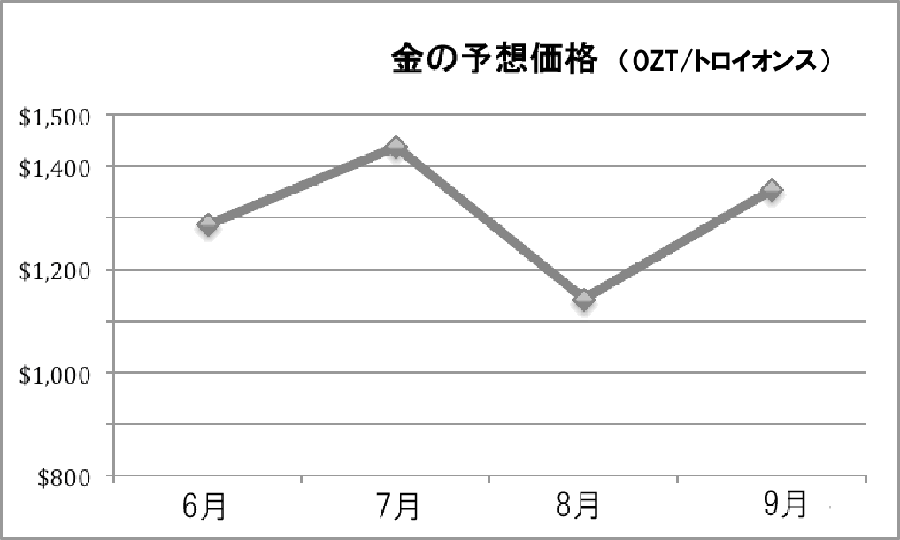
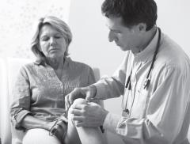
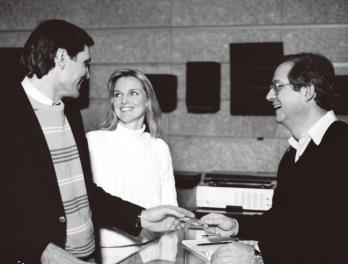
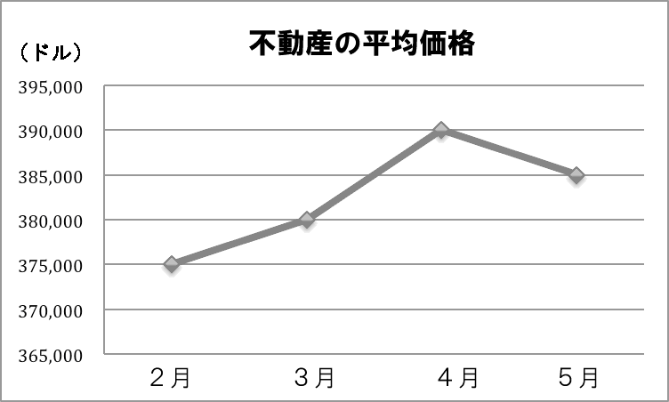

> SUCCESSFUL KEYS TO THE TOEIC®
> LISTENING AND READING TEST 3
> (4) th Edition]

            教授用書

           Mark D. Stafford

              桐原書店

**  **

[[PAGEBREAK]]

【ダウンロード可能な補助教材】

SUCCESSFUL KEYS TO THE TOEIC® LISTENING AND READING TEST 3では，以下のサイトで補助教材をダウンロードしてご利用いただけます。授業の現場に合わせてご活用ください。

http://www.kirihara.co.jp/

1. 音声スクリプトの文字データ

    本冊子に掲載されているスクリプトの文字データを提供しています。音声内容の確認をさせる際などにご利用ください。

2. 実践演習問題

    100題で構成されたTOEIC® LISTENING AND READING TEST形式のテストです。学習の伸び率をはかるためにご利用ください。

    テスト用冊子はPDFファイルで，リスニングセクションの音声はmp3ファイルで提供しています。

3. Worksheet Unit 1-15

    Unit 1～Unit 15のワークシートをPDFファイルで提供しています。

                                       -2-

[[PAGEBREAK]]

Contents

                         Unit 1 Daily Life              4
                         Unit 2 Places                  10
                         Unit 3 People                  16
                         Unit 4 Travel                  21
                         Unit 5 Business                26
                         Unit 6 Office                  32
                         Unit 7 Technology              38
                         Unit 8 Personnel               44
                         Unit 9 Management              49
                         Unit 10 Purchasing             54
                         Unit 11 Finances               60
                         Unit 12 Media                  66
                         Unit 13 Entertainment          71
                         Unit 14 Health                 76
                         Unit 15 Restaurants            83

                         Self-study Quizzes Unit 1-15   90

> リスニングセクションは以下の４カ国出身のネイティブスピーカーの音声で録音されており，それぞれの発言の冒頭に以下
> のように示されています。
> 米 アメリカ 英 イギリス 加 カナダ 豪 オーストラリア
> A_02 はリスニングの音声ファイル名を示しています。

                                             -3-

[[PAGEBREAK]]

Unit 1 Daily Life
 Part 1 Photographs      A_02   (p. 1)

1. (D)
(A) The man is talking to another passenger in the train. 男性は列車の中でほかの乗客と話をしている。
(B) The man is the only passenger in the train. 男性は列車の中でただ 1 人の乗客である。
(C) The man is carrying a large briefcase. 男性は大きな書類かばんを持っている。
(D) The man is listening to something while commuting. 男性は通勤中に何かを聞いている。

2. (D)
(A) A woman is putting away dishes. 1 人の女性が食器を片づけている。
(B) The table is set for a meal. テーブルは食事の用意がされている。
(C) A man is cooking with a pot. 1 人の男性がなべを使って料理をしている。
(D) They’re preparing a meal together. 彼らはいっしょに食事の準備をしている。

 Part 2 Question-Response       A_03     (p. 2)

3. (A)

 Who would like to take me to the store? 誰が私を店に連れていってくれますか。

(A) I’d be happy to. 私が連れていきましょう。
(B) I wouldn’t like any more. 私はもうほしくありません。
(C) It takes about five minutes. 5 分くらいかかります。

4. (B)

 What is the weather going to be like tomorrow? 明日はどんな天気になるでしょうか。

(A) I think I won’t go after all. 結局，私は行かないと思います。
(B) It looks like it will be nice. いい天気になりそうです。
(C) It was cold and rainy outside. 外は寒くて雨でした。

5. (A)

 When can the plumber fix the sink? 配管工はいつ流しを直してくれますか。

(A) He can come on Tuesday. 彼は火曜日に来てくれます。
(B) Today is Wednesday, I think. 今日は水曜日だと思います。
(C) Did you see the news today? 今日はニュースを見ましたか。

6. (B)

 Where should I put these groceries? この食料品はどこに置いたらいいですか。

(A) She got them this morning. 彼女は今朝それらを買いました。
(B) Over there in the cupboard. そこの戸棚の中に。
(C) The supermarket was closed today. 今日はスーパーマーケットが閉まっていました。

7. (C)

 Why did Michelle stay home today? ミシェルはなぜ今日，家にいたのですか。

(A) She didn’t see you. 彼女はあなたに会いませんでした。
(B) She was busy at work. 彼女は仕事で忙しかったのです。
(C) She is sick with the flu. 彼女はインフルエンザで具合が悪いのです。

8. (C)

 My name is Robert. How do you do? 私の名前はロバートです。初めまして。

(A) Robert is in the office. ロバートはオフィスにいます。

**  **
**  **

                                                  -4-

[[PAGEBREAK]]

Unit 1 Daily Life

     (B) I’m a teacher, and you? 私は教師です。あなたは？
     (C) I’m Stacy. Nice to meet you. 私はステイシーです。どうぞよろしく。

 Part 3 Conversations     A_04    (pp. 2-3)

 9. (A) 男性がはじめに，今日までに家賃を払わなければならないと言っている。
10. (C) 男性が女性に銀行に行けるかと尋ねているところから推測できる。
11. (B) 女性がジョンに頼むと言っている。

> 男性： あ，しまった。家賃を今日までに払わなくちゃ。でも今日は忙しすぎてできないんだ。君は銀行
> に行けるかい？
> 女性： 行けたらいのだけど，今日は午後ケイティーに彼女のオフィスで会わなきゃいけないの。ジョン
> に頼めるわよ。明日までは仕事はないと思うわ。
> 男性： あ，そうしてくれる？ 先月は遅れたから，また遅れたくないんだ。
> 女性： 問題ないはずよ。すぐに彼の携帯電話に連絡してみるわね。

M: Oh, no. Today is the last day to pay the rent, but I’m too busy to do it. Can you go to the bank?
W: I wish I could, but I have to go to meet Katie at her office this afternoon. I could ask John. I think
   he is off work until tomorrow.
M: Oh, could you? We were late last month, and I don’t want to be late again.
W: It should be no problem. I’ll try to reach him on his mobile phone right away.

 男性： ああ，しまった。家賃を今日までに払わなくちゃ。でも今日は忙しすぎてできないんだ。君は銀行に行けるかい？
 女性： 行けたらいいのだけど，今日は午後ケイティーに彼女のオフィスで会わなきゃいけないの。ジョンに頼めるわよ。明日までは仕事はないと思うわ。
 男性： ああ，そうしてくれる？ 先月は遅れたから，また遅れたくないんだ。
 女性： 問題ないはずよ。すぐに彼の携帯電話に連絡してみるわね。

____________________________________________________________________________________________

12. (A) 男性が電話をするようにと言っている。
13. (D) 女性はオフィスから来ると言っている。
14. (D) 男性の最後の発言で，女性は自宅が遠いとわかる。

M: If you don’t understand the directions to my house, just call me. I have my mobile phone with me
   at all times.
W: That shouldn’t be necessary. It shouldn’t be difficult to find. I’ll be coming from my office, which is
   really close.
M: At least you’re not coming from your house. That would take a lot of time. Why don’t you invite
   one of your friends to come along with you?

> 男性： 家までの道順がわからなければ，電話して。携帯電話をいつも持ってるので。
> 女性： 必要ないと思うわ。見つけるのは難しくないでしょう。私はオフィスから行くし，オフィスはとて
> も近いのよ。
> 男性： 少なくとも自宅から来るんじゃないしね。それだとかなり時間がかるだろうし。友達を誘って一
> 緒にきたら？

                                                   -5-

[[PAGEBREAK]]

Unit 1 Daily Life
 Part 4 Talks    A_05    (p. 3)

15. (B) 午後は，所によっては曇りで雨は降らないと述べられている。
16. (D) 傘を持っていくようにと勧めている。
17. (C) 雨が降ったりやんだりとあるので，変わりやすい天気だとわかる。

Thank you for tuning in to TTX Radio’s daily forecast, the most accurate weather information in Tokyo.
My name’s Harry Arnett and I am sitting in for the vacationing Howard Green. Our top story tonight is
that June has arrived and so has the annual rainy season. This year’s early summer weather is expected
to be typical and we can expect rain almost every morning. The afternoons will often be partly cloudy and
dry, but the evenings should bring rain again. You’d be wise to carry an umbrella with you and save the
afternoons for your outdoor activities. This year’s wet season should be very typical, unlike last year’s,
and should last until the end of July when we’ll be able to see bright blue skies again.

> 東京でいちばん正確な天気予報，TTX ラジオの天気予報に周波数を合わせていただきありがとうございま
> す。休暇中のハワード・グリーンに代わり，私ハリー・アーネットが務めさせていただきます。今夜のい
> ちばんの話題は，6 月ともに雨の季節が到来したということです。今年の初夏の天候は，ほぼ毎朝雨が降
> るという典型的なものになりそうです。午後は，所によっては曇りで雨は降りませんが，夜にはまた雨と
> なるでしょう。傘を携帯し，屋外での活動は午後にしたほうがいでしょう。今年の雨季は昨年とは異な
> り，非常に典型的なものとなりそうです。再び晴れた青空を見ることのできる 7 月末まで続くでしょう。

> 天候が変わりつありますので，手袋や毛糸の帽子，雪靴を準備しましょう。まるで夏のような日々が多
> かった，異常に長くて暖かい秋が終わり，冬の気候がこへ来て急ぎ足ですぐに訪れるでしょう。北から
> の寒冷前線によって，北西部全域に強い風と冷たい空気がもたらされるでしょう。火曜日は太陽も出て暖
> かく，気温も 73 度まで上がりますが，水曜日には急激に寒くなるでしょう。また，標高 4,0 フィート以
> 上の地域では降雪も予想されます。この寒冷前線はしばらくは居座りそうですから，ひょっとしたら，地
> 元のスキー場もオープンできるかもしれませんし，ウィンタースポーツの季節に向けて比較的早い幕開け
> となりそうです。

18. (C) 第 2 文で秋が終わり，冬が始まると述べられている。
19. (C) Tuesday の天気は sunny and warm と述べられているので，それを言い換えているものが正解。
20. (D) Tuesday の説明部分を注意して聞くと，73 degrees と言っているのがわかる。

Get out your mittens, wool hats and snowshoes because the weather is changing. After an unusually long
and warm fall, with many days looking more like summer, winter weather will finally come our way fast
and hard. A cold front from the north will bring high winds and cold air to the entire northwest region.
While Tuesday will be sunny and warm, and with a high of 73 degrees, it will become cold suddenly on
Wednesday. Snow is even expected to fall at elevations above 4,000 feet. It looks like the cold front will
last a while, so the local ski resorts may open for business and mark a rather early start to the winter
sports season.

 天候が変わりつつありますので，手袋や毛糸の帽子，雪靴を準備しましょう。まるで夏のような日々が多かった，異常に長くて暖かい秋が終わり，冬の気候がここへ来て急ぎ足ですぐに訪れるでしょう。北からの寒冷前線によって，北西部全域に強い風と冷たい空気がもたらされるでしょう。火曜日は太陽も出て暖かく，気温も 73 度まで上がりますが，水曜日には急激に寒くなるでしょう。また，標高 4,000 フィート以上の地域では降雪も予想されます。この寒冷前線はしばらくは居座りそうですから，ひょっとしたら，地元のスキー場もオープンできるかもしれませんし，ウィンタースポーツの季節に向けて比較的早い幕開けとなりそうです。

[[PAGEBREAK]]

Unit 1 Daily Life
Part 5 Incomplete Sentences       (p. 4)

21. (B) 形容詞が必要。

  【訳】ブラウン博士の引退を記念した晩餐会への招待状は間もなく発送されます。

22. (C) guarantee の目的語である名詞が必要。

  【訳】スーパー・フレイト（貨物）              ・サービスでは，どちらのお届先でも 7 日以内の配達を保証します。

23. (B) 空欄に入れて意味的に合致するものは convenience のみ。

  【訳】便宜を図るため（ご利用いただくよう），返信用の封筒を同封しております。

24. (A) effective（形容詞）の次で，空所の次に of があることからも名詞が必要。

  【訳】あらゆる水準での人材の有効活用が，企業を上手に経営する鍵となります。

25. (D) send（動詞）を説明する副詞が必要。

  【訳】著作権のあるプログラムやファイルを電子メールで送信することは，著作権侵害にあたります。

26. (C) in the neighborhood で「近所の」という意味になる。

  【訳】繁華街の住人たちは近所の 2，3 軒の食料品店を利用できます。

Part 6 Text Completion   (p. 5)

27. (D) 最初に感謝の言葉を述べた後なので，この手紙の主旨を説明するのが自然な流れ。
28. (B) 文脈として「調査」という語が一番ふさわしい。
29. (B)「同封されている」という意味なので受け身にする。

                    「残りのもう 1 通」となる the other が正解。

30. (C) 前文の one を受けて，

> モニカ・バーカー様
> ワイドナーストリート 121
> ハンティング，イリノイ州 98998
> バーカー様
> 最新ファッションの傾向に関する我々の研究プロジェクトへのご参加にご承諾いただき，ありがとうござ
> います。本状は，関連するいくつかの詳細についてあなた様にお伝えするものです。あなた様には，8 月
> (22) 日にマクニール・インスティテュートで開催される調査にご参加いただきたく存じます。
> 午前 8 時 30 分までにご来場ください。速やかに作業を開始したく存じます。インスティテュートへは，電
> 車をご利用されるのが最も便利な交通手段です。最寄り駅であるハンティング駅は徒歩でわずか 5 分のと
> ころにあります。ご参考までに，電車の時刻表を同封いたします。
> また，マクニール・インスティテュートとの契約書 2 通を同封いたしましたのでご確認ください。ご一読
> 頂いてからご署名ください。1 通は控えとして保管してください。もう 1 通は住所が記載された添付の封筒
> にてご返信ください。
> 何かご不明な点などございましたら，お気軽に私宛にご連絡ください。電話番号は，523-0345 です。
> 改めて，この度のご参加に感謝いたしますともに，ご一緒にお仕事ができることを楽しみにしておりま
> す。
> 敬具
> マーサ・ベンジャミン
> プロジェクト・ディレクター

                                           -7-

[[PAGEBREAK]]

Unit 1 Daily Life
 Part 7 Single/Multiple Passages   (pp. 6-8)

> https://w.vfinternet.com/campaign
> 驚きの速さ！
> 光ファイバーの速さを手に入れよう。
> 南西部で No.1 のインターネット接続速度なら，音楽や映画をダウンロードしたり，動画や写真を
> 観たり交換したり，あるいはオンライン・ゲームを楽しんだり，その他にもこれまでにない速さ
> と使いやすさであらゆることが可能です。今申し込めば，毎月 37.56 ドルで次のような特典が付
> きます：
> (1) ．設置料無料
> (2) ．1 ヵ月間のアクセス料無料
> (3) ．『ブロードバンド』誌の無料購読
> 今回のオンライン特別サービスのご提供が可能かどうかを調べるには，下の欄にお客様の電話番
> 号を入力し，「送信」をクリックしてください。
> 電話番号：＿
> 送信

31. (C) 第 1 文でインターネットの接続速度について書かれていることから判断できる。
32. (B) 最後の 1 文に Enter your phone number below and click とあることからインターネット上であるとわかる。

  https://www.vfinternet.com/campaign

                                 驚きの速さ！
                            光ファイバーの速さを手に入れよう。

 南西部で No.1 のインターネット接続速度なら，音楽や映画をダウンロードしたり，動画や写真を観たり交換したり，あるいはオンライン・ゲームを楽しんだり，その他にもこれまでにない速さと使いやすさであらゆることが可能です。今申し込めば，毎月 37.56 ドルで次のような特典が付きます：

 1．設置料無料
 2．1 ヵ月間のアクセス料無料
 3．『ブロードバンド』誌の無料購読

 今回のオンライン特別サービスのご提供が可能かどうかを調べるには，下の欄にお客様の電話番号を入力し，「送信」をクリックしてください。

 電話番号：＿＿＿＿＿＿＿＿＿＿＿＿＿＿＿＿＿＿＿＿＿

             送信

                                                                                           ______
______________________________________________________________________________________

33. (D) 冒頭に「新製品」と書いてある。
34. (B) manufacturer（製造業者）は maker（メーカー）と言い換えられる。
35. (B) 広告文中の easy carrying（持ち運びやすさ）に対応している。

> 新製品セール！
> トルネード充電式掃除機を
> たったの 144 ドルでご提供
> 今週末お買い上げいただくと，メーカー推奨価格 180 ドルの 20％引き，
> すなわち 36 ドルお安くなります。
> 特徴：
> ＊コードレスで使用できます
> ＊たったの 1 時間で充電完了
> ＊持ち運びしやすい，軽量デザイン
> ＊5 色からお選びいただけます

**  **

[[PAGEBREAK]]

Unit 1 Daily Life

36. (D) All of our meat and produce is organic.という部分から。
37. (C) Meats の中で一番安いものを選ぶ。

> フレッシュ・ファームズ・マーケット
> 当店の肉や農産物はすべて有機飼育，有機栽培です。
> 化学薬品や保存料は一切使用していません！
> 今週のお買い得品は
> 肉類
> サーロインステーキ(1 パック)＄11.25
> フライ用若鶏 1 羽＄6.39
> 豚腰肉 1 ブロック＄5.32
> 農産物
> 新鮮グリーンブロッコリー 1 ポンド＄2.99
> 菜園栽培のほうれん草 1 束＄2.29
> インゲン，グリーンピースなどすべて通常価格より 15％引き
> 営業時間 午前 7 時－午後 9 時 週 7 日

[[PAGEBREAK]]

Unit 2 Places
 Part 1 Photographs    A_06   (p. 9)

1. (B)
(A) A woman is pushing a shopping cart. 1 人の女性がショッピングカートを押している。
(B) A woman is walking through a park. 1 人の女性が公園の中を歩いている。
(C) Trees are being cut on a walkway. 歩道の木々が切られているところだ。
(D) People are standing behind a woman. 人々が 1 人の女性の後ろに立っている。

2. (D)
(A) They are relaxing in their garden. 彼らは自宅の庭でくつろいでいる。
(B) The garden is being tended by someone. 庭が誰かに手入れをされている。
(C) The door of the house is left open. その家のドアは開いたままである。
(D) There is a garden in front of the house. 家の前には庭がある。

 Part 2 Question-Response     A_07     (p. 10)

3. (C)

 Isn’t your house on Pine Street? あなたの家はパイン通りにあるのではないのですか。

(A) No, I haven’t lived here very long. いいえ，私はここにあまり長くは住んでいません。
(B) That’s right. I moved from Pine Street. そのとおりです。私はパイン通りから引っ越しました。
(C) No, I live on Third Avenue. いいえ，私はサード・アベニューに住んでいます。

4. (A)

 Who asked to go to the clinic? 誰が診療所に行かせてほしいと頼んだのですか。

(A) Susan did. She’s not feeling well. スーザンです。彼女は気分がよくないのです。
(B) OK. I’ll ask him right now. わかりました。今すぐ彼に聞いてみます。
(C) I can drive myself, thanks. 自分で運転できます，ありがとう。

5. (B)

 What can I do at the park? 公園では何ができますか。

(A) You can park on the street. 道に駐車できます。
(B) You can have a picnic. ピクニックができます。
(C) Why don’t you go tomorrow? 明日行ったらどうですか。

6. (C)

 When will we reach Seattle? いつシアトルに着くでしょうか。

(A) It should be a lot of fun. きっとすごく楽しいでしょう。
(B) I can’t reach the bottle. ボトルに手が届きません。
(C) We should get there by eight. 8 時までにはそこに着くはずです。

7. (B)

 Where is the nearest dry cleaner? いちばん近いドライクリーニング店はどこですか。

(A) I’ll try one of the white ones. 私は白いのを 1 つ試してみます。
(B) There’s one in the shopping center. ショッピングセンターの中に 1 軒あります。
(C) It’s already Friday, isn’t it? もう金曜日ですよね。

8. (A)

 Why is the bank closed today? 今日はなぜ銀行が閉まっているのですか。

(A) It’s a national holiday. 国民の祝日です。
(B) It’s close to the park. 公園に近いんです。
(C) You can thank him later. 彼にはあとでお礼を言えばいいですよ。

**  **
**  **

                                                 - 10 -

[[PAGEBREAK]]

Unit 2 Places
 Part 3 Conversations    A_08   (pp. 10-11)

 9. (D) 3 人はロサンゼルスで開催される販売会議に行くための相談をしている。
10. (C) 話の前半では，コンベンションセンターに近いホテルが fully booked（予約でいっぱい）であることが問題となっている。
11. (B) 男性の最後の発言から判断できる。

W1: I’m going to the sales conference at the convention center in Los Angeles next week. Do you both
       want to come with me?
M: Yes, sure. I’d love to. But I heard that hotels in the area are already fully booked.
W2: Yeah. That’s probably true. I checked three websites, but they didn’t show any open rooms. We
       could book a hotel a bit farther away but we’d have to drive a long time.
W1: I see. But then we’d need to get a rental car. Driving in Los Angeles can be really difficult.
M: Hey! I know a really good travel agent that might be able to help us.
W1: Really? I’d prefer not to drive if at all possible.
W2: I agree.
M: Alright. I’ll call her right away.

> 女性１： 来週ロサンゼルスのコンベンションセンターで開かれる販売会議に行くつもりなの。あなたち
> も私と一緒に行かない？
> 男性： うん，もちろん。ぜひそうしたいな。でも，その地域のホテルはもう予約でいっぱいだそうだよ。
> 女性２： え。たぶんそのとおりね。3 つのウェブサイトを調べたけど，空いている部屋はなかったわ。
> ちょっと遠いところのホテルなら予約できるけれど，長時間運転する必要があるわ。
> 女性１： なるほどね。でも，それならレンタカーを借りる必要があるわね。ロサンゼルスで運転するのは
> とても難しいかも。
> 男性： そうだ！ 僕たちの役に立ってくれそうな，とてもい旅行代理店を知っているよ。
> 女性１： 本当？ もしできることなら，運転はしたくないわ。
> 女性２： 同感よ。
> 男性： わかった。彼女にすぐに電話をするよ。

 女性２： ええ。たぶんそのとおりね。3 つのウェブサイトを調べたけど，空いている部屋はなかったわ。
 女性２： 同感よ。

____________________________________________________________________________________________

12. (D) 女性ははじめにデパートで財布をなくしたと言っている。
13. (A) lost-and-found counter という表現を知らないと聞き取れない。
14. (A) 店の遺失物カウンターの人に返してもらったと女性は言っている。

W: I lost my wallet in the department store the other day, but I got it back fairly quickly.
M: No kidding. That was really fortunate. How did you get it back? Did you go to the police?
W: No. I went to the store’s lost-and-found counter and got it from the person there.
M: That was lucky. I lost my keys last month and never got them back.

> 女性：この間デパートで財布をなくしたんだけど，すぐに戻ってきたのよ。
> 男性：本当なのかい。すごく運がよかったね。どうやって取り戻したの？ 警察に行ったの？
> 女性：いえ。店の遺失物カウンターに行ったら，係の人が私に返してくれたのよ。
> 男性：それは運がよかったね。僕は先月に鍵をなくしたけど，戻ってこなかったよ。

 女性：いいえ。店の遺失物カウンターに行ったら，係の人が私に返してくれたのよ。

                                                 - 11 -

[[PAGEBREAK]]

Unit 2 Places
 Part 4 Talks     A_09   (p. 11)

15. (B) 冒頭に Winter Olympic Games（冬季オリンピック）の開催地が決まったと述べられている。
16. (B) 最初と２回目の投票が同数だったので，３回目で決まったとある。
17. (D) 最後の発言から類推できる。

The site of the next Winter Olympic Games was announced Friday by the International Olympic
Committee. Because of the high quality of all the cities that applied, it was a very difficult decision
according to the committee. The first two votes ended in ties, but the third time was successful with a vote
of 24 to 21. The committee decided that Barre Loche, Argentina will host the next Winter Olympics.
Although Barre Loche is little known outside South America, it has excellent facilities for the games, said
the IOC president. Committee members who voted for Barre Loche said that it is about time a developing
country is represented in the Olympics.

> 次の冬季オリンピックの開催予定地が金曜日に国際オリンピック委員会から発表されました。委員会によ
> ると，立候補都市はどこもすばらしく，決定は困難を極めたということです。投票は，2 回にわたって票が
> 割れましたが，3 回めが 24 対 21 で決着しました。そして委員会は，アルゼンチンのバーレ・ローチェが
> 次の冬季オリンピックを開催すると決定しました。IOC 会長が語るには，バーレ・ローチェは南アメリカ
> 以外ではほとんど知られていないが，五輪開催にふさわしいすばらしい施設があるとのことです。バーレ・
> ローチェでの開催に投票した委員たちは，発展途上国がオリンピックの舞台となる時代が来ている，と述
> べました。

18. (D) tear down old factory building（古い工場の建物を取り壊す）                  ，renewing the aging north downtown

    area（古くからある北部の中心街を再興する），create a park（公園を作る）などの語句から判断できる。

19. (C) that’s not all.の文字どおりの意味は「それがすべてではない」                        。ここでは，何かを言い足したいという気持ちを表している。
20. (C) the project’s goals of improving citizens’ quality of life という部分を聞きとろう。citizens’ quality of

    life が，選択肢では people’s lives に置き換えられている。

The local government announced on Friday that a new public development project will start at the
beginning of fall this year. Funding of 2.3 million dollars was approved by the city council on Tuesday. The
project will tear down old factory buildings to make space for the new project of renewing the aging north
downtown area. In place of the old buildings, the project will create a park with lots of trees and
walkways. But that’s not all. There will also be a shopping area where people can buy clothes and enjoy
fine dining in keeping with the project’s goals of improving citizens’ quality of life. When completed,
people will be able to spend their free time in a nice open-air atmosphere as well as do their leisurely
shopping.

> 地方政府の金曜日の発表によると，今年の初秋に新しい公共開発プロジェクトが開始されます。230 万ドル
> の財政支援が，火曜日の市議会で承認されました。このプロジェクトによって，古い工場の建物が取り壊
> され，古くからある北部の中心街を再興するという新しいプロジェクトのための土地を確保します。古い
> 建物のあった場所に多くの木々や歩道を有した公園を作る計画です。しかし，それだけではありません。
> 市民生活の向上を図るというこのプロジェクトの目的に沿って，ショッピングエリアも設けられ，洋服を
> 買ったり，おいしい食事を楽しめたりできるようになります。完成すれば，人々は心地よい屋外の空気の
> 中で自由な時間を過ごしたり，のんびりとショッピングを楽しんだりすることができるでしょう。

                                                   - 12 -

[[PAGEBREAK]]

Unit 2 Places
Part 5 Incomplete Sentences   (p. 12)

21. (D) be assigned to～で「～に割り当てられる」という意味。

  【訳】駐車場は会議出席者に与えられます。

22. (B) advertising strategy で「広告戦略」の意味になる。

  【訳】その企業は新製品用の独創的な広告戦略を考案しました。

23. (A) need の目的語が必要。不定冠詞がついていないので不可算名詞の assistance を選ぶ。

  【訳】さらにお役に立てることがございましたら，人事部までご連絡ください。

24. (D) in the last quarter の部分から過去時制であることがわかる。

  【訳】その広告代理店は，この前の四半期に新製品の販売促進活動を計画しました。

25. (C) ing 形を用いて現在進行形の文にする。(A)では受身の文になってしまい，うまくつながらない。

  【訳】当社では，現在のところ人材募集は行っておりません。

26. (C) in the event of～で「～の場合には」という意味になる。

  【訳】離婚をする場合には，結婚前に所有していたいかなる財産もそれぞれ保持することができます。

Part 6 Text Completion   (p. 13)

27. (D) 下線には out of stock（品切れで）を修飾する副詞しか入らないことからも解答が判断できる。
28. (C) in -ing で「～しているときに」という意味になる。
29. (A) prior to ～「～の前に」は TOEIC で頻出のフレーズ。
30. (B) 商品の注文を受けたがその在庫がないので，まだ発送することはできない。したがって，キャンセルするかどうかを尋ねる文がふさわしい。

> お客様へ
> この度はご不便をおかけしたことをお許しください。商品番号 80819-76 は現在，在庫がございません。お
> 客様のご購入手続きを行う際に，当社のシステム不具合により誤ってこちらの商品のご請求が生じてしま
> いました。商品発送以前にお客様へご請求することは弊社の規定にはございませんので，ご請求額をお客
> 様の口座に入金する是正処置を行いました。現在仕入れ先への本商品の問い合わせを行っておりますので，
> 状況がわかりましたら，お客様にご連絡させていただきます。もし本商品のキャンセルをご希望される場
> 合には，弊社の顧客サービス部までご連絡ください。
> よろしくお願いたします。
> ファッション・ナウ株式会社
> 顧客サービス電話番号：(103) 5-1189

よろしくお願いいたします。

                                        - 13 -

[[PAGEBREAK]]

Unit 2 Places
 Part 7 Single/Multiple Passages   (pp. 14-16)

31. (C) 第 1 文に，より大きくてよりよい施設に移転したという記述がある。
32. (A) 最後の 1 文に以前と同じ電話番号にかければよいと書かれている。

> 移転しました！
> ザ・ウィルソン・デンタル・クリニックが新しいカウンティー・メディカル・センター内にある，
> より大きくてよりよい施設へ移転したことをこのはがきでお知らせします。
> 新住所：
> (498) スイート 23，カウンティー・メディカルセンター
> クリアスプリングス，コロラド州 58746
> すでにご予約済みの患者様は，ご予約の変更は必要ございません。新しいクリニックへおいでく
> ださい。ご予約をお取りになる際は，これまでと同じ電話番号(587-6254)までご連絡ください。

33. (D) 見出しと本文 1 行目から新しいショッピングモールの宣伝であるとわかる。
34. (A) NOT と大文字で書かれている問題では，本文中に書かれていないものを選ぶ。

> 堂々開店！
> メープルツリー・モールがついに完成，
> 今週土曜の午前 9 時に開店します。
> 開店の催しにお越しください!
> ピエロ
> 生演奏
> お子様には風船
> バーゲンセール
> お食事
> などをご用意しています。
> このカードを各店舗でご提示になれば，お買い物がすべて 10％割引になります。
> (宛名部分)
> キャサリン・レイシー様
> エルクハースト・レイン 1546
> セントポール，ミネソタ州 14587

[[PAGEBREAK]]

Unit 2 Places

35. (C) 第 1 段落の内容と第 2 段落に your front door とあるので，個人宅であるとわかる。
36. (D) 選択肢の中で，第 2 段落に書かれている商品を最も適切に表しているものを選ぶ。
37. (D) –[4]–は，直前の文に，製品を使った感想と注文するかどうか知らせてほしいとあるので，ここにその連絡方法の説明が続くと考えられる。

> お会いできず，残念でした！
> 現在，当社のすばらしい製品の見本をご近所にお配りしておりますが，お宅様はお留守でした。
> 玄関前に掃除用品 3 点と台所掃除用品 2 点の見本を置かせていただきましたので，ご覧ください。無料で
> すのでぜひお使いになり，お気に召したかどうか，普段お使いになるためにご注文いただけるかどうか，
> お知らせください。タイディハウス・エンタープライズのウェブサイトにアクセスしていただくか，いつ
> でも私どもにお電話ください。
> 敬具
> タイディハウス・エンタープライズ
> 電話：(763)364-8372
> ウェブアドレス：w.tidyhouse.com

ウェブアドレス：www.tidyhouse.com

                                 - 15 -

[[PAGEBREAK]]

Unit 3 People
Unit 3       People
 Part 1 Photographs    A_10   (p. 17)

1. (A)
(A) She appears to be bored. 彼女は退屈しているようだ。
(B) She is paying attention. 彼女は注意を払っている。
(C) She is preparing to board. 彼女は乗りこむ用意をしている。
(D) She seems rather pleased. 彼女はかなり喜んでいるようだ。

2. (A)
(A) The call has made him happy. その電話で彼はうれしくなっている。
(B) The cold is making him tired. 寒さで彼は疲れてきている。
(C) He doesn’t like to talk on the phone. 彼は電話で話すのが好きではない。
(D) He is not satisfied with something. 彼は何かに満足していない。

 Part 2 Question-Response     A_11      (p. 18)

3. (C)

 How should I pay the attendant? 係員にはどのように支払えばいいでしょうか。

(A) It was a nice catch. ナイスキャッチでした。
(B) I attended a wedding. 私は結婚式に出席しました。
(C) You can only use cash. 現金しか使えません。

4. (A)

 Do all of the patients have insurance? 患者はみんな保険に入っていますか。

(A) Yes. I’ve already checked. ええ。すでに確認済みです。
(B) The doctor will come soon. 医師はすぐ来ます。
(C) I can’t be patient anymore. 私はもう我慢できません。

5. (B)

 When did you call the consultant? コンサルタントにはいつ電話しましたか。

(A) I’ll write to her this evening. 今晩彼女にメール［手紙］を書きます。
(B) I talked to him yesterday. 彼とは昨日話しました。
(C) I called her Ms. Chang. 私は彼女をミス・チャンと呼びました。

6. (C)

 What is your profession? あなたのご職業は？

(A) I love professional sports. 私はプロスポーツが大好きです。
(B) He’s not very professional. 彼はたいした専門家ではない。
(C) I’m an associate professor. 私は准教授です。

7. (A)

 When did you last see your cousin? 最後にいとこに会ったのはいつですか。

(A) Last year, during vacation. 去年，休暇中に。
(B) I was the last to see him. 彼に最後に会ったのは私でした。
(C) It lasted about three hours. それはおよそ 3 時間続きました。

8. (B)

 Where was the athlete born? その運動選手はどこで生まれましたか。

(A) She was very bored. 彼女はとても退屈していた。
(B) In Zurich, Switzerland. スイスのチューリッヒです。
(C) He practices at the stadium. 彼はスタジアムで練習します。

**  **
**  **

                                                  - 16 -

[[PAGEBREAK]]

Unit 3 People
 Part 3 Conversations    A_12   (pp. 18-19)

 9. (B) 女性ははじめに家で勉強しなければならないと言っている。
10. (B) 女性の 2 つ目の発言に出てくる librarian（図書館員，司書）という語は知っておきたい。
11. (B) 女性は 2 つ目の発言で，ガス漏れの修理が必要であったと述べている。

W: We were asked to leave the library yesterday. We’ll have to study at home now.
M: Why? What happened? Were you making too much noise or something?
W: No, we were quiet. The librarian said there was a gas leak that needed to be repaired, so they had
   to close for a few days.
M: That’s kind of bad timing. Final examinations are coming soon.

> 女性： 昨日，私たちは図書館から出て行くように言われたの。これから家で勉強しなければならないわ。
> 男性： どうしてだい？ 何かあったの？ 君たちが騒いでいたとか？
> 女性： いえ，私たちは静かにしていたわ。図書館員は修理が必要なガス漏れがあったと言って，2，3 日
> 間閉鎖しなければならなかったのよ。
> 男性： それはちょっとタイミングが悪いね。期末試験が近づいているというのに。

____________________________________________________________________________________________

12. (C) 女性がはじめの発言で CEO が来ると述べている。
13. (A) 男性の 1 つ目の回答を注意して聞くとわかる。
14. (D) 女性が最後に later today（今日のうち）に会議をすべきだと言っている。

W: We scheduled our sales meeting for tomorrow, but the CEO will visit the company then. We can’t
   do both things on the same day.
M: Oh, that’s right. We should hold the sales meeting the day after tomorrow.
W: That’s too late. We have to have it later today.
M: OK. I’ll contact all of the people who are supposed to attend.

> 女性： 明日は営業会議の予定なんだけど，この日は最高経営責任者が来社される予定なのよ。同じ日に両
> 方をこなすことは不可能だわ。
> 男性： あ，その通りだね。営業会議は明後日にしよう。
> 女性： それじゃ遅すぎるわね。今日のうちにでもやらなきゃ。
> 男性： 了解。参加予定者全員に僕から連絡するよ。

 男性： ああ，その通りだね。営業会議は明後日にしよう。

                                                - 17 -

[[PAGEBREAK]]

Unit 3 People
 Part 4 Talks     A_13   (p. 19)

15. (C) account manager(s)というキーワードを聞き逃さないようにする。
16. (B) branch manager と話すための番号は述べられていないため，最終文で言われているとおり，stay on

    the line が正解。

17. (A) 冒頭で a leading corporation と言われている。

Thank you for calling Matsumoto Enterprises, a leading corporation in educational materials. This is an
automated phone service, which will redirect your call to the desired office. Your phone call with a
company employee may be recorded for quality control purposes. Please use the keypad to enter your
choice of options. If you would like to speak to one of our sales representatives, please enter 1 on your
telephone. If you would like to talk to a designer, enter 2. If you would like to consult one of our account
managers, enter 3. If you are interested in submitting a proposal for a textbook, enter 4. For other
matters, please stay on the line and a telephone operator will speak to you very shortly.

> 教材分野のトップ企業，マツモトエンタープライゼズにお電話いただき，ありがとうございます。こちら
> は自動電話サービスです。ご希望の部署におつなぎいたします。お客様と弊社スタッフとの通話の内容は，
> 品質管理の目的において録音させていただく可能性がございます。キーパッドを使い，ご希望の選択をし
> てください。営業担当者にご用の方は，1 を押してください。デザイナーにご用の方は 2 を押してください。
> 法人営業担当者にご相談がある方は 3 を押してください。教材の企画のご提案にご興味のある方は 4 を押
> してください。それ以外に関しては，そのまお待ちください。電話オペレーターが直ちに応対いたしま
> す。

18. (D) はじめに law offices と述べられていることから lawyers であると判断できる。
19. (D) 土・日・月の 3 日間が休みと述べられている。
20. (D) 電話できるのは通常の営業時間外で緊急の用件がある場合。選択肢の中で営業時間外なのは(D)の午後

    1 時。

You have reached the law offices of Parker and Simon, a legal group established in 1985. Thank you very
much for your phone call. Our offices will be closed from Saturday to Monday to observe the national
holiday. We will reopen for our regular hours on Tuesday. Regular hours of operation are from 8:00 am to
5:00 pm. If you have a legal emergency outside our office hours, you may call either partner. Mr. Parker
can be reached at 628-8947. Mr. Simon may be contacted at 628-4587. If we are unable to answer at that
time, please leave a message and we will return your call shortly. Since our clients are important to us, we
will do almost anything to help you.

> こちらは，1985 年に設立された法律グループのパーカー・アンド・サイモン法律事務所です。この度はお
> 電話ありがとうございます。当事務所は土曜日から月曜日まで祝日のためお休みします。火曜日からは通
> 常営業いたします。通常の営業時間は，午前 8 時から午後 5 時まです。営業時間外に法律に関する緊急
> のご用件がおありの場合は，いずれかの弁護士に電話をしていただいて構いません。パーカー弁護士の電
> 話番号は 628-8947，サイモン弁護士の電話番号は 628-4587 です。もし，すぐに出ない場合は，メッセー
> ジを残していただければ，すぐにこちらからかけ直します。私たちにとってクライアントの皆さまは大切
> な存在なので，できる限り皆さまをお手伝いさせていただきます。

| 通常の業務時間 |  |
| --- | --- |
| 月曜－金曜 | 午前8時～午後5時 |
| 土曜 | 午前9時半～正午 |
| 日曜 | 休業 |

                                                   - 18 -

[[PAGEBREAK]]

Unit 3 People
Part 5 Incomplete Sentences   (p. 20)

21. (A) while 以下の節の主語が必要なので，主格の they を用いる。

  【訳】店員は就業中に身分証明バッジを身につけることが義務づけられています。

22. (B) 助動詞の次なので，動詞の原形が必要。

  【訳】来月始める新たな販売キャンペーンは，新規の顧客を引きつけるはずです。

23. (C) 動詞（retire）を説明する副詞として，文の意味から finally がふさわしい。

  【訳】長年にわたる熱心な教師生活を終え，私たちの先生はついに学期末をもって退職します。

24. (A) plan の代名詞で，because 以下の節の主語になる it が正解。

  【訳】新たな広告プランは，実行が不可能と思われる漠然としたアイデアばかり含まれていたので，経営者に却下されました。

25. (D)〈must + 受け身〉    「～されなければならない」の形にする。submitted が正解。

  【訳】すべてのタイムシートは木曜日の 5 時までに提出されていなくてはなりません。

26. (D) be aware that～で「～をわかっている」という意味。be aware of の場合は名詞（句）が続く。

  【訳】航空会社では手荷物の重量を量り，超過したお客様の搭乗はご遠慮願いますのでご留意ください。

Part 6 Text Completion   (p. 21)

27. (B)「部門」という意味の語を選ぶ。
28. (C) be responsible for ～で「～に責任がある」の意味。
29. (D)「経験」という意味の語が空欄には一番ふさわしいと考えられる。
30. (A) 消去法で正解を導ける。(B)(C)(D)はいずれも書かれている内容に合致しない。

> 人材募集
> 当社のマーケティング部門では，高い能力を有する最高管理職を募集中です。独創的で細部にまで気配り
> ができ，優秀な文章力，会話力，販売技術を有する人材を求めます。社長直属のポジションで，広報活動，
> 販売促進，特別行事，資金調達を含むプロジェクトの開発および管理運営の責任を負います。管理運営の
> みならず販売にも熱心であること。マーケティングおよび広告宣伝業務における 10 年以上の管理の経験が
> あることが望ましい。DTP の熟練技術必須。ワープロ・ソフトおよび出版用ソフトウェアの知識があれば
> 望ましい。大卒に限る。

                                        - 19 -

[[PAGEBREAK]]

Unit 3 People
 Part 7 Single/Multiple Passages   (pp. 22-24)

31. (A) 手紙の目的は本文の冒頭に述べられていることが多い。ここでは in response to your request for

    information「情報の求めに応じて」とあるので，情報を提供することだとわかる。

32. (C) 手紙の本文の第 1 文に our university という表現がある。
33. (C) response は，ここでは相手に対する「返事」という意味で使われている。それを言い換えた answer

    が正解。

34. (B) 手紙の最後から 2 文目に，近い将来の人員についての予測が述べられている。

> ヨハン・ラビノウィッツ様
> NSO グループ 研究主任
> ウェストパークアベニュー 85
> ニューヨーク，ニューヨーク州 14649-4875
> ラビノウィッツ様
> 当大学における職員の割合についての情報をご希望という，あなた様のお求めにお応えいたします。職員
> で最も多いのが事務員，次に多くを占めるのは教授であることをご承知おきください。また，老朽化が進
> むキャンパスの維持管理の必要性が増してくるため，近い将来は管理人の割合を 5％まで引き上げる予定で
> す。この情報があなた様の調査のお役に立てば幸いです。
> 敬具
> ニコラス・プライド

35. (A) management staff（経営スタッフ）は，研修中の社員にとっては supervisors（上司）にあたる。
36. (C) 1 時から 5 時までの研修内容と合致するものを選ぶ。
37. (B) 休暇についての説明は，実務の説明に含まれると推測できる。

> 研修社員日程表 ― 春期
> (4) 月 2 日(火)
> 基礎オリエンテーション
> (8) :30 － 9:30 経営スタッフとの「親睦」朝食会
> (9) :30 － 10:30 企業方針と実務についての説明
> (10) :30 － 10:45 休憩
> (10) :45 － 12:00 年金・保険等の重要書類への記入と署名
> (12) :00 － 1:00 昼食
> (1) :00 － 5:00 各研修生の部署に分かれての研修

[[PAGEBREAK]]

Unit 4 Travel
Unit 4       Travel
 Part 1 Photographs      A_14   (p. 25)

1. (B)
(A) She’s sending a package. 彼女は小包を送ろうとしている。
(B) She’s sitting next to a suitcase. 彼女はスーツケースの横に座っている。
(C) She’s opening a drawer. 彼女は引き出しを開けている。
(D) She’s trying on a suit. 彼女はスーツを試着している。

2. (C)
(A) One of the men is carrying a piece of luggage. 男性の 1 人は荷物を運んでいる。
(B) One of the men is trying to open the gates. 男性の 1 人は門を開けようとしている。
(C) They’re standing at a security section. 彼らは保安区域に立っている。
(D) They’re trying to fix an alarm. 彼らは警報装置を修理している。

 Part 2 Question-Response       A_15      (p. 26)

3. (A)

 Why did you travel to Wellington? あなたはなぜウェリントンに旅をしたのですか。

(A) I had some business to do. 仕事があったんです。
(B) I went by train and airplane. 電車と飛行機で行きました。
(C) I didn’t really want to go anywhere. ほんとうはどこにも行きたくなかったんです。

4. (B)

 How is your travel agent? あなたの旅行代理店はどうですか。

(A) No, I’m an insurance agent. いいえ，私は保険代理店の者です。
(B) Really helpful. I’m satisfied. とても役に立ちます。満足しています。
(C) I’m going to go by night ferry. 私は夜行フェリーで行くつもりです。

5. (C)

 When are you scheduled to depart? いつ出発する予定ですか。

(A) I put the schedule on your desk. あなたの机の上に予定表を置きました。
(B) We should arrive sometime in the morning. 私たちは午前中のいつか着くはずです。
(C) On Tuesday at six in the evening. 火曜の夕方 6 時です。

6. (A)

 Who took the itinerary from my desk? 私の机から旅程表を持っていったのは誰ですか。

(A) I did. It’s over there now. 私です。あそこにありますよ。
(B) I moved your desk over there. 私があなたの机をあそこへ動かしました。
(C) Ms. Simmons wrote the schedule. シモンズさんが予定表を書きました。

7. (C)

 What are you going to do in Cabo San Lucas? カボ・サン・ルーカスで何をするつもりですか。

(A) She’s a professional translator and guide. 彼女はプロの通訳兼ガイドです。
(B) We should be there about five days. 私たちは 5 日間ほどそこに滞在するはずです。
(C) Do some fishing and just lie on the beach. 釣りをしたり，ビーチにただ寝そべったりします。

8. (B)

 When did you take such a long journey? いつそんな長い旅行をしたんですか。

(A) It took a long time to finish my journal. 日誌を書き終えるのに長い時間がかかりました。
(B) During college, when I had more free time. 大学時代，もっと自由な時間があったときです。
(C) I’d like to go with you, if you don’t mind. よろしければ，あなたに同行させていただきたい。

**  **
**  **

                                                    - 21 -

[[PAGEBREAK]]

Unit 4 Travel
 Part 3 Conversations   A_16   (pp. 26-27)

 9. (C) 男性が旅行先についての相談をしていることから旅行業者であると推測できる。
10. (D) 1 つ目の発言で，ネパールでは自分の身の安全が心配だと言っている。
11. (C) That は直前の女性の提案（東南アジア旅行）を指し，男性はそれに興味を示している。

W: Hello. How are you today? Now, where were you thinking about traveling?
M: I was thinking about going to Nepal, but I’m concerned about my safety right now. So, I’m now
   thinking about going to Mongolia.
W: Wow, that’s really adventurous. But, this is the really cold season in Mongolia. Why don’t you
   think about going to South East Asia?
M: That might be nice, too. I’ve always wanted to go to Thailand and Vietnam.

> 女性： いらっしゃいませ。今日はご機嫌いかがですか？ さて，旅行先はどこをお考えでしたか。
> 男性： ネパールに行こうと思っていたんですけど，今は自分の身の安全が心配なんです。そこで，今はモ
> ンゴルに行こうと思っているんです。
> 女性： まあ，すごく冒険的ですね。でも，この季節はモンゴルはすごく寒いですよ。東南アジアへ行くこ
> とをお考えになってはいかがでしょうか。
> 男性： それもいかもしれませんね。タイとベトナムには行ってみたいといつも思っていました。

 男性： それもいいかもしれませんね。タイとベトナムには行ってみたいといつも思っていました。

____________________________________________________________________________________________

12. (B) 男性が最初の発言で，pay by the 25th，つまり「25 日までに支払いをするように」と言っている。
13. (C) 男性が 1 つ目の発言の最後に，チケットは家に送られると言っている。
14. (A) 男性が 2 つ目の発言の最後に，電話でのカード支払いが可能と言っている。

M: OK. Your reservations are complete. Please pay by the 25th either by cash, check, or charge and
   your tickets will be sent to your home by certified mail.
W: Thank you. Where can I pay?
M: You can come into the office, send in a check, or pay by credit card over the phone.
W: I think I’ll send in a check at the end of the week after I get paid.

> 男性： はい。これで予約は完了です。25 日までに現金か小切手かカードでお支払いくださいましたら，チ
> ケットを配達証明郵便でご自宅にお送りします。
> 女性： ありがとう。支払いはどこですればいですか。
> 男性： オフィスに来ていただくか，小切手なら郵送で，クレジットカードの場合はお電話ください。
> 女性： 給料が入ったら，週の終わりに小切手を郵送します。

                                               - 22 -

[[PAGEBREAK]]

Unit 4 Travel
 Part 4 Talks     A_17   (p. 27)

15. (B) 冒頭に述べられているとおり気象庁が初めに警報を出している。
16. (C) after midnight Tuesday（火曜深夜過ぎ）と述べられているので，選択肢の中では Early Wednesday

    が合う。

17. (B) 低い地域の住民は required to evacuate（避難するように）と述べられている。

Your attention, please. This is a public safety announcement. The government’s meteorological agency is
issuing a storm warning for all southern counties of the state. Residents of these areas are strongly urged
to heed this warning. A strong summer storm is expected to hit the state, beginning shortly after
midnight Tuesday. The slow-moving storm may last up to two days and will bring heavy rains. Low-lying
areas may see flooding, so people living in such areas are required to evacuate. If you experience an
emergency, please call 911 and services will be dispatched to your location. If you need help in evacuating,
please call your local police or fire department. We apologize for the interruption of this broadcast. We
now return to our regularly scheduled programming.

> 皆様に申し上げます。これは公共安全に関する放送です。政府気象庁は州南部の全郡に対して嵐の警報を
> 出しています。該当地域にお住まいの皆様には，この警報に十分注意を払うようにしてください。火曜の
> 深夜を過ぎると間もなく強い夏の嵐が州を襲う見込みです。動きが遅いため嵐は最長で 2 日間続き，大量
> の雨を降らせるでしょう。海抜の低い地域は洪水に見舞われるかもしれませんので，そうした地域の住民
> は避難するよう求められています。緊急の場合は，911 にお電話いただければその地域に支援スタッフを派
> 遣します。避難の際に援助の必要な場合は，お近くの警察署か消防署にご連絡ください。放送を途中で中
> 断してしまい恐縮ですが，これより通常予定されている番組に戻ります。

18. (A) 旅行の案内であることを考慮する。
19. (C) 中盤の from November to April and are usually cool and rather wet を言い換えている。
20. (C) 5 月から 10 月までがお勧めであると述べられている。

The southeast Asia region is famous for its natural beauty and delicious food. Vietnam is one such
location in the area. However, the weather in the north can be quite different from the south and can be
rather unpredictable. The northern Vietnam area generally has the two seasons of winter and summer.
Winters generally last from November to April and are usually cool and rather wet. February and March
are especially famous for crachin, or “rain dust” that falls in the region. Travel is recommended during the
warmer and drier season between May and October. If you do decide to travel during the rainy season, an
umbrella will come in handy. Otherwise, whenever you visit this beautiful location, be prepared for
changeable weather by bringing a light sweater wherever you go.

> 東南アジア地域は，その自然美とおいしい料理が有名です。ベトナムはこの地域のそうした場所のひとつ
> です。しかしながら，北部における天候は南部とはだいぶ違うこともあり，天候がかなり予測しづらいこ
> ともあります。北ベトナム地域には一般的に冬と夏の 2 つの季節があります。冬は通常 11 月から 4 月まで
> で，たいてい涼しく，どちらかというと雨が降りがちです。2 月，3 月は特にクラチン，つまりその地域に
> 降る「雨埃」で有名です。旅行するなら 5 月から 10 月の間の，暖かく雨の少ない時期がお勧めです。雨期
> に旅行をするのであれば，傘を持参すると重宝するでしょう。そのほかには，この美しい場所を訪れると
> きはいつでも，変わりやすい天気に備えてどこへ行くにも薄手のセーターを用意しましょう。

                                                   - 23 -

[[PAGEBREAK]]

Unit 4 Travel
Part 5 Incomplete Sentences   (p. 28)

21. (D) 文の動詞が必要になる。

  【訳】今年，その企業は設立 25 周年を祝います。

22. (B) 動詞が 4 つ並んでいるので，文脈から判断する。declare は「（税関で）申告する」という意味。

  【訳】乗客は到着時に税関ですべての所有物を申告しなければなりません。

23. (B) be responsible for～で「～の責任がある」という意味。

  【訳】委員会のメンバーたちは，協会の活動計画について責任があります。

24. (C) 主語（複数）に合い，かつ that 以下の時制に合う動詞を選ぶ。

  【訳】飛行機の乗客たちは，ターミナルでの荷物の引き渡しが遅すぎると不平をもらしました。

25. (A)「～のせいで」という意味の前置詞句が正解。because は接続詞なので使えない。

  【訳】国内売上が大幅に増加したおかげで，第 1 四半期の収益は現在の予測以上に伸びるでしょう。

26. (A) minimum という形容詞の次なので名詞 requirement が正解。

  【訳】ワープロの習熟は，この事務職の最低必要条件です。

Part 6 Text Completion   (p. 29)

27. (C) institute は「

                   （制度など）を設ける」という他動詞なので，will のあとに入れるには進行形のこの形が正しいと判断できる。

28. (B) 空欄の後ろに copy machine と単数名詞が続いていることから判断する。
29. (C) 使用済み用紙については前に述べられており，ボトルと缶についてはこの後で述べられている。(D)

    はまったく文脈に合わない。

30. (D) comply with ～で「～に従う」という意味のフレーズ。文脈から判断する。

> 社内回覧
> 宛名：全従業員
> 差出人：土地建物管理部門責任者，マーク・ラビーン
> 日付：6 月 12 日
> 件名：新たなリサイクル規定
> 来週よりリサイクル規定を実施します。使用済み用紙のリサイクル用回収ボックスを，各コピー機設置場
> 所およびオフィス内に設置します。その場所をよく覚えておいてください。加えて，ボトル専用と缶専用
> の個別ゴミ箱も各台所，すべての入口，自販機近辺に設置します。当社が市の条例を遵守する責任を果た
> すためにご協力を感謝します。

                                        - 24 -

[[PAGEBREAK]]

Unit 4 Travel
 Part 7 Single/Multiple Passages                      (pp. 30-32)

31. (B) vacation destinations, travelers などの語から観光客向けのものであるとわかる。
32. (C) 旅行者でごった返している場所とは違うということや，島のほぼ全体を独占できるということから(C)

    と考えられる。

33. (B) 最後の 1 文に free booklet という記述がある。
34. (A) 内容から観光ガイドブックに載っているものであると判断できる。
35. (D) lodging は「宿泊施設」という意味。accommodation なども同時に覚えておきたい。

> カリブ海の宝石，ハンドラへお越しください
> ハンドラは，カリブ海に浮かぶ島のリゾート地の中でも最小ですが，最も美しく人気の高い場所
> でもあります。ハンドラにお出でになれば，ほとんど島全体を独占できるのですから，一般の旅
> 行者でごった返している普通の場所に出かける必要はありません。お一人でも，ご家族連れでも，
> 何マイルにも及ぶ閑静なビーチをあなたに，またあなたの愛する方に満喫していただけます。し
> かし，この隔絶は決して何もすることがないという意味ではありません。もしご希望であれば，
> 十分過ぎるほど数々のアクティビティや娯楽をご用意しておりますので，あなたを飽きさせるこ
> とはありません。まずはこの無料小冊子をご参照の上，次回のハンドラでの休暇プランの作成に
> ご活用ください。

> ビジター向け重要情報
> 一般情報 . . . . . . . . . . . . . . . . . . . . . . . . . . . . . . . . 27
> 習慣 . . . . . . . . . . . . . . . . . . . . . . . . . . . . . . . . . . . . 32
> 食べ物 . . . . . . . . . . . . . . . . . . . . . . . . . . . . . . . . . . 35
> コミュニケーション . . . . . . . . . . . . . . . . . . . . . . . 46
> 通貨 . . . . . . . . . . . . . . . . . . . . . . . . . . . . . . . . . . . . 51
> ビザ情報 . . . . . . . . . . . . . . . . . . . . . . . . . . . . . . . . 53
> 健康 . . . . . . . . . . . . . . . . . . . . . . . . . . . . . . . . . . . 55
> スペシャル・アクティビティ . . . . . . . . . . . . . . . 58
> 娯楽 . . . . . . . . . . . . . . . . . . . . . . . . . . . . . . . . . . . 61
> 宿泊 . . . . . . . . . . . . . . . . . . . . .. . . . . . . . . . . . . . . 69
> 空港で . . . . . . . . . . . . . . . . . . . . . . . . . . . . . . . . . 73

36. (C) 8 月 14 日以前に購入できる旅行プランの中から一番値段が安いものを Date と Prices の欄から選ぶ。
37. (C) ただし書きによると，5 人以上のグループには 10%の割引があるので 3,326 ドルよりも安くなる。

> エース・トラベル・サンフランシスコ
> 夏のパッケージ旅行
> 行き先 日程 価格
> フランスのバーガンディ地方 6 月 6－24 日 2,560 ドル
> モンゴルのナーダム祭 8 月 14－20 日 1,178 ドル 50 セント
> 東南アジアのアドベンチャー 6 月 1－13 日 1,265 ドル
> アフリカのサファリ 8 月 5－15 日 3,326 ドル
> *5 人以上のグループには 10％の割引が適用されます。
> **価格にはすべて売上税が含まれていますが，燃料の追加料金は含まれておりません。

**  **

[[PAGEBREAK]]

Unit 5 Business

Unit 5       Business
 Part 1 Photographs     A_18   (p. 33)

1. (A)
(A) They are checking a document. 彼らは書類をチェックしている。
(B) They are documenting a sale. 彼らは販売を記録している。
(C) They are writing an invoice. 彼らは送り状を書いている。
(D) They are selling some goods. 彼らは商品を売っている。

2. (B)
(A) She is talking into the microphone. 彼女はマイクに向かって話している。
(B) She is making a presentation. 彼女はプレゼンテーションをしている。
(C) They are presenting their goods. 彼らは商品を紹介している。
(D) They are meeting over lunch. 彼らは昼食をとりながら会議をしている。

 Part 2 Question-Response      A_19      (p. 34)

3. (C)

 Where will the conference be held? 会議はどこで開かれますか。

(A) I will hold a meeting in the morning. 私は朝，会議を開くつもりです。
(B) About 500 people will attend. 約 500 人が出席します。
(C) In Las Vegas at the Royal Princess Hotel. ラスベガスのロイヤルプリンセスホテルで。

4. (A)

 Why did you change your stockbroker? あなたはどうして株式仲買人を変えたのですか。

(A) The old one charged too much. 以前の人は手数料が高すぎたんですよ。
(B) Our stocks are almost empty. わが社の在庫はほぼ空です。
(C) Sorry, I don’t have any change. すみません。つり銭がないんです。

5. (B)

 When are we going to meet? いつ会いましょうか。

(A) In the conference room. 会議室で。
(B) How about tomorrow at five? 明日の 5 時はどうですか。
(C) Meat sounds great to me. 肉とはすばらしい。

6. (B)

 Could I get the telephone number for Ace Electronics? エース・エレクトロニクスの電話番号を教えてもらえますか。

(A) The numbers seem too low. 数字がとても低いようです。
(B) Sorry, I don’t have their number. すみません，番号を知らないんです。
(C) They have a total of eight shops. 彼らは合計で 8 軒の店を持っています。

7. (C)

 Who is the new bookkeeper? 新しい簿記係は誰ですか。

(A) She is the new librarian. 彼女は新しい司書です。
(B) I’m tired, but I will keep reading. 疲れたけれど，私は本を読み続けます。
(C) Michael Lee, he started yesterday. マイケル・リーが昨日就任しました。

8. (A)

 What is your best product? 貴社のいちばんいい製品は何ですか。

(A) It is definitely our wool sweater. それは絶対にウールセーターです。
(B) It’s produced by Jasper Enterprises. それはジャスパー・エンタープライゼズによって作られています。
(C) New Zealand is a big wool producer. ニュージーランドは一大羊毛生産国です。

**  **
**  **

                                                   - 26 -

[[PAGEBREAK]]

Unit 5 Business

 Part 3 Conversations     A_20    (pp. 34-35)

 9. (A) 男性がニューヨークと言っているところから推測できる。
10. (B) 男性のはじめの発言部分を注意して聞く。
11. (C) 女性は 2 つ目の発言で，彼女の母親はアメリカに来る前に 10 年間英語を勉強したと言っている。

W: My mother started the business when she emigrated from Poland twelve years ago.
M: New York is a great place for business. Did she have trouble with the language?
W: No, she had studied English for ten years before coming to America.
M: Sounds like she has had a hard life, but she worked hard and eventually found success.

> 女性：母は 12 年前にポーランドから移住したときに会社を始めたんです。
> 男性：ニューヨークは商売をするのにはすばらしいところだ。言葉で困ったことはあったのかな。
> 女性：いえ，彼女はアメリカに来る前に 10 年間英語を勉強しましたから。
> 男性：厳しい人生を送ってきたようだけど，一生懸命働いて最終的には成功を手に入れたんだね。

 女性：いいえ，彼女はアメリカに来る前に 10 年間英語を勉強しましたから。

____________________________________________________________________________________________

12. (A) 男性の最初の発言にある the planning of the graduation party の graduation（卒業）という単語がポイント。
13. (B) 女性は 3 つ目の発言で，テーブルクロスがあと 5 枚必要だと言っている。
14. (A) 男性の最後の発言に注意。supplier（業者）に電話すると言っている。

W: Hey Daniel. Can I talk to you for a moment?
M: Sure, Sharon. What’s going on?
W: Well, the planning of the graduation party is going well. But I noticed something wrong with the
   original invoice.
M: Oh, yeah? I checked it twice and found nothing wrong with it. What seems to be the problem?
W: Um… The amounts for the balloons, flower arrangements, and banners are all correct. But we
   need five more of the tablecloths.
M: Oh, I see. Sorry. I can’t believe I missed that. It’s kind of late now, so I’ll call our supplier first
   thing in the morning.

| 注文書 お客様：シャロンのパーティー計画 |  |
| --- | --- |
| 品名 | 数量 |
| 横断幕 | 1 |
| 飾りつけの花 | 26 |
| テーブルクロス | 21 |
| 風船 | 128 |
     風船                 128

                                                  - 27 -

[[PAGEBREAK]]

Unit 5 Business
 Part 4 Talks     A_21    (p. 35)

15. (A) 冒頭で Thank you for your call.（お電話ありがとうございます）と言っている。
16. (B) 第 5 文に commodity contracts（商品取引）と述べられている。
17. (B) stock trading については 3 文目で述べられている。平日の午前 9 時 30 分から午後 4 時の時間内のものを選ぶ。

Thank you for your call. Ace Securities would like to remind you of our business hours. Stock trading may
take place from 9:30 a.m. to 4:00 p.m. on normal business days. Bond trading is available between 10:00
a.m. and 3:00 p.m. Commodity contracts may be bought and sold only between the hours of 11:00 a.m. and
3:00 p.m. All trades will be settled by 5:00 p.m. on the same day. In addition, all trades will be reflected in
customer accounts at 5:00 p.m. The company is closed every weekend and on national holidays. You may
access our 24-hour customer service department for general business matters at any time. A
representative will be happy to assist you in all of your trading needs. If you wish to open a new account,
you may do so either via our website, mail or over the phone.

> お電話ありがとうございます。エース証券から営業時間のご案内です。株取引は，通常営業日の午前 9 時
> (30) 分から午後 4 時まで行います。債券取引は午前 10 時から午後 3 時までご利用いただけます。商品取引
> の売買契約は午前 11 時から午後 3 時までに限られます。すべての取引はその日の午後 5 時までの決算とな
> ります。加えて，午後 5 時の時点ですべての取引が顧客口座に反映されます。週末および祝日は休業です。
> 通常業務に関するご質問等は，当社の 24 時間営業の顧客窓口部門までいつでもご相談ください。代理人が
> お客様の取引に関するあらゆるご要望を喜んでお手伝いさせていただきます。ご新規の口座開設をご要望
> の際は，当社のウェブサイト，あるいは郵送やお電話でもお手続き可能です。

18. (D) 放送後半の total profit margin（総利益率）というキーワードを聞き逃さないようにしよう。
19. (D) 株主総会で会社全体の売り上げの話をするのは，選択肢の中では社長であると考えられる。
20. (A) 売り上げと収益が上がっているという内容から考える。

Good afternoon everyone. It’s hard to believe, but it’s already time for our annual shareholders meeting.
Thank you very much for joining us today. I sincerely hope that you will benefit from this meeting and by
being a shareholder of our corporation. First of all, I am proud to announce a record profit for the past
fiscal year. The business has enjoyed an average profit of 3%, but the past year has been especially good
for us. The reasons for such a change in fortune are rather simple, yet satisfying. Mainly, our operating
costs were down 5% while our sales increased 12%. Because of these two favorable occurrences, our total
profit margin was 23%, a gain of 14% over the year before. Now that I have given you the good big news, I
would like to present the details of this report.

> 皆様，こんにちは。もう弊社の年次株主総会の時期がやって来ましたことが信じられません。本日はお集
> りいただき，誠にありがとうございます。皆様が，この総会を通じて，また弊社の株主でおられることに
> よって利益を上げられることを心より望んでおります。第一に，前会計年度，わが社が記録的利益を上げ
> たことをご報告でき，うれしいかぎりです。事業は平均 3％の利益を上げておりますが，昨年はとりわけ良
> 好でありました。財務におけるこうした変化の原因はかなり単純なものではありますが，納得のいくもの
> であります。主に営業経費は 5％減少し，一方売り上げが 12％増加しました。この 2 つの好ましいできご
> とのおかげで，わが社の総利益率は 23％，前年度比 14％増となりました。うれしいビッグニュースをお知
> らせできましたので，これよりこの報告書の詳細を発表させていただきたいと思います。

                                                    - 28 -

[[PAGEBREAK]]

Unit 5 Business
Part 5 Incomplete Sentences   (p. 36)

21. (A) the のあと，of の前に置かれるので，名詞が空欄にはふさわしい。

  【訳】この道具は，物の厚みを計るために使われます。

22. (D) 文末に last month があるので過去形が正解。

  【訳】多くの機関の代表者たちが先月の年次会議に出席しました。

23. (D) 全体の意味から「延期する」put off が正解。

  【訳】役員会は，来月早々まで会議を延期することを決定しました。

24. (C) 次の動詞 increase を説明する副詞が必要。

  【訳】その企業は音質を著しく向上させる新しいスピーカーを開発しました。

25. (A) be 動詞と副詞のあとなので，            「目に見える」という意味の形容詞が正解。

  【訳】信号機はどの方向に進む人や車両にもはっきり見えるようでなければなりません。

26. (B) do not[don’t] hesitate to～ は「遠慮せずに～する」という定型表現。

  【訳】請求書に関して何かご不明な点がございましたら，どうぞお気軽にご連絡ください。

Part 6 Text Completion   (p. 37)

27. (C) inform は用法をチェックしておくべき語。be informed that（～をお知らせします）の形で使われることも多い。
28. (A) 文脈から「～によると」という意味のフレーズがふさわしいと考えられる。
29. (D) 追加料金の規定に言及したあとなので，それを確認する文がふさわしい。
30. (B) 空欄には名詞が入ることと文脈を考えると shipment しか正しいものはない。

> 差出人：スコット・ギャラガー
> 宛先：ヘルムート・シュトルテンベルク
> 日付：8 月 26 日
> 件名：破損製品
> 本日，空輸にて予定通りにコンピューター機器が手元に届きましたが，輸送中にコンピュータ・モニター
> のうち 2 つが破損していたことをお知らせいたします。御社の規定によると，輸送中に生じた製品の破損
> についてはメーカー側が一切の追加金なしですべての交換に応じるとあります。したがって，私どもは追
> 加料金は発生しないものと考えております。迅速なる交換商品の発送を進めてくださるようお願いたし
> ます。御社のご担当者様からのご指示を受け取り次第，私どもからは破損製品を返品いたします。迅速な
> 対応に感謝いたします。
> 敬具
> スコット・ギャラガー

Part 7 Single/Multiple Passages    (pp. 38-40)

31. (D) フロレス郡という地名が共通している。
32. (C) contribute to（～に貢献する）は help with（～の支援をする）に置き換えられる。
33. (B) E メールで述べられているのは Education for All という慈善団体。1 つ目のパッセージからその活動内容を確認すればよい。
34. (C) 社員からの寄付が 16,000 ドルで，会社もそれと同額を寄付すると E メールに書いてあるので 16,000

    ドルとなる。

35. (A) 3 つ目の文書の最後にある was a big success は went very well と言い換えられる。

                                                 - 29 -

[[PAGEBREAK]]

Unit 5 Business

> https://w. hendersonslistofcharities.com/local.areas
> ヘンダーソンズによる信頼の置ける慈善団体リスト
> (1) . ルーフ・イン・ニード：フロレス郡の極度の生活困窮者に住居を提供
> (2) . エデュケーション・フォー・オール：フロレス郡の学童に教育資金を援助
> (3) . ワークステーション 59：フロレス郡の生活困窮者のための就職支援
> (4) . ルーム・トゥー・グロウ：フロレス郡に屋外運動場を設置
> (5) . キッチン・オブ・ホープ：フロレス郡最大の食料支援団体
> 全国規模の推奨慈善団体のリストは，こをクリック。

https://www. hendersonslistofcharities.com/local.areas

ヘンダーソンズによる信頼の置ける慈善団体リスト

1. ルーフ・イン・ニード：フロレス郡の極度の生活困窮者に住居を提供
2. エデュケーション・フォー・オール：フロレス郡の学童に教育資金を援助
3. ワークステーション 59：フロレス郡の生活困窮者のための就職支援
4. ルーム・トゥー・グロウ：フロレス郡に屋外運動場を設置
5. キッチン・オブ・ホープ：フロレス郡最大の食料支援団体

全国規模の推奨慈善団体のリストは，ここをクリック。

> 差出人：ボニー・スター
> 宛先：本社全従業員
> 日付：9 月 24 日
> 用件：慈善寄付
> 従業員各位，
> 今年もまたわが社の年次慈善基金への募金のお願いを申し上げます。社会的責任を果たすことを
> 信条とする企業として，わが社の従業員の方々には各自のできる範囲で，当社が後援するエデュ
> ケーション・フォー・オール(すべての人々に教育を)に資金援助をすることによって，各自の
> 幸運を分かち合うことをお願いしてきました。当社は従業員の方々からの寄付金 1 ドルに対し
> て，1 ドルの寄付金を提供します。つまり，10 ドルの寄付金は実際には 20 ドルになります。個
> 人小切手でも現金でも構いませんので，寄付金は経理部のエレン・プリーストリーさんにお渡し
> ください。
> 皆様のご協力に心から感謝いたします。
> 敬具
> ボニー・スター
> パインウッド・エンタープライズ理事長

> パインウッド・エンタープライズ推奨の慈善団体に対する社員の寄付金額
> 部署 寄付金額
> 経理 2,400 ドル
> 顧客サービス 1,800 ドル
> 施設管理 2,200 ドル
> 総務 5,700 ドル
> マーケティング 2,100 ドル
> 研究開発 1,800 ドル
> 社員の寄付金総額： 16,0 ドル
> 本年度の募金活動は大成功でした！ ご協力に感謝いたします。来年もまた寄付を
> よろしくお願いたします。

  社員の寄付金総額：                     16,000 ドル

                                               - 30 -

[[PAGEBREAK]]

Unit 5 Business

36. (C) 現在の華氏 70 度から華氏 68 度に下げることが提案されている。
37. (C) 第 1 段落の最後の部分に書かれている情報を確認する。

> 社内メモ
> 日付：11 月 15 日
> 宛先：総支配人 ボニー・ジェンキンス様
> 発信者：建物管理者 ブライアン・シモンズ
> エネルギー価格の値上がりによる最近の光熱費の引き上げに伴い，通常の就業時間内は，ビル全体の自動
> 温度調節装置の温度設定を現在の華氏 70 度から，より低い華氏 68 度に下げることを提案したいと思いま
> す。もしこの方針が受理された場合は，全従業員に普段の仕事着の上に暖かい上着を着てもよいというこ
> とを指示してください。
> 就業時間中の温度を 2 度下げ，週末は華氏 55 度に下げることで，社の光熱費を 20％削減でき，1 か月 1,0
> ドル以上の節約になります。
> 私の提案をご検討のうえ，できるだけ早く結論をお知らせください。

                             - 31 -

[[PAGEBREAK]]

Unit 6 Office
Unit 6       Office
 Part 1 Photographs    A_22   (p. 41)

1. (D)
(A) His customer is dissatisfied. 彼の顧客は満足していない。
(B) His colleagues are in the room. 彼の同僚たちは部屋にいる。
(C) He is meeting with a client. 彼はクライアントと打ち合わせをしている。
(D) His eyesight is less than perfect. 彼の視力は完璧とは言えない。

2. (A)
(A) He is speaking on a phone. 彼は電話をしている。
(B) A clock is hanging on a wall. 時計が壁にかけられている。
(C) He is seeing a patient. 彼は患者を診ている。
(D) They are meeting in person. 彼らはじかに会っている。

 Part 2 Question-Response     A_23      (p. 42)

3. (A)

 When will the office furniture arrive? 事務用家具はいつ着きますか。

(A) It should come on Wednesday. 水曜日に来るはずです。
(B) We chose some modern furniture. 私たちはモダンな家具を選びました。
(C) We should see them on Friday. 金曜日に彼らに会うはずです。

4. (B)

 Where do you want me to put these reports? これらの報告書はどこに置けばいいですか。

(A) You can pick them up anytime. いつでも取っていっていいですよ。
(B) On my desk is fine. 私の机の上で結構です。
(C) I already reported to the boss. 私はもう上司に報告しました。

5. (A)

 When do you expect to get the fax? ファクスはいつ来ることになっているんですか。

(A) We should get it any minute now. すぐにも来るはずです。
(B) I really don’t expect much. 本当に私はあまり多くを期待していません。
(C) The facts are all correct. 事実はすべて正しい。

6. (C)

 How can I get to the accounting office? 会計事務所にはどうやって行けばいいですか。

(A) Because it was too late. 遅すぎたからです。
(B) We have been counting on them. 私たちは彼らを当てにしているんです。
(C) Go down the hall and turn left. 廊下をまっすぐ行って，左に曲がりなさい。

7. (B)

 Haven’t you gone to lunch yet? まだ昼食に行ってないの？

(A) No thanks. I’m already full. いいえ，結構です。私はもうおなかいっぱいです。
(B) No, I’ve been too busy. ええ，忙しすぎたので。
(C) Yes, I went yesterday. いいえ，私は昨日行きました。

8. (C)

 Who is in charge of printing the advertisements? 広告の印刷の責任者は誰ですか。

(A) We charged it on the credit card. 代金はクレジットカードに請求しました。
(B) Yes, they went out at three. ええ，彼らは 3 時に出かけました。
(C) We haven’t decided yet. まだ決めていません。

**  **
**  **

                                                  - 32 -

[[PAGEBREAK]]

Unit 6 Office
 Part 3 Conversations     A_24   (pp. 42-43)

 9. (D) 女性の最初の発言にある「家族に会いに行く」という内容を言い換えているものが正解。
10. (A) 女性が留守中の仕事は Ms. Wilkins に頼みたいと言っている。
11. (C) 女性は最後に木曜までに戻ってくると言っている。

W: I’m going to leave the office for a few days while I visit my family in Boston. Can I ask Ms.
   Wilkins to take my place while I’m gone?
M: Sure, no problem. We don’t have any pressing matters to deal with right now. I hope you have a
   good time.
W: Thanks. It’s been a long time since I’ve been there. I should be back by Thursday.

> 女性：ボストンにいる家族を訪問する間，会社を数日留守にするの。私がいない間は，ウィルキンズさん
> に私の仕事を頼めるかしら。
> 男性：もちろん問題ないよ。すぐ処理しなければならない差し迫った案件はないからね。楽しんできてく
> ださい。
> 女性：ありがとう。以前訪れてからずいぶん経つわ。木曜までには戻るわね。

12. (C) 女性のはじめの発言で To save money（節約するため）と述べられている。
13. (B) combine という語から統合されることがわかる。
14. (A) 男性の質問と女性の回答から判断できる。

W: To save money we have decided to combine this office with the marketing department.
M: Will we still have our jobs after that?
W: Sure, we just want to cut our utility costs. We’ve lost a lot of money on energy bills lately. I might
   ask you to share a desk with someone. Will that be all right with you?
M: It might be OK for a while, but I need a lot of space for my projects. I would really be happier if I
   could have things the way they are now. Please try to organize that for me, will you?

> 女性：経費節約のため，この事務所をマーケティング部門と統合することに決めました。
> 男性：その後も僕らは職がありますか。
> 女性：もちろん，会社としてはただ光熱費を削減したいだけだから。最近，ずいぶんと光熱費がかって
> しまったのです。あなたにも誰かとデスクを共有してもらうかもしれません。それでも大丈夫かし
> ら。
> 男性：しばらくの間なら大丈夫だと思いますが，自分のプロジェクトのために，結構スペースが必要なの
> です。今のまとしていただけるとありがたいのですが。そこのところを何とか調整してもらえま
> せんか。

                                                  - 33 -

[[PAGEBREAK]]

Unit 6 Office
 Part 4 Talks     A_25    (p. 43)

15. (D) 第１文で the senior account manager と言っている。
16. (C) メッセージの中で述べられていないものを選ぶ。
17. (A)「ウェストさんに任せれば安心です」ということは，彼女が有能であるということを意味する。

Hello. You have reached the voice mail of Ricardo Silva, the senior account manager for ELI Enterprises.
We’re the fastest growing company in the southland. I’m very sorry that I’m not at my desk right now to
answer the phone. However, your call is vitally important to me, so please leave a message and I’ll contact
you as soon as possible. If you’re calling about making an appointment, please phone my secretary at
745-6234. If your matter is urgent, you may call my colleague, Ms. West at 745-3325. You’ll have nothing
to worry about with her.

> もしもし。こちらは ELI エンタープライゼズの上級顧客担当主任リカルド・シルバの留守番電話です。弊
> 社は南部で最も急成長を遂げている企業です。大変申し訳ありませんが，現在，席を外しておりますので，
> お電話に出られません。しかしながら，お客様からのお電話は大変重要なものですので，できる限り早急
> にこちらから折り返しますので，メッセージを残してくださいますようお願いたします。お約束をご希
> 望の場合は，745-6234 の私の秘書までおかけ直しください。緊急の場合には，745-3325 の私の同僚のウェ
> ストさんにお電話ください。彼女にお任せいただければ安心です。

18. (D) 第 3 文の due to 以下の部分に述べられている。
19. (B) 第 4 文で「復旧のめどが立っていない」と述べられている。
20. (C) 第 4 文に述べられている。

Thank you for calling ELI Electronics, the first in consumer electronic products. You have reached the
automated phone service for ELI, which normally directs you to the proper location. However, due to a
system failure, our communications network is not available at this moment. As we are not sure when the
system will come back online, please try calling back at a later time, as your business is very important to
us. If you cannot wait for the phone system to return, our office is open as usual, so please feel free to pay
us a visit. We are located at 345 Pine Street in Rialto. We apologize for any inconvenience this technical
problem may cause you.

> No.1 の家電製品会社，ELI エレクトロニクスに，お電話くださりありがとうございます。こちらは，弊社
> の音声自動サービスでございます。通常はお客様のご希望の担当窓口までお繋ぎできるのですが，システ
> ムエラーにより現在，通信ネットワークが停止しております。システム復旧のめどが立っておりませんの
> で，後ほど改めておかけ直しください。弊社にとって，お客様とのビジネスは大変重要なものですので。
> 電話システム復旧までお時間のない方は，通常営業をしております事務所までご遠慮なくお出かけくださ
> いますよう，お願いたします。所在地は，リアルトのパイン通り 345 でございます。今回の技術的なト
> ラブルによりお客様には大変ご迷惑をおかけしておりますことをお詫び申し上げます。

[[PAGEBREAK]]

Unit 6 Office
Part 5 Incomplete Sentences   (p. 44)

21. (C) under construction で「建設中で」という意味になる。

  【訳】その銀行の新しい支店が建設中です。

22. (B)「～年間」という意味を表す前置詞は for。

  【訳】25 年間，研究室での監督を務めたガルシアさんへ賞を授与するために副議長が選出されました。

23. (A) 「同封の」という意味の形容詞が必要。

  【訳】同封した毎月の請求書に注目していただければと存じます。

24. (D) be divided into～で「～に分けられる」という意味。

  【訳】その企業は再編成によっていくつかの事業部に分けられました。

25. (C)「心より」という意味の cordially が正解。be cordially invited to を慣用句として覚える。

  【訳】お客様並びに同僚の皆様を，4 月 22 日のワークショップにご参加いただけますようご招待いたします。

26. (D) so ～that の構文の形を作る。such は性質や程度を表す形容詞を修飾するのに使われるが，数量を表す many や much の前では通常使わない。

  【訳】そのワークショップはあまりにも多くの話題について取り上げたため，参加者たちはすべてを理解することを難しく感じました。

Part 6 Text Completion   (p. 45)

27. (A) 主語の本体である review は単数で，後ろの performed と結びついて受け身になるため was があてはまる。
28. (D) take advantage of ～で「～を利用する」という意味になる。
29. (B) 前半で社内調査の目的が説明されているので，次にその結果が述べられていると考えられる。空欄の後では今よりも早く航空券の手配をするように求めているので，それとは逆の調査結果だったと推測できる。
30. (C) 文脈から「～が奨励される」という語が必要であると判断できる。

> 宛先：全従業員
> 差出人：購入部
> 件名：予約について
> 最近，わが社の社員の航空券購入に関する大規模な見直しが実施されました。この調査は，社員の皆さん
> が低価格の前売り航空券購入を利用しているか否かを確認するためのものでした。
> この調査によれば，出張者はたいてい航空券を出発の直前に購入していることがわかりました。可能な限
> り早い段階で事前に航空券を予約し発券してもらうことで大幅な経費削減ができるので，社員の皆さんに
> は出張の必要事項がわかり次第すぐに航空券の購入手続きをするようにしてください。

                                        - 35 -

[[PAGEBREAK]]

Unit 6 Office
 Part 7 Single/Multiple Passages   (pp. 46-48)

31. (D) be booked (up)で「（切符などが）売り切れる」という意味があるが，人に対して使うと「先約がある」

    という意味になる。

32. (C) 男性の「今日中に終わらせたい」という発言と，女性の発言「今日は午後 2 時半まで先約があるの」

    から，今日の午後 2 時半から明日の午前 8 時半までの時間を選ぶ。

> ラリー・オーエンズ [8:42 A.M.]
> お願いがあるんです，ヘレン。明日までに社内の在庫調査をしなければならないんだ。手伝ってくれない
> かい。
> ヘレン・メーソン [8:45 A.M.]
> まったく構わないわよ。でも，今日は午後 2 時半まで先約があるの。その後で始めていかしら。
> ラリー・オーエンズ [8:47 A.M.]
> もちろんさ。でも，僕は君より少し早めにとりかっているよ。今日中に終わらせることができるとい
> んだけど。
> ヘレン・メーソン [8:48 A.M.]
> もし終わらなかったら，その仕事を明日の朝一番で終えてもいんじゃないの？
> ラリー・オーエンズ [8:52 A.M.]
> いや。それは無理なんだ。明日の 8 時半までに出荷しなければならないから。
> ヘレン・メーソン [8:53 A.M.]
> 了解よ！

 了解よ！

____________________________________________________________________________________________

33. (D) 第 2 段落の後半に志望理由が書かれている。
34. (C) 手紙の最後に返事を期待して待つという文と連絡先が記されている。
35. (A) Below is...という語句は，具体的な例示の前によく使われる表現。第 2 段落の詳しい説明の前に置くのが適切。

> (11) 月 23 日
> ジョン・コステロ様
> ブルースター社
> プレスリードライブ 231
> トゥーマー，ペンシルバニア州 26587
> コステロ様，
> 私は，自分の学歴とトレーニングの経験が貴社の優れた製品ラインに貢献できるものと自負し，貴社のソ
> フトウェア開発部への就業を希望しております。現時点で求人募集に関する情報を得てはおりませんが，
> それでもなお私はブルースター社への応募の機会が得られば幸いであると考えます。以下は，私がブル
> ースター社で働く上での適性と動機についての要約です。
> 私は，カリフォルニア大学リバーサイド校でソフトウェア・エンジニアリングの科学修士課程を卒業して
> おり，2010 年 11 月からはフリーランスのソフトウェア・デザイナーとして南カリフォルニア地域のさま
> ざまな企業とお仕事をさせていただいてまいりました。私は，より安定した職につきたいという強い希望
> があり，貴社は私の最たる第一希望の就職先であります。ご請求があれば，私の詳しい職歴とこれまでの
> 仕事のサンプルをお送りさせていただく所存です。
> お早めのお返事をお待ちしております。こちらの電話番号は 905-2-6800，E メールは cordie@paynet.com
> です。
> 敬具
> ゲーリー・コーディ

                  こちらの電話番号は 905-222-6800，お早めのお返事をお待ちしております。

                                                 - 36 -

[[PAGEBREAK]]

Unit 6 Office

36. (B) 住所を証明する手紙であるので，顧客からのものであると判断できる。
37. (D) 本文 1 行目の confirm を選択肢の文では verify という単語で言い換えている。用件を示す Re:の欄にある Address Verification もヒントとなる。

> (2) 月 17 日
> 用件：住所確認
> ご担当者様
> 私はまちがいなく下記の住所に住んでいることを確認するためにお手紙を差し上げます。添付した光熱
> 費請求書で私の情報をご確認ください。最近の日付ともに，私の名前と正式な住所が記載されていま
> す。
> この情報は，最近開いた VA45FG896 番の銀行口座にかけられた制限を取り除くために提供しているも
> の で す 。 こ の 件 に 関 し ま し て 何 か ご 質 問 が あ れ ば ， 454-3365 ま で お 電 話 く だ さ る か ，
> Adamson@netwise.net までメールでご連絡ください。
> 敬具
> ジョナソン・アダムソン
> バーゲンドライブ 457
> オゾン，アラスカ州 15478

                                     - 37 -

[[PAGEBREAK]]

Unit 7 Technology
Unit 7       Technology
 Part 1 Photographs    A_26   (p. 49)

1. (A)
(A) She’s working with liquids. 彼女は液体を使って作業をしている。
(B) She’s taking a test at school. 彼女は学校でテストを受けている。
(C) She’s looking into a microscope. 彼女は顕微鏡をのぞいている。
(D) She’s working in a factory. 彼女は工場で働いている。

2. (D)
(A) She’s dispensing medicine. 彼女は薬を調合している。
(B) The equipment is packaged. 器具が梱包されている。
(C) The instruments are played in a hall. 楽器がホールで演奏されている。
(D) They are in an examination room. 彼らは検査室にいる。

 Part 2 Question-Response     A_27      (p. 50)

3. (B)

 What is the most important part of the computer? コンピューターの一番大事な部分は何ですか。

(A) I didn’t mean to confuse her. 私は彼女を混乱させるつもりはなかったんです。
(B) The hard disk, of course. もちろんハードディスクです。
(C) Yes, it’s a very important computer. ええ，それはとても大事なコンピューターです。

4. (C)

 When should we replace the components? いつ部品を取り替えるのがよいですか。

(A) Place them next to the printer. プリンターの隣に置きなさい。
(B) They were very strong opponents. 彼らはとても強い敵です。
(C) Whenever you start seeing trouble. トラブルが出始めたらいつでも。

5. (A)

 Where is the nearest repair shop? いちばん近くの修理店はどこですか。

(A) There’s one in the next town. 隣町に 1 軒あります。
(B) The paper stock is running low. 紙の在庫が少なくなってきています。
(C) We should stop near downtown. 繁華街の近くで止まるとよいでしょう。

6. (A)

 Why did you buy a handheld device? どうして手持ちサイズの装置を買ったのですか。

(A) Because I travel a lot. よく旅行するからです。
(B) So I could buy a new book. だから新しい本が買えたのです。
(C) Because it’s not big enough. それは十分大きくないからです。

7. (C)

 How are you going to process the data? どうやってデータを処理するんですか。

(A) I’ll decide the date with Steve. スティーブと一緒に日付を決めます。
(B) We’ve made a lot of progress. 私たちはかなり進歩しました。
(C) With a database program. データベースプログラムで。

8. (B)

 Is your TV ready for digital broadcasts? あなたのテレビはデジタル放送が見られますか。

(A) Sure. My stereo is brand new. もちろん。私のステレオは新品です。
(B) No. I’ll have to buy a new one. いいえ。新しいのを買わなくては。
(C) Yes, I’m ready to teach now. ええ，もう教える用意はできています。

**  **
**  **

                                                  - 38 -

[[PAGEBREAK]]

Unit 7 Technology
 Part 3 Conversations     A_28    (pp. 50-51)

 9. (A) 女性のはじめの発言に解答が述べられているので注意する。
10. (B) the shop around the corner を言い換えているものが正解。
11. (D) 男性は最初の発言の最後に，値引きをしてくれる可能性について述べている。

W: I really want to buy a new flat-screen display for my PC, but they’re too expensive.
M: You should try the shop around the corner. I heard they give discounts if you just ask.
W: Thanks. That’s good advice. Are you interested in coming along with me?
M: I’d love to, but my sister’s family is coming over for dinner. I’ve got to get ready for that.

> 女性：パソコン用に新しいフラット画面のディスプレイを買いたいんだけど，高すぎるの。
> 男性：すぐそこにある店に行ってみるといよ。言えば値引きしてくれるそうだよ。
> 女性：ありがとう。いアドバイスだわ。よかったら一緒に行かない？
> 男性：そうしたいんだけど，姉の一家が夕食を食べに来る予定なんだ。その準備をしないとならなくてね。

 女性：ありがとう。いいアドバイスだわ。よかったら一緒に行かない？

> 男性：できるだけ早く修理店に行ったほうがいな。何か変みたいだよ。
> 女性：本当？ この間，車を点検してもらったばかりで，問題ないと言われたけど。どこがおかしいの？
> 男性：ステアリングシステムの調子がおかしいみたいだ。危ないかもしれない。
> 女性：それじゃ運転していかないほうがいわね。レッカー車を呼びましょう。

____________________________________________________________________________________________

12. (A) 男性は車が何か調子が悪そうだと言っている。
13. (B) as soon as possible と言っているので，very soon（早急に）が正解。
14. (D) dangerous という語を not safe と言い換えている。

M: I think we should go to a repair shop as soon as possible. Something seems to be wrong.
W: Really? I just had the car checked and they said it was fine. What seems to be the problem?
M: The steering system seems to be out of alignment. It could be dangerous.
W: Well, we’d better not drive there. Let’s call a tow truck.

 男性：できるだけ早く修理店に行ったほうがいいな。何か変みたいだよ。
 女性：本当？ この間，車を点検してもらったばかりで，問題ないと言われたけど。どこがおかしいの？
 男性：ステアリングシステムの調子がおかしいみたいだ。危ないかもしれない。
 女性：それじゃ運転していかないほうがいいわね。レッカー車を呼びましょう。

                                                   - 39 -

[[PAGEBREAK]]

Unit 7 Technology
 Part 4 Talks     A_29   (p. 51)

15. (D) 2 文目に notice has been issued by the Universal Company とあり，放送全体からこの会社が家電デーカーだとわかる。
16. (C) 第 3 文の because 以下の部分に注意する。
17. (B) 述べられていないものを消去法で選ぶ。

And now we turn to the business news. A rather unusual recall notice has been issued by the Universal
Company. Some Universal washing machine models made between February 1st and August 10th are
being recalled because they are a fire hazard. It seems that certain parts may overheat under heavy use
and pose a danger. There have been five cases of fire being caused by such machines nationwide. The
machines will be repaired or replaced by Universal at no cost to the customer. This includes shipping and
installation of the new unit, as well as proper disposal of the defective unit and payment of any recycling
fees. Models affected by the recall are: XY217, XP217, and XM208. The company stated that no other
Universal machines are subject to the recall at the moment, but please stay informed. Please call
658-5471 for any other information you desire.

> それではビジネスニュースに移りましょう。ユニバーサル社は，異例のリコールを発表しました。2 月 1 日
> から 8 月 10 日までの間に製造されたユニバーサル洗濯機のいくつかの型は出火の危険があるため回収され
> ています。酷使することによって，特定の部品が過熱して危険を招く可能性があるとのことです。これま
> でに国内ではこの機械による出火例が 5 件報告されています。顧客による負担は一切なく，ユニバーサル
> が機械の修理または交換に応じています。送料や新しい装置の取り付け，それに不良品の処理費用やいか
> なるリサイクル費用についても利用者には負担はからないとのことです。回収対象の型は XY217，
> XP217，XM208 です。ユニバーサル社では，これ以外の同社製品については現時点でのリコールはないと
> していますが，今後の情報に注意してください。詳細は 658-5471 へお問い合わせください。

18. (B) electronic devices や land-line telephones は使わないほうがよいと言っていることから。
19. (A) 個人宅に向けた警報がラジオで放送されていると考えられる。
20. (C) 嵐の警報であることが第 1 文からも推測できる。

It may be hard to believe, but storms can be dangerous even when you are indoors. The Public Safety
Commission would like to urge you to stay away from electronic devices as well as land-line telephones
during a lightning storm. It has been determined that lightning can travel through power wires under the
ground and into your house. Over twenty incidences of this happening have been reported within the
state during the past ten years. In addition, the occurrence has been confirmed through laboratory tests.
The safest place to be during a storm is at least five feet from any electronic device. It is also
recommended that you stay away from running water from faucets, as water is also an excellent
conductor of electricity. Remember, safety first! Storms can kill!

> にわかには信じられないかもしれませんが，屋内にいても，嵐が危険な場合があります。公共安全委員会
> は，雷を伴う嵐の間は固定電話や電子機器に近づかないよう皆さんにお願いしています。稲妻は，地中の
> 電線を伝って家の中に入ってくることがわかっています。過去 10 年間に州内ではこれについて 20 件を超
> える事故が報告されています。さらに，この現象については研究所の実験によっても明らかになっていま
> す。嵐の間に屋内で最も安全な場所は，すべての電子機器から少なくとも 5 フィート離れたところです。
> また，水も電気をよく通してしまうため，蛇口から出る水にも近づかないようにしましょう。安全第一を
> お忘れなく！ 嵐が死を招くこともあるのです！

                                                  - 40 -

[[PAGEBREAK]]

Unit 7 Technology
Part 5 Incomplete Sentences   (p. 52)

21. (A) compete with～で「～と競争する」という意味。

  【訳】スポークスパーソンは，他の大手自動車会社と競い合うためにその合併が必要だと述べました。

22. (B) at one’s earliest convenience で「～の都合がつく最も早い時に」の意味になる。

  【訳】秘書は，あなたのご都合のつく最も早い時に会議の手配を希望しております。

23. (A)「リストに載せる」という意味を表すために使われる前置詞は on。

  【訳】速やかにお席にご案内できますように，レストランにお入りになりましたら，お名前をウェイティングリストにお入れください。

24. (D) enable ～ to do の形で「～が…するのを可能にする」という意味。

  【訳】効果的な管理が，企業や組織の目標達成を可能にします。

25. (A) 空所の後ろに currently と being があることから受身の現在進行形にする。

  【訳】研究所での実験データが現在分析されています。

26. (B)「～するよう奨励されている」は be encouraged to do の形が正しい。

  【訳】従業員たちが技術を伸ばすために講座に参加できるようにすることを，管理者や経営者たちは奨励されています。

Part 6 Text Completion   (p. 53)

27. (C)「もう一度手紙を書いている」という意味にするのが一番ふさわしい。
28. (D) カードでの購入は「不正だった」と考える。
29. (C)「はっきりと言われた」という意味から過去形の受け身が適切。
30. (A) クレジットカードの決済に関する苦情の手紙なので，最後は早急の対応を求める文がふさわしい。

> トータル・クレジット・カード社御中
> ユニバーサル・ウェイ 10
> アナハイム，カリフォルニア州 08100
> トータル・クレジット・カード社顧客サービス部御中
> 私のクレジットカード請求書に誤りが記載されていた件で再度お手紙をお送りします。5 月 5 日付けのバッ
> グ購入に際しての私のトータル・クレジットカードの使用は不正なものでした。5 月 1 日に私のカードが盗
> 難に遭い，私は貴社の顧客サービス部に盗難の報告をいたしましたし，その日以降のカード決済に関して
> は私宛に請求されることはないものと保証していただきました。5 月 1 日以降の新規利用は許可されないこ
> とが記載された貴社から受け取った手紙のコピーを同封いたします。これまで，すでに 2 通のお手紙を貴
> 社宛にお送りしましたが，いまだにご回答をいただいておりません。この件に関する迅速な対応をお願い
> いたします。
> 敬具
> ダニエル・カーター

                                        - 41 -

[[PAGEBREAK]]

Unit 7 Technology
 Part 7 Single/Multiple Passages   (pp. 54-56)

31. (B) 第 1 段落の最後に Insight has not been improved much...とある。
32. (A) concentrate は「（意識や努力を）集中する」という意味で，focus はその同意語。
33. (D) 第 2 段落の第 1 文に concentrate this year’s work on improving both Insight and Fortitude とある。

> ソフトウェア開発チームへ
> 業務監査チームより，当社のソフトウェア製品の効率分析結果を受け取りました。結果の一部は好ましく，
> いくつかはそれほどでもなく，あるいはまったく話にならないものもありました。アスペクトとウィズダ
> ムの現在の効率性は，以前のバージョンと比較して大幅に改善されています。特に私はアスペクトに関し
> て，あなた方の成し遂げられたことに満足しております。しかし一方では，インサイトはそれほどの改善
> が見られず，フォーティチュードはこのところかなりの効率性を失っています。
> これらの詳細を考慮すると，今年のみなさんの作業をインサイト並びにフォーティチュードの改善に集中
> させ，効率性のレベルをほかの 2 つのソフト並みにするようにしていただきたいと思います。早めにこの
> 件に関する会議を開いて方針を決め，その計画が固まり次第すぐに私までお知らせください。それでは，
> 早い返事を待っています。
> 敬具
> ソウルダッド・ドミンゲス
> パスファインダー・ソフトウェア社 最高経営責任者

34. (A) この手紙の本文の第 1 文に目的が述べられている。その文にある suggest と選択肢(A)にある

    recommend は，いずれも何かを「提案する，勧める」という意味。

35. (B) この手紙は企業の収益を高めるための提案。peripherals は「周辺機器」のことなので，(D)の software

    ではない。

> モナ・リー
> マーケティング・ディレクター
> シャタック通り 54-84
> バークレー，カリフォルニア 8456-1245
> リーさん
> 私は，利益率の高い商品のマーケティングに専念することで，当社の収益性をいかに高められるか提案す
> るためにこの手紙を書いています。
> 私たちは，周辺機器の利益率が今後大きく伸びると予想しています。これは，主にベトナム政府との新た
> な契約のおかげであり，それによってわが社は非常に低いコストで周辺機器を生産することができるよう
> になっています。
> このように良好なビジネス環境のため，来年度のマーケティング活動の多くを周辺機器に集中するよう，
> あなたにお願いしたいと思います。
> ご不明な点がありましたら，私までご連絡ください。
> 敬具
> リチャード・ホワイト
> バーキング・ツリー・エンタープライゼズ CEO

                                                 - 42 -

[[PAGEBREAK]]

Unit 7 Technology

36. (D) ここで述べられているのは，設置作業そのものではなく，その前に準備すべきことである。
37. (B) 2 つ目の文で，ケガをしないために手を保護するものを着用するように促している。

> リベラ・オフィス・イクイップメント
> ワークステーションの設置手順
> 作業の前に
> ・ワークステーション設置キットともに提供されている道具のみを使ってください。
> ・ケガをしないよう，設置作業中は目や手を適切に保護するものをご使用ください。
> ・道具や装置のために広いスペースを確保してください。
> ・他の人たちがケガをしないように，作業スペースは常にできるだけ整理整頓したまにしてください。
> ・設置キットともに提供されている手順書に注意深く従ってください。
> ・何かご質問があるときは，当社のウェブサイト RiveraOfficeEquipment.com の「ヘルプ」のセクショ
> ンにアクセスしてください。

 ・ワークステーション設置キットとともに提供されている道具のみを使ってください。
 ・設置キットとともに提供されている手順書に注意深く従ってください。

**  **

                            - 43 -

[[PAGEBREAK]]

Unit 8 Personnel
Unit 8       Personnel
 Part 1 Photographs      A_30   (p. 57)

1. (D)
(A) Her flowers are outdoors. 彼女の花は戸外にある。
(B) Her wedding will be beautiful. 彼女の結婚式はきれいだろう。
(C) She works as a gardener. 彼女は庭師として働いている。
(D) She is a clerk at a florist. 彼女は花屋の店員だ。

2. (B)
(A) The pianist is playing an instrument. ピアニストは楽器を演奏している。
(B) The receptionist is at her desk. 受付係はデスクにいる。
(C) The therapist is helping a patient. セラピストは患者を助けている。
(D) The artist is creating a design. アーティストはデザインを作っている。

 Part 2 Question-Response       A_31      (p. 58)

3. (C)

 Who is in charge of hiring? 雇用の責任者は誰ですか。

(A) She was fired last week. 彼女は先週解雇されました。
(B) The prices should be higher. 価格はもっと高くするべきです。
(C) The personnel director is. 人事の管理者です。

4. (A)

 What is a good number of sales employees? 販売従業員の適当な数は何人ですか。

(A) I think ten or eleven is good. 10 人から 11 人がいいと思います。
(B) We sold about 25 pieces. うちでは 25 ピースくらい売りました。
(C) The number of people decreased. 人数が減りました。

5. (A)

 When can I talk to the assistant manager? アシスタントマネージャーといつ話せますか。

(A) She’s on vacation, but the manager is here now. 彼女は休暇中ですが，マネージャーは今ここにいますよ。
(B) I don’t think he needs assistance now. 彼は今，手助けを必要としていないと思いますよ。
(C) The merger will take place next year. 合併は来年行われます。

6. (B)

 Where does the committee usually meet? 委員会はいつもどこで開かれますか。

(A) In about one hour. 1 時間くらいあとに。
(B) In the conference room. 会議室で。
(C) At least once a month. 少なくとも 1 カ月に 1 度。

7. (C)

 Why did you decide to fire Ms. Monroe? モンローさんを解雇すると決めたのはなぜですか。

(A) The fire should keep burning. 火は燃え続けるべきです。
(B) I think tomorrow should be fine. 明日は天気がいいと思います。
(C) She wasn’t polite to customers. 彼女はお客に対して丁寧ではなかったのです。

8. (B)

 How do you want to advertise the position? その職の広告をどのようにしたいですか。

(A) It is in a great position now. それは今やすごい地位にあります。
(B) Let’s try the local newspapers. 地元紙を試してみましょう。
(C) No, I think it’s a waste of time. いいえ，時間の無駄だと思います。

**  **
**  **

                                                    - 44 -

[[PAGEBREAK]]

Unit 8 Personnel
 Part 3 Conversations   A_32   (pp. 58-59)

 9. (A) 新しいマーケティング主任の募集を行うことが冒頭の男性の発言からわかる。
10. (B) 女性は，How about に続けて電話を使った募集活動を提案している。
11. (C) 求人についての人事関係の話をしていることから推測できる。

M1: What do you all think? Where is the best place to advertise for our new marketing director?
W: We used to advertise for jobs in the local newspaper, but the results weren’t so good. How about
     the telephone job hotline?
M2: That’s not good either. I think we should try social media this time around.
W: That sounds like an interesting new approach.
M2: One of my friends did it at his company and he said it worked well.

> 男性１：みんな，どう思う？ 新しいマーケティング主任を募集するのにいちばんよい場所はどこだろう
> か。
> 女性： これまでは地元紙に求人広告を出していたけど，結果はあまりよくなかったわ。電話求人ホット
> ラインはどうかしら。
> 男性２：それもよくないよ。今回はソーシャルメディアを試してみるべきだと思うけど。
> 女性： それはおもしろい新しいやり方ね。
> 男性２：僕の友人の 1 人が彼の会社でやってみて，うまくいったと言っていたよ。

12. (B) 女性が，スタッフが増えている現状を述べている。
13. (C) 男性のはじめの発言に注意する。
14. (B) 男性が最後に the general manger（部長）に話をすると言っている。

M: We really need to create a human resources director position as soon as possible. We will need
   someone full-time soon.
W: I agree. The staff is growing too big for just a part-time manager.
M: I’ll talk to the general manager today and try to hire someone by the end of the month. Let’s
   schedule a meeting to discuss what kind of person we want.

> 男性：できるだけ早く人事部長のポストを作る必要があるね。すぐに専任のだれかが必要になるだろう。
> 女性：同感だわ。非常勤のマネージャーでは間に合わないくらい，スタッフが増えすぎているものね。
> 男性：本部長に今日話して，月末までにはだれか雇ってもらうようにするよ。どんな人材が必要か話し合
> うための会議の予定を組もう。

                                               - 45 -

[[PAGEBREAK]]

Unit 8 Personnel
 Part 4 Talks     A_33    (p. 59)

15. (B) 冒頭で，社名に続けて trading company と述べられている。
16. (C) 場所が述べられている第 3 文を聞き逃さないようにする。be based in が be stationed に言い換えられている。
17. (A) 第 5 文に会計年度が始まる 4 月 1 日からであると述べられている。

Global Enterprises, an international trading company, has announced that Terry Webb has been
appointed Director of International Operations. This change has been made so that Ms. Webb can replace
the retiring Kathy Brown, who has worked at the company for over 25 years. Ms. Webb will be based in
Global Enterprises European Headquarters in Brussels, Belgium. She not only has extensive experience
in the import/export business but is highly competent in staff management as well. The personnel
changes will take place when the fiscal year begins on April first. Michael Solomon will replace her in the
company headquarters office in Los Angeles as soon as he arrives from the southwest branch in Santa Fe,
New Mexico. It is not clear yet who will replace Mr. Solomon.

> 国際貿易会社グローバルエンタープライゼズは，テリー・ウェブが国際事業部長に任命されたことを発表
> した。この人事異動は，勤続年数が 25 年を超えるキャシー・ブラウンが引退するためにウェブ氏がその任
> 務を引き継ぐためである。ウェブ氏はベルギーのブリュッセルにあるグローバルエンタープライゼズのヨ
> ーロッパ本部に駐在する。彼女は輸出入業務における豊富な経験があるばかりではなく，スタッフ管理に
> おいても非常に有能である。人事異動は 4 月 1 日の会計年度初日に行われる。ニューメキシコ州サンタ・
> フェの南西支部からロサンゼルスの本部オフィスへマイケル・ソロモンが到着次第，彼がウェブ氏の後任
> となる。ソロモン氏の後任はまだ明らかになっていない。

18. (A) hotline とは日本語にもなっているとおり電話である。冒頭の calling という語からもわかる。
19. (D) 第 3 文に 12 の新規登録があると述べられている。
20. (B) marketing と言っている部分を聞き逃さないようにする。

Thank you for calling The Job Hotline, the city’s finest source of employment information. Please listen to
the following messages for information on how to be directed to the most recent job listings. For the week
of June 8th to June 15th, there are 12 new listings in 3 categories. If you would like to hear information
about jobs in construction, push 1 now. For jobs in marketing enter 2, and for jobs in retail, push 3. If you
are interested in hearing about sales positions, push 4. Please enter 5 to hear all older listings. To place
an ad for a certain position, push 6 to speak to a representative. Stay on the line to hear this message
repeated.

> この街で最も信頼できる雇用情報源，ジョブ・ホットラインにお電話ありがとうございます。最新の募集
> 職種リストへのご案内方法についての情報は，次のメッセージをお聞きください。6 月 8 日から 15 日まで
> の週には，3 つの職種に 12 の新規登録があります。建設業のお仕事情報をお聞きになりたいときは，1 を
> 押してください。マーケティングの仕事は 2 を，小売業は 3 を押してください。販売職についてお聞きに
> なりたい方は 4 を押してください。それ以前のすべての情報をお聞きになる場合は 5 を押してください。
> 募集広告の掲載をお考えの方は 6 を押し，担当者とお話しください。繰り返しこのメッセージをお聞きに
> なる場合は，そのまお待ちください。

                                                   - 46 -

[[PAGEBREAK]]

Unit 8 Personnel
Part 5 Incomplete Sentences   (p. 60)

21. (C) The と of の間には名詞が必要。

  【訳】あなたの契約更新および給与アップはあなたの業務成績に基づきます。

22. (B)文頭の Not only に合わせて but が必要。

  【訳】ジョーンズさんは仕事において有能なだけではなく，ものすごく勤勉でもあります。

23. (D)「～を提出する」という意味の動詞が正解。

  【訳】事務用品がもっと必要な方は，その日の終わりまでに申請用紙を提出しなくてはなりません。

24. (C) very という副詞と名詞の間なので形容詞を入れる。

  【訳】ミラー氏には望んで残業に励む非常に献身的なスタッフがいます。

25. (A)「～にもかかわらず」という意味の接続詞が必要。in spite of は前置詞句なので不可。

  【訳】明日は会社のコンピューターネットワークをアップグレードしますが，すべての事務所は営業します。

26. (A) customer satisfaction で「顧客満足」の意味になる。(D) satisfactory は「満足な，申し分ない」の意味で，通例は叙述用法（名詞を修飾しない）で用いられる。

  【訳】急成長するいかなる企業においても，非常にハイレベルな顧客満足度の維持は難しいことです。

Part 6 Text Completion   (p. 61)

27. (A)「注意深く」という副詞が必要。
28. (C)「そのユニット自体に」という意味の代名詞がふさわしい。
29. (D) 直前では指示に従うように促しているので，そうしない場合に起こることを述べている(D)が正解。
30. (B) refer ～ to ...は（～を…に任せる）という意味。

> この電気ストーブをご使用になる前に，この取扱説明書をよく注意してお読みください。
> 製品本体に記載されている警告表示と下記の安全表示にも必ず従ってください。そうしない場合は，ご自
> 身のケガにつながることがあります。
> 感電する危険を避けるため，ネジを外したり，本体内部を調べたりしないでください。保守点検は正規の
> サービス担当者にお任せください。本製品の型番・製造番号は,本体の裏側および底面に表示されています。

                                        - 47 -

[[PAGEBREAK]]

Unit 8 Personnel
 Part 7 Single/Multiple Passages   (pp. 62-64)

31. (A) サミットの名称がヒントになる。Description の部分にもこのサミットの目的が書かれている。
32. (D) この告知の中ではコストについてはまったく触れられていない。
33. (B) Description にあるとおり，サミットでは企業の利益を増やすという観点から，人材管理が扱われている。
34. (A) 最初に一般論を述べてから，However（しかしながら）と言って注意を引くのは宣伝などでよく使われる方法。

> 人材管理サミット
> 開催地： ブラジル，リオ・デ・ジャネイロ
> サミット公式サイト： w.betterbusinessnow.uhs.com
> 期間： 2 月 3 日～2 月 15 日
> 解説： ―ビジネスの善し悪しを左右するのは人材であることはよく知られています。し
> かしながら，人材管理は経営において最も難しい側面です。あなたの企業では，
> 適材適所が実行されていますか。投資利益率に悪影響を与えるような離職率の
> 高さに直面していませんか。非常に優れた人材となる就職希望者を，ライバル
> 企業に奪われていませんか。
> ―人材管理サミットでは，こうした問題だけでなく，その他にも皆さんを最も悩
> ませている人材に関する諸問題の解決方法を見つけるお手伝いをいたします。
> サミットの閉会時には，採用活動の効率化と人材維持の方法についての理解が
> 深まり，いかに企業収益を増大させるかが見えてくるはずです。

35. (C) short notice は「急な知らせ，突然の通知」という意味。Kevin は，スケジュールのことを考えてそう言っている。
36. (B) 就職説明会は人事の仕事であると考えられる。
37. (A) 3 時 18 分に Sandra Hong が Jerry Bryant に日程変更の作業を依頼し，Jerry Bryant は快諾している。

> *サンドラ・ホン [3:14 P.M.]
> みなさん，こんにちは。先ほどジェシカ・ウッドが私たちの就職説明会の日時を 3 月 12
> 日から 3 月 14 日に変更したいと私に言ってきました。それは可能かしら。
> ケビン・シンプソン [3:15 P.M.]
> ずいぶん急な話だね。でも面接のスケジュールを再調整すれば可能かもしれないね。今
> 年は大勢の志願者がいるけど。
> ジェリー・ブライアント [3:16 P.M.]
> 本当にそうだね！ でも，いずれにしても 3 月 14 日は込み合っていないから，可能か
> もね。
> *サンドラ・ホン [3:18 P.M.]
> じゃあ，いわ。就職説明会は 2 日後に変更することになりそうね。この件はあなたが
> 引き受けてくれるかしら，ジェリー。
> ジェリー・ブライアント [3:22 P.M.]
> もちろん。施設管理部に電話して何部屋か利用できることを確かめたら，そのほかの細
> かいことは後で処理するよ。
> *サンドラ・ホン [3:24 P.M.]
> よかった！ みんなの努力に感謝するわ。

                                                 - 48 -

[[PAGEBREAK]]

Unit 9 Management
Unit 9       Management
 Part 1 Photographs    B_01   (p. 65)

1. (D)
(A) He has a beard. 彼はあごひげを伸ばしている。
(B) His mouth is closed. 彼の口は閉じている。
(C) He is dressed casually. 彼は普段着を着ている。
(D) His attire is formal. 彼の服装はフォーマルだ。

2. (C)
(A) They are doing a performance. 彼らは演技をしている。
(B) They are working outdoors. 彼らは屋外で働いている。
(C) They are both holding something. 彼らは 2 人とも何かを持っている。
(D) They are exchanging business cards. 彼らは名刺を交換している。

 Part 2 Question-Response     B_02      (p. 66)

3. (C)

 May I meet with the trainees today? 今日，訓練を受ける人たちに会ってもよろしいですか。

(A) I’m too tired for training. 私は訓練をするには疲れすぎています。
(B) I think a bus will be faster. バスのほうが速いと思います。
(C) Sure, that’s a good idea. もちろん，それがいいですね。

4. (C)

 Who would you like to become department head? 部長は誰になってほしいですか。

(A) I have a bad headache now. 私は今，すごく頭が痛いです。
(B) Good idea. She’ll do a good job. いいアイデアです。彼女ならいい仕事をするでしょう。
(C) I have already chosen Mr. Wilkins. 私はすでにウィルキンズさんを選びました。

5. (B)

 What can we do to increase profits? 利益を増やすために，私たちには何ができるでしょう。

(A) Yes, I agree with you. ええ，賛成です。
(B) How about cutting costs? 経費を削減するのはどうですか。
(C) The new worker is doing well. 新しい従業員はよくやっています。

6. (A)

 When can I meet with the regional manager? 地域マネージャーとはいつ会えますか。

(A) How about Tuesday at five? 火曜日の 5 時はいかがですか。
(B) The sales director is on vacation. 販売部長は休暇中です。
(C) I saw him the other day. 先日，彼を見かけました。

7. (B)

 Where should we open the new store? 新しい店はどこに開けばよいでしょうか。

(A) I need to go shopping soon. すぐに買い物に出かけなきゃ。
(B) How about at the shopping center? ショッピングセンターはどうですか。
(C) The manager is on her way here now. マネージャーは今ここに来る途中です。

8. (A)

 Why haven’t you gone home yet? どうしてまだ帰宅していないの。

(A) I need to talk to the accountant. 会計係と話をしなければならないんです。
(B) So I can relax after work. 仕事のあとにリラックスできるようにです。
(C) Because I caught a cold. 風邪をひいたからです。

**  **
**  **

                                                  - 49 -

[[PAGEBREAK]]

Unit 9 Management
 Part 3 Conversations    B_03    (pp. 66-67)

 9. (C) 男性は 1 つ目の発言で，契約書ができていると言っている。
10. (B) 女性が最後にファイルすると言っている。
11. (C) 女性が仕事を終えるにあたり，男性の許可を求めていることから判断できる。

W: It’s after 6:00. I would like to go home now if it’s OK with you. Have I done everything I should
   have done?
M: Everything looks great. The contracts are ready and the front desk is organized. You did a
   really good job today.
W: Thanks a lot. I really like working here. I’ll file the account registers before I go home.
M: OK, and don’t forget to shut down your computer before you leave.

> 女性：6 時を過ぎました。よろしければこれで帰宅させていただきたいのですが。私がやるべき業務は
> すべて終わったでしょうか。
> 男性：とてもよくやっていただけたようです。契約書はそろっていますし，受付も整理されています。
> 本日はとてもよくやっていただきましたね。
> 女性：どうもありがとうございます。この職場をとても気に入っています。帰宅前に会計記録をファイ
> ルしておきます。
> 男性：わかりました，それから，帰る時にはパソコンの電源を切ることをお忘れなく。

12. (A) 2 年連続と男性がはじめに言っている部分に注意する。
13. (A) 男性がはじめの発言で販売部のスタッフによい知らせであると言っている。
14. (B) 男性の最後の発言から判断できる。

M: The sales department’s budget has been increased for the second year in a row. That’s really
   good news for the sales staff.
W: That’s true, but the marketing department’s will stay the same. They might not be so happy
   about it.
M: Yes, you’re right. It’s not fair to the people who work there. We should really make them equal
   from now on.

> 男性：販売部門の予算は引き続き 2 年めも増やされています。これは販売部のスタッフには朗報です。
> 女性：その通りですが，マーケティング部門の予算は同じですね。彼らにはうれしくないでしょうね。
> 男性：え，おっしゃる通りです。そこで働く人たちにはフェアではありませんね。今後は，全員に平
> 等なようにするべきですね。

                                               - 50 -

[[PAGEBREAK]]

Unit 9 Management
 Part 4 Talks     B_04    (p. 67)

15. (D) 第 1 文がそのまま解答となっている。
16. (A) 最後から 3 文目 If the inventory is 以下に解答が述べられている。
17. (B) 従業員にスケジュールなどを伝える役職を考える。

Attention Johansen Incorporated employees. We will be closing our stores to the public on Friday in
order to take inventory. As you know, we do this once a year and we require the cooperation of all
employees. Please come to work at your regularly scheduled time so that we can start the inventory
right away. You may wear comfortable and casual clothing. There is no need to wear your uniforms. We
will be working in teams, so you may choose whom you would like to work with. If the inventory is
finished early, you may all take the rest of the day off. If you will not be able to make it to work on that
day, please inform your supervisor as soon as possible. We will go back to our regular schedule of
operation the following Monday.

> ヨハンセン株式会社の従業員の皆さんに連絡します。金曜日は棚卸し作業のため，店舗営業を休止しま
> す。ご存じの通り，これは毎年恒例の業務であり，全従業員の皆さんの協力を必要とします。速やかに
> 棚卸し作業を開始できるように，いつも通りの出勤時間に出社してください。動きやすいカジュアルな
> 服装で結構です。制服を着用する必要はありません。当日は各チームに分かれて作業をしますので，一
> 緒のチームで働きたい人を選ぶことも可能です。棚卸し作業が早く終了した場合には，その日のそれ以
> 降はお休みとして退社してくださって構いません。当日の作業に参加できない方は，それぞれの上司に
> できるだけ早く申し出てください。翌週の月曜日には通常通りの業務に戻ります。

18. (C) 車を撤去したのは Ace Towing Company という private business（民間企業）で，図には電話で連絡をするようにと指示がある。
19. (A) 第 4 文の言い換えが解答となっている。
20. (B) 最後から 4 文目に 2 分だけ停まっていいと述べられている。

Your attention, please. This is an announcement about vehicle rules and regulations. Due to security
restrictions, the following must be obeyed. Parking is prohibited for all vehicles in the red zones. Taxis,
buses, and airport limousines may drop off and pick up passengers in yellow zones. Passengers needing
special assistance may also use the yellow zones or the specially marked blue spaces. All other private
vehicles may stop in the white zones for two minutes only. Vehicles found in violation of these rules will
be taken away by the Ace Towing Company at the owner’s expense. Short-term parking can be found
adjacent to the terminal building. Long-term parking is near the east entrance.

> 皆様に申し上げます。車両の規則に関するアナウンスです。安全規制のため，以下のことを厳守してく
> ださい。レッド・ゾーンでの駐車はすべての車両に対して禁止します。タクシー，バス，空港リムジン
> はイエロー・ゾーン内での乗客の乗車・降車を許可します。特別な介助を要する乗客がいる場合にも，
> イエロー・ゾーンか特別なマークのあるブルー・スペースを使用できます。それ以外の自家用車につい
> ては，ホワイト・ゾーンに 2 分だけの停車を認めます。これらの規定に違反した車両が見つかった場合
> には持ち主の負担でエース・トウイング・カンパニーによって撤去されます。短時間用の駐車場はター
> ミナルビルに隣接した場所にあります。長時間用の駐車場は東ゲートの近くにあります。

> 注意
> 駐車制限区域
> レッカー移動された車両は344-3465に電
> 話連絡をして引き取ること

                                                   - 51 -

[[PAGEBREAK]]

Unit 9 Management
Part 5 Incomplete Sentences   (p. 68)

21. (C)「もし～なら」という意味の接続詞を入れるのが文の意味として適切である。

  【訳】普通預金口座を開設なさりたい場合は，今すぐご連絡いただくか，支店にお立ち寄りください。

22. (B) benefit from～で「～から利益を得る」という意味になる。

  【訳】この地域の顧客は，競争による低価格化とサービスの向上によって恩恵を受けています。

23. (B) be permitted to do の形で「～することを許可される」という意味。

  【訳】改築中につき，建物内への進入を禁止します。

24. (C) the があるので形容詞の最上級の形が必要になる。

  【訳】マーティン氏は部署内で最低の販売記録を持っています。

25. (D) コンマの前後の文意を考えて「～だが」という意味の接続詞が必要。

  【訳】   すでに詳細をお送りしましたが，当面は何かご不明な点がございましたらお気軽にご連絡ください。

26. (D) 関係代名詞を使った which result の形か，分詞 resulting のみが可能。

  【訳】職場で長時間にわたり同じ姿勢で座っていることによって生じる背中の痛みは，簡単な運動で軽減できます。

Part 6 Text Completion   (p. 69)

27. (A) 空所のあとには完全な文が続いているので inform ～ that ...（～に…を知らせる）という構文にする。
28. (D) オフィスは月曜日と火曜日は休みだが，暖房システムは週末モードになるという前後の文と矛盾しないのは(D)だけ。
29. (B) note ～で「～に注意する」という意味を表す。
30. (C) notify A of B で「A に B を知らせる」というフレーズである。

> 社内連絡メモ
> 宛先：賃借人各位
> 差出人：管理事務所
> 件名：祝日
> 来週の月曜日・火曜日は国民の祝日のため事務所もお休みにさせていただくことをお知らせいたします。
> この日に出勤される場合は，各自のセキュリティ・アクセス・カードを使う必要があります。暖房シス
> テムは週末モードになりますので注意してください。建物内に入る予定のある方で来客を予定している
> 場合には，その来客の到着時間について，書面で警備事務所にお知らせください。

Part 7 Single/Multiple Passages    (pp. 70-72)

31. (C) はじめの Dear tenants の部分から判断できる。
32. (C) proper（適切な）は right（正しい）に置き換えられる。
33. (D) 駐車場番号 17－24 を使えるのは 5 階と 6 階の住人。
34. (B) Mr. Lewis は，一時的に 2 台の車を持つことになるので，追加の駐車スペースを必要としている。
35. (D) 来客用に一時的に使える駐車場は 25 と 26 のみである。

                                                 - 52 -

[[PAGEBREAK]]

Unit 9 Management

> 賃借人各位
> 当ビルをご利用の方々，およびその来客の方々の中に，決められた駐車スペースを利用されていない
> 方がいらっしゃることに気づきました。駐車場には限りがございますので，皆さまのご協力が不可欠
> です。以下に記してある駐車場利用に関する規則の理解を新たにしてください。
> 駐車スペース番号 1－8 は 1 階および 2 階の賃借人用。
> 駐車スペース番号 9－16 は 3 階および 4 階の賃借人用。
> 駐車スペース番号 17－24 は 5 階および 6 階の賃借人用。
> 駐車スペース番号 25 と 26 は一時的な来客専用。
> ご質問やご要望がございましたら，マイルズまで 658-4578 もしくは Kate-Miles@238mail.com にご
> 連絡ください。

> 宛先：ケイト・マイルズ<Kate-Miles@238mail.com>
> 差出人：ジェリー・ルイス<J_Lewis@amail.com>
> 日付：5 月 7 日
> 件名：駐車場のお願い
> マイルズ様，
> 私はジェリー・ルイスと申しまして，あなたのビルの長年の賃貸人です。今度の週末に利用する駐車
> スペースについて，特別のお願いがあります。私はいつも 17 番から 24 番のスペースに駐車をしてい
> ますが，次の土曜日と日曜日には追加でスペースが必要となるのです。と言いますのは，私は新しい
> 車を購入して，それが土曜日の朝に届けられるのですが，古い車が新しい所有者に引き取られるのは
> 日曜の夕方になるからです。どちらかの車をこの 2 日間，来客用の駐車スペースに駐車しておいても
> よろしいでしょうか。
> どうぞよろしくお願いたします。
> ジェリー・ルイス

 どうぞよろしくお願いいたします。

____________________________________________________________________________________________

36. (A) 第 1 段落の内容から婦人服を扱っている会社であるとわかる。
37. (C) 第 2 段落のはじめに VIP であると書いていることから判断できる。

> アンジェリーク・デザインズの経営陣は，私どもの婦人服会社のお得意様に日ごろのご愛顧に感
> 謝して，特別昼食会を開催いたします。
> 私どもの記録では，あなた様は私どもの重要なお得意様としての資格を満たしておられますので，
> この特別なお客様限定のイベントにご招待いたします。昼食会は 7 月 5 日火曜日の 11 時から 2 時
> の間に，リンカーンホテルのカーネーションルームにて行われます。
> 私どもの招待をお受けになる場合は，できるだけ早く 658-5687 までお電話ください。
> (7) 月 5 日にお目にかるのを大へん楽しみにしております。

 7 月 5 日にお目にかかるのを大へん楽しみにしております。

                                             - 53 -

[[PAGEBREAK]]

Unit 10 Purchasing
Unit 10       Purchasing
 Part 1 Photographs     B_05   (p. 73)

1. (A)
(A) They are handling cash. 彼らはお金を扱っている。
(B) They are paying by credit card. 彼らはクレジットカードで支払いをしている。
(C) The bill is expensive. その請求書は高額だ。
(D) They are playing some CDs. 彼らは CD をかけている。

2. (D)
(A) She is going grocery shopping. 彼女は食料品の買出しに行くところだ。
(B) She is buying a newspaper. 彼女は新聞を買っている。
(C) She will now pay for her purchase. 彼女は今買ったもののお金を払おうとしている。
(D) She has purchased a beverage. 彼女は飲み物を買った。

 Part 2 Question-Response      B_06      (p. 74)

3. (A)

 How would you like to pay for this, sir? お支払いはどのようになさいますか。

(A) I’d like to write a check. 小切手を書きたいと思います。
(B) No thanks. I already have one. 結構です。もうすでに持っています。
(C) Can you please check if she paid? 彼女が払ったかどうか，確認してもらえますか。

4. (C)

 Can you afford such an expensive car? こんな高価な車を買う余裕があるのですか。

(A) It’s silver with black seats. それは黒いシートの銀色の車です。
(B) It will be delivered on Monday. それは月曜日に配達されます。
(C) I will take out a loan. ローンを組みますよ。

5. (C)

 Who are you buying that for? 誰のためにそれを買うのですか。

(A) It costs about twenty dollars. それは約 20 ドルします。
(B) Because I need a new one. 私が新しいのが必要だからです。
(C) My Mom. It’s her birthday. 私の母です。彼女の誕生日なんです。

6. (B)

 What did you buy at the auction? オークションで何を買ったのですか。

(A) I’m going to sell my stereo. ステレオを売るつもりです。
(B) I got a nice mountain bike. すてきなマウンテンバイクを買いました。
(C) I heard their rings are on sale. あの店の指輪がセールになっていると聞きました。

7. (B)

 When does your store open on weekdays? お宅の店は平日は何時に開きますか。

(A) Saturday at 8:00 and Sunday at 9:00. 土曜は 8 時，日曜は 9 時です。
(B) At 9:00 a.m., but we’re closed on Tuesdays. 午前 9 時ですが，火曜日は休業です。
(C) Yes, we’re open every weekday. ええ，平日は毎日開いています。

8. (A)

 Where did you get that mobile phone? その携帯電話はどこで買ったんですか。

(A) At the store in the mall. 商店街の店で。
(B) I read it on the Internet. インターネットで読みました。
(C) I heard him on the radio. ラジオで彼の声を聞きました。

**  **
**  **

                                                   - 54 -

[[PAGEBREAK]]

Unit 10 Purchasing
 Part 3 Conversations    B_07   (pp. 74-75)

 9. (B) 女性の最初の発言にある割引率 at least 20% off を注意して聞く。
10. (C) 女性が婦人服はすべて 50%引きであると言っている。
11. (A) 女性は売り切れてしまう前に行こうと提案している。

W: Look at this advertisement. Everything in the store is at least 20% off. It’s a good time to buy
   some new clothes.
M: That’s great. It looks like sports coats are 20% off too. I need one. And pants are 30% off.
W: Yes, but women’s wear is all 50% off. At those prices, I can afford to replace my entire wardrobe.
   Let’s get there before everything is sold out.
M: OK. I can pick you up at 9:00 and we can get there just before it opens.

> 女性：この広告を見て。店内全品少なくとも 20%引きのセールよ。新しい服を買うには打ってつけね。
> 男性：すごいね。スポーツコートも 20%引きらしい。1 着必要なんだ。ズボンは 30％引きだ。
> 女性：え，でも婦人服はすべて 50%引きよ。この値段なら，手持ちの服の全部をとりかえることができ
> るわ。売り切れになる前に，その店に行きましょうよ。
> 男性：わかった。9 時に迎えに行くから，開店前には着けるよ。

____________________________________________________________________________________________

12. (C) 女性が最初の発言で電化製品を買いたいと言っている。
13. (A) 男性が現在の為替レートでは物価が高い，つまり昔は為替レートが有利だったと述べている。
14. (A) that は直前の女性の発言内容を指す。sound good to me は，相手の提案に対して興味や同意を示す表現。

W: I’m really looking forward to going shopping in Asia. I heard Japan has a lot of bargains. I
   especially want to buy some electronic goods.
M: Unfortunately, like Europe and Hong Kong, that was a long time ago. The current exchange rates
   will make things expensive for us.
W: Then, let’s go to a place where the rates are in our favor, like Thailand.
M: That sounds good to me. I’ll talk to a travel agent first thing tomorrow.

> 女性：アジアに買い物に行くのをすごく楽しみにしているの。日本には安いものがたくさんあるそうよ。
> 特に電化製品を買いたいと思っているの。
> 男性：残念だけどヨーロッパや香港と同じで，それは昔の話だよ。今の為替レートだと僕たちには物の値
> 段が高くなるだろうね。
> 女性：それだったら，為替レートのいところがいわね，タイのような。
> 男性：それなら僕も賛成だ。明日の朝一番で旅行代理店に話してみるよ。

 女性：それだったら，為替レートのいいところがいいわね，タイのような。

                                                - 55 -

[[PAGEBREAK]]

Unit 10 Purchasing
 Part 4 Talks    B_08    (p. 75)

15. (B) 第 5 文に back-and-forth vibrations と動きについて説明されている。
16. (D) 最後から 2 文目で at your local drugstore と言っている。
17. (D) 全文を通して聞くと，電動歯ブラシの宣伝であるとわかる。

You won’t be disappointed with your new Brush Buddy electric toothbrush. It is the most convenient and
most reliable system on the market, and it beat all other competitors in a side-by-side laboratory test.
Why is it so good? Well, a rechargeable battery helps power the brush to 720 vibrations per minute. The
back-and-forth vibrations are strong enough to clean your teeth, but gentle enough not to harm your
gums. The Brush Buddy has proven to cut plaque build-up 50% more than regular brushing. The Brush
Buddy is recommended by more dentists than any other system today. Buy one at your local drugstore for
$34.95 today. You can pay a little now or pay a lot more later at the dentist’s office.

> 新しいブラッシュ・バディー電動歯ブラシはあなたをがっかりさせません。現在の市場で最も便利かつ最
> も信頼できるシステムを導入しており，他社製品との比較実験でも抜きん出ていました。なぜそれほどす
> ごいのか。充電式バッテリーで 1 分間に 720 回ブラシを振動させることができます。前後の振動の強さが
> 十分歯をきれいにし，かつ強すぎないので歯ぐきを痛めません。ブラッシュ・バディーは通常のブラッシ
> ングより歯垢の蓄積を 50％多く軽減することが証明されています。ブラッシュ・バディーは，今日存在す
> るほかのどのシステムより，多くの歯科医からの推薦を受けています。今日地元のドラッグストアで，
> ＄34.95 でお求めください。今わずかな投資をするか，後で，(歯の治療に)歯科クリニックに大金を払う
> かはあなた次第です。

18. (D) 放送の前半で述べられている動詞 peel，cut，slice，dice を選択肢から消して残ったものが正解になる。
19. (A) 冒頭で聞こえる cook や sharp knives などの単語があることから，それらを使う職業を推測する。
20. (B) 商品の宣伝なのでテレビのコマーシャルであるというのが一番ふさわしいと考えられる。

Tired of crying whenever you cook? Fed up with all the mess? Scared of using dangerously sharp knives?
You don’t have to suffer any longer with the Manix automatic onion peeler and slicer. Just put one in,
close the cover, turn it on and your onion will be peeled and cut, sliced, or diced in seconds without any
trouble. The charcoal filter takes away the smell that brings tears to your eyes. The convenient cover and
one-step cleaning system limits the mess. The internal turbine cutting edges completely stop the risk of
cutting fingers. With the Manix system, you’ll never cry in the kitchen again. You may, however,
experience tears of joy! Get one today!

> 料理のたびに涙を流すのには飽き飽き？ 散らかるのはうんざり？ 危険なほど鋭い包丁を使うのにびく
> びくする？ マニックスの自動タマネギむき器とスライサーで，もう苦しむことはありません。タマネギ
> を 1 個，中に入れてカバーを閉め，スイッチを入れるだけでタマネギは数秒で皮がむけ，ざく切り，スラ
> イスまたはみじん切りが簡単にできます。炭のフィルターが涙の原因となる匂いを除去します。便利なカ
> バーとワンタッチ洗浄が散らかりを防ぎます。内部のタービン刃によって指を切ってしまうリスクを完全
> になくします。このマニックスシステムを使えば，キッチンで泣くことは二度とないでしょう。ただ，う
> れしさのあまり涙してしまうかもしれません！ さあ，本日あなたもお一つどうぞ！

                                                  - 56 -

[[PAGEBREAK]]

Unit 10 Purchasing
Part 5 Incomplete Sentences   (p. 76)

21. (D)「～以内に」という意味の前置詞が必要。

  【訳】会社から請求書が郵送された日から 30 日以内にお支払いをお願いいたします。

22. (C) 文の意味から「～する限りは」という意味になるものが必要。

  【訳】定期的な保守点検さえ行われていれば，この機械はユーザーに質の高いサービスを提供します。

23. (C) 空欄の次の形容詞 furnished を修飾する副詞が必要。

  【訳】トータル・アパートメンツ社では，ご予算内であなたのビジネスニーズにピッタリの完全家具付きアパートをご提供いたします。

24. (B) be satisfied with～で「～に満足している」という意味。

  【訳】当社のサービスにご満足いただけない理由を下記から選び，○を付けてください。

25. (D) goods の代名詞なので，その目的格である them がふさわしい。

  【訳】我々の売り場では，すべての商品を梱包して発送に出す前に念入りに点検しています。

Part 6 Text Completion   (p. 77)

26. (C) in regard to で「～に関して」という意味になる。
27. (C) 先行詞が eight years なので which がふさわしい。
28. (A)「連絡できる」という意味が一番ふさわしいと考えられる。
29. (B) これは相手の返事を待つときによく使われる表現。

> ジェレミー・ブラッドショウ様
> コンテンポラリー・フード・サービス株式会社
> ボーリング・ロード 3245
> ジュリエット市，ミシガン州 95735
> ブラッドショウ様，
> デイリー・タイムズ紙の広告に掲載されていた御社のレストラン・チェーンでのマネージャー職募集に関
> してお手紙をお送りします。ぜひ，私はこの職種に応募したいと存じます。
> 私は家政学の学位を修めており，食品業界で 8 年の実務経験がございますが，そのうちの 4 年は管理職レ
> ベルでの職務でした。州北部のいくつかの有名レストランでの管理をしておりました。私は，御社のよう
> な定評のある名高いレストラン・チェーンで働くことに大変興味を持っております。
> 現在はミシガン州に在住しておりませんが，引っ越しをすることにも問題はございません。私には履歴書
> に記載してある住所および電話番号で連絡いただけます。
> 近い将来，お返事をいただけることを心待ちにしております。
> 敬具
> アナ・デビッドソン

[[PAGEBREAK]]

Unit 10 Purchasing
Part 7 Single/Multiple Passages   (pp. 78-80)

30. (A) このラベルは衣類用のものだと推測できるが，             最初のオンラインレビューの 2 文目に sweater とある。
31. (C) レビューの第 1 段落最後にある faded（色が落ちた）を changed its colors（色を変えた）と言い換えた(C)が正解。
32. (D) Ms. Price からの返事の中程に自社の製品が very thorough quality assurance process を経ているとある。
33. (A) Ms. Price からの返事の後半にある certificate とは，商品券やギフト券，割引券などのこと。
34. (B) Becky Henserson は，このセーターに「240 ドルを払った」と言っているが，50 ドルの割引券を使えば同じ商品に 190 ドルだけ支払えばよいことになる。

> L(L サイズ)
> ポリエステル 100％
> 色：黒色＆黄褐色
> 統一商品コード：164658765454
> 同系色の衣類と一緒に洗濯機で水洗いしてください。
> 低刺激性の洗剤を使い，弱水流で洗濯してください。
> 必要なときにだけ，非塩素系漂白剤をご使用になり，
> 柔軟剤はご使用にならないでください。
> アイロンがけが必要な場合は，軽めにかけてください。
> RFC＃6546461-HIO54(メキシコ)

 https://www.sarah-hu-fashions.com/UPC164658765454/reviews

> https://w.sarah-hu-fashions.com/UPC164658765454/reviews
> (7) 月 14 日
> 私はこれまで 10 年以上サラ・フーをひいきにしてきて，最近までその製品に対して何の問題もありませ
> んでした。私が言っているのは，ポリエステル 100 パーセントの黒と黄褐色のセーター，統一商品コード
> (164658765454) のことです。私はラベルに書いてあるクリーニングの指示にごく慎重に従いました。冷た
> い水と低刺激性の洗剤だけを使い，弱水流で他の同系色の衣類と一緒に洗いました。柔軟剤や漂白剤は何
> も使いませんでした。アイロンがけもしませんでした。それにもかわらず，驚いたことに，このセータ
> ーが黒と黄褐色から茶色とベージュに変色してしまっていたのです。
> かなり高額のサラ・フーの衣料品にこのようなことが起こったのは，とても残念でがっかりしています。
> 私は実際，それに 240 ドルを払ったのです。
> ベッキー・ヘンダーソン

7 月 14 日

164658765454 のことです。私はラベルに書いてあるクリーニングの指示にごく慎重に従いました。冷たい水と低刺激性の洗剤だけを使い，弱水流で他の同系色の衣類と一緒に洗いました。柔軟剤や漂白剤は何も使いませんでした。アイロンがけもしませんでした。それにもかかわらず，驚いたことに，このセーターが黒と黄褐色から茶色とベージュに変色してしまっていたのです。

かなり高額のサラ・フーの衣料品にこのようなことが起こったのは，とても残念でがっかりしています。
私は実際，それに 240 ドルを払ったのです。

> https://w.sarah-hu-fashions.com/UPC164658765454/messages
> (7) 月 16 日
> ヘンダーソン様，
> 当社の衣料品の１つに問題があったということで，非常に申し訳なく存じます。サラ・フーの衣料品は新
> しいファッションの流行を生み出すだけでなく，耐久性があるように作られています。当社の目標は，お
> 客様に長持ちする趣味のよい衣料品を提供することです。その結果，当社はすべての自社製品に非常に厳
> 密な品質確認作業を行っています。お客様からご意見をいただいたことで，当社はすべてのサラ・フー衣
> 料品の最終的な品質を改善するためにこの作業を見直すつもりです。その間，お客様には，どのサラ・フ
> ーの衣料品でも 50 ドルの値引きとなる割引券をご提供したいと思います。この割引券は，オンラインで
> も当社のどの店舗でもご利用になれます。お客様に 7 月 14 日の商品レビューをお書きになったことを確
> 認していただき次第，これをお送りいたします。
> パメラ・プライス
> サラ・フー・ファッション顧客サービス係

ベッキー・ヘンダーソン

 https://www.sarah-hu-fashions.com/UPC164658765454/messages

7 月 16 日ヘンダーソン様，

当社の衣料品の１つに問題があったということで，非常に申し訳なく存じます。サラ・フーの衣料品は新しいファッションの流行を生み出すだけでなく，耐久性があるように作られています。当社の目標は，お客様に長持ちする趣味のよい衣料品を提供することです。その結果，当社はすべての自社製品に非常に厳密な品質確認作業を行っています。お客様からご意見をいただいたことで，当社はすべてのサラ・フー衣料品の最終的な品質を改善するためにこの作業を見直すつもりです。その間，お客様には，どのサラ・フーの衣料品でも 50 ドルの値引きとなる割引券をご提供したいと思います。この割引券は，オンラインでも当社のどの店舗でもご利用になれます。お客様に 7 月 14 日の商品レビューをお書きになったことを確認していただき次第，これをお送りいたします。

パメラ・プライスサラ・フー・ファッション顧客サービス係

[[PAGEBREAK]]

Unit 10 Purchasing

35. (B) 表示の数値を読み取ると，saturated fat（飽和脂肪）が一番低い割合になっている。
36. (B) 2～3 行目に 1 食分が 3 オンスのものが，この容器には 3 食分入っていると記載されている。

> 栄養成分表
> -
> (1) 食当たり：3.0 オンス
> 内容：3 食分
> -
> (1) 日の必要量に対する割合*
> 総脂肪分 . 2%
> 飽和脂肪 . 0.5%
> コレステロール . 1%
> ナトリウム . 20%
> 炭水化物総量 . 16%
> 食物繊維 . 6%
> *1 日に必要な摂取量に対する割合は 1 日に 2,0 キ
> ロカロリーの食事を摂取する場合に基づいています。
> あなたの毎日の数値はライフスタイルや必要栄養量
> によって上下します。

                                                    - 59 -

[[PAGEBREAK]]

Unit 11 Finances
Unit 11       Finances
 Part 1 Photographs      B_09   (p. 81)

1. (A)
(A) She is working at a table. 彼女は机の上で仕事をしている。
(B) Her hat is very large. 彼女の帽子はとても大きい。
(C) Her jacket is made of wool. 彼女の上着は羊毛製だ。
(D) She is trying to pay with cash. 彼女は現金で支払おうとしている。

2. (C)
(A) The currency is on the counter. 通貨はカウンターの上にある。
(B) There is a fast rate of change. 速い速度で変化している。
(C) The exchange rates are listed. 為替相場は一覧になっている。
(D) They are exchanging their money. 彼らは換金している。

 Part 2 Question-Response       B_10      (p. 82)

3. (A)

 Why did you pay by cash? あなたはなぜ現金で払ったのですか。

(A) Because I lost my credit card. クレジットカードをなくしたからです。
(B) My car was broken. 私の車は壊れました。
(C) But, I don’t have any cash. でも，私は現金を持っていません。

4. (C)

 How can I increase my savings? どうやったら貯金を増やせますか。

(A) You should close your account. あなたは口座を閉じるべきです。
(B) Take as much time as you need. 必要なだけ時間をかけなさい。
(C) Well, don’t spend so much. まあ，あまり使わないことですね。

5. (B)

 Could you loan me a few dollars? 2，3 ドル貸していただけますか。

(A) It cost about five dollars. 5 ドルくらいしました。
(B) OK, but pay me back tomorrow. いいけど明日返してよ。
(C) No thanks. I have plenty. いいえ結構です。私はたくさん持っています。

6 (A)
 Who is going to pay your rent? 誰があなたの家賃を払うのですか。

(A) My parents and I will. 両親と私です。
(B) I rented a car yesterday. 私は昨日，車を借りました。
(C) I paid it with my credit card. 私はクレジットカードで払いました。

7. (B)

 What is a good investment now? 今，いい投資は何ですか。

(A) You should definitely pay by cash. ぜったい現金で払うべきですよ。
(B) Stocks seem to be the best. 株が一番いいようです。
(C) I haven’t saved any yet. 私はまだぜんぜんためていません。

8. (C)

 When will I get the profit report? 収益レポートはいつもらえますか。

(A) The report calls for wind and rain. 予報によると風が強く，雨が降ります。
(B) I can’t afford such an expensive one. 私はそんな高いのを買う余裕はありません。
(C) Tomorrow in the late afternoon. 明日の午後遅くです。

**  **
**  **

                                                    - 60 -

[[PAGEBREAK]]

Unit 11 Finances
 Part 3 Conversations   B_11    (pp. 82-83)

9. (C) 女性の質問に対する男性の回答部分に答えが述べられている。
10. (B) 男性のはじめの発言から判断できる。
11. (A) 男性は最初の発言の最後に，会計士のアドバイスについて語っている。

W: You should really think hard about funding your retirement. Have you been saving regularly?
M: Yes. I have most of my money in a brokerage account that holds stocks and bonds. My accountant
   recommends what kind of investments I should make.
W: That’s good because we can’t count on our government pension since the population is getting
   older.
M: I agree. Our parents will use most of the money before we ever get to retire.

> 女性：定年後の人生のために資金を積み立てることをしっかり考えたほうがいですよ。定期的に貯金は
> していらっしゃいますか。
> 男性：え。自分のお金はほとんど株や社債を保有する証券取引口座に入れていますよ。私の会計士がど
> んな投資をしたらよいか勧めてくれます。
> 女性：それはいですね。なぜって高齢化が進んで，私たちは政府の年金をあてにできませんからね。
> 男性：まったく同感です。私たちが定年を迎える前に，親の世代が大半のお金を使ってしまうでしょう。

 女性：それはいいですね。なぜって高齢化が進んで，私たちは政府の年金をあてにできませんからね。

____________________________________________________________________________________________

12. (D) 金を買ったり売ったりする話なので，投資についての話であるといえる。
13. (D) 男性のはじめの発言で gone up，go up と述べられている。
14. (C) 安い時に買うべきというのが女性の提案で，男性もそれに同意している。予想グラフでは 8 月が一番安い。

M: I heard that gold has really gone up in value. It may go up even further. Maybe now is a good
   time to buy.
W: I disagree. You should always buy low and sell high. If prices drop, you’ll lose a lot of money.
M: That’s true. Maybe I’ll just try to wait until the prices drop.
W: That’s a better strategy, but you should also look at other options.

> 男性：金の価値がかなり上がっているんだって。さらに上がるかもしれないね。今が買い時かもしれない
> な。
> 女性：私はそうは思わないわ。常に安い時に買って高く売るべきよ。値が下がると，大金を失うわ。
> 男性：そのとおりだね。値が下がるまで待ったほうがいかもしれないね。
> 女性：そのほうがよりよい作戦だけど，ほかの方法も検討してみたほうがいわよ。

**  **

                                               - 61 -

[[PAGEBREAK]]

Unit 11 Finances
 Part 4 Talks     B_12   (p. 83)

15. (A) 支出を抑える方法や退職のための投資アドバイスを行うセミナーである。
16. (B) トーク中盤の We will finally speak about 以下の部分から判断する。
17. (A) はじめに finance seminar と言っていることからも判断できる。

Welcome to the personal finance seminar. I sincerely hope that what you hear will change your life for the
better. Today we will talk about how you can stop spending so much money and start saving more.
Personal finances are really just a matter of knowing your options and controlling your urges to spend.

> 個人財務セミナーにようこそ。こでお話することが皆さんの未来をよりよいものに変えることを心から
> 願っています。今日は，どうすればあまりお金を使わなくなり，より多く貯蓄できるようになるかという
> ことについてお話します。個人財務とはまさに，各自の選択肢を知ること，使いたい衝動をコントロー
> ルすることにかっています。また，退職に備えて早めにコツコツと貯蓄することの重要性についてもお
> 話します。早い時期により多く貯蓄すれば，複利によって後々受け取る額もより増えるのです。最後に，
> 退職後の生活の個人的な目標に到達するためにどのように賢く投資をするかということについてお話しい
> たします。投資はあなたの資金を使ったギャンブルとは違います。最少のリスクで最大限の利益を得るこ
> とが可能な，配分と分散のしっかりしたシステムです。それ以外は単なる投機です。それでは，始めるに
> あたって何かご質問はありますか。

We will also talk about how important it is to save for retirement early and often. The more you save at an
early age, the more you will have later due to compounding of your money. We will finally speak about
how to invest wisely to reach your personal retirement goals. Investing is not about gambling with your
money. It is a disciplined system of allocation and diversification that allows you to get the biggest gains
with the lowest risk. Anything else is pure speculation. Now, are there any questions to start things off
with?

 個人財務セミナーにようこそ。ここでお話することが皆さんの未来をよりよいものに変えることを心から願っています。今日は，どうすればあまりお金を使わなくなり，より多く貯蓄できるようになるかということについてお話します。個人財務とはまさに，各自の選択肢を知ることと，使いたい衝動をコントロールすることにかかっています。また，退職に備えて早めにコツコツと貯蓄することの重要性についてもお話します。早い時期により多く貯蓄すれば，複利によって後々受け取る額もより増えるのです。最後に，退職後の生活の個人的な目標に到達するためにどのように賢く投資をするかということについてお話しいたします。投資はあなたの資金を使ったギャンブルとは違います。最少のリスクで最大限の利益を得ることが可能な，配分と分散のしっかりしたシステムです。それ以外は単なる投機です。それでは，始めるにあたって何かご質問はありますか。

____________________________________________________________________________________________

18. (D) private company は「民間企業」の意味。内容から金融商品を扱う民間の金融機関と判断できる。
19. (B) your regular pension plan と an additional plan という 2 つのプランが述べられている。
20. (A) 会社が上乗せする額は本人が払い込む額と同じである，という説明が本文中程にある。

Company employees are strongly encouraged to join the optional retirement savings plan sponsored by
The Jackson and Sons Group. We feel that it is the best option for our employees and is an opportunity
that should not be missed. In addition to your regular pension plan, our company offers an additional
plan where we will match your contributions of up to $2,000 per year. That means you will instantly
double your money and get up to $2,000 a year free for an immediate 100% return on your investment. In
addition, your retirement account is tax sheltered. This means that your savings will grow without being
taxed. You don’t have to pay taxes until you start withdrawing funds at a much later date. This allows the
money to compound at a higher rate than in taxed retirement accounts.

> ジャクソン・アンド・サンズ・グループの提供する退職積み立て自由プランにお入りになることを，会社
> 員の皆さんには強くお勧めします。わが社の従業員の皆さんにとって最善の選択肢であり，またとない機
> 会です。皆さんの通常の年金プランに加えて，わが社では年間 2,0 ドルを上限としてあなたの保険料に
> 匹敵した額を上乗せする追加プランを提供します。つまり，今のお金をすぐに倍にでき，年間 2,0 ドル
> までを無料で手にすることができる，つまり保険料が 100％戻ってくるということです。さらに，この退職
> 積み立ては非課税です。つまり税金なしで貯蓄が増えていくのです。後々，お金を引き落とすまでは税金
> を支払う必要はありません。それによって，課税される退職積み立てよりも高い複利が可能になるのです。

                                                   - 62 -

[[PAGEBREAK]]

Unit 11 Finances
Part 5 Incomplete Sentences   (p. 84)

21. (C)「～を同封する」という意味にするために，have の後ろには過去分詞になっているものが必要。

  【訳】当社の価格表に加えて，商品のメリットを解説した宣伝用資料を同封いたしました。

22. (D) consumer demand で「消費需要」という意味になる。

  【訳】消費需要の大幅な増加によって，今年の第 1 四半期の自動車販売は 37％伸びました。

23. (B) 逆接の接続詞が文の意味から必要であるとわかる。

  【訳】当ホテルの宴会場はいつでもご利用いただけますが，見本市開催中は事前予約をお勧めいたします。

24. (B) the の後ろ，名詞の前なので contract を説明する形容詞が必要。

  【訳】交渉が始まったので，最終契約は目前です。

25. (C) 時を表す副詞節では，未来のことでも現在形で表すというルールから見分けることができる。

  【訳】新しい工場では，1 年後のフル稼働時にはおよそ 400 人の従業員を雇うと予想されています。

Part 6 Text Completion   (p. 85)

26. (D) アップグレードはこれから行うので，過去形を使っている(A)は不可。(B)と(C)は直後の説明に反している。
27. (B) ここでは much が比較級を強める副詞として使われている。
28. (A) upon[on] request で「要請に応じて，申し込みがあれば」。
29. (C) be compatible with ～で「～と適合性がある」というフレーズ。

> アパート居住者へのお知らせ
> 皆様へのサービス向上のため，インターネット接続システムのアップグレードをいたします。このアップ
> グレードは 8 月 1 日に実施し，建物内のすべてのお部屋で利用可能になります。
> アップグレード後は，インターネット接続の速度が格段に速くなります。加えて，無料ケーブルテレビ番
> 組やセキュリティソフトのご利用も，ご要望により可能となります。
> お手持ちのコンピューターが古い機種の場合，メーカーにお問い合わせの上，アップグレードしたシステ
> ムとの適合性があるかどうかお確かめください。コンピューターを適切に作動させるために多少の調整が
> 必要になるかもしれません。
> この件に関してのお問い合わせ，およびインターネット接続に関するその他のご質問は，当方まで直ちに
> ご連絡ください。

                                        - 63 -

[[PAGEBREAK]]

Unit 11 Finances
 Part 7 Single/Multiple Passages              (pp. 86-88)

30. (D) telecommunications が，本文中の telephone service の言い換えであると考えられる。
31. (B) 文中のどこにも local tax（地方税）への言及はない。
32. (C) 最後の注意書きの部分に，支払いが行われないと電話回線が止められるかもしれないという記述がある。

> PCA コミュニケーションズ
> 支払請求期間：20XX 年 7 月 1 日～20XX 年 7 月 31 日 日付：20XX 年 8 月 13 日
> お名前：アンドリュー・J・シルバ様 請求書番号：＃66524411
> ご住所：オールド・リバー・ロード 124 会員番号：＃23NSO45
> アトランタ市，ジョージア州 21454
> 明細内容 前回の請求金額 . 24.55 ドル
> お支払い金額 . 24.55 ドル
> 毎度ありがとうございます！
> 今回のご請求 月額地域料金 . 36.48 ドル
> 長距離サービス . 8.22 ドル
> 合計 (支払期日 20XX 年 8 月 25 日) . 44.70 ドル
> ＊重要なお知らせ：請求書に記載された総額を責任を持ってお支払いください。期限までにお支払い
> がない場合は，ご利用の電話回線を停止させていただく場合がございます。
> 顧客サービスへのお問い合わせは，1-8-215-6 までお電話ください。

____________________________________________________________________________________________

33. (D) 署名の欄が空白であることから判断できる。
34. (B) deposit の欄だけの合計額を出す（400＋200=600 ドル）

                                          。

> 賃貸同意書および全賃貸料金明細書
> (20) XX 年 5 月 4 日というこの日付に，マーガレット・ブラウンは 20XX 年
> (5) 月 15 日より不動産を賃貸することに同意する。同人はまた，同じ日付に
> 次の不動産賃貸料を支払うことに同意する。
> 敷金： 400 ドル
> クリーニング保証金： 200 ドル
> (1) か月めの賃料： 800 ドル
> 最終月の賃料： 800 ドル
> -
> 総合計 2,200 ドル
> 署名： 日付：

[[PAGEBREAK]]

Unit 11 Finances

35. (D) タイトルに credit card とあることからも判断できる。
36. (C) Available Credit の金額を確認する。

> グローバルワールド・クレジットカード
> (20) XX 年 8 月 12 日から 9 月 17 日までの期間の取引明細書
> 名義人氏名：ジェームズ・ヨー
> 口座番号：100145－001223－054
> ご利用一覧
> 前月までの残高 . . . . . . . .. . . . . . . . . .. . . . . . . . . . . . . . . . . . . . . ＄73.25
> 支払い . . . . . . . . . . . . . . . . . . . . . . . . . . . . . . . . . . . . . . . . . . . . . ＄20.00
> 買い物 . . . . . . . .. . . . . . . . . . . . . . . . . . . . . . . . . . . . . . . . . . . . ＄36.48
> クレジット手数料 . .. . . . . . . . . . . . . . . . . . . . . . . . . . . . . . . . . . . ＄3.14
> 現在の残高 . . .. . . . . . . . . . . . . . . . . . . . . . . . . . . . . . . . . . . . . . . ＄92.87
> クレジットと支払い情報
> クレジット限度額 . . . .. . . . . . . . . . . . . . . . . . . . . . . . . . . . ＄5,0.00
> クレジット利用可能額 . . . . . . . .. . . . . . . . . . . . . . . . . . . . . ＄4,907.13
> 最低支払い料金 . . . . . . . . . . . . . . . . . . . . . . . . . . . . . . . . . . . . . ＄10.00
> 支払い期日 . . . . . . . . . . . . . . . . . . . . . . . . . . . . . . . . . 20XX 年 10 月 13 日
> グローバルワールド・クレジットカードのご利用ありがとうございます。

                                                                      - 65 -

[[PAGEBREAK]]

Unit 12 Media
Unit 12       Media
 Part 1 Photographs    B_13   (p. 89)

1. (C)
(A) She is stationed at the door. 彼女はドアのところに配置されている。
(B) She is finding a music station. 彼女は音楽（のラジオ）局を探している。
(C) She works in a studio. 彼女は放送室で働いている。
(D) She is going to the train station. 彼女は駅に行くところだ。

2. (A)

(A) He is looking at the screen. 彼は画面を見ている。
(B) He works on a construction site. 彼は建設現場で働いている。
(C) His sight is being checked. 彼の視力が調べられている。
(D) His computer is nowhere in sight. 彼のコンピューターはどこにも見えない。

 Part 2 Question-Response     B_14      (p. 90)

3. (A)

 Where will the concert be held? コンサートはどこで開かれますか。

(A) In the City Auditorium. 市の公会堂で。
(B) I’m holding one right now. 私がちょうど今 1 つ持っています。
(C) We will play four songs. 私たちは 4 曲演奏します。

4. (A)

 Why did you decide to subscribe to that magazine? なぜ，あの雑誌を予約講読することに決めたのですか。

(A) Because the stories are interesting. 記事がおもしろいからです。
(B) So I can get more later. あとからもっともらえるからです。
(C) The newspaper isn’t very expensive. 新聞はそれほど高くないのです。

5. (C)

 How did you hear about the accident? 事故のことはどうやって聞いたの？

(A) He was only slightly injured. 彼はほんの軽傷でした。
(B) The pictures are really clear. 写真は本当にはっきりしています。
(C) I read about it on a website. ウェブサイトで読んだのです。

6. (C)

 Can’t we find a new way to advertise? 新しい広告手段はないかなあ。

(A) Because we have to find new ways. 私たちは新しい方法を見つけなければならないからです。
(B) A thousand are sold every day. 毎日，1000 売れています。
(C) How about satellite radio? サテライト・ラジオはどうですか。

7. (B)

 Who forgot to turn off the TV? テレビを消し忘れたのは誰ですか。

(A) Thanks. I wanted it off. ありがとう。消したかったんだ。
(B) Nobody. I’m still watching the news. 誰も。僕がまだニュースを見てるんだ。
(C) Yes, we should remind them. ええ，彼らに思い出させなきゃ。

8. (B)

 What channel do you watch the most? どのチャンネルをいちばんよく見ますか。

(A) The English Channel is 150 miles wide. 英仏海峡の幅は 150 マイルです。
(B) I usually tune to the public channel. たいてい公共チャンネルに合わせています。
(C) There are four radio stations in town. 町には 4 つのラジオ局があります。

**  **
**  **

                                                  - 66 -

[[PAGEBREAK]]

Unit 12 Media
 Part 3 Conversations   B_15   (pp. 90-91)

9. (A) 男性が祖父の家でもたくさんのマンガを見たと言っていることから判断できる。
10. (B) 女性は最初になぜマンガが人気があるのかわからないと言っている。
11. (B) 最初の男女のやり取りで，マンガの人気についての話をしている。

W: Can you explain why comic books are so popular? I don’t see why young people are so interested
   in them.
M: It’s not only young people. I found my grandfather had a lot of them the other day.
W: Oh really? So, I guess we should ask him to find out the answer.
M: Yes, I’ll do that the next time I see him. Maybe he’ll loan me one.

> 女性：なぜマンガ本がこんな人気があるのか説明できる？ どうして若者がそんなにおもしろがるのかわ
> からないわ。
> 男性：若者だけじゃないよ。この間，僕の祖父がたくさん持っているのを知ったんだ。
> 女性：まあ，本当？ それじゃ，その答えを知るために，おじいさまに聞いてみたほうがよさそうね。
> 男性：うん，今度祖父に会ったら聞いてみるよ。もしかしたら僕にマンガを貸してくれるかもね。

12. (C) 女性が衛星テレビのよい点を説明している。
13. (D) 女性が料金について pay a monthly fee（月額料金を支払う）と述べている。
14. (C) 男性が最後に（契約することに）決めたと言っている。

M: I’m thinking about subscribing to satellite television, but I don’t want to see commercials.
W: Oh, there isn’t any commercial advertising on those broadcasts. You just pay a monthly fee and
   enjoy the uninterrupted programs.
M: That’s good to hear. I’ve made up my mind now.
W: Yes, it’s similar to pay-per-view TV, which also doesn’t have commercials.

> 男性：衛星テレビを契約しようと思っているけど，コマーシャルを見たくないんだ。
> 女性：あら，そうした放送にはコマーシャルはないのよ。月額料金を払うだけで，中断されずに番組を楽
> しめるわ。
> 男性：そう聞いてよかった。それじゃあ，(契約することに)決めたよ。
> 女性：え，それってコマーシャルの入らない有料制のテレビと似ているのよ。

 女性：ええ，それってコマーシャルの入らない有料制のテレビと似ているのよ。

                                              - 67 -

[[PAGEBREAK]]

Unit 12 Media
 Part 4 Talks    B_16    (p. 91)

15. (D) 新しい映画館が開館する話である。
16. (B) 問題文で問われた文の後に，その説明として新しい劇場がオープンする予定と，そこで楽しめることが紹介されている。
17. (B) 2 つの映画館のそれぞれがどのような映画を上映するか聞き分ける。

Now we turn to a bit of entertainment news. The citizens of Watson City just got luckier. Two new
theaters will open in the city over the next few months. The Burlington Theater, expected to open its
doors in April, will show more popular kinds of movies such as love stories, action movies, and comedies.
It is expected to have more appeal to the average movie-goer. The Magic Projector, scheduled to start
business two months later, will show more artistic films like musical films, documentaries, and historical
dramas. In addition, a stage will be built for live performances as well. This theater will cater to
discerning viewers who want something more than the average movie-goer. The two theaters will be at
opposite ends of the city and are not expected to compete with each other. These openings are the latest
signs that our area is fast becoming the arts capital of the West Coast.

> それではこれよりエンターテインメント情報を少しお届けします。ワトソン市の市民は，さらに幸運に恵
> まれましたね。今後数か月以内に，新しい劇場が 2 つ市内にオープンする予定です。4 月開館予定のバーリ
> ントン劇場は恋愛もの，アクション，コメディーなど，より一般向けの映画を上映します。平均的な映画
> ファン向けというのがねらいのようです。その 2 カ月後に営業を開始するマジックプロジェクターでは，
> ミュージカル映画，ドキュメンタリー，歴史ドラマのようなより芸術的な映画を上映する予定です。また，
> ステージはライブ公演にも使えるように作られます。こちらは一般的な映画ファンより，通が好む作品を
> 見る観客向けの劇場になりそうです。2 つの劇場は互いに市の端と端に位置するため，競合する心配はなさ
> そうです。2 つの劇場の開館は，この地域が西海岸における芸術都市として急速に変貌しつある最近の兆
> 候を物語っています。

18. (C) このニュースはメディアグループの takeover（買収）の話となっている。また，中盤の in addition to

    its television broadcasting business という部分からも判断できる。

19. (D) 冒頭の 1 文から，企業の買収を報告しているレポートであると判断できる。
20. (B) テレビ放送企業による新聞社とラジオ局の買収についての話で，雑誌はメディアとして述べられていない。

Now we’ll turn to business news. The New Media Group today announced the unusual double takeover of
both The City Star newspaper and the WNFJ radio station. It is the first time that a double takeover has
occurred in the media industry. The takeovers will help New Media break into the newspaper and radio
fields in addition to its television broadcasting business, according to a company spokesperson. The
timing was right and the company was ready, the spokesperson added. The expanded company will be the
biggest in the nation and will begin its operations from the beginning of the year. Since the various
branches of the newly expanded company will operate fairly independently, there are no staff changes
planned. However, according to the company spokesperson, they are looking into how to better integrate
the businesses to make them more centrally controlled. The base of operations will still be in New York
City.

> では次に，ビジネス関連のニュースをお伝えします。ニューメディアグループは今日，ザ・シティー・ス
> ター新聞と WNFJ ラジオ局のあまり前例のない 2 社同時買収を発表しました。2 つの企業を同時に買収す
> るのはメディア産業では初となります。ニューメディア社広報によれば，この買収で，同社はテレビ放送
> 事業に加え，新聞とラジオの分野にも参入することになります。広報は，まさに機が熟し，会社側も準備
> 万端だったとコメントしています。この買収により同グループは国内最大の企業となり，新年から始動す
> ることになります。また，買収後の各支店はそれぞれがまったく独立した業務を行うため，人事異動の予
> 定はないということです。しかしながら，広報は，中央管理体制を強化するために，いかに効果的にビジ
> ネスを統合するかを検討していくとしています。母体は依然，ニューヨーク市に置くということです。

                                                  - 68 -

[[PAGEBREAK]]

Unit 12 Media
Part 5 Incomplete Sentences   (p. 92)

21. (D)「手段」という意味の名詞。

  【訳】今日，E メールはビジネスのコミュニケーションにおける主要な手段です。

22. (B) 直前に the があることからも最上級の形にする。

  【訳】明朝の会議は，最も重要な議事日程です。

23. (C)「本（や新聞）で」という時の前置詞は in を使う。

  【訳】その作家は，自身の近著にて現代インド社会の農村部での暮らしを描いています。

24. (A) 主語は committee（単数）で，受け身の形ではないものを選ぶ。

  【訳】数名の役員で構成される委員会では，入札額が予算内で収まる受託業者を選びました。

25. (D) to do で「～すること」という意味になる。

  【訳】この仕事における職責のひとつは，雑誌用原稿の編集をすることです。

26. (C)「満足のいく」という意味の形容詞にする。

  【訳】この改訂計画にご不満の場合には，付属のハガキにご署名の上，当方までご返信ください。

Part 6 Text Completion   (p. 93)

27. (A) on behalf of ～で「～を代表して」というフレーズ。
28. (D)「～に報いる」という意味の語が正解になる。
29. (B) both A and B のフレーズを作る。
30. (B) 社員に対して昇進を伝える手紙なので，今後は新たな任務についての話し合いが持たれると考えられる。

> A&M コーポレーション
> ハイ・ストリート 231
> フィラデルフィア，ペンシルバニア州
> (4) 月 18 日
> ロペス様，
> A&M コーポレーションを代表して，あなたの 1 年間のすばらしい職務に対して感謝いたします。あなたの
> 業績に報いるために，管理職のポストを用意しました。すでにお伝えしたように，この昇進は給与の増額
> ともにさらなる責務の増大も伴います。あなたがこの新たなチャンスにやりがいと充実感の両方を感じ
> ていただけることを期待します。受諾の際は，同封の契約書に記入し，人事部まで返送願います。そのあ
> とすぐに新たな任務に関する協議の日程をご連絡します。
> 敬具
> ジョージ・ブラックウェル
> 代表取締役社長
> 同封物あり

                                          - 69 -

[[PAGEBREAK]]

Unit 12 Media
 Part 7 Single/Multiple Passages   (pp. 94-96)

31. (C) 第 1 文に下院議会がテレビのデジタル化計画を承認したという記述がある。
32. (D) 第 2 文で賛成派の政治家が経済効果を期待していたと述べられている。
33. (B) 副詞の initially は「当初は，最初は」という意味。

> デジタルの到来
> ワシントン D.C.―下院はこのほど，賛成 235 票，反対 58 票により，20XX 年 1 月 1 日までのテレビ
> の完全デジタル放送化計画を承認した。賛成派は，デジタル化に伴い，市民が新たにテレビ本体や既存
> のテレビに接続できるデジタル変換器を購入することで経済効果が期待できるとしていた。この法案の
> 反対派は，新たに設備を購入する経済力がなくて，テレビ放送を見られなくなる可能性のある貧困層が
> 不平等に扱われると主張していた。政府による低所得世帯へのデジタル変換器購入費として，40 ドルの
> 払戻金が認められたことで，当初は反対派に回っていた議員の多くが今回の法案を支持しはじめてい
> た。

34. (A) ここでの get は「わかる，理解する」という意味の口語的表現。副詞の right をつけると，正しく理解しているという意味になる。
35. (A) stand by は「待機している」という意味なので，Ms. Kim からの連絡を待つと考えられる。

> テリー・ガーデナー [9:24 A.M.]
> やあ，チョン・ミ。春の遠足に生徒たちをどこに連れて行こうかと考えていたんだけれど，
> いアイデアが浮かばないんだ。君はどうだい？
> チョン・ミ・キム [9:25 A.M.]
> 生徒たちは，あちこちの動物園や博物館にはもう行っていると思うの。だから，映画を見
> に連れて行くのはどう？
> テリー・ガーデナー [9:26 A.M.]
> おもしろいね！ でも，それは教育的なものである必要があるね。そうでなければ，校長
> 先生は，その遠足を許可しないだろうから。
> チョン・ミ・キム [9:27 A.M.]
> あなたの言うとおりだわ！ 何か見る価値のあるものが見つかるかどうか知るために，私
> に映画のスケジュールを確認させて。
> テリー・ガーデナー [9:28 A.M.]
> もちろん。いとも。待機しているよ。

 もちろん。いいとも。待機しているよ。

____________________________________________________________________________________________

36. (A) underprivileged residents の言い換えが正解になっている。
37. (C) 本文の 2 文目に，基金は税金として集められるという記述がある。

> 全員にアクセスを
> ペンシルバニア州フィラデルフィア―地方自治体は 2 月 20 日月曜日，市内の最も恵まれない住民が
> インターネットにアクセスできるように援助するプロジェクトの基金を認めると発表した。(税金とし
> て集められる)基金には通信機器やソフトウェアを購入する補助金，あるいは月々のアクセス料金の助
> 成金が含まれる。自治体によれば，この決定はインターネットが重要な教育ツールになっており，最も
> 貧しい人々も等しく教育機会を利用できなければならないという事実に基づいている。

                                                 - 70 -

[[PAGEBREAK]]

Unit 13 Entertainment
Unit 13        Entertainment
 Part 1 Photographs     B_17   (p. 97)

1. (C)
(A) The concert is being held indoors. コンサートが屋内で開催されている。
(B) Audience members are sitting on their seats. 観衆は自分たちの席に座っている。
(C) Some audience members are raising their hands. 何人かの観客は手を上に上げている。
(D) Stage lights have been turned off. 舞台の照明が消されたところである。

2. (A)
(A) Musicians are playing on the street. ミュージシャンたちは街路で演奏している。
(B) The concert hall is full. コンサートホールは満員である。
(C) Musicians are playing the same instrument. ミュージシャンたちは同じ楽器を演奏している。
(D) An orchestra is playing on a stage. オーケストラが舞台で演奏している。

 Part 2 Question-Response      B_18      (p. 98)

3. (B)

 When is the performance supposed to start? 催しものはいつ開始する予定ですか。

(A) I got a permanent contract last year. 私は去年永久契約を得ました。
(B) At eight, but it will be late tonight. 8 時だけど，今夜は遅くなるでしょう。
(C) I’m supposed to get about four of them. そのうち 4 つぐらいもらうと思います。

4. (C)

 Where should we meet tonight? 今夜どこで会いましょうか。

(A) How about fifteen minutes before it starts? 始まる 15 分前はどうですか。
(B) Yes, we have a lot to discuss. ええ，話し合うことがたくさんあります。
(C) How about in front of the theater? 劇場の前はどうですか。

5. (A)

 Why was the play postponed? 劇はなぜ延期されたのですか。

(A) Because the theater’s power was out. 劇場が停電したからです。
(B) The manager played the part. 支配人がその役を演じました。
(C) So the athletes could start to play. だから選手たちは競技を始められました。

6. (C)

 How would you like to go to the stadium? スタジアムにはどうやって行きますか。

(A) I would like to go ten minutes early. 10 分早く行きたいのです。
(B) I enjoyed it very much. とても楽しかったです。
(C) We can all go in my car. みんな僕の車で行けますよ。

7. (B)

 You can play the violin, can’t you? あなたはバイオリンを弾けますよね？

(A) Can’t you go to the concert? コンサートに行けないのですか。
(B) Yes, but I’m just a beginner. ええ，でもほんの初心者です。
(C) Musical instruments are really expensive. 楽器は本当に高価なものです。

8. (A)

 Who will you invite to the festival? お祭りには誰を招待するの？

(A) Everybody I can think of. 思いつく人をみんな。
(B) No thanks. I’m really busy. いいえ，結構です。私はすごく忙しいので。
(C) I need to eat more vegetables. 私はもっと野菜を食べなくては。

**  **
**  **

                                                   - 71 -

[[PAGEBREAK]]

Unit 13 Entertainment
 Part 3 Conversations     B_19    (pp. 98-99)

 9. (A) 女性の「このオフィスの近くに」という言葉と，男性の１人の「この出張報告書を書き終えたら」という言葉から，話者はみな会社にいると考えられる。
10. (B) 冒頭で１人の男性が退屈していると言っており，もう１人の男性もそれに同意している。
11. (A) 女性は何かの活動をしてみたらと提案している。

M1: I’ve been bored with my life recently. I want to find something new to do, but I can’t think of
       anything.
M2: Me too! I think I’ve done almost everything there is to do in this town.
W: Why don’t you find a new pastime or do some activity at the culture center or community
       center? They’re just around the corner from our office.
M1: That’s a good idea. I hear they offer lots of activities.
W: That’s right. I’ve been going to the culture center for yoga lessons for about two years now.
M2: I think I’ll check it out on the Internet as soon as I finish my business trip report. Could you give
       me the link to their Website?
W: Sure!

> 男性１：最近，毎日の生活に退屈しているんだ。新しくすることを何か見つけたいんだけど，何も思いつ
> かなくて。
> 男性２：僕もだよ！ この町できることは，ほとんどすべてやり尽くしたと思うよ。
> 女性： 新しい趣味を見つけるか，カルチャーセンターかコミュニティーセンターで何か活動してみたら
> どうかしら。どちらも，このオフィスの近くにあるわ。
> 男性１：それはい考えだね。そこではいろいろな活動を提供しているそうだから。
> 女性： そうなのよ。私はヨガのレッスンのためにもう 2 年くらいカルチャーセンターに通っているんだ
> から。
> 男性２：この出張報告書を書き終えたらすぐにインターネットでチェックしてみるよ。そこのサイトのア
> ドレスを教えてもらえるかい？
> 女性： もちろん！

 男性２：僕もだよ！ この町でできることは，ほとんどすべてやり尽くしたと思うよ。
 男性１：それはいい考えだね。そこではいろいろな活動を提供しているそうだから。
 女性： もちろん！

____________________________________________________________________________________________

12. (A) 男性がケガをしたと述べている。
13. (C) 男性は，発言の最後に in a few weeks と言っている。
14. (D) 女性は，みんな男性に会いたがっていると言っていることから判断できる。

W: I haven’t seen you at the recreation center recently. We all miss you. What’s going on?
M: Well, I broke my big toe a month ago and it’s still recovering. I’ll go back in a few weeks, though.
W: Sorry to hear that. We’re looking forward to seeing you again.

> 女性：最近，レクリエーションセンターで見かけないわね。みんな寂しがっているわよ。どうしたの？
> 男性：いや，1 か月前に，足の親指を骨折して，まだ治っていないんだ。でも 2，3 週間したら戻るよ。
> 女性：それはお気の毒に。またあなたにお会いするのをみんな楽しみにしているわ。

                                                   - 72 -

[[PAGEBREAK]]

Unit 13 Entertainment
 Part 4 Talks    B_20    (p. 99)

15. (B) AV 機器に興味がある個人向けの広告であると考えられる。
16. (B) ほかの 3 つは前半で続けて言われているが，smartphone は言及されていない。
17. (C) 後半で「ステレオショップのみで購入できる」と述べられている。

Tired of your old music system? Want to upgrade your sound system to the latest one? Have a look at the
Audio 2000 complete home stereo system. The Audio 2000 can accept many different kinds of media like
CDs, DVDs, Blu-rays and portable sound devices. The Audio 2000 will even connect to your home
computer with the cable that is already included. No more fussing around with adapters and peripheral
components, because you can take care of all your entertainment needs with one unit. The Audio 2000 is
sold exclusively at stereo shops throughout the central coast. For the nearest one near you, consult the
yellow pages or check out our website for store listings. Keep up with the changing times. Get one today.

> 古い音楽システムにはうんざりしていませんか。あなたのサウンドシステムを最新のものにアップグレー
> ドしたいですか。オーディオ 20 コンプリートホームステレオ・システムをご覧ください。オーディオ
> (20) は CD，DVD，ブルーレイ，ポータブルオーディオ機器など，さまざまなメディアに対応します。オ
> ーディオ 20 は，付属のケーブルを繋げば自宅のパソコンにも接続できます。ひとつの設備ですべてのエ
> ンターテインメント機能を管理できるので，もういくつものアダプターや周辺機器類で悩む必要もありま
> せん。オーディオ 20 はセントラル・コースト一帯にあるステレオ・ショップのみで販売しています。お
> 近くのショップは，イエロー・ページか当社ウェブサイトに掲載のショップリストをご参照ください。時
> 代の最先端を歩みましょう。さあ，あなたも今日，オーディオ 20 を購入しましょう。

____________________________________________________________________________________________

18. (C) triple というキーワードから解答が導き出せる。
19. (D) 作品名を聞き逃さないように注意して聞く。
20. (D) 最後に，午後に割引が適応されると述べられている。

Are you looking for something unique to do? Is your entertainment budget limited? Well, The Roberto
Theater is now showing a triple feature on weekends. We are doing this to bring back the good old days
when you got more value for your dollars. It has been twenty years since a triple feature has been shown
in town. Why don’t you bring a friend or your family to enjoy the high value entertainment? Now showing
are: The Last Time I Saw You, a love story about two international college students; Nature’s Revenge, a
drama about what can go wrong when we try to control our environment; and Looking for Joey, a mystery
about a skier who disappears during a day on the slopes. Show times can be found in the local newspaper.
Student and senior discounts are available for the afternoon shows.

> 何か特別にすることをお探しではありませんか。娯楽にあまりお金をかけたくないとお考えですか。それ
> なら，ロベルト・シアターの週末限定 3 本立て上映がピッタリです。かつて，支払うお金でもっと価値の
> あるものが手に入った古きよき時代へ皆様をご案内します。この町で 3 本立て上映が始まってもう 20 年に
> なります。価値ある娯楽を，ご友人やご家族とご一緒に楽しんでみませんか。現在の上映作品は，2 人の大
> 学生である留学生の恋を描いた『ザ・ラスト・タイム・アイ・ソー・ユー(あなたを最後に見たとき)』，
> 人類が自然をコントロールすることで取り返しのつかない事態になる『ネイチャーズ・リベンジ(自然か
> らの報復)』，そして，日中のゲレンデでこつ然と姿を消してしまうスキーヤーのミステリー『ルッキング・
> フォー・ジョーイ(ジョーイを探して)』の 3 本です。地元紙に，上映スケジュールが掲載されています。
> 午後の回では学生およびシニア割引があります。

                                                 - 73 -

[[PAGEBREAK]]

Unit 13 Entertainment
Part 5 Incomplete Sentences   (p. 100)

21. (C) 日付で「～日に」というときには前置詞 on が必要。

  【訳】12 月 14 日に開催する当社の授賞式典にあなたをご招待させていただきます。

22. (A) both A and B という形にしなければならない。

  【訳】払い戻しは，該当商品のレシートとお支払い手続きをされたクレジットカード両方の提示がある場合に限り行います。

23. (A)「引き起こされる」という意味の動詞を選ぶ。

  【訳】不適切な梱包によって破損が生じたことは明らかです。

24. (D) take advantage of～で「～を利用する」という意味。

  【訳】人目を引く陳列ケースは，衝動買いをしがちな顧客を利用するには効果的です。

25. (C) be willing to do で「進んで～する」という意味。

  【訳】景気の回復にともない，消費者はお金を使うことに，より積極的になっているようです。

26. (D) contact という動詞を説明する副詞が必要。

  【訳】この製品に関するより詳しい情報は，直接，当社の販売部にお問い合わせください。

Part 6 Text Completion   (p. 101)

27. (B) be in the process of ～で「～の過程である」という意味になる。
28. (C) 空欄には形容詞 interested を修飾する副詞しか入らないため particularly が正解。
29. (A) これから行う予定のセールの準備の話なので，過去について述べている(B)と(C)は不可。(D)は次の文の内容に反する。
30. (D) 文意より「～を感謝する」という語が入ると考えられる。

> 宛先：販売スタッフ
> 差出人：ピーター・ファビアーノ販売部長
> 件名：次回のセール
> 私は，次回のセールで販売する CD を注文する準備を進めています。これまでクラシック音楽がわが社の
> 主力商品でしたので，今回のセールでも豊富な品ぞろえをしたいと特に考えています。
> ついては，作品や作曲家など，どんなものを仕入れたらよいか，書面にて私宛にお知らせ願います。加え
> て，だいぶ限定されているわが社の在庫品を充実させるためロック，ポップス，映画サントラも発注する
> 予定です。これらのジャンルについても何かご提案をいただければありがたく存じます。
> よろしくお願いたします。

よろしくお願いいたします。

                                         - 74 -

[[PAGEBREAK]]

Unit 13 Entertainment
 Part 7 Single/Multiple Passages   (pp. 102-104)

31. (D) 第 1 段落に注文が処理されなかったとの記述がある。
32. (B) 第 2 段落の最初の文に「舞台に近い席は空席がたくさんある」と書かれている。
33. (C) Mr. Simpkins は，舞台に近い，より高額のチケットを元の値段で提供すると言っている。
34. (D) 1 つの提案をしている直後の文なので，その提案を受け入れるかどうか尋ねるのが自然。

> 送信者：ロバート・シンプキンス <R_Simpkins@hits.com>
> 送信日：12 月 15 日
> 宛先： ジェフ・マーティン<JMartin@netnetnet.com>
> 件名： コンサートチケット
> マーティン様，
> お客様のチケット予約の手順に不手際があったことをお知らせするためにご連絡を差し上げておりま
> す。残念ながら，お客様の予約は時間通りに処理されませんでした。最終的にご注文が受理されたと
> き，お客様が予約をご希望された座席はすでに売り切れておりました。
> しかしながら，舞台により近い場所は空席がたくさんございます。ミスは私どもの不手際ですので，
> より高額のチケットを元のチケットの価格でお売りいたします。この手はずでよろしければ，明日の
> 夕方までにこのメッセージにご返信ください。
> 敬具
> ロバート・シンプキンス
> チケット販路マネージャー

35. (A) exam は examination の略で，

                              「試験」のこと。

> 送信者：ロバート・シンプキンス＜TAbe@fifi.com＞
> 送信日：6 月 12 日
> 宛先：トッド・アンドレッティ＜ANDRETTI@alwaysgood.com＞
> 件名：映画のプレミア上映
> やあトッド，
> 元気でやってるかい？ 君は期末試験で大忙しだろうし，おそらく楽しみなんて考えることもできな
> いんだろうな。だけど，ものすごく勉強した後には，たまったストレスを解消するのが名案だとは思
> わないかい？ 僕はそう思うよ。だから，君を来週土曜日の映画プレミア上映会に招待したい。それ
> までには試験は終わっているはずだし，ほんとうに楽しいと思うよ。ノーなんて言わせないぞ。それ
> に，君の大好きなスター，キャサリン・サイモンズ本人が来て，観客に話をするってうわさだよ。ど
> うだい？ できるだけ早く返事をくれよな。
> ロブ

36. (A) メールの文面と合致しているものを消去法で選ぶ。
37. (D) 手紙の文面の最後に，返事を催促している。

 やあトッド，

 元気でやってるかい？ 君は期末試験で大忙しだろうし，おそらく楽しみなんて考えることもできないんだろうな。だけど，ものすごく勉強した後には，たまったストレスを解消するのが名案だとは思わないかい？ 僕はそう思うよ。だから，君を来週土曜日の映画プレミア上映会に招待したい。それまでには試験は終わっているはずだし，ほんとうに楽しいと思うよ。ノーなんて言わせないぞ。それに，君の大好きなスター，キャサリン・サイモンズ本人が来て，観客に話をするってうわさだよ。どうだい？ できるだけ早く返事をくれよな。

 ロブ

                                                   - 75 -

[[PAGEBREAK]]

Unit 14 Health
Unit 14       Health
 Part 1 Photographs    B_21   (p. 105)

1. (C)
(A) They are asking for help. 彼らは助けを求めている。
(B) The room seems crowded. 部屋は混みあっているように見える。
(C) They are doing some exercises. 彼らは運動をしている。
(D) It will soon become night. まもなく夜になる。

2. (B)

(A) He is operating on the woman. 彼はその女性に手術をしている。
(B) He is checking her knee. 彼は彼女のひざを調べている。
(C) He is touching her elbow. 彼は彼女のひじに触れている。
(D) He is giving her some medicine. 彼は彼女に薬を与えている。

 Part 2 Question-Response     B_22       (p. 106)

3. (B)

 What do you do to stay healthy? 健康でいるために何をしていますか。

(A) That’s good. I should try it. それはいい。私もやってみます。
(B) I go to the gym twice a week. 週に 2 回，ジムに行きます。
(C) I went to the store last week. 先週，店に行きました。

4. (C)

 When should my next appointment be? 次の約束はいつにしたらいいですか。

(A) Their disappointment was bad. 彼らの落胆はひどかった。
(B) We should appoint someone new. 新しい誰かを指名するべきです。
(C) You should come back in a week. 1 週間したらもう一度来てください。

5. (B)

 Where is the nearest medical clinic? 一番近いクリニックはどこですか。

(A) I graduated from Berkeley. 私はバークレイを卒業しました。
(B) There is one near the city office. 市役所の近くに 1 軒あります。
(C) I ran out of medicine this morning. 今朝，薬が切れました。

6. (A)

 Why are you on such a strict diet? どうしてこんな厳しい食事制限をしているの？

(A) The physician told me to lose weight. 内科医に体重を減らすように言われたんだ。
(B) I think I have to gain some weight. 少し体重を増やさなければいけないと思って。
(C) Because I exercise daily. 毎日運動しているから。

7. (A)

 How did you meet your nutritionist? 栄養士にはどうやって会ったのですか。

(A) My doctor referred me to her. 医者が私を彼女に紹介してくれたんです。
(B) I told the receptionist. 受付に言ったんです。
(C) The technologist didn’t come today. 技術者は今日は来なかった。

8. (C)

 Hello. How can I help you today? こんにちは。今日はどんなことでしょうか。

(A) How do you do? It’s nice to meet you. はじめまして。お会いできてうれしいです。
(B) That’s nice. Thank you very much. それはいいですね。どうもありがとう。
(C) I have had a headache for three days. 3 日間頭が痛いんです。

**  **
**  **

                                                    - 76 -

[[PAGEBREAK]]

Unit 14 Health
 Part 3 Conversations    B_23   (pp. 106-107)

 9. (A) 女性は 2 つ目の発言で I got them at the pharmacy. と言っている。
10. (B) prescription（処方箋）という語をしっかりと聞き取る。
11. (C) 女性が医者を紹介すると言い，男性はそれに感謝している。

W: I got some vitamins that are supposed to make me healthier.
M: Really? I haven’t been feeling well recently so I could use something like that. Where did you get
   them?
W: They are actually prescription vitamins, so I got them at the pharmacy. I can tell you the name of
   my doctor, though.
M: I would really appreciate that. I want to start feeling better soon.

> 女性：もっと健康的になれるっていうビタミン剤を買ったの。
> 男性：本当？ 僕は最近あまり気分がよくないから，そういうのを使おうかな。どこで買ったの？
> 女性：実は，処方箋で出してもらったビタミン剤だから，薬局で買ったの。でも医者の名前を教えてあげ
> られるわよ。
> 男性：それはとてもありがたい。早く回復したいよ。

12. (D) 男性が最初の発言で，Mr. Williams はのこぎりで手を切ったと言っているため。
13. (A) 応急処置をしたと男性は言っている。
14. (C) 女性がどの病院に搬送すべきかを述べ，男性は同意している。

M: Mr. Williams has cut his hand with a saw. I gave him first aid and will take him to the City
   Hospital.
W: That will take too much time. You’d better take him to the County Hospital.
M: OK. I’ll take Pinewood Street to get there faster.
W: I’ll call them first to let them know that you’ll be coming in.

> 男性：ウィリアムズさんがのこぎりで手を切った。応急処置をしたから，シティー病院に連れて行くよ。
> 女性：それじゃ時間がかりすぎるわ。カウンティー病院に連れて行ったほうがいわ。
> 男性：わかった。早く着くように，パインウッド通りを行くよ。
> 女性：私からまず先方へ電話を入れて，あなたちが向かっていることを伝えておくわ。

 女性：それじゃ時間がかかりすぎるわ。カウンティー病院に連れて行ったほうがいいわ。

                                                - 77 -

[[PAGEBREAK]]

Unit 14 Health
 Part 4 Talks     B_24   (p. 107)

15. (D) 冒頭に public health office とあり，公務員が選択肢の中では一番ふさわしい。
16. (D) 中盤で all children, the elderly, and people with weak immune systems と言われているので，それ以外が正解になる。
17. (A) 最後に local doctor と言われており，医師がいるのは病院であることから。

This is a report from the public health office. Because of prevailing weather patterns and widespread
travel, the threat of influenza is especially strong this season. The next few months are expected to bring
abnormally cold and dry conditions that are perfect for the influenza virus. In addition, the coming
holiday season is expected to have higher than normal travel. Higher rates of travel mean a higher rate of
infection as those who have the virus can spread it over a larger area as they move from place to place. We
strongly suggest that all children, the elderly, and people with weak immune systems get a flu shot as
soon as possible. Others should also think seriously about getting an injection, but supplies may run low
in some areas. Consult your local doctor about when and where you may get an injection. You may also
consult the local health service for locations where immunizations can be had for free.

> 公衆衛生局からお知らせします。現在の天候パターンおよび広範囲に及ぶ人の移動により，今シーズンの
> インフルエンザの猛威は特にすごいものです。今後数か月は異常な寒さと乾燥した天候がもたらされると
> 予測され，インフルエンザ・ウィルスにとっては絶好の条件がそろいます。さらに，休暇シーズンの到来
> によって普段よりも人の移動が活発になることが予想されます。人の移動が増えるということは，ウィル
> ス感染者があちこちへ移動して広範囲にわたってウィルスをまき散らし，感染を拡げる可能性があること
> を意味します。当局からは，すべての児童，高齢者，免疫システムの低下している人々は，できる限り早
> めにインフルエンザ予防接種を受けることを強くお願いします。上記に該当しない方々も，ぜひとも予防
> 接種を受けることをおすめしますが，地域によっては十分な供給がないかもしれません。いつ，どこで
> 予防接種を受けたらよいかは，かりつけの医師に相談してください。または，お近くの公共医療サービ
> ス機関にお問い合わせいただき，無料で予防接種を受けられるところをお尋ねください。

18. (A) ホテルの建築材料に使われている asbestos（アスベスト）に発がん性があることが閉鎖の理由。
19. (B) 第 4 文の最後に解答が述べられている。
20. (C) 最後に 3 週間後に再開されることが予想されていると伝えている。

In business news, a rather surprising announcement was made about one of the city’s landmark hotels.
The city office reported today that the Regal Hotel in the town center will be temporarily closed because of
health concerns. As soon as the hotel’s 125 guests are relocated to another location, it will be closed for
business. During a routine inspection, the building was found to have been built in the 1960s with
asbestos. Since the substance is known to cause cancer in humans, the city office is taking no chances
with such a public place as a hotel. The hotel was ordered to close its business for a two-week period for
removal of asbestos and cleaning of the entire structure. It can be reopened for business only after state
inspectors certify it asbestos free. Hotel officials were not available for comment at press time. Normal
operations are expected to resume in three weeks.

> ビジネスニュースの中で，市内の有名ホテルの 1 つに関する少々驚くような報告が伝えられた。本日の市
> 役所の発表によると，市の中央部にあるリーガルホテルは，健康への影響が懸念されるため一時的に閉鎖
> されることになった。125 名の宿泊者のほかの場所への移動が終わりしだい，営業が停止される予定だ。定
> 期検査の際に，このホテルの建物が 1960 年代にアスベストを使用して建てられたことがわかった。その物
> 質が人体に入ると，がんを引き起こすことが知られているので，市ではホテルという公共の場に対する安
> 全策を講じる。ホテルはアスベストを除去し建物全体を清掃するために，2 週間休業することが命じられた。
> 州調査団がアスベストの完全除去を確認してからでないと，このホテルの営業再開は認められない。この
> ニュースが発表される時点でホテル側のコメントは出されていない。通常の営業再開は 3 週間後の見込み
> である。

                                                   - 78 -

[[PAGEBREAK]]

Unit 14 Health

リーガルホテルは現在，次の理由により閉鎖されています：
☐ 有害物質
☐ ガス管の修理
☐ 大規模な改修
☐ 病原菌の感染

Part 5 Incomplete Sentences   (p. 108)

21. (B) more のあとなので「詳細な」という意味の形容詞が必要。

  【訳】より詳細な会議日程は，登録受け付けで入手いただけます。

22. (C)〈give＋物＋to＋人〉の形にする。

  【訳】地元の医院では，要望があればどなたでも無料検査を行っています。

23. (D) 前出の名詞 model を代用した不定代名詞の one が入る。

  【訳】3 つの売れ筋モデルの特性，価格，デザインを比較した結果，私たちは最も高価なモデルを購入することを決めました。

24. (D) 直前に形容詞があることからも名詞が必要であるとわかる。(B)と(D)が名詞だが，文脈から(D)を選ぶ。

  【訳】労働者たちの懸命な働きと努力にもかかわらず，工場の全体的な生産力は今のところ上がっていません。

25. (D)「注意」を表す名詞が必要。

  【訳】危険な材料の扱いおよび保管の際には細心の注意が払われなければなりません。

26. (A) be conscious of～で「～を意識している」という意味になる。

  【訳】多くの一般的な病気の治療の場合，患者は食生活と運動の重要性を意識する必要があります。

                                         - 79 -

[[PAGEBREAK]]

Unit 14 Health
Part 6 Text Completion   (p. 109)

27. (A) be pleased to ～（喜んで［謹んで］～する）という慣用句になっている。
28. (B) 空欄の前後に FTG Health Insurance と Sigma Life and Health，FTG-Sigma Inc.という会社名があるので，その関係を説明する文が入ると考えられる。
29. (A) be known as ～で「～として知られている」という意味。
30. (D)「見込んでいる」という意味の語がふさわしいと考えられる。

> FTG ヘルス・インシュランス
> ソブリン・ストリート 25
> トロント，オンタリオ州
> M8Y 3T8 カナダ
> 顧客各位殿
> この度，わが FTG ヘルス・インシュランスがシグマ・ライフ・アンド・ヘルスと合併することになりまし
> たことを謹んでご報告いたします。社名も新たな組織にふさわしい名称に変更する予定です。当社は，FTG-
> シグマ社として知られることになるでしょう。これまで FTG ヘルス・インシュランスから提供させていた
> だいてきました保険サービスの質は変わりませんので，ご安心ください。各地方支店の閉鎖も予定してお
> りません。フレンドリーな行員はそのまで，お客さまが今お使いの保険証書および顧客番号はこれまで
> どおりご利用いただけます。ご不明な点などがございましたら，お気軽にお近くの支店にお立ち寄りいた
> だくか，お電話にてご連絡ください。
> 敬具
> ジェームズ・ウェストウッド
> 社長・CEO

                                          - 80 -

[[PAGEBREAK]]

Unit 14 Health
Part 7 Single/Multiple Passages   (pp. 110-112)

> https://w.vitalityvitamins.com/online_order_form
> バイタリティ・ビタミンズ オンライン注文書 – ６カ月分
> (発注をご希望のビタミンのボックスをチェックしてください)
>  デイリーサプリメント $45.95
> □ ビタミン A $18.65
>  ビタミン B-3 $16.84
> □ ビタミン B-6 $12.58
> □ ビタミン C $14.88
>  ビタミン D $23.07
>  ビタミン E $15.34
> お名前： アーチボルド・リード
> ご住所： ウェストボール・アベニュー 6468，パーカー，ユタ州 16473
> E メール： areed@kmail.com
> クレジットカード番号 X X XX12
> 購入する： はい キャンセル

31. (B) 注文書には個人情報が書かれているので，健康に関心のある個人客用と考えられる。
32. (A) 注文を受けた商品の発送と価格を知らせる E メールだとわかる。
33. (A) E メールの第 2 段落 4 文目の Please remember...の最後に free of charge と書いてある。
34. (B) 注文されてはいるが，発送されていない Vitamin B-3 がこれに当たる。
35. (D) 1 カ月以内に，残っている商品を返却することが条件だと第 2 段落の最終文に書いてある。

 https://www.vitalityvitamins.com/online_order_form

                   バイタリティ・ビタミンズ オンライン注文書 – ６カ月分
                  (発注をご希望のビタミンのボックスをチェックしてください)

                       デイリーサプリメント                         $45.95
                      □ ビタミン A                             $18.65
                       ビタミン B-3                           $16.84
                      □ ビタミン B-6                           $12.58
                      □ ビタミン C                             $14.88
                       ビタミン D                             $23.07
                       ビタミン E                             $15.34

お名前：                    アーチボルド・リードご住所：                    ウェストボール・アベニュー 6468，パーカー，ユタ州 16473
E メール：                  areed@kmail.com
クレジットカード番号              XXX XXX XX12

購入する：                    はい            キャンセル

> 送信者：spannerm@vitalityvitamins.com
> 宛先：areed@kmail.com
> 日付：5 月 22 日
> 件名：お客さまのご注文
> リード様
> バイタリティ・ビタミンズ社へのご注文ありがとうございます。お引き立て感謝いたします。
> ご注文をお受けしてまもなく，デイリーサプリメント 6 カ月分とビタミン D と E の追加サプリメ
> ントを発送したことをお知らせします。およそ 3 営業日でお客様のお手元に届くはずです。デイリ
> ーサプリメントのお値段は＄45.95，ビタミン D は＄23.07，ビタミン E は＄15.34 です。最初の 1
> カ月分はサンプルとして無料でご利用できることになっていることをお忘れなく。当社の製品にご
> 満足いただけなかった場合，1 カ月以内に残りのビタミン剤をお返しくだされば，全額を返金いた
> します。
> 敬具
> マイク・スパナー
> 顧客営業担当 バイタリティ・ビタミンズ社

                                                  - 81 -

[[PAGEBREAK]]

Unit 14 Health

36. (B) 前の話者の発言を受けて，         「それ以外にも（大事なことが）ある」と言う場合の表現。
37. (C) Ms. Martinez は Mr. Watkins のことを not in bad shape（不健康ではない）と言っている。

> *クリス・ワトキンス [5:34 P.M.]
> やあ，みんな。来週の金曜日，年 1 回の健康診断のために，僕たちが何をすることになっているのか
> 知っている人はいますか。
> ケン・タナベ [5:35 P.M.]
> もちろん。まず，先週僕たちに渡された問診票に記入しなければならないよ。
> ゼルダ・マルチネス [5:37 P.M.]
> そのとおりよ。それから，予約時間の少なくとも 20 分前に着いていなければならないとも言ってい
> たわ。
> ケン・タナベ [5:41 P.M.]
> だけど，それ以外にもあったよね。ゆったりとした服と脱ぎやすい靴を身に着けておかなければなら
> ないんだ。
> *クリス・ワトキンス [5:42 P.M.]
> ありがとう，みんな。僕は自分の診断結果が今年はあまりよくないかもしれないと少し心配なんだ。
> ゼルダ・マルチネス [5:45 P.M.]
> あなたは，ぜんぜん不健康に見えないわ！
> *クリス・ワトキンス [5:48 P.M.]
> あ，それは僕にはわからないよ！

                                   - 82 -

[[PAGEBREAK]]

Unit 15 Restaurants
Unit 15       Restaurants
 Part 1 Photographs     B_25   (p. 113)

1. (C)

(A) They are sitting side by side. 彼らは隣り合って座っている。
(B) They are sitting next to a door. 彼らはドアの隣に座っている。
(C) They are across from each other. 彼らは向かい合っている。
(D) They are dining outdoors. 彼らは外で食事をしている。

2. (C)
(A) They are in a cafeteria. 彼らはカフェテリアにいる。

(B) This is a formal location. これはフォーマルな場所だ。
(C) The tables are unoccupied. テーブルは空いている。
(D) There are some seats indoors. 屋内にいくつか席がある。

 Part 2 Question-Response      B_26       (p. 114)

3. (C)

 Who left me such a big tip? 誰がこんなにたくさんのチップを残してくれたのかしら。

(A) It was a great meal. すばらしい食事でした。
(B) Yes, it’s a nice day, isn’t it? ええ，いい天気ね。
(C) The customers at table three. 3 番テーブルのお客様たちよ。

4. (A)

 What do you want to eat tonight? 今夜は何が食べたいの？

(A) I’m tired of going out. Let’s just eat at home. 外で食べるのは飽きた。家で食べようよ。
(B) The restaurant is on Fifth Street. レストランは 5 番街にあります。
(C) How about going to see an interesting movie? おもしろい映画を見に行くのはどう？

5. (A)

 When did they open the drive-through? ドライブスルーはいつ開店しましたか。

(A) About a month ago. 約 1 カ月前に。
(B) I’d rather eat inside. 私はむしろ中で食べたいわ。
(C) We drove through a tunnel. 私たちはトンネルを抜けてドライブした。

6. (C)

 Where can I get a good seafood dinner? おいしいシーフードの夕食はどこでとれるでしょうか。

(A) I haven’t seen your dinner. あなたの夕食は見ていません。
(B) Breakfast is served until eleven. 朝食は 11 時までお出ししています。
(C) Why don’t you try Franky’s? フランキーズを試してみたらどう？

7. (B)

 Why don’t we try some French food? フランス料理を試してみない？

(A) French culture is interesting. フランス文化はおもしろい。
(B) It’s expensive, but OK. 高いけど，いいですよ。
(C) He’s really not such a fool. 彼は，本当はそんなにばかじゃない。

8. (B)

 How would you like your steak? ステーキの焼き加減はどういたしましょうか。

(A) I like it very much. それすごく好きです。
(B) Well done, please. よく焼いてください。
(C) Sorry for my mistake. 私の間違いです，すみません。

**  **
**  **

                                                     - 83 -

[[PAGEBREAK]]

Unit 15 Restaurants
 Part 3 Conversations    B_27   (pp. 114-115)

 9. (C) 女性は，ジョンは中華料理が好きではないと述べている。
10. (C) それ（日本食）でいいかという女性からの問いかけに男性が That will be fine.と答えている。
11. (D) 男性が，最後にどちらが予約をするかと女性に尋ねている。

W: So, we have to decide what to do for the gathering on Saturday night. What do you think?
M: Kathy told me she doesn’t like French food very much. How about having Chinese instead?
W: That’s OK, but John doesn’t like it. Simon said he likes Japanese. Is that OK for you?
M: Yes. That will be fine. Can you make the reservations or should I?

> 女性：じゃあ，土曜日の夜の集まりはどうするのか決めなくちゃね。あなたの考えは？
> 男性：キャシーはフランス料理がそんなに好きじゃないって言っていたよ。代わりに中華料理はどうか
> な。
> 女性：それはいけど，ジョンは中華料理が嫌いなの。彼は日本食が好きだってサイモンが言っていた
> わ。それであなたはいかしら。
> 男性：あ，それでいよ。君が予約してくれるか，それとも僕がしたほうがいかい？

 女性：それはいいけど，ジョンは中華料理が嫌いなの。彼は日本食が好きだってサイモンが言っていたわ。それであなたはいいかしら。
 男性：ああ，それでいいよ。君が予約してくれるか，それとも僕がしたほうがいいかい？

____________________________________________________________________________________________

12. (A) 女性の発言に理由が述べられている。a small kitchen fire を an accident と言い換えている。
13. (C) はり紙があるとはじめに男性が言っている。
14. (B) 男性が 5 日以降に来ることを提案している。

M: It looks closed today. Look, there’s a notice. What does it say?
W: They will be closed for repairs caused by a small kitchen fire. They will reopen on January 5th
   after they have completed all of the repairs.
M: That’s too bad. Well, let’s come back after the fifth. Maybe we can invite all of the guys from
   the club.
W: That’s a good idea. We haven’t had a party in a long time.

> 男性：今日は閉まってるようだ。ほら，はり紙がある。何て書いてある？
> 女性：キッチンでぼやがあったので，修繕のために閉店するって。すべての修理が終わってから 1 月 5
> 日に再開するそうよ。
> 男性：それはまいったな。まあ，5 日以降にまた来よう。クラブの連中を全員誘えるかもね。
> 女性：それはい考えね。パーティーなんてしばらくやってないものね。

 女性：それはいい考えね。パーティーなんてしばらくやってないものね。

                                                - 84 -

[[PAGEBREAK]]

Unit 15 Restaurants
 Part 4 Talks    B_28    (p. 115)

15. (D) レストランのコマーシャルなので，ラジオでの宣伝であると考えるのがふさわしい。
16. (B) 説明文中で述べられていないものを選ぶ。
17. (A) 第 4 文で busy people と述べている。

Are you tired of cooking every day? Not confident about your culinary skills? Is your family
complaining about the same old food you serve week in and week out? The Lazy Chef has just the
answer for busy people, bad cooks, or someone who can’t think of what to make for dinner. Come into
The Lazy Chef and we will prepare a fast, tasty, and cheap meal that will satisfy you and your family.
We prepare at least six different entrees every day and change our menu every week. You can always
find fish, pork, chicken, and beef on our menu. We even have a dish for vegetarians. And of course we
serve take-outs if you prefer to eat at home. Call in your order or just drop in and we’ll have a tasty
meal ready for your entire family in minutes. We’re on the corner of Fifth and Main.

> 毎日料理することに飽き飽きしていませんか。料理の腕前に自信がないなどということはありませんか。
> 毎週のように同じ料理ばかり食べさせられているという家族から不満はありませんか。レイジーシェフ
> は忙しい方々，料理が得意でない人，夕食に何を作ればいのか思いつかない人のために解決策を用意
> しました。レイジーシェフにおいでになれば，おいしくてお安いお食事をすぐにご用意して，あなたと
> あなたのご家族を満足させます。少なくとも 6 種類のメインディッシュを日替わりでご用意し，週ごと
> にメニューも入れ替えています。魚料理，豚肉料理，鶏料理，牛肉料理がいつでもご賞味いただけます。
> ベジタリアンの方へのメニューもご用意しています。もちろん，ご自宅でのお食事がご希望であれば，
> お持ち帰りもできます。お電話でのご注文，もしくは直接のご来店ですぐにご家族全員のためのおいし
> いお料理をご提供させていただきます。当店は，5 番街とメイン通りが交わる角にあります。

18. (C) 放送文後半にある our 34 locations throughout the state がヒント。34 の店舗があるのはルイジアナ州。
19. (C) 放送の最後のほうで，開店 10 周年記念と述べられていることから判断できる。
20. (A) 放送の最後に言っている advertisement というキーワードを聞き逃さない。

You will just love Grandpa’s Ribs! They are tender, juicy, and have that old-fashioned barbeque taste
that is hard to find these days. We use a recipe that has been handed down from generation to
generation. Our sauce has secret ingredients that only our chefs know. I can’t say what they are, but I
can say that they are the highest quality ingredients that we can get. One thing I can say, though, is
that the sauce we put on our ribs is the best in the state, if not the whole country! It’s not only the
sauce that makes us the best, it’s the meat that comes from beef and pork that are corn fed and raised
on an open range. Come to one of our 34 locations throughout the state to help us celebrate our 10th
anniversary. If you mention this advertisement, you will also get a free dessert. This offer applies to
every customer that orders an entree. Come and try Grandpa’s Ribs!

> グランパズ・リブズがきっと大好きになりますよ！ 柔らかくてジューシーで，最近では珍しい，昔な
> つかしいバーベキューの味がします。代々受け継がれてきたレシピで調理しています。ソースは当店の
> シェフのみぞ知る秘密の原料を使用。それが何かは言えませんが，手に入る最高級の素材であることは
> 間違いありません。一つだけ言えることは，当店のリブに添えるソースは国内 No.1 とまでは言いません
> が，州内随一です！ ソースだけではなく，No.1 を支えるのはトウモロコシを飼料として放牧によって
> 育てられた牛と豚の肉です。州内 34 カ所の店舗のいずれかにご来店になり，私どもの開店 10 周年をお
> 祝いください。宣伝をお聞きになったと言ってくだされば，無料でデザートを提供いたします。これは
> メインディッシュを注文するすべてのお客様に有効です。ぜひグランパズ・リブズに食べに来てくださ
> い！

                                                - 85 -

[[PAGEBREAK]]

Unit 15 Restaurants

> グランパズ・リブズの
> 各州での店舗数
> アラバマ州 － 21
> アーカンソー州 － 18
> ルイジアナ州 － 34
> ミシッピー州 － 16

ミシシッピー州         － 16

Part 5 Incomplete Sentences   (p. 116)

21. (B) advise 人 to do で「人に～するように助言する」という意味になる。

  【訳】当レストランでは週末はいつも混み合うため，事前の予約をお勧めしています。

22. (B) be likely to do で「～しそうである」という意味になる。

  【訳】収入の十分な証明なしでは，ローンの申し込みは銀行から却下される可能性が高くなります。

23. (D) remain の後には形容詞が必要になる。

  【訳】競争力を保ち，収益性を上げるにはコスト削減が必要です。

24. (B) すべて over-で始まる語だが，文の意味から overtime がふさわしいと判断できる。

  【訳】従業員は 1 日 8 時間以上働く場合，その超過勤務分の残業代か補償金を得る権利があります。

25. (D) be accompanied by～で「～が添付されている，付いて来る」という意味になる。

  【訳】購入商品の返品は，レシート原本の添付があれば可能です。

26. (A) 直前に the があることからも，最上級が必要であると判断できる。

  【訳】昨年の売上高は，組織の創設以来，最低でした。

Part 6 Text Completion   (p. 117)

27. (B)「気づく」という意味の語がふさわしいと考えられる。
28. (C) 空欄には meats or foods を主語とし，hand preparation を目的語とする動詞を選ぶ。
29. (A) 空欄のあとでは何かを項目立てて説明をしていることから，それにふさわしい表現を選ぶ。
30. (C) perishable は「傷みやすい」という意味。

> ウェズリー・レストランチェーンの全店長へ 日付：7 月 17 日
> 皆さんは今月，気温が突然高くなってきたことに気づいていること思います。実は，毎年夏の間は多
> くの人が食中毒にかります。
> 食中毒は，生や調理が十分でない肉，ポテトサラダやハムサラダ，サンドイッチなど手作業を必要とす
> る料理でしばしば発生します。こうした種類の料理が室温で長期間放置されると，バクテリアが増えて
> 料理を食べるのを危険にします。
> 皆さんは，食中毒はいくつかの簡単な手順に従うことで予防できることを理解しなければなりません。
> 第一に，すべての従業員は厨房に入るたびに抗菌性の石鹸で徹底的に手を洗うようにしてください。調
> 理人には食品用の温度計を使って，肉の内部温度が安全な華氏 145 度になるまで調理するようにさせて
> ください。料理を盛りつける者は，ビニール手袋を着用しなければなりません。傷みやすい食材を冷蔵
> 庫からあまりに長時間出したまにしないでください。こうした規則をスタッフに徹底させてください。
> ご協力ありがとうございます。
> ダイスケ・マキ
> 食品管理部 監督

                                         - 86 -

[[PAGEBREAK]]

Unit 15 Restaurants
Part 7 Single/Multiple Passages       (pp. 118-120)

31. (B) フォームの本文 2 行目に what you think of your dining experience と書かれている。
32. (B) E メールが出された日付が 5 月 14 日で引換券が発行されたのが 5 月 13 日なので，E メールが出された前日ということになる。
33. (A) take advantage of は「～を活用する，利用する」という意味。
34. (B) 引換券の末尾に，交換場所の記載がある。redeem（引き換える）の意味がわからなくても，E メールの第 2 段落に引換券について詳しく書かれている。
35. (C) 選択肢の中から，移動と宿泊とは関係のないものを答えればよい。

> 顧客アンケート
> 今後お客様によりよいサービスをご提供するため，プリーザーズ・レストランにお客様がお食
> 事の経験をどうお考えかということをお知らせください。この用紙にご記入の上，お帰りの際
> にレジまでお持ちください。5 月 10 日に抽選が行われ，2 名様に無料のサンディエゴ旅行が
> 当たります。
> 当店で 1 か月に何度お食事をなさいますか。
> 朝食 . . . . . . . . . . . . . . . . 5 . . . . . 4 . . . . . 3 . . . . . 2 . . . . . 1 . . . . . 0
> 昼食 . . . . . . . . . . . . . . . . 5 . . . . . 4 . . . . . 3 . . . . . 2 . . . . . 1 . . . . . 0
> 夕食 . . . . . . . . . . . . . . . . 5 . . . . . 4 . . . . . 3 . . . . . 2 . . . . . 1 . . . . . 0
> ご利用のサービスに点をつけてください。5 は「すばらしい」です。
> 食事の質 . . . . . . . . . . . . 5 . . . . . 4 . . . . . 3 . . . . . 2 . . . . . 1 . . . . . 0
> メニューの品ぞろえ . . . . 5 . . . . . 4 . . . . . 3 . . . . . 2 . . . . . 1 . . . . . 0
> 接客の質 . . . . . . . . . . . . 5 . . . . . 4 . . . . . 3 . . . . . 2 . . . . . 1 . . . . . 0
> 次の各メニューに点をつけてください。
> パン . . . . . . . . . . . . . . . . 5 . . . . . 4 . . . . . 3 . . . . . 2 . . . . . 1 . . . . . 0
> 野菜 . . . . . . . . . . . . . . . . 5 . . . . . 4 . . . . . 3 . . . . . 2 . . . . . 1 . . . . . 0
> 飲み物 . . . . . . . . . . . . . . 5 . . . . . 4 . . . . . 3 . . . . . 2 . . . . . 1 . . . . . 0
> デザート . . . . . . . . . . . . 5 . . . . . 4 . . . . . 3 . . . . . 2 . . . . . 1 . . . . . 0
> メインディッシュ . . . . . 5 . . . . . 4 . . . . . 3 . . . . . 2 . . . . . 1 . . . . . 0
> ご協力ありがとうございます!
> お名前： Nancy Raji
> E メールアドレス N-Raji@mail4346974.com

                                                  - 87 -

[[PAGEBREAK]]

Unit 15 Restaurants

> 宛先：ナンシー・ラジ< N-Raji@mail4346974.com>
> 差出人：ジョー・ルイス <PleasersMgmt@pleasers.mail.com>
> 日付：5 月 14 日
> 件名：おめでとうございます！
> 添付：無料旅行券
> ラジ様
> おめでとうございます！ お客様は陽光に満ちたサンディエゴへの２名分の無料旅行の幸運な当選者と
> なりました！ お客様のアンケートは１等賞の当選者として無作為に選ばれましたことをお伝えいたし
> ます。
> 無料の賞品を利用するためには，この無料旅行券を，公的に発行された写真付き身分証明書ともに旅
> 行券の一番下に書かれた場所へお持ちください。
> お客様が無料旅行を獲得されたことはまったく関係がありませんが，私は，お客様がプリーザーズへ
> よくいらっしゃるお得意様であることに気づきました。当レストランのすべての従業員を代表して，毎
> 度のごひいきを深く感謝したく存じます。私どもは，今後も最高品質のサービスをお客様にご提供でき
> る機会を心待ちにしております。
> 敬具
> ジョー・ルイス，プリーザーズ・レストラン総支配人

敬具

> 無料旅行引換券
> これは ナンシー・ラジ様 が，サンディエゴへの 2 名様分の無料
> 旅行の権利があることを証明するものです。交通費とホテルの宿
> 泊代金はすべてお支払いたします。2 名様を超える人数の方が
> 旅行に同行することは可能ですが，その方たちの費用は自己負担
> となります。
> 発行日：5 月 13 日
> 有効期限：9 月 30 日
> 引き換え場所：スカイ＆シー・トラベル

**  **

                                 - 88 -

[[PAGEBREAK]]

Unit 15 Restaurants

36. (D) Quantity（量）の数字の中から一番注文数が多いものを選ぶ。
37. (C) 午後 5 時までの注文は次の日の午前 9 時までの配達になるという記述がある。

> エピキュリアンの食料配達
> エピキュリアンをあなたのレストラン(食材)供給業者としてお選びいただき，ありがと
> うございます。われわれはよろこんでお仕事のお手伝いをさせていただきます。われわれ
> にご希望されるどのようなご注文にも，この注文用紙をご利用ください。午後 5 時までに
> いただいたご注文であれば，翌日の午前 9 時までに配達いたします。10 パーセントの手数
> 料をいただくと，どの商品でも 1 時間以内に配達いたします。
> 品目 量
> AA 級 L サイズ 卵 15
> ハンバーガー用肉(5 ポンドパック) 2
> 黄たまねぎ 30
> にんじん(1 ポンド袋) 12
> レタス 1 玉 50
> 牛乳パック(2 リットル) 10
> 注文の種類(印をつけてください)：  翌日標準配達 □ 1 時間以内お急ぎ便
> 配達場所： バーニーズ・レストラン，市内

                           - 89 -

[[PAGEBREAK]]

Self-study Quizzes

Unit 1      Self-study Quizzes

Dictation    C_01
Daily life may at first 1) appear to be rather routine with boring duties, but if you consider it carefully,
2) we carry out many vital tasks that are rather important 3) to our existence. To keep good health, we go

to the grocery store 4) to purchase the ingredients we use to prepare healthy and satisfying meals. We
must also 5) do regular household chores such as the laundry, dusting and vacuuming, and washing the
dishes. Besides such domestic duties, we must attend school 6) to pursue an education or go to work to
continue our careers.

日常生活は，うんざりする義務を伴う，ずいぶんありきたりのもののように最初は思えるかもしれないが，注意深く考えてみると，私たちは自分の生存に非常に大切な生命に関する仕事をたくさん行っている。健康状態を良好に維持するために，食料品店に行き，健康的で満足できる食事を用意するために使う材料を購入する。また，洗濯，ほこり払い，掃除機かけ，皿洗いといった通常の家事をこなさなければならない。
そうした家庭内の仕事のほかに，教育を受けるために学校に通ったり，仕事を続けるために働きに行ったりしなければならないのだ。

Part 1 Photograph C_02

 7. (B)
 豪 (A) He is fixing a kitchen sink. 彼は台所の流しを修理している。
(B) She is mixing something in a bowl. 彼女はボールの中で何かを混ぜている。
(C) Some eggs are on the floor. 床の上に卵がいくつかある。
(D) They are preparing to leave. 彼らが帰り支度をしている。

Part 3 Conversation     C_03

 8. (C) 男性が「パリへ向けて出発する」   「休暇が取れる」と言っていることから判断できる。
 9. (B) 女性が家賃を払って冷蔵庫を空にしなければならないと言っている。
10. (A) 女性に soon と言われた男性が，犬を今日，あとで連れて行くと発言しているため。

 M: I’ve stopped the newspaper and the mail already. Is there anything else we have to do before
      we leave for Paris tomorrow?
 W: Let’s see. We still have to pay the rent and clean out the refrigerator. Can you take the dog to
      your sister’s soon?
 M: Yeah, I can do that later today. I can’t believe we can finally go on vacation.

男性： すでに新聞と郵便は止めたよ。明日のパリ出発前にほかにやっておくことは？
女性： そうねえ。これから家賃を支払って，冷蔵庫を空にしなければいけないわ。早いうちにあなたのお姉さんのところへ犬を連れて行ってくれる？
男性： うん，それは今日，後でやるよ。やっと休暇に行けるなんて，信じられないよ。

**  **

                                                   - 90 -

[[PAGEBREAK]]

Self-study Quizzes

Unit 2      Self-study Quizzes

Dictation     C_04
A modern civilization 1) requires proper facilities for its citizens. Government offices, which people use
to 2) carry out civil obligations, like paying taxes, must be conveniently located. Citizens must also have
access to 3) a variety of financial institutions where they may do their banking and investing. There
must be lots of places where people can 4) purchase daily necessities or luxury goods. Private citizens
should also 5) be able to enjoy arts and entertainment. A city is not truly modern 6) without all of these
important facilities.

現代文明は，市民のためのそれなりの施設を必要とする。市民が，税金の支払いなど市民としての義務を果たすために使う行政施設は便利な場所になければならない。また，銀行取引や投資などを行うさまざまな金融機関への交通の便も確保される必要がある。日用必需品や嗜好品を購入できる多くの場所もなくてはならない。個々の市民が芸術や娯楽を楽しめることも必要だ。こうした重要な施設のすべてがなくては，都市は真に現代的とは言えないのだ。

 Part 2 Question-Response         C_05

 7. (C)

 豪 Have you spoken to a financial advisor recently? 最近，投資顧問とお話になりましたか？

 英 (A) There is one at five o’clock. 5 時にひとつあります。
(B) I think about three is OK. 3 時ごろがいいと思います。
(C) No, but I have an appointment. いいえ，でもアポは取ってあります。

Part 4 Talk    C_06

 8. (D) 商工会議所の所長であると自分の役職を述べていることから判断する。
 9. (A) 本文中で述べられていないものを消去法で選ぶ。
10. (C) ビジネスを行うにあたり，利点が多いことを説明している内容であるため。

Welcome to today’s seminar on the benefits of investing in the quickly growing location of Richardson
County. I am Michael Holmes, director of the Chamber of Commerce. Because of our strategic location
and our low local corporate taxes, the area has posted investment growth of 23 percent over the last
fiscal year. Although real estate prices have been growing at 12 percent per year, the cost of purchasing
or renting office space continues to remain below the national average. In addition, the diversity of
business coming to the area insures against a downturn in one certain economic sector.

本日は，リチャードソン郡の急速な成長を見せる地域への投資利益についてのセミナーにようこそお越しくださいました。私は商工会議所の所長をしておりますマイケル・ホームズです。我が商工会議所の戦略上の立地と低い地方法人税により，この地域では昨年の会計年度で 23％の投資伸び率を記録しております。
毎年 12％の不動産価格の伸びがありますが，事務所の買い付けもしくは賃貸価格は依然として国内平均を下回っています。また，この地域に多種多様なビジネスが参入することは，ある特定の経済分野の低迷に備えることを意味します。

                                                  - 91 -

[[PAGEBREAK]]

Self-study Quizzes

Unit 3      Self-study Quizzes

Dictation    C_07
We encounter a variety of people 1)with different job descriptions every day. During our daily commute,
we may encounter someone 2) in the transportation industry, like a bus driver or a train engineer, who
transports us and our fellow passengers to our destinations. We may then meet someone 3) related to
our professions, such as sales people, office workers, or even executives. If we are students, we often
have contact with 4) instructors, librarians or perhaps professors. After our vocational or educational
activities, we may see someone related to our pastimes, hobbies, or daily needs. These people can be
5) travel agents, tutors, or store clerks. The variety of 6) employment possibilities in modern life is truly

amazing.

私たちは毎日いろいろな職務を持つさまざまな人々に出会う。毎日の通勤の間には，私たちやいっしょに乗り合わせた乗客を目的地まで運んでくれるバスの運転手や電車の運転士といった，交通産業に携わる人に出会うこともある。それから，たとえば，販売員や事務員あるいは重役といった自分の職業に関連した人に会うこともある。学生なら教師や司書やおそらく教授にも接することも多い。仕事や学校のあとでは，娯楽や趣味や日々の必要に関連した人に出会うかもしれない。旅行代理店の人間や個別指導教官や店員などもいるだろう。現代の生活における雇用の可能性の多様さは非常に驚くべきものがある。

Part 1 Photograph C_08

 7. (C)
 加 (A) The agent is talking on the phone. エージェント（代理人）は電話で話をしている。
(B) The woman is handing a check to a man. 女性は男性に小切手を手渡している。
(C) A man is handing something to the other man. 男性はもう１人の男性に何かを手渡している。
(D) The woman is an executive of the hotel. 女性はホテルの重役だ。

Part 3 Conversation C_09

 8. (B) 女性の最初の発言から男性が教養学部で学んでいるとわかる。表から彼が卒業する日は 5 月 6 日だとわかる。
 9. (D) 男性が counseling office に来たと述べており，女性が男性に適した仕事を探ろうと言っていることから判断できる。
10. (D) 女性がアンケートに記入するように男性に促している。

 W: So, from your transcripts I can see that you’re a liberal arts major and you’ll be graduating
      next spring.
 M: That’s right. But I really don’t know what to do after I graduate. That’s why I came to the
      counseling office.
 W: That’s a great first step. Well, why don’t you fill out this questionnaire? We can discuss the
      results and try to find out what career path might be right for you.
 M: Thanks. I need a lot of help. I don’t know if I want to be a janitor or a rocket scientist.

> 卒業スケジュール
> 美術史専攻 5月5日
> 教養専攻 5月6日
> 商業美術専攻 5月8日
> 政治学専攻 5月9日

男性： ありがとうございます。僕にはたくさんの力添えが必要なのです。用務員になりたいのか，ロケット科学者になりたいのか，僕自身，わからないのです。

**  **

                                                   - 92 -

[[PAGEBREAK]]

Self-study Quizzes

Unit 4      Self-study Quizzes

Dictation    C_10
Engaging in international travel is quite a complicated process. First, we should insure that 1) our
passports have been updated and that they contain valid visas, if required. Then we make our flight
reservations for either coach, business, or first class and also must be assigned to 2) either an aisle or
window seat. A few days before we leave, we pack our carry-on 3) and check-in baggage. Then, on our
date of departure, 4) we check in at least two hours before our scheduled flight. Then, we must 5) go
through the immigration station and wait for our boarding call. After the plane arrives, we go through
immigration in the country of 6) our destination, collect our luggage, and then go through the customs
station before we exit the terminal.

外国旅行をすることは，かなり複雑な手順を踏みます。まず，パスポートが更新されていて，必要なら有効なビザがあることを確実にします。それから，飛行機便を予約しますが，エコノミー，ビジネス，ファーストクラスのいずれかを選び，そしてまた通路側席か窓側席かを割り当ててもらう必要があります。出発の数日前には持ち込み用と機内預け用の荷物を詰めます。それから，出発日には，予定便の少なくとも 2
時間前に搭乗手続きをします。さらに，出国管理を通り，搭乗呼び出しを待たなくてはなりません。飛行機が着いたあとは，目的地の国の入国管理を通り，荷物を回収し，税関を通り，やっと空港を出るのです。

 Part 2 Question-Response          C_11

 7. (B)

 英 Would you prefer a window or an aisle seat?
      窓側のお席と，通路側のお席，どちらがよろしいですか？

 加 (A) That sounds fine, thank you. それはいいですね，ありがとう。
(B) Either one is fine with me. どちらでも構いませんよ。
(C) I prefer to go to Thailand. タイへ行くことを希望します。

Part 4 Talk C_12

 8. (B) 荷物の積み下ろしに関するものなど，いくつかの新しい規則を知らせている。
 9. (C) 第 2 文目に，ターミナルから少なくとも 100 フィートは離れた立体駐車場と述べられている。
10. (A) ... is your responsibility（～はあなたの責任［責務］です）は，

                                                   「必ず～してください」ということの婉曲的な表現。

Due to the recently increased National Aviation Advisory security measures, the following rules must
be obeyed. Loading and unloading of baggage must be done in parking structures, which are at least
100 feet away from the terminal. Only passengers may enter the terminal building. All bags must be
unlocked when they go through a security screening process prior to check in. Passengers will be
screened once more at the gate just before boarding their flight. Security is also your responsibility.

昨今強化された国家航空安全勧告書の安全対策により，以下の規則に従わなければなりません。手荷物の積み入れおよび積み降ろしは，ターミナルから少なくとも 100 フィート離れた立体駐車場内で行わなければなりません。乗客だけがターミナルビルに入ることができます。搭乗手続き前に行う手荷物検査では，すべてのバッグ類は解錠しておかなければなりません。乗客は，飛行機に搭乗する直前にもう一度ゲートで所持品の検査を受けることになります。安全の確保は，皆さんの責務でもあるのです。

                                                  - 93 -

[[PAGEBREAK]]

Self-study Quizzes

Unit 5      Self-study Quizzes

Dictation    C_13
Due to the prolonged recession and 1) the company’s declining profits, a number of employees had to be
temporarily laid off last month. We will attempt 2) to decrease costs other than personnel and try to
return to profitability. Increased marketing 3) should help us break even by the end of this fiscal year
4) and produce a profit by the middle of the next. In addition, we plan to 5) expand to overseas markets

which will help to improve our bottom line. As soon as the company is securely in the black, we plan to
rehire much of the workforce 6) that had to be reduced this year.

長引く景気後退と社の利益低下のために，先月多数の従業員を一時的に解雇しなければならなかった。当社としては，人員以外にも経費削減に試み，黒字回復に努めるつもりである。マーケティングの強化により本会計年度末までには赤字が解消され，来年度半ばまでには収益が出るはずだ。加えて，海外市場への拡大を計画しており，これにより純利益の改善も見込まれる。会社が完全に黒字になりしだい，今年減らさざるをえなかった従業員の多くを再雇用する計画だ。

Part 1 Photograph C_14

 7. (D)
 加 (A) Their attire is rather casual. 彼らの装いはややカジュアルである。
(B) They are meeting at a café. 彼らはカフェで会議をしている。
(C) Their purpose is clearly stated. 彼らの目的は明確に示されている。
(D) They are attending a meeting. 彼らは会議に参加している。

Part 3 Conversation C_15

 8. (D) get started は「開始する」という意味。会議の場面なので open a meeting（会議を始める）が正解。
 9. (A) 女性は最初の発言で自分が chief executive officer（CEO）であると言っている。
10. (C) 男性が高齢の人たちにもっと売り込むことを提案している。

 W: Well, then, let’s get started. As the chief executive officer of the company, I am responsible for
      making a profit for our shareholders next year. I’d like to hear your suggestions to meet our
      goals.
 M: Well, I recommend that we take advantage of the aging population by marketing more to
      older people.
 W: That sounds like a good idea. Perhaps we can also do some research on those age groups and
      adjust our product line accordingly.

女性： ええと，では始めましょう。この会社の最高経営責任者として，私は来年，わが社の株主たちに利益を生み出すことに対して責任があります。わが社の目標達成に向けたあなたの提案をお聞かせ願えませんか。
男性： そうですね，より年配層への売り込みを図ることで，高齢化を利用することを提言します。
女性： いいアイデアだと思います。恐らく，それらの年代層へのリサーチも少し行って，製品ラインもそこに合わせて調整できるかもしれませんね。

**  **

                                                 - 94 -

[[PAGEBREAK]]

Self-study Quizzes

Unit 6      Self-study Quizzes

Dictation     C_16
An office might seem a rather uninspiring location, but it is actually a dynamic space with plenty of
activity and that is complete with 1) modern technological equipment. For instance, the office is the
heart of any corporation. It is where customers are catered to, 2) orders are processed, and accounts are
serviced. It is a center where 3) the entire staff may communicate with one another to make sure the
business is run smoothly. To help 4) the personnel communicate more efficiently, technology is
implemented. In addition to the standard telephone systems, there are also 5) computers, copiers, and
fax machines which rely on the latest technology to operate well. In short, even a standard office 6) can
be viewed as a rather exciting place.

オフィスはかなり退屈な場所に思えるかもしれないが，実は多くの活動が行われる活気に満ちた場所で，そこには近代的な先端技術の設備が整っている。例えば，オフィスはあらゆる会社の心臓部だ。そこでは顧客が応対され，注文が処理され，上得意がサービスを受ける。そこは，仕事がスムーズに進行するように全従業員がおたがいに情報を伝え合う中心部だ。全職員がより効率よく情報を伝え合うために，テクノロジーが使われる。標準的な電話システムに加えて，最新のテクノロジーで機能を発揮するコンピューター，コピー機，ファックス機がある。つまり，標準的なオフィスでさえ，非常に活気に満ちた場所だという見方ができるのだ。

 Part 2 Question-Response        C_17

 7. (A)

 豪 Mr. Wilson has been working in personnel for a long time, hasn’t he?
      ウィルソン氏は，長らく人事部で働いてきたのですよね？

 英 (A) More than seven years, I believe. 7 年以上になるはずです。
(B) He took a personal day off. 彼は個人的に休みを取りました。
(C) No, he has been working for a long time. いいえ，彼は長い間働いてきました。

Part 4 Talk    C_18

 8. (B) 会社の規則や福利厚生について話をするのは人事部で働く社員だと推測できる。
 9. (C) メイさんの説明は 3 つの部分に分かれていて，bonuses（ボーナス）の話は 3 番目の benefits に含まれる。
10. (B) ハンドブックの 3 ページ目には Values & Beliefs とある。

On behalf of the entire staff, I would like to welcome you to HPT Industries. I sincerely hope that we
will all have a long and prosperous relationship. My name is Kathy May and I will be leading your
orientation this morning. Please look at your orientation package as I explain the company policies.
First, I will discuss the company’s philosophies; second, I will explain rules and regulations; and finally,
I will speak about benefits. Now, please turn to page three of your handbook.

> 目次
> -
> 項目 ページ
> -
> 経営組織 1
> 会社の価値と信念 3
> 社員規則 6
> 特別手当て 10

キャシー・メイで，今朝のオリエンテーションの進行役です。私が会社の   項目                    ページ方針を説明しますので，その間オリエンテーションの書類をご覧ください。 ----------------------------
まず，わが社の理念をご説明します。続いて，規則や規定について，最後   経営組織                       1
に手当てについてお話します。それでは，手引書の 3 ページを開いてく社員規則                       6
ださい。                                特別手当て                     10

                                                   - 95 -

[[PAGEBREAK]]

Self-study Quizzes

Unit 7      Self-study Quizzes

Dictation    C_19
Similar to the Industrial Revolution, the Information Technology Revolution has had a major impact
on people’s lifestyles. 1) Major advances in communication technologies have produced the Internet,
e-mail, and cellular phones, 2) which allow us to communicate more efficiently than ever before. With
such efficient communication, 3) we have been able to share our knowledge and build upon past
successes to create creative solutions to formerly difficult economic, engineering, 4) and scientific
problems. Perhaps the most remarkable product of the Information Technology Revolution has been
5) the ability to decode the entire human DNA sequence. The Information Technology Revolution is
6) indeed an amazing era in human history.

産業革命と同様，情報技術の革命は人類の生活様式に大きな影響を与えた。通信技術の大きな進歩はインターネット，E メール，そして携帯電話を生み出し，これまでよりもはるかに能率的な通信を可能にした。
こうした効率的な通信のおかげで，我々は知識が共有でき，過去の成功の上に，以前は難しかった経済や技術，科学の問題への独創的な解法を生みだすことができる。情報技術革命が生み出した最も注目すべきものは，人類の DNA 配列のすべても解読する能力だろう。情報技術革命は人類の歴史において実に驚くべき時代なのだ。

Part 1 Photograph C_20

 7. (C)
 米 (A) She is transporting a package. 彼女は荷物を運搬している。
(B) Her mobility is considerably limited. 彼女の動きはかなり制限されている。
(C) She is communicating on a mobile phone. 彼女は携帯電話で話している。
(D) She is preparing to sell a lot of phones. 彼女は多くの電話機を売る準備をしている。

Part 3 Conversation C_21

 8. (A) 実験について話をしているので研究室にいると考えられる。
 9. (B) 男性のはじめの発言から，監督を行う立場にある人であると判断できる。
10. (D) 女性の 1 人が最後にセンサーの設定が間違っていたと述べている。

 M : I’m very happy about the first experiment, Terri. Everybody in the lab did a great job on the
          last experiment.
 W1 : Thank you, Andy. But, unfortunately, things aren’t going so well today. Don’t you think so,
          Linda?
 W2 : Yes. We haven’t been able to repeat the results yet. I can’t understand what we’re doing
          differently this time.
 M : Hmm. It looks like all of your temperatures and volumes are OK. Have you used the same
          incubation times as before?
 W1 : Yes, we have.
 W2 : Oh, I see. The sensors are on the wrong setting. They are set for Fahrenheit when they
          should be in the Centigrade mode.
 M : That should solve the problem. I’ll come back again later to check on you.

男性  ： 私は最初の実験にとても満足しています，テリー。研究所のみんなは最後の実験で本当にすばらしい仕事をしてくれました。
女性１ ： ありがとう，アンディ。でも残念ながら，今日はあまりうまくいっていないんです。リンダもそう思わない？
女性２ ： ええ。私たちはまだ同じ結果を出せていません。今回していることで何が違うのかわかりません。
男性  ： う～ん。温度も量もすべて大丈夫なようですね。以前と同じ培養時間でやってみましたか？
女性１ ： ええ，そうしましたけど。
女性２ ： ああ，わかりました。センサーの設定が間違っているんです。摂氏にしなくてはならないのに，華氏に設定されています。
男性  ： それで問題は解決するはずです。君たちがどうなったか確認するために後でまた来てみます。

**  **

                                                 - 96 -

[[PAGEBREAK]]

Self-study Quizzes

Unit 8      Self-study Quizzes

Dictation    C_22
Every corporation has some type of 1) personnel structure. The most common structure has 2) a chief
executive officer, or CEO, who manages the general operation of the business. 3) A board of directors
that communicates and makes decisions with the CEO is usually in place in a large corporation.
Managers of various descriptions, who 4) oversee certain parts of the business like marketing or
accounting, are often under the top rank of executives. Individuals who manage the business in certain
areas 5) may exist as regional managers. Further down the managerial chain 6) may be branch
managers who oversee a smaller part of the corporation.

どんな会社にもある種の人事組織がある。最も一般的な組織では，まずビジネスを総合的に統括する最高経営責任者，つまり CEO がいる。大会社においては通常，CEO と連絡を取り合って決定を下す重役会が置かれる。最高位の重役の下には，マーケティングや会計など，事業のある部門を監督するさまざまな種類の管理職がいることがよくある。特定の地域のビジネスを管理する人物が地域マネージャーとして置かれることもある。経営組織をずっと下にたどっていくと，会社のさらに細かい部分を監督する支店長がいることもある。

 Part 2 Question-Response         C_23

 7. (B)

 豪 Why don’t we meet in the executive boardroom this afternoon?
      今日の午後，役員会議室でお会いしませんか。

 米 (A) No, there are five of us. いいえ，我々は 5 人います。
(B) That’s an excellent idea. それはすばらしいアイデアです。
(C) Because they came early. なぜなら彼らは早く到着したからです。

Part 4 Talk C_24

 8. (D) スタッフが変わると第 1 文で述べられていることから推測できる。
 9. (B) 第 1 文に 4 月 1 日に始まる新会計年度とある。
10. (A) 問題文と選択肢を先に読み，promoted という動作を受ける人名を聞き取る。

I would like to take this opportunity to announce some staff changes for the upcoming fiscal year,
which begins April first. First of all, Mr. Gene Simmons, who has been working as marketing director
for the past twelve years, will be leaving us for a position at corporate headquarters. Ms. Mona Lee
from our branch in Korea will take over his position. As she is well qualified, I’m sure she will do a fine
job. Next, Ms. Sara Holbert will be promoted to Director of Accounting. Lastly, a new position will be
created for Mr. Geoff Bloom, who will join us as the director of web services.

この機会を利用して，4 月 1 日に始まる新会計年度の人事異動を発表したいと思います。まず初めに，ジーン・シモンズさんですが，過去 12 年間マーケティング・ディレクターとして務められましたが，本社勤務のためにここを離れることになります。モナ・リーさんが，韓国の支店より彼の後任に就きます。とても有能な人材ですから，すばらしい仕事をしてくれると確信しています。次はサラ・ホルバートさんですが，経理部長に昇格します。最後は，新設されたウェブサービス部の部長として，ジェフ・ブルームさんが就任します。

                                                  - 97 -

[[PAGEBREAK]]

Self-study Quizzes

Unit 9      Self-study Quizzes

Dictation    C_25
Managing a business is no easy task. 1) There is constant pressure to turn a profit in the face of
competition, changing economic trends, and varying business cycles. Whenever a company with a novel
idea 2) has a monopoly, imitators will soon emerge 3) to compete for the new business. There are also
natural business cycles 4) where different types of companies, such as energy, consumer goods, and food
products, will have 5) different degrees of success at different times during the business cycle. In the
face of these constant changes and new challenges, a flexible and creative manager 6) who is able to
adapt to new situations will most likely succeed.

会社経営はけっして簡単な仕事ではない。競合や刻一刻と変わる経済傾向，変化する景気循環にもかかわらず利益を上げなくてはならないというプレッシャーが常にある。新しいアイデアを打ち出した会社が独占状態にある場合はいつでも，すぐにその新規ビジネスで競争しようという模倣者が現れる。エネルギー，消費財，食品など，さまざまな種類の会社が景気循環の異なる時期に異なる程度の成功を収めるという自然な景気循環もある。これらの絶え間ない変化や新しい挑戦をものともせず，新しい状況に適応していける柔軟で創造的な経営者が，おそらく成功を収めるだろう。

Part 1 Photograph C_26

 7. (B)
 豪 (A) They are viewing the constitution. 彼らは憲法を閲覧している。
(B) They are reviewing construction plans. 彼らは設計図を調べている。
(C) They are writing the instructions. 彼らは説明書を作成している。
(D) They are following the instructions on the screen. 彼らは画面の指示に従っている。

Part 3 Conversation C_27

 8. (D) 不動産価格の下落について話しており，下がっているのは 5 月のことである。
 9. (B) 不動産を売って国債を買うというのが女性の提案。
10. (D) 男性が safe thing と言うように，女性は安全な方法を提案している。

 M: In the newspaper this morning I read an article that said that real estate prices are starting
      to come down because of higher interest rates. What do you think we should do?
 W: We should probably sell some of our properties as soon as possible and buy short-term
      government bonds.
 M: That sounds like a safe thing to do. That way we can avoid losing money and take advantage
      of rising interest rates.

男性： 今朝の新聞である記事を読んだんだけど，高い利率が原因で不動産の価格が下がり始めているらしい。僕たちどうすればいいと思う？
女性： できるだけ早く不動産の一部を売って，短期国債を買うべきだわ。
男性： それは安全な策のようだね。そうすれば，資金を失わずに済んで，上昇する金利を利用できるね。

**  **
**  **

                                                 - 98 -

[[PAGEBREAK]]

Self-study Quizzes

Unit 10       Self-study Quizzes

Dictation     C_28
Due to more 1) sophisticated marketing strategies and technological advances, there are more ways to
shop than ever before. We can still go to 2) traditional shopping malls and select what we desire in
person. We may also shop from catalogs where we may read descriptions 3) and view images of
merchandise in which we are interested. However, the traditional catalog has been 4) somewhat
replaced by the Internet. Consumers may 5) browse the merchandise interactively on a website, and
order directly from the site by registering payment information. We may still pay with traditional cash
or checks, 6) but much of what is bought these days is purchased with a credit card.

より洗練されたマーケティング戦略と技術の進歩のおかげで，買い物の手段がこれまでよりも増えている。
従来のショッピングモールに出かけて行き，欲しいものを自分で選ぶこともまだできる。興味のある品物の説明を読んだり写真を見たりして，カタログから買うこともある。しかし，従来のカタログは，ある程度インターネットに取って代わられている。消費者はウェブサイトで商品をインタラクティブに閲覧し，支払い情報を登録してサイトで直接注文することもある。今でもまだこれまで通り現金や小切手で支払うこともあるが，最近購入されるものはクレジットカードで支払われることが多い。

 Part 2 Question-Response          C_29

 7. (C)

 加 How do you prefer to pay for your purchase, sir? お客様，お買い物のお支払い方法はどうなさいますか。

 豪 (A) I would like to cash a check for twenty dollars. 小切手を 20 ドル分現金にしたいのですが。
(B) Can you check to see if there is enough money? 十分なお金があるか確認してもらえますか。
(C) I’d like to write a check, if possible. できれば，小切手で払いたいのですが。

Part 4 Talk    C_30

 8. (A) lecture（講義）という語が第１文で述べられていることから判断できる。
 9. (A) first sign という言葉が出てきている文を注意して聞く。
10. (B) 最後の 1 文で生活必需品がどのようなものかが述べられている。

Please pay careful attention to today’s lecture because all of the information will be on the final
examination. Since much of today’s economy depends on consumer confidence, a downturn in retail
sales is usually bad economic news. The first signs of a weakening economy come from lower
discretionary sales ― those of luxury items such as imported cars, jewelry, and clothing. Next, the
consumer usually sacrifices entertainment and activities like taking vacations and going to the movies.
However, not all businesses suffer during such consumer-led economic downturns. Consumer staples
such as foods, soaps, and drinks usually do fairly well.

すべて最終試験に出題されますので，本日の講義は注意して臨んでください。今日の経済は，その多くを消費者意欲に依存していますから，小売業の低迷は経済にとって通例悪いニュースです。まず，輸入自動車や宝石類，洋服などの贅沢品といった自由裁量による消費の落ち込みが，経済低迷の最初の兆しとして現れます。次に，消費者は休暇を取ったり映画に行ったりという娯楽や活動を控えるようになります。しかしながら，すべてのビジネスがこのような消費者主体の経済の不活発に痛手を負うわけではありません。
食料品，石けん，飲み物といった生活必需品は通常，かなり順調に売れるものです。

                                                - 99 -

[[PAGEBREAK]]

Self-study Quizzes

Unit 11     Self-study Quizzes

Dictation   C_31
Many private individuals 1) prefer to consult a financial planner than to manage their finances alone.
This may be because people feel more secure when a professional gives them 2) financial advice, but
another factor may be simply 3) the complexity of personal finances. First, people must pay for the
necessities of daily life 4) like food and medical care. Then, those who purchase their own homes must
plan a budget that includes 5) a mortgage of their property. If people invest independently, they must
6) allocate their assets between stocks, bonds, and cash, and diversify their investments among

different economic sectors.

多くの個人が，自分だけで財政をやりくりするよりも，ファイナンシャル・プランナーに相談するほうを好む。これは，プロに財政面のアドバイスをもらうとより安心するからであろうが，単に個人的な財務の複雑さという要因があるためでもあろう。第一に，日常生活に欠かせない食費や医療費などの生活費を支払わなければならない。それから，自分の住む家を購入する人たちは住宅ローンを含む予算を立てなくてはならない。もし個人的に投資をしていれば，自分の資産を株式，債券，現金に分け，出資金をさまざまな経済部門に分散させなくてはならない。

Part 1 Photograph C_32

7. (B)
 米 (A) Empty bookshelves are behind a man. 空の本棚が男性の後ろにある。
(B) One man is looking at the other man. 男性がもう 1 人の男性を見ている。
(C) They are leaving the conference room together. 彼らは会議室から一緒に出るところだ。
(D) One of the men is talking on the phone. 男性の 1 人は電話で話している。

Part 3 Conversation C_33

8. (C) この後に，子どもを大学に進学させることの経済的負担の話が続いている。
9. (A) 男性が利子は 2.5%だと言っている。
10. (A) 女性が株式に投資することを提案し，男性が同意している。

 W: I really don’t see how we can do it. Sending both Kyle and Stacy to college will be tough. The
      cost of living is rising faster than we can save.
 M: Yeah, it’s been growing at 7% a year recently. The interest rate for our savings account is only
      2.5% and we’ve been saving only 5% of our income.
 W: If we invest in stocks and bonds, that should give us about an 8% return a year.
 M: OK, and we will really have to save more of our money every month.

女性： どうすれば可能なのか，私にはまったくわからないわ。カイルとステイシーを大学に進学させるのはとても大変でしょうね。私たちが貯金できる額以上に生活費がどんどん高くなっているんですもの。
男性： そうだね。 生活費の上昇率は，          僕らの普通預金口座の利率はわずか 2.5％だし，最近は年に 7％だよ。
    2 人の収入からたったの 5％しか貯金していないからね。
女性： 株式や債権に投資すれば，年に約 8％の利率になるはずよ。
男性： そうだね，それから毎月もっと貯金額を増やさなくちゃな。

**  **

                                               - 100 -

[[PAGEBREAK]]

Self-study Quizzes

Unit 12     Self-study Quizzes

Dictation   C_34
The 1) mass media has a great influence on our lives. For example, home televisions 2) are often
switched on for many hours during a single day. If not seen directly, commercials are certainly heard
and influence us to buy the goods of companies 3) that sponsor our favorite shows. There are also
4) audio commercials on radio and visual advertisements in newspapers, magazines, and billboards that

we see when we are driving. And let’s not forget the sophisticated advertisements 5) that pop up on our
computer screens while we are browsing the Internet. Although it may provide us 6) with plenty of
useful information, the mass media can also control our lives to a certain extent.

マスメディアは私たちの生活に非常に大きな影響を及ぼしている。例えば，家庭のテレビはたった 1 日のうちでも長時間つけてあることが多い。直接見るのでなくても，コマーシャルは確実に耳に入り，私たちに影響を与えて自分の好きな番組のスポンサーになっている会社の製品を買わせるのである。また，ラジオから流れる聴覚に訴えるコマーシャルもあるし，新聞や雑誌や車の運転中に目にする看板など，視覚に訴える広告もある。インターネットであちこち見ている間にコンピューターの画面に出てくる手の込んだ広告も忘れてはならない。役立つ多くの情報を与えてくれることもあるが，マスメディアは私たちの生活をある程度操作することもできる。

 Part 2 Question-Response        C_35

 7. (A)

 豪 Have you found a sponsor, or should we keep looking?
      スポンサーは見つかりましたか，それとも，このまま探し続けますか。

 米 (A) We just signed a contract with Spring Wind soaps.

      我々は，スプリング・ウィンド・ソープ社と契約を交わしたばかりです。

(B) We don’t have enough money to sponsor an event.

      イベントに出資する十分な資金はありません。

(C) Yes, that would be great if you really don’t mind.

      はい，あなたが本当に気になさらなければ，大変にすばらしいことです。

Part 4 Talk C_36

 8. (A) 第 2 文で Dale Fuller が Carey Lee をインタビューすると言っている。
 9. (D) 小説を 7 作書いているということが Lee 氏の説明の中で述べられている。
10. (B) ここでの won’t miss は「逃したくはないだろう」という，ある程度は確信のある推定を表す。選択肢の rare は「めったにない，貴重な」という意味。

Stay tuned because after the commercials Alan Green will give you the weekend weather forecast.
Following the weather, our ace reporter Dale Fuller will have an exclusive interview with Carey Lee
about her new book, Broken Dreams. Ms. Lee is the child prodigy who wrote the first of her seven
novels at the age of 12. It should be a very interesting interview. It’s the reclusive Ms. Lee’s first
interview in five years. You won’t want to miss it.

コマーシャルの後は，アラン・グリーンが週末の天気予報をお伝えしますので，チャンネルはそのままで。
お天気の後は，名物リポーター，デール・フラーがキャリー・リーの最新刊『ブロークン・ドリームズ』
についてリーさんとの独占インタビューをお送りします。7 冊の小説を発表しているリーさんはわずか 12
歳で第 1 作を書いた神童です。インタビューは間違いなくおもしろいはずです。あまり人前に出なかったリーさんの 5 年ぶりのインタビューです。お聞き逃しなく。

                                                 - 101 -

[[PAGEBREAK]]

Self-study Quizzes

Unit 13     Self-study Quizzes

Dictation   C_37
Entertainment is such an important part of our lives that we spend much of 1) our disposable income on
it, and most of our free time 2) goes toward entertaining ourselves. We may 3) spend our money on
various devices such as MP3 players, TVs, and video recording machines to enjoy more passive
entertainment. Many of us also spend money on 4) more active pursuits like sports equipment, books, or
even on travel. We spend a substantial amount of time 5) pursuing our leisure activities. While many
people in Japan work ten hours a day, five days a week, the recent trend is for people 6) to work only
eight hours a day, five days a week.

娯楽は私たちの生活のなかで非常に大切なものだから，私たちは自由に使える収入のうちの多くを娯楽のために費やし，自由時間の大部分を娯楽のために使っている。より受動的な娯楽を享受するために私たちは，MP3 プレーヤーやテレビやビデオ録画機といったさまざまな装置にお金を使うこともある。私たちの多くはスポーツ用具や本や，さらには旅行などという，より能動的な娯楽にもお金を使う。レジャーを楽しむために相当多くの時間を使っている。日本の人たちは 1 日 10 時間，週 5 日働いている人が多いが，最近の傾向は 1 日 8 時間だけ，週 5 日働くというものである。

Part 1 Photograph C_38

 7. (C)
 英 (A) They are playing musical instruments together. 彼らはいっしょに楽器を演奏している。
(B) An instrument is placed on the floor. 楽器が床に置かれている。
(C) One of the girls is hugging her knees. 女の子の 1 人はひざを抱えている。
(D) He is looking at both girls sitting beside him. 彼は隣に座っている 2

          人の女の子を見ている。

Part 3 Conversation C_39

 8. (A) 4 カ月先の夏休みの計画をしているので春であると判断できる。
 9. (C) NOT のパターンなので，本文中で述べられていないものを消去法で選ぶ。
10. (B) 女性が最後に，自分が提案している場所（島）ならよいだろうと言っている。

 W: We’d better decide what to do for summer vacation. It’s only four months away. I think I’d like
      to take it easy for a while and just lie on a beach on a tropical island.
 M: Not me. I want to make the most of my time by doing what I like best. I want to go hiking,
      diving, and mountain biking. I just want to enjoy the great outdoors for a change.
 W: Well, we can both do our own thing if we go to where I want to go. Let’s see a travel agent
      later today.

女性： 夏休みの計画を立てなくちゃね。もう 4 カ月先なんだから。私としては，熱帯の島のビーチで寝転んだりして，しばらくのんびりと過ごしたいわね。
男性： 僕は反対だな。自分の時間を自分が一番好きなことをして最大限に楽しみたいね。ハイキングやダイビングに行きたいし，マウンテンバイクにも乗りたいな。気分転換にすばらしい野外活動を満喫したいね。
女性： それじゃ，私が行きたいところへ行けば，2 人ともお互いのやりたいことができるわ。今日，後で旅行代理店に行きましょう。

**  **

                                               - 102 -

[[PAGEBREAK]]

Self-study Quizzes

Unit 14     Self-study Quizzes

Dictation    C_40
We may not always appreciate all of the people 1) who are involved in our healthcare. Physicians often
get the credit for helping us 2) recover from a difficult illness. However, there are many other people
3) who support our medical doctor. Under-appreciated nurses, for example, administer medicine and
4) carry out much of the treatment that a doctor prescribes. In addition, 5) medical technologists analyze

how our bodies are functioning and supply doctors with information about our health upon which to
base their decisions. Similarly, nutritionists decide 6) what kind of diet is best for our body’s health.

健康管理にかかわってくれている人の中に，私たちが感謝し忘れている人たちがいるかもしれない。難病から回復するのを助けてもらうと，それは医者のおかげとされることが多い。しかし，そのほかにも医者（その働きに比して）低く評価されている看護師は患者に薬を与を支えている多くの人がいる。たとえば，え，医者が指示した多くの処置を行っているのである。さらに，医療技術者は私たちの身体がどのように機能しているのかを分析し，医者に私たちの健康についての情報を渡し，それに基づいて医者は決定を下すのだ。同じく，栄養士は私たちの身体の健康にとってどんな食事が最善かを判断してくれる。

 Part 2 Question-Response         C_41

 7. (B)

 加 Which of these professions makes the highest salary?
      これらの職業のうち，最も給料の高いものはどれですか。

 豪 (A) They get paid twice a month. 彼らは月に 2 回，給料が支払われます。
(B) The ones in healthcare do. 医療関係の職業です。
(C) She is a professional accountant. 彼女は会計士です。

Part 4 Talk C_42

 8. (B) 第１文の最後にスミス氏がすべての相続財産を大学に寄付したと述べられている。
 9. (B) トークの中頃に医学研究所と看護学校の間にあると述べられている。
10. (C) 最後に，学生は簡易医療サービスが受けられると述べられている。

We would like to announce the opening of the new Willis Smith Student Health Center, named in
honor of Mr. Willis Smith who donated his entire inheritance to the university. Due to Mr. Smith’s
generosity, the university was able to build the 5,000 square foot facility directly on campus, a
convenient location for all students whether undergraduate or graduate. It is located between the
medical laboratory and the nursing school building, right on Parker Way. The opening ceremony will
take place on August the 23rd, just in time for the new school year that begins September *the 1st.
Students must bring their IDs and proof of their insurance, and most of their minor medical needs will
be taken care of at the facility.

これより新しいウィリス・スミス学生保健センターの開館を発表したいと思いますが，このセンターは，自らの相続財産をすべて大学にご寄付なされたウィリス・スミス氏に敬意を表して命名されました。スミス氏の寛大さのおかげで，当大学では大学生にも大学院生にも便利なまさにキャンパス内に，5,000 平方フィートにも及ぶ施設を建設することができました。場所はパーカー通りの医学研究所と看護学校の建物の間です。開館記念式典は，9 月 1 日の新学年に間に合うように 8 月 23 日に行われます。学生諸君は，学生証と保険証を持参すれば，この施設でほとんどの簡易医療サービスが受けられます。
           キャンパスマップ
                                            2747

| 2741 |  | 2743 管理棟 |  |  |  | 2745 |  |  |  | 2747 施設管 理 |  |  |  | 2749 |  |
| --- | --- | --- | --- | --- | --- | --- | --- | --- | --- | --- | --- | --- | --- | --- | --- |
| パーカー通り |  |  |  |  |  |  |  |  |  |  |  |  |  |  |  |
| 2740 医学研究所 |  |  |  | 2742 |  |  |  | 2744 看護学校 |  |  |  | 2746 |  |  |  |
     医学研究所                         看護学校

                                                 - 103 -

[[PAGEBREAK]]

Self-study Quizzes

Unit 15     Self-study Quizzes

Dictation    C_43
There are many options for people 1) who do not like to cook. The most basic is 2) the pre-cooked
individual items you can buy at either convenience stores or the deli section of 3) your local grocery
store. The next option may be buying take-out or 4) dining at a fast-food restaurant, where the food is as
cheap as pre-cooked food. Yet another option is going to casual restaurants 5) for a more leisurely dining
experience. At the 6) higher end of the dining scale are formal restaurants, where you will pay a
substantial amount for a truly enjoyable dining experience of gourmet food and excellent service.
料理をするのが嫌いな人のためには多くの選択肢がある。もっとも基本的なのは，コンビニや地元の食料品店の総菜売り場で買える個々の調理済みの商品である。次の選択肢は，テイクアウト（持ち帰り用料理）を買うか，調理済み食品と同じくらいの安い値段ですむファーストフードレストランで食事するかだろう。
また別の選択肢は，もっと食事を楽しめる，気取らないレストランへ行くことだ。食事の最高級レベルとして，フォーマルなレストランがある。そこではかなりの金額を払って，食通好みの料理やすばらしいもてなしを受けて実に楽しい食事ができるのである。

Part 1 Photograph C_44

 7. (C)
 英 (A) A serious problem arose. 深刻な問題が発生した。
(B) They are holding a rose. 彼らはバラを持っている。
(C) The items are displayed in rows. 商品は棚に陳列されている。
(D) The play may end very shortly. 舞台はもうじき終了するかもしれない。

Part 3 Conversation C_45

 8. (D) 話者たちは this country（この国）や the culture（ここの文化）という言葉で，自分たちの国との違いを話し合っている。
 9. (C) 1 人の男性が「食べ物にはだいぶ不満だ」と言っていることに，もう 1 人の男性が同意している。
10. (A) give ～ second chance を言い換えたものが give ～ another try。

 M1: I’m just dying for a hamburger. I haven’t been able to get used to the food in this country. How
 M2: I feel the same way as you, Eric. I love the culture, but the food sometimes leaves a lot to be
 W: Well, this country is really different from my home country, but actually I like the food here.
 M1: I guess it’s not ALL bad. Somehow, I just can’t eat the stuff other people seem to enjoy. Raw
 M2: Same here. I’ve tried it a couple of times but it’s not something I usually eat.
 W: Come on, guys! You have to be more adventurous. Why don’t you give it a second chance?
男性１： ハンバーガーが死ぬほど食べたいなあ。この国の食べ物にはなじめないんだよなあ。ジャスティン，君はどうだい？
男性２： まったくそうだね，エリック。ここの文化は大好きだけれど，食べ物にはだいぶ不満だね。ロビン，君はどう思う？
女性 ： そうね，この国は私の国とはずいぶん変わっているけれど，実はここの食事は気に入っているわ。
男性１： すべてがまずいわけではないと思うよ。どういうわけか，僕はほかの人が好むようなものが食べられないだけなんだ。例えば，刺身とかね。
男性２： まったく同感だ。2，3 回食べてみたけど，普段食べているものとは違うからね。
女性 ： あなたたち何を言ってるの！ もっと冒険してみるべきよ。もう一度試してみなさいよ。あなたたちはこの国の一番いい部分を見逃しているのよ
**  **

                                                 - 104 -
