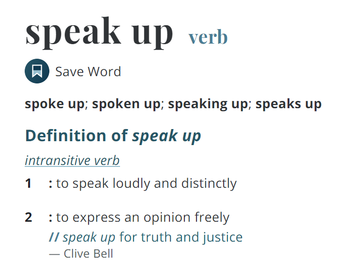

\[\[SHAPE:14\]\]\[\[SHAPE:15\]\]

[www.merriam-webster.com](http://www.merriam-webster.com)

> **About Interpersonal Communication**

The American Council on the Teaching of Foreign Languages (www.actfl.org) divides speaking into two main types: (1) interpersonal communication, and (2) presentational speech. In this textbook, you will learn about interpersonal communication.

Interpersonal communication is:

1)  Speaking and listening (and non-verbal communication). They work together to achieve effective communication.

2)  Interactive and live. Participation in conversation and discussion depends on the interactions with other speakers.

3)  Changeable. Depending on the situation, the participants and the purpose of the discussion, the register (tone and formality) and the conversation can change.

4)  Often marked by short and fast-paced exchanges between speakers.

5)  Sometimes more social than meaningful. Interpersonal communication can serve a social purpose. e.g., relationship building or socializing. This is different to presentational speech which is usually more meaningful.

In business, interpersonal communication is essential for developing positive relationships with colleagues and other stakeholders. It is a part of every business relationship, in all types of organizations. It changes based on who you are talking with, what the situation is, and where you are. To become good interpersonal communicators, it is necessary to know what to say and how to say it in a variety of situations.

\[\[SECTIONBREAK\]\]

<table style="width:100%;">
<colgroup>
<col style="width: 16%" />
<col style="width: 16%" />
<col style="width: 16%" />
<col style="width: 16%" />
<col style="width: 16%" />
<col style="width: 16%" />
</colgroup>
<thead>
<tr>
<th style="text-align: center;"><strong>Communication Function</strong></th>
<th style="text-align: center;"><strong>Practice</strong></th>
<th style="text-align: center;"><strong>Conversation</strong></th>
<th style="text-align: center;"><strong>Role-Play Situation</strong></th>
<th style="text-align: center;"><strong>Protocol &amp; Advice</strong></th>
<th style="text-align: center;"><strong>Extension  Activity</strong></th>
</tr>
</thead>
<tbody>
<tr>
<td>
Unit 1

Introducing Yourself

<strong>Page 4</strong>

Introduce yourself in a business conversation.

End a business conversation politely.
</td>
<td>
Activity 1

The formality of greetings used when saying hello.

Activity 2

The protocol and procedure for saying goodbye.
</td>
<td>
Introductions

Atsushi and Joe meet for the first time.

Saying Goodbye

Mr. Ikeda and Mr. Smith look forward to meeting again at the next conference.
</td>
<td>Representatives from two non-profit organisations meet in California to form a mutually beneficial relationship.</td>
<td>
Standard protocol for shaking hands.

The benefits of using the names of your counterparts.

The protocol and treatment of business cards.
</td>
<td>
Small Talk

Safe topics for getting to know each other.
</td>
</tr>
<tr>
<td>
Unit 2

Showing Interest

<strong>Page 10</strong>

Express interest in conversation.

Develop conversation beyond simple replies.
</td>
<td>
Activity 1

Two techniques for responding to comments.

Activity 2

Two techniques to extend and develop conversation.
</td>
<td>
Catching Up

May and Satoko catch up with each other after some time apart.
</td>
<td>In New York after attending a trade conference, two colleagues meet and have drinks.</td>
<td>
Be aware of your use of non-verbal communication.

Read about eye contact, body language and personal space.
</td>
<td>
Responding

Different situations require different types of responses.
</td>
</tr>
<tr>
<td>
Unit 3

Saying ‘Yes’ and ‘No’

<strong>Page 16</strong>

Respond positively and negatively to proposals, offers, requests, opinions and inquiries.

Saying no politely.
</td>
<td>
Activity 1

Respond positively to questions and comments. Identify communication functions.

Activity 2

Respond negatively to questions and comments.
</td>
<td>
A Job Interview

Mr. Anderson attends a job interview. Mr. Ishizawa asks many questions.
</td>
<td>A trading company introduces and sells its products to an interested customer.</td>
<td>Say ‘No’ without offending your counterpart.</td>
<td>
Disagreeing

Develop communication skills for disagreeing.
</td>
</tr>
<tr>
<td>
Unit 4

Requests and Offers

<strong>Page 22</strong>

Use the correct level of tone when making requests and offers.

Polite commands versus requests.
</td>
<td>
Activity 1

Polite structures for making requests.

Activity 2

Making, accepting and rejecting offers.
</td>
<td>
Asking for Help

Masako asks Roberto for help with her computer.

Satoshi needs some assistance with his report. Susan agrees to help.
</td>
<td>You need to talk with your boss to request permission to attend a training program in New York.</td>
<td>Is there a difference between a polite command and a request?</td>
<td>
Polite Requests

Sometimes the situation requires us to be very polite. Learn some helpful phrases.
</td>
</tr>
</tbody>
</table>

\[\[PAGEBREAK\]\]

<table style="width:100%;">
<colgroup>
<col style="width: 16%" />
<col style="width: 16%" />
<col style="width: 16%" />
<col style="width: 16%" />
<col style="width: 16%" />
<col style="width: 16%" />
</colgroup>
<thead>
<tr>
<th style="text-align: center;"><strong>Communication Function</strong></th>
<th style="text-align: center;"><strong>Practice</strong></th>
<th style="text-align: center;"><strong>Conversation</strong></th>
<th style="text-align: center;"><strong>Role-Play Situation</strong></th>
<th style="text-align: center;"><strong>Protocol &amp; Advice</strong></th>
<th style="text-align: center;"><strong>Extension  Activity</strong></th>
</tr>
</thead>
<tbody>
<tr>
<td>
Unit 5

Sharing Opinions

<strong>Page 28</strong>

Ask for and respond to opinions of varied strength.

Opinion vs. fact.
</td>
<td>
Activity 1

Vocabulary for giving an opinion. Opinion strength.

Activity 2

Asking for opinion. Questions to groups and individuals.
</td>
<td>
The New Office

Makoto and Julia discuss their opinions of the plans for the new office.
</td>
<td>The HR team has a brainstorming meeting to promote teleworking in the company.</td>
<td>What’s the difference between an opinion and a fact, and why do need to use words for stating opinions, such as ‘I think’.</td>
<td>
Argument

Create three different arguments using the ORE argument structures.
</td>
</tr>
<tr>
<td>
Unit 6

Making Suggestions

<strong>Page 34</strong>

Learn and use different types of proposals commonly used in discussion.
</td>
<td>
Activity 1

Vocabulary and structures for making suggestions.

Activity 2

Accepting and rejecting suggestions.
</td>
<td>
Recommendations

Yuki wants to take a client out for dinner. She asks John for some ideas.

Advice

Hiro needs some advice from Mr. Bijarti.
</td>
<td>The Training Department wants to increase the number of employees studying English. Join a meeting to suggest ways to increase student numbers.</td>
<td>What’s the difference between a suggestion, a recommendation and advice?</td>
<td>
Understanding

Confirm your understanding of suggestions, recommendations and advice.
</td>
</tr>
<tr>
<td>
Unit 7

Checking Understanding

<strong>Page 40</strong>

Active listening skills and questions for confirming and clarifying your comprehension in discussion.
</td>
<td>
Activity 1

Active listening questions types.

Activity 2

Active listening practice.
</td>
<td>
Catching Up

Andre and Satoshi have not seen each other for a few weeks. Andre tells him about a problem he had and how he solved it.
</td>
<td>A Japanese trading company and a Vietnamese manufacturer of textiles have a meeting to discuss a business contract.</td>
<td>Who is responsible for making sure you understand a conversation?</td>
<td>
United Nations

Practice active listening based on the UN’s Universal Declaration of Human Rights.
</td>
</tr>
<tr>
<td>
Unit 8

Being Diplomatic

<strong>Page 46</strong>

Techniques for softening your language to not cause offence.

Giving bad news.
</td>
<td>
Being Direct

Match direct and diplomatic sentences.

Being Diplomatic

Five techniques for being diplomatic.
</td>
<td>
Work Problems

Mr. Khaled has to talk to Hiroshi about some mistakes he made on his expense reports.
</td>
<td>The HR Division manager and an employee meet to discuss her job. Suggest some solutions to her work problems.</td>
<td>How can we give bad news and still keep a positive relationship?</td>
<td>
Passive Voice

The passive voice can be used to direct attention away from someone and onto action taken.
</td>
</tr>
</tbody>
</table>

\[\[SECTIONBREAK\]\]

**Discuss**

1)  Meeting new people in business and sharing contact information, also known as networking, is a common business activity. Is networking an important part of your job?

2)  When you meet someone for the first time, what information do you want to share?

3)  What is the goal of networking?

| ❶   | Learn helpful vocabulary for business introductions.         |
|-----|--------------------------------------------------------------|
| ❷   | Learn how to introduce yourself in a business situation.     |
| ❸   | Learn how to end a conversation politely.                    |
| ❹   | Read advice on the use names, business cards and handshakes. |

Warm Up

Objectives

\[\[SHAPE:43\]\]

\[\[PAGEBREAK\]\]

Activity 2

Saying Goodbye

**Ending a conversation is a process. Put the following phrases for saying goodbye in the correct order.**

|     | I have to meet a client at 3pm. |
|:---:|:-------------------------------:|
|     |            Goodbye.             |
|     | I hope we can meet again soon.  |
|     |    I’m afraid I have to go.     |
|     | Thanks for all your help today. |

There is just a small grammatical difference between ‘It **is** nice to meet you’, and ‘It **was** nice to meet you’. However, it would be unusual to finish the conversation with ‘It is nice to meet you’. Be careful with your grammar when saying goodbye.

Match these communication functions to the phrases above.

1)  Tell your counterpart you have to leave.

2)  Give a reason for why you must leave.

3)  Thank your counterpart for his or her help.

4)  Make a comment about meeting again.

5)  Say a final goodbye.

Have a conversation in the order above for saying goodbye.

Saying Hello

**Match the two sentence parts to make a phrase for introductions.**

<table style="width:63%;">
<colgroup>
<col style="width: 31%" />
<col style="width: 31%" />
</colgroup>
<thead>
<tr>
<th><ol type="1">
<li>
My name’s…
</li>
</ol></th>
<th><ol type="a">
<li>
…to meet you, Takashi.
</li>
</ol></th>
</tr>
</thead>
<tbody>
<tr>
<td><ol start="2" type="1">
<li>
I’m sorry, I didn’t….
</li>
</ol></td>
<td><ol start="2" type="a">
<li>
…meet you, Mr. Anderson.
</li>
</ol></td>
</tr>
<tr>
<td><ol start="3" type="1">
<li>
It’s nice…
</li>
</ol></td>
<td><ol start="3" type="a">
<li>
…catch your name.
</li>
</ol></td>
</tr>
<tr>
<td><ol start="4" type="1">
<li>
John, have you…
</li>
</ol></td>
<td><ol start="4" type="a">
<li>
…David, David Anderson.
</li>
</ol></td>
</tr>
<tr>
<td><ol start="5" type="1">
<li>
It’s a pleasure to…
</li>
</ol></td>
<td><ol start="5" type="a">
<li>
…met Takashi?
</li>
</ol></td>
</tr>
</tbody>
</table>

Activity 1

**Which of these greetings are formal, and which are informal?**

|     Hello.     |     Pleased to meet you.     |  Good morning.  |
|:--------------:|:----------------------------:|:---------------:|
| How do you do? |    It’s nice meeting you.    | Good afternoon. |
|      Hi!       | It’s a pleasure to meet you. |  Good evening.  |

\[\[PAGEBREAK\]\]

> **Practice the conversations with a partner. Then, change some of the details to match your situation and practice again.**

| **Mr. Ikeda** | Well, it was very nice to meet you, Mr. Smith, but I’m sorry, I must be going now. I have to attend a meeting early in the morning. |
|---:|----|
| **Mr. Smith** | I understand. It was very nice meeting you too, Mr. Ikeda. |
| **Mr. Ikeda** | Thank you, Mr. Smith. I hope to see you at the next conference. |
| **Mr. Smith** | Me too. Have a safe trip going home. |
| **Mr. Ikeda** | Good-bye. |
| **Mr. Smith** | Good-bye, Mr. Ikeda. |

Saying Goodbye

Introductions

| **Atsushi** | Hello. My name is Atsushi Miyazaki. |
|---:|----|
| **Joe** | Hello Mr. Miyazaki. My name is Joe, Joe Peterson. Please call me Joe. |
| **Atsushi** | It’s nice to meet you, Joe. Please call me Atsushi. |
| **Joe** | What do you do, Atsushi? |
| **Atsushi** | I work for Nippon Taiyo Bank. How about you, Joe? |
| **Joe** | I work for Ransom Consulting. We provide personal finance consulting services to individuals. What do you do at Nippon Taiyo Bank? |
| **Atsushi** | I’m a manager in the Omiya Branch. |
| **Joe** | Really? That’s interesting. I used to live in Omiya. |
| **Atsushi** | I see. I like Omiya. It’s not far from Tokyo but still quiet. |

Conversation

\[\[PAGEBREAK\]\]

| **Who?** | You work for Global Aid, a non-profit organization in Japan. You will meet with Roxanne Andrews, the head of Helping Others, a US-based charity. Ms Andrews wants to work with Global Aid. |
|----|----|
| **What?** | You have had previous email and telephone communication, but this is the first time to meet face-to-face. You will have meetings throughout the day with different people in the charity, and then have dinner in the evening with Ms Andrews and probably some other staff. |
| **Where?** | The introduction happens in the lobby of Helping Others’ head office in San Diego, California. |

The Situation

Notes

Read the situation, prepare some notes, and then role-play a conversation with a partner.

Role-Play

\[\[PAGEBREAK\]\]

**2. Shaking Hands**

There are four steps to a good handshake.

1.  Make eye contact and extend your open hand.

2.  Let your hands meet at the base of the thumbs.

3.  Close your hand firmly, shake three times and smile!

4.  Open your hand and bring it back to your side.

A standard handshake is one-handed. Usually, we shake with our right hand, even if we are left-handed. Keep your hands dry and your handshake firm.

The BBC explains handshakes around the world. Check:

[www.bbc.com/worklife/article/20130809-more-than-a-handshake](http://www.bbc.com/worklife/article/20130809-more-than-a-handshake)

**3. Using Business Cards**

| The way you should a handle business card depends on where you are. Make sure you do some research if you will go to a new destination overseas. Generally, in many parts of Asia, business cards are an important part of introductions. In Japan they are presented and received with two hands and treated with great respect. | In North America, Australasia and some parts of Europe, the main purpose of a business card is to share contact information. The business card is often presented near the end of the meeting when we say goodbye so we can stay in contact. So, it is handled somewhat casually. |
|----|----|

For more information on business card etiquette around the world, see:

[www.solopress.com/blog/business-marketing/global-business-card-etiquette](http://www.solopress.com/blog/business-marketing/global-business-card-etiquette)

Extension

**1. Using Names**

We often use the names of our counterparts when we are talking with them. For example, ‘What do you do, Hiro?’ or, ‘Mr. Sakamoto, where is your office?’ Using names has two purposes: First, it shows respect to the person you are talking to. Second, it makes it clear that the question is directed to someone specific, so there can be no misunderstanding. When we first meet someone, it also has the benefit of confirming our counterpart’s name.

It’s important when we meet people to catch their names and use them in conversation.

**Small Talk Topics**

What topics can you discuss when you meet someone for the first time in your home country? Is it different in any other country or region you know? Are there any topics which are okay to talk about in Japan, but might not be acceptable overseas?

**Make a list of five safe topics you can discuss with an English speaker coming to Japan for the first time.**

The list of safe small talk topics varies between cultures. That is why, before you go abroad, you should do some research and learn about the culture, greetings and customs of the place you are going to.

Advice

\[\[PAGEBREAK\]\]

Review

Complete the crossword to review the vocabulary you learned in this unit.

Across

> 3\. Nippon Taiyo is a trading <u>company</u>.
>
> 4\. I <u>work</u> for Ransom Consulting.
>
> 6\. Really? That’s <u>interesting</u>.
>
> 9\. I’m a <u>manager</u> in the Omiya Branch.

Down

> 1\. I work in the logistics <u>department.</u>.
>
> 2\. It was very nice <u>meeting</u> you too, Mr. Ikeda.
>
> 5\. And <u>what</u> do you do at Nippon Taiyo?
>
> 7\. Well, it was very <u>nice</u> to meet you, Mr. Smith.
>
> 8\. My <u>name</u> is Atsushi Miyazaki.

Word List

department

meeting

company

name

manager

work

what

nice

interesting

\[\[SHAPE:127\]\]\[\[SHAPE:128\]\]

\[\[SECTIONBREAK\]\]

**Discuss**

American author and lecturer Dale Carnegie said;

> “You can make more friends in two months by becoming interested in other people than you can in two years by trying to get other people interested in you.”

1)  Do you agree with this idea?

2)  How important is it to show interest when talking with colleagues?

3)  How do you show interest in what your counterpart is saying?

Warm Up

| ❶   | Learn helpful vocabulary for showing interest in conversation. |
|-----|----------------------------------------------------------------|
| ❷   | Learn two techniques for showing interest.                     |
| ❸   | Learn two techniques for extending the conversation.           |
| ❹   | Read advice about positive non-verbal communication.           |

Objectives

\[\[SHAPE:148\]\]

\[\[PAGEBREAK\]\]

Extending the Conversation

Techniques for Showing Interest

**2. Repeating Key Words**

Repeating the key words said by your counterpart is another common technique for showing that we are paying attention. Usually, we repeat the nouns. Similarly, to the auxiliary verbs, we often do it as a simple one-word question.

> A: I will meet Asuka on Sunday.
>
> B: Asuka?

Usually, we repeat the most interesting information. Here ‘Asuka’ is repeated, but we could also repeat ‘Sunday?’, or even ‘You?’

**With a partner, practice making comments and repeating key words.**

**2. Responding to Comments**

Commenting and responding is another way to develop conversation.

> A: I will meet Asuka on Sunday.
>
> B: Asuka? It’s been a while.

We can make the response even better by combining the two techniques. Note how the questions comes after the comment.

> A: I will meet Asuka on Sunday.
>
> B: Asuka? It’s been a while. How is she?

**Practice making comments, responding to them and asking follow-up questions.**

**1. Asking Questions**

We can follow up on a comment with a short, simple question.

> A: I will meet Asuka on Sunday.
>
> B: Asuka? How is she?

‘WH’ questions (who, what, when, where, why and how) are open questions, and encourage a longer response from your counterpart. This helps extend the conversation.

**With a partner, practice making comments and asking follow-up questions.**

Activity 2

**1. Questions with Auxiliary Verbs**

Sentences in English can have more than one verb.

> A: I <u>will</u> <u>meet</u> Asuka on Sunday.

Here ‘meet’ is the main verb and ‘will’ is an auxiliary verb, also called a ‘helper’ verb. When responding to statements made by others, we can simply repeat the auxiliary verb. This shows your counterpart that you are not only listening, but you are also paying attention (because you repeat a part of their actual statement). Often, we do this in question form.

> A: I <u>will</u> meet Asuka on Sunday.
>
> B: <u>Will</u> you?

**Practice commenting with these auxiliary verbs.**

| Can | Have | Be  | Will | Do  |
|-----|------|-----|------|-----|

**Respond by asking questions using the auxiliary verb used in the comment.**

Activity 1

\[\[PAGEBREAK\]\]

> **Practice the conversation with a partner. Then, change some of the details to match your situation and practice again.**

| **Satoko** | Hi Mary. It’s been a while. How are you? |
|---:|----|
| **Mary** | I’m good, thanks. How about yourself? |
| **Satoko** | I’m great. I got a promotion at work a couple of months ago. |
| **Mary** | Really? That’s fantastic. What do you do now? |
| **Satoko** | I’m in charge of sales in Asia. It’s hard work, but I’m enjoying it. |
| **Mary** | That’s great. I’m happy for you. Actually, I’m looking for a job myself. |
| **Satoko** | Really? What happened to your old job? |
| **Mary** | It wasn’t for me. I had to do a lot of traveling and that wasn’t good for my family, so I thought I’d try something new. |
| **Satoko** | Oh, I’m sorry to hear that. What kind of job are you looking for now? |
| **Mary** | Something that keeps me close to home so I can spend more time with my family. |
| **Satoko** | Well, we have some jobs available at the moment. I’ll contact HR and ask them to contact you. |
| **Mary** | Wow, really? That’s amazing. Thanks, Satoko. |
| **Satoko** | No problem. It would be great to have you working with us. |

Conversation

\[\[PAGEBREAK\]\]

Notes

| **Who?** | You are a sales representative in a trading company with headquarters located in Tokyo. Currently, you are in the US attending an international trade exhibition. You are going to have drinks with your US-based colleague, Paul Novak. |
|----|----|
| **What?** | The last time you met Mr. Novak was during your last trip to the US, six months ago. You communicate regularly with each other through email and video conferencing. Mr. Novak was recently promoted to Sales Division Manager of North America. You have asked to meet Mr. Novak so you can catch up and congratulate him on his promotion. |
| **Where?** | The conference is taking place in the Hilton Hotel in New York. You have arranged to meet Mr. Novak in a hotel bar on the 25th floor at 8pm. |

The Situation

Read the situation, prepare some notes, and then role-play a conversation with a partner.

Role-Play

\[\[PAGEBREAK\]\]

Extension

**Responding Appropriately to the Situation**

When having a conversation, it is important to understand the situation and appropriately match your responses to the questions and comments.

**How can you respond appropriately to the following statements?**

|          I just won the lotto!          |
|:---------------------------------------:|
|       I’m not feeling very well.        |
|        My dog died last weekend.        |
| We’re going to France for our vacation. |
|       I got a promotion at work.        |

**With a partner, practice making comments similar to those above and respond to them.**

Advice

\[\[PAGEBREAK\]\]

Down

> 1\. How are you?
>
> 2\. No problem. It would be great to have you working with us.
>
> 3\. Oh, I’m sorry to hear that.
>
> 5\. How about yourself?
>
> 6\. What do you do now?

Review

Complete the crossword to review the vocabulary you learned in this unit.

Across

> 1\. I’m happy for you.
>
> 4\. Really? What happened to your old job?
>
> 5\. Wow, really? That’s amazing! Thanks, Satoko.
>
> 7\. Wow, really?
>
> 8\. That’s fantastic!

Word List

how

about

fantastic

now

happy

Really

sorry

Wow

amazing

problem

\[\[SECTIONBREAK\]\]

| ❶   | Learn helpful vocabulary for responding positively and negatively. |
|-----|--------------------------------------------------------------------|
| ❷   | Say ‘yes’ and ‘no’ to requests, proposals, opinions and inquiries. |
| ❸   | Read about saying no politely.                                     |

**Brainstorm and Discuss**

**Situations**

> When do we say ‘yes’ and ‘no’ in business? Give some examples.

**Vocabulary**

> What are the different ways to say ‘yes’? Now, think of the different ways we can say ‘no’. Is one way more polite than the other?

Warm Up

Objectives

\[\[SHAPE:239\]\]

\[\[PAGEBREAK\]\]

**Positive Responses**

| a\. | Yes, it is, isn’t it? Too hot for me, actually. |
|:---:|-------------------------------------------------|
| b\. | Sure. What time?                                |
| c\. | Of course. What time will you finish?           |
| d\. | Okay. What do you need?                         |
|  e  | Yes, I did. It was quite productive.            |

**Questions and Comments**

| 1\. | You went to the conference last year, didn’t you?   |
|:---:|-----------------------------------------------------|
| 2\. | Can I help you with that?                           |
| 3\. | Can we meet at 3pm today to talk about the project? |
| 4\. | We should hire more staff.                          |
| 5\. | Would it be okay if I took the day off tomorrow?    |

**Match the negative responses to each of the questions and comments below.**

The Different Ways to Say ‘No’

The Different Ways to Say ‘Yes’

Activity 2

**Negative Responses**

| a\. | Do you really think so? I think that could be expensive. |
|:---:|----------------------------------------------------------|
| b\. | I’m sorry, I need your help in the morning.              |
| c\. | I’m sorry. I’m busy then. How about tomorrow?            |
| d\. | It’s alright. I can manage it myself.                    |
| e\. | Actually no, I couldn’t go. I had to cancel my trip.     |

We can say yes, or give a positive response, for many different purposes.

> 1\. Accepting a proposal or offer.
>
> 2\. Accepting a request.
>
> 3\. Agreeing with an opinion or statement.
>
> 4\. Positively responding to a simple inquiry.
>
> 5\. Giving permission.

**Match the purposes with the responses above.**

**Questions and Comments**

| 1\. | Would you like to have lunch with me today? |
|:---:|---------------------------------------------|
| 2\. | Can you help me with this report?           |
| 3\. | It’s quite hot today.                       |
| 4\. | Did you go to the meeting yesterday?        |
| 5\. | Can I leave a little early today?           |

**Match the positive responses to each of the questions and comments below.**

Activity 1

\[\[PAGEBREAK\]\]

> **Practice the conversation with a partner. Then, change some of the details to match your situation and practice again.**

| **Mr. Ishizawa** | Hello Mr. Anderson. Thanks for coming to the interview. |
|---:|----|
| **Mr. Anderson** | Thanks for having me. I’m very happy you invited me. |
| **Mr. Ishizawa** | No problem. Okay, so I reviewed your application. Naturally, I have some questions. |
| **Mr. Anderson** | Of course, go ahead. |
| **Mr. Ishizawa** | First of all, we often work late hours. Can you work late two or three nights a week? |
| **Mr. Anderson** | Sure. I did a lot of late-night work in my previous job. I’m used to it. |
| **Mr. Ishizawa** | Great. Second, we think it’s important that everyone in the company has a positive attitude to work. We want you to enjoy your job. Our motto is ‘work and smile’. What do you think of that? |
| **Mr. Anderson** | Well, it’s a nice idea. I agree completely. Of course, every day is different, but I like the overall message. It sounds like a nice place to work. |
| **Mr. Ishizawa** | It really is. Next, do you have any food allergies? We provide lunch in our cafeteria. |
| **Mr. Anderson** | Actually, yes. I’m allergic to shellfish. |
| **Mr. Ishizawa** | I see, well we don’t have much of that. And there is always more than one option. You should be fine. |
| **Mr. Anderson** | That’s good to know. |
| **Mr. Ishizawa** | Also, we need to take a copy of your driver’s license. Can you send us a copy this week? |
| **Mr. Anderson** | Certainly. I’ll email it to you tomorrow. |
| **Mr. Ishizawa** | Great. Well then. Everything seems fine. Can you start on Monday? |
| **Mr. Anderson** | Of course! |

Conversation

\[\[PAGEBREAK\]\]

Notes

| **Who?** | You work in a small trading company in Osaka. Your organization specializes in buying rice from Australia and Thailand. You sell mainly to specialist food shops in Japan. |
|----|----|
| **What?** | You will have a meeting with a new customer who wants to buy long grain jasmine rice for its chain of Thai restaurants. The customer will have many questions about the quality of the rice, the delivery schedule and the cost. |
| **Where?** | You will have the meeting at the customer’s office. |

The Situation

Read the situation, prepare some notes, and then role-play a conversation with a partner.

Role-Play

\[\[PAGEBREAK\]\]

Extension

**More Disagreeing**

Often people do not want to disagree. It can be uncomfortable and, if not done carefully, it can create relationship problems. We need to become comfortable with disagreeing in a polite way.

**Practice disagreeing politely to these statements.**

1)  Fats are worse for your body than carbohydrates.

2)  Osaka is a better city than Tokyo.

3)  Nihonshu is healthier than beer.

4)  No-one living in Tokyo needs to own a car.

5)  Children should be free to choose what they wear.

Advice

\[\[PAGEBREAK\]\]

Review

Complete the crossword to review the vocabulary you learned in this unit.

Across

> 1\. Okay. What do you need?
>
> 4\. Of course, go ahead.
>
> 6\. Well, it’s a nice idea. I agree completely.
>
> 8\. It’s alright. I can manage it myself.
>
> 9\. No problem Mr. Ishizawa.

Down

> 2\. Actually, yes. I’m allergic to shellfish.
>
> 3\. Sure. I did a lot of late-night work in my previous job.
>
> 4\. Certainly. I’ll email it to you tomorrow.
>
> 5\. Yes, it is, isn’t it? I feel like going to the beach.
>
> 7\. Yes, I did. It was quite productive.

Word List

course

Sure

problem

agree

Actually

Certainly

Okay

isn’t it

did

alright

\[\[SECTIONBREAK\]\]

**Language in Use**

**Situation 1**

> You are late completing a business report. You need to request more time to complete it. You will make the request to your manager. What can you say?

**Situation 2**

> You finished your report early, but you know your colleague is late completing his report. You want to offer to help him complete his report. What can you say?

Warm Up

| ❶   | Learn helpful vocabulary for making requests and offers.            |
|-----|---------------------------------------------------------------------|
| ❷   | Learn how to change the level of formality for requests and offers. |
| ❸   | Read about making commands with ‘please’.                           |

Objectives

\[\[SHAPE:336\]\]

\[\[PAGEBREAK\]\]

Making Offers

When you ask someone to do something for you, you make a request. We need to be polite when making requests. To make requests, we often use the modal verb ‘can’. The verb form we use often indicates the level of formality.

**Order these requests from most polite to least polite.**

|  | Would you be able to meet my client for me? |
|:--:|:--:|
|  | Can you open the door? |
|  | I would be grateful if you could \[\[LINEBREAK\]\]write the report by the end of today. |
|  | Could you send me the information by tomorrow? |

Making Requests

Activity 2

Simply, an offer is the opposite of a request: While a request is receiving something (often help) from someone; an offer is giving something (often help) to someone.

| Making an Offer | Accepting an Offer | Rejecting an Offer |
|:--:|:--:|:--:|
| <u>Can I \[\[LINEBREAK\]\]</u>open the door <u>for you?</u> | Yes, please. \[\[LINEBREAK\]\]That’s kind of you. | No thanks. \[\[LINEBREAK\]\]I can manage. |
| <u>Would you like me to</u> \[\[LINEBREAK\]\]send the report to you? | Thank you. \[\[LINEBREAK\]\]I appreciate it. | It’s okay. \[\[LINEBREAK\]\]I’ll do it myself. |
| <u>Do you want me to</u> \[\[LINEBREAK\]\]set a meeting? | Thanks. | That’s very kind of you, \[\[LINEBREAK\]\]but I can do it. |

**Write three new offers using the underlined words above.**

When refusing an offer, it’s important to show appreciation (say ‘thank you’), especially when the offer is significant.

**Practice making, accepting and then rejecting offers with a partner.**

Be careful with ‘Can I’. ‘Can I open the door for you?’ is clearly an offer, but ‘Can I open the door?’ is asking for permission, similar to ‘Can I leave early today?’ The difference is the purpose of the statement: Are you doing it for someone else, or for yourself? Make it clear that you are doing it for someone else when making an offer using ‘Can I’ by adding ‘**for you’** to the end of the question.

Activity 1

\[\[PAGEBREAK\]\]

| **Satoshi** | Excuse me, Susan. Can I bother you for a minute? |
|---:|----|
| **Susan** | Certainly Satoshi. What can I do for you? |
| **Satoshi** | Would you be able to help me with my report? I’m afraid I’m running behind schedule and I won’t finish it before the deadline. |
| **Susan** | Oh, well… okay. I’ll help you but you’ll owe me one. What do you need? |
| **Satoshi** | Could you complete the section on the project status? |
| **Susan** | Let’s see. Okay, sure I can do that. When do you need it by? |
| **Satoshi** | Would it be possible to have it done by tomorrow afternoon? |
| **Susan** | I think so. I’ll start on it today and let you know later how it’s going. |
| **Satoshi** | Thanks a lot. I really appreciate it. |
| **Susan** | No problem. |

> **Practice the conversations with a partner. Then, change some of the details to match your situation and practice again.**

| **Masako** | Roberto, can you help me with something? |
|---:|----|
| **Roberto** | Sure. What is it? |
| **Masako** | I need some help with the computer. For some reason, I can’t log in. |
| **Roberto** | Oh, I’m sorry Masako. I’m not great with IT. I don’t think I can help you. But let me call them for you. |
| **Masako** | That’s okay. I have to meet a client soon. I’ll do it myself when I come back to the office. |
| **Roberto** | Okay. Well, if I can help you with anything else, just let me know. |
| **Masako** | Sure. I’ll do that. Thanks. |

Conversation

\[\[PAGEBREAK\]\]

| **Who?** | You are an employee in a large bank in Tokyo. You have worked at the bank for a few years |
|----|----|
| **What?** | You will have a meeting with your boss. You want to apply for a famous training program. You need to ask questions about the program and make a formal request to attend it. |
| **Where?** | Your branch is in central Tokyo. The training program is in New York. |

Notes

The Situation

Read the situation, prepare some notes, and then role-play a conversation with a partner.

Role-Play

\[\[PAGEBREAK\]\]

**Very Polite Requests**

We often become very polite when the request is significant.

**Unscramble these polite requests.**

1)  you / help / able / to / me / Would / my / report? / complete / be

2)  I / wondering / was / if / ask / I / assistance / for / with / my / could / presentation. / your

3)  possibly / Could / some / you / time / me / spare / help / to / with project? / my

4)  tomorrow? / possible / Would / at / it / be / all / to / day / take / the / off

5)  able / Might / you / be / find / to / the / time / help / to / with / me / this?

Extension

Advice

\[\[PAGEBREAK\]\]

Review

Complete the crossword to review the vocabulary you learned in this unit.

Across

> 2\. Do you want me to set a meeting?
>
> 7\. Would you like me to send the report to you?
>
> 6\. Would you be able to meet my client for me?
>
> 8\. Oh, I’m sorry Masako. I’m not great with IT.
>
> 9\. Well, if I can help you with anything else, just let me know.
>
> 10\. That’s very kind of you, but I can do it.

Down

> 1\. Yes, please. That would be very helpful.
>
> 3\. Thank you. I appreciate it.
>
> 4\. No thanks. I can manage.
>
> 5\. Could you send me the information by tomorrow?

Word List

able

Could

like

want

would

appreciate

thanks

but

sorry

anything

\[\[SECTIONBREAK\]\]

| ❶ | Learn helpful vocabulary for giving and asking for opinion. |
|----|----|
| ❷ | Learn how to make an ORE argument. |
| ❸ | Learn how to interrupt a conversation. |
| ❹ | Read about the difference between giving an opinion and stating a fact. |

**Answer the following questions, and then discuss your answers with a partner.**

1.  What does your organization do best?

2.  What is the most important thing for a new employee to learn in their first year of work?

3.  How important is learning English in your organization?

**Follow-up**

1)  In your discussion, did you share opinions or facts?

2)  How can you share your ideas and clearly indicate you are sharing your opinion, and not a fact.?

Warm Up

Objectives

\[\[SHAPE:429\]\]

\[\[PAGEBREAK\]\]

**Read the following opinion statements about hiring someone.**

<table style="width:54%;">
<colgroup>
<col style="width: 6%" />
<col style="width: 47%" />
</colgroup>
<thead>
<tr>
<th style="text-align: center;"></th>
<th style="text-align: center;">
As far as I’m concerned, there’s no-one better.

We absolutely must hire him.
</th>
</tr>
</thead>
<tbody>
<tr>
<td style="text-align: center;"></td>
<td style="text-align: center;">
I feel he could be a good match for our team.

Perhaps we should hire him.
</td>
</tr>
<tr>
<td style="text-align: center;"></td>
<td style="text-align: center;">
I think he would be a strong employee.

He has all the qualifications. We should hire him.
</td>
</tr>
<tr>
<td style="text-align: center;"></td>
<td style="text-align: center;">I believe he will be a valuable asset for the department. Let’s hire him.</td>
</tr>
</tbody>
</table>

1.  Number each opinion statement from (1) strong to (4) weak.

2.  <u>Underline</u> the words which make the sentence strong or weak.

3.  Highlight the words which show the statement is an opinion.

4.  Circle the words which show a judgment (good or bad).

**Complete the sentences below with the following words.**

| think | concerned | believe | opinion | point |
|-------|-----------|---------|---------|-------|

1.  I \_\_\_\_\_\_\_\_\_\_\_\_ Australia’s beaches are stunning.

2.  As far as I’m \_\_\_\_\_\_\_\_\_\_\_\_, Italian renaissance art is simply gorgeous.

3.  I \_\_\_\_\_\_\_\_\_\_\_\_ Japan has the most beautiful cherry blossoms in the world.

4.  In my \_\_\_\_\_\_\_\_\_\_\_\_, Californian wine is better than French wine.

5.  Well, from my \_\_\_\_\_\_\_\_\_\_\_\_ of view, New Zealand’s landscapes can’t be beat.

Opinions are a person’s ideas, thoughts, feelings or beliefs about a topic. They often include a judgment (saying something is good or bad). An opinion can clearly show judgment, e.g. ‘I think Japanese food is the best food in Asia’, or it can show judgment by using opinion adjectives. These are adjectives which include a positive or negative evaluation. For example, ‘I think Japanese food is fantastic’. Here, the adjective ‘fantastic’ includes a strongly positive evaluation.

Giving an Opinion

Activity 1

\[\[PAGEBREAK\]\]

Asking for Opinion

**Sometimes it can be helpful to direct questions to a specific individual. Look at the sentences below.**

| **Questions to a Group** | **Questions to an Individual** |
|:--:|:--:|
| What does everyone think? | Takeshi, I’d like to hear your idea. What do you think? |
| What’s your opinion on the topic? | Amanda, what’s the Accounting Department’s position? |
| I’d like to know what the consensus is. | How about you, Carla? |
| Any ideas? | Renee, can you share your thoughts on that? |

In small groups, practice asking questions about opinions to (1) the group and (2) to individuals.

> **Practice the conversation with a partner. Then, change some of the details to match your situation and practice again.**

Conversation

| **Makoto** | What do you think about the design of the new office? |
|---:|----|
| **Julia** | I like the open floor plan. It looks very spacious, and I think it would encourage communication between co-workers. |
| **Makoto** | I agree. I think the modern furniture, the use of sofas and the large open cafeteria will make it a relaxing place to work. I think our employees will look forward to going to work. |
| **Julia** | That’s true. However, I’m not sure about the storage space. I don’t know if there are enough cabinets for everything we need. |
| **Makoto** | Well, we can get more cabinets, but we will have to think carefully about where to put them. |
| **Julia** | How about on the second floor? I think there is a lot of unused space there, and both elevators stop on that floor, so it has good access. I think that is the most logical location. |
| **Makoto** | Yes, I think you’re right. Okay, at the next meeting let’s tell the architects we approve of their plan, but we want more storage on the second floor. |
| **Julia** | Sure. That sounds like a good idea. |

Activity 2

\[\[PAGEBREAK\]\]

The Situation

Notes

Advice

| **Who?** | You work in Human Resources. You have worked in the department for a few years. |
|----|----|
| **What?** | You will join a meeting with the HR team. The purpose of the team meeting is to brainstorm ideas for promoting teleworking in the organization. |
| **Where?** | The meeting will take place in your office in Tokyo. |

Read the situation, prepare some notes, and then role-play a conversation with a partner.

Role-Play

\[\[PAGEBREAK\]\]

Making an Argument

1)  **Match the opinions, reasons and evidence below to make persuasive arguments.**

2)  **Practice reading the arguments aloud. Do you think they are persuasive? Is one argument more persuasive than another? Which one, and why?**

Often, we share our opinion because we want others to hear and accept our ideas. To persuade people to accept our ideas, we need to support our opinions with reasons and evidence in a logical way. When we do this, we make an argument.

Extension

**Opinion 3**

I feel we need to do more research before we can decide whether to go ahead or not.

**Opinion 2**

In my opinion, the best way to stop climate change is to stop eating beef.

**Opinion 1**

I think we will have to work more overtime in order to finish the project by the deadline.

**Reason 2**

Due to the agriculture industry, cows are the greatest contributors to global warming.

**Reason 3**

This is because we are understaffed. We won’t get it done otherwise.

**Reason 1**

The reason for this is we don’t have enough information. The decision is important so we can’t rush into it.

**Evidence 3**

Do you remember last year when we rushed the decision on the Tokyo project? We ended up missing our deadlines when we realized we had made more than one significant error. It’s important to spend time now doing research so we don’t have the same problems.

**Evidence 1**

We have had three staff quit this year and they haven’t been replaced. Our staffing level is at 70%. We will not be able to hire staff quickly, so the only way we can meet the deadline is to work overtime.

**Evidence 2**

According to research, cows release large amounts of methane. This gets released into the atmosphere and destroys the ozone layer. Our love of beef has caused the number of cows to double in the last decade. Clearly, it is having a harmful impact on our planet.

\[\[PAGEBREAK\]\]

Review

Complete the crossword to review the vocabulary you learned in this unit.

Across

> 1\. What do you think, Amanda?
>
> 5\. In my opinion, there is no better country than the USA.
>
> 6\. How about you, Carla?
>
> 7\. I believe Japan is the best country in the world.
>
> 9\. What does everyone think?

Down

> 2\. I think Australia is a beautiful country.
>
> 3\. As far as I’m concerned, Italy is gorgeous.
>
> 4\. Well, from my point of view, New Zealand can’t be beat.
>
> 5\. What’s your opinion on the topic?
>
> 6\. Takeshi, I’d like to hear your idea.
>
> 8\. Any ideas?

Word List

think

concerned

believe

opinion

view

everyone

on

ideas

hear

What

How

\[\[SHAPE:521\]\]\[\[SHAPE:522\]\]\[\[SHAPE:523\]\]\[\[SHAPE:524\]\]

\[\[SECTIONBREAK\]\]

**Can You Help Me?**

Think of a problem you have to deal with. It can be real, or imaginary.

1)  Explain the problem to a partner, and then ask them to propose some ideas which can help you solve the problem.

2)  Decide whether you will accept their ideas. If you do not, explain why not.

| ❶ | Learn helpful vocabulary for making suggestions and recommendations. |
|----|----|
| ❷ | Learn how to be soft and strong when rejecting suggestions. |
| ❸ | Read about the difference between advice, suggestion and recommendation. |

Warm Up

Objectives

\[\[SHAPE:544\]\]

\[\[PAGEBREAK\]\]

In pairs, take turns asking each other for suggestions, recommendations or advice. Respond to the proposal by accepting or rejecting it. If you reject it, make sure you give a reason. Use the phrases below when responding to suggestions.

**Rejecting a Suggestion**

I don’t know about that.

Do you think so?

Actually, I don’t think that’s a good idea.

I’m not sure about that, to be honest.

Is that correct?

**Accepting a Suggestion**

That sounds like a good idea.

Sure, let’s do that.

Okay. I like the sound of that.

I think that’s a good idea.

That could be worth trying.

Activity 2

Responding to Suggestions

Activity 1

**Complete the proposals below with the following words.**

| don’t | suggest | How | about | Let’s | recommends | Shall |
|-------|---------|-----|-------|-------|------------|-------|

1)  \_\_\_\_\_\_\_\_\_\_ about Greek for lunch today?

2)  Why \_\_\_\_\_\_\_\_\_\_ we try the Italian restaurant across the road?

3)  I \_\_\_\_\_\_\_\_\_\_ we go to the Spanish restaurant near the station.

4)  Jose \_\_\_\_\_\_\_\_\_\_ the Japanese restaurant in the basement.

5)  What \_\_\_\_\_\_\_\_\_\_ the cafe on the corner? It looks nice.

6)  \_\_\_\_\_\_\_\_\_\_ we go to the new hamburger place?

7)  \_\_\_\_\_\_\_\_\_\_ grab a sandwich from the food truck outside.

Making Suggestions

\[\[PAGEBREAK\]\]

| **Yuki** | John, do you have a minute? |
|---:|----|
| **John** | Sure, what’s up? |
| **Yuki** | I want to take my customer to a nice restaurant for dinner next Thursday evening, but because I’m new to the area, I don’t know where we should go. |
| **John** | Well, there’s a new office building near the station that has a selection of good restaurants. I was thinking of going there myself this week. Why don’t you come with me and see if there’s something there you like? We can go for lunch tomorrow. |
| **Yuki** | Oh, that sounds like a good idea. I can try it out before making a final decision. |
| **John** | Great. |

A Recommendation

> **Practice the conversations with a partner. Then, change some of the details to match your situation and practice again.**

| **Hiro** | Excuse me, Mr. Bijarti. Can I interrupt you for a moment? |
|---:|----|
| **Mr. Bijarti** | Of course, Hiro. What can I do for you? |
| **Hiro** | I need your advice. I am trying to prepare an estimate for my client, but there are some things I need some help with. |
| **Mr. Bijarti** | Okay, why don’t you set a meeting and we can sit down and go over it in detail. |
| **Hiro** | That would be great. Thank you. |
| **Mr. Bijarti** | No problem. |

Advice

Conversation

\[\[PAGEBREAK\]\]

| **Who?** | You work in the Training Department of your organization. You are responsible for the English Language Training programs. |
|----|----|
| **What?** | Recently student interest in English language training has dropped. You will join a brainstorming meeting with other members of your department. The purpose of the meeting is to suggest many different ways the department can promote the English Language Training programs and increase the number of students taking the courses. |
| **Where?** | The meeting will take place in your office in Tokyo. |

Notes

Role-Play

The Situation

Read the situation, prepare some notes, and then role-play a conversation with a partner.

\[\[PAGEBREAK\]\]

**Recommendation, Suggestion and Advice – What’s the Difference?**

Each is an idea you share with another person, often proposing some kind of action. Whether you make a suggestion, make a recommendation, or give advice depends on the situation and the people involved.

Check Your Understanding

Extension

2)  You are in a department meeting with your colleagues to discuss and decide how to improve communication in the office. Your colleagues have been asked to share an idea each.

**Do your colleagues make suggestions, recommendations or give advice?**

3)  You have been feeling sick all day. You go to the local clinic to see a doctor.

**Does the doctor make a suggestion, a recommendation, or give advice?**

Advice

**With a partner, take turns role-playing the situations above.**

When you make a proposal, first consider the situation and the people involved so that you can choose the correct vocabulary and tone.

1)  You want to see a movie next weekend. There are three movies showing which you are interested in seeing. Your friend has seen each of them.

**Do you ask your friend for a recommendation, a suggestion, or advice?**

\[\[PAGEBREAK\]\]

Complete the crossword to review the vocabulary you learned in this unit.

Down

> 1\. Shall we go to the hamburger place?
>
> 2\. Why don’t we try the Italian restaurant across the road?
>
> 5\. Do you think so?
>
> 6\. Let’s grab a sandwich from the food truck outside.
>
> 7\. I suggest we go to the new Spanish restaurant near the station.

Word List

How

Why

suggest

recommends

about

Shall

Let’s

sounds

Sure

think

Actually

Review

Across

> 1\. Sure, let’s do that.
>
> 3\. How about Greek for lunch today?
>
> 4\. Actually, I don’t think that’s a good idea.
>
> 8\. That sounds like a good idea.
>
> 9\. Jose recommends the Japanese restaurant in the basement.
>
> 10\. What about the cafe on the corner? It looks nice.

\[\[SECTIONBREAK\]\]

| ❶ | Learn helpful vocabulary to check and improve your understanding in conversation. |
|----|----|
| ❷ | Learn the difference between asking for repetition, confirming and clarifying. |
| ❸ | Read about the importance of being an active listener. |

**Discuss**

1)  When you participate in conversation and you do not understand part of the conversation, what do you usually do? Do you stop the conversation and ask questions to get a better understanding, or do you stay quiet and hope that more discussion will lead to more understanding?

2)  Is it always okay to interrupt a speaker to get more information? In what situations is it okay, and in what situations is it not okay?

3)  When you do not understand something, what can you say?

Warm Up

Objectives

\[\[SHAPE:659\]\]

\[\[PAGEBREAK\]\]

Interrupting is a skill that needs to be practiced. If you do not interrupt, you could miss out. Make sure you interrupt the speaker if you do not understand.

With a partner, describe or explain something your partner will not fully know or understand. For example, you can talk about your hometown or your neighbourhood, a hobby, a country you visited, or a work procedure or task.

**Practice asking questions when you do not understand.**

**Questions**

1)  Sorry, I don’t understand your point. Can you explain it again?

2)  I’m sorry but I don’t know what you mean by ‘QQE’. Can you be more specific?

3)  Could you say that again please? I didn’t catch it.

4)  So, what you are saying is you basically disagree with my idea. Is that right?

5)  Are you saying you do not want to join the project team?

**Question Types for Active Listening**

| **Repetition** | Asking someone to repeat or say something again. |
|----|----|
| **Confirmation** | Sharing your understanding and asking if it is correct. |
| **Clarification** | Asking someone to make something clear, or easy to understand. |

Activity 1

**Match the five questions below with the following three question types for active listening.**

Active Listening Practice

Active Listening Questions

Activity 2

\[\[PAGEBREAK\]\]

| **Satoshi** | Hey there Andre. I haven’t seen you in a few weeks. What’s new? |
|---:|----|
| **Andre** | Hi Satoshi. I’m good. I’ve had a crazy couple of weeks though. |
| **Satoshi** | Crazy? What do you mean? |
| **Andre** | Well, first I had a hard time on a new project. At the beginning, I just didn’t understand what I had to do, and after a few days, it became really stressful. I didn’t know what I could do. I wasn’t sleeping at night, and this just made things worse. |
| **Satoshi** | I see. So, what you are saying is you really had a tough time. How did you deal with it? |
| **Andre** | Well, I had to have a meeting with my boss. He was really good. He sat down and went over everything with me, and in the end, it was fine. |
| **Satoshi** | I’m sorry, what do you mean ‘it was fine’. |
| **Andre** | Well, my boss explained what I had to do, and helped me understand the process. He also followed up every couple of days to make sure I was clear about what I had to do. |
| **Satoshi** | I see, so in other words, he gave you the support you needed. |
| **Andre** | That’s right. He was great, and I ended up doing well. My teammates said I did a good job, and I was really happy. |
| **Satoshi** | Good for you. It sounds like it was a good learning experience for you. |
| **Andre** | Yes, it was. And now I know what I need to do the next time I’m in this situation. |

> **Practice the conversation with a partner. Then, change some of the details to match your situation and practice again.**

Conversation

\[\[PAGEBREAK\]\]

| **Who?** | You work for a small trading company based in Osaka which specialises in textiles. You will meet with a supplier of high-quality fabrics. |
|----|----|
| **What?** | You want to negotiate a contract with the supplier to provide you with their fabrics in Japan. You need to ask questions about their products and manufacturing processes. You want to understand the quality and variety of their products and their manufacturing schedules. |
| **Where?** | You are meeting with the supplier in their factory just outside of Ho Chi Minh City, Vietnam. |

Notes

The Situation

Read the situation, prepare some notes, and then role-play a conversation with a partner.

Role-Play

\[\[PAGEBREAK\]\]

**Read the excerpt from the United Nations’ ‘Universal Declaration of Human Rights’.**

<table style="width:63%;">
<colgroup>
<col style="width: 63%" />
</colgroup>
<thead>
<tr>
<th><blockquote>

<strong>Article 1.</strong>

All human beings are born free and equal in dignity and rights. They are endowed with reason and conscience and should act towards one another in a spirit of brotherhood.

<strong>Article 2.</strong>

Everyone is entitled to all the rights and freedoms set forth in this Declaration, without distinction of any kind, such as race, color, sex, language, religion, political or other opinion, national or social origin, property, birth or other status. Furthermore, no distinction shall be made on the basis of the political, jurisdictional or international status of the country or territory to which a person belongs, whether it be independent, trust, non-self-governing or under any other limitation of sovereignty.

<strong>Article 3.</strong>

No one shall be held in slavery or servitude; slavery and the slave trade shall be prohibited in all their forms.

<strong>Article 4.</strong>

Everyone has the right to life, liberty and security of person.

</blockquote></th>
</tr>
</thead>
<tbody>
</tbody>
</table>

1)  Underline the parts that you do not fully understand.

2)  Write a list of questions you can ask the author to check and confirm your understanding.

3)  Practice asking questions to check your understanding.

Read the full declaration on the United Nations website.

[www.un.org/en/about-us/universal-declaration-of-human-rights](http://www.un.org/en/about-us/universal-declaration-of-human-rights)

Extension

Advice

\[\[PAGEBREAK\]\]

Review

Complete the crossword to review the vocabulary you learned in this unit.

Across

> 2\. Crazy? What do you mean?
>
> 4\. So what you are saying is you …
>
> 5\. I’m sorry but I don’t know what you mean by ‘QQE’. Can you be more specific?
>
> 6\. I see, so in other words she gave you the support you needed.
>
> 7\. It sounds like it was a good learning experience for you.

Down

> 1\. Sorry, I don’t understand your point. Can you explain it again?
>
> 3\. Could you say that again please? I didn’t catch it.
>
> 4\. So, what you are saying is you really had a tough time.
>
> 5\. I’m sorry, what do you mean ‘it was fine’.

Word List

understand

specific

again

saying

mean

So

sorry

words

sounds

\[\[SECTIONBREAK\]\]

**Discuss**

1)  Is being polite very important to you? How does it change from situation to situation?

2)  What words, phrases or techniques do you know for being polite?

3)  Make a list of three polite phrases. Why are they polite?

| ❶   | Learn helpful vocabulary which is both polite and diplomatic.     |
|-----|-------------------------------------------------------------------|
| ❷   | Learn five communication techniques for sharing being diplomatic. |
| ❸   | Read about a communication strategy for sharing bad news.         |

Warm Up

Objectives

\[\[SHAPE:752\]\]

\[\[PAGEBREAK\]\]

Being Direct vs. Being Diplomatic

**Read the sentences in the table below. Match the direct sentences and the diplomatic sentences which have similar meanings.**

<table style="width:64%;">
<colgroup>
<col style="width: 32%" />
<col style="width: 32%" />
</colgroup>
<thead>
<tr>
<th style="text-align: center;"><strong>Direct</strong></th>
<th style="text-align: center;"><strong>Diplomatic</strong></th>
</tr>
</thead>
<tbody>
<tr>
<td><ol type="1">
<li>
We are going to be late.
</li>
</ol></td>
<td><ol type="a">
<li>
Actually, I don’t think that’s correct.
</li>
</ol></td>
</tr>
<tr>
<td><ol start="2" type="1">
<li>
There is a problem with the order.
</li>
</ol></td>
<td><ol start="2" type="a">
<li>
I’m sorry but I don’t know if we can do that.
</li>
</ol></td>
</tr>
<tr>
<td><ol start="3" type="1">
<li>
We can’t do that.
</li>
</ol></td>
<td><ol start="3" type="a">
<li>
Your service is not very cheap.
</li>
</ol></td>
</tr>
<tr>
<td><ol start="4" type="1">
<li>
Your service is too expensive.
</li>
</ol></td>
<td><ol start="4" type="a">
<li>
Unfortunately, we might be a little late.
</li>
</ol></td>
</tr>
<tr>
<td><ol start="5" type="1">
<li>
You’re wrong about that.
</li>
</ol></td>
<td><ol start="5" type="a">
<li>
Do you think so?
</li>
</ol></td>
</tr>
<tr>
<td><ol start="6" type="1">
<li>
I disagree.
</li>
</ol></td>
<td><ol start="6" type="a">
<li>
There seems to be a small problem with the order.
</li>
</ol></td>
</tr>
</tbody>
</table>

Read the diplomatic sentences again. <u>Underline</u> the words which make them **less** direct.

Advice

Activity 1

\[\[PAGEBREAK\]\]

**Asking Questions**

Questions can be used to politely disagree with someone, or to express a different idea.

1.  I think we should hire Julio. He is clearly the best candidate.

2.  Michael has more experience. Wouldn’t he be a better choice?

<!-- -->

1.  I think we will be 12 to 15% over budget.

2.  Really? But with all the extra costs, don’t you think it will be closer to 20%?

Techniques for Being Diplomatic

**With a partner, practice giving bad news using some of the above techniques for being diplomatic.**

Sometimes we must share bad news even when we do not want to. When doing so, we need to be careful how we say it. Here we look at five techniques for being diplomatic.

**Read each of the techniques below. Have you used any of them before? What was the situation? Discuss.**

**Minimizing Impact**

When we share bad news, we often try to minimize its significance. We use adverbs and adjectives to reduce the impact by making it seem smaller than it really is.

- A bit of a…

- Somewhat of a…

- A small…

- A slight…

- Rather…

**Negatives and Opposites**

Another technique is to use a word which has the opposite meaning with ‘not’.

For example: ‘This coffee tastes bad’ can be restated as ‘This coffee doesn’t taste very good’.

Also, ‘That’s expensive!’ can become ‘That’s not very cheap.’

**Uncertainty**

To make your statements less direct, you need to become less certain. We do this by using vocabulary which indicates we are not sure.

- Might

- Could

- Seems

- Appears

- Perhaps

- Maybe

**Apologizing**

When sharing bad news, or disagreeing with someone’s idea, or rejecting a proposal, we usually include an apology to soften the impact.

- Sorry, but we can’t do that.

- I’m afraid that’s not possible.

- Unfortunately, we are going to be a little late.

- I’m sorry to tell you this, but we have to cancel the meeting.

Activity 2

\[\[PAGEBREAK\]\]

**The Passive Voice**

Another way to be indirect and diplomatic is to use passive voice. Passive voice is created by using the verb ‘to be’ with the past participle form of the active verb. This puts emphasis on the action taken.

‘Mr. Ono canceled the meeting.’ vs ‘The meeting was canceled (by Mr.Ono).’

**Explain a problem you had at work recently. Use the passive voice to put emphasis on the action taken.**

> **Practice the conversation with a partner. Then, change some of the details to match your situation and practice again.**

Extension

| **Mr. Khaled** | Hiroshi, can we talk? |
|---:|----|
| **Hiroshi** | Sure. What can I do for you, Mr. Khaled? |
| **Mr. Khaled** | Well, I’m afraid there’s a small issue with the expense report you submitted for this month. |
| **Hiroshi** | Really? What’s the problem? |
| **Mr. Khaled** | It seems you included a few additional costs which should have been claimed differently. |
| **Hiroshi** | Oh really? But I submitted the receipts. |
| **Mr. Khaled** | Yes, I know, but some of the receipts are for the previous month and should have been included on that month’s expense report. |
| **Hiroshi** | I see. What should I do? |
| **Mr. Khaled** | I need to ask you to revise both reports, for last month and this month, with the correct numbers and matching receipts, and resubmit them. |
| **Hiroshi** | Okay, when do you need it? |
| **Mr. Khaled** | It would be helpful if you could do it by the end of the week. |
| **Hiroshi** | Of course. I’ll get it done asap. I’m sorry for the confusion. |
| **Mr. Khaled** | No problem. |

Conversation

\[\[PAGEBREAK\]\]

Notes

| **Who?** | You are a manager in the Human Resources Division of your organization. You have worked in your organization for more than five years. |
|----|----|
| **What?** | You will have a meeting with an employee from the Accounting Division. She has contacted you because she is unhappy in her job. You need to listen to her concerns and suggest some solutions to her concerns which are fair and appropriate. |
| **Where?** | The meeting will take place in your office. |

Role-Play

The Situation

Read the situation, prepare some notes, and then role-play a conversation with a partner.

\[\[PAGEBREAK\]\]

Down

> 1\. It would be helpful if you could do it by the end of the week.
>
> 2\. I’m sorry to tell you this, but we have to cancel the meeting.
>
> 3\. Sorry, but we can’t do that.
>
> 5\. I’m afraid that’s not possible.
>
> 6\. It seems you included a few additional costs.

Review

Complete the crossword to review the vocabulary you learned in this unit.

Across

> 4\. Unfortunately, we are going to be a little late.
>
> 6\. I’m afraid there’s a small issue with the expense report
>
> 7\. I need to ask you to revise both reports

Word List

Sorry

afraid

Unfortunately

but

small

seems

need

could

\[\[SECTIONBREAK\]\]

Written by David Dobson with editorial assistance from Richard Gray and Christopher Potaski.

First published in June 2021. Minor revisions made October 2021 & July 2024.

All images in this publication are used in accordance with the license obtained from istockphoto.com.

All rights reserved. No unauthorised reproduction without the prior permission of Language Services Section, Business Development Department, Avanti Staff Corporation.
