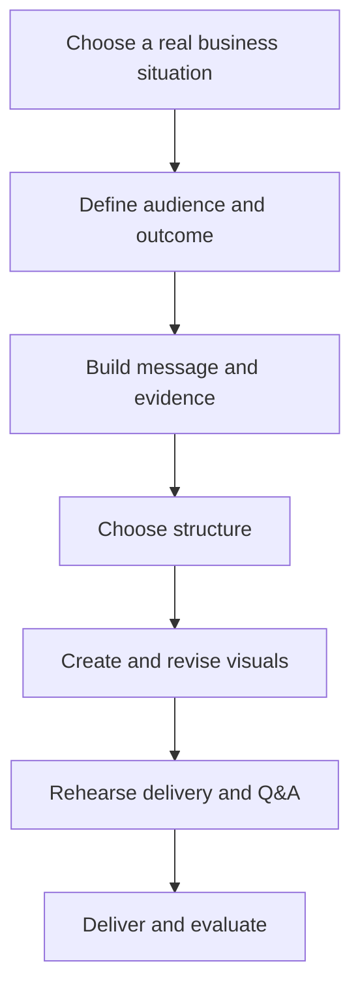

The consolidated task list is impressively thorough. It captures almost every substantive weakness in the original textbook. The production plan, however, needs significant revision before it can guide the rewrite reliably.

The central problem is that the plan is currently a technical workflow and asset-generation strategy, not yet a textbook production plan. It says how Codex and several agents might inspect files, generate assets, and rebuild manuscripts, but it does not define exactly what book will be produced.

## Most important issues

### 1. The plan makes an unconfirmed change of scope

It assumes:

> “Treat this as a rebuild of the existing Presentation Skills series units, not a standalone book.”

That does not follow from the consolidated task list or the original textbook. It may be correct based on other repository files, but it needs to be an explicit project decision, not a default assumption.

Before production begins, the plan should establish:

* Is this a replacement for the 39-page textbook?
* Is it feeding content into an existing Essentials/Standard/Long series?
* Is one textbook being produced, or three versions?
* Must the new material retain the original 13-unit structure?
* What is the required teaching time?

Until those questions are answered, the unit architecture, activity volume, assets and assessment cannot be planned accurately.

### 2. It does not contain the actual course architecture

The plan says that a unit map will be produced later, but the unit map is the most important part of the production plan.

It should already specify, provisionally:

| Unit | Main learner outcome       | Business task              | Principal language/skill | Key activity                      | Asset needed    |
| ---- | -------------------------- | -------------------------- | ------------------------ | --------------------------------- | --------------- |
| 1    | Define an audience outcome | Plan a briefing            | Purpose and audience     | Correct a weak presentation brief | Planning form   |
| 2    | State a key message        | Recommend an action        | Recommendation language  | Build a message from evidence     | Planning map    |
| 3    | Select a structure         | Organize a proposal/update | Signposting              | Compare possible structures       | Structure cards |
| …    | …                          | …                          | …                        | …                                 | …               |

Without this, it is impossible to judge progression, repetition, workload or asset requirements.

### 3. The two-day sprint and the proposed rebuild are incompatible

The consolidated list correctly presents the work as a two-day modernization sprint. The plan describes something much larger:

* auditing multiple JSON units;
* rebuilding three manuscript tiers;
* updating the image register;
* creating new assets;
* revising styles and reference DOCX files;
* generating DOCX and PDF;
* carrying out several rounds of content and visual QA;
* sending the result back to Claude and ChatGPT.

That is a production pipeline for a substantial course-development project, not a two-day rewrite.

The plan should separate:

1. **Two-day editorial rewrite**
   A complete, defensible manuscript with essential diagrams and model visuals.

2. **Post-rewrite production**
   Tier adaptation, full asset creation, layout, DOCX/PDF generation and external review.

If only two days are actually available for the whole project, the scope must be reduced much more aggressively.

### 4. The plan overcorrects toward “tool-agnostic”

Moving beyond PowerPoint is sensible, but the present wording risks turning the book into a survey of presentation software and formats.

The proposed list includes PowerPoint, Google Slides, Canva, Keynote, Figma Slides, Pitch, Gamma, PDFs, dashboards, spreadsheets and document walkthroughs. For a short ESL textbook, that is too much. It would consume space without materially improving learners’ presentation English.

I recommend:

* Teach durable visual-communication principles.
* Use PowerPoint as the principal example because it remains the most likely business environment for the target learners.
* Mention alternatives briefly where they affect preparation or delivery.
* Avoid teaching or comparing individual products unless tool selection is genuinely a course outcome.

“PowerPoint is an example, not a synonym for visuals” is a better principle than “PowerPoint must never appear to be the default.”

### 5. The plan gives assets too much prominence too early

A large part of the plan concerns image-generation methods, icon libraries, API costs, Canva, UI mockups and image registers. Those decisions should follow the instructional design.

Most of this textbook needs exact instructional graphics:

* planning frameworks;
* slide before-and-after examples;
* charts and tables;
* visual hierarchy examples;
* online/hybrid setup diagrams;
* accessibility comparisons.

These should almost all be created deterministically. AI-generated scenario illustrations and “high-polish visual metaphors” are unlikely to contribute much instructional value and could easily make the book feel generic.

The original book’s main visual problem is not the absence of illustrations. It is that its own typography, diagrams, sample slides and page architecture do not model the principles it teaches.

## Important content missing from the consolidated list

The list covers the major modernization issues, but I would add the following.

### 1. Target proficiency and language control

The target is described as “adult business ESL learners,” but no English level is set. This affects every explanation, model and task.

The plan should define:

* target CEFR range;
* expected presentation experience;
* whether learners use the book independently or with a trainer;
* expected presentation length;
* how much industry knowledge is assumed.

A book for A2–B1 learners would require very different language support from one for B2–C1 professionals.

### 2. Course duration and unit timing

The original has 13 short sections, but neither document says whether the revised course is:

* a one-day workshop;
* six 90-minute lessons;
* twelve one-hour lessons;
* a self-study workbook;
* a reference book.

Every unit needs an approximate teaching time. Otherwise, activity volume cannot be controlled.

### 3. A cumulative learning journey

The consolidated list asks for guided tasks and a final rubric, but it does not clearly require learners to develop one presentation progressively across the course.

That should be central:

This would turn the book into a coherent course rather than thirteen modernized topics.

### 4. Model-answer and feedback provision

The new noticing, editing and design activities will need:

* suggested answers;
* before-and-after versions;
* reasons why an answer is stronger;
* peer-feedback instructions;
* teacher notes where more than one answer is possible.

The plan currently mentions activities without planning their answer or feedback layer.

### 5. Spoken language for visuals and numbers

Data storytelling is included, but the plan should explicitly teach the English needed to:

* describe increases, decreases and stability;
* compare figures;
* approximate and qualify;
* distinguish percentage from percentage-point changes;
* refer to axes, periods and categories;
* explain what a chart does and does not prove;
* pronounce large numbers, decimals, percentages and currencies clearly.

For business ESL learners, this is at least as important as choosing the correct chart.

### 6. Evidence quality and ethical visual communication

“Data integrity” is mentioned, but it deserves explicit teaching:

* avoiding misleading axes and truncated scales;
* separating correlation from causation;
* stating assumptions;
* distinguishing actual results from forecasts;
* showing uncertainty;
* citing current sources;
* not using invented AI-generated evidence.

A short flawed-chart activity would address several of these points efficiently.

### 7. Presentations as interaction

The task list strengthens Q&A, but most of the course still assumes a presenter speaks and an audience listens. Current business presentations often include discussion during the presentation.

The book should cover:

* inviting input;
* checking understanding;
* responding to interruptions;
* parking questions;
* negotiating time;
* transitioning between presentation and discussion;
* agreeing on next steps and ownership.

### 8. Presenter notes versus audience documents

The plan mentions pre-reads, handouts and leave-behinds, but it should explicitly distinguish:

* slides shown during delivery;
* presenter notes;
* detailed documents sent to the audience;
* appendices or backup slides.

This would help eliminate the common problem of putting the entire report onto the slides.

### 9. Document-level accessibility

The task list focuses mainly on accessible slides. The textbook itself must also be accessible:

* real heading styles;
* logical reading order;
* sufficient contrast;
* descriptive link text;
* accessible tables;
* alt text for instructional images;
* no meaning conveyed through color alone;
* tagged PDF output.

This belongs in the production QA requirements.

### 10. Editorial voice and language policy

A brief style sheet should be established before drafting:

* British or American English;
* preferred terminology;
* contraction policy;
* treatment of “audience” as singular/plural;
* capitalization of slide titles;
* punctuation and bullet conventions;
* maximum explanation length;
* preferred instruction verbs;
* register labels;
* treatment of Japanese learner notes.

This will prevent inconsistency when multiple agents or writers contribute.

## Improvements to the production sequence

I would replace the current phase structure with this:

### Phase 1: Lock the specification

Decide:

* product and relationship to the existing series;
* target CEFR level;
* delivery mode and course length;
* number and length of units;
* final learner performance;
* principal case or sequence of cases;
* expected deliverables;
* deadline boundaries.

### Phase 2: Build the curriculum map

For every unit, specify:

* learning outcomes;
* contribution to the final presentation;
* business situation;
* language and presentation skill;
* model input;
* controlled practice;
* application task;
* output;
* required assets;
* assessment evidence.

This should be approved before prose or images are produced.

### Phase 3: Create the model presentation first

The main case should be fully designed before the units are drafted:

* audience;
* presenter role;
* business problem;
* evidence and source data;
* desired decision;
* presentation structure;
* slide sequence;
* model language;
* likely questions.

The model then becomes the spine of the course. At present, the plan treats the new case as one content item among many, when it will determine several units and most of the major assets.

### Phase 4: Draft units and activities

Draft in curriculum order, using one agreed unit template but allowing variation in activity structure. Each unit should include:

* outcome;
* short business context;
* model or example;
* noticing;
* explanation;
* controlled practice;
* application to the final task;
* reflection or feedback.

The original book’s repetitiveness should not be replaced by another visibly mechanical template.

### Phase 5: Create only instructionally necessary assets

Complete an asset brief for each visual containing:

* teaching purpose;
* exact content;
* required labels/data;
* size and format;
* accessibility text;
* source/licensing information;
* where it appears;
* whether it must remain editable.

Generate illustrations only when they clarify a scenario or relationship that text cannot communicate efficiently.

### Phase 6: Assessment and support material

Create:

* final task;
* analytical rubric;
* learner checklist;
* peer-feedback form;
* answer key;
* teacher notes;
* optional extension tasks.

### Phase 7: Editorial and visual production

Only now should the workflow move into:

* manuscript tiers, if genuinely required;
* DOCX styles;
* page layout;
* asset placement;
* cross-references;
* metadata;
* PDF production.

### Phase 8: QA

Run separate checks for:

* instructional completeness;
* ESL level and naturalness;
* factual and source accuracy;
* visual consistency;
* accessibility;
* answer-key alignment;
* assessment alignment;
* layout and PDF integrity.

## Recommended deliverables

The plan should name the exact files that signify completion. At minimum:

1. Product specification.
2. Unit-by-unit curriculum map.
3. Main case and source-data pack.
4. Complete learner manuscript.
5. Answer key or trainer notes.
6. Final presentation task and rubric.
7. Asset register and editable assets.
8. Style and terminology sheet.
9. Laid-out DOCX.
10. Accessible final PDF.
11. QA checklist and issue log.

## Bottom line

The consolidated task list is ready to serve as the editorial requirements document, with the additions above. I would not expand it much further.

The production plan is not yet ready for execution. Its main weaknesses are:

* an unconfirmed change in project scope;
* no actual unit or curriculum map;
* no defined learner level or course duration;
* an unrealistic relationship between the two-day deadline and the proposed production pipeline;
* too much early attention to tools, agents and image generation;
* insufficient definition of deliverables, model-case development, answer materials and assessment alignment.

The next revision should turn the plan from “how Codex will process the repository” into “what will be taught, in what sequence, to whom, for how long, and what concrete materials will be completed.”
