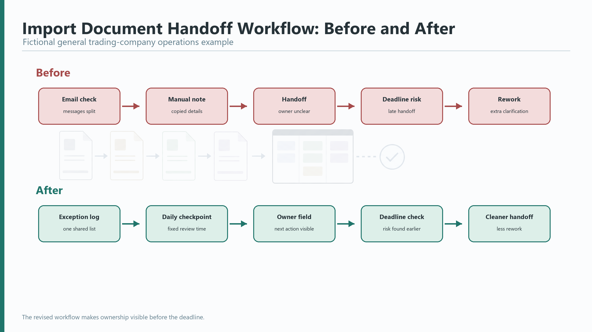
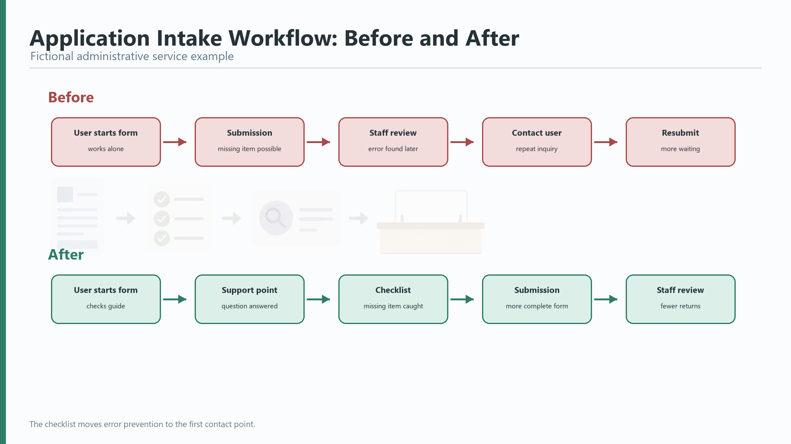

# Unit 7: Tool-Neutral Slide and Document Workflow

Presentations often fail because the material is prepared for the wrong situation. A slide deck may be useful in a live meeting, but a short PDF, dashboard walkthrough, worksheet, or pre-read may be clearer for another audience. In this unit, you choose the format and support materials that help your listeners understand, decide, or act.

## Learning Outcomes

By the end of this unit, you can:

- choose a suitable visual or document format for a presentation context
- explain the role of slides, notes, pre-reads, worksheets, follow-up handouts, and backup materials
- prepare basic export, compatibility, accessibility, and confidentiality checks

## Core Concept: Choose the Medium from the Purpose

A presentation is not a file type. It is a communication event. Before you build slides or documents, decide what the audience needs during the meeting and what they may need before or after it.

Use this tool-choice checklist:

| Question | What to check |
|---|---|
| Audience | Who will listen, and what do they need to decide or do? |
| Delivery mode | Will the presentation be in person, online, hybrid, or recorded? |
| Collaboration | Will other people edit, comment, or approve the material? |
| Data source | Is the information stable, live, confidential, or still changing? |
| Visual complexity | Do listeners need a simple overview, a chart, a workflow, or detailed evidence? |
| Accessibility | Can people read, hear, and follow the material in the actual setting? |
| Export | Do you need PDF, shared document, printed copy, or offline backup? |
| Confidentiality | Does the material contain company, client, account, personal, or restricted information? |

## Presentation English Focus

Use clear language to explain the role of each material.

Useful terms:

| Term | Simple meaning |
|---|---|
| pre-read | short material sent before a meeting or presentation |
| follow-up handout | material sent or given after a presentation |
| backup material | extra detail kept ready in case the audience needs it |
| fallback file | another file you can use if the main file does not work |
| sanitized | changed to remove sensitive or identifying information |

| Function | Useful language |
|---|---|
| Introduce a pre-read | "I sent a short pre-read so we can use today for discussion." |
| Refer to a live visual | "Please look at the workflow on this page." |
| Explain a handout or worksheet | "This worksheet is for your notes during the discussion." |
| Refer to a follow-up handout | "After the meeting, I will send a one-page summary with the next steps." |
| Explain backup material | "The detailed data is in the appendix if we need it." |
| Explain confidentiality | "The examples here use fictional data, so no client or personal information is included." |
| Move to a fallback file | "If the shared file does not open, I have a PDF version ready." |

## Model: Choosing the Right Material

Scenario: You need to present a process improvement proposal in a 20-minute internal meeting. The audience must decide whether to approve a short pilot.

| Material | Role |
|---|---|
| One-page pre-read | Gives the background before the meeting |
| Live visual pack | Shows the problem, recommendation, and expected result |
| Presenter notes | Keeps the presenter on track without reading a script |
| Appendix page | Holds extra detail for possible questions |
| PDF fallback | Protects the meeting if the editable file or platform fails |
| Follow-up summary | Confirms the decision and next steps |

Sample explanation:

"I sent the one-page background note yesterday, so I will not read it today. In the live presentation, I will focus on the current workflow, the proposed change, and the pilot decision. The detailed cause table is in the appendix if we need it during Q&A."

Optional model reference: For a banking/leasing or general trading-company version, see the business-client model in the Process Improvement Briefing Models. For a government-agency version, compare the government-agency model in the same model set.

*The revised workflow makes handoff ownership visible before the deadline.*

*The checklist moves error prevention to the first contact point.*

## Practice 1: Choose the Format

Choose the best main format for each situation. Then explain your choice in one sentence.

| Situation | Possible format choices |
|---|---|
| A manager needs a quick update before approving next steps. | short slide pack / one-page memo / dashboard walkthrough |
| A team must complete a planning task during the meeting. | worksheet / long report / appendix only |
| A senior audience wants to review details before a short decision meeting. | pre-read plus short live summary / live demo only / informal chat |
| A remote audience needs a short update they can watch later. | recorded briefing with captions or transcript / printed handout only / complex live dashboard |

Sentence frame:

"For this situation, I would use ___ because the audience needs ___."

## Practice 2: Plan Your Visual Pack

Complete the table for your own presentation or a course case.

| Material | Will you use it? | Purpose | Check needed |
|---|---|---|---|
| Pre-read | yes / no |  |  |
| Live slides or visual pack | yes / no |  |  |
| Dashboard or document walkthrough | yes / no |  |  |
| Worksheet | yes / no |  |  |
| Follow-up handout | yes / no |  |  |
| Appendix or backup pages | yes / no |  |  |
| PDF fallback | yes / no |  |  |

Useful check words: readability, access permission, version, file size, links, fonts, data source, confidentiality, offline copy.

## Practice 3: Backup and Security Check

Before an important presentation, a professional presenter checks the materials, not only the speaking notes.

Mark each item: Done, Not needed, or Still needed.

| Check | Status |
|---|---|
| The file is saved in an approved location. |  |
| A PDF fallback is ready. |  |
| Fonts, charts, media, and links work after export. |  |
| The file opens on the meeting device or platform. |  |
| A copy is available offline if allowed by company policy. |  |
| Sensitive information has been removed or masked. |  |
| Images, charts, and templates have acceptable source or license status. |  |
| Text is readable and does not depend on color alone. |  |

## Speaking Task

Prepare a 45-60 second explanation of your material choices. Use at least three expressions from the language table.

Structure:

1. State the presentation situation.
2. Explain the main live material.
3. Explain one support material.
4. Mention one backup, access, or confidentiality check.

Example start:

"For this presentation, I will use a short visual pack during the meeting because the audience needs to compare two options quickly..."

## Learner Deliverable

Submit a visual pack plus notes plan. It should include:

- the main presentation format
- any pre-read, worksheet, appendix, follow-up handout, or backup material
- one sentence explaining the role of each material
- a completed backup and confidentiality checklist

## Unit Wrap-Up

Good presentation materials are chosen, not assumed. A clear workflow helps you match the format to the audience, protect confidential information, and avoid technical problems that distract from your message.

