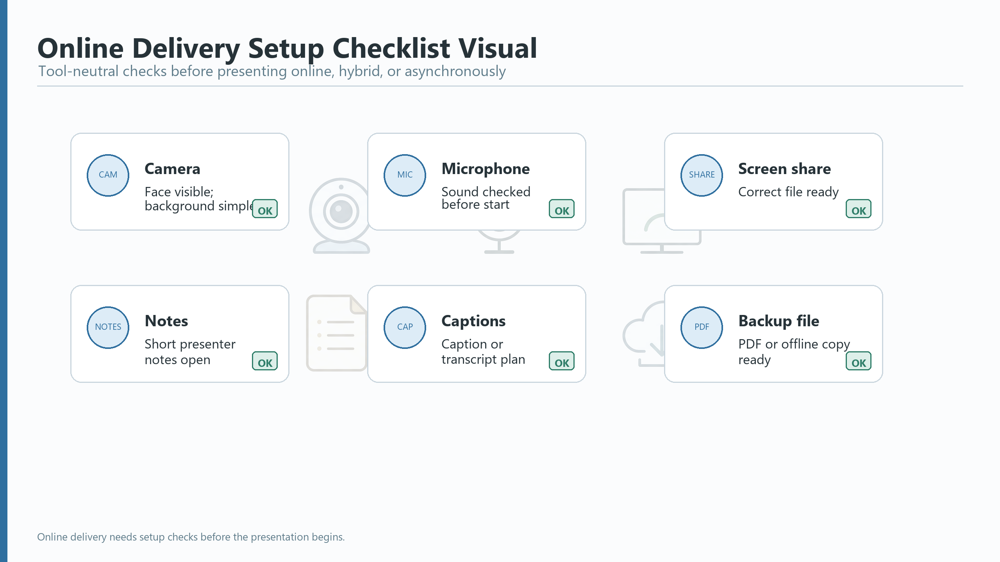

# Unit 9: Online, Hybrid, and Asynchronous (Async) Delivery

Online, hybrid, and recorded presentations need more than the same slides on a different screen. The audience may have weaker attention, different audio quality, chat messages, screen-share limits, or no chance to ask live questions. This unit helps you adapt one presentation for a remote or recorded setting.

## Learning Outcomes

By the end of this unit, you can:

- adapt an in-person presentation plan for online, hybrid, or asynchronous (async) delivery
- use clear language for screen sharing, chat, captions, remote Q&A, and technical problems
- prepare a short recorded or storyboarded version with accessibility and timing in mind

## Core Concept: Design for Attention and Access

In a room, listeners can see you, the screen, and the group atmosphere. Online or hybrid audiences receive less context. Recorded audiences receive even less because they cannot ask you to clarify in real time.

In this unit, asynchronous (async) means recorded or prepared for people to use later, without live interaction.

Adapt your delivery by checking three things:

1. Access: Can the audience see, hear, open, and understand the material?
2. Attention: Is the structure clear enough for a screen-based audience?
3. Interaction: How will people ask questions, respond, or follow up?

## Presentation English Focus

Use practical online language before, during, and after screen sharing.

Useful terms:

| Term | Simple meaning |
|---|---|
| asynchronous (async) | recorded or prepared for people to use later, without live interaction |
| screen share | showing your screen to the audience in an online meeting |
| transcript | written text of spoken words |
| fallback | another option you can use if the first plan does not work |

| Function | Useful language |
|---|---|
| Start online | "Before I start, can you hear me clearly?" |
| Explain screen sharing | "I am going to share the summary page now." |
| Check visibility | "Please let me know if the chart is too small on your screen." |
| Manage chat | "You can add quick questions in the chat, and I will pause after this section." |
| Include remote participants | "For those joining online, I will repeat the question before I answer." |
| Use captions or transcript | "A transcript will be shared after the recorded version." |
| Handle a technical problem | "The screen share seems delayed, so I will switch to the PDF version." |
| Close async | "If you have questions after watching, please send them by Friday." |

## Model: Adapting a Results Briefing

Original situation: You planned an 8-minute in-person results briefing with one before/after chart and a short recommendation.

Online adaptation:

- reduce the opening background to 45 seconds
- use a larger chart title and fewer labels
- pause after the result slide for chat questions
- keep the detailed table in an appendix or follow-up file
- prepare a PDF fallback
- repeat questions before answering

Async adaptation:

- record a 4-minute version
- state the purpose and action request in the first 30 seconds
- use clear section transitions
- add captions or prepare a transcript
- end with a follow-up instruction

Sample transition:

"I will pause here because this is the main result. If you are joining live, please add questions in the chat. If you are watching the recorded version, the supporting table is linked in the follow-up note."

Optional model reference: For a banking/leasing or general trading-company version, see the business-client model in the Project Results Briefing Models. For a government-agency version, compare the government-agency model in the same model set.

## Practice 1: Online and Hybrid Checklist

Choose one presentation you have planned. Mark each item: Ready, Need to check, or Not needed.

*Online delivery needs setup checks before the presentation begins.*

| Check | Status |
|---|---|
| Camera and microphone are tested. |  |
| Lighting makes the speaker visible. |  |
| Screen share works with the correct file or window. |  |
| Presenter notes are visible only to the presenter. |  |
| The audience can read charts and small text on screen. |  |
| Chat or reactions have a clear role. |  |
| Captions, transcript, or accessibility support is considered. |  |
| Remote Q&A plan is clear. |  |
| A PDF or backup file is ready. |  |
| Timing is shorter or more structured than the in-person version. |  |

## Practice 2: Adapt the Opening

Rewrite the in-person opening for an online or hybrid audience.

In-person opening:

"Today I will report the pilot results and recommend the next step. I will start with the objective, then show the main result, and finish with my recommendation."

Online or hybrid version:

"Before I start, ___. Today I will ___. I will pause after ___ so you can ___."

Async version:

"This short recording explains ___. By the end, you should know ___. If you have questions after watching, ___."

## Practice 3: Plan a Short Async Version

A recorded version usually needs to be shorter and more explicit than a live version. Complete the storyboard for a 3-4 minute recording.

| Time | Content | Visual or document | Spoken signpost |
|---|---|---|---|
| 0:00-0:30 | Purpose and audience value |  |  |
| 0:30-1:30 | Main situation or result |  |  |
| 1:30-2:30 | Evidence or example |  |  |
| 2:30-3:30 | Recommendation or next step |  |  |
| Final 15 seconds | Follow-up action |  |  |

Accessibility check:

- Can the audience understand the recording without watching every visual detail?
- Are captions or a transcript planned where possible?
- Is any chart readable on a laptop screen?
- Is confidential or restricted information removed?

## Practice 4: Remote Q&A Language

Match the situation to a useful response.

| Situation | Response |
|---|---|
| A participant writes a detailed question in chat. | "Thank you. I will answer the main point now and follow up on the details after checking the numbers." |
| A room participant asks a question during a hybrid meeting. | "I will repeat the question for the online participants first." |
| Screen sharing stops. | "I will switch to the PDF version and continue from the summary page." |
| No one asks a question. | "I will give everyone a moment. One common question about this result is..." |

Now write two remote Q&A responses for your own topic.

## Speaking Task

Practice a 2-minute online or hybrid segment. Include:

- one online opening or housekeeping phrase
- one screen-share or visual reference
- one planned pause for questions or chat
- one backup phrase for a technical problem

If you choose async delivery, record or rehearse a 2-minute segment and prepare a one-sentence follow-up instruction.

## Learner Deliverable

Submit one adapted online, hybrid, or async version of your presentation plan:

- the selected mode
- an adaptation checklist
- a revised opening
- one screen-share, chat, caption, transcript, or Q&A plan
- one backup or contingency phrase
- a short storyboard or rehearsal note

## Unit Wrap-Up

Remote and recorded delivery works best when the presenter designs for access, attention, and interaction. Clear language, readable visuals, planned pauses, and backup materials help the audience stay with the message even when the setting changes.

